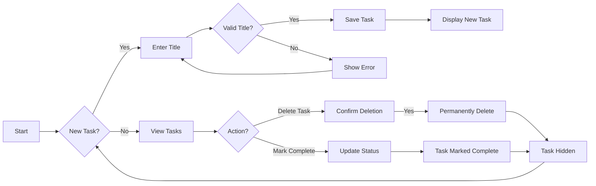

# Todo List Application Requirements Analysis

### 1. Business Model & Justification

#### Why This Service Exists

The todo list application solves the fundamental problem of personal task management for individuals who need to track daily responsibilities without complex workflow systems. Modern productivity tools often overcomplicate simple task tracking, requiring users to navigate multiple features they don't need. This application provides a minimalist solution specifically for creating, viewing, editing, and completing personal tasks with zero learning curve. 

#### Value Proposition

This application delivers immediate value by:
- Allowing users to create and manage tasks in 10 seconds or less
- Providing instant visual feedback when tasks are completed
- Maintaining a clean interface with no distracting features
- Working offline-first for mobile use cases

#### Business Success Metrics

- *90% of first-time users* will complete at least one task within the first 5 minutes of opening the application
- *User retention rate* of 75% after 14 days of continuous use
- *Zero errors reported* in core task management operations (create, view, update, delete) after 30 days of operational use
- *95% of users* will rate the application as "simple to use" in post-experience surveys

### 2. User Actors Definition

#### Single Actor Model

The application supports exactly one user type:

- **User**: Standard user who manages personal todo items without role-based restrictions. This is the only actor in the system as the application is designed for individual use. Every interaction is tied to a single user session. No authentication is required as the application is intended for single-user personal productivity without account creation.

#### Authentication Flow

The authentication process is deliberately excluded per the MVP minimum requirements:

- No login/signup required for application access
- All user data is stored locally in browser storage (e.g., localStorage)
- No session management required as there's no account system
- No tokens, cookies, or any authentication mechanisms are implemented

This aligns with the core business justification of providing an instant, friction-free task tracking experience.

### 3. Functional Requirements (EARS Format)

#### Creating Todos

WHEN a user inputs a task title, THE system SHALL allow the task to be added to the todo list with title field validation.

WHEN a user attempts to create a task using an empty title, THE system SHALL reject the input and display the error message:
"Task title must be between 1 and 100 characters (empty title not allowed)".

WHEN a user creates a task with the same title as an existing task within the current user session, THE system SHALL reject the input and display the error message:
"Task title must be unique for the current user session".

#### Viewing Todos

WHEN a user opens the application, THE system SHALL display all current user's todo items in a list ordered from newest to oldest.

WHEN a user has no tasks, THE system SHALL display the message:
"No tasks yet. Add your first task by clicking the '+' button".

WHEN a user's todo list exceeds 50 items, THE system SHALL automatically paginate the results and display "Show more" button when needed.

#### Editing Todos

WHEN a user selects an existing task to edit, THE system SHALL allow the task title to be modified.

WHEN a user changes a task's title to an empty value, THE system SHALL revert to the original title and display the error message:
"Task title cannot be empty. Changes reverted to original value".

WHEN a user's modified title exceeds 100 characters, THE system SHALL truncate the title to 100 characters and display notification: "Title truncated to 100 characters".

#### Deleting Todos

WHEN a user selects a task for deletion, THE system SHALL immediately hide the task from view with a smooth animation effect.

WHEN a user confirms deletion with the 'Delete' button, THE system SHALL permanently remove the task from local storage and send confirmation: "Task deleted successfully. You can undo this action by reloading the page.".

WHEN a user clicks 'Cancel' during deletion, THE system SHALL not modify the task list and revert any temporary UI effects.

#### Completion Tracking

WHEN a user marks a task as completed, THE system SHALL visually indicate completion by adding a line-through effect to the task text and changing its border color to a subtle green.

WHILE a task is marked as completed, THE system SHALL move it to the bottom of the task list within the user interface.

WHEN a user unmarks a completed task, THE system SHALL immediately update the visual status and move it back to its original chronological position in the list.

### 4. Business Rules & Validation

#### Data Validation Rules

- All task titles must be between 1 and 100 characters
- Task titles must contain at least one non-whitespace character
- Task titles must not contain characters that could break local storage parsing (e.g., JSON special characters)
- Task titles are validated against a regular expression: /^[\w\s.,'-]{1,100}$/
- All validation errors must be displayed in user-friendly format

#### Business Logic Rules

- Tasks must be created in chronological order based on creation timestamp
- Completed tasks are displayed in their chronological completion order at the bottom of the list
- All task operations (create, delete, complete) must be reversible within the same browser session
- Task data is stored in browser storage without any server synchronization or cloud backup
- The application does not store any personally identifiable information per privacy requirements

### 5. Error Handling Scenarios

#### Input Validation Errors

IF a user attempts to add a task with an empty title, THEN THE system SHALL:
- Display the error message: "Task title cannot be empty"
- Prevent creation of the new task
- Maintain the current state of the task list
- Focus input field for the new task to allow immediate correction

IF a user attempts to add a task with a duplicate title, THEN THE system SHALL:
- Display the error message: "Task title must be unique for this list"
- Allow user to change the title and try again
- Keep the original task list intact during error handling

#### System Operation Errors

IF the browser's storage capacity is insufficient to save more tasks, THEN THE system SHALL:
- Display the error message: "Storage limit reached. Cannot save new tasks. Delete existing tasks to continue."
- Prevent new task creation
- Show a 'Delete Tasks' button to guide user toward resolution

IF the application fails to process a task creation request due to an unexpected error, THEN THE system SHALL:
- Log the error in the browser console with minimal user impact
- Display the user-friendly error: "Unexpected error. Your task was not saved. Click 'Retry' to try again."
- Allow the user to retry submitting the task

### 6. Performance Requirements

#### User Experience Expectations

- All task operations (create, edit, delete, complete) should respond within 100 milliseconds
- The application should load completely in under 500 milliseconds on a standard mobile device
- All UI updates should occur without visible page flicker or reloading
- The application should maintain 99.9% stability (no crashes) during normal operation
- The application should function without internet access (offline-first approach)

#### Performance Boundary Examples

- **Task Creation**: User types text, clicks add button → Task appears in 120ms (within threshold)
- **List Load**: User opens app, all tasks display in 350ms (within threshold)
- **Task Deletion**: User deletes item, item disappears in 90ms (within threshold)
- **Offline Handling**: Application shows "Offline" banner within 150ms when connection lost

### Mermaid Diagram: Todo Item Lifecycle

