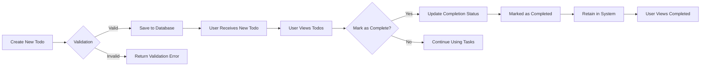

## Business Rules and Validation Constraints

### Document Purpose

This document establishes all business rules, data validation requirements, and process constraints for the Todo List Application. It provides backend developers with complete business logic details to implement the requested minimum viable functionality. The system will focus exclusively on document-driven requirements without any technical implementation details.

---

### 1. Data Validation Rules

#### 1.1 Todo Item Validation

WHEN a user attempts to create a new todo item, THE system SHALL enforce the following requirements:

- THE todo item title SHALL be required with minimum length 1 character and maximum length 100 characters
- THE todo item title SHALL NOT contain any characters that would block safe data processing (e.g., SQL injection patterns, special formatting commands)
- THE todo item title SHALL be case-sensitive but NOT require capitalization to be valid
- THE todo item description SHALL be optional with maximum length 200 characters
- THE todo item description SHALL NOT contain any SQL injection patterns
- THE system SHALL reject creation attempt if title length is invalid

WHEN validating a todo item creation request, THE system SHALL:

- Return HTTP 400 Bad Request with validation error message when title is empty or invalid
- Parse exactly authorized fields with strict requirement: title is required, description is optional
- Display clear error messages specifying which validations failed (e.g., "Title must be between 1-100 characters")

#### 1.2 Todo Item Modification Validation

WHEN a user attempts to update an existing todo item, THE system SHALL enforce:

- ONLY the title and description fields may be updated, no other fields
- THE title SHALL maintain length requirements (1-100 characters)
- THE description SHALL maintain the maximum length of 200 characters
- THE system SHALL reject modification attempts if validation fails

WHEN updating a todo item, THE system SHALL:

- Return HTTP 400 Bad Request with clear validation error when fields are invalid
- Not allow changes to the todo item's completion status via modification operation (this happens via separate completion action)
- Maintain clean error messages that identify exactly which validation failed

---

### 2. Process Constraints

#### 2.1 Todo Item Mutation Process

For all CRUD (Create, Read, Update, Delete) operations, THE system SHALL follow these constraints:

- CREATE operations MUST result in a new todo item with unique identifier
- READ operations SHALL return todo items sorted by date created (newest first)
- UPDATE operations MUST only change fields explicitly defined (title, description), no other fields
- DELETE operations MUST remove the todo item permanently with no recovery option
- ALL operations SHALL be executed by the user's account context
- ALL operations SHALL require valid user authentication

#### 2.2 State Management Constraints

WHEN a user marks a todo item as complete, THE system SHALL:

- Update the completion status to TRUE (not a boolean value in output)
- Mark the completion timestamp to the current system time
- Do not allow marking an item completed more than once
- The completion state SHALL not alter other item properties (title, description, etc.)

WHEN a todo item is marked as complete, THE system SHALL:

- Return the updated todo item with completion status as "completed"
- Not alter the original title or description
- Keep the completion timestamp accurate to within one second

---

### 3. Business Logic

#### 3.1 Core Todo Business Rules

THE core business rule of the Todo application is: "Each item represents a single, transient obligation that the user is tracking for completion. The application does not support collaboration, due dates, or priority levels."

This rule means:

- ONLY ONE user can own a todo item (no shared items)
- No business rules exist for item categorization or grouping
- No due date business rules exist for scheduling (all items are open-ended)
- No priority level business rules (all items are equal priority)
- Items are not intended to connect to other items or services

WHEN a user adds a new todo item, THE system SHALL:

- Create the item with completion status set to FALSE
- Assign the item to the current authenticated user
- Return the new item details immediately
- Not include any fields outside of title, description, and completion status

#### 3.2 Completion State Business Logic

THE completion state business model is: "A todo item is either incomplete or completed. Once completed, it remains completed with no possibility of being returned to incomplete state."

WHEN a user attempts to mark an item as complete:

- THE system SHALL validate the request:
  - Item must exist
  - Item must not already be marked as completed
  - User must own the item
- IF the item is already completed, THEN THE system SHALL return HTTP 409 Conflict
- IF the item does not exist or user doesn't own it, THEN THE system SHALL return HTTP 404 Not Found

WHEN marking an item as completed:

- THE system SHALL maintain the time of completion
- THE system SHALL keep the item's original content
- THE system SHALL not alter assignment to other users
- THE system SHALL not delete the item (it is preserved in completed state)

---

### 4. Edge Case Handling

#### 4.1 Create Edge Cases

WHEN a user attempts to create a todo item with an empty title:
- THE system SHALL return HTTP 400 Bad Request
- THE response SHALL include the error: "Title must be at least 1 character long"

WHEN a user attempts to create a todo item with a title over 100 characters:
- THE system SHALL return HTTP 400 Bad Request
- THE response SHALL include: "Title cannot exceed 100 characters"

WHEN a user attempts to create a todo item with SQL injection patterns in title:
- THE system SHALL reject the request
- THE response SHALL include: "Title contains invalid characters"

#### 4.2 Update Edge Cases

WHEN a user attempts to update a todo item with an empty title:
- THE system SHALL reject the request
- THE response SHALL include: "Title must be at least 1 character long"

WHEN a user attempts to update a todo item with a title over 100 characters:
- THE system SHALL reject the request
- THE response SHALL include: "Title cannot exceed 100 characters"

WHEN a user attempts to update a todo item with forced description over 200 characters:
- THE system SHALL truncate to 200 characters
- THE response SHALL include the truncated description

#### 4.3 Completion Edge Cases

WHEN a user attempts to mark a todo item as completed that's already completed:
- THE system SHALL return HTTP 409 Conflict
- THE response SHALL include: "Todo item is already completed"

WHEN a user attempts to mark a non-existent todo item as completed:
- THE system SHALL return HTTP 404 Not Found
- THE response SHALL include: "Todo item not found"

WHEN a user attempts to mark a todo item as completed that they don't own:
- THE system SHALL return HTTP 401 Unauthorized
- THE response SHALL include: "You don't have permission to mark this item as complete"

---

### System View and Relationships

#### Mermaid Flow Diagram (Todo Lifecycle)

#### Document Relationship

This document provides the complete business rule specification that underpins the functional requirements in [03-functional-requirements.md](./03-functional-requirements.md). The validation logic, state management rules, and edge case handling described here are the business foundation that developers will implement in this service.

The authentication rules described in [02-user-actors.md](./02-user-actors.md) are required to ensure all operations are performed by authenticated users and that items are correctly assigned to owners.

> *Developer Note: This document defines **business requirements only**. All technical implementations (architecture, APIs, database design, etc.) are at the discretion of the development team.*