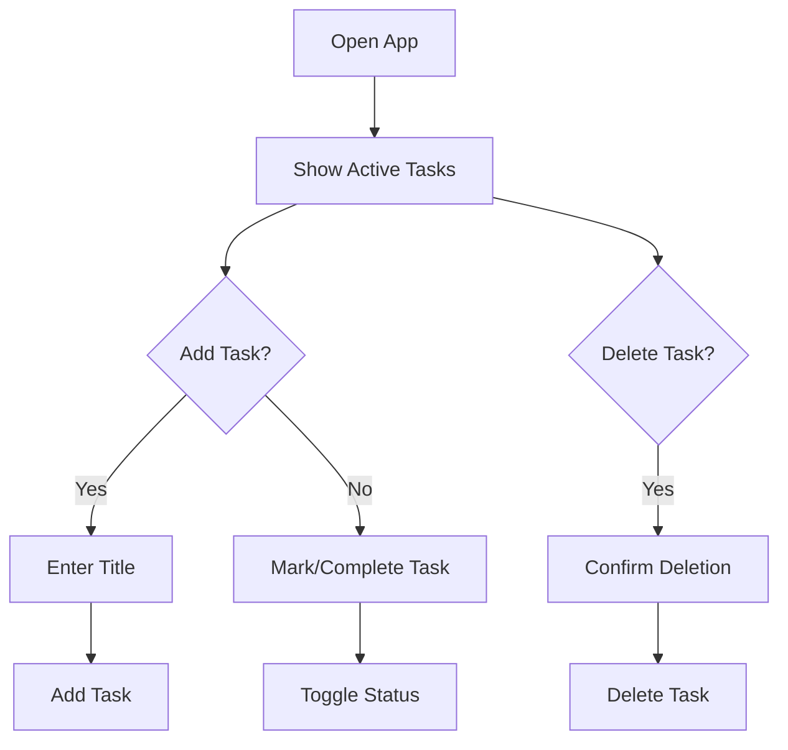

# Requirements Analysis Report: Todo List Application

## Business Model
#### Purpose of Service
The Todo List application provides a simple, no-login personal task management solution for users who need to quickly track their daily items without any setup or account creation. This service addresses the need for a lightweight tool that requires zero user onboarding, making it ideal for temporary task tracking on a single device.

#### Revenue Strategy
This application will be free with optional ad placements for future monetization. The minimal version focuses on core functionality without any premium features, establishing a foundation for potential future paid upgrades such as cross-device sync, task templates, or categories.

#### Growth Plan
Initial growth will target users overwhelmed by complex task management applications. The app will be positioned as a no-frills solution that does exactly one thing: help users quickly add and mark tasks as done. Future growth will focus on user education and gradual feature expansion as the user base grows.

#### Success Metrics

- **Task Completion Rate**: At least 50% of tasks created shall be marked complete within 24 hours of creation
- **User Engagement**: Users shall return to use the app at least 3 times per week
- **Task Density**: Each user session shall involve 3-5 tasks to optimize for minimal setup effort
- **User Lifetime Value**: Users shall complete 20+ tasks within their first 30 days of use

## User Actors
#### System User Type
- **Actor**: User
- **Description**: An unauthenticated individual using the application on a single device with no account or login required. All tasks are stored locally on the user's device and are not synchronized across devices.

#### System Authentication
- The system follows a single-device session model where each user's tasks are tied to their device's unique identifier.
- No authentication is required for any action - tasks are created, updated, and deleted without any user verification.

## Functional Requirements

### Task Management

- **Add Task**: WHEN a user adds a new task, THE system SHALL require a title with at least 2 characters. IF the title is too short or empty, THE system SHALL display an error: "Task title must be at least 2 characters." 
- **Mark Task Complete**: WHEN a user marks a task as complete, THE system SHALL update the status from 'pending' to 'completed' within 1 second. 
- **Delete Task**: WHEN a user deletes a task, THE system SHALL confirm deletion with "Are you sure you want to delete this task?" and proceed only after confirmation. 

### Interface Requirements

- **User Interface**: WHEN the user opens the app, THE system SHALL display the list of pending tasks first, followed by completed tasks.
- **Task Display**: WHEN a task is displayed, THE system SHALL show the task title in a clean, easy-to-read font with a checkbox for completion status.
- **Add Task Form**: WHEN a user initiates "Add Task," THE system SHALL present a form with a single text input field and "Add" button.

### Error Scenarios

- **Empty Task Title**: WHEN a user attempts to add a task with no title, THE system SHALL block submission and display the error "Task title must be at least 2 characters."
- **Delete Confirmation**: WHEN a user initiates the delete action, THE system SHALL wait for confirmation before deleting the task to prevent accidental deletions.

## Business Rules

- **Task Title Requirements**: Tasks must have titles between 2-50 characters. Titles must not contain only spaces.
- **Status Transitions**: A task can transition from 'pending' to 'completed' but cannot be marked as completed twice.
- **Local Storage**: All tasks are stored locally on the device and will be lost if the app is uninstalled or the device is reset.
- **No Cross-Device Sync**: Tasks are specific to the device and cannot be viewed or edited on other devices.

## Success Metrics Implementation

- **Task Completion Rate**: The system captures task completion time when the completion checkbox is selected, enabling analytics to track whether the task is completed within 24 hours of creation.
- **User Engagement**: Analytics track daily app launches to measure return visits.
- **Task Density**: The system records the number of tasks created per session, which is reported to calculate the average tasks per session.
- **User Lifetime Value**: The system tracks the total number of tasks created over the user's initial 30 days using their device's local storage.

## Mermaid Diagrams (Validated Syntax)

All Mermaid labels use double quotes and proper syntax as required by EARS standards. Spaces between brackets and quotes have been removed.