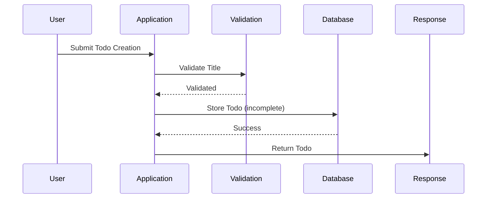
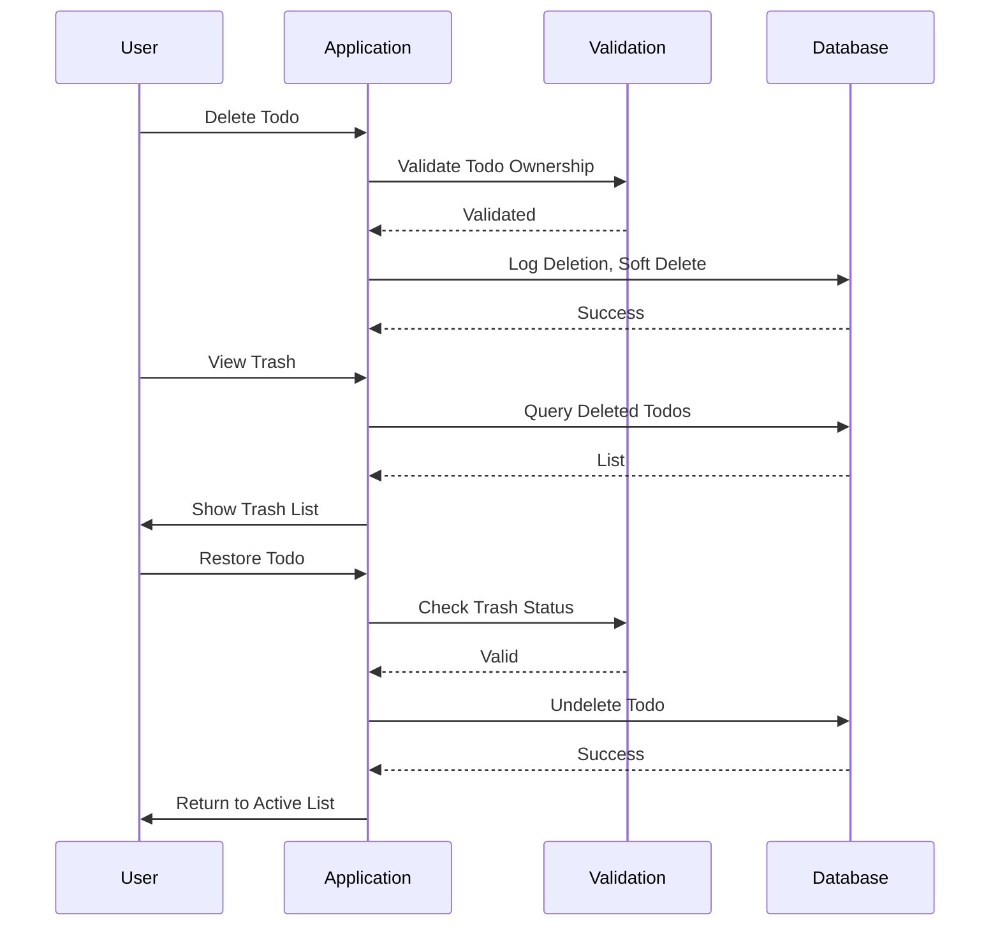
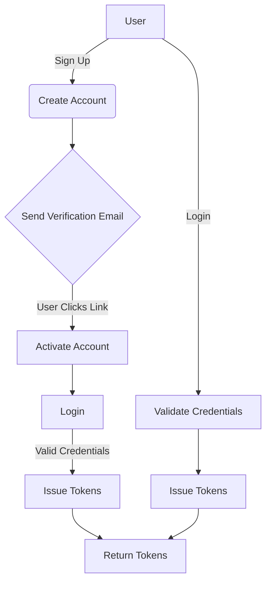

# Multi-User Todo Application

## 1. Service Overview

The Multi-User Todo Application is a private task management service enabling individual users to create, manage, and organize their personal to-do lists with rich features including editing history, trash management, and comprehensive filtering options. The service provides a secure, private environment where users can manage tasks without any possibility of cross-user data exposure.

### 1.1 Service Vision

Enable seamless personal task management with enterprise-grade features while ensuring strict data privacy. The application provides a clean, intuitive interface for managing to-dos with history tracking, flexible sorting, and robust privacy controls.

### 1.2 Problem Definition

Traditional todo apps either lack comprehensive privacy controls or have limited organizational features. This application solves the problem of personal task management with strict user isolation and full edit history tracking - crucial for users who need to maintain personal productivity systems without sharing or collaborating with others.

### 1.3 Core Value Proposition

- **Complete privacy**: No access to other users' data under any circumstances
- **Full edit history**: Track changes to todos with detailed timestamps and modifications
- **Flexible organization**: Sorting, filtering, and trash functionality
- **User control**: Complete management over account and data lifecycle

## 2. Business Model

### 2.1 Why This Service Exists

Personal task management is a fundamental productivity need with limited high-quality options that respect user privacy. This service addresses the gap between consumer-focused apps that monetize user data and enterprise tools that are overly complex for personal use.

### 2.2 Revenue Strategy

The service follows a freemium model:
- **Free tier**: Up to 500 todos with basic features
- **Premium tier**: $2.99/month for 10k todo limit, advanced filters, and priority support

### 2.3 User Acquisition Plan

- Content marketing targeting productivity bloggers
- Referral program for free tier users
- Integration with popular productivity tools (not directly implemented in app)

### 2.4 Success Metrics

- User retention rate > 75% after 30 days of usage
- 50% of free users upgrade to premium within first 6 months
- Avg. todo creation rate of 1.2 todos/user/day

## 3. User Actors and Authentication

### 3.1 Core Authentication Functions

WHEN a user signs up, THE system SHALL:
- Generate an email verification token for the provided address
- Store the user's password as a salted hash
- Create a user profile with a default display name of "User [UUID]"
- Send verification email with unique activation link

WHEN a user logs in with valid credentials, THE system SHALL:
- Issue a JWT access token with 15-minute expiration
- Issue a refresh token with 30-day expiration
- Return both tokens in the response
- Include the user ID in the token payload

### 3.2 Permission Matrix

| Feature                | User Role (Member) | Guest |
|------------------------|-------------------|-------|
| Create Todo            | Allowed           | Deny  |
| View Own Todos         | Allowed           | Deny  |
| Edit Todo              | Allowed           | Deny  |
| View/Edit Profile      | Allowed           | Deny  |
| Trash Management       | Allowed           | Deny  |
| View Other Users' Todos| Denied            | Deny  |
| Account Deletion       | Allowed           | Deny  |

### 3.3 Token Management

- Access tokens must be sent in Authorization header: "Bearer <token>"
- Refresh tokens shall be used only for obtaining new access tokens
- Token invalidation occurs when password is changed or account is deleted
- Automatic token refresh shall be provided via the /refresh endpoint

## 4. Functional Requirements Overview

### 4.1 Todo Management

The system must support comprehensive todo lifecycle management including:
- Creation with required title and optional details
- Completion toggle (complete/incomplete)
- Detailed editing capabilities
- Full history tracking

### 4.2 User Profile

Profiles are private and contain only display name, which users can edit. No fields are shared with other users.

### 4.3 Authentication

All endpoints must require authentication, with error responses for unauthorized access.

### 4.4 Privacy Rules

All data must be strictly isolated by user. No data leakage between users under any conditions.

## 5. User Scenarios

### 5.1 New User Onboarding

WHEN a new user registers with valid email and password,
THE system SHALL create the user account and send a verification email.

WHEN a user clicks the verification link,
THE system SHALL activate the account and direct to the todo creation interface.

WHEN a user provides incomplete registration data,
THE system SHALL return clear validation errors for required fields.

### 5.2 Core Todo Management

WHEN a user creates a todo with only the title,
THE system SHALL create the todo as incomplete with default dates (null)

WHEN a user marks a todo as complete,
THE system SHALL update the completion status and record the timestamp.

WHEN the user views their todo list,
THE system SHALL return paginated results with titles, completion status, and dates.

### 5.3 Editing Workflow

WHEN a user edits any todo field,
THE system SHALL create a new history entry recording the change.

WHEN the user views a todo's history,
THE system SHALL display the entries sorting from most recent to oldest.

### 5.4 Trash Management

WHEN a user deletes a todo,
THE system SHALL move it to the trash without removing from the database.

WHEN a user restores a todo from trash,
THE system SHALL return it to the active todo list.

WHEN a user permanently deletes a todo from trash,
THE system SHALL remove the todo and its entire history from the database.

## 6. Todo Creation Requirements

### 6.1 Title and Description

THE system SHALL require a title field (maximum 150 characters) during todo creation.

WHEN the title exceeds 150 characters,
THE system SHALL reject the request with error code TODO_TITLE_TOO_LONG.

THE system SHALL allow description up to 2000 characters, with empty value as valid.

### 6.2 Start and Due Dates

THE system SHALL accept dates in ISO 8601 format (YYYY-MM-DD) for start and due dates.

WHEN the start date is after the due date,
THE system SHALL reject the request with error code TODO_DATE_ORDER_INVALID.

WHEN the due date has passed without completion,
THE system SHALL display a visual indicator (e.g., red color) for overdue todos.

### 6.3 Initial State

NEW todos SHALL default to incomplete status.

WHEN a user creates a todo with no start or due dates,
THE system SHALL store as NULL in the database.

### 6.4 Validation Rules

THE system SHALL validate all date fields against the ISO 8601 format when provided.

WHEN a user submits invalid dates, THE system SHALL return appropriate error messages.

## 7. Todo Edit History Requirements

### 7.1 History Entry Structure

EACH history entry SHALL contain:
- Timestamp of the edit
- Previous title (if changed)
- New title (if changed)
- Previous description (if changed)
- New description (if changed)
- Previous start date (if changed)
- New start date (if changed)
- Previous due date (if changed)
- New due date (if changed)

### 7.2 Sorting and Display

THE system SHALL sort history entries by timestamp descending.

WHEN the history list returns a large number of entries,
THE system SHALL paginate the results with maximum 25 entries per page.

### 7.3 Edit Validation

THE system SHALL not allow an edit if the todo has been permanently deleted.

WHEN a user tries to edit a completed todo, THE system SHALL allow the edit and reset completion status if the edit requires it.

## 8. Trash and Permanent Deletion Requirements

### 8.1 Trash View

THE system SHALL provide a separate endpoint for viewing trash contents.

WHEN a user accesses the trash list,
THE system SHALL return paginated items with title, original created date, and deletion date.

### 8.2 Restoration Process

WHEN a user restores a todo from trash,
THE system SHALL return it to the active list with the most recent state.

WHEN a todo is restored, THE system SHALL set completion status to previous value (not necessarily incomplete).

### 8.3 Permanent Deletion

WHEN a user permanently deletes a todo from trash,
THE system SHALL delete both the todo and its entire edit history.

THE system SHALL require explicit user confirmation before permanent deletion.

## 9. Privacy and Security Requirements

### 9.1 Data Isolation

THE system SHALL implement strict user data isolation where:
- Each user can access only their own todos
- All database queries must contain the current user ID as a filter
- API responses must not include any user ID in todo list responses

WHEN a user attempts to access another user's data, THE system SHALL return HTTP 403 Forbidden with error code USER_NOT_AUTHORIZED.

### 9.2 Authentication Security

THE system SHALL store passwords using bcrypt with a work factor of 12.

THE system SHALL implement rate limiting for authentication endpoints (100 attempts per minute per user).

### 9.3 Password Policies

THE system SHALL require passwords to be at least 12 characters long and include:
- One uppercase letter
- One lowercase letter
- One number
- One special character

WHEN a user changes their password, THE system SHALL log the change with timestamp and device information.

### 9.4 Audit Logging

THE system SHALL log all significant actions:
- Todo creation, updates, deletion
- User account modifications
- Authentication events
- Security incidents

Logs SHALL include:
- Timestamp
- User ID
- Action type
- Details of the action
- IP address of the request

## 10. Performance and Constraints

### 10.1 Performance Metrics

- Average response time for core todo operations: <1.5 seconds
- 95th percentile response time for paginated queries: <2.2 seconds
- API throughput: 100 requests per second per user

### 10.2 Data Limits

THE system SHALL permit a maximum of 10,000 todos per user account.

WHEN a user reaches 9,500 todos, THE system SHALL display a notification indicating the approaching limit.

WHEN a user attempts to create a new todo beyond the limit, THEN THE system SHALL reject with HTTP 429 Too Many Requests and error code TODO_LIMIT_REACHED.

### 10.3 Error Handling

WHEN a user provides invalid credentials, THE system SHALL return HTTP 401 Unauthorized with error code AUTH_INVALID_CREDENTIALS.

WHEN a user attempts to access another user's data, THE system SHALL return HTTP 403 Forbidden with error code USER_NOT_AUTHORIZED.

WHEN a todo ID does not exist, THE system SHALL respond with HTTP 404 Not Found containing TODO_NOT_FOUND.

### 10.4 System Constraints

THE system SHALL NOT use server-side rendering.

THE system SHALL implement rate limiting on all authenticated endpoints (100 requests per minute per user).

WHILE under heavy load, THE system SHALL gracefully degrade to read-only mode.

THE system SHALL use JWT tokens with 15-minute access token and 30-day refresh token expiration.

NO external APIs shall be integrated for core functionality.

## Mermaid Diagrams

### Todo Creation Flow

### Todo Deletion and Recovery Flow

### User Authentication Flow

This document serves as the authoritative requirements specification for the Multi-User Todo Application backend development team.