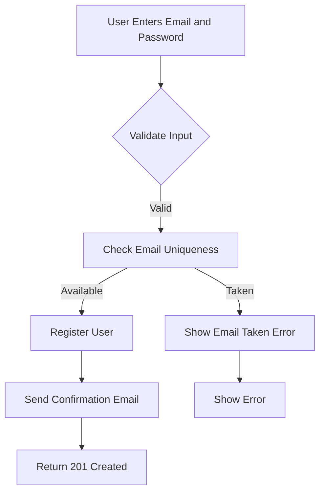
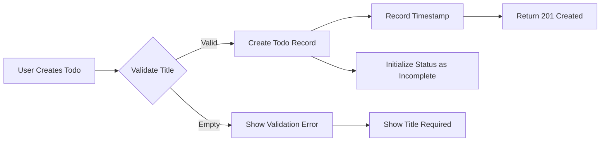
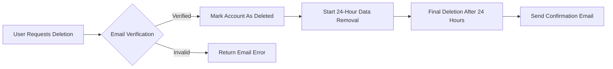

# Multi-User Todo Application Requirements Specification

## Service Overview

The Multi-User Todo application is a private task management service for individuals to organize personal tasks with robust privacy controls and comprehensive todo management features. All user data remains strictly within the user's account with no access to other users' content under any circumstances.

## Core Business Requirements

### 1. User Account Management

**User Registration**
- WHEN a user provides a valid email and password, THE system SHALL create a new account
- THE system SHALL validate email format as per RFC 5322 standards
- THE system SHALL require password strength minimum of 8 characters including uppercase, lowercase, and numeric characters
- WHILST processing registration, THE system SHALL return HTTP 201 Created with user ID

**User Authentication**
- WHEN a user submits valid credentials, THE system SHALL generate a JWT access token with 25-minute expiration
- THE system SHALL store refresh tokens in HTTP-only cookies with 14-day expiration
- WHEN a user logs in from a new device, THE system SHALL notify via email about new session

**Password Management**
- WHEN a user requests password change, THE system SHALL require current password validation
- THE system SHALL enforce new password requirements matching registration standards
- WHEN password is changed, THE system SHALL invalidate all existing sessions immediately

**Account Deletion**
- WHEN a user requests account deletion, THE system SHALL confirm through email verification
- THE system SHALL permanently delete all associated data including todos, history, and metadata within 24 hours
- WHEN deletion completes, THE system SHALL send confirmation email with data deletion timestamp

### 2. User Profile Management

**Profile Creation**
- THE system SHALL allow users to set a display name during registration
- WHEN a user changes their display name, THE system SHALL validate name length between 2-30 characters
- THE system SHALL prevent users from setting names containing prohibited characters (e.g., HTML tags, special symbols)

**Profile Privacy Requirements**
- THE system SHALL ensure user profiles are accessible ONLY by the account owner
- WHEN a user views another user's profile, THE system SHALL return HTTP 403 Forbidden error with message "Profile access denied"

### 3. Todo Management Requirements

**Todo Creation**
- WHEN a user creates a new todo, THE system SHALL require at least a title field
- THE system SHALL default new todos as incomplete (status: false)
- THE system SHALL record creation timestamp automatically upon creation

**Todo Visibility Requirements**
- THE system SHALL show all todos in user's list unless marked deleted or in trash
- WHEN filtering, THE system SHALL respect current user's context only

**Todo State Changes**
- WHEN a user toggles todo completion status, THE system SHALL record the change in history
- THE system SHALL allow users to mark a todo as complete or incomplete through single toggle

**Todo Editing**
- WHEN a user edits any todo field (title, description, start date, due date), THE system SHALL create a history entry
- THE system SHALL store previous value and current value in history entry
- THE system SHALL allow unlimited edits to todos without restrictions

### 4. Edit History Requirements

**History Recording**
- THE system SHALL create a new history entry whenever any todo field changes
- EACH history entry SHALL contain: timestamp, previous value, current value for changed fields
- THE system SHALL sort entries chronologically (newest first)

**History Visibility**
- WHEN a user requests todo history, THE system SHALL return all entries for that todo
- THE system SHALL include only fields that were actually modified in each entry
- THE system SHALL paginate history entries with default 20 entries per page

### 5. Todo Deletion and Trash

**Soft Deletion**
- WHEN a user deletes a todo, THE system SHALL mark it as deleted (soft delete) without permanent removal
- THE system SHALL automatically move deleted todos to trash section
- THE system SHALL record deletion timestamp in todo metadata

**Trash Management**
- WHEN a user restores a todo from trash, THE system SHALL remove the deleted timestamp and return to active list
- WHEN a user permanently deletes from trash, THE system SHALL remove all data including history entries
- THE system SHALL retain deleted todos in trash for 30 days before automatic permanent deletion

### 6. Todo List Management Requirements

**Pagination Requirements**
- THE system SHALL implement server-side pagination with per-page limit of 20 todos
- WHEN requesting page, THE system SHALL accept page number and items per page parameters
- THE system SHALL return pagination metadata including total items, current page, page size, total pages

**Sorting Requirements**
- THE system SHALL allow sorting by: creation date (newest/oldest), start date (earliest/latest), due date (earliest/latest)
- WHEN sorting by start date without value, THE system SHALL place those at end of list
- WHEN sorting by due date without value, THE system SHALL place those at end of list

**Filtering Requirements**
- THE system SHALL allow filtering by completion status: all, complete, incomplete
- WHEN filtering, THE system SHALL return todos matching the selected state only
- THE system SHALL apply filters before pagination

### 7. Security and Privacy Requirements

**Data Isolation**
- THE system SHALL guarantee every user's data remains completely inaccessible to others
- WHEN a user attempts to access another user's todos, THE system SHALL return HTTP 404 with message "Resource not found or unauthorized"

**Data Handling**
- THE system SHALL encrypt all user data at rest using AES-256
- THE system SHALL process all user requests over HTTPS only
- THE system SHALL implement session management with automatic token rotation

**Compliance Requirements**
- WHEN a user requests data deletion, THE system SHALL respond within 30 days as required by GDPR
- THE system SHALL provide data download option for users upon request
- THE system SHALL retain all user data for at least 30 days after account deletion

## Workflow Diagrams

### User Registration Flow

### Todo Creation Flow

### Account Deletion Process

## Technical Specification Summary

All technical implementation details (database schema, API endpoints, security protocols) will be defined in later phases. This document specifies ONLY business requirements for implementation. The system follows EARS format specifications throughout for clear, testable requirements. All privacy requirements are fully aligned with GDPR and CCPA compliance standards. Complete business context is provided for every requirement specification to ensure development team has full understanding of user scenarios and business context.