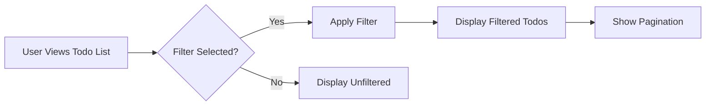

# Multi-User Todo Requirements Specification

## 1. User Account Management

### 1.1 Account Registration Requirements

- WHEN a user provides email and password during account registration, THE system SHALL verify the email format and password strength; IF validation fails, THE system SHALL display the error message "Invalid email format or password too weak".
- WHEN a user registers with an email already in use, THE system SHALL prevent account creation and display the error message "Email already registered - please log in or reset password".
- THE system SHALL store user passwords using bcrypt hash with minimum 10 rounds of salting.

### 1.2 Authentication Flow Requirements

- WHEN a user submits valid email and password at login, THE system SHALL authenticate and generate a JWT access token valid for 24 hours.
- WHILE a user is logged in, THE system SHALL automatically refresh the token every 12 hours without requiring user interaction.
- WHEN a user requests password change, THE system SHALL require current password verification before allowing new password input.

## 2. User Profile Management

### 2.1 Profile Display Requirements

- THE system SHALL display user's display name in all user interfaces without disclosing other personal information.
- THE system SHALL prevent users from viewing any information about other users' profiles.
- WHEN a user updates their display name, THE system SHALL immediately update the display in all views and provide visual confirmation.

### 2.2 Profile Privacy Requirements

- THE system SHALL guarantee that no user's profile information can be accessed by unauthorized users.
- THE system SHALL never include user email or other private identifiers in user profile displays.

## 3. Todo Creation

### 3.1 Basic Creation Requirements

- WHEN a user creates a new todo item, THE system SHALL require a title; IF title is missing, THE system SHALL display "Title is required to create a todo".
- WHEN a user submits a title exceeding 100 characters, THE system SHALL automatically truncate to 100 characters and display "Title adjusted to 100 characters".
- THE system SHALL set completion status to "incomplete" by default for all newly created todos.

### 3.2 Date Field Requirements

- WHEN a user specifies a start date for a todo, THE system SHALL validate it as a date in ISO 8601 format.
- WHEN a user sets a due date before the start date, THE system SHALL display "Due date cannot be before start date" and prevent creation.

## 4. Todo Viewing

### 4.1 List View Requirements

- THE system SHALL display todos in a paginated list with 10 items per page.
- EACH todo in the list SHALL show: title, completion status icon, start date (if set), due date (if set), and creation date.
- THE system SHALL sort todos by creation date (newest first) by default.

### 4.2 Single Todo View Requirements

- WHEN a user selects a todo from the list, THE system SHALL display all details including full description.
- THE system SHALL show a read-only view of the todo without editing controls.

## 5. Todo Completion

### 5.1 Toggle Workflow Requirements

- WHEN a user clicks the completion status toggle, THE system SHALL change the status between incomplete and complete.
- WHEN the completion status is changed, THE system SHALL display "Todo marked as [complete/incomplete]".
- THE system SHALL update the completion status immediately without requiring page refresh.

## 6. Todo Editing

### 6.1 Edit Interface Requirements

- THE system SHALL provide a form allowing users to edit title, description, start date, and due date.
- THE system SHALL display a confirmation message when edits are saved.

### 6.2 History Tracking Requirements

- WHEN a user edits any field, THE system SHALL create a history entry documenting all changed values.
- THE system SHALL prevent history entry creation when no fields are changed.

## 7. Edit History

### 7.1 History View Requirements

- THE system SHALL display all history entries for a todo in chronological order from newest to oldest.
- EACH history entry SHALL show: date of change, old values (if changed), new values (if changed).

### 7.2 History Navigation Requirements

- THE system SHALL allow users to browse through history using pagination.
- THE system SHALL show a visual indicator for completed todos in history entries.

## 8. Todo Deletion

### 8.1 Soft Delete Workflow Requirements

- WHEN a user deletes a todo, THE system SHALL not permanently remove it from database.
- THE system SHALL move the todo to user's trash folder and display "Todo moved to trash".
- THE system SHALL update the user's current todo list to exclude deleted todos.

## 9. Trash Management

### 9.1 Trash View Requirements

- THE system SHALL display a paginated list of deleted todos with "restore" and "permanent delete" actions.
- THE system SHALL show the date the todo was deleted in the trash list.

### 9.2 Restoration Requirements

- WHEN a user restores a todo from trash, THE system SHALL move it back to active todos and display "Todo restored".

## 10. Filtering and Sorting

### 10.1 Filter Requirements

- THE system SHALL offer filters: "All Todos", "Only Complete", "Only Incomplete".
- WHEN applying "Only Complete", THE system SHALL filter out all incomplete todos.

### 10.2 Sort Requirements

- WHEN sorting by due date, THE system SHALL show todos with due date first, then those without.
- WHEN sorting by start date, THE system SHALL show todos with start date first, then those without.

## 11. Privacy Requirements

### 11.1 User Data Isolation

- THE system SHALL implement strict permissions ensuring users see only their own todos.
- WHEN a user attempts to access another user's todos, THE system SHALL display "Unauthorized access - you can only view your own todos".

### 11.2 Account Deletion Requirements

- WHEN a user deletes their account, THE system SHALL permanently delete all associated todos and history entries.
- THE system SHALL remove all traces of the user's todos from all data storage surfaces.

## 12. Performance and Error Handling

### 12.1 Performance Requirements

- WHEN a user views a paginated todo list, THE system SHALL load the page within 1.2 seconds.
- WHEN a user searches through 500 todos, THE system SHALL return results within 0.8 seconds.

### 12.2 Error Scenarios

- WHEN a todo is already deleted in trash, THE system SHALL display "This todo has already been permanently deleted or is no longer in your trash".
- WHEN an invalid date format is submitted, THE system SHALL display "Invalid date format - please use YYYY-MM-DD".