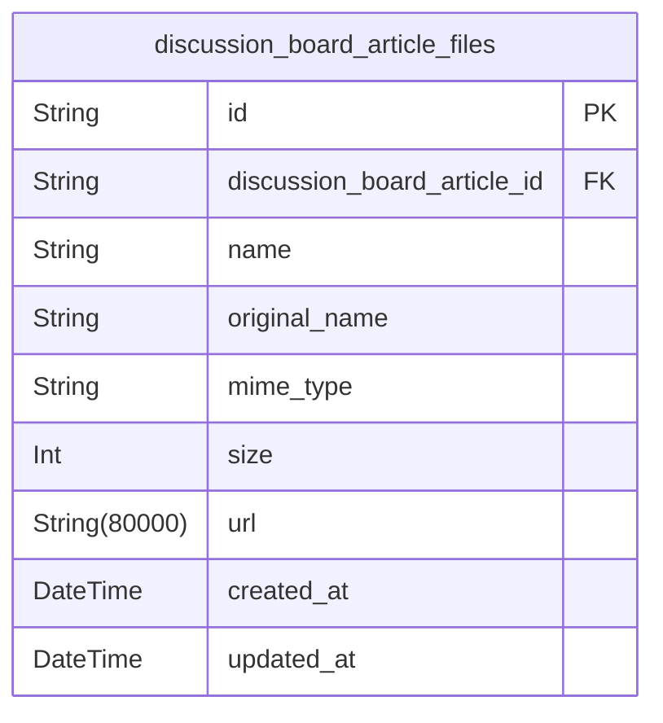
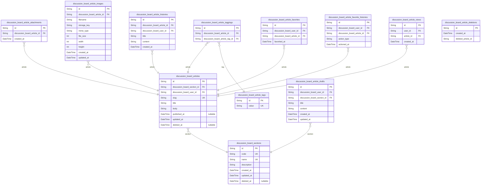
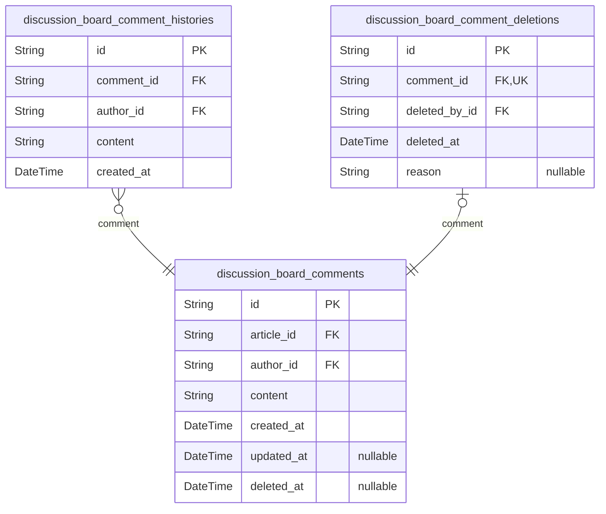
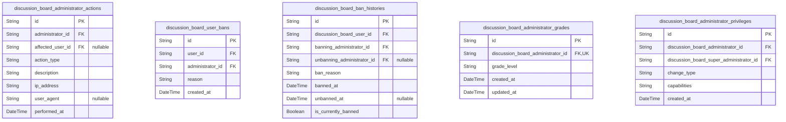
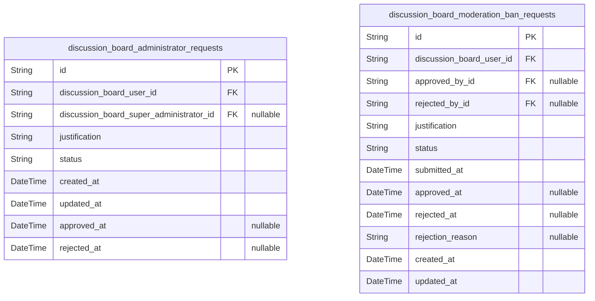

# Prisma Markdown

> Generated by [`prisma-markdown`](https://github.com/samchon/prisma-markdown)

- [Actors](#actors)
- [Systematic](#systematic)
- [Content](#content)
- [Community](#community)
- [Administration](#administration)
- [Moderation](#moderation)

## Actors

```mermaid
erDiagram
"discussion_board_users" {
  String id PK
  String email
  String password
  String nickname
  String profile_content "nullable"
  DateTime created_at
  DateTime updated_at
  DateTime deleted_at "nullable"
}
"discussion_board_user_sessions" {
  String id PK
  String discussion_board_user_id FK
  String ip
  String href
  String referrer "nullable"
  DateTime created_at
  DateTime expired_at
}
"discussion_board_user_password_resets" {
  String id PK
  String user_id FK
  String token UK
  DateTime expires_at
  DateTime created_at
}
"discussion_board_user_email_verifications" {
  String id PK
  String user_id FK
  String code
  String email
  DateTime expires_at
  DateTime created_at
}
"discussion_board_administrators" {
  String id PK
  String discussion_board_user_id FK,UK
  String display_name "nullable"
  String role_description "nullable"
  Boolean is_active
  DateTime created_at
  DateTime updated_at
}
"discussion_board_administrator_sessions" {
  String id PK
  String administrator_id FK
  String access_token UK
  String refresh_token UK
  String ip
  String referer "nullable"
  String agent "nullable"
  DateTime created_at
  DateTime access_expired_at
  DateTime refresh_expired_at
}
"discussion_board_administrator_password_resets" {
  String id PK
  String administrator_id FK
  String token UK
  DateTime expires_at
  DateTime created_at
}
"discussion_board_administrator_email_verifications" {
  String id PK
  String administrator_id
  String token UK
  DateTime expires_at
  DateTime created_at
}
"discussion_board_super_administrators" {
  String id PK
  String discussion_board_user_id FK,UK
  DateTime created_at
  DateTime updated_at
}
"discussion_board_super_administrator_sessions" {
  String id PK
  String discussion_board_super_administrator_id FK
  String access_token
  String refresh_token
  String ip
  String referrer "nullable"
  String href
  DateTime access_expired_at
  DateTime refresh_expired_at
  DateTime created_at
  DateTime updated_at
  DateTime deleted_at "nullable"
}
"discussion_board_super_administrator_password_resets" {
  String id PK
  String discussion_board_super_administrator_id FK
  String code UK
  DateTime expired_at
}
"discussion_board_super_administrator_email_verifications" {
  String id PK
  String email
  String token
  DateTime expires_at
  Boolean used
  DateTime created_at
}
"discussion_board_user_sessions" }o--|| "discussion_board_users" : user
"discussion_board_user_password_resets" }o--|| "discussion_board_users" : user
"discussion_board_user_email_verifications" }o--|| "discussion_board_users" : user
"discussion_board_administrators" |o--|| "discussion_board_users" : user
"discussion_board_administrator_sessions" }o--|| "discussion_board_administrators" : administrator
"discussion_board_administrator_password_resets" }o--|| "discussion_board_administrators" : administrator
"discussion_board_super_administrators" |o--|| "discussion_board_users" : user
"discussion_board_super_administrator_sessions" }o--|| "discussion_board_super_administrators" : superAdministrator
"discussion_board_super_administrator_password_resets" }o--|| "discussion_board_super_administrators" : superAdministrator
```

### `discussion_board_users`

Registered user accounts with email/password authentication for the
discussion board.

This table stores core user information including authentication
credentials and basic profile data.
Users can register with email and password, and the system maintains
their account status and metadata.

The email field serves as the primary login identifier and must be unique
across all user accounts.
Password security is enforced through industry-standard hashing
practices, with passwords never stored in plain text.

User profiles include display names and biography text for community
interaction and identification.
Account lifecycle management features include email verification,
password reset capabilities, and soft deletion for audit purposes.

Users have full control over their account data, with the ability to
update profile information,
change passwords, and request account deletion. Upon deletion, all
user-generated content
(articles and comments) is permanently removed from the system to
maintain data privacy.

Properties as follows:

- `id`: Primary Key.
- `email`: Unique email address used for authentication and system communications.
- `password`
  > Securely hashed password for account authentication using
  > industry-standard bcrypt.
- `nickname`: Public display name for user identification in the community.
- `profile_content`: Brief user biography text for profile information (0-1000 characters).
- `created_at`: Timestamp when the user account was created.
- `updated_at`: Timestamp when the user account was last updated.
- `deleted_at`: Timestamp when the user account was soft deleted (null if active).

### `discussion_board_user_sessions`

User session records for tracking login sessions and authentication status.

Each record represents a single user login session with associated
metadata for
security auditing and session management. Sessions track user authentication
state, connection information, and temporal boundaries.

Session lifecycle:
- Created when user successfully authenticates
- Active during user's platform interaction
- Terminated by logout, expiration, or security events

Security features:
- IP address tracking for anomaly detection
- Connection metadata for audit trails
- Temporal boundaries for session validity
- Automatic cleanup of expired sessions

Sessions support both active usage tracking and security incident
investigation.
Each session is associated with exactly one user account and one JWT session
for token management.

Properties as follows:

- `id`: Primary Key.
- `discussion_board_user_id`
  > Reference to the user who owns this session. {@link
  > discussion_board_users.id}
- `ip`
  > IP address of the client that initiated this session. Used for security
  > monitoring and auditing.
- `href`
  > URL where the session was initiated. Used for security auditing and user
  > behavior analysis.
- `referrer`
  > Referrer URL that led to session initiation. Used for security auditing
  > and traffic analysis.
- `created_at`
  > Timestamp when this session was created. Marks the beginning of the
  > user's authenticated session.
- `expired_at`
  > Timestamp when this session expires. Sessions are automatically
  > invalidated after this time.

### `discussion_board_user_password_resets`

Password reset tokens with expiration for secure user password recovery.

This table stores password reset requests initiated by users who have
forgotten their passwords.
Each record contains a unique token that is emailed to the user and must
be presented
when setting a new password. Tokens have configurable expiration times
for security.

The system supports multiple concurrent reset requests per user, allowing
for cases where
a user initiates multiple resets or receives multiple emails. However,
only the most recent
token should be considered valid for password changes.

Security considerations:
- Tokens must be cryptographically secure random values
- Tokens should have reasonable expiration periods (typically 1-24 hours)
- Tokens must be invalidated after successful password reset
- Tokens must be invalidated after expiration

Properties as follows:

- `id`: Primary Key.
- `user_id`
  > The user account associated with this password reset request. {@link
  > discussion_board_users.id}
- `token`
  > Cryptographically secure random token used to authenticate the password
  > reset request.
  >
  > This token is generated when a user requests a password reset and is
  > emailed to them.
  > It should be a high-entropy value to prevent guessing attacks. The token
  > must be unique
  > across all reset requests and should be sufficiently long (typically 32+
  > characters when
  > properly encoded) to ensure security.
- `expires_at`
  > Timestamp when this password reset token expires.
  >
  > After this time, the token becomes invalid and cannot be used to reset a
  > password.
  > This helps prevent unused tokens from being exploited long after they
  > were issued.
  > The expiration time should be set when the reset request is created,
  > typically 1-24 hours in the future.
- `created_at`
  > Timestamp when the password reset request was created.
  >
  > Used for auditing and tracking when users requested password resets. Also
  > useful
  > for administrative purposes to see how long reset tokens have been
  > pending.

### `discussion_board_user_email_verifications`

Email verification tokens for user registration confirmation.

This table stores email verification tokens generated when users register
for new accounts. Each token is associated with a specific user and has
an expiration time to ensure security. Users must verify their email
address within the token's validity period to activate their account.

The verification process ensures that users provide valid email addresses
during registration, reducing spam account creation and enabling secure
password recovery processes.

Properties as follows:

- `id`: Primary Key.
- `user_id`
  > The user account associated with this email verification token. {@link
  > discussion_board_users.id}
- `code`: The email verification token value.
- `email`
  > The email address being verified. Should match the user's email in the
  > users table.
- `expires_at`
  > The time when this verification token expires. Users must verify before
  > this time.
- `created_at`: The time this verification token was created.

### `discussion_board_administrators`

Administrator accounts with elevated privileges for section and content
management.

Administrators are trusted users with elevated permissions to manage
sections, delete any content,
and moderate the discussion board. They can perform all standard user
actions plus additional
administrative functions. This table stores core administrator
information including authentication
details and role assignment.

Administrators are part of a multi-tier privilege system where super
administrators can manage
administrator grades and privileges. Each administrator must have a
corresponding user account
that serves as their base identity within the system.

The system maintains separate session, password reset, and email
verification tables for administrators
to handle authentication workflows securely. All administrative actions
are logged for audit
and oversight purposes.

Properties as follows:

- `id`: Primary Key.
- `discussion_board_user_id`
  > Base user account that serves as the identity foundation for this
  > administrator. [discussion_board_users.id](#discussion_board_users)
- `display_name`
  > Display name used when administrator performs administrative actions.
  > Falls back to user's display name if not set.
- `role_description`
  > Brief description of administrator's role or responsibilities within the
  > system.
- `is_active`
  > Whether this administrator account is currently active and able to
  > perform administrative functions.
- `created_at`
  > Timestamp when this administrator account was created and granted
  > privileges.
- `updated_at`: Timestamp when administrator information was last updated.

### `discussion_board_administrator_sessions`

JWT session tokens for administrator authentication with access and
refresh capabilities. Tracks active administrator sessions for security
monitoring and allows for session invalidation when needed.

Properties as follows:

- `id`: Primary Key.
- `administrator_id`
  > The administrator who owns this session. References the primary key of
  > the administrators table to establish ownership. {@link
  > discussion_board_administrators.id}
- `access_token`
  > The access token for the session encoded in JWT format. Used for
  > authenticating API requests that require administrator privileges.
- `refresh_token`
  > The refresh token for the session encoded in JWT format. Used to obtain
  > new access tokens when they expire without requiring re-authentication.
- `ip`
  > The IP address from which the session was created. Stored for security
  > monitoring and audit purposes to detect suspicious login activities.
- `referer`
  > The HTTP referer header value when the session was created. Useful for
  > security analysis to understand the context of login requests.
- `agent`
  > The User-Agent header value when the session was created. Helps identify
  > the client application and device type used for the session.
- `created_at`
  > Timestamp when the session was initially created. Used for session
  > lifetime management and audit trails.
- `access_expired_at`
  > Timestamp when the access token expires. Sessions are automatically
  > invalidated after this time unless refreshed.
- `refresh_expired_at`
  > Timestamp when the refresh token expires. After this time, administrators
  > must re-authenticate to obtain a new session.

### `discussion_board_administrator_password_resets`

Password reset tokens for administrator account recovery.

This table manages the password reset workflow for administrator
accounts. When an administrator requests a password reset, a unique token
is generated and stored in this table. The token is associated with the
administrator's account and includes an expiration timestamp to ensure
security.

The password reset process works as follows:
1. Administrator requests password reset via email
2. System generates a unique reset token and stores it in this table
3. Administrator receives email with reset link containing the token
4. When administrator clicks the link, system validates the token and
expiration
5. If valid, administrator can set a new password
6. Token is invalidated after use or expiration

Properties as follows:

- `id`: Primary Key.
- `administrator_id`
  > The administrator account associated with this password reset token.
  > [discussion_board_administrators.id](#discussion_board_administrators)
- `token`
  > The unique token used to verify the password reset request. This should
  > be a cryptographically secure random string.
- `expires_at`
  > The timestamp when this password reset token expires. After this time,
  > the token becomes invalid and cannot be used.
- `created_at`: The timestamp when this password reset token was created.

### `discussion_board_administrator_email_verifications`

Email verification tokens for administrator registration confirmation.

This table stores email verification tokens generated when a new
administrator account is created.
The tokens are used to verify the email address provided during
registration before the account
becomes fully active. Each token has an expiration timestamp for security
purposes.

Properties as follows:

- `id`: Primary Key.
- `administrator_id`
  > Unique identifier for the administrator account that requires email
  > verification.
- `token`: Cryptographically secure random token used to verify the email address.
- `expires_at`: Timestamp when the verification token expires and becomes invalid.
- `created_at`: Timestamp when the verification record was created.

### `discussion_board_super_administrators`

Super administrator accounts with system-level privileges for managing
other administrators.

This table stores core super administrator identity information including
credentials and basic profile data.

Super administrators have the highest privilege level in the system, with
capabilities including:
- Promoting regular administrators to super administrator status
- Demoting other super administrators to regular administrator status
- Approving or rejecting administrator privilege requests
- Accessing exclusive audit and system configuration interfaces
- Performing all standard administrator functions

Super administrators cannot demote themselves as a safety measure to
ensure system administrative continuity.

Each super administrator account is linked to the general user base
through the email address,
which serves as both login credential and unique identifier across the
platform.

Properties as follows:

- `id`: Primary Key.
- `discussion_board_user_id`
  > Reference to the base user account. [discussion_board_users.id](#discussion_board_users).
  >
  > Links the super administrator record to their underlying user profile.
  > This foreign key ensures that super administrators maintain all standard
  > user capabilities
  > while gaining elevated administrative privileges.
- `created_at`
  > Timestamp when the super administrator account was created.
  >
  > Records when the user was granted super administrator privileges.
- `updated_at`
  > Timestamp when the super administrator record was last updated.
  >
  > Tracks the most recent modification to the super administrator status or
  > associated data.

### `discussion_board_super_administrator_sessions`

JWT session tokens for super administrator authentication.

This table manages authentication sessions for super administrators using
JWT tokens.
Each session record contains both access and refresh tokens along with
their expiration
times. Sessions are terminated either by natural expiration or explicit
logout actions.

The refresh token enables automatic access token renewal without requiring
super administrator to re-authenticate, improving user experience while
maintaining
security through proper token lifecycle management. Session data includes
connection
metadata for security auditing and geolocation tracking.

This model uses the "session" stance as it's exclusively for tracking
login sessions
and has a one-to-many relationship with super administrator accounts.
Sessions are
managed through authentication flows rather than direct CRUD operations.

Properties as follows:

- `id`: Primary Key.
- `discussion_board_super_administrator_id`
  > The super administrator whose session this record represents. {@link
  > discussion_board_super_administrators.id}.
- `access_token`
  > JSON Web Token used for API request authentication. Contains claims about
  > the
  > super administrator's identity and permissions. Should be included in the
  > Authorization
  > header of all protected requests.
- `refresh_token`
  > JSON Web Token used to generate new access tokens without
  > re-authentication.
  > Stored securely and used only for token refresh operations. Should be
  > rotated
  > periodically for enhanced security.
- `ip`
  > IP address of the client that initiated this session. Used for security
  > monitoring
  > and detecting suspicious login patterns. Stored in standard IPv4 or IPv6
  > format.
- `referrer`
  > HTTP referrer header value from the session initiation request. Provides
  > context
  > about the user's entry point to the application. Useful for analytics and
  > security
  > auditing purposes.
- `href`
  > Complete URL that was accessed when this session was initiated. Includes
  > protocol,
  > hostname, path, and query parameters. Used for session tracking and
  > security analysis.
- `access_expired_at`
  > Timestamp when the access token will expire and become invalid. The
  > client must
  > use the refresh token to obtain a new access token before this time.
  > Typically
  > set to a short duration (e.g., 15-60 minutes) for security.
- `refresh_expired_at`
  > Timestamp when the refresh token will expire and become invalid. Once
  > this time
  > passes, the super administrator must re-authenticate to obtain new
  > tokens. Typically
  > set to a longer duration (e.g., 7-30 days) than access tokens.
- `created_at`
  > Timestamp when this session record was initially created. Represents the
  > exact
  > moment when the super administrator successfully authenticated and the
  > session
  > was established.
- `updated_at`
  > Timestamp when this session record was last updated. Changes occur when
  > tokens
  > are refreshed or when session metadata is modified.
- `deleted_at`
  > Timestamp when this session was explicitly terminated or expired. A null
  > value
  > indicates that the session is still active. Used for session cleanup and
  > audit
  > purposes.

### `discussion_board_super_administrator_password_resets`

Password reset tokens for super administrator account recovery.

This table manages the password reset workflow for super administrator
accounts.
It stores secure tokens that are emailed to super administrators when
they request
a password reset. The tokens are single-use and have expiration times for
security.

The table is linked to discussion_board_super_administrators through the
foreign key
relationship, ensuring that reset tokens can only be generated for valid
super
administrator accounts. When a super administrator successfully resets
their password,
the corresponding record in this table should be deleted to prevent token
reuse.

Properties as follows:

- `id`: Primary Key.
- `discussion_board_super_administrator_id`
  > The super administrator requesting the password reset. {@link
  > discussion_board_super_administrators.id}
- `code`
  > Cryptographically secure token used to authorize the password reset.
  >
  > This token is emailed to the super administrator and must be presented
  > along with the new password to complete the reset process. Tokens should
  > be sufficiently random and long to prevent brute force attacks.
- `expired_at`
  > UTC timestamp when the reset token expires and becomes invalid.
  >
  > Tokens have a limited lifespan (typically 1 hour) to minimize the window
  > of opportunity for attackers. Expired tokens cannot be used to reset
  > passwords
  > and should be cleaned up periodically.

### `discussion_board_super_administrator_email_verifications`

Email verification tokens for super administrator registration confirmation.

This table stores email verification tokens generated when a new super
administrator
registers for an account. The tokens are used to confirm the email address
provided during registration before the account becomes active.

Each token has an expiration time after which it becomes invalid. Once
a token is used for verification, it is marked as used and cannot be
used again. This prevents token reuse attacks and ensures each verification
link can only be used once.

Properties as follows:

- `id`: Primary Key.
- `email`
  > The email address that needs to be verified.
  >
  > This is the email address provided by the super administrator during
  > registration that needs to be confirmed through the verification process.
- `token`
  > Cryptographically secure random token used for email verification.
  >
  > This unique token is included in the verification link sent to the
  > user's email address. It should be sufficiently random and long to
  > prevent guessing or brute force attacks.
- `expires_at`
  > UTC timestamp when the verification token expires.
  >
  > Verification tokens have a limited lifetime for security reasons.
  > After this timestamp, the token becomes invalid and cannot be used
  > for email verification.
- `used`
  > Whether this verification token has been successfully used.
  >
  > This flag prevents token reuse. Once a token is used for successful
  > email verification, it is marked as used and cannot be used again.
- `created_at`
  > UTC timestamp when the verification token was created.
  >
  > This timestamp is used for auditing and tracking when verification
  > requests were made. It can also help identify potentially stale
  > or abandoned verification requests.

## Systematic

### `discussion_board_article_files`

File attachments associated with articles for supplementary content.

This table stores metadata for files that users attach to their articles.
Each record represents a single file attachment and includes information
about the file's location, size, and type. Files are associated with
specific articles and can be downloaded by users with appropriate
permissions.

The system supports multiple file attachments per article, allowing
users to provide supplementary materials such as documents,
presentations, or data files. All attached files are stored
securely with unique identifiers to prevent conflicts.

Properties as follows:

- `id`: Primary Key.
- `discussion_board_article_id`: The article this file is attached to. [discussion_board_articles.id](#discussion_board_articles)
- `name`: Unique identifier for the file attachment.
- `original_name`: Original filename as uploaded by the user.
- `mime_type`: MIME type of the uploaded file.
- `size`: Size of the file in bytes.
- `url`: URL where the file can be downloaded.
- `created_at`: Timestamp when the file was uploaded.
- `updated_at`: Timestamp when the file record was last updated.

## Content

### `discussion_board_sections`

Organizational units for categorizing articles on the discussion board.

Sections provide the primary means of organizing content into distinct
topics
such as Politics, Economy, and Current Affairs. Each section contains a
collection of related articles and serves as a navigation point for users
seeking specific topic areas. Sections are created and managed exclusively
by administrators, ensuring proper categorization and content organization.

The section system allows for scalable content organization as the platform
grows. Users can browse all available sections and then explore articles
within specific sections. Each section maintains metadata about its purpose
and content scope through its name and description fields.

When administrators delete sections, all articles within that section are
reassigned to a default section to preserve content accessibility. This
ensures that user contributions are not lost when section reorganization
occurs.

Properties as follows:

- `id`: Primary Key.
- `code`
  > Unique human-readable identifier for the section. Used in URLs and
  > references throughout the platform. Must be unique across all sections and
  > follow naming conventions.
- `name`
  > Name of the section displayed to users. This is the primary identifier
  > shown in section listings and navigation elements. Should clearly
  > represent the topic area covered by the section.
- `description`
  > Detailed description of the section's purpose and content scope. Helps
  > users understand what type of articles belong in this section and what
  > they can expect to find. Used in section listings to provide context.
- `created_at`
  > Timestamp when the section was first created in the system. Set
  > automatically upon section creation and never modified.
- `updated_at`
  > Timestamp when the section was last modified. Updated whenever the
  > section's name or description changes. Allows tracking of section
  > maintenance and evolution over time.
- `deleted_at`
  > Timestamp when the section was soft deleted from the system. If NULL,
  > the section is active. If set, the section is considered deleted but
  > retained for historical tracking purposes.

### `discussion_board_articles`

Primary content entities containing user-generated articles with titles,
content, and metadata. Belongs to a section and can have tags and
attachments.

Articles represent the core content of the discussion board where users
share their thoughts and opinions
on economic and political topics. Each article is associated with a
specific section for organization
and can include text content, file attachments, and tags for
discoverability.

Articles support full lifecycle management including creation, editing,
and deletion by authors.
Administrators have additional privileges to moderate articles regardless
of authorship.
All articles maintain audit trails through snapshot tables to track
changes over time.

The article system integrates with the tagging system to enable content
categorization and discovery.
File and image attachments provide users with the ability to share
supplementary materials.
Each article maintains counts of associated comments to provide
engagement metrics.

Properties as follows:

- `id`: Primary Key.
- `discussion_board_section_id`
  > Section this article belongs to. [discussion_board_sections.id](#discussion_board_sections)
  >
  > Organizes articles into topical categories for easier browsing and
  > discovery.
  > All articles must be associated with exactly one section at all times.
- `discussion_board_user_id`
  > Author of this article. [discussion_board_users.id](#discussion_board_users)
  >
  > The user who created this article. Used for displaying author information
  > and controlling edit/delete permissions.
- `slug`
  > Unique identifier for this article in URL-friendly format.
  >
  > Used in URLs to reference this specific article. Must be unique across
  > all articles.
  > Generated from title during creation and can be modified during editing.
- `title`
  > Title of the article.
  >
  > The main heading that summarizes the article's content. Displayed
  > prominently
  > in article listings and at the top of the article page.
- `body`
  > Main content of the article in Markdown format.
  >
  > Full text content of the article written in Markdown for rich formatting.
  > Supports headers, lists, links, and other Markdown elements for
  > expressive content.
- `published_at`
  > When this article was first published.
  >
  > Timestamp when the article was initially created and made publicly
  > available.
  > Used for sorting articles by publication date and displaying age
  > information.
- `updated_at`
  > When this article was last updated.
  >
  > Timestamp of the most recent modification to the article's content.
  > Updated whenever the article is edited and used to indicate freshness.
- `deleted_at`
  > When this article was soft-deleted.
  >
  > Timestamp when the article was marked as deleted without permanent
  > removal.
  > Allows for article recovery and maintains referential integrity for
  > comments.

### `discussion_board_article_tags`

Free-text tags that users can add to articles for categorization and
discovery purposes.

This table stores individual tag values that can be associated with
articles. Tags are
user-generated free text labels that help organize content and enable
discovery.
Each tag must be unique to avoid duplication, and the system enforces
this through
a unique constraint on the tag value.

The tag system allows users to:
- Add descriptive keywords to their articles
- Filter and search articles by tags
- Discover related content through tag-based navigation

Tags are managed through a separate junction table
(discussion_board_article_taggings)
that links articles to their associated tags, enabling many-to-many
relationships.
This design allows for efficient querying of articles by tags while
maintaining
data integrity through the unique constraint.

Tag values are limited to 30 characters to encourage concise, focused
labeling
and to optimize database performance for tag-based queries.

Properties as follows:

- `id`: Primary Key.
- `value`
  > The actual tag text value provided by the user.
  >
  > This field contains the free-text label that users assign to articles for
  > categorization. The value must be unique across all tags to prevent
  > duplication
  > and ensure consistent tagging across the platform.
  >
  > Tag values are limited to 30 characters to:
  > - Encourage concise, focused labeling
  > - Optimize database performance for tag-based queries
  > - Maintain visual consistency in tag displays
  > - Prevent abuse through excessively long tags
  >
  > The character limit strikes a balance between allowing descriptive tags
  > and maintaining system performance and usability.

### `discussion_board_article_taggings`

Junction table linking articles to their associated tags, enabling
many-to-many relationship between articles and tags.

This table implements the many-to-many relationship pattern between
articles and tags,
allowing articles to have multiple tags and tags to be associated with
multiple articles.
The relationship is managed through foreign key constraints ensuring
referential integrity.

When an article is created with tags, entries are added to this table
linking the article
and tag IDs. When tags are removed from an article, the corresponding
entries are deleted.
When an article or tag is deleted, the cascade delete rules handle
cleanup of these associations.

Properties as follows:

- `id`: Primary Key.
- `discussion_board_article_id`: The article that is tagged. [discussion_board_articles.id](#discussion_board_articles)
- `discussion_board_article_tag_id`
  > The tag associated with the article. {@link
  > discussion_board_article_tags.id}

### `discussion_board_article_attachments`

File attachments that users can associate with their articles, stored
with metadata about the file.

This table stores metadata for files attached to articles, including
original filename,
file size, MIME type, and storage path. Each attachment is linked to a
specific article
and maintains a reference to its storage location. The system supports
files up to 10MB
in size with common document formats (PDF, DOC, DOCX, TXT).

Attachments are permanently deleted when their parent article is removed.
Users can
remove specific attachments during article editing. The filename is
preserved for
download purposes while the actual storage uses a secure, unique identifier.

Properties as follows:

- `id`: Primary Key.
- `discussion_board_article_id`
  > The article this attachment belongs to. {@link
  > discussion_board_articles.id}
- `created_at`
  > Timestamp when the attachment was created. Set automatically when the
  > attachment is added to an article.

### `discussion_board_article_images`

Image attachments that users can associate with their articles, stored
with metadata about the image.

Each record represents a single image file attached to an article for
supplementary content. Images are stored with their original filename and
unique storage identifiers. This table maintains the relationship between
articles and their image attachments, enabling rich content creation with
visual elements.

Properties as follows:

- `id`: Primary Key.
- `discussion_board_article_id`
  > The article this image is attached to. {@link
  > discussion_board_articles.id}
- `filename`: Original filename of the uploaded image file.
- `storage_key`: Unique identifier for the image in storage system.
- `mime_type`: MIME type of the image file (e.g., image/jpeg, image/png).
- `file_size`: Size of the image file in bytes.
- `width`: Width of the image in pixels.
- `height`: Height of the image in pixels.
- `created_at`: Timestamp when the image was uploaded and attached to the article.
- `updated_at`: Timestamp when the image record was last updated.

### `discussion_board_article_histories`

Article history records capturing the state of articles at specific
points in time. Created whenever an article is updated to maintain an
audit trail of all changes. This table enables reconstruction of article
states at any point in the past, supports compliance requirements, and
provides accountability for content modifications.

Each record contains a complete snapshot of the article's content fields
at the time of creation. This includes the title, body content, section
assignment, and other core article properties. Binary large objects like
attached files and images are not duplicated in history but referenced
through their identifiers.

The chronological sequence of history records for a given article allows
users to track how content evolved over time. This is critical for
understanding the context of discussions, identifying when key
information was added or modified, and maintaining transparency in
content management.

History records are immutable once created. They serve as a permanent
record that cannot be altered, supporting the integrity of the audit
trail. This immutability is essential for compliance purposes and dispute
resolution.

Access to article histories is typically restricted to authorized users
such as administrators and content moderators. Regular users may have
limited or no access depending on platform policies. This control ensures
that sensitive historical information is protected while still allowing
appropriate oversight.

Properties as follows:

- `id`: Primary Key.
- `discussion_board_article_id`
  > The article this history record belongs to. {@link
  > discussion_board_articles.id}
- `discussion_board_user_id`
  > The user who authored the article at this point in time. {@link
  > discussion_board_users.id}
- `title`
  > Snapshot of the article's title at the time this history record was
  > created.
- `content`
  > Snapshot of the article's content body at the time this history record
  > was created.
- `created_at`
  > Timestamp when this history record was created, which corresponds to when
  > the article was modified.

### `discussion_board_article_favorites`

User's favorite articles for quick access and reference.

This table maintains the many-to-many relationship between users and
articles they
have marked as favorites. It enables users to save articles for later
reading and
provides a personalized collection of preferred content.

The table tracks when articles were favorited to support sorting by
recency and
enables features like 'recently favorited' lists. Each favorite is unique
per user-article
combination, preventing duplicate entries.

Properties as follows:

- `id`: Primary Key.
- `discussion_board_user_id`: The user who favorited the article. [discussion_board_users.id](#discussion_board_users)
- `discussion_board_article_id`: The article that was favorited. [discussion_board_articles.id](#discussion_board_articles)
- `favorited_at`: When the article was favorited by the user.

### `discussion_board_article_favorite_histories`

Snapshot history of user favorites for audit trail purposes.

This table maintains a complete history of favorite actions taken by users.
Whenever a user favorites or unfavorites an article, a record is created
in this
table to preserve an audit trail of preferences over time. This enables
features
like 'previously favorited' analysis and helps understand user engagement
patterns.

The action_type field indicates whether the favorite was added or
removed, making
it possible to reconstruct the exact timeline of user preferences. All
timestamps
are preserved with timezone information to ensure accurate historical
tracking.

Properties as follows:

- `id`: Primary Key.
- `discussion_board_user_id`
  > The user who performed the favorite action. {@link
  > discussion_board_users.id}
- `discussion_board_article_id`
  > The article that was the subject of the favorite action. {@link
  > discussion_board_articles.id}
- `action_type`
  > Type of favorite action performed. 'favorited' when user added article to
  > favorites, 'unfavorited' when user removed it.
- `actioned_at`: When the favorite action was performed.

### `discussion_board_article_views`

Tracks which users have viewed which articles for analytics and
personalization purposes.

This table maintains a record of user-article view interactions to support:
- Analytics on content engagement and popularity
- Personalization features like "Recently Viewed" or "Recommended for You"
- User behavior analysis for content strategy
- Detection of duplicate views from the same user

Each record represents a unique view event, allowing the system to track
viewing patterns over time. The combination of user_id and article_id
ensures that each user-article view pair is recorded distinctly, while
the created_at timestamp provides temporal context for analysis.

For performance optimization, this table should be indexed on both
user_id and article_id to support efficient querying for both user-based
and article-based analytics. The timestamps enable time-series analysis
of viewing patterns.

Properties as follows:

- `id`: Primary Key.
- `user_id`
  > The user who viewed the article. References the user's unique identifier
  > in the discussion_board_users table.
- `article_id`
  > The article that was viewed. References the article's unique identifier
  > in the discussion_board_articles table.
- `created_at`
  > Timestamp when the view event was recorded. Used for analytics on viewing
  > patterns over time and to prevent duplicate recording of views within
  > short timeframes.

### `discussion_board_article_drafts`

Stores draft versions of articles that users are working on but haven't
published yet.

This table maintains unpublished article content that users are working
on, allowing
them to save their progress and return later. Drafts include all the same
content
fields as published articles but exist in a separate state until the user
decides
to publish or discard them.

Each draft is associated with a specific user (the author) and maintains
a reference
to the section where it's intended to be published. This allows users to
work on
articles for different sections without losing context about their
intended placement.

Drafts support the same rich content features as published articles,
including title,
content body, tags, and file attachments. This ensures users don't lose
any work
when transitioning from draft to published state.

The system allows users to have multiple drafts simultaneously, each in
different
stages of completion. Users can view, edit, and delete their drafts
independently
of published articles.

When a user decides to publish a draft, the content is moved to the
articles table
and the draft record is typically deleted, though some implementations
may archive
drafts for historical tracking purposes.

Properties as follows:

- `id`: Primary Key.
- `discussion_board_user_id`
  > The author of this draft article, linking to their user profile. {@link
  > discussion_board_users.id}.
- `discussion_board_section_id`
  > The section where this draft is intended to be published. {@link
  > discussion_board_sections.id}.
- `title`
  > The title of the draft article, which will become the published article's
  > title when published.
- `content`
  > The main content body of the draft article, supporting rich text
  > formatting.
- `created_at`
  > The timestamp when this draft was first created, used for sorting and
  > tracking purposes.
- `updated_at`
  > The timestamp when this draft was last modified, updated every time the
  > user saves changes.

### `discussion_board_article_deletions`

Maintains a list of article IDs that have been deleted, used for
permanent cleanup processes.

This table serves as a deletion registry for articles that have been
removed from the discussion board.
When articles are deleted through normal user actions or administrative
moderation, their IDs are recorded
here to facilitate systematic cleanup processes. The table supports
permanent removal of deleted content
from the system while maintaining a record of what has been deleted for
audit and maintenance purposes.

This approach allows the system to:
1. Keep track of deleted articles for potential recovery or audit needs
2. Enable systematic cleanup processes that can permanently remove
deleted content
3. Prevent accidental recreation of deleted content by maintaining a
record of removed IDs
4. Support compliance requirements that may necessitate tracking of
content lifecycle

Properties as follows:

- `id`: Primary Key.
- `created_at`
  > Timestamp when the article deletion was recorded in the system. Used for
  > tracking when content was removed and for scheduling cleanup processes.
- `deleted_article_id`
  > Unique identifier of the deleted article. This ID corresponds to the
  > primary key of the article that was removed from the main articles table.

## Community

### `discussion_board_comments`

User comments on articles with content, timestamps, and authorship
information. Supports creation, editing, and deletion of comments with
tracking of modification history.

Each comment is associated with a specific article and created by an
authenticated user. Comments can be edited by their authors, with each
edit creating a new version in the history table. Comments can also be
soft deleted while maintaining their content for audit purposes.

The comment system supports single-level discussion threads only - there
are no nested replies. Comments are displayed sorted by creation time,
oldest first. The content is limited to 2000 characters to ensure
readability and performance.

Comments maintain full audit trails through their history and deletion
records, allowing administrators to track all changes and removals for
moderation purposes.

Properties as follows:

- `id`: Primary Key.
- `article_id`: The article this comment belongs to. [discussion_board_articles.id](#discussion_board_articles)
- `author_id`: The user who authored this comment. [discussion_board_users.id](#discussion_board_users)
- `content`
  > The main content of the comment. Limited to 2000 characters to ensure
  > readability and performance in the discussion interface.
- `created_at`
  > When the comment was first created. Used for sorting comments
  > chronologically and providing temporal context.
- `updated_at`
  > When the comment was last edited. This field is updated every time the
  > comment content is modified. NULL if the comment has never been edited.
- `deleted_at`
  > When the comment was deleted. Used for soft deletion to maintain audit
  > trails while hiding content from users. NULL if the comment is active.

### `discussion_board_comment_histories`

Historical versions of comments for audit trail purposes.

Each time a comment is edited, a snapshot of its previous state is stored
in this table. This creates a complete history of all changes made to
comments over time, which is essential for moderation, accountability,
and content recovery purposes.

The history records include the complete content of the comment at the
time of the edit, along with timestamps and authorship information. This
allows administrators to track the evolution of discussions and
investigate any problematic content modifications.

History records are created automatically whenever a comment is updated.
They are immutable once created, ensuring the integrity of the audit
trail. The relationship to the main comment table allows for easy
retrieval of the complete history of any comment.

This table follows the standard snapshot pattern used throughout the
system for maintaining historical data.

Properties as follows:

- `id`: Primary Key.
- `comment_id`
  > The comment this history record belongs to. {@link
  > discussion_board_comments.id}
- `author_id`
  > The user who authored this version of the comment. {@link
  > discussion_board_users.id}
- `content`
  > The content of the comment at the time this history record was created.
  > This represents the state of the comment before it was edited.
- `created_at`
  > When this history record was created. This timestamp represents when the
  > comment was edited and this snapshot was taken.

### `discussion_board_comment_deletions`

Records of deleted comments for permanent audit trail purposes.

When a comment is deleted, a record is created in this table to maintain
a permanent audit trail of all content removals. This is essential for
moderation oversight and accountability, allowing administrators to track
what content has been removed and when.

The deletion records include information about the deleted comment, when
it was deleted, and who performed the deletion. This information is
crucial for investigating abuse, resolving disputes, and maintaining
transparency in content moderation.

Unlike the soft deletion in the main comments table, these records are
permanent and cannot be restored. This ensures that there is always a
trace of deleted content for administrative purposes, even if the
original comment is no longer visible to users.

The table is designed to be append-only, with new records added for each
deletion but existing records never modified. This maintains the
integrity of the audit trail.

Properties as follows:

- `id`: Primary Key.
- `comment_id`: The comment that was deleted. [discussion_board_comments.id](#discussion_board_comments)
- `deleted_by_id`
  > The user who performed the deletion. For user deletions, this will be the
  > comment author. For administrative deletions, this will be the
  > administrator. [discussion_board_users.id](#discussion_board_users)
- `deleted_at`
  > When the comment was deleted. This timestamp is set when the deletion
  > occurs and is used for audit purposes.
- `reason`
  > Optional reason for the deletion. This field can be used by
  > administrators to record why a comment was removed, which is important
  > for moderation transparency and user communication.

## Administration

### `discussion_board_administrator_actions`

Records all administrative actions performed in the system for audit
trail purposes.

This table provides a comprehensive log of administrator activities
including
content moderation, user management, and system configuration changes. Each
record captures the administrator who performed the action, what type of
action
it was, when it occurred, and additional context. This enables super
administrators
to review historical activities, investigate issues, and maintain
accountability.

The schema enforces strict data integrity through foreign key
relationships to
ensure all actions are properly attributed to valid administrators and
affected
users. Indexes are optimized for common audit queries by action type,
timestamp,
and administrator. All actions that modify system state should be logged
here.

Properties as follows:

- `id`: Primary Key.
- `administrator_id`
  > Administrator who performed the action. {@link
  > discussion_board_administrators.id}
- `affected_user_id`
  > User affected by the action (if applicable). {@link
  > discussion_board_users.id}
- `action_type`
  > Type of administrative action performed
  >
  > Categorizes the specific type of administrative activity that was
  > executed.
  > Standardized classification enables filtering and reporting on action
  > types.
  >
  > Valid action types represent core administrative functions:
  > - 'section_create': Creation of new content sections
  > - 'section_edit': Modification of existing section properties
  > - 'section_delete': Removal of content sections
  > - 'article_delete': Removal of user articles by administrators
  > - 'comment_delete': Removal of user comments by administrators
  > - 'user_ban': Restriction of user access to the platform
  > - 'user_unban': Restoration of user access to the platform
  > - 'admin_approve': Granting of administrative privileges to users
  > - 'admin_reject': Denial of administrative privilege requests
  > - 'admin_promote': Elevation of regular administrators to super status
  > - 'admin_demote': Reduction of super administrators to regular status
- `description`
  > Detailed description of the action performed
  >
  > Provides human-readable context about what specifically occurred during
  > the
  > administrative action. This captures variable details that distinguish
  > similar
  > action types, such as which entity was affected or the justification for
  > the action.
  >
  > Essential for auditors and investigators to understand the full context
  > without
  > requiring access to related tables.
- `ip_address`
  > IP address of the administrator when action was performed
  >
  > Records the network origin for security auditing. Combined with
  > timestamps,
  > provides accountability trail for sensitive operations.
  >
  > Used to detect suspicious access patterns and assist in forensic
  > investigations.
- `user_agent`
  > User agent string of the administrator's browser/client
  >
  > Captures client software used to perform the action. Helps distinguish
  > between
  > different devices and can be valuable for detecting unusual access
  > patterns
  > and investigating suspicious activities.
- `performed_at`
  > Timestamp when the administrative action was performed
  >
  > Records the exact date and time when the administrative operation was
  > executed.
  > Crucial for chronological audit trails and correlation with other system
  > events.

### `discussion_board_user_bans`

Records user banning actions including the reason, timestamps, and
administrator who performed the ban. This table tracks when users are
banned from the platform for violating community guidelines.

Each record represents a single banning action with details about why the
user was banned and by which administrator. The ban reason helps maintain
accountability and provides context for potential unbanning decisions.

Properties as follows:

- `id`: Primary Key.
- `user_id`
  > Reference to the user who was banned. Links to the users table to
  > identify the banned user's account. [discussion_board_users.id](#discussion_board_users)
- `administrator_id`
  > Reference to the administrator who performed the ban. Links to the
  > administrators table to track which admin took the banning action. {@link
  > discussion_board_administrators.id}
- `reason`
  > Detailed reason for why the user was banned, explaining the policy
  > violation or inappropriate behavior that led to this action. This field
  > provides context for administrators reviewing ban decisions and for the
  > banned user understanding the reason.
- `created_at`
  > Timestamp when the banning action was performed, marking the exact moment
  > when the user's access was restricted. This is set automatically upon ban
  > creation and never modified.

### `discussion_board_ban_histories`

ban history records

Properties as follows:

- `id`: Primary Key.
- `discussion_board_user_id`: The user who was banned. [discussion_board_users.id](#discussion_board_users)
- `banning_administrator_id`
  > The administrator who initiated the ban. {@link
  > discussion_board_administrators.id}
- `unbanning_administrator_id`
  > The administrator who lifted the ban, if applicable. {@link
  > discussion_board_administrators.id}
- `ban_reason`: The reason provided for the ban.
- `banned_at`: The timestamp when the ban was initiated.
- `unbanned_at`: The timestamp when the ban was lifted, if applicable.
- `is_currently_banned`: Whether the user is currently banned.

### `discussion_board_administrator_grades`

Records and manages the hierarchical structure of administrator grades,
tracking promotions and demotions between regular administrators and
super administrators. This table maintains the current grade of each
administrator and references the most recent grade change record. Super
administrators are distinguished by having entries in this table, while
regular administrators have entries with grade_level set to 'regular'.
The system uses this table to determine authorization levels for
administrative actions and UI access.

Properties as follows:

- `id`: Primary Key.
- `discussion_board_administrator_id`
  > Reference to the administrator whose grade is being managed. This links
  > to the discussion_board_administrators table to identify the specific
  > administrator. [discussion_board_administrators.id](#discussion_board_administrators)
- `grade_level`
  > The current administrative grade level of the user, determining their
  > authorization scope. Valid values are 'regular' for standard
  > administrators with basic moderation privileges, and 'super' for super
  > administrators with full system management capabilities including
  > promoting/demoting other administrators.
- `created_at`
  > Timestamp when this grade record was created, marking when the
  > administrator was first assigned a grade. This is set automatically upon
  > initial grade assignment and never changes.
- `updated_at`
  > Timestamp when this grade record was last updated, indicating the most
  > recent grade change. Automatically updated whenever the administrator's
  > grade level is modified through promotion or demotion.

### `discussion_board_administrator_privileges`

Records administrator privilege changes including promotions, demotions,
and capability assignments.

This table tracks all changes to administrator privileges over time,
including the specific capabilities assigned
to each administrator. It maintains a history of privilege changes to
support audit trails and ensures that each
administrator's current capabilities are accurately represented.

The table is designed to support the two-tier administrator hierarchy
(regular administrator and super administrator)
with appropriate capability sets for each grade. It provides historical
tracking of all privilege modifications
for compliance and auditing purposes.

Properties as follows:

- `id`: Primary Key.
- `discussion_board_administrator_id`
  > The administrator whose privileges are being managed. {@link
  > discussion_board_administrators.id}
- `discussion_board_super_administrator_id`
  > The super administrator who made the privilege change. {@link
  > discussion_board_super_administrators.id}
- `change_type`
  > The type of privilege change that occurred. Valid values are 'promotion'
  > (regular to super), 'demotion' (super to regular), or 'assignment'
  > (capability changes).
- `capabilities`
  > JSON object containing the specific capabilities assigned to the
  > administrator at this point in time.
- `created_at`: Timestamp when the privilege change was recorded.

## Moderation

### `discussion_board_administrator_requests`

Tracks requests from users to become administrators, including their
justification and approval status.

This table manages the lifecycle of administrator privilege requests from
submission through
approval or rejection. Each request is associated with a specific user
and must include a
justification. The system maintains the complete history of all requests
along with their
resolution status and timing information.

Administrator requests cannot be edited once submitted, ensuring the
integrity of the request
process and preventing users from modifying their justification after
submission. This design
supports auditability and accountability in the administrator selection
process.

Properties as follows:

- `id`: Primary Key.
- `discussion_board_user_id`
  > The user who is requesting administrator privileges. References the
  > unique identifier of the user account that submitted this request. {@link
  > discussion_board_users.id}
- `discussion_board_super_administrator_id`
  > The super administrator who approved this request, if approved.
  > References the administrator account that granted administrator
  > privileges. [discussion_board_super_administrators.id](#discussion_board_super_administrators)
- `justification`
  > The justification provided by the user for why they should be granted
  > administrator privileges. This text explains the user's qualifications
  > and reasons for requesting elevated access.
- `status`
  > The current status of this administrator request. Indicates whether the
  > request is awaiting review, has been approved, or has been rejected.
- `created_at`: Timestamp when this request was initially submitted by the user.
- `updated_at`
  > Timestamp when this request was last updated, typically when it was
  > approved or rejected.
- `approved_at`: Timestamp when this request was approved, if approved.
- `rejected_at`: Timestamp when this request was rejected, if rejected.

### `discussion_board_moderation_ban_requests`

Tracks user requests for administrator privileges including justification
and approval workflow status.

This table manages the complete lifecycle of administrator privilege
requests from
submission through final resolution. Users submit requests with detailed
justifications
which are then reviewed by super administrators who can either approve or
reject them.

The system maintains full audit trail of all request activities including
submission
timestamps, resolution actions, and responsible administrators. Rejected
requests remain
visible for transparency and future reference, while approved requests
trigger privilege
assignment workflows.

Key operational aspects:
- Requests can only be submitted by regular users (not already
administrators)
- Super administrators have exclusive rights to process requests
- Each request maintains independent status tracking
- Historical records are preserved for compliance and auditing purposes

Properties as follows:

- `id`: Primary Key.
- `discussion_board_user_id`
  > User who submitted the administrator request. {@link
  > discussion_board_users.id}.
- `approved_by_id`
  > Super administrator who approved this request, if applicable. {@link
  > discussion_board_super_administrators.id}.
- `rejected_by_id`
  > Super administrator who rejected this request, if applicable. {@link
  > discussion_board_super_administrators.id}.
- `justification`
  > Justification provided by user for requesting administrator privileges.
  > Must be between 10-1000 characters as specified in requirements.
- `status`: Current status of the administrator request in the approval workflow.
- `submitted_at`: Timestamp when the request was initially submitted by the user.
- `approved_at`
  > Timestamp when the request was approved by a super administrator, if
  > applicable.
- `rejected_at`
  > Timestamp when the request was rejected by a super administrator, if
  > applicable.
- `rejection_reason`: Optional reason provided by super administrator when rejecting a request.
- `created_at`: Timestamp when the request record was created in the system.
- `updated_at`: Timestamp when the request record was last updated.
