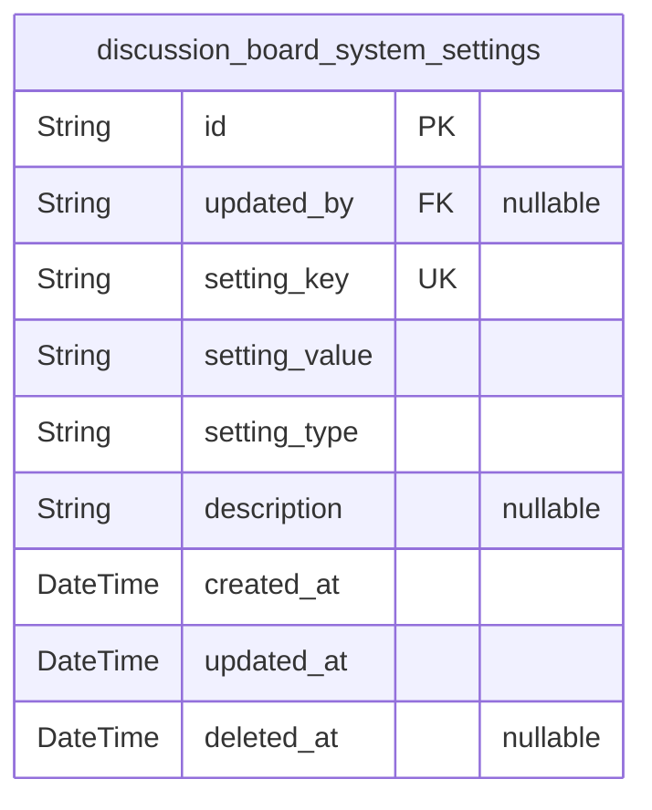
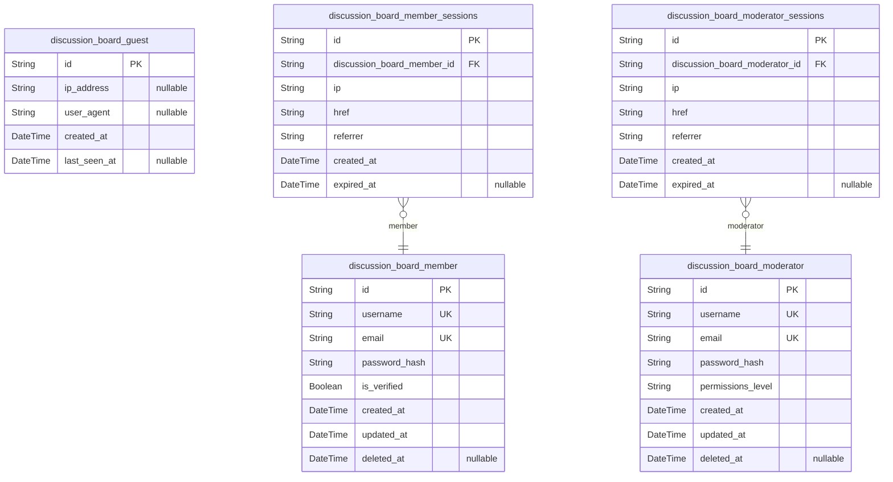
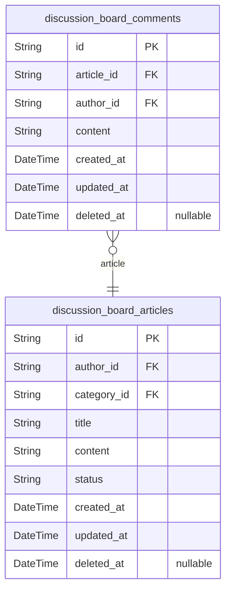
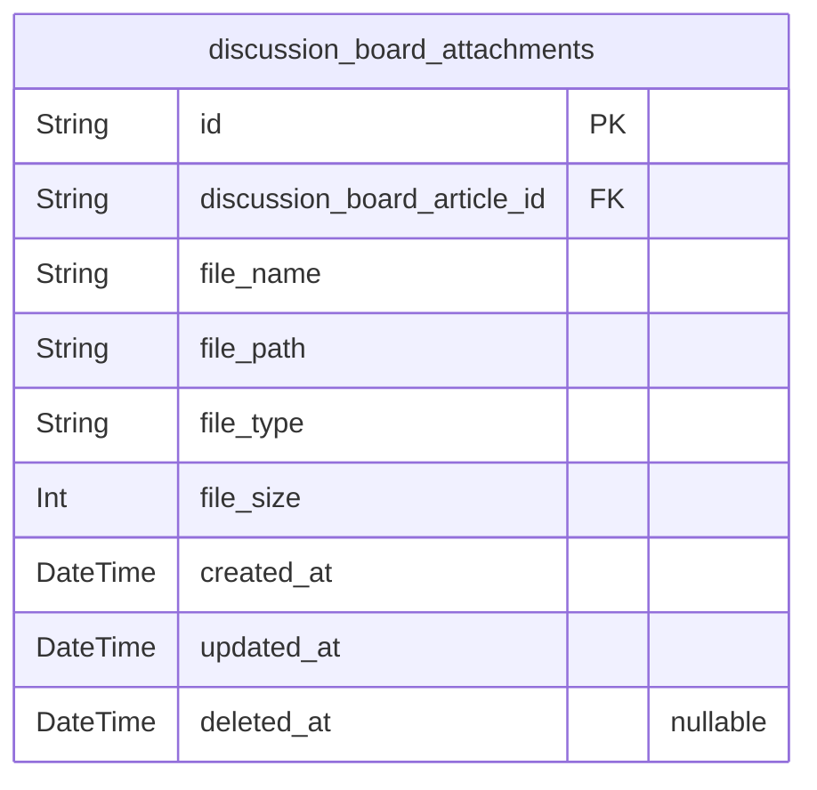
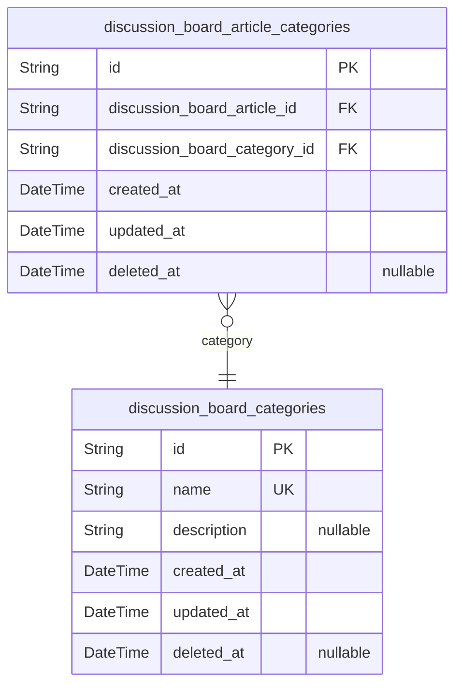

# Prisma Markdown

> Generated by [`prisma-markdown`](https://github.com/samchon/prisma-markdown)

- [Systematic](#systematic)
- [Actors](#actors)
- [Content](#content)
- [Media](#media)
- [Categories](#categories)

## Systematic

### `discussion_board_system_settings`

System-wide configuration settings for the economic/political discussion
board platform.

This table stores global configuration values that control the behavior
and policies of the entire discussion board system. It contains settings
that affect platform functionality, content policies, and operational
parameters that apply across all user interactions.

Settings in this table are typically managed by system administrators and
affect the entire platform rather than individual users or content.
Values are usually set during initial configuration and modified only for
significant policy or operational changes.

The table is designed to store configuration as key-value pairs with
typed values to support various setting types. Changes to settings are
tracked through the updated_at timestamp and audit fields to maintain an
audit trail of configuration modifications.

Support for logical deletion allows settings to be marked as inactive
without removing historical references, supporting compliance and
rollback scenarios.

Properties as follows:

- `id`: Primary Key.
- `updated_by`
  > Reference to the moderator who last updated this setting. {@link
  > discussion_board_moderator.id}.
- `setting_key`
  > Unique identifier for the configuration setting. This key is used
  > programmatically to retrieve specific configuration values. Examples
  > include 'max_image_size', 'allowed_file_types', 'posts_per_page',
  > 'session_timeout_minutes'.
- `setting_value`
  > The value of the configuration setting stored as a string representation.
  > Different data types are stored as strings and parsed by the application
  > according to the setting_key. For example, numeric values like '100' for
  > maximum posts per page, or comma-separated lists like
  > 'jpg,png,gif,pdf,doc' for allowed file types.
- `setting_type`
  > Data type of the setting value to enable proper parsing by the
  > application. Valid values include 'string', 'integer', 'boolean',
  > 'array_string' for comma-separated values, and 'json' for structured
  > data. This field ensures type-safe handling of configuration values.
- `description`
  > Human-readable description of what the setting controls and its possible
  > values. This documentation helps administrators understand the purpose
  > and proper values for each configuration option without requiring
  > code-level knowledge.
- `created_at`
  > Timestamp when the configuration setting was first created in the system.
  > This field provides an audit trail showing when settings were initially
  > established.
- `updated_at`
  > Timestamp when the configuration setting was last modified. This field
  > allows administrators to track when settings were changed and helps with
  > troubleshooting configuration-related issues.
- `deleted_at`
  > Timestamp when the configuration setting was logically deleted. This
  > field enables soft deletion of settings while maintaining historical
  > references for audit and compliance purposes.

## Actors

### `discussion_board_guest`

Guest users who can browse public content but cannot create posts or
participate in discussions.

These users represent unauthenticated visitors who have read-only access
to the discussion board.
Guest users provide content discoverability for search engines and casual
visitors while protecting contribution
capabilities for registered users. They do not require authentication or
session management as they are not
logged in.

Properties as follows:

- `id`: Primary Key.
- `ip_address`: IP address used by the guest for tracking and rate limiting purposes.
- `user_agent`: Browser user agent string for device and browser identification.
- `created_at`: Timestamp when the guest session was first recorded in the system.
- `last_seen_at`: Timestamp of the guest's last activity on the platform.

### `discussion_board_member`

Authenticated member users who can create posts with images and file
attachments, comment on posts, and manage their own content.

These users represent the core community that drives discussion activity
on the platform.
Members have full participation rights after registration and email
verification. They can create
content, engage with other users, and manage their contributions with
appropriate permissions.

Properties as follows:

- `id`: Primary Key.
- `username`
  > Unique display name chosen by the member for identification in
  > discussions.
- `email`
  > Email address used for authentication, notifications, and account
  > recovery.
- `password_hash`: Securely hashed password for user authentication.
- `is_verified`
  > Whether the member has verified their email address to activate full
  > platform features.
- `created_at`: Timestamp when the member account was created.
- `updated_at`: Timestamp when the member account was last updated.
- `deleted_at`: Timestamp when the member account was soft deleted (null if active).

### `discussion_board_moderator`

Administrative users who can review and approve posts, manage user
accounts, delete inappropriate content, and configure system settings.

These users provide oversight capabilities necessary to maintain
community standards and platform quality.
Moderators have elevated privileges to perform content review, user
management, and system administration
tasks. They are responsible for enforcing community guidelines and
ensuring appropriate content quality.

Properties as follows:

- `id`: Primary Key.
- `username`: Unique display name for the moderator in administrative contexts.
- `email`: Email address used for authentication and administrative notifications.
- `password_hash`: Securely hashed password for moderator authentication.
- `permissions_level`
  > Authorization level determining which administrative functions this
  > moderator can perform.
- `created_at`: Timestamp when the moderator account was created.
- `updated_at`: Timestamp when the moderator account was last updated.
- `deleted_at`: Timestamp when the moderator account was soft deleted (null if active).

### `discussion_board_member_sessions`

Authentication sessions for member users.

Tracks login sessions for registered members to maintain authentication
state and provide audit trails.
Each session is associated with a specific member and captures connection
context for security monitoring.
This table supports the platform's authentication system for member users
and enables session management
features such as logout and session expiration.

Properties as follows:

- `id`: Primary Key.
- `discussion_board_member_id`: Associated member account. [discussion_board_member.id](#discussion_board_member).
- `ip`: IP address used during the session for security monitoring.
- `href`: Connection URL that initiated the session.
- `referrer`: Referrer URL that led to the session initiation.
- `created_at`: Timestamp when the session was created.
- `expired_at`: Timestamp when the session expired or will expire (null if active).

### `discussion_board_moderator_sessions`

Authentication sessions for moderator users.

Tracks login sessions for administrative moderators to maintain
authentication state and provide audit trails.
Each session is associated with a specific moderator and captures
connection context for security monitoring.
This table supports the platform's authentication system for moderator
users and enables session management
features such as logout and session expiration.

Properties as follows:

- `id`: Primary Key.
- `discussion_board_moderator_id`: Associated moderator account. [discussion_board_moderator.id](#discussion_board_moderator).
- `ip`: IP address used during the session for security monitoring.
- `href`: Connection URL that initiated the session.
- `referrer`: Referrer URL that led to the session initiation.
- `created_at`: Timestamp when the session was created.
- `expired_at`: Timestamp when the session expired or will expire (null if active).

## Content

### `discussion_board_articles`

Articles created by users on economic or political topics.

This table stores the primary content pieces in the discussion board
system. Articles can be created by members or moderators and must go
through an approval process before becoming publicly visible. Each
article is associated with one or more categories and can include file
attachments.

Articles have a lifecycle managed through their status field, starting as
'pending' and moving to 'approved' or 'rejected' based on moderator
review. The system maintains full audit trails of article changes through
snapshot tables and preserves deleted content for compliance purposes.

Properties as follows:

- `id`: Primary Key.
- `author_id`
  > The member or moderator who created this article. {@link
  > discussion_board_member.id} or [discussion_board_moderator.id](#discussion_board_moderator).
- `category_id`
  > The primary category this article belongs to. {@link
  > discussion_board_categories.id}.
- `title`: The title of the article. Must be between 5-200 characters.
- `content`
  > The main content body of the article. Must be between 10-10,000
  > characters.
- `status`
  > The current approval status of the article. Valid values: 'pending',
  > 'approved', 'rejected'.
- `created_at`: Timestamp when the article was first created.
- `updated_at`: Timestamp when the article was last updated.
- `deleted_at`: Timestamp when the article was deleted (soft delete).

### `discussion_board_comments`

Comments made by users on discussion board articles.

This table stores user comments on articles. Comments can be made by any
authenticated user (member or moderator) and are associated with a
specific article. Each comment includes text content and maintains
timestamps for creation and modification.

Comments support the core engagement functionality of the discussion
board, allowing users to respond to articles and participate in
discussions. Like articles, comments support soft deletion to preserve
discussion context while allowing inappropriate content to be removed.

Properties as follows:

- `id`: Primary Key.
- `article_id`: The article this comment belongs to. [discussion_board_articles.id](#discussion_board_articles).
- `author_id`
  > The member or moderator who created this comment. {@link
  > discussion_board_member.id} or [discussion_board_moderator.id](#discussion_board_moderator).
- `content`: The comment text content. Must be between 1-2,000 characters.
- `created_at`: Timestamp when the comment was first created.
- `updated_at`: Timestamp when the comment was last updated.
- `deleted_at`: Timestamp when the comment was deleted (soft delete).

## Media

### `discussion_board_attachments`

File attachments associated with discussion board articles.

This table stores metadata for files attached to articles in the
discussion board. Each attachment is linked to a specific article and
contains information about the file including its name, storage path,
type, and upload time. Attachments support both image and document files
as specified in the requirements.

The system allows multiple attachments per article (up to 5 images and 3
documents according to functional requirements). Attachments are managed
through the article lifecycle and are not directly accessible without
article context.

When articles are deleted, their attachments are also removed as part of
the content management process. File storage paths reference the actual
files stored in the system's file storage infrastructure.

Attachments maintain traceability to the original uploader through a
polymorphic relationship to either a member or moderator who created the
article to which this attachment belongs.

Properties as follows:

- `id`: Primary Key.
- `discussion_board_article_id`
  > The article to which this attachment belongs. {@link
  > discussion_board_articles.id}.
- `file_name`
  > Original name of the uploaded file as provided by the user. This
  > preserves the user's file naming convention while the system uses unique
  > identifiers for actual file storage.
- `file_path`
  > Path to the file in the storage system. This is a unique identifier
  > generated by the system for secure file access and management.
- `file_type`
  > MIME type of the file (e.g., image/jpeg, application/pdf). Used to
  > determine how to handle and display the file appropriately.
- `file_size`
  > Size of the file in bytes. Used for storage management and to enforce
  > file size limits as specified in the requirements.
- `created_at`: Timestamp when the attachment was uploaded and created in the system.
- `updated_at`: Timestamp when the attachment metadata was last modified.
- `deleted_at`
  > Timestamp when the attachment was soft deleted. Null if the attachment is
  > active.

## Categories

### `discussion_board_categories`

Discussion board categories that organize articles by topic.

This table defines the available categories that can be assigned to
articles. The system
is designed with exactly two categories as specified in requirements:
economic and political.
Each category has a unique name and can be associated with multiple
articles through the
article_categories junction table.

Categories support soft deletion to maintain historical references while
allowing for
administrative management. The system can be extended with additional
categories in
the future without requiring schema changes.

Properties as follows:

- `id`: Primary Key.
- `name`
  > The name of the category (e.g., economic, political). Must be unique
  > across all categories.
- `description`: A detailed description of what type of content belongs in this category.
- `created_at`: Timestamp when the category was created.
- `updated_at`: Timestamp when the category was last updated.
- `deleted_at`: Timestamp when the category was deleted (soft delete).

### `discussion_board_article_categories`

Junction table linking articles to their assigned categories.

This table establishes the many-to-many relationship between articles and
categories,
allowing articles to be classified under one or more categories. Each
record represents
an association between a single article and a single category.

The table includes temporal fields to track when associations were
created, supporting
audit trails and historical analysis of content categorization. Soft
deletion is
implemented to preserve historical data while allowing for
re-categorization.

This entity has primary stance because users need to independently manage
these
associations, search across articles by category, and perform
administrative operations
on category assignments regardless of parent context.

Properties as follows:

- `id`: Primary Key.
- `discussion_board_article_id`: Reference to the article. [discussion_board_articles.id](#discussion_board_articles).
- `discussion_board_category_id`: Reference to the category. [discussion_board_categories.id](#discussion_board_categories).
- `created_at`: Timestamp when the article-category association was created.
- `updated_at`: Timestamp when the article-category association was last updated.
- `deleted_at`: Timestamp when the article-category association was deleted (soft delete).
