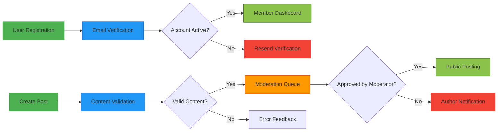

# Economic/Political Discussion Board Requirements Analysis Report

## Document Overview

This comprehensive requirements analysis report provides detailed specifications for an economic/political discussion board platform designed to facilitate structured community discourse on economic and political topics with support for image and file attachments. The system implements a three-tier user model (guest, member, moderator) with clearly defined permissions to balance openness with content quality.

The documentation approach emphasizes simplicity and minimal implementation while ensuring all necessary functionality is clearly specified for production development. Each section below outlines business requirements in natural language using EARS format (Event-Action-Result-State) to ensure requirements are testable and unambiguous for development implementation.

## Service Context and Purpose

THE Economic/Political Discussion Board service SHALL provide a dedicated platform for community-driven dialogue on economic and political issues with features that support structured content creation, media attachment capabilities, and appropriate moderation tools to maintain discourse quality.

WHEN citizens seek focused discussion on economic or political topics, THE system SHALL offer a specialized environment that facilitates informed debate with supporting materials through images and document attachments.

WHEN users access the discussion board without authentication, THE system SHALL present public content while protecting contribution capabilities for registered members only.

WHEN content creators wish to share economic or political insights, THE system SHALL support text formatting, image inclusion, and document attachment to enable evidence-based discussions.

## User Actor Definitions

### Guest User Role

THE Guest User SHALL represent unauthenticated visitors who can browse public content but cannot create posts or participate in discussions.

WHEN a Guest User accesses the platform, THE system SHALL display public posts organized by creation date with newest items first.

WHEN a Guest User attempts to create a post, THE system SHALL redirect to the registration page with explanation that authentication is required to participate.

WHEN a Guest User attempts to comment on any post, THE system SHALL display a prompt requiring authentication before commenting is permitted.

THE Guest User SHALL be restricted from accessing administrative functions or user account settings.

### Member User Role

THE Member User SHALL represent authenticated participants who can create content, engage with other users, and manage their own contributions.

WHEN a Member User registers for an account, THE system SHALL require:
- Valid email address verification
- Password meeting security requirements (8+ characters, mixed case, numbers)
- Agreement to community guidelines and terms of service

WHEN a Member User creates a post, THE system SHALL:
- Require post title (5-200 characters)
- Require content text (10-10,000 characters)
- Require selection of category (economic or political)
- Allow attachment of up to 5 images (JPG, PNG, GIF, max 5MB each)
- Allow attachment of up to 3 files (PDF, DOC, DOCX, max 10MB each)
- Set post status to "pending" awaiting moderator approval

WHEN a Member User edits their own post within 24 hours of creation, THE system SHALL allow modification of title, content, and attachments while maintaining post creation timestamp.

WHEN a Member User deletes their own post with no comments, THE system SHALL remove it from public view and preserve in database for audit purposes.

WHEN a Member User comments on any public post, THE system SHALL:
- Accept comment text (1-2,000 characters)
- Display the comment immediately with author attribution
- Allow editing within 1 hour of posting
- Allow deletion of their own comments

### Moderator User Role

THE Moderator User SHALL represent administrative participants responsible for content quality, user management, and community standards enforcement.

WHEN a Moderator User reviews pending content, THE system SHALL display:
- Complete post content with attachments
- Author information and account status
- Submission timestamp
- Action buttons for approval, rejection, or editing

WHEN a Moderator User approves a post, THE system SHALL:
- Change post status to "approved"
- Make the post publicly visible immediately
- Notify the post author of approval status

WHEN a Moderator User rejects a post, THE system SHALL:
- Change post status to "rejected"
- Hide the post from public view
- Notify the post author with reason for rejection

WHEN a Moderator User deletes inappropriate content, THE system SHALL:
- Permanently remove the content from public view
- Log the deletion action with timestamp and moderator identification
- Notify affected users according to policy guidelines

## Content Management Requirements

### Post Creation Requirements

THE system SHALL support post creation with text content, image attachments, and document attachments organized under economic or political categories.

WHEN a user submits a new post, THE system SHALL validate:
- Title presence and length (5-200 characters)
- Content presence and length (10-10,000 characters)
- Category selection (economic or political)
- Attachment compliance with type and size limits
- Submission by authenticated member user

WHEN a user uploads an image attachment, THE system SHALL:
- Verify file format is JPG, PNG, or GIF
- Confirm file size does not exceed 5MB
- Generate unique identifier for storage reference
- Link the attachment to the associated post

WHEN a user uploads a document attachment, THE system SHALL:
- Verify file format is PDF, DOC, or DOCX
- Confirm file size does not exceed 10MB
- Scan for malware before storage processing
- Generate secure access link for the document

### Content Organization Requirements

THE system SHALL organize posts by economic and political categories with chronological presentation and search capabilities.

WHEN a user accesses the main discussion board, THE system SHALL display posts sorted by creation date in descending order with pagination.

WHEN a user searches for posts, THE system SHALL:
- Support keyword matching in titles and content
- Allow filtering by category (economic, political)
- Allow filtering by date range
- Return results within 2 seconds for optimal user experience

WHEN a user applies multiple filters, THE system SHALL return posts matching all selected criteria simultaneously.

### Comment System Requirements

THE system SHALL provide threaded commenting functionality with user attribution and moderation capabilities.

WHEN a user submits a comment, THE system SHALL:
- Validate comment text is between 1-2,000 characters
- Associate the comment with the correct parent post
- Display the comment immediately with author information
- Send notification to relevant participants as configured

WHEN a user edits their own comment within 1 hour of posting, THE system SHALL update the comment content while preserving original timestamp.

WHEN a user deletes their own comment, THE system SHALL mark the comment as deleted but retain it in database for audit trail purposes.

## Business Rules and Validation

### Content Validation Rules

THE system SHALL enforce content quality standards through automated and manual validation processes.

WHEN a member creates a post with prohibited content, THE system SHALL automatically flag for moderator review before publication.

WHEN a user submits a post without required fields, THE system SHALL reject the submission with specific error messages for each missing element.

WHEN a user attempts to attach more than 5 images to a post, THE system SHALL accept only the first 5 attachments and notify the user of the limit.

WHEN a user attempts to attach more than 3 documents to a post, THE system SHALL accept only the first 3 attachments and notify the user of the limit.

### User Account Management Rules

THE system SHALL ensure user account integrity through validation and security measures.

WHEN a user registers with an email address already in use, THE system SHALL reject the registration with explanation of existing account.

WHEN a user attempts to change email to an already registered address, THE system SHALL deny the change and suggest alternative options.

WHEN a user requests account deletion, THE system SHALL:
- Require email confirmation of deletion request
- Anonymize user content while preserving discussions
- Mark account as deactivated in user database
- Process complete deletion after 30-day review period

### Moderation Process Rules

THE system SHALL implement structured content moderation with audit capabilities and user notifications.

WHEN a moderator takes action on user content, THE system SHALL:
- Record the action in detailed moderation logs
- Include timestamp and moderator identification
- Provide justification field for action reasons
- Notify affected users according to policy guidelines

WHEN a user reports inappropriate content, THE system SHALL:
- Log the report with reporter information
- Flag the content for priority moderator review
- Prevent abuse through rate limiting mechanisms
- Send acknowledgment to reporting user

## Security and Privacy Requirements

### Authentication Security

THE system SHALL implement secure user authentication with industry-standard practices.

WHEN a user logs into their account, THE system SHALL:
- Validate credentials using secure password hashing (bcrypt minimum cost factor 12)
- Generate JWT tokens with 30-minute access expiry and 30-day refresh capability
- Implement rate limiting to prevent brute force attacks (5 attempts per hour per IP)
- Use HTTPS with TLS 1.3 encryption for all authentication communications

WHEN a user's credentials fail authentication, THE system SHALL:
- Return generic error message (not specifying which element was incorrect)
- Log failed attempt with IP address and timestamp
- Implement progressive delays after multiple failed attempts

### Data Protection Requirements

THE system SHALL protect user privacy and data integrity through encryption and access controls.

THE system SHALL encrypt all personally identifiable information at rest using AES-256 encryption.

WHEN processing file uploads, THE system SHALL scan all files for malware before making them available to users.

WHEN storing user passwords, THE system SHALL use bcrypt hashing with salt before any database persistence.

THE system SHALL implement role-based access control restricting data access based on user permissions.

## Non-Functional Requirements

### Performance Standards

THE system SHALL deliver responsive performance under normal operating conditions.

WHEN a user loads any page, THE system SHALL complete rendering within 2 seconds for 95% of requests.

THE system SHALL support concurrent access by 1,000 simultaneous users without degradation in response times.

WHEN a user uploads a file attachment, THE system SHALL process files up to 10MB within 10 seconds under standard network conditions.

THE system SHALL maintain 99.5% uptime availability during business hours.

### Usability Standards

THE system SHALL provide clear user interfaces with intuitive navigation and helpful error messaging.

WHEN a user encounters an error, THE system SHALL display plain language explanations with corrective guidance.

WHEN a user performs any action, THE system SHALL provide visual feedback indicating processing status.

THE system SHALL support responsive design compatible with desktop, tablet, and mobile viewing experiences.

### Reliability Standards

THE system SHALL maintain data integrity and recover gracefully from unexpected failures.

THE system SHALL implement automated database backups performed daily with 30-day retention.

WHEN the system experiences database connectivity issues, THE system SHALL queue critical operations for processing when connectivity is restored.

THE system SHALL maintain detailed audit logs of all user actions and administrative operations for compliance purposes.

## Success Metrics

### User Engagement Indicators

THE platform SHALL measure adoption and participation through key engagement metrics.

WHEN tracking user activity, THE system SHALL record:
- Daily active users (DAU)
- Weekly active users (WAU)
- Monthly active users (MAU)
- New user registrations per time period

WHEN measuring content creation, THE system SHALL track:
- Posts created per day/week/month
- Comments per post ratio
- Average session duration

### Content Quality Indicators

THE system SHALL monitor content standards and community health through quality metrics.

WHEN evaluating moderation effectiveness, THE system SHALL measure:
- Ratio of approved to rejected posts
- Average time for content approval
- User report resolution times
- Repeat violation incident rates

WHEN assessing community health, THE system SHALL track:
- User retention rates at 7 and 30 days
- User satisfaction survey results
- Complaint resolution timeframes

