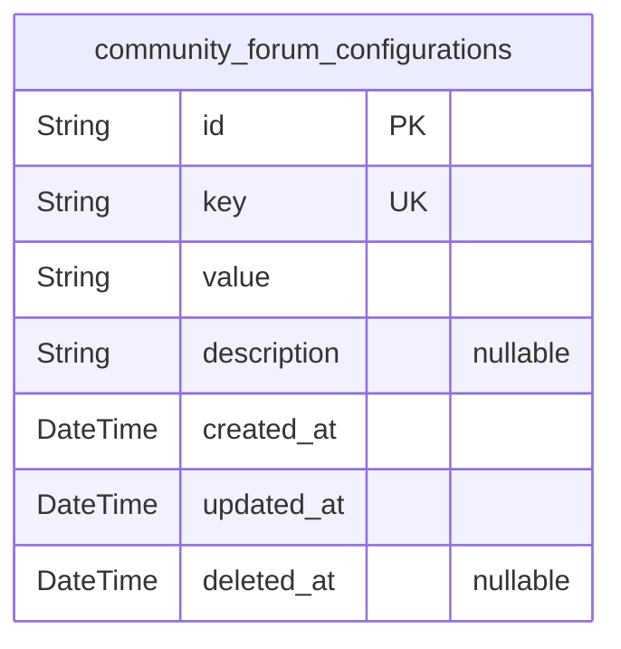
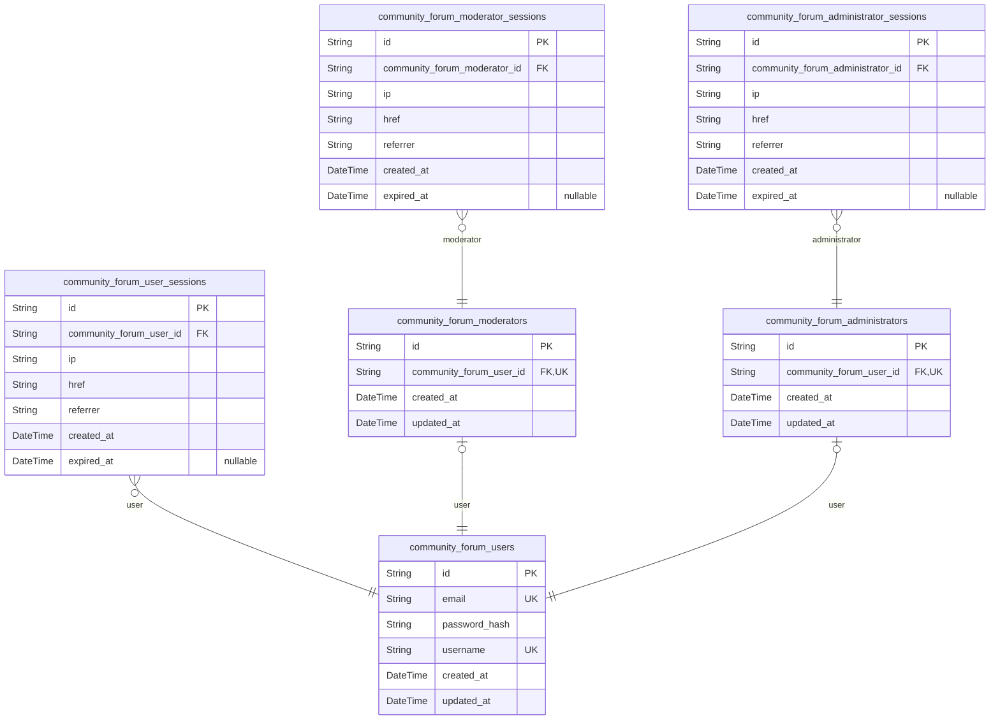
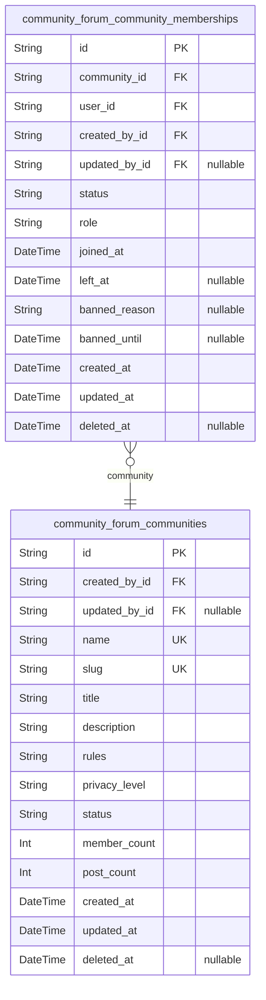
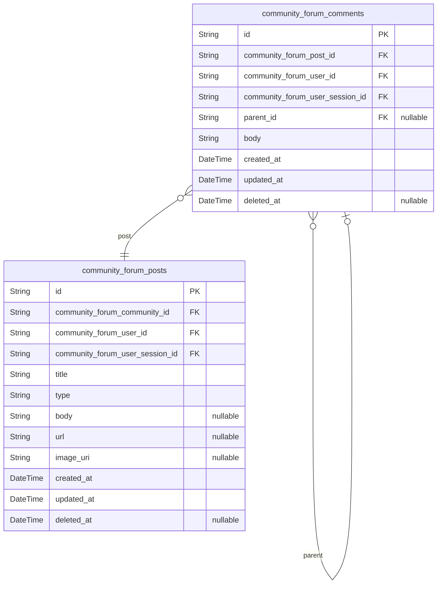
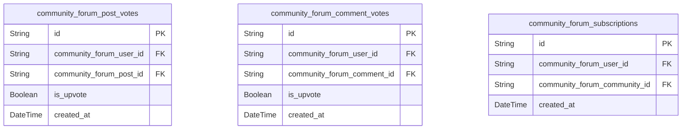
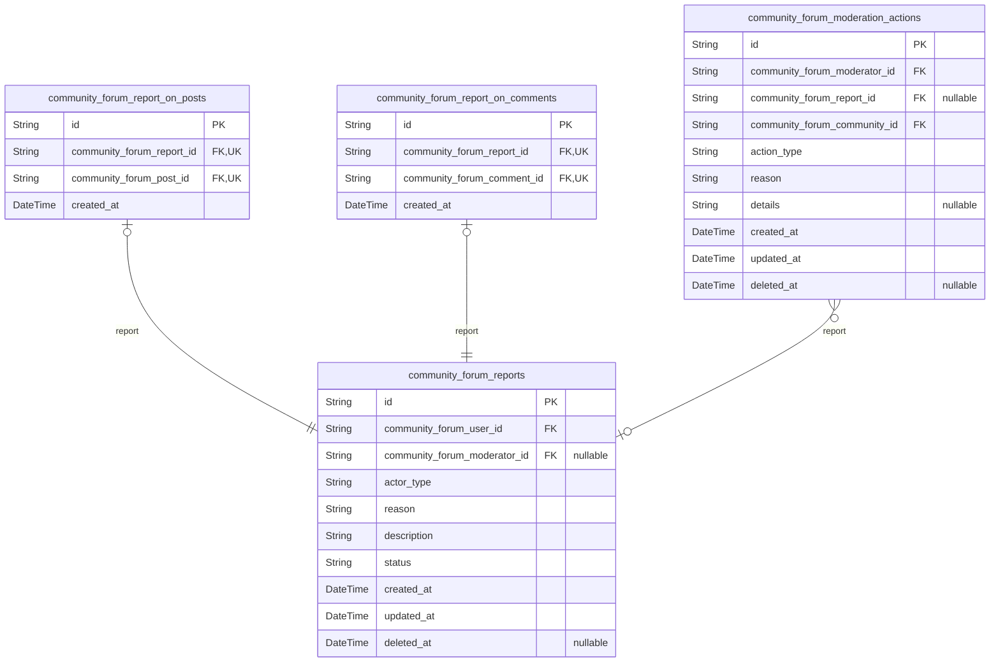
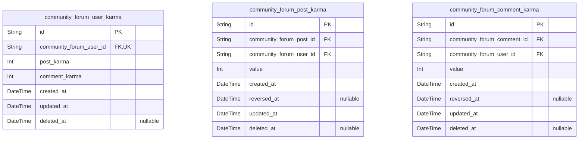

# Prisma Markdown

> Generated by [`prisma-markdown`](https://github.com/samchon/prisma-markdown)

- [Systematic](#systematic)
- [Actors](#actors)
- [Communities](#communities)
- [Content](#content)
- [Interactions](#interactions)
- [Moderation](#moderation)
- [Reputation](#reputation)

## Systematic

### `community_forum_configurations`

System-wide configuration settings for the community forum platform.

This table stores platform-level configuration parameters that affect the
behavior and functionality
of the entire community forum system. These settings control features
like voting limits, content
moderation policies, karma calculation rules, and other global platform
behaviors.

Configuration values stored in this table are typically managed by system
administrators and affect
all users and communities on the platform. Examples include rate limiting
settings, content size
limits, and platform policy configurations.

Changes to configuration settings are tracked through the standard audit
trail mechanisms with
timestamps and soft deletion support. This provides an auditable history
of configuration changes
over time.

Properties as follows:

- `id`: Primary Key.
- `key`
  > Unique identifier for the configuration parameter. This key is used to
  > reference the configuration value in application code.
- `value`
  > The configuration value stored as a string. Type conversion is handled by
  > the application layer based on the configuration key.
- `description`
  > Human-readable description of what this configuration parameter controls
  > and its possible values.
- `created_at`: Timestamp when this configuration record was created.
- `updated_at`: Timestamp when this configuration record was last updated.
- `deleted_at`: Timestamp when this configuration record was soft deleted, null if active.

## Actors

### `community_forum_users`

Registered users of the community forum platform.

This table stores the core identity information for users who have
registered on the platform. Each user has a unique email address and
password hash for authentication. Users can create posts, comments, vote
on content, and participate in communities.

Users are the primary actors on the platform and have the most basic
level of permissions. They can participate in all standard community
activities but cannot perform moderation or administrative functions.

Properties as follows:

- `id`: Primary Key.
- `email`
  > User's email address used for authentication and communication. Must be
  > unique across all users.
- `password_hash`
  > Hashed password for user authentication. Uses bcrypt with minimum 12
  > rounds for security.
- `username`
  > User's chosen display name within the community. Must be unique and
  > follow naming conventions (3-21 characters, alphanumeric and
  > underscores).
- `created_at`: Timestamp when the user account was created.
- `updated_at`: Timestamp when the user account was last updated.

### `community_forum_user_sessions`

Authentication sessions for community forum users.

This table tracks all active and expired sessions for users who have
logged into the platform. Each session record is associated with a
specific user and contains connection context information.

Sessions provide security by limiting the scope and duration of user
authentication. They also enable audit trails by recording when and how
users access the platform. Session management allows users to view and
revoke active sessions from their account settings.

Properties as follows:

- `id`: Primary Key.
- `community_forum_user_id`
  > Reference to the user who owns this session. {@link
  > community_forum_users.id}.
- `ip`: IP address from which the session was initiated.
- `href`: Connection URL used to establish the session.
- `referrer`: Referrer URL that led to the session creation.
- `created_at`: Timestamp when the session was created.
- `expired_at`
  > Timestamp when the session expires or expired. Null indicates an active
  > session.

### `community_forum_moderators`

Users with elevated permissions to manage communities and moderate content.

This table stores information for users who have been granted moderator
privileges. Moderators can perform additional functions beyond standard
user capabilities, including managing community settings, reviewing
reported content, and taking moderation actions.

Moderators may be assigned to specific communities or have broader
platform-wide moderation privileges. Their actions are logged for
accountability and review by administrators.

Properties as follows:

- `id`: Primary Key.
- `community_forum_user_id`: Reference to the base user account. [community_forum_users.id](#community_forum_users).
- `created_at`: Timestamp when moderator privileges were granted.
- `updated_at`: Timestamp when moderator information was last updated.

### `community_forum_moderator_sessions`

Authentication sessions for community forum moderators.

This table tracks authentication sessions for users with moderator
privileges. Each session record contains connection context information
specific to moderator activities.

Moderator sessions provide the same security and audit trail benefits as
user sessions, with the added capability to perform moderation actions
during the session. The session management allows moderators to track
their moderation activities by session.

Properties as follows:

- `id`: Primary Key.
- `community_forum_moderator_id`
  > Reference to the moderator who owns this session. {@link
  > community_forum_moderators.id}.
- `ip`: IP address from which the session was initiated.
- `href`: Connection URL used to establish the session.
- `referrer`: Referrer URL that led to the session creation.
- `created_at`: Timestamp when the session was created.
- `expired_at`
  > Timestamp when the session expires or expired. Null indicates an active
  > session.

### `community_forum_administrators`

System administrators with full access to manage all aspects of the
platform.

This table stores information for users with the highest level of
permissions on the platform. Administrators can manage all user accounts,
communities, system settings, and have oversight of all platform
activities.

Administrator accounts are typically reserved for platform operators and
have unrestricted access to all system functions. Their actions are
comprehensively logged for security and compliance purposes.

Properties as follows:

- `id`: Primary Key.
- `community_forum_user_id`: Reference to the base user account. [community_forum_users.id](#community_forum_users).
- `created_at`: Timestamp when administrator privileges were granted.
- `updated_at`: Timestamp when administrator information was last updated.

### `community_forum_administrator_sessions`

Authentication sessions for community forum administrators.

This table tracks authentication sessions for users with administrator
privileges. Each session record contains connection context information
specific to administrative activities.

Administrator sessions provide enhanced security monitoring as they grant
access to all platform functions. All actions performed during
administrator sessions are logged with heightened scrutiny for security
auditing.

Properties as follows:

- `id`: Primary Key.
- `community_forum_administrator_id`
  > Reference to the administrator who owns this session. {@link
  > community_forum_administrators.id}.
- `ip`: IP address from which the session was initiated.
- `href`: Connection URL used to establish the session.
- `referrer`: Referrer URL that led to the session creation.
- `created_at`: Timestamp when the session was created.
- `expired_at`
  > Timestamp when the session expires or expired. Null indicates an active
  > session.

## Communities

### `community_forum_communities`

Online communities where users can gather to discuss topics of shared
interest.

Each community represents a distinct forum with its own rules, content,
and membership. Communities are created by users and can be moderated by
appointed moderators. They serve as the primary organizational unit for
content categorization and user grouping within the platform.

Communities have a unique name and URL-friendly identifier (slug) that
allows for easy navigation and reference. They maintain descriptive
information including a title, detailed description of the community's
purpose, and rules that members are expected to follow.

The community system supports different privacy levels to control access:
- Public: Anyone can view and join
- Private: Requires approval or invitation to join
- Restricted: Anyone can view but posting requires approval

Each community tracks creation and modification timestamps, as well as
soft deletion support for administrative actions. Communities also
maintain their current status (active/inactive) for platform management
purposes.

Properties as follows:

- `id`: Primary Key.
- `created_by_id`: User who created this community. [community_forum_users.id](#community_forum_users).
- `updated_by_id`: User who last updated this community. [community_forum_users.id](#community_forum_users).
- `name`
  > Unique, human-readable name for the community (e.g.,
  > 'TechnologyEnthusiasts').
- `slug`
  > URL-friendly identifier derived from the community name for use in web
  > addresses.
- `title`
  > Official title or display name for the community, potentially different
  > from the name.
- `description`
  > Detailed explanation of the community's purpose, focus topics, and target
  > audience.
- `rules`: Community-specific rules and guidelines that members must follow.
- `privacy_level`
  > Determines who can view and participate in the community. Valid values:
  > 'public', 'private', or 'restricted'.
- `status`
  > Current operational state of the community. Valid values: 'active',
  > 'inactive', or 'archived'.
- `member_count`
  > Cached count of active members in this community for performance
  > optimization.
- `post_count`: Cached count of posts in this community for performance optimization.
- `created_at`: UTC timestamp when this community was first created.
- `updated_at`: UTC timestamp when this community was last modified.
- `deleted_at`: UTC timestamp when this community was soft deleted, if applicable.

### `community_forum_community_memberships`

Associative entity tracking user membership in communities.

This junction table maintains the many-to-many relationship between users
and communities, representing the subscription status of users to various
communities. Each record represents a user's active or historical
membership in a specific community.

Memberships track when a user joined a community and their current status
within that community. The system supports different membership states:
- active: Currently subscribed and receiving content
- inactive: Previously subscribed but unsubscribed
- pending: Requested to join but awaiting approval
- banned: Removed from community due to violations

The membership entity supports audit trails through creation, update, and
soft deletion timestamps. It also tracks which user action led to
membership changes, allowing for accountability in community moderation.

This subsidiary entity is managed through community/user relationships
rather than having independent API endpoints.

Properties as follows:

- `id`: Primary Key.
- `community_id`
  > Community to which this membership belongs. {@link
  > community_forum_communities.id}.
- `user_id`: User who holds this membership. [community_forum_users.id](#community_forum_users).
- `created_by_id`
  > User who created this membership (could be self-subscription or moderator
  > action). [community_forum_users.id](#community_forum_users).
- `updated_by_id`: User who last updated this membership. [community_forum_users.id](#community_forum_users).
- `status`
  > Current membership status. Valid values: 'active', 'inactive', 'pending',
  > 'banned'.
- `role`
  > User's role within the community. Valid values: 'member', 'moderator',
  > 'admin'.
- `joined_at`: UTC timestamp when the user officially joined the community.
- `left_at`: UTC timestamp when the user left the community, if applicable.
- `banned_reason`: If banned, the reason for the ban.
- `banned_until`: If banned temporarily, the time when the ban expires.
- `created_at`: UTC timestamp when this membership record was created.
- `updated_at`: UTC timestamp when this membership record was last modified.
- `deleted_at`: UTC timestamp when this membership was soft deleted, if applicable.

## Content

### `community_forum_posts`

Content posts created by users in community forums.

Posts represent the primary content units in the forum platform,
supporting multiple content types including text posts, link posts, and
image posts. Each post is associated with a specific community and
author, and can receive votes and comments from other users.

Posts maintain their content type identity for the entire lifecycle, with
type-specific fields being populated based on the post type. Text posts
contain body content, link posts contain URLs, and image posts may
reference uploaded media.

The platform supports post editing within a time window (6 hours) and
provides full audit trail through creation, modification, and deletion
timestamps. Soft deletion is implemented to maintain content integrity
for moderation purposes.

Properties as follows:

- `id`: Primary Key.
- `community_forum_community_id`
  > The community this post belongs to. {@link
  > community_forum_communities.id}.
- `community_forum_user_id`: The user who created this post. [community_forum_users.id](#community_forum_users).
- `community_forum_user_session_id`
  > The session when this post was created. {@link
  > community_forum_user_sessions.id}.
- `title`
  > The title of the post, displayed in post listings and as the main header.
  > Limited to 300 characters to ensure concise, scannable titles.
- `type`
  > The content type of this post, determining which content fields are
  > populated. Valid values are 'text', 'link', or 'image'.
- `body`
  > The main content body of text posts. Can contain up to 40,000 characters
  > for detailed discussions. Only populated for text posts.
- `url`
  > The URL for link posts. Must be a valid, accessible web address. Only
  > populated for link posts.
- `image_uri`
  > The URI reference to the uploaded image for image posts. Points to stored
  > media content. Only populated for image posts.
- `created_at`: The timestamp when this post was originally created.
- `updated_at`: The timestamp when this post was last modified.
- `deleted_at`
  > The timestamp when this post was deleted, if applicable. Null indicates
  > active post.

### `community_forum_comments`

Comments on forum posts with support for nested replies.

Comments enable discussion threads on posts, with support for direct
replies to posts and nested replies to other comments. Each comment
maintains a clear relationship to its parent post and can optionally
reference a parent comment for threaded conversations.

The nested structure supports up to 10 levels of indentation as per
requirements, with visual presentation managed by the frontend. Comments
can be edited by their authors within a limited time window (15 minutes)
and support full audit tracking.

Comments contribute to user karma when upvoted and can be reported for
inappropriate content. The system preserves comment hierarchies even when
intermediate comments are deleted, maintaining conversation context.

Properties as follows:

- `id`: Primary Key.
- `community_forum_post_id`: The post this comment belongs to. [community_forum_posts.id](#community_forum_posts).
- `community_forum_user_id`: The user who created this comment. [community_forum_users.id](#community_forum_users).
- `community_forum_user_session_id`
  > The session when this comment was created. {@link
  > community_forum_user_sessions.id}.
- `parent_id`
  > The parent comment this is a reply to, for threaded discussions. {@link
  > community_forum_comments.id}.
- `body`
  > The content of the comment, limited to 10,000 characters for detailed
  > responses while preventing excessive length.
- `created_at`: The timestamp when this comment was originally created.
- `updated_at`: The timestamp when this comment was last modified.
- `deleted_at`
  > The timestamp when this comment was deleted, if applicable. Null
  > indicates active comment.

## Interactions

### `community_forum_post_votes`

Tracks user voting activity on forum posts.

This table records all upvote and downvote actions taken by users on
posts within communities. Each record represents a single user's vote on
a specific post, storing whether the vote was positive or negative. The
table maintains a strict one-vote-per-user-per-post constraint through
its unique index.

Votes are fundamental to the platform's content ranking system,
influencing post visibility and user reputation. When a user votes on a
post, the system updates both this tracking table and the associated
user's karma scores. Users cannot vote on their own content, which is
enforced through application logic.

The temporal nature of voting allows for analysis of user engagement
patterns and content popularity trends over time. Votes can be changed by
users at any time after an initial cooldown period, with the system
updating existing records rather than creating new ones.

Properties as follows:

- `id`: Primary Key.
- `community_forum_user_id`: The user who cast the vote. [community_forum_users.id](#community_forum_users).
- `community_forum_post_id`: The post that was voted on. [community_forum_posts.id](#community_forum_posts).
- `is_upvote`
  > Indicates whether this was an upvote (true) or downvote (false). This
  > binary value determines the direction of the vote and its impact on the
  > post's score and the author's karma.
- `created_at`
  > Timestamp when the vote was cast. This temporal data enables analysis of
  > voting patterns over time and supports features like vote trending.

### `community_forum_comment_votes`

Records user voting activity on forum comments.

This table tracks all upvote and downvote interactions between users and
comments. Each entry represents a single voting action, storing the user
who voted, the comment that was voted on, and whether the vote was
positive or negative. The table enforces one-vote-per-user-per-comment
through its unique constraints.

Comment voting is essential for comment sorting and user reputation
management. Positive votes contribute to a user's comment karma,
encouraging quality discussion and engagement. The system prevents users
from voting on their own comments through application-level checks.

The temporal tracking in this table enables analysis of discussion
quality and user engagement with specific comment threads. Vote data can
be aggregated to determine comment sorting order and identify
high-quality contributions to discussions.

Properties as follows:

- `id`: Primary Key.
- `community_forum_user_id`: The user who cast the vote. [community_forum_users.id](#community_forum_users).
- `community_forum_comment_id`: The comment that was voted on. [community_forum_comments.id](#community_forum_comments).
- `is_upvote`
  > Indicates whether this was an upvote (true) or downvote (false). This
  > value determines the impact on the comment's visibility and the author's
  > reputation.
- `created_at`
  > Timestamp when the vote was cast. Used for temporal analysis of comment
  > engagement and voting patterns.

### `community_forum_subscriptions`

Manages user subscriptions to forum communities.

This table tracks which users are subscribed to which communities,
forming the basis for personalized content feeds. Each record represents
a user's active subscription to a community, controlling what content
appears in their personalized feed. Users can subscribe and unsubscribe
at any time, with the system maintaining current subscription states.

Subscriptions are fundamental to content discovery and user engagement on
the platform. They determine which posts appear in a user's feed and
influence recommendations for similar communities. The system uses this
data to personalize content ranking and suggest relevant discussions.

The temporal nature of subscriptions allows for tracking user interests
over time and identifying community growth patterns. This information is
valuable for community moderators and platform administrators in
understanding audience engagement and content preferences.

Properties as follows:

- `id`: Primary Key.
- `community_forum_user_id`
  > The user who subscribed to the community. {@link
  > community_forum_users.id}.
- `community_forum_community_id`: The community being subscribed to. [community_forum_communities.id](#community_forum_communities).
- `created_at`
  > Timestamp when the subscription was created. This enables tracking of
  > user interests over time and community growth patterns.

## Moderation

### `community_forum_reports`

Main entity for content and user reports in the community forum.

This table serves as the central reporting mechanism for the platform,
allowing users to flag inappropriate content or behavior. Reports can be
filed against both posts and comments through a polymorphic relationship
pattern. Each report includes categorization, detailed description, and
status tracking.

The system supports various report categories including spam, harassment,
misinformation, and other violations. Reports flow through a workflow
from pending to resolved states, with moderation actions documenting the
resolution process. This table maintains an audit trail of all reported
content while preserving user anonymity during the reporting process.

Properties as follows:

- `id`: Primary Key.
- `community_forum_user_id`: User who filed the report. [community_forum_users.id](#community_forum_users).
- `community_forum_moderator_id`: Moderator who handled the report. [community_forum_moderators.id](#community_forum_moderators).
- `actor_type`
  > Type of entity being reported (post or comment). Valid values: 'post',
  > 'comment'.
- `reason`
  > Categorization of the report reason. Valid values include: spam,
  > harassment, misinformation, copyright, violence, hate_speech, or other.
- `description`
  > Detailed explanation of why the content is being reported. Must be
  > between 10-1000 characters to provide sufficient context for moderators.
- `status`
  > Current status of the report in the moderation workflow. Valid values:
  > pending, resolved, dismissed, under_review.
- `created_at`: Timestamp when the report was filed.
- `updated_at`: Timestamp when the report was last updated.
- `deleted_at`: Timestamp when the report was soft deleted (if applicable).

### `community_forum_report_on_posts`

Subtype entity linking reports to posts in the community forum.

This table implements the polymorphic relationship pattern for
post-specific reports. Each entry connects a report to a specific post
that was reported, maintaining the referential integrity between the
generic report entity and the actual content being reported. This
structure allows the system to efficiently query all reports related to
specific posts while preserving the generic reporting framework.

The 1:1 relationship with community_forum_reports ensures that each post
report corresponds to exactly one entry in the main reports table. This
subtype contains post-specific metadata that is only relevant for content
reports (as opposed to potential user behavior reports).

Properties as follows:

- `id`: Primary Key.
- `community_forum_report_id`: Reference to the main report entity. [community_forum_reports.id](#community_forum_reports).
- `community_forum_post_id`: The post being reported. [community_forum_posts.id](#community_forum_posts).
- `created_at`: Timestamp when the post report relationship was established.

### `community_forum_report_on_comments`

Subtype entity linking reports to comments in the community forum.

This table implements the polymorphic relationship pattern for
comment-specific reports. Each entry connects a report to a specific
comment that was reported, maintaining referential integrity and enabling
efficient querying of comment-related reports. This structure separates
comment reports from post reports while preserving the generic reporting
framework.

The 1:1 relationship with community_forum_reports ensures that each
comment report corresponds to exactly one entry in the main reports
table. This subtype contains comment-specific metadata that is only
relevant for content reports on comments.

Properties as follows:

- `id`: Primary Key.
- `community_forum_report_id`: Reference to the main report entity. [community_forum_reports.id](#community_forum_reports).
- `community_forum_comment_id`: The comment being reported. [community_forum_comments.id](#community_forum_comments).
- `created_at`: Timestamp when the comment report relationship was established.

### `community_forum_moderation_actions`

Record of all moderation actions taken on reported content or user behavior.

This table maintains an audit trail of all moderator interventions in the
community forum. Each entry documents a specific action taken by a
moderator in response to a report or observed violation. The system
tracks different types of moderation actions including content removal,
user warnings, temporary restrictions, and permanent bans.

The workflow allows moderators to document their decisions and provides
transparency in the moderation process. Actions are linked to specific
reports but can also be initiated independently by moderators who observe
violations directly. This table supports the community governance
framework by ensuring accountability in all moderation activities.

Properties as follows:

- `id`: Primary Key.
- `community_forum_moderator_id`: Moderator who performed the action. [community_forum_moderators.id](#community_forum_moderators).
- `community_forum_report_id`
  > Report that triggered this action (if applicable). {@link
  > community_forum_reports.id}.
- `community_forum_community_id`
  > Community where the moderation action occurred. {@link
  > community_forum_communities.id}.
- `action_type`
  > Type of moderation action performed. Valid values: remove_content,
  > warn_user, restrict_user, ban_user, approve_report, dismiss_report.
- `reason`: Explanation of why the moderation action was taken.
- `details`
  > Additional details about the moderation action. May include evidence
  > references or policy citations.
- `created_at`: Timestamp when the moderation action was performed.
- `updated_at`: Timestamp when the moderation action record was last updated.
- `deleted_at`
  > Timestamp when the moderation action record was soft deleted (if
  > applicable).

## Reputation

### `community_forum_user_karma`

User karma tracking for the community forum platform.

This table maintains the overall karma score for each user, aggregating
post karma and comment karma. The karma system serves as the core
reputation mechanism for the community platform, quantifying user
contributions and engagement to establish trust, credibility, and
community standing. This system incentivizes quality contributions by
rewarding valuable content while discouraging spam or harmful behavior.

The total karma score is calculated as the sum of post karma and comment
karma. This table also includes timestamps for tracking when the karma
was last updated, enabling karma decay calculations and historical
analysis.

Properties as follows:

- `id`: Primary Key.
- `community_forum_user_id`
  > Reference to the user this karma record belongs to. {@link
  > community_forum_users.id}.
- `post_karma`: The user's post karma score, representing upvotes received on their posts.
- `comment_karma`
  > The user's comment karma score, representing upvotes received on their
  > comments.
- `created_at`: Timestamp when this karma record was first created.
- `updated_at`: Timestamp when this karma record was last updated.
- `deleted_at`: Timestamp when this karma record was deleted (soft delete).

### `community_forum_post_karma`

Post-specific karma tracking for the community forum platform.

This table tracks karma changes for individual posts, allowing for
detailed analysis of which posts contribute to a user's overall
reputation. When a user's post receives an upvote, a record is created in
this table to increment the post author's post karma by 1 point. When a
user's post receives a downvote, a record is created to decrement the
post author's post karma by 1 point.

This detailed tracking enables features like karma history logs and helps
prevent karma farming through repetitive voting patterns by monitoring
for suspicious activity. When a user deletes a post that has received
upvotes, the system reverses all karma points awarded for those upvotes.

Properties as follows:

- `id`: Primary Key.
- `community_forum_post_id`
  > Reference to the post this karma record is associated with. {@link
  > community_forum_posts.id}.
- `community_forum_user_id`
  > Reference to the user who owns this post and receives the karma. {@link
  > community_forum_users.id}.
- `value`
  > The karma value awarded or deducted for this post (typically +1 for
  > upvote, -1 for downvote).
- `created_at`: Timestamp when this karma change was recorded.
- `reversed_at`
  > Timestamp when this karma change was reversed (e.g., when a post is
  > deleted).
- `updated_at`: Timestamp when this karma record was last updated.
- `deleted_at`: Timestamp when this karma record was deleted (soft delete).

### `community_forum_comment_karma`

Comment-specific karma tracking for the community forum platform.

This table tracks karma changes for individual comments, allowing for
detailed analysis of which comments contribute to a user's overall
reputation. When a user's comment receives an upvote, a record is created
in this table to increment the comment author's comment karma by 1 point.
When a user's comment receives a downvote, a record is created to
decrement the comment author's comment karma by 1 point.

This detailed tracking enables features like karma history logs and helps
prevent karma farming through repetitive voting patterns by monitoring
for suspicious activity. When a user deletes a comment that has received
upvotes, the system reverses all karma points awarded for those upvotes.

Properties as follows:

- `id`: Primary Key.
- `community_forum_comment_id`
  > Reference to the comment this karma record is associated with. {@link
  > community_forum_comments.id}.
- `community_forum_user_id`
  > Reference to the user who owns this comment and receives the karma.
  > [community_forum_users.id](#community_forum_users).
- `value`
  > The karma value awarded or deducted for this comment (typically +1 for
  > upvote, -1 for downvote).
- `created_at`: Timestamp when this karma change was recorded.
- `reversed_at`
  > Timestamp when this karma change was reversed (e.g., when a comment is
  > deleted).
- `updated_at`: Timestamp when this karma record was last updated.
- `deleted_at`: Timestamp when this karma record was deleted (soft delete).
