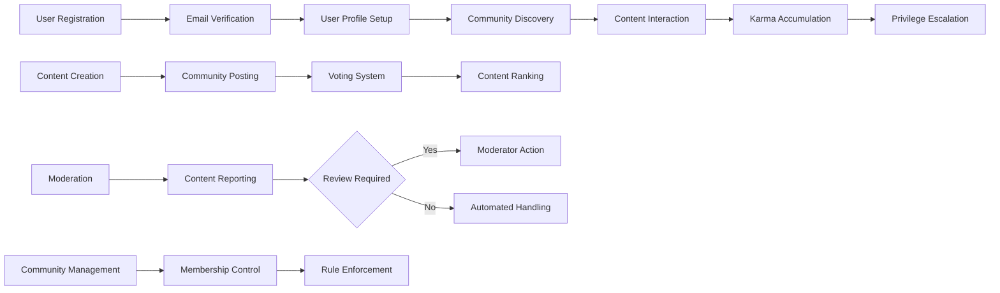

# Reddit-like Community Platform Requirements Analysis

## Overview

This document outlines the requirements for a Reddit-like community platform that enables users to create and participate in topic-based communities. The platform will support user registration and authentication, community creation and management, content posting in multiple formats, voting systems, nested commenting, user reputation through karma, content organization, and moderation features.

## Functional Requirements

### User Registration and Authentication
WHEN a user accesses the platform, THE system SHALL present registration and login options.
WHEN a user registers, THE system SHALL require a unique username, valid email address, and password that meets security requirements (minimum 8 characters with mixed case letters and numbers).
WHEN a user logs in successfully, THE system SHALL create an authenticated session with appropriate permissions based on user role.
WHEN a user's session expires, THE system SHALL redirect them to the login page.
THE system SHALL support secure password reset functionality via email verification.

### Community Management
WHEN a user decides to create a new community, THE system SHALL allow them to specify a unique community name, description, and rules.
WHEN a user submits a community creation request, THE system SHALL validate that the community name is unique and follows naming conventions.
WHEN a user visits a community page, THE system SHALL display options to join or leave the community.
THE system SHALL maintain a directory of all communities, accessible to all users for browsing and joining.

### Post Creation and Management
WHEN a user navigates to create a new post, THE system SHALL present options for text posts, link posts, and image posts.
WHEN a user creates a text post, THE system SHALL allow them to enter a title (1-300 characters) and content body (0-40,000 characters).
WHEN a user creates a link post, THE system SHALL validate that the URL follows proper formatting standards.
WHEN a user creates an image post, THE system SHALL accept common image formats (JPEG, PNG, GIF) with appropriate size limits.
WHEN a user submits a post, THE system SHALL validate all required fields are completed before publishing.

### Voting System
WHEN a registered user views a post or comment, THE system SHALL display upvote and downvote buttons.
WHEN a user clicks the upvote button on content they haven't voted on, THE system SHALL increment the vote count by one and record the user's vote.
WHEN a user clicks the downvote button on content they haven't voted on, THE system SHALL decrement the vote count by one and record the user's vote.
WHEN a user clicks an already selected vote button, THE system SHALL remove their vote and adjust the vote count accordingly.
THE system SHALL prevent users from voting on their own content.

### Comment System
WHEN a user views a post, THE system SHALL present a comment input field allowing text entry.
WHEN a user submits a comment, THE system SHALL validate the content meets guidelines and associate the comment with the post.
WHEN a user replies to an existing comment, THE system SHALL create a nested reply structure preserving parent-child relationships.
THE system SHALL support comment threading with visual indentation indicating nesting level.

### Karma System
WHEN a user receives an upvote on their post, THE system SHALL increase their post karma by one point.
WHEN a user receives an upvote on their comment, THE system SHALL increase their comment karma by one point.
THE system SHALL calculate total karma as the sum of post karma and comment karma.
THE system SHALL display user karma scores on their profile and next to their username.

### Content Organization and Sorting
WHEN a user views a community or their feed, THE system SHALL provide options to sort content by:
- Hot (algorithm based on engagement and recency)
- New (chronological order)
- Top (highest upvoted content)
- Controversial (content with high vote variance)
THE system SHALL implement pagination for content lists with configurable items per page.

### Subscription System
WHEN a user visits a community page, THE system SHALL clearly indicate their current subscription status.
WHEN a user subscribes to a community, THE system SHALL add that community's content to their personalized feed.
WHEN a user unsubscribes from a community, THE system SHALL remove that community's content from their personalized feed.
THE system SHALL maintain a user profile section listing all subscribed communities.

### User Profiles
WHEN a user accesses their profile, THE system SHALL display their username, account creation date, karma statistics, and subscribed communities.
WHEN a user visits another user's profile, THE system SHALL display publicly visible information including post and comment history.
THE system SHALL allow users to view their posting history and comment history in separate tabs on their profile page.
THE system SHALL support profile customization options such as bio and display preferences.

### Content Reporting and Moderation
WHEN a user encounters inappropriate content, THE system SHALL provide a "Report" option for both posts and comments.
WHEN a user selects the report option, THE system SHALL present a standardized form with common reporting categories.
WHEN a user submits a report, THE system SHALL store the report with reporter ID, reported content ID, reason, and timestamp.
THE system SHALL allow users to provide additional details when submitting a report.

## User Scenarios

### Scenario 1: New User Registration and First Post
1. User visits the platform and chooses to register
2. User fills in registration form with email, username, and password
3. System sends verification email
4. User clicks verification link
5. User logs in and is directed to onboarding
6. User subscribes to a few communities of interest
7. User navigates to a community and creates their first text post

### Scenario 2: Content Interaction
1. User views their home feed showing posts from subscribed communities
2. User upvotes several posts they find interesting
3. User comments on a post with their opinion
4. User replies to another user's comment
5. User's content receives upvotes, increasing their karma

### Scenario 3: Community Moderation
1. Moderator receives notification of reported content
2. Moderator reviews the reported post/comment
3. Moderator decides to remove the content based on community rules
4. System notifies the content creator of the removal
5. User appeals the decision through the proper channels

## Business Rules

### User Management Rules
THE system SHALL require email verification before users can create posts or communities.
THE system SHALL limit users to 10 votes per hour during their first 24 hours on the platform.
THE system SHALL automatically lock accounts after 5 failed login attempts within 15 minutes.

### Content Rules
THE system SHALL limit text posts to 40,000 characters.
THE system SHALL limit comments to 10,000 characters.
THE system SHALL reject image uploads larger than 10MB.
THE system SHALL only accept JPEG, PNG, and GIF image formats.

### Voting Rules
THE system SHALL prevent users from changing votes within 5 minutes of the original vote.
THE system SHALL allow users to reverse their votes at any time after the cooldown period.
THE system SHALL not decrease user karma when their content receives downvotes.

### Community Rules
THE system SHALL limit users to creating 10 communities per account.
THE system SHALL require communities to have at least one post within 30 days of creation to remain active.
THE system SHALL automatically archive inactive communities after 1 year of no activity.

### Karma Rules
THE system SHALL award 1 karma point for each upvote received on posts.
THE system SHALL award 1 karma point for each upvote received on comments.
THE system SHALL not subtract karma points for downvotes received.
THE system SHALL implement karma decay for accounts inactive for 6 months.

## Error Handling

WHEN a user attempts to register with an existing email, THE system SHALL display an error message indicating the email is already in use.
WHEN a user attempts to create a community with an existing name, THE system SHALL display an error message and suggest alternatives.
WHEN a user attempts to upload an invalid file type, THE system SHALL reject the upload and display supported formats.
WHEN a user attempts to vote while not authenticated, THE system SHALL redirect them to the login page.
WHEN the system encounters an internal error, THE system SHALL log the error details and present a user-friendly message.

## Authentication and Authorization

### User Roles
THE platform SHALL define three user roles:
1. User: Standard community members with basic posting and interaction privileges
2. Moderator: Elevated users with content management privileges in specific communities
3. Administrator: System-level users with full platform management capabilities

### Access Controls
WHEN a user attempts to access administrative functions, THE system SHALL verify administrator privileges.
WHEN a user attempts to moderate content, THE system SHALL verify moderator privileges for that community.
WHEN a user attempts to edit content, THE system SHALL verify the user is the original author.
THE system SHALL implement role-based access controls for all platform features.

### Session Management
THE system SHALL maintain user sessions for 30 days of inactivity.
THE system SHALL support single sign-on across all platform services.
THE system SHALL allow users to view and revoke active sessions from their account settings.

## System Workflows

## Non-Functional Requirements

### Performance
THE system SHALL load pages within 2 seconds for 95% of requests.
THE system SHALL support 10,000 concurrent users.
THE system SHALL process votes and update displays in real-time.

### Security
THE system SHALL encrypt all passwords using industry-standard hashing.
THE system SHALL implement secure session management with automatic timeout.
THE system SHALL protect against common web vulnerabilities (XSS, CSRF, SQL injection).

### Scalability
THE system SHALL support horizontal scaling to accommodate user growth.
THE system SHALL implement caching for frequently accessed content.
THE system SHALL maintain performance with datasets up to 100 million posts.

This requirements analysis provides a comprehensive foundation for developing a Reddit-like community platform with all the essential features users expect from such platforms, while ensuring proper user management, content organization, and community moderation capabilities.