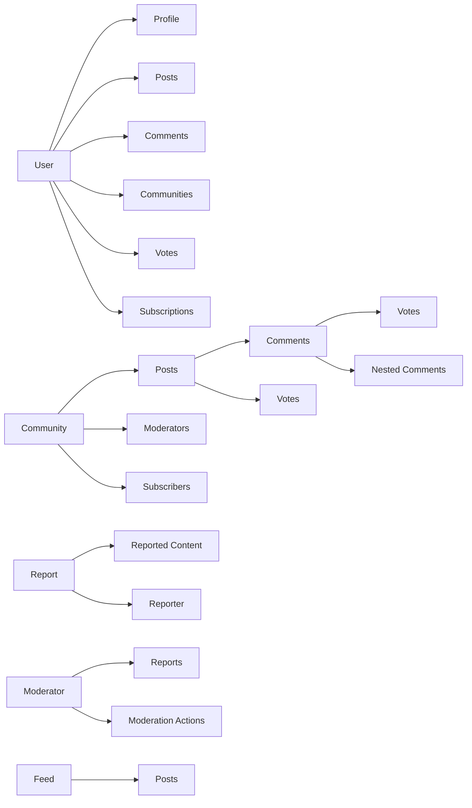

# Reddit-like Community Platform - Service Overview

## Table of Contents

1. [Introduction and Vision](#1-introduction-and-vision)
2. [Core Entities Overview](#2-core-entities-overview)
3. [User Roles and Permissions](#3-user-roles-and-permissions)
4. [Karma System](#4-karma-system)
5. [Community Structure](#5-community-structure)
6. [Content Management](#6-content-management)
7. [Voting System](#7-voting-system)
8. [Moderation Features](#8-moderation-features)
9. [Reporting System](#9-reporting-system)
10. [Technical Requirements](#10-technical-requirements)

## 1. Introduction and Vision

### 1.1 Platform Overview

THE Reddit-like Community Platform SHALL provide a space for users to create communities, share content, engage in discussions, and build reputation through a karma-based system. Users can participate in communities of interest, contribute content in various formats, and interact with other community members through comments and voting.

### 1.2 Core Purpose

WHEN users seek a platform to share their interests and connect with like-minded individuals, THE Reddit-like Community Platform SHALL offer a centralized space where users can:

- Create and participate in topic-specific communities
- Share various types of content (text, links, images)
- Engage in threaded discussions through comments
- Build reputation through community recognition (karma)
- Discover new content through personalized feeds

### 1.3 Key Differentiators

THE Reddit-like Community Platform SHALL distinguish itself through:

- Comprehensive karma system that tracks user contributions across all activities
- Flexible community structure with multiple moderator roles and responsibilities
- Rich content feeds with multiple sorting options (Hot, New, Top, Controversial)
- Robust reporting and moderation systems to maintain platform quality
- Three-tier feed system (Home, Popular, Community) for content discovery

## 2. Core Entities Overview

### 2.1 User Entity

THE User entity SHALL represent an individual who has registered on the platform. Each user SHALL have:

- Unique username for identification
- Email address for authentication
- Password for account security
- Profile containing display information
- Karma score reflecting community contributions
- Collection of created posts and comments
- List of community subscriptions
- Moderator roles in various communities

### 2.2 Profile Entity

THE Profile entity SHALL store a user's public-facing information. Each profile SHALL include:

- Display name visible to other users
- Bio text describing the user
- Avatar image for visual identification
- Total karma score
- List of all posts created by the user
- List of all comments written by the user

### 2.3 Community Entity

THE Community entity SHALL represent a topic-specific group where users can share content. Each community SHALL have:

- Unique name for identification
- Description text explaining the community purpose
- Icon image for visual representation
- Owner who created the community
- List of moderators
- List of subscribers
- Collection of posts within the community
- Count of current subscribers

### 2.4 Post Entity

THE Post entity SHALL represent content created by a user within a community. Each post SHALL include:

- Title (required for all post types)
- Content that varies by post type:
  - Text post: Body text content
  - Link post: URL to external content
  - Image post: Uploaded image content
- Author who created the post
- Community where the post was published
- Vote score representing community sentiment
- Comment count showing discussion level
- Timestamp of creation
- Type identifier (text/link/image)

### 2.5 Comment Entity

THE Comment entity SHALL represent a user's response to a post or another comment. Each comment SHALL include:

- Author who created the comment
- Content text of the comment
- Vote score representing community sentiment
- Timestamp of creation
- Reference to the post or parent comment
- List of nested replies (no depth limit)

### 2.6 Vote Entity

THE Vote entity SHALL record a user's sentiment toward a post or comment. Each vote SHALL include:

- User who cast the vote
- Target entity (post or comment) being voted on
- Direction of the vote (upvote, downvote, or none)
- Timestamp of when the vote was cast

### 2.7 Feed Entity

THE Feed entity SHALL organize posts for user consumption. Each feed SHALL include:

- Type identifier (Home, Popular, Community)
- Collection of posts from relevant sources
- Current sorting mechanism (Hot, New, Top, Controversial)
- Pagination information for content browsing

## 3. User Roles and Permissions

### 3.1 Role Definitions

WHEN a user registers on the platform, THE system SHALL create an account with "user" privileges by default. Users can gain additional roles through community participation.

THE role-based permission system SHALL include:

| Role | Description | Permissions |
|------|-------------|------------|
| User | Regular platform participant | Create posts/comments, vote, subscribe to communities, manage own content |
| Moderator | Community administrator | Moderate content in assigned communities, ban/unban users, handle reports |
| Community Owner | Creator of specific community | All moderator permissions plus ability to add/remove moderators |
| Admin | Platform-wide administrator | Manage all aspects of the platform |

### 3.2 Role-Based Permissions

#### 3.2.1 Standard User Permissions

THE standard user SHALL be able to:

- Register for an account with email and password
- Log in using email and password
- Change their own password
- Delete their own account (including all posts and comments)
- Edit their profile information (display name, bio, avatar)
- View any user's profile including all public information
- Create communities
- Browse all communities
- Search for communities by name
- Subscribe to and unsubscribe from communities
- Create posts in subscribed communities
- Edit their own posts
- Delete their own posts
- Write comments on any post
- Reply to comments with no depth limit
- Edit their own comments
- Delete their own comments
- Upvote or downvote any post or comment
- Change or remove their votes

#### 3.2.2 Moderator Permissions

WHILE a user has moderator role in a community, THE system SHALL grant permissions to:

- Delete any post within their assigned communities
- Delete any comment within their assigned communities
- Ban users from their assigned communities
- Unban users from their assigned communities
- View the list of banned users in their assigned communities
- Review and handle reports in their assigned communities

#### 3.2.3 Community Owner Permissions

WHILE a user is the owner of a community, THE system SHALL grant all moderator permissions AND:

- Add other users as moderators in their community
- Remove moderator roles from other users (except themselves)
- Transfer ownership to another user
- Modify community information (name, description, icon)

#### 3.2.4 Administrator Permissions

WHILE a user has admin role, THE system SHALL grant permissions to:

- Manage all user accounts
- Delete any content on the platform
- Ban or unban any user from any community or entirely
- View all reports
- Manage all communities
- Access system-level configuration

## 4. Karma System

### 4.1 Karma Calculation

THE karma system SHALL track a user's overall reputation based on community interactions with their content. Each user SHALL maintain a single karma score that can be positive or negative.

WHEN a user's post receives an upvote, THE system SHALL increase their karma score by 1.

WHEN a user's post receives a downvote, THE system SHALL decrease their karma score by 1.

WHEN a user's comment receives an upvote, THE system SHALL increase their karma score by 1.

WHEN a user's comment receives a downvote, THE system SHALL decrease their karma score by 1.

WHEN a user's post or comment has a vote removed, THE system SHALL adjust their karma accordingly (decrease by 1 for removed upvote, increase by 1 for removed downvote).

### 4.2 Karma Effects

THE user's karma score SHALL be displayed on their profile page for all users to see.

THE user's karma score SHALL influence the visibility of their content in certain sorting algorithms (not specified in current requirements but available for future implementation).

THE user's karma score SHALL be displayed alongside their posts and comments in feeds.

THE platform SHALL NOT impose restrictions on users with negative karma scores in the current version.

### 4.3 Karma Display

THE user profile page SHALL show the total karma score prominently.

THE user's karma score SHALL be visible in all content they create (posts and comments).

THE karma score SHALL be updated in real-time as votes are cast or removed.

## 5. Community Structure

### 5.1 Community Creation

WHEN a user decides to create a community, THE system SHALL require:

- A unique name that has not been used by any existing community
- A description explaining the community's purpose
- An optional icon image for visual identification

THE user who creates a community SHALL automatically become the community owner.

THE community owner SHALL have full administrative control over the community.

### 5.2 Community Discovery

THE platform SHALL provide mechanisms for users to find communities:

- Browse all communities in a list format
- Search communities by name with text matching
- View communities by category or popularity metrics

THE community listing SHALL show each community's:

- Name and description
- Icon image
- Subscriber count
- Recent activity level

### 5.3 Community Subscription

WHEN a user wants to join a community, THE system SHALL allow them to subscribe.

WHEN a user subscribes to a community, THE system SHALL:

- Add the community to their subscription list
- Allow them to create posts in that community
- Include the community's posts in their Home feed

WHEN a user unsubscribes from a community, THE system SHALL:

- Remove the community from their subscription list
- Prevent them from creating new posts in that community
- Exclude the community's posts from their Home feed

THE platform SHALL provide a page showing all communities a user is subscribed to.

### 5.4 Community Roles

THE community structure SHALL support multiple role levels:

- Owner: Single person who created the community
- Moderators: Multiple users with administrative privileges
- Subscribers: Users who have joined the community
- Banned Users: Users prohibited from participating

## 6. Content Management

### 6.1 Post Creation

WHEN a user wants to create a post, THE system SHALL verify they are subscribed to the target community before allowing creation.

THE system SHALL support three types of posts:

1. Text Posts: Posts with text content
2. Link Posts: Posts with a URL to external content
3. Image Posts: Posts with an uploaded image

ALL post types SHALL require a title.

THE post creation process SHALL capture:

- Title (required)
- Content appropriate to post type
- Selected community
- Author information
- Creation timestamp

### 6.2 Post Editing and Deletion

THE author of a post SHALL be able to edit their own posts at any time.

THE author of a post SHALL be able to delete their own posts at any time.

WHEN a post is deleted, THE system SHALL also remove all associated comments.

THE author of a post SHALL be able to delete their post even after others have commented on it.

### 6.3 Post Display

WHEN displaying a single post, THE system SHALL show:

- Title
- Full content of the post
- Author username
- Community name
- Vote score
- Comment count
- Creation timestamp

WHEN displaying a list of posts in a feed, THE system SHALL show each post with:

- Title
- Author username
- Community name
- Vote score
- Comment count
- Time since posted
- Content preview based on post type:
  - Text posts: First 200 characters of content
  - Image posts: Thumbnail of the image
  - Link posts: Domain name of the URL

### 6.4 Comment Creation

WHEN a user wants to comment on a post, THE system SHALL allow creating a top-level comment.

WHEN a user wants to reply to a comment, THE system SHALL allow creating a nested reply with no depth limit.

THE comment creation process SHALL capture:

- Content text
- Parent post or comment reference
- Author information
- Creation timestamp

### 6.5 Comment Editing and Deletion

THE author of a comment SHALL be able to edit their own comments at any time.

THE author of a comment SHALL be able to delete their own comments at any time.

WHEN a comment is deleted, THE system SHALL also remove all nested replies.

THE comment deletion process SHALL:

- Remove the comment and all replies
- Update parent comment or post reference accordingly
- Update comment counts on parent entities

### 6.6 Comment Display

WHEN displaying comments, THE system SHALL show:

- Author username
- Content text
- Vote score
- Time since posted
- Nested replies in a threaded format

## 7. Voting System

### 7.1 Post Voting

WHEN a user views a post, THE system SHALL display voting options (upvote, downvote, remove vote).

THE system SHALL allow only one vote per user per post.

WHEN a user votes on a post, THE system SHALL:

- Record the vote direction
- Update the post's vote score
- Update the post author's karma score
- Prevent additional votes from the same user

WHEN a user changes their vote on a post, THE system SHALL:

- Update their existing vote to the new direction
- Adjust the post's vote score accordingly
- Adjust the post author's karma score accordingly

WHEN a user removes their vote on a post, THE system SHALL:

- Remove their existing vote record
- Adjust the post's vote score accordingly
- Adjust the post author's karma score accordingly

### 7.2 Comment Voting

WHEN a user views a comment, THE system SHALL display voting options (upvote, downvote, remove vote).

THE system SHALL allow only one vote per user per comment.

WHEN a user votes on a comment, THE system SHALL:

- Record the vote direction
- Update the comment's vote score
- Update the comment author's karma score
- Prevent additional votes from the same user

WHEN a user changes their vote on a comment, THE system SHALL:

- Update their existing vote to the new direction
- Adjust the comment's vote score accordingly
- Adjust the comment author's karma score accordingly

WHEN a user removes their vote on a comment, THE system SHALL:

- Remove their existing vote record
- Adjust the comment's vote score accordingly
- Adjust the comment author's karma score accordingly

### 7.3 Vote Score Calculation

THE vote score for posts and comments SHALL be calculated as:

Vote Score = (Number of Upvotes) - (Number of Downvotes)

THE vote score SHALL be a whole number that can be positive, negative, or zero.

THE vote score SHALL update in real-time as votes are cast or removed.

## 8. Moderation Features

### 8.1 Moderator Roles

THE community creator SHALL automatically become the community owner with the highest authority.

THE community owner SHALL be able to add other users as moderators.

THE community owner SHALL be able to remove moderator roles from other users.

THE community owner SHALL be able to transfer ownership to another user.

THE moderators SHALL be able to add other users as moderators.

THE moderators SHALL NOT be able to remove the owner.

THE moderators SHALL NOT be able to remove each other (only owner can remove moderators).

### 8.2 Moderator Actions

THE moderators SHALL be able to delete any post in their community.

THE moderators SHALL be able to delete any comment in their community.

THE moderators SHALL be able to ban users from their community.

THE moderators SHALL be able to unban users from their community.

THE moderators SHALL be able to view the list of banned users in their community.

THE banned users SHALL be prevented from creating posts or comments in that community.

THE banned users SHALL still be able to view content in that community.

### 8.3 Moderation Interface

THE platform SHALL provide a moderation interface for each community that includes:

- List of all reported content
- Individual report details (content, reporter, reason)
- Ability to approve reports (delete content)
- Ability to dismiss reports (keep content)
- List of current banned users
- Ability to unban users

## 9. Reporting System

### 9.1 Report Creation

WHEN a user encounters inappropriate content, THE system SHALL allow reporting any post or comment.

THE report creation process SHALL require:

- Selection of the content being reported (post or comment)
- Text description of the reason for reporting
- Association with the reporting user

### 9.2 Report Management

THE platform SHALL provide a system for moderators to view all reports for their community.

THE report list SHALL show:

- The reported content
- Who reported it
- The reason provided
- Timestamp of the report
- Current status (pending, approved, dismissed)

### 9.3 Report Resolution

WHEN a moderator approves a report, THE system SHALL:

- Delete the reported content
- Remove the content from all feeds
- Update associated user karma if applicable
- Mark the report as approved

WHEN a moderator dismisses a report, THE system SHALL:

- Keep the reported content
- Remove the report from the active report list
- Mark the report as dismissed

### 9.4 Report Status Tracking

THE platform SHALL maintain the current status of each report:

- Pending: Report has been submitted but not yet reviewed
- Approved: Moderator has approved the report and removed content
- Dismissed: Moderator has reviewed and dismissed the report

## 10. Technical Requirements

### 10.1 Feed Systems

THE platform SHALL implement three primary feed types:

1. Home Feed: Shows posts only from communities the user is subscribed to
2. Popular Feed: Shows posts from all communities across the platform
3. Community Feed: Shows posts from one specific community

### 10.2 Feed Sorting Options

ALL feed types SHALL support the same sorting options:

- Hot: Recent posts with many upvotes appear first
- New: Most recently created posts appear first
- Top: Highest vote score first with time filters (today, this week, this month, this year, all time)
- Controversial: Posts with many votes but score close to zero appear first

### 10.3 Pagination

ALL feeds SHALL implement pagination with:

- Fixed page sizes (20 items per page recommended)
- Navigation controls (previous/next or page numbers)
- Total count of available items
- Current page indication

### 10.4 Comment Sorting

THE comment section on a post SHALL support sorting by:

- Best: Highest vote score first
- New: Most recent first
- Controversial: Many votes but score close to zero

### 10.5 Data Consistency

THE platform SHALL maintain consistency between:

- Vote scores and individual vote records
- User karma scores and content vote history
- Subscription lists and posting permissions
- Community subscriber counts and actual subscribers
- Comment counts and actual comments

### 10.6 Performance Requirements

WHEN users browse feeds, THE system SHALL load pages within 2 seconds under normal conditions.

WHEN users vote on content, THE system SHALL update scores within 1 second.

WHEN users create or edit content, THE system SHALL process requests within 2 seconds.

THE platform SHALL support at least 10,000 concurrent users.

> *Developer Note: This document defines **business requirements only**. All technical implementations (architecture, APIs, database design, etc.) are at the discretion of the development team.*