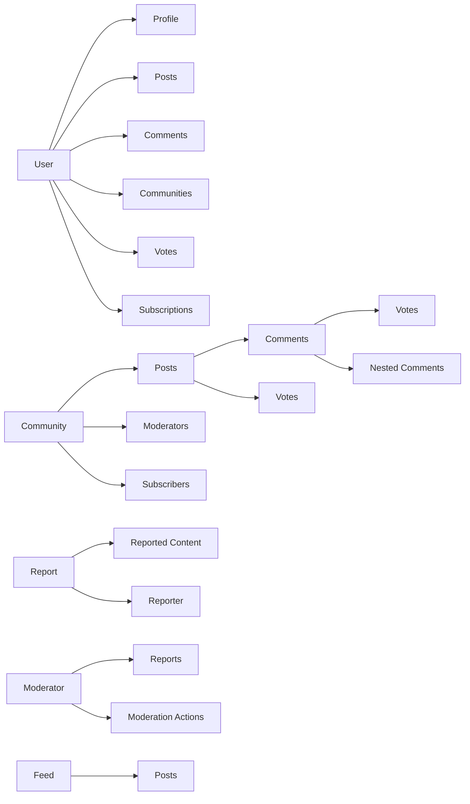

# Reddit-like Community Platform - Functional Requirements Specification

## 1. Introduction and Purpose

### 1.1 Platform Overview

THE Reddit-like Community Platform SHALL provide a space for users to create topic-specific communities, share content in multiple formats, engage in threaded discussions, and build reputation through a karma-based system. Users can participate in communities of interest, contribute content through text posts, link sharing, or image uploads, and interact with other community members through comments and voting mechanisms.

### 1.2 Core Purpose

WHEN users seek a platform to share their interests and connect with like-minded individuals, THE Reddit-like Community Platform SHALL offer a centralized space where users can:

- Create and participate in topic-specific communities
- Share various types of content (text, links, images)
- Engage in threaded discussions through comments with unlimited nesting depth
- Build reputation through community recognition via a comprehensive karma system
- Discover new content through personalized feeds with multiple sorting algorithms
- Report inappropriate content to maintain platform quality
- Participate in community moderation based on role-based permissions

### 1.3 Key Features

THE Reddit-like Community Platform SHALL distinguish itself through:

- A comprehensive karma system that tracks user contributions across all activities (posts, comments)
- Flexible community structure with multiple moderator roles and responsibilities (owner, moderators, subscribers)
- Rich content feeds with multiple sorting options (Hot, New, Top, Controversial) for content discovery
- Robust reporting and moderation systems to maintain platform quality
- Three-tier feed system (Home, Popular, Community) for personalized content consumption
- Support for three distinct post types (text, link, image) with appropriate preview mechanisms
- Nested comment threads with unlimited depth to facilitate detailed discussions

## 2. Core Entities and Relationships

### 2.1 User Entity

THE User entity SHALL represent an individual who has registered on the platform. Each user SHALL have:

- Unique username for identification
- Email address for authentication
- Password for account security
- Profile containing display information
- Karma score reflecting community contributions
- Collection of created posts and comments
- List of community subscriptions
- Moderator roles in various communities
- Account creation timestamp
- Last login timestamp

### 2.2 Profile Entity

THE Profile entity SHALL store a user's public-facing information. Each profile SHALL include:

- Display name visible to other users
- Bio text describing the user
- Avatar image for visual identification
- Total karma score
- List of all posts created by the user
- List of all comments written by the user
- Account creation date

### 2.3 Community Entity

THE Community entity SHALL represent a topic-specific group where users can share content. Each community SHALL have:

- Unique name for identification
- Description text explaining the community purpose
- Icon image for visual representation
- Owner who created the community
- List of moderators
- List of subscribers
- Collection of posts within the community
- Count of current subscribers
- Creation timestamp

### 2.4 Post Entity

THE Post entity SHALL represent content created by a user within a community. Each post SHALL include:

- Title (required for all post types)
- Content that varies by post type:
  - Text post: Body text content
  - Link post: URL to external content
  - Image post: Uploaded image content
- Author who created the post
- Community where the post was published
- Vote score representing community sentiment
- Comment count showing discussion level
- Timestamp of creation
- Type identifier (text/link/image)
- Last edited timestamp (if applicable)

### 2.5 Comment Entity

THE Comment entity SHALL represent a user's response to a post or another comment. Each comment SHALL include:

- Author who created the comment
- Content text of the comment
- Vote score representing community sentiment
- Timestamp of creation
- Reference to the post or parent comment
- List of nested replies (no depth limit)
- Last edited timestamp (if applicable)

### 2.6 Vote Entity

THE Vote entity SHALL record a user's sentiment toward a post or comment. Each vote SHALL include:

- User who cast the vote
- Target entity (post or comment) being voted on
- Direction of the vote (upvote, downvote, or none)
- Timestamp of when the vote was cast

### 2.7 Feed Entity

THE Feed entity SHALL organize posts for user consumption. Each feed SHALL include:

- Type identifier (Home, Popular, Community)
- Collection of posts from relevant sources
- Current sorting mechanism (Hot, New, Top, Controversial)
- Pagination information for content browsing

## 3. User Account Management

### 3.1 User Registration

WHEN a guest visits the platform, THE system SHALL provide a registration form with fields for email address, password, and username.

WHEN a guest submits registration information, THE system SHALL validate all fields according to the following rules:
  - Email address SHALL be in valid email format
  - Password SHALL be at least 8 characters long
  - Username SHALL be unique across the platform
  - Username SHALL contain only alphanumeric characters and underscores
  - Username SHALL not exceed 20 characters in length

IF email validation fails, THEN THE system SHALL display an error message "Please enter a valid email address".

IF password validation fails, THEN THE system SHALL display an error message "Password must be at least 8 characters".

IF username validation fails due to format, THEN THE system SHALL display an error message "Username must contain only letters, numbers, and underscores, and be no more than 20 characters".

IF username validation fails due to uniqueness constraint, THEN THE system SHALL display an error message "This username is already taken. Please choose another".

IF email validation fails due to uniqueness constraint, THEN THE system SHALL display an error message "An account with this email already exists".

WHEN all validations pass, THE system SHALL create a new user account with:
  - Email address as provided
  - Password hashed using industry-standard cryptographic hashing
  - Username as provided
  - Default profile with empty display name, bio, and avatar
  - Initial karma score of 0
  - Account status set to active

WHEN account creation is successful, THE system SHALL send a welcome email to the user's email address.

### 3.2 User Authentication

WHEN a guest or user visits the login page, THE system SHALL display a form with fields for email address and password.

WHEN a user submits login credentials, THE system SHALL validate the email address format.

IF email validation fails, THEN THE system SHALL display an error message "Please enter a valid email address".

WHEN email format is valid, THE system SHALL check if an account exists with the provided email address.

IF no account exists with the provided email, THEN THE system SHALL display an error message "No account found with this email address".

WHEN an account exists with the provided email, THE system SHALL verify the password against the stored hash.

IF password verification fails, THEN THE system SHALL display an error message "Invalid password".

WHEN email and password are verified, THE system SHALL generate a JWT access token containing:
  - User ID
  - Username
  - Account status
  - Current permissions array

WHEN login is successful, THE system SHALL return the JWT access token to the client for session management.

### 3.3 Password Management

WHEN an authenticated user visits the password change page, THE system SHALL display a form with fields for current password, new password, and confirm new password.

WHEN a user submits password change request, THE system SHALL verify the current password against the stored hash.

IF current password verification fails, THEN THE system SHALL display an error message "Current password is incorrect".

WHEN current password is verified, THE system SHALL validate that the new password and confirmation match.

IF new password and confirmation do not match, THEN THE system SHALL display an error message "New passwords do not match".

WHEN passwords match, THE system SHALL validate that the new password meets the minimum requirements (at least 8 characters).

IF new password validation fails, THEN THE system SHALL display an error message "Password must be at least 8 characters".

WHEN all validations pass, THE system SHALL update the stored password hash with the new password.

WHEN password change is successful, THE system SHALL send a notification email to the user and invalidate all current sessions except the current one.

### 3.4 Account Deletion

WHEN an authenticated user visits the account settings page, THE system SHALL provide an option to delete their account.

WHEN a user requests account deletion, THE system SHALL display a confirmation dialog warning about permanent data loss.

WHEN a user confirms account deletion, THE system SHALL verify the user's password for security.

IF password verification fails, THEN THE system SHALL display an error message "Password verification failed".

WHEN password is verified, THE system SHALL begin the account deletion process by:
  1. Removing all posts created by the user
  2. Removing all comments written by the user
  3. Removing all votes cast by the user on posts and comments
  4. Removing all community subscriptions for the user
  5. Removing all moderator roles held by the user
  6. Removing all reports filed by the user
  7. Removing the user's profile information
  8. Removing the user account itself

WHEN account deletion is complete, THE system SHALL log the user out of all sessions and display a confirmation message.

## 4. User Profile Management

### 4.1 Profile Information

THE system SHALL maintain the following profile information for each user:
  - Display name (optional text, max 50 characters)
  - Bio text (optional text, max 500 characters)
  - Avatar image (optional image file)
  - Karma score (integer, can be negative)
  - Account creation timestamp

### 4.2 Profile Editing

WHEN an authenticated user visits their profile edit page, THE system SHALL display a form pre-populated with their current profile information.

WHEN a user submits profile update information, THE system SHALL validate all fields according to the following rules:
  - Display name SHALL not exceed 50 characters
  - Bio text SHALL not exceed 500 characters
  - Avatar SHALL be a valid image file not exceeding 5MB

IF display name validation fails, THEN THE system SHALL display an error message "Display name must not exceed 50 characters".

IF bio text validation fails, THEN THE system SHALL display an error message "Bio must not exceed 500 characters".

IF avatar validation fails, THEN THE system SHALL display an error message "Avatar must be a valid image file under 5MB".

WHEN all validations pass, THE system SHALL update the user's profile information with the provided values.

WHEN profile update is successful, THE system SHALL redirect the user to their updated profile page.

### 4.3 Profile Viewing

WHEN any user visits another user's profile page, THE system SHALL display:
  - The user's display name
  - The user's bio text
  - The user's avatar image
  - The user's total karma score
  - A list of all posts created by the user
  - A list of all comments written by the user

WHEN displaying user posts and comments on a profile page, THE system SHALL paginate results with 10 items per page.

THE system SHALL make profile pages accessible to both authenticated users and guests.

## 5. Community Management

### 5.1 Community Creation

WHEN a user navigates to the community creation page, THE system SHALL display a form requesting a unique community name, description text, and icon image upload.

WHEN a user submits the community creation form with valid information, THE system SHALL create a new community with the provided details and assign the creating user as the community owner.

WHEN a user attempts to create a community with a name that already exists, THE system SHALL display an error message indicating that the name is already taken and prompt the user to choose a different name.

WHEN a user submits a community creation form with missing required information, THE system SHALL display validation errors for each missing field.

### 5.2 Community Discovery

THE system SHALL display a paginated list of all communities on the community discovery page.

THE system SHALL show each community's name, description preview (first 200 characters), icon, and subscriber count in the listing.

THE system SHALL load 20 communities per page by default in the community listing.

THE system SHALL allow users to navigate between pages of communities using standard pagination controls.

THE system SHALL provide a search bar that allows users to search for communities by name.

WHEN a user enters text into the community search bar, THE system SHALL display communities whose names contain the search term in real-time (with a 300ms debounce).

THE system SHALL display search results in the same format as the general community listing.

WHEN a search returns no results, THE system SHALL display a message indicating that no communities were found matching the search criteria.

### 5.3 Community Subscription

WHEN a logged-in user visits a community page, THE system SHALL display a "Subscribe" button if the user is not already subscribed to that community.

WHEN a logged-in user clicks the "Subscribe" button for a community, THE system SHALL add that user to the community's subscriber list and update the button to "Unsubscribe".

WHEN a logged-in user clicks the "Unsubscribe" button for a community, THE system SHALL remove that user from the community's subscriber list and update the button to "Subscribe".

WHEN a non-authenticated user attempts to subscribe to a community, THE system SHALL redirect them to the login page.

THE system SHALL provide a page where users can view all communities they are subscribed to.

THE system SHALL display subscribed communities in a grid or list format showing the same information as the general community listing.

THE system SHALL allow users to unsubscribe from communities directly from their subscription list page.

WHEN a user unsubscribes from a community from their subscription list, THE system SHALL immediately update both the list view and the community page's subscription button.

### 5.4 Community Roles and Permissions

THE system SHALL assign one of three roles to users within each community:
- Community Owner (creator of the community)
- Moderator (appointed by the owner)
- Regular Subscriber (default role for subscribed users)

THE system SHALL maintain a user's community role independently of their platform-wide roles (user, moderator, communityOwner, admin).

WHERE a user has the regular subscriber role in a community, THE system SHALL permit that user to:
- View all posts in the community
- Create new posts in the community (if subscribed)
- Comment on posts within the community
- Vote on posts and comments within the community

WHERE a user has the regular subscriber role in a community, THE system SHALL restrict that user from:
- Modifying community details
- Appointing or removing moderators
- Deleting posts or comments created by other users
- Banning users from the community

WHEN a non-subscriber attempts to create a post in a community, THE system SHALL prevent the post creation and display an error message indicating that subscription is required.

WHEN a non-authenticated user attempts to view a community page, THE system SHALL allow access to view community information and posts.

WHEN a non-authenticated user attempts to create a post or comment in a community, THE system SHALL redirect them to the login page.

## 6. Content Management System

### 6.1 Post Creation

WHEN a user wishes to create a post, THE system SHALL require the user to be authenticated with a valid account.

WHEN a guest attempts to create a post, THE system SHALL redirect them to the login page.

WHEN a user attempts to create a post, THE system SHALL verify that the user is subscribed to the target community.

IF a user is not subscribed to the target community, THEN THE system SHALL display an error message requiring subscription before post creation.

WHEN a user initiates post creation, THE system SHALL present a form with the following fields:
- Community selection (pre-filled if accessed from community page)
- Post title (required, 1-300 characters)
- Post content based on type (text content, URL, or image upload)

WHEN a user submits a post creation form, THE system SHALL validate all required fields are properly filled.

IF any required field is missing or invalid, THEN THE system SHALL display appropriate error messages and preserve user input.

WHEN a user successfully submits a valid post, THE system SHALL create the post with the following attributes:
- Title from user input
- Content based on post type
- Author set to the current user
- Community set to selected community
- Creation timestamp set to current time
- Initial vote score of 0
- Comment count of 0
- Visibility set to public

### 6.2 Post Types

WHERE a user selects text post type, THE system SHALL provide a text input field supporting up to 40,000 characters.

WHERE a user creates a text post, THE system SHALL store the text content as plain text with line break preservation.

WHERE a user selects link post type, THE system SHALL provide a URL input field.

WHEN a user submits a link post, THE system SHALL validate that the URL:
- Is properly formatted according to RFC 3986 standard
- Begins with http:// or https://
- Does not exceed 2,048 characters in length

IF a user submits an invalid URL, THEN THE system SHALL display an appropriate error message indicating the issue.

WHERE a user selects image post type, THE system SHALL provide an image upload interface.

WHEN a user uploads an image, THE system SHALL accept files in the following formats: JPEG, PNG, GIF, WEBP.

WHEN a user uploads an image, THE system SHALL validate that the file:
- Does not exceed 10MB in size
- Contains valid image data

IF a user uploads an invalid image file, THEN THE system SHALL display an appropriate error message indicating the issue.

WHERE an image is successfully uploaded, THE system SHALL generate:
- A thumbnail version (maximum 400x300 pixels) for post listings
- A medium-sized version (maximum 1200x900 pixels) for post detail view
- Preserve the original image for high-quality viewing

### 6.3 Post Display

WHEN a user views a single post, THE system SHALL display:
- Post title in full
- Author username with link to profile
- Community name with link to community
- Creation timestamp (formatted as relative time, e.g., "3 hours ago")
- Current vote score
- Comment count
- Content appropriate to post type:
  - Full text for text posts
  - Clickable link for link posts
  - Displayable image for image posts

WHEN a user views any feed containing posts, THE system SHALL display each post with:
- Title in full
- Author username
- Community name
- Vote score
- Comment count
- Time since posted (e.g., "3 hours ago")
- Content preview appropriate to post type:
  - First 200 characters of text for text posts
  - Domain name of URL for link posts (e.g., "youtube.com")
  - Thumbnail of image for image posts

### 6.4 Post Editing and Deletion

WHERE a user is the author of a post, THE system SHALL allow the user to edit their post.

WHEN a user accesses the edit interface for their post, THE system SHALL:
- Pre-populate all editable fields with current post data
- Preserve the post creation timestamp
- Allow modification of:
  - Post title
  - Post content (based on original post type)

WHEN a user submits an edited post, THE system SHALL validate the changes follow the same rules as new post creation.

WHEN a user successfully edits a post, THE system SHALL update the post's last edited timestamp.

IF a user attempts to edit a post they did not author, THEN THE system SHALL deny access and display an appropriate error message.

WHERE a user is the author of a post, THE system SHALL allow the user to delete their post.

WHEN a user initiates post deletion, THE system SHALL prompt for confirmation before proceeding.

WHEN a user confirms post deletion, THE system SHALL:
- Mark the post as deleted (soft delete)
- Remove the post from public feeds
- Display a "[deleted]" placeholder in comment threads referencing the post

### 6.5 Comment Creation

WHEN a user is authenticated and viewing a post, THE system SHALL allow them to create a new comment with text content.

WHEN a user submits a comment with empty text content, THE system SHALL reject the submission and display an error message indicating that comment text is required.

WHEN a user attempts to create a comment on a post while not authenticated, THE system SHALL deny access and prompt the user to log in.

WHEN a user successfully creates a comment, THE system SHALL immediately display the comment in the appropriate position within the post's comment thread with the author's username, timestamp, and initial vote score of 0.

### 6.6 Comment Structure and Nesting

THE system SHALL support nested comments with unlimited depth, allowing users to reply to any existing comment.

THE system SHALL organize comments in a hierarchical tree structure where each comment can have multiple child comments.

WHEN a user replies to a comment, THE system SHALL create a new comment as a child of the comment being replied to.

WHEN displaying nested comments, THE system SHALL visually distinguish different nesting levels to improve readability.

THE system SHALL maintain the relationship between parent and child comments even when comments are deleted, marking deleted parent comments as "[deleted]" while preserving their child comments.

WHEN a parent comment is deleted, THE system SHALL continue to display its child comments with appropriate indentation to maintain conversation context.

### 6.7 Comment Display

WHEN displaying a comment, THE system SHALL show the following information:

- Author's username
- Comment content text
- Timestamp indicating when the comment was posted
- Current vote score (total upvotes minus downvotes)
- Reply functionality
- Edit and delete options (for the comment author)
- Visual indication of nesting level within the comment thread

WHEN a user views a post detail page, THE system SHALL load comments in batches of 20 to optimize performance with pagination controls for additional comments.

WHEN displaying comments with deeply nested structures, THE system SHALL provide "collapse/expand" functionality to improve readability.

### 6.8 Comment Editing and Deletion

WHEN the author of a comment accesses their comment, THE system SHALL provide options to edit or delete the comment.

WHEN a user edits their comment, THE system SHALL preserve the original posting timestamp but indicate that the comment has been edited.

WHEN a user attempts to edit a comment they did not author, THE system SHALL deny access and display an appropriate error message.

WHEN a user deletes their comment, THE system SHALL mark the comment as deleted but preserve it to maintain conversation context, displaying "[deleted]" as the content.

WHEN a user deletes a comment that has replies, THE system SHALL preserve the deleted comment as a placeholder to maintain thread structure.

WHEN a user attempts to delete a comment they did not author, THE system SHALL deny access and display an appropriate error message.

## 7. Voting System

### 7.1 Post Voting

THE system SHALL support three vote types for posts:
- Upvote (adds 1 to score)
- Downvote (subtracts 1 from score)
- No vote (neutral, 0 impact on score)

WHEN a user votes on a post, THE system SHALL ensure that each user can only have one active vote per post.

WHEN a user votes on a post they authored, THE system SHALL prevent the vote and display an appropriate message.

WHEN a user clicks an upvote button on a post, THE system SHALL:
- Record the upvote if no previous vote exists
- Change a previous downvote to an upvote
- Remove a previous upvote (return to no vote)

WHEN a user clicks a downvote button on a post, THE system SHALL:
- Record the downvote if no previous vote exists
- Change a previous upvote to a downvote
- Remove a previous downvote (return to no vote)

WHEN a user upvotes a post, THE system SHALL increase the post's vote score by 1.

WHEN a user downvotes a post, THE system SHALL decrease the post's vote score by 1.

WHEN a user removes their vote from a post, THE system SHALL adjust the post's vote score accordingly (subtract 1 for removed upvote, add 1 for removed downvote).

### 7.2 Comment Voting

WHEN an authenticated user views a comment, THE system SHALL display upvote and downvote options.

WHEN a user upvotes a comment, THE system SHALL increase the comment's vote score by 1 and increase the comment author's karma score by 1.

WHEN a user downvotes a comment, THE system SHALL decrease the comment's vote score by 1 and decrease the comment author's karma score by 1.

WHEN a user changes their vote from upvote to downvote, THE system SHALL decrease the comment's vote score by 2 and adjust the comment author's karma score accordingly (decrease by 2).

WHEN a user removes their vote entirely, THE system SHALL adjust the comment's vote score and the author's karma score to reflect the removal of the original vote.

WHEN a user attempts to vote on their own comment, THE system SHALL prevent self-voting and display a message indicating that users cannot vote on their own content.

WHEN a user attempts to vote on a comment while not authenticated, THE system SHALL prompt them to log in before allowing the vote.

WHEN a user votes on a comment, THE system SHALL update the vote score immediately without requiring a page refresh.

### 7.3 Vote Impact on Karma

WHEN a user's post receives an upvote, THE system SHALL increase the post author's karma score by 1.

WHEN a user's post receives a downvote, THE system SHALL decrease the post author's karma score by 1.

WHEN a user's post has a vote removed, THE system SHALL adjust the post author's karma score accordingly.

WHEN a user's comment receives an upvote, THE system SHALL increase the comment author's karma score by 1.

WHEN a user's comment receives a downvote, THE system SHALL decrease the comment author's karma score by 1.

WHEN a user's comment has a vote removed, THE system SHALL adjust the comment author's karma score accordingly.

WHEN a user deletes their account, THE system SHALL remove all karma contributions made by that user's votes on other users' content.

## 8. Feed Systems

### 8.1 Feed Types

THE system SHALL provide three distinct post feeds:

#### Home Feed

WHERE a user is authenticated, THE system SHALL provide a home feed containing posts from communities the user is subscribed to.

WHERE a user is not authenticated, THE system SHALL not provide a home feed and redirect to the popular feed.

#### Popular Feed

THE system SHALL provide a popular feed accessible to all users (authenticated and unauthenticated) containing posts from all communities.

#### Community Feed

THE system SHALL provide a community-specific feed for each community containing only posts from that community.

### 8.2 Feed Sorting Options

THE system SHALL support four sorting algorithms for all feeds:

#### Hot Sorting

WHEN posts are sorted by hot, THE system SHALL rank posts using an algorithm that prioritizes recent posts with high vote activity.

#### New Sorting

WHEN posts are sorted by new, THE system SHALL display posts in chronological order with newest posts first.

#### Top Sorting

WHEN posts are sorted by top, THE system SHALL rank posts by vote score with the following time filters:
- Today (posts from last 24 hours)
- This week (posts from last 7 days)
- This month (posts from last 30 days)
- This year (posts from last 365 days)
- All time (all posts)

#### Controversial Sorting

WHEN posts are sorted by controversial, THE system SHALL rank posts that have high total vote counts but scores close to zero.

### 8.3 Feed Display Requirements

WHEN displaying posts in any feed, THE system SHALL maintain consistent presentation of:
- Post information (title, author, community, timestamp)
- Vote score and comment count
- Content preview appropriate to post type
- Visual indication of user's vote status (if authenticated)

WHEN displaying a text post in a feed, THE system SHALL show the first 200 characters of the post content.

WHEN displaying an image post in a feed, THE system SHALL show a thumbnail preview of the image.

WHEN displaying a link post in a feed, THE system SHALL show the domain name of the URL (e.g., "youtube.com").

### 8.4 Pagination

THE system SHALL paginate all feeds with 25 posts per page.

THE system SHALL provide navigation controls for moving between pages.

THE system SHALL display the current page number and total page count.

## 9. Comment Sorting

THE system SHALL provide sorting options for comments on a post, including:

- Best: Comments sorted by highest vote score first
- New: Comments sorted by most recently posted first
- Controversial: Comments with many votes but score close to zero, sorted first

WHEN a user accesses a post, THE system SHALL default to displaying comments sorted by "Best" unless the user has selected a different sorting preference.

WHEN a user changes the comment sorting method, THE system SHALL reorganize all displayed comments according to the selected sorting algorithm without requiring a full page reload.

## 10. Moderation System

### 10.1 Moderator Roles and Hierarchy

THE Reddit-like Community Platform SHALL implement a four-tier user role system with distinct permissions and responsibilities to maintain community standards and platform integrity.

THE system SHALL define these user roles with their associated permissions:

1. **Standard User (`user`)**: Regular platform participant who can create posts, comment, vote, and subscribe to communities
2. **Moderator (`moderator`)**: Community-specific authority with content management privileges within designated communities
3. **Community Owner (`communityOwner`)**: Creator of a specific community with full administrative privileges over that community
4. **System Administrator (`admin`)**: Platform-wide authority with unrestricted access to all system functions

### 10.2 Content Moderation Tools

THE system SHALL provide Moderators with comprehensive tools to manage posts and comments within their assigned communities.

WHEN a Moderator views a post within their community, THE system SHALL display moderation options including:

- Delete post immediately
- Remove votes from post
- Transfer post to another community
- Lock post to prevent further comments
- Sticky post to community top

WHEN a Moderator deletes a post, THE system SHALL:

- Remove the post from all feeds (Home, Popular, Community)
- Notify the author with reason for deletion
- Remove associated karma adjustments
- Update community statistics

WHEN a Moderator views a comment within their community, THE system SHALL display moderation options including:

- Delete comment immediately
- Remove votes from comment
- Lock comment thread
- Collapse comment thread

WHEN a Moderator deletes a comment, THE system SHALL:

- Remove the comment from all displays
- Notify the author with reason for deletion
- Remove associated karma adjustments
- Update parent post comment count

### 10.3 User Management

WHEN a Moderator bans a user from their community, THE system SHALL:

- Prevent the banned user from creating new posts in that community
- Prevent the banned user from creating new comments in that community
- Prevent the banned user from voting on content in that community
- Allow the banned user to continue viewing content in that community
- Maintain the banned user's existing posts and comments (visible but with restrictions)
- Notify the banned user of their ban status
- Add the ban to the community's banned users list

WHEN a Moderator unbans a user, THE system SHALL:

- Restore the user's posting privileges in that community
- Restore the user's commenting privileges in that community
- Restore the user's voting privileges in that community
- Remove the user from the community's banned users list
- Notify the user of their restored privileges

THE system SHALL provide Moderators with access to view:

- Complete list of all users banned from their community
- Date each user was banned
- Moderator who imposed the ban
- Reason for ban (if provided)
- Option to unban any banned user

### 10.4 Community Moderation Actions

WHEN a user reports content within a community, THE system SHALL:

- Assign the report to that community's Moderators
- Display the report in the Moderation dashboard
- Provide full context of reported content
- Include reporter identity and provided reason
- Track report status (pending, resolved, dismissed)

WHEN a Moderator views a report, THE system SHALL display:

- Full content of reported post/comment
- Identity of user who reported the content
- Text explanation of report reason
- Date/time of report
- Current report status
- Option to approve (delete content) or dismiss (keep content)

WHEN a Moderator approves a report, THE system SHALL:

- Delete the reported content following post/comment deletion procedures
- Mark the report as "resolved"
- Notify the reporter that their report was addressed
- Remove the report from the active reports list

WHEN a Moderator dismisses a report, THE system SHALL:

- Keep the reported content visible
- Mark the report as "dismissed"
- Notify the reporter that their report was reviewed but not acted upon
- Remove the report from the active reports list
- Maintain the report in historical records

## 11. Reporting System

### 11.1 Report Creation

WHEN a user encounters inappropriate content, THE system SHALL provide options to report both posts and comments.

WHEN a user initiates a report, THE system SHALL present a form requiring a reason for the report.

THE system SHALL limit report reasons to a predefined set including spam, harassment, hate speech, misinformation, and other.

WHEN a user submits a report without providing a reason, THE system SHALL display an error message and prevent submission.

THE system SHALL validate that report reasons are between 10 and 500 characters in length.

WHEN a user submits a valid report, THE system SHALL record the report with the following information:
- The reported content (post or comment identifier)
- The reporting user identifier
- The reason provided by the user
- Timestamp of report creation
- Current status (pending)

THE system SHALL prevent duplicate reports from the same user for the same content.

IF a user attempts to submit a duplicate report, THEN THE system SHALL display a message indicating the content is already reported and not create a new report.

### 11.2 Report Management

WHEN a moderator accesses the report management interface, THE system SHALL display all pending reports for their communities.

THE system SHALL organize reports by creation timestamp with newest reports appearing first.

THE system SHALL display the following information for each report:
- Reported content preview (title for posts, first 100 characters for comments)
- Community name (for post reports)
- Report reason
- Timestamp of report creation
- Reporter information (or "Anonymous" if anonymous reporting was used)

### 11.3 Report Resolution

WHEN a moderator approves a report, THE system SHALL remove the reported content (post or comment) from public view.

IF the reported content is a post, THE system SHALL delete the post and all associated comments.

IF the reported content is a comment, THE system SHALL delete the comment and all nested replies.

WHEN content is removed due to an approved report, THE system SHALL notify the content creator of the removal with the provided report reason.

WHEN a post or comment is removed due to an approved report, THE system SHALL reverse all karma changes associated with that content.

### 11.4 Report Dismissal

WHEN a moderator dismisses a report, THE system SHALL update the report status to "dismissed" and remove it from the pending reports list.

THE system SHALL retain dismissed reports in the database for audit purposes for at least 30 days.

IF a report is dismissed, THE system SHALL not remove the reported content from public view.

## 12. Security and Privacy

### 12.1 Authentication Security

WHEN a user attempts to register with email and password, THE system SHALL validate that the email address is properly formatted and unique within the system.

WHEN a user submits registration information, THE system SHALL hash the password using industry-standard bcrypt algorithm with a minimum of 12 rounds before storing it in the database.

WHEN a user registers, THE system SHALL generate a verification token and send it to the user's email address to confirm ownership.

WHEN a user attempts to log in with email and password, THE system SHALL apply rate limiting to prevent brute force attacks, allowing a maximum of 5 failed attempts per account within a 15-minute window.

WHEN a user successfully logs in, THE system SHALL generate a JWT access token with 30-minute expiration and a refresh token with 30-day expiration.

WHEN a user's account has 5 consecutive failed login attempts, THE system SHALL temporarily lock the account for 30 minutes and notify the user via email.

### 12.2 Data Protection

THE system SHALL encrypt all personally identifiable information (PII) including email addresses, display names, and biographical information at rest using AES-256 encryption.

THE system SHALL store only bcrypt-hashed passwords, never plain text passwords, in the database.

THE system SHALL transmit all sensitive data including authentication credentials over HTTPS with TLS 1.3 encryption.

### 12.3 Privacy Controls

THE system SHALL restrict access to user profile information such that only the user themselves and system administrators can view private profile data.

WHEN a user views another user's profile, THE system SHALL only display public information including username, display name, bio, avatar, and karma score.

WHEN a user deletes a post or comment, THE system SHALL remove it from public view within 1 minute and permanently delete it from storage within 24 hours.

### 12.4 Access Controls

THE system SHALL implement role-based access control with four distinct roles: user, moderator, communityOwner, and admin.

WHEN a user attempts to access a protected resource, THE system SHALL validate their JWT token and check their role permissions before granting access.

THE system SHALL deny access to administrative functions for all users except those with the admin role.

THE system SHALL restrict post creation to users who are subscribed to the community where they wish to post.

WHEN a banned user attempts to create content in a community, THE system SHALL deny the request and return an appropriate error message.

## 13. Performance Requirements

WHEN a user requests a page of communities, THE system SHALL return results within 500 milliseconds for 95% of requests.

WHEN a user performs a search, THE system SHALL return results within 1 second for 95% of requests.

WHEN a user requests a feed page, THE system SHALL load the page within 2 seconds under normal conditions.

WHEN a user votes on content, THE system SHALL update scores within 1 second.

WHEN a user creates or edits content, THE system SHALL process requests within 2 seconds.

THE platform SHALL support at least 10,000 concurrent users.

THE system SHALL cache frequently accessed community listings for improved performance.

THE search functionality SHALL support concurrent searches from at least 1000 users simultaneously.