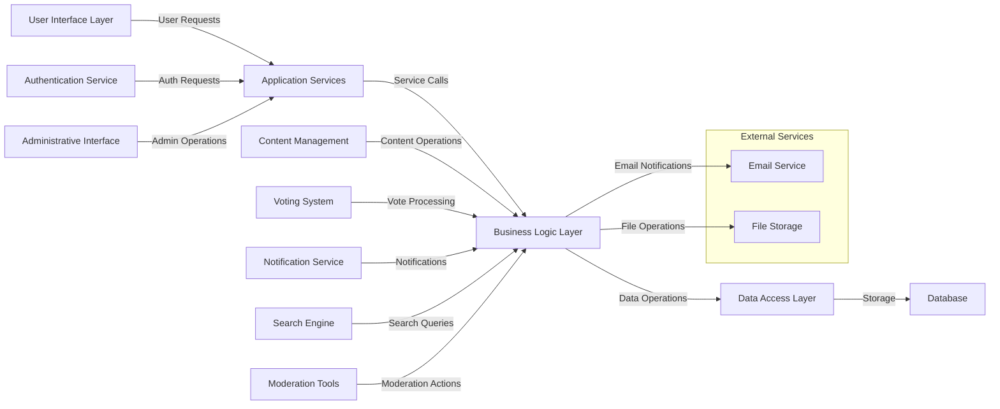

# Community Forum Platform - Project Documentation

## Project Overview

The Community Forum Platform is a Reddit-like community discussion system that enables users to create and participate in topic-based communities. The platform allows for content creation, social interaction through voting and commenting, user reputation building through karma systems, and content moderation capabilities.

This comprehensive platform supports the core social features that make online communities thrive: user-generated content, peer feedback mechanisms, community organization, and reputation systems. The system is designed to scale from small niche communities to large platforms with millions of users.

## Document List

The following documentation contains all the requirements and specifications needed to build the Community Forum Platform:

1. [Service Overview Document](./01-service-overview.md) - Defines the core service overview and business model for the Reddit-like community platform

2. [User Actors Document](./02-user-actors.md) - Documents the user actors and their roles in the system with detailed permission matrices

3. [Functional Requirements Document](./03-functional-requirements.md) - Details the core functional requirements for the community platform

4. [User Journeys Document](./04-user-journeys.md) - Describes the primary user journeys and workflows in the platform

5. [Business Rules Document](./05-business-rules.md) - Details the business rules and validation requirements for the platform

6. [Non-Functional Requirements Document](./06-non-functional-requirements.md) - Defines the non-functional requirements including performance, security, and compliance

7. [Error Handling Document](./07-error-handling.md) - Maps out all error scenarios and how the system should handle them

8. [Moderation Workflows Document](./08-moderation-workflows.md) - Details the content moderation and reporting workflows

9. [Karma System Document](./09-karma-system.md) - Details the karma and reputation system mechanics

10. [Search and Discovery Document](./10-search-discovery.md) - Defines the search and discovery features of the platform

11. [Future Features Document](./11-future-features.md) - Documents future enhancements and expansion plans for the platform

## Actor Definitions

The Community Forum Platform defines three primary user actors with distinct capabilities and permissions:

### User
Authenticated users who can register, login, create posts, comment, vote, and participate in communities. This is the primary actor for most platform interactions.

### Moderator
Users with elevated permissions to manage communities, moderate content, and handle reports. Moderators have additional capabilities within specific communities they are assigned to.

### Administrator
System administrators with full access to manage all aspects of the platform, including user accounts, communities, and system settings. Administrators have the highest level of access across the entire platform.

## System Architecture Overview

The Community Forum Platform follows a layered architecture approach with clear separation of concerns:

1. **User Interface Layer**: Handles all user interactions, whether web-based or through APIs
2. **Application Services**: Coordinates user requests and manages application flow
3. **Business Logic Layer**: Implements all core platform functionality including community management, content handling, voting systems, and user reputation
4. **Data Access Layer**: Manages data persistence and retrieval operations
5. **Database**: Stores all persistent data including users, communities, content, and metadata
6. **External Services**: Integrates with third-party services for email delivery and file storage

This architecture supports scalability, maintainability, and clear separation between business requirements (defined in these documents) and technical implementation (at the discretion of development teams).

---

> *Developer Note: This document defines **business requirements only**. All technical implementations (architecture, APIs, database design, etc.) are at the discretion of the development team.*