# Prisma Markdown

> Generated by [`prisma-markdown`](https://github.com/samchon/prisma-markdown)

- [Actors](#actors)
- [Systematic](#systematic)
- [Products](#products)
- [Inventory](#inventory)
- [Sales](#sales)
- [Orders](#orders)
- [Shipping](#shipping)
- [Disputes](#disputes)
- [Reviews](#reviews)
- [Seller](#seller)
- [Admin](#admin)
- [Snapshots](#snapshots)

## Actors

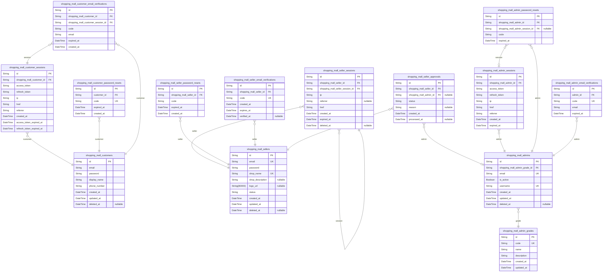

### `shopping_mall_customers`

Registered customer accounts with email/password authentication
credentials and profile information.

This table stores core customer account information including
authentication credentials
and basic profile data. Customers are the primary users of the platform
who browse
products, manage wishlists, add items to cart, place orders, and manage
their accounts.

Each customer must have a unique email address for authentication purposes.
Password hashes are stored securely using industry-standard hashing
algorithms.
The profile information includes display name and phone number which can
be edited
by the customer. Additional addresses are managed in a separate addresses
table.

This entity forms the foundation of the customer authentication system
and links to
various other entities including shopping carts, wishlists, orders, and
reviews.

Properties as follows:

- `id`: Primary Key.
- `email`
  > Customer's email address used for authentication. Must be unique across
  > all customers.
- `password`: Hashed password for customer authentication.
- `display_name`: Customer's display name for public interactions.
- `phone_number`: Customer's phone number for communication and delivery purposes.
- `created_at`: Timestamp when the customer account was created.
- `updated_at`: Timestamp when the customer account was last updated.
- `deleted_at`: Timestamp when the customer account was deleted (soft delete).

### `shopping_mall_customer_sessions`

Customer session records storing JWT authentication tokens with refresh
capabilities for maintaining secure customer login sessions. Manages
access and refresh tokens for customers with expiration tracking and
secure session termination.

This table implements secure session management for customer
authentication, storing both access and refresh tokens with appropriate
expiration timestamps. Sessions are linked to specific customer accounts
and track connection metadata for security auditing purposes.

Properties as follows:

- `id`: Primary Key.
- `shopping_mall_customer_id`
  > Reference to the authenticated customer's unique identifier for session
  > ownership tracking. Links to the customers table to establish session
  > ownership and enable customer-specific session management. {@link
  > shopping_mall_customers.id}
- `access_token`
  > JSON Web Token used for authentication during API requests, containing
  > customer identity and permissions for access control.
- `refresh_token`
  > JSON Web Token used to obtain new access tokens when current ones expire,
  > enabling persistent authentication without re-login.
- `ip`
  > Client IP address for security monitoring and potential fraud detection,
  > capturing the network location of authentication requests.
- `href`
  > Client connection URL for session tracking and security auditing,
  > recording the origin point of authentication requests.
- `referrer`
  > Referrer URL for session tracking and security auditing, providing
  > additional context about the authentication request source.
- `created_at`
  > Timestamp when the session was created, used for session lifetime
  > tracking and audit purposes.
- `access_token_expired_at`
  > Timestamp when the access token expires and requires refreshing or
  > re-authentication for continued access.
- `refresh_token_expired_at`
  > Timestamp when the refresh token expires, after which the customer must
  > re-authenticate to obtain new tokens.

### `shopping_mall_customer_password_resets`

Password reset tokens with expiration for secure customer password
recovery workflow.

This table manages the password reset process for customers by storing
cryptographically secure tokens that are emailed to users when they
request password recovery. Each token has an expiration time to ensure
security and prevent unauthorized access.

The workflow works as follows:
1. Customer requests password reset via email
2. System generates unique token and stores with expiration
3. Customer receives email with reset link containing token
4. Customer clicks link and enters new password
5. System validates token and updates password if valid
6. Token is invalidated after use or expiration

Properties as follows:

- `id`: Primary Key.
- `customer_id`
  > The customer who requested the password reset. {@link
  > shopping_mall_customers.id}
- `code`
  > Cryptographically secure random token used to authenticate the password
  > reset request.
  >
  > This token is generated using a cryptographically secure random number
  > generator
  > and is sufficiently long to prevent brute force attacks. The token is
  > emailed
  > to the customer as part of a password reset link.
- `expired_at`
  > The expiration timestamp for this password reset token.
  >
  > Tokens are only valid until this timestamp. After this time, the token
  > becomes invalid and cannot be used to reset the password. This helps
  > prevent replay attacks and ensures tokens are used in a timely manner.
  >
  > Default: 1 hour from creation
- `created_at`
  > Timestamp when this password reset record was created.
  >
  > Used for auditing and tracking when password reset requests were made.

### `shopping_mall_customer_email_verifications`

Email verification tokens for customer registration confirmation.

This table stores email verification tokens that are generated when a new
customer registers on the platform. The tokens are used to confirm the
customer's email address before their account becomes fully active. Each
token has an expiration time for security purposes.

The table maintains references to both the customer and their session at
the time of token generation, allowing for proper tracking and validation
during the verification process. This ensures that only legitimate
registration attempts can be verified.

Properties as follows:

- `id`: Primary Key.
- `shopping_mall_customer_id`
  > Reference to the customer who initiated the email verification request.
  > [shopping_mall_customers.id](#shopping_mall_customers)
- `shopping_mall_customer_session_id`
  > Reference to the session active when the verification token was
  > generated. [shopping_mall_customer_sessions.id](#shopping_mall_customer_sessions)
- `code`
  > The unique verification token that will be sent to the customer's email
  > address. This token is used to verify the email ownership.
- `email`
  > The email address that needs to be verified. This is stored to ensure the
  > token is being used for the correct email.
- `expired_at`
  > Timestamp when the verification token expires. After this time, the token
  > becomes invalid and cannot be used for verification.
- `created_at`: Timestamp when the email verification record was created in the system.

### `shopping_mall_sellers`

Seller accounts with authentication credentials, shop profile
information, and approval status tracking.

This table stores the core seller account information including
authentication credentials
and basic profile data. Sellers must be approved by administrators before
they can
list products. Each seller has a status that tracks their approval journey.

Sellers can update their profile information at any time. When a seller
modifies
their profile, a snapshot of the previous state is automatically created
for audit
purposes. This preserves a complete history of profile modifications even
after
deletion.

Sellers are the fundamental actors responsible for product creation and
fulfillment.
They are the commercial entities within the marketplace that list
products and
process orders. All products created in the system must be associated
with a seller
account.

The seller lifecycle involves registration, approval, active selling
periods,
and potentially account suspension or deletion. Throughout this
lifecycle, all
modifications to critical data are preserved through the snapshot system.

Properties as follows:

- `id`: Primary Key.
- `email`
  > Seller's email address used for authentication and communication. Must be
  > unique across all sellers.
- `password`
  > Hashed password for seller account authentication using bcrypt with salt.
  > Never store plain text passwords.
- `shop_name`
  > Display name for the seller's shop that customers see when browsing
  > products. Used in product listings and search results.
- `shop_description`
  > Detailed description of the seller's shop and business. Provides
  > customers with information about the seller and their products.
- `logo_url`
  > URL to the seller's shop logo image. Should be a publicly accessible
  > image URL. When null, a default placeholder is displayed.
- `status`
  > Current approval status of the seller account that determines their
  > ability to list products.
  >
  > Status progression:
  > - NEW: Account registered, awaiting initial approval
  > - APPROVED: Account approved, can list products
  > - REJECTED: Account rejected, cannot list products
  > - SUSPENDED: Account suspended by administrator, cannot list products
  >
  > This field determines all business operations available to the seller
  > including
  > product management, order fulfillment, and dashboard access.
- `created_at`
  > Timestamp when the seller account was originally created. Used for
  > account age calculations and reporting.
- `updated_at`
  > Timestamp when the seller account was last modified. Updated whenever
  > profile information changes.
- `deleted_at`
  > Timestamp when the seller account was soft deleted, if applicable. Allows
  > for account recovery within retention period.

### `shopping_mall_seller_sessions`

Seller sessions for authentication and tracking.

This table manages JWT session tokens for sellers, supporting both access
and refresh tokens for secure authentication. Each session is linked to a
specific seller and their login session, enabling comprehensive tracking
of seller activities. The table includes IP address, referrer, and href
tracking for security monitoring, and implements proper expiration
handling through the expired_at field.

Security considerations:
- Sessions are cleaned up automatically after 24 hours from expiration
through the deleted_at field
- Sessions cannot be extended beyond their original expiration time
- Expired sessions are automatically rejected by the authorization system
- All timestamps are stored in UTC to ensure consistent time-based
operations across different time zones

Properties as follows:

- `id`: Primary Key.
- `shopping_mall_seller_id`: The seller who owns this session. [shopping_mall_sellers.id](#shopping_mall_sellers)
- `shopping_mall_seller_session_id`
  > The login session through which this session was created. {@link
  > shopping_mall_seller_sessions.id}
- `ip`: IP address of the client that created this session
- `referrer`: URL that referred the client to create this session
- `href`: The full URL where the session was created
- `created_at`: When this session was created
- `expired_at`: When this session expires and becomes invalid
- `deleted_at`
  > When this session was deleted (automatically cleaned up 24 hours after
  > expiration)

### `shopping_mall_seller_password_resets`

Password reset tokens with expiration for secure seller password recovery
workflow.

This table stores password reset requests for sellers who have forgotten
their passwords.
When a seller initiates a password reset, a unique token is generated and
stored here
along with an expiration timestamp. The token is sent to the seller's
email address
and must be presented when setting a new password. Tokens become invalid
after
expiration or when successfully used.

Properties as follows:

- `id`: Primary Key.
- `shopping_mall_seller_id`
  > The seller who owns this password reset token. This token was generated
  > as part of a password recovery process to verify the seller's identity
  > before allowing them to set a new password. {@link
  > shopping_mall_sellers.id}
- `code`
  > The secret token value used to verify the password reset request. This
  > should be a cryptographically secure random string that is not guessable
  > and should be treated as sensitive information. The token is used to
  > confirm the identity of the seller when they attempt to reset their
  > password.
- `expired_at`
  > The timestamp when this password reset token expires and becomes invalid.
  > This ensures that password reset tokens cannot be used indefinitely and
  > provides a security mechanism against token hijacking or replay attacks.
- `created_at`
  > When the password reset record was initially created. This timestamp
  > helps with auditing and tracking when reset requests were made.

### `shopping_mall_seller_email_verifications`

Email verification tokens for seller registration confirmation.

This table tracks email verification requests for new seller accounts,
storing unique tokens that must be used within a specific time window to
confirm the email address and complete registration. Each record
represents a single verification attempt and includes temporal fields for
tracking creation and expiration times. The verification process is a
security measure to ensure that seller registration emails are valid and
owned by the registrant.

Properties as follows:

- `id`: Primary Key.
- `shopping_mall_seller_id`
  > Reference to the seller account that requires email verification. {@link
  > shopping_mall_sellers.id}
- `code`
  > Unique verification token that must be presented to confirm the seller's
  > email address. This is a cryptographically secure random string that is
  > emailed to the seller.
- `created_at`
  > Timestamp when this verification token was created. This is used to
  > calculate expiration and for audit trail purposes.
- `expires_at`
  > Timestamp when this verification token will expire. If the seller does
  > not verify their email by this time, they must request a new
  > verification.
- `verified_at`
  > Timestamp when the email was successfully verified using this token. NULL
  > indicates the verification is still pending or expired.

### `shopping_mall_seller_approvals`

Seller approval requests for administrative review.

This table tracks the approval workflow for new seller registrations.
Each record
represents a seller's application to become an approved vendor on the
platform.
Administrators review these requests and either approve or reject them
based on
platform policies and verification criteria.

The approval process is critical for maintaining platform quality and trust.
Rejected sellers can view the rejection reason and submit new registration
requests if they address the concerns. Approved sellers gain full selling
privileges and can begin listing products.

This table serves as the central hub for seller onboarding management and
maintains the entire lifecycle of seller approval requests from submission
to final resolution.

Properties as follows:

- `id`: Primary Key.
- `shopping_mall_seller_id`
  > The seller who submitted this approval request. {@link
  > shopping_mall_sellers.id}
- `shopping_mall_admin_id`
  > The administrator who made the final decision on this request, if
  > approved or rejected. [shopping_mall_admins.id](#shopping_mall_admins)
- `status`
  > Current status of the approval request.
  >
  > Valid values indicate the current stage in the approval workflow:
  > - 'pending': Awaiting administrative review
  > - 'approved': Registration approved, seller can sell
  > - 'rejected': Registration rejected, seller cannot sell
- `reason`
  > Detailed reason provided by the administrator for the approval decision.
  >
  > For rejected requests, this field contains the specific reason why the
  > seller's
  > registration was denied. This information helps sellers understand what
  > they
  > need to address before submitting a new request.
  >
  > For approved requests, this may contain internal notes about the approval.
- `created_at`
  > Timestamp when this approval request was initially submitted by the
  > seller.
- `processed_at`
  > Timestamp when the approval decision was made by an administrator.
  >
  > This field is null while the request is pending and populated when the
  > administrator approves or rejects the request.

### `shopping_mall_admins`

Administrator accounts with full authentication credentials and
permission level tracking. This table serves as the primary identity
record for platform administrators, storing their authentication
credentials (email/password) and linking to their assigned permission
grade level. Each administrator must have a unique email address for
system access and is associated with one of two grades: regular or super
administrator. The table implements standard security practices including
password hashing (not stored in plain text) and account status tracking.
Administrators have access to all platform management functions based on
their assigned grade, including seller approvals, category management,
product oversight, and user account control. This entity forms the
foundation for the platform's administrative security model and requires
strong authentication with properly managed password storage in the
associated credentials table.

Properties as follows:

- `id`: Primary Key.
- `shopping_mall_admin_grade_id`
  > Assigned administrative permission grade, determining access scope and
  > authorization level. References the available administrative roles
  > configured in the system's grading system. {@link
  > shopping_mall_admin_grades.id}
- `email`
  > Email address used for administrator authentication and system
  > communications. Must be unique across all administrative accounts. Serves
  > as the login identifier for this account as email addresses are more
  > memorable than numeric IDs. Used for password reset flows and important
  > security notifications. Email format is validated during registration and
  > must conform to standard email syntax.
- `is_active`
  > Account status indicator determining whether this administrative account
  > is currently allowed to authenticate. When set to false, prevents login
  > attempts and blocks access to the administrative interface regardless of
  > valid credentials. Can be toggled by other super administrators for
  > temporary access suspension or permanent disablement during account
  > deletion workflows.
- `username`
  > Username or display name used to identify this administrator in system
  > logs and audit trails. Provides human-readable identification in
  > administrative dashboards and action histories without exposing personal
  > information. Must be unique across all administrators to prevent
  > confusion in system records and allow easy identification in user
  > interface elements.
- `created_at`
  > Timestamp when this administrative account was initially created in the
  > system. Captures the exact moment the administrator registration process
  > was completed, establishing the account's creation date for auditing and
  > historical tracking purposes. Used for sorting account listings and
  > calculating account age for privilege escalation workflows.
- `updated_at`
  > Timestamp when this administrative account record was last modified.
  > Updated whenever account information such as profile details, access
  > levels, or status changes occur. Used for determining data freshness,
  > managing concurrent edits, and tracking when account settings were last
  > reviewed or modified by system administrators.
- `deleted_at`
  > Timestamp when this administrative account was soft deleted from the
  > system. Allows for account recovery and historical record maintenance
  > while removing active access. When this field contains a value, the
  > account is considered inactive for authentication and listing purposes.
  > If null, the account is considered active and available for use.

### `shopping_mall_admin_sessions`

JWT session tokens for administrator authentication with access and
refresh token support.

Properties as follows:

- `id`: Primary Key.
- `shopping_mall_admin_id`: The administrator who owns this session. [shopping_mall_admins.id](#shopping_mall_admins)
- `access_token`: Access token for API authentication with short expiration time.
- `refresh_token`: Refresh token for obtaining new access tokens with long expiration time.
- `ip`: IP address of the client that initiated this session.
- `href`: URL where the session was initiated.
- `referrer`: Referrer URL that led to session initiation.
- `created_at`: Timestamp when the session record was created.
- `expired_at`: Timestamp when the session expires and tokens become invalid.

### `shopping_mall_admin_password_resets`

Password reset tokens with expiration for secure administrator password
recovery workflow.

This table manages the password reset process for administrative users,
storing unique tokens that can be used to authenticate password change
requests. Each token is associated with a specific administrator and has
an expiration time for security purposes. The table also optionally
tracks the session from which the reset was requested.

Security considerations:
- Tokens should be generated with sufficient entropy
- Expiration times should be reasonable (typically 1-24 hours)
- Tokens become invalid once used or expired

Properties as follows:

- `id`: Primary Key.
- `shopping_mall_admin_id`
  > Adminstrator's reference who requested password reset. This field links
  > to the adminstrator who needs to authenticate using the reset token.
  > [shopping_mall_admins.id](#shopping_mall_admins)
- `shopping_mall_admin_session_id`
  > Reference to the admin session when the reset was requested. This helps
  > track which session initiated the password reset process. {@link
  > shopping_mall_admin_sessions.id}
- `code`
  > Unique random string token used to authenticate the password reset
  > request. This token should be generated with sufficient entropy to
  > prevent guessing attacks.
- `expired_at`
  > The timestamp after which this password reset token becomes invalid. Used
  > to enforce time-limited password reset validity.

### `shopping_mall_admin_email_verifications`

Email verification tokens for administrator registration confirmation.

This table stores temporary tokens sent to administrator email addresses
during the registration process to verify email ownership. Tokens are
used to confirm that the provided email address is valid and accessible
by the registrant before granting administrative privileges.

Properties as follows:

- `id`: Primary Key.
- `admin_id`
  > The administrator account associated with this email verification token.
  > [shopping_mall_admins.id](#shopping_mall_admins)
- `code`
  > The unique verification token used to confirm administrator email
  > ownership. This is a cryptographically secure random string that is
  > emailed to the administrator during registration.
- `email`
  > The email address being verified for administrative access. This field
  > duplicates the email from the admin record to ensure verification even if
  > the admin record changes.
- `expired_at`
  > The timestamp when this email verification token expires. After this
  > time, the token becomes invalid and cannot be used to verify the email
  > address. Typically set to 24 hours after creation.

### `shopping_mall_admin_grades`

Administrator grade levels that define permission levels and access
control for administrative users. This table establishes the hierarchical
structure for administrative privileges, distinguishing between regular
administrators with standard platform management capabilities and super
administrators with elevated permissions for critical system operations.
Each grade level determines the scope of administrative actions a user
can perform, ensuring proper segregation of duties and security
compliance.

The grade system enables fine-grained access control where regular
administrators can manage day-to-day operations like user accounts,
product listings, and order oversight, while super administrators retain
exclusive rights for sensitive operations such as system configuration
changes, administrator privilege management, and forced financial
actions. This approach maintains security best practices by limiting the
number of users with the highest permission levels while providing
appropriate access for routine administrative tasks.

Properties as follows:

- `id`: Primary Key.
- `code`
  > Unique name identifying the administrator grade level. Standard values
  > are 'regular' for regular administrators and 'super' for super
  > administrators. This field serves as the primary identifier for
  > permission level assignments and access control decisions.
- `name`
  > Human-readable title for the administrator grade that describes the
  > permission level in user interfaces. Examples include 'Regular
  > Administrator' and 'Super Administrator'. This field provides clear
  > identification of permission levels for administrative user management
  > interfaces.
- `description`
  > Comprehensive description of the administrator grade's permissions,
  > responsibilities, and limitations. This field details what actions
  > administrators at this grade level can perform, providing clarity for
  > access control implementation and audit purposes.
- `created_at`
  > Timestamp when the administrator grade record was initially created. This
  > field supports audit trails and historical tracking of permission level
  > definitions.
- `updated_at`
  > Timestamp when the administrator grade record was last modified. This
  > field enables tracking of any changes to permission level definitions and
  > supports audit compliance requirements.

## Systematic

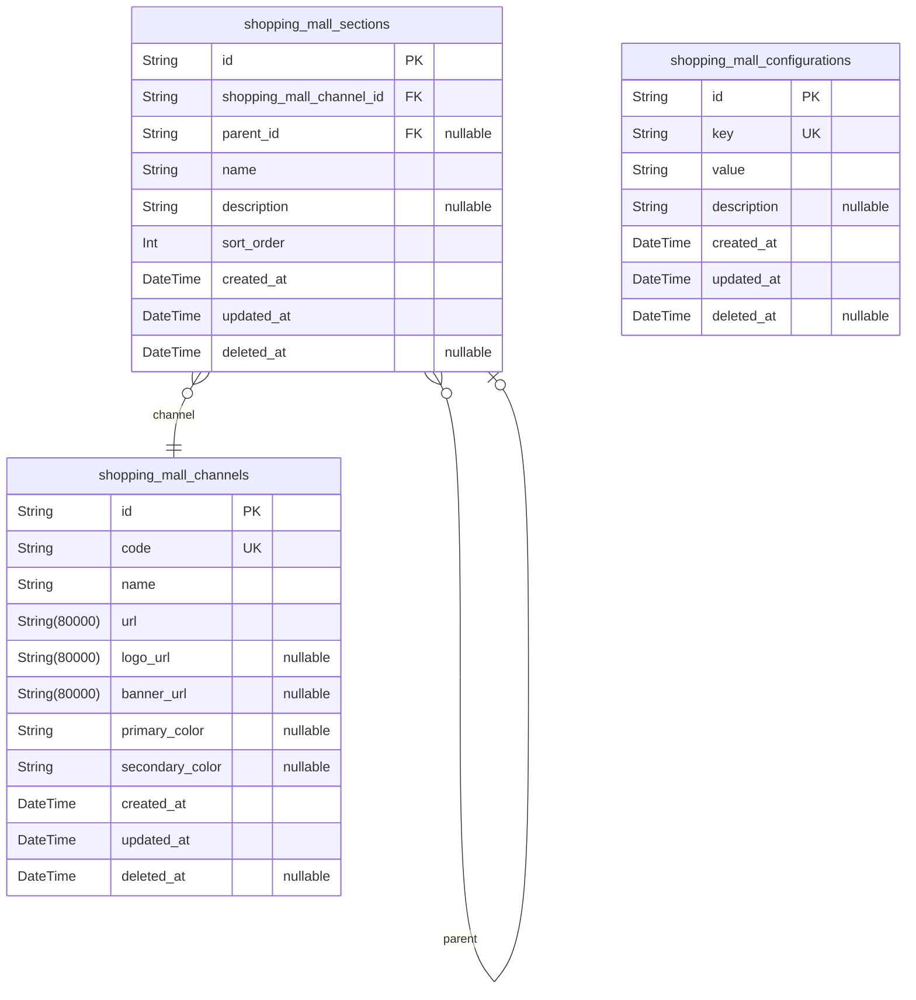

### `shopping_mall_channels`

Sales channels through which customers can access the shopping mall
platform, such as online store, mobile app, or other distribution
methods. Each channel contains specific branding elements and
configuration settings that define its appearance and behavior.

Channels allow the platform to maintain different storefronts with unique
visual identities while sharing the same underlying product catalog and
business logic. This enables omnichannel retail strategies where
customers can interact with the platform through their preferred
interface.

Each channel must have a unique code for identification purposes, and
maintains its own set of visual branding assets including logo, banner
images, and color schemes. The configuration settings allow for
channel-specific features like currency display, language preferences,
and promotional settings.

Properties as follows:

- `id`: Primary Key.
- `code`
  > Unique business code identifying this sales channel within the platform.
  > This code is used in APIs and URLs to route requests to the appropriate
  > channel configuration. Must be unique across all channels.
- `name`
  > Human-readable name for the sales channel that will be displayed to
  > users. Examples include "Online Store", "Mobile App", "Tablet Version",
  > etc.
- `url`
  > URL where this sales channel is accessible to customers. This could be a
  > web domain for online stores or a deep link URL scheme for mobile
  > applications.
- `logo_url`
  > Primary logo image URL for this sales channel, typically displayed in the
  > header or navigation areas. Should be a high-quality image that
  > represents the brand identity of this specific channel.
- `banner_url`
  > Hero banner image URL used on the main page of this sales channel. This
  > larger image is typically used for promotional displays and brand
  > storytelling.
- `primary_color`
  > Primary brand color in hexadecimal format (e.g., #FF0000) used for this
  > channel's interface styling. This allows each channel to maintain its own
  > distinct visual identity.
- `secondary_color`
  > Secondary brand color in hexadecimal format (e.g., #00FF00) used for
  > complementary UI elements in this channel's interface design.
- `created_at`
  > Timestamp when this channel record was initially created in the database.
  > This represents the moment when the channel was first configured in the
  > system.
- `updated_at`
  > Timestamp when this channel record was last modified. This allows
  > tracking of when channel configurations were updated.
- `deleted_at`
  > Timestamp when this channel record was soft deleted, if applicable.
  > Channels with this field set are considered inactive but their historical
  > data is preserved for reporting purposes.

### `shopping_mall_sections`

Sections within a sales channel for organizing content and products
hierarchically. Each section belongs to a specific channel and can
contain nested subsections to create a hierarchical structure for content
organization. Sections enable channels to organize their product catalog,
promotional content, and other merchandising elements in a structured
way.

Sections support hierarchical organization through parent-child
relationships, allowing channels to create complex navigation structures.
Each section maintains its position within the channel through sort order
and hierarchical placement.

Properties as follows:

- `id`: Primary Key.
- `shopping_mall_channel_id`
  > The channel to which this section belongs. {@link
  > shopping_mall_channels.id}
- `parent_id`
  > The parent section for creating hierarchical subsections. {@link
  > shopping_mall_sections.id}
- `name`: Human-readable name for the section used in navigation and display
- `description`: Detailed description of the section's content and purpose
- `sort_order`: Numerical position of this section within its parent for sorting purposes
- `created_at`: Timestamp when the section was initially created
- `updated_at`: Timestamp when the section was last modified
- `deleted_at`: Timestamp when the section was soft deleted, null if active

### `shopping_mall_configurations`

System-wide configuration settings and feature flags.

This table stores key-value pairs for system configuration parameters
such as
feature flags, application settings, thresholds, and environmental
variables.
Each configuration key is unique and represents a specific system
behavior or
setting that can be dynamically adjusted without code changes. Values are
stored as strings to accommodate various data types while maintaining
flexibility.

The configuration table supports a soft delete mechanism to maintain an
audit
trail of all configuration changes and allow for historical analysis of
system
settings. This is essential for debugging, compliance, and understanding the
impact of configuration changes on system behavior over time.

Properties as follows:

- `id`: Primary Key.
- `key`
  > Unique key identifier for the configuration setting (e.g.,
  > 'feature_flag_new_checkout', 'max_retry_attempts').
- `value`
  > Configuration value stored as a string to support different data types
  > (numbers, booleans, strings, JSON).
- `description`
  > Optional description explaining the purpose and usage of this
  > configuration setting.
- `created_at`: Timestamp when this configuration was first created.
- `updated_at`: Timestamp when this configuration was last modified.
- `deleted_at`: Timestamp when this configuration was soft deleted (null if active).

## Products

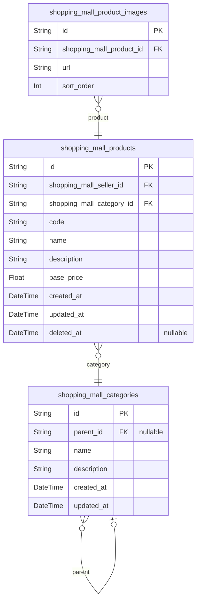

### `shopping_mall_products`

Main product listings containing core product information such as name,
description, and base pricing.

This table stores the fundamental product information that forms the
foundation of the marketplace catalog.
It represents the seller's product offering and contains all essential
attributes needed for customers to discover
and evaluate products. Each product is linked to a specific seller and
category, enabling proper marketplace
organization and search functionality.

The base price field establishes the default pricing for this product,
though individual variants may have
their own specific pricing. All textual content fields support
internationalization and are indexed for
full-text search capabilities to enhance discoverability.

Properties as follows:

- `id`: Primary Key.
- `shopping_mall_seller_id`
  > Seller who owns and manages this product listing. {@link
  > shopping_mall_sellers.id}
- `shopping_mall_category_id`
  > Primary category this product belongs to for organizational purposes.
  > [shopping_mall_categories.id](#shopping_mall_categories)
- `code`
  > Unique identifier for this product within the seller's catalog. Used for
  > internal references and API operations.
- `name`
  > Display name of the product as shown to customers in listings and search
  > results.
- `description`
  > Detailed description of the product including features, specifications,
  > and other relevant information for customers.
- `base_price`
  > Base price of the product in the platform's default currency. This serves
  > as the default price for all variants unless overridden.
- `created_at`: Timestamp when this product record was initially created in the system.
- `updated_at`: Timestamp when this product record was last modified.
- `deleted_at`
  > Timestamp when this product was marked as deleted (soft delete). If null,
  > the product is active.

### `shopping_mall_categories`

Hierarchical product categories with support for one level of
subcategories for product organization.

Categories form the primary organizational structure for products in the
marketplace, allowing customers
to browse items by type. Each category can contain multiple
subcategories, but subcategories cannot
contain further nested categories (one level of nesting only). This
design simplifies navigation
while providing sufficient organization for most e-commerce scenarios.

Each category contains a unique identifier, name, description, and
optional parent category reference.
Root categories have no parent, while subcategories reference their
parent category. The creation
and modification of categories is restricted to administrators only,
ensuring consistent organization
across the platform.

Properties as follows:

- `id`: Primary Key.
- `parent_id`
  > Parent category that this subcategory belongs to. References the parent
  > category's unique identifier. [shopping_mall_categories.id](#shopping_mall_categories)
- `name`
  > Name of the category, used for display and navigation purposes. Must be
  > unique among categories at the same level (root or within same parent).
- `description`
  > Detailed description of the category's contents and purpose, helping
  > customers understand what products belong in this category.
- `created_at`: Timestamp when the category was first created in the system.
- `updated_at`
  > Timestamp when the category was last modified. Updated whenever category
  > details are changed.

### `shopping_mall_product_images`

Multiple images per product with ordering capability, where the first
image serves as the main thumbnail

Properties as follows:

- `id`: Primary Key.
- `shopping_mall_product_id`: The product that owns these images. [shopping_mall_products.id](#shopping_mall_products)
- `url`: The image file URL or path
- `sort_order`: The display order of this image, with lower numbers appearing first

## Inventory

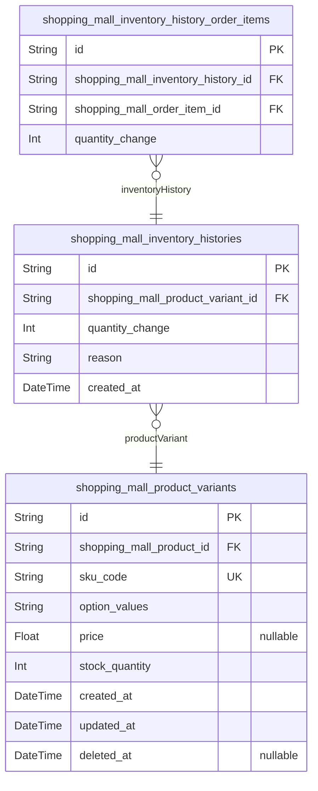

### `shopping_mall_product_variants`

Product variants representing specific combinations of options (e.g.,
color, size) with their unique SKU codes, pricing, and stock quantities.
Each variant is linked to a specific product and contains detailed option
values that distinguish it from other variants of the same product. This
table serves as the fundamental unit for inventory tracking and sales
processing in the e-commerce platform. Variants enable sellers to offer
multiple versions of the same base product with different attributes such
as size, color, or other customizable options. The SKU code serves as the
unique identifier for tracking inventory movements, order fulfillment,
and sales analytics. Every modification to variant details creates an
immutable snapshot for audit purposes, ensuring comprehensive data
governance and compliance with legal requirements. Stock quantities are
managed through detailed inventory history records that track all
movements including sales, restocking, and adjustments.

Properties as follows:

- `id`: Primary Key.
- `shopping_mall_product_id`
  > The base product this variant belongs to. {@link
  > shopping_mall_products.id}
- `sku_code`
  > Unique identifier for this variant used for inventory tracking and order
  > fulfillment. Must be globally unique across the platform to ensure
  > accurate stock management and prevent collisions between sellers. The SKU
  > code typically follows a structured format combining seller
  > identification, product category, and sequential numbering.
- `option_values`
  > Serialized representation of the specific option values that define this
  > variant (e.g., '{"color": "Red", "size": "Large"}'). This field captures
  > the distinguishing characteristics that differentiate this variant from
  > others of the same base product, enabling customers to make precise
  > selections during the purchasing process. Values are stored in a
  > structured format for efficient querying and display.
- `price`
  > Price for this specific variant when different from the base product
  > price. When null, the variant inherits the base price from its parent
  > product. This allows sellers to implement flexible pricing strategies
  > where certain variants may command premium or discounted rates compared
  > to the standard product pricing.
- `stock_quantity`
  > Current available stock quantity for this variant. This value is
  > calculated by summing all inventory history records and represents the
  > real-time availability for purchase. Stock quantities start at 0 when a
  > variant is first created and are adjusted through sales transactions,
  > restocking operations, and inventory adjustments. When stock reaches
  > zero, variants are marked as out of stock and cannot be added to shopping
  > carts.
- `created_at`
  > Timestamp when this variant was first created. Forms part of the audit
  > trail for tracking the product's lifecycle from initial creation through
  > all modifications.
- `updated_at`
  > Timestamp when this variant was last modified. Updated with each change
  > to variant details to maintain accurate modification tracking for both
  > operational monitoring and audit compliance.
- `deleted_at`
  > Timestamp when this variant was marked as deleted. Implements soft
  > deletion pattern to preserve data for audit trails while removing from
  > active listings. Deleted variants are hidden from customer views but
  > remain accessible for order processing and historical reporting.

### `shopping_mall_inventory_histories`

Inventory history records tracking all stock quantity changes for each
product variant. Each record captures the exact quantity change (positive
for restocking, negative for sales/adjustments), the reason for the
change, and timestamp. This provides a complete audit trail of all
inventory movements and enables accurate stock level calculations.

Properties as follows:

- `id`: Primary Key.
- `shopping_mall_product_variant_id`
  > The product variant this inventory record tracks. {@link
  > shopping_mall_product_variants.id}
- `quantity_change`
  > The quantity change for this inventory record. Positive values indicate
  > restocking, negative values indicate sales or adjustments.
- `reason`
  > The reason for this inventory change (e.g., 'restock', 'sale',
  > 'adjustment', 'return').
- `created_at`: Timestamp when this inventory change occurred.

### `shopping_mall_inventory_history_order_items`

Junction table linking inventory history records to the specific order
items that caused stock reductions. This enables traceability from
inventory changes back to specific sales transactions, supporting audit
requirements and stock reconciliation processes.

Properties as follows:

- `id`: Primary Key.
- `shopping_mall_inventory_history_id`
  > Inventory history record for tracking stock quantity changes. {@link
  > shopping_mall_inventory_histories.id}
- `shopping_mall_order_item_id`
  > Order item that caused this inventory reduction through a sale. {@link
  > shopping_mall_order_items.id}
- `quantity_change`
  > The quantity change for this inventory record. Positive values indicate
  > restocking, negative values indicate sales or adjustments.

## Sales

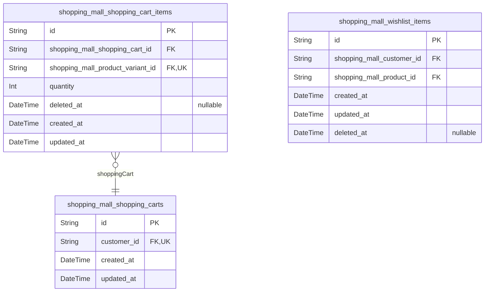

### `shopping_mall_shopping_carts`

Shopping carts representing temporary product selections by customers
before order commitment. Each customer has one active shopping cart that
persists their selections across sessions.

Properties as follows:

- `id`: Primary Key.
- `customer_id`
  > The customer who owns this shopping cart. {@link
  > shopping_mall_customers.id}
- `created_at`: When this shopping cart was initially created.
- `updated_at`: When this shopping cart was last updated.

### `shopping_mall_shopping_cart_items`

Individual items within shopping carts, representing specific product
variants with selected quantities.

This table connects customers' cart selections to actual products and
variants, enabling quantity management and cart operations.
Each cart item links to a specific product variant, allowing customers to
select particular options (size, color, etc.)
Cart items maintain quantity information so customers can specify how
many of each variant they wish to purchase.
When the same variant is added multiple times, quantities are combined
rather than creating duplicate entries.
Cart items include timestamp fields for auditing when items were added or
modified.
Items are soft deleted when removed from cart to preserve audit trails
for potential dispute resolution.
Cart items are converted to order items when a customer successfully
places an order.

Properties as follows:

- `id`: Primary Key.
- `shopping_mall_shopping_cart_id`
  > The shopping cart this item belongs to. {@link
  > shopping_mall_shopping_carts.id}
- `shopping_mall_product_variant_id`
  > The specific product variant selected for this cart item. {@link
  > shopping_mall_product_variants.id}
- `quantity`
  > The quantity of this product variant the customer wishes to purchase.
  > Must be a positive integer as partial quantities are not supported.
- `deleted_at`
  > Whether this cart item has been soft deleted. Used when items are removed
  > from cart to maintain audit trails.
- `created_at`
  > When this cart item was first added to the shopping cart. Important for
  > temporal ordering and audit tracking.
- `updated_at`
  > When this cart item was last modified in the shopping cart. Updated when
  > quantities change or item properties are modified.

### `shopping_mall_wishlist_items`

Wishlist items representing products that customers have saved for
potential future purchase.

These items are maintained separately from shopping carts and can be
converted to cart items when
customers decide to purchase. Each wishlist item links a specific
customer to a specific product
they have expressed interest in purchasing later.

Wishlist items provide a mechanism for customers to save products they
like but aren't ready to
purchase immediately. This allows users to easily revisit products
they're interested in without
having to search for them again.

Each customer can have multiple wishlist items, and each product can be
in multiple wishlists
across different customers. When a customer deletes a wishlist item, it
has no effect on the
underlying product or other customers' wishlists.

Properties as follows:

- `id`: Primary Key.
- `shopping_mall_customer_id`
  > The customer who added this product to their wishlist. Links to the
  > customer's account information.
- `shopping_mall_product_id`
  > The product that has been added to the wishlist. Links to the product's
  > information.
- `created_at`: When this wishlist item was created.
- `updated_at`: When this wishlist item was last updated.
- `deleted_at`: When this wishlist item was soft-deleted, if applicable.

## Orders

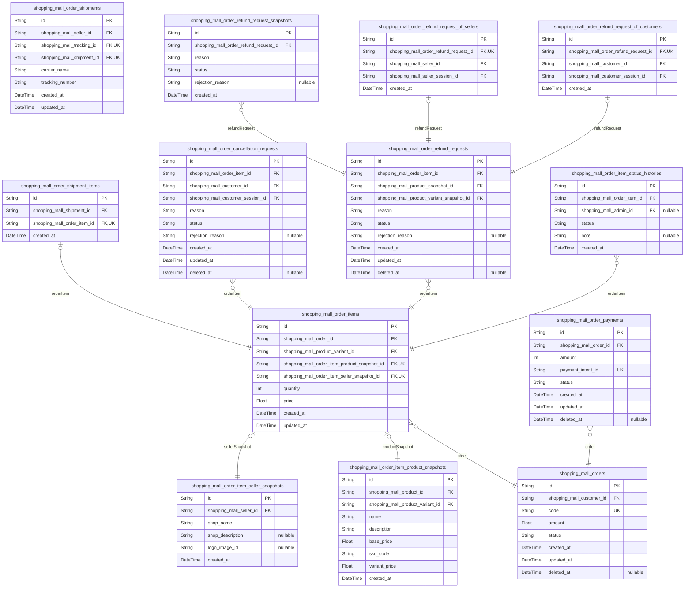

### `shopping_mall_orders`

Main order records representing committed purchases with customer and
address information

This table serves as the central hub for all order processing workflows,
capturing
the essential metadata and linkage information required to track customer
purchases from commitment through fulfillment. Each record represents a
successful transaction where payment has been processed and the customer
has committed to the purchase.

The table implements proper foreign key relationships to customer profiles
for accountability, shipping addresses for delivery coordination, and
maintains
comprehensive temporal tracking through standard audit fields. It also
includes status tracking to monitor the overall lifecycle of the order from
creation through completion or cancellation.

Orders maintain a many-to-one relationship with customers (one customer can
place multiple orders) and a one-to-one relationship with shipping addresses
(an order is delivered to exactly one location, though multiple items within
the order may be shipped in separate packages).

Properties as follows:

- `id`: Primary Key
- `shopping_mall_customer_id`
  > Authenticated customer who placed the order. {@link
  > shopping_mall_customers.id}
  >
  > References the customer account record to establish ownership and enable
  > account-based order history queries. This relationship ensures that all
  > orders can be traced back to a verified customer profile for both
  > business analytics and customer service purposes.
- `code`
  > Human-readable order identifier for customer support and reference
  >
  > A unique business key that provides customers and support staff with
  > an easy-to-reference order number for inquiries, rather than requiring
  > the use of UUIDs in customer communications. This number follows a
  > predictable sequential pattern within each calendar year to aid in
  > manual order location and provides immediate temporal context.
- `amount`
  > Total monetary value of the order at time of purchase
  >
  > Represents the complete purchase amount including all items, taxes,
  > and fees as calculated at checkout time. This frozen value ensures
  > consistent financial tracking regardless of any post-purchase
  > adjustments or modifications to individual order items.
- `status`
  > Current state of the overall order lifecycle
  >
  > Tracks the aggregate status derived from the individual states of all
  > order items within this order, providing a simplified view of the
  > order's progression. Valid states include 'paid' (order confirmed),
  > 'shipped' (at least one item dispatched), 'delivered' (all items
  > received), 'cancelled' (all items cancelled), and 'partially completed'
  > (mixed final states across items).
- `created_at`
  > Timestamp when order was successfully created after payment processing
  >
  > Records the exact moment when the order record was committed to the
  > database following successful payment authorization and inventory
  > reservation. This timestamp serves as the definitive order creation
  > date for reporting and customer communication purposes.
- `updated_at`
  > Timestamp of last modification to order metadata or status
  >
  > Tracks the most recent update to any aspect of the order record,
  > including status changes, administrative adjustments, or metadata
  > modifications. This enables efficient sorting of active orders and
  > provides an audit trail for operational tracking.
- `deleted_at`
  > Timestamp when order was marked as permanently deleted (soft delete)
  >
  > Used for compliance with data retention policies while maintaining
  > operational integrity. When set, indicates the order has been
  > archived according to legal requirements, though all related records
  > (payment, shipment, item details) remain accessible for audit purposes.

### `shopping_mall_order_items`

Individual items within customer orders representing purchased product
variants with quantities and pricing.

Each order item represents a specific product variant that a customer has
purchased
with a defined quantity. These items link to product snapshots that
preserve the
exact product information at the time of purchase, ensuring accurate
records for
legal, audit, and dispute resolution purposes. Order items have
independent lifecycle
management through their own status system, allowing for individual
processing such as
shipment, cancellation, or refund without affecting other items in the
same order.

Order items form the core transaction tracking mechanism in the
e-commerce platform,
enabling precise inventory management, payment processing, and
fulfillment coordination.
They connect customers, sellers, products, and variants in a
comprehensive purchase record.

Properties as follows:

- `id`: Primary Key.
- `shopping_mall_order_id`: The specific order this item belongs to. [shopping_mall_orders.id](#shopping_mall_orders)
- `shopping_mall_product_variant_id`
  > The purchased product variant with its unique SKU and specifications.
  > [shopping_mall_product_variants.id](#shopping_mall_product_variants)
- `shopping_mall_order_item_product_snapshot_id`
  > Snapshot of the product information at time of purchase for audit trail.
  > [shopping_mall_order_item_product_snapshots.id](#shopping_mall_order_item_product_snapshots)
- `shopping_mall_order_item_seller_snapshot_id`
  > Snapshot of the seller information at time of purchase for audit trail.
  > [shopping_mall_order_item_seller_snapshots.id](#shopping_mall_order_item_seller_snapshots)
- `quantity`
  > Quantity of this product variant purchased in this order item. Must be a
  > positive integer representing how many units the customer bought.
- `price`
  > Price per unit of the product variant at the time of purchase. This is
  > captured from the product variant snapshot to ensure accurate financial
  > records even if prices change after purchase.
- `created_at`
  > Timestamp when this order item was created. This represents when the
  > order was placed and payment was confirmed.
- `updated_at`
  > Timestamp when this order item was last updated. Used for tracking any
  > modifications to the order item status or processing information.

### `shopping_mall_order_payments`

Payment records tracking transaction details, payment methods, and
processing status for orders. This table maintains comprehensive
information about payment processing including amounts, methods, external
identifiers, and current processing status to ensure proper financial
tracking of all orders in the system.

This entity represents the subsdiary payment processing component of the
order management system. It tracks the financial aspects of orders with
links to external payment gateways, current payment status, and
transaction amounts. Each record is associated with exactly one order
through the foreign key relationship.

The payment processing workflow follows these status transitions:
- pending: Initial state when payment is initiated
- succeeded: Payment successfully processed by external gateway
- failed: Payment rejected or errored during processing
- cancelled: Payment explicitly cancelled by user or system

Properties as follows:

- `id`: Primary Key.
- `shopping_mall_order_id`: The order this payment record belongs to. [shopping_mall_orders.id](#shopping_mall_orders)
- `amount`
  > The total amount that needs to be paid for the order, in the smallest
  > currency unit (e.g., cents for USD).
- `payment_intent_id`
  > Identifier for the payment transaction from the external payment gateway
  > (e.g., Stripe, PayPal).
- `status`
  > Current status of the payment processing workflow. Valid values: pending,
  > succeeded, failed, cancelled.
- `created_at`: When the payment record was initially created in our system.
- `updated_at`: When the payment record was last updated in our system.
- `deleted_at`: When the payment record was deleted (soft delete).

### `shopping_mall_order_shipments`

Shipment records tracking package deliveries with carrier information and
tracking numbers for fulfilled order items in the order management
system.

This entity serves as a bridge between the order processing system and
the shipping fulfillment system. Each record represents a physical
package that will be sent to a customer, containing one or more order
items. The table maintains essential shipping metadata including carrier
details, tracking information, and status, enabling end-to-end order
fulfillment tracking. Shipments are created when sellers prepare to send
items to customers, typically after payment processing is complete.

This table does not contain full shipment history or detailed tracking
events, which are managed in the dedicated shipping component. Instead,
it focuses on the order-centric view of shipment information needed for
order management workflows. Status tracking is kept minimal here as the
detailed status history is maintained in the order item status histories
table.

Properties as follows:

- `id`: Primary Key.
- `shopping_mall_seller_id`
  > Seller responsible for fulfilling this shipment. References the seller
  > entity that owns the products being shipped in this package. {@link
  > shopping_mall_sellers.id}.
- `shopping_mall_tracking_id`
  > Associated tracking information for this shipment. Links to the detailed
  > tracking records maintained in the shipping component. {@link
  > shopping_mall_trackings.id}.
- `shopping_mall_shipment_id`
  > Shipment record in the dedicated shipping component. Links to the
  > comprehensive shipment entity that contains detailed shipping information
  > and logistics data. [shopping_mall_shipments.id](#shopping_mall_shipments).
- `carrier_name`
  > Name of the shipping carrier handling this package. Examples include
  > 'FedEx', 'UPS', 'DHL', 'USPS', 'Amazon Logistics'. This value is captured
  > at shipment creation for order tracking purposes.
- `tracking_number`
  > Carrier-assigned tracking number for this shipment. Used to monitor the
  > package's journey from seller to customer. Format varies by carrier
  > (e.g., 1Z999AA1234567890 for UPS, 999999999999 for FedEx).
- `created_at`
  > Timestamp when this shipment record was created in the order system.
  > Marks the beginning of the fulfillment process for the associated order
  > items.
- `updated_at`
  > Timestamp of the last update to this shipment record. Used for tracking
  > modifications and maintaining data freshness.

### `shopping_mall_order_shipment_items`

Junction table linking shipments to their constituent order items for
tracking purposes.

This table creates a many-to-many relationship between shipments and
order items, allowing multiple
order items from the same seller to be grouped into a single shipment. It
enables flexible
shipment configurations where individual items or groups of items can be
packaged together for
delivery tracking.

Properties as follows:

- `id`: Primary Key.
- `shopping_mall_shipment_id`
  > The shipment that contains this order item. Links to the shipment entity
  > which contains
  > details about the package delivery including carrier information and
  > tracking numbers.
  > [shopping_mall_shipments.id](#shopping_mall_shipments)
- `shopping_mall_order_item_id`
  > The order item included in this shipment. Links to the specific purchased
  > product variant
  > with its quantity and pricing information. {@link
  > shopping_mall_order_items.id}
- `created_at`
  > Timestamp when this shipment item relationship was created.
  >
  > Records when an order item was assigned to a specific shipment for
  > delivery tracking purposes.
  > This timestamp helps with shipment preparation monitoring and delivery
  > timeline calculations.

### `shopping_mall_order_cancellation_requests`

Customer cancellation requests for order items with reasons and approval
status tracking.

Records customer-initiated requests to cancel order items that are in
'paid' status. Each request
captures the customer's reason for cancellation and tracks the approval
workflow with the seller.
Requests are processed independently, allowing customers to cancel some
items in an order while
keeping others active.

The cancellation process follows these business rules:
- Customers can only request cancellation for items with 'paid' status
- Requests must include a text reason explaining why the cancellation is
needed
- Sellers must approve or reject each cancellation request
- Approved cancellations result in item status changes to 'cancelled'
- Inventory quantities are automatically restored upon approval
- Refunds are processed for approved cancellations

This table serves as the core entity for dispute resolution between
customers and sellers
regarding pre-shipment order modifications. It enables the platform to
maintain an audit
trail of all cancellation activities for compliance and customer service
purposes.

Properties as follows:

- `id`: Primary Key.
- `shopping_mall_order_item_id`: Target order item for cancellation. [shopping_mall_order_items.id](#shopping_mall_order_items).
- `shopping_mall_customer_id`
  > Customer who initiated the cancellation request. {@link
  > shopping_mall_customers.id}.
- `shopping_mall_customer_session_id`
  > Customer session when request was created. {@link
  > shopping_mall_customer_sessions.id}.
- `reason`
  > Customer's explanation for why they want to cancel this order item. Must
  > clearly state the reason to help sellers understand the request context.
- `status`
  > Current state of the cancellation request in the approval workflow. Valid
  > values: 'requested', 'approved', 'rejected'. Status transitions follow
  > the business process for handling customer cancellation requests.
- `rejection_reason`
  > Seller's explanation when rejecting a cancellation request. Required when
  > status is set to 'rejected' to inform the customer of the decision
  > rationale.
- `created_at`
  > When the cancellation request was first submitted by the customer. Used
  > for tracking response times and service level compliance.
- `updated_at`
  > When the cancellation request was last modified. Reflects any status
  > changes or updates to rejection reasons.
- `deleted_at`
  > When the cancellation request was soft deleted. Maintains audit trail for
  > legal compliance while removing from active customer views.

### `shopping_mall_order_refund_requests`

Main table storing refund requests for order items with 'delivered'
status. Tracks the customer's reason for refund and maintains links to
the relevant order item and product snapshots for dispute resolution.

This table represents the core entity for customer-initiated refund
requests, which can only be made for order items that have been
delivered. The refund request process follows a specific workflow where
customers submit requests with reasons, sellers respond with approval or
rejection, and the system handles status transitions and notifications
accordingly. Refund requests are time-limited to 7 days after delivery
confirmation.

The table captures all essential information needed for the refund
workflow including timestamps, reasons, and status tracking. Related
entities handle the polymorphic relationships with customers and sellers,
while snapshots preserve historical product information for audit
purposes.

Properties as follows:

- `id`: Primary Key.
- `shopping_mall_order_item_id`
  > The order item for which refund is being requested. {@link
  > shopping_mall_order_items.id}
- `shopping_mall_product_snapshot_id`
  > Snapshot of the product information at time of purchase. {@link
  > shopping_mall_product_snapshots.id}
- `shopping_mall_product_variant_snapshot_id`
  > Snapshot of the product variant information at time of purchase. {@link
  > shopping_mall_product_variant_snapshots.id}
- `reason`
  > Customer's reason for requesting the refund. Must be between 10 and 1000
  > characters explaining why they want a refund for this order item.
- `status`
  > Current status of the refund request in the workflow process. Valid
  > values: 'requested' (customer submitted), 'approved' (seller approved),
  > 'rejected' (seller rejected), 'cancelled' (customer cancelled).
- `rejection_reason`
  > Optional rejection reason provided by the seller when declining a refund
  > request. Required when status is 'rejected', must be between 10 and 500
  > characters.
- `created_at`: Timestamp when the refund request was initially submitted by the customer.
- `updated_at`: Timestamp when the refund request was last updated (approval/rejection).
- `deleted_at`
  > Timestamp when the refund request was deleted (soft delete for audit
  > trail).

### `shopping_mall_order_refund_request_of_customers`

Tracks refund requests initiated by customers, linking to the customer
and their session at the time of request. Maintains the relationship
between the customer and their refund request, preserving the customer
context for audit purposes.

This subtype entity implements the compatible actor pattern for
polymorphic ownership, ensuring referential integrity and proper data
normalization. It stores customer-specific information related to the
refund request including the customer ID and session, following the main
entity + subtype entities pattern required for multiple actor types.

Properties as follows:

- `id`: Primary Key.
- `shopping_mall_order_refund_request_id`
  > The refund request this customer relationship belongs to. {@link
  > shopping_mall_order_refund_requests.id}
- `shopping_mall_customer_id`
  > The customer who initiated this refund request. {@link
  > shopping_mall_customers.id}
- `shopping_mall_customer_session_id`
  > The customer's session when initiating the refund request. {@link
  > shopping_mall_customer_sessions.id}
- `created_at`: Timestamp when this customer relationship was established.

### `shopping_mall_order_refund_request_of_sellers`

Tracks seller responses to refund requests, linking to the seller and
their session at the time of response. Maintains the relationship between
the seller and their response to a refund request.

This subtype entity implements the compatible actor pattern for
polymorphic ownership, ensuring referential integrity and proper data
normalization. It stores seller-specific information related to the
refund request response including the seller ID and session. The entity
only exists for approved or rejected refund requests, not for pending
ones.

Properties as follows:

- `id`: Primary Key.
- `shopping_mall_order_refund_request_id`
  > The refund request this seller relationship belongs to. {@link
  > shopping_mall_order_refund_requests.id}
- `shopping_mall_seller_id`
  > The seller who responded to this refund request. {@link
  > shopping_mall_sellers.id}
- `shopping_mall_seller_session_id`
  > The seller's session when responding to the refund request. {@link
  > shopping_mall_seller_sessions.id}
- `created_at`: Timestamp when this seller response was recorded.

### `shopping_mall_order_refund_request_snapshots`

Immutable records capturing the state of refund requests and their
processing history for financial audit and dispute resolution.

This table maintains a complete audit trail of all refund request
modifications, preserving historical data for legal compliance. Each
snapshot records the exact state of a refund request at a specific point
in time, including all fields and their values. Snapshots are created
automatically when refund requests are created, approved, rejected, or
otherwise modified.

The snapshot system ensures that critical financial data remains
available for dispute resolution and regulatory compliance, even after
refund requests are deleted or modified. This approach satisfies the
platform's legal requirements for maintaining immutable records of all
business transactions.

Properties as follows:

- `id`: Primary Key.
- `shopping_mall_order_refund_request_id`
  > The refund request this snapshot represents. {@link
  > shopping_mall_order_refund_requests.id}
- `reason`: Customer's reason for requesting the refund as captured in this snapshot.
- `status`: Status of the refund request at time of snapshot.
- `rejection_reason`
  > Rejection reason provided by the seller (if applicable) at time of
  > snapshot.
- `created_at`: Timestamp when this snapshot was created.

### `shopping_mall_order_item_status_histories`

Order item status history tracking for audit trail and state change
monitoring.

This table maintains an immutable record of all status transitions for
order items,
providing a complete audit trail for dispute resolution and business
analytics.
Each record captures the exact moment a status changed, who performed the
change,
and the business context of that transition.

The table is append-only to ensure data integrity and legal compliance.
Status
transitions follow a defined workflow where each change must be
explicitly recorded
with proper authorization context.

Properties as follows:

- `id`: Primary Key.
- `shopping_mall_order_item_id`
  > Reference to the order item whose status is being tracked. {@link
  > shopping_mall_order_items.id}
- `shopping_mall_admin_id`
  > Reference to the administrator who performed the status change, if
  > applicable. [shopping_mall_admins.id](#shopping_mall_admins)
- `status`
  > The status of the order item at this point in time. Valid values
  > represent the complete order item lifecycle from payment to final
  > resolution.
- `note`
  > Optional note explaining the reason for this status change, particularly
  > useful for manual interventions or exceptional circumstances.
- `created_at`: Timestamp when this status change was recorded in the system.

### `shopping_mall_order_item_product_snapshots`

Immutable snapshots of product and variant information at the time of
purchase, used for dispute resolution and audit purposes. This table
captures the exact state of products when they were purchased, ensuring
accurate records for customer service and legal compliance.

Properties as follows:

- `id`: Primary Key.
- `shopping_mall_product_id`: The original product that was purchased. [shopping_mall_products.id](#shopping_mall_products)
- `shopping_mall_product_variant_id`
  > The specific variant of the product that was purchased. {@link
  > shopping_mall_product_variants.id}
- `name`
  > Name of the product at the time of purchase. Captures the exact product
  > name as it appeared when the customer made their purchase.
- `description`
  > Description of the product at the time of purchase. Maintains the full
  > product description as it existed during the transaction for reference in
  > disputes or customer service inquiries.
- `base_price`
  > Base price of the product at the time of purchase. Records the product's
  > base price as it was when the order was placed, separate from any
  > variant-specific pricing.
- `sku_code`
  > SKU code of the purchased variant. Preserves the unique identifier of the
  > specific product variant that was purchased.
- `variant_price`
  > Price of the specific variant at the time of purchase. Captures the final
  > price of the variant as it was when the order was placed, which may
  > differ from the base product price.
- `created_at`
  > Timestamp when this snapshot was created. Records the exact moment when
  > the product information was captured for this order item.

### `shopping_mall_order_item_seller_snapshots`

Seller profile snapshots capturing seller information at the time of
purchase for historical records and dispute resolution.

This table maintains immutable records of seller profile data as it
existed when an order was placed. It ensures accurate historical tracking
for audit purposes and legal compliance, preserving seller information
even if the original seller profile is modified or deleted after the
purchase.

The snapshot includes all relevant seller profile information at the time
of purchase such as shop name, description, and logo reference. This
enables accurate representation of seller details as they appeared when
the customer made their purchase, supporting dispute resolution and
maintaining audit trails for regulatory compliance.

Properties as follows:

- `id`: Primary Key.
- `shopping_mall_seller_id`: Reference to the original seller profile. [shopping_mall_sellers.id](#shopping_mall_sellers)
- `shop_name`
  > Name of the seller's shop at the time of the order. This preserves the
  > seller's shop name as it appeared when the customer made their purchase,
  > ensuring accurate identification even if the seller changes their shop
  > name after the order is placed.
- `shop_description`
  > Description of the seller's shop at the time of the order. This preserves
  > the seller's shop description as it existed when the customer made their
  > purchase, maintaining historical accuracy for audit and dispute
  > resolution purposes.
- `logo_image_id`
  > Reference or identifier to the seller's logo image at the time of the
  > order. This preserves the visual identity of the seller's shop as it
  > appeared when the customer made their purchase, ensuring consistent
  > representation in order history even if the seller updates their logo
  > afterward.
- `created_at`
  > The timestamp when the seller profile snapshot was created, indicating
  > exactly when the order was placed and the seller information was
  > recorded.

## Shipping

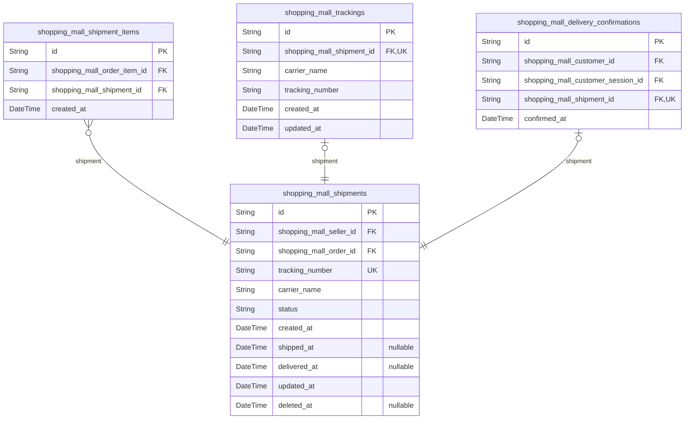

### `shopping_mall_shipments`

Shipment records tracking package deliveries with carrier information and
tracking numbers for fulfilled order items. Each shipment represents a
package sent by a seller containing one or more order items from the same
seller. Shipments are created when sellers mark order items as shipped
and contain all necessary logistics information for delivery.

Properties as follows:

- `id`: Primary Key.
- `shopping_mall_seller_id`
  > Seller who owns this shipment and is responsible for shipping the items.
  > [shopping_mall_sellers.id](#shopping_mall_sellers)
- `shopping_mall_order_id`
  > Order that this shipment is associated with. {@link
  > shopping_mall_orders.id}
- `tracking_number`
  > Unique identifier for the shipment in carrier's system. Used for tracking
  > package movement and providing customers with delivery updates.
- `carrier_name`
  > Name of the shipping carrier responsible for package delivery. Examples
  > include UPS, FedEx, USPS, DHL, or regional carriers.
- `status`
  > Current status of the shipment in the delivery process. Valid values:
  > 'pending' (awaiting pickup), 'shipped' (in transit), 'delivered'
  > (successfully delivered), 'failed' (delivery attempt failed), 'returned'
  > (package returned to sender).
- `created_at`
  > Timestamp when the shipment was created in the system. This marks when
  > the seller initiated the shipping process for the associated order items.
- `shipped_at`
  > Timestamp when the package was picked up by the carrier or dropped off at
  > a shipping facility. This marks the official start of the shipping
  > process.
- `delivered_at`
  > Timestamp when the package was successfully delivered to the customer's
  > address. This triggers delivery confirmation workflows.
- `updated_at`
  > Timestamp when the shipment record was last updated. This helps track
  > status changes and system modifications.
- `deleted_at`
  > Timestamp when the shipment record was soft deleted from the system. This
  > preserves audit trails while removing records from active queries.

### `shopping_mall_shipment_items`

Junction table linking order items to specific shipments. Allows multiple
order items from the same seller to be grouped into a single shipment
package.

This table implements a many-to-many relationship between order items and
shipments, enabling flexible
shipment grouping strategies. Each record represents one order item being
part of one specific shipment.
This design allows sellers to group multiple order items into a single
package for shipping efficiency
while maintaining traceability of individual item fulfillment status.

The table enforces referential integrity to ensure only valid order items
and shipments can be linked.
It supports the business requirement that different sellers always ship
items in separate shipments,
as the grouping logic is handled at the application level when creating
shipments.

For audit and tracking purposes, the creation timestamp indicates when
the item was assigned to the shipment,
which may be useful for analyzing fulfillment timelines and identifying
shipping delays.

Properties as follows:

- `id`: Primary Key
- `shopping_mall_order_item_id`
  > The specific order item being shipped. {@link
  > shopping_mall_order_items.id}
- `shopping_mall_shipment_id`
  > The shipment this order item is assigned to. {@link
  > shopping_mall_shipments.id}
- `created_at`
  > Timestamp when this order item was assigned to the shipment for tracking
  > fulfillment timelines

### `shopping_mall_trackings`

Tracking information for shipments including carrier name and tracking
numbers. Manages the physical movement of packages from sellers to
customers.

Properties as follows:

- `id`: Primary Key.
- `shopping_mall_shipment_id`: The shipment being tracked. [shopping_mall_shipments.id](#shopping_mall_shipments)
- `carrier_name`: Name of the shipping carrier (e.g., FedEx, UPS, USPS).
- `tracking_number`: Unique tracking number provided by the carrier for package identification.
- `created_at`: Timestamp when this tracking information was created.
- `updated_at`: Timestamp when this tracking information was last updated.

### `shopping_mall_delivery_confirmations`

Customer delivery confirmations for shipments. Records when customers
confirm receipt of their packages, which triggers status updates for all
items in the shipment. This table maintains the relationship between
customers, their sessions, shipments, and the confirmation timestamp.
Each customer can confirm delivery for a shipment only once, and this
confirmation affects all order items within that shipment.

Properties as follows:

- `id`: Primary Key.
- `shopping_mall_customer_id`
  > Customer who confirmed delivery of the shipment. {@link
  > shopping_mall_customers.id}
- `shopping_mall_customer_session_id`
  > Session used when customer confirmed delivery. {@link
  > shopping_mall_customer_sessions.id}
- `shopping_mall_shipment_id`
  > Shipment that was confirmed as delivered. {@link
  > shopping_mall_shipments.id}
- `confirmed_at`: Timestamp when customer confirmed delivery of the shipment.

## Disputes

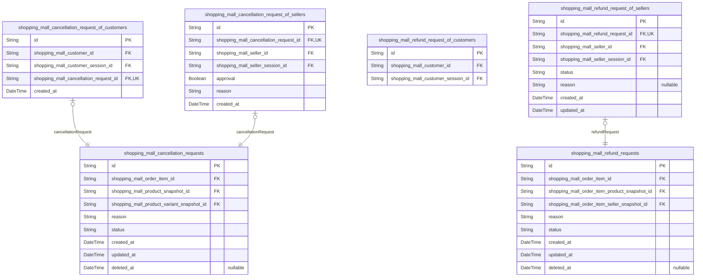

### `shopping_mall_cancellation_requests`

Main entity for cancellation requests, tracking customer-initiated
cancellations for paid order items. This table stores the reason for
cancellation, maintains links to relevant order items, and preserves
snapshots of product information at the time of purchase for dispute
resolution purposes.

Each cancellation request is associated with exactly one order item from
a customer's purchase. The request can be approved or rejected by the
seller, with the outcome affecting inventory levels and triggering
refunds when approved. Cancellation requests are subject to specific
business rules - they can only be made for order items with 'paid'
status, not for items that have already been shipped or delivered.

This entity works in conjunction with subtype tables
(shopping_mall_cancellation_request_of_customers and
shopping_mall_cancellation_request_of_sellers) to maintain proper
relationships with both customers who initiate cancellations and sellers
who respond to them. A snapshot table
(shopping_mall_cancellation_request_snapshots) preserves the history of
all changes to these requests for audit purposes.

Properties as follows:

- `id`: Primary Key.
- `shopping_mall_order_item_id`
  > Foreign key to the order item being cancelled. {@link
  > shopping_mall_order_items.id}
- `shopping_mall_product_snapshot_id`
  > Foreign key to the product snapshot at time of purchase. {@link
  > shopping_mall_product_snapshots.id}
- `shopping_mall_product_variant_snapshot_id`
  > Foreign key to the product variant snapshot at time of purchase. {@link
  > shopping_mall_product_variant_snapshots.id}
- `reason`: Customer-provided reason for requesting the cancellation
- `status`: Current status of the cancellation request
- `created_at`: Timestamp when the cancellation request was created
- `updated_at`: Timestamp when the cancellation request was last updated
- `deleted_at`: Timestamp when the cancellation request was deleted (soft delete)

### `shopping_mall_cancellation_request_of_customers`

Customer cancellation requests linking to customer and session at time of
request

Properties as follows:

- `id`: Primary Key.
- `shopping_mall_customer_id`
  > Customer who initiated this cancellation request. {@link
  > shopping_mall_customers.id}
- `shopping_mall_customer_session_id`
  > Session of the customer when initiating this cancellation request. {@link
  > shopping_mall_customer_sessions.id}
- `shopping_mall_cancellation_request_id`
  > Main cancellation request this customer-specific record references.
  > [shopping_mall_cancellation_requests.id](#shopping_mall_cancellation_requests)
- `created_at`
  > Timestamp when this customer-specific cancellation request record was
  > created.

### `shopping_mall_cancellation_request_of_sellers`

Seller responses to cancellation requests with approval/rejection
decision and justification.

This table tracks seller responses to customer-initiated cancellation
requests for order
items with 'paid' status. It captures the seller's decision
(approve/reject) along with
their justification and maintains links to relevant snapshots for audit
purposes.

Properties as follows:

- `id`: Primary Key.
- `shopping_mall_cancellation_request_id`
  > Associated cancellation request. {@link
  > shopping_mall_cancellation_requests.id}
- `shopping_mall_seller_id`
  > Seller who responded to the cancellation request. {@link
  > shopping_mall_sellers.id}
- `shopping_mall_seller_session_id`: Seller's session when responding. [shopping_mall_seller_sessions.id](#shopping_mall_seller_sessions)
- `approval`
  > Seller's decision on the cancellation request. True to approve, false to
  > reject.
- `reason`
  > Seller's justification for their decision. Required when rejecting a
  > request.
- `created_at`: When the seller's response was created.

### `shopping_mall_refund_requests`

Main table storing refund requests for order items with 'delivered'
status. Tracks the customer's reason for refund and maintains links to
the relevant order item and product snapshots.

Properties as follows:

- `id`: Primary Key.
- `shopping_mall_order_item_id`: The order item being refunded. [shopping_mall_order_items.id](#shopping_mall_order_items)
- `shopping_mall_order_item_product_snapshot_id`
  > Snapshot of the purchased product at time of order for dispute
  > resolution. [shopping_mall_order_item_product_snapshots.id](#shopping_mall_order_item_product_snapshots)
- `shopping_mall_order_item_seller_snapshot_id`
  > Snapshot of the seller profile at time of order for historical records.
  > [shopping_mall_order_item_seller_snapshots.id](#shopping_mall_order_item_seller_snapshots)
- `reason`: Text reason provided by customer for requesting refund
- `status`: Current status of the refund request
- `created_at`: Timestamp when the refund request was initially created
- `updated_at`: Timestamp when the refund request was last updated
- `deleted_at`: Timestamp when the refund request was deleted (soft delete)

### `shopping_mall_refund_request_of_customers`

Customer refund requests linking to customer and session at time of
request. Maintains relationship between customer and their refund
request.

Properties as follows:

- `id`: Primary Key.
- `shopping_mall_customer_id`
  > Customer who initiated refund request. Links to customer identity for
  > request validation and communication. [shopping_mall_customers.id](#shopping_mall_customers)
- `shopping_mall_customer_session_id`
  > Customer's session when initiating refund request. Used for audit trail
  > and security validation. [shopping_mall_customer_sessions.id](#shopping_mall_customer_sessions)

### `shopping_mall_refund_request_of_sellers`

Seller-specific responses to customer refund requests for delivered order
items.

This table tracks when sellers respond to refund requests initiated by
customers, linking to both the seller and their authentication session at
the response time. It maintains the relationship between the seller and
their response to a refund request, storing whether it was approved or
rejected and any attached response message.

When a seller responds to a customer refund request, a record is created
here containing their response decision and message. This record
references the main refund request in the primary table
shopping_mall_refund_requests.

This table implements the standard seller polymorphic pattern where
seller-specific attributes related to order management are stored in
specialized tables. This allows sellers to properly track and respond to
refund requests associated with their products.

Properties as follows:

- `id`: Primary Key.
- `shopping_mall_refund_request_id`
  > The main refund request record that this seller response applies to.
  > References the core refund request in shopping_mall_refund_requests.
- `shopping_mall_seller_id`
  > The authenticated seller who is responding to this refund request.
  > References the seller's account record in shopping_mall_sellers.
- `shopping_mall_seller_session_id`
  > The specific seller authentication session during which this response was
  > provided. References the session in shopping_mall_seller_sessions.
- `status`
  > Seller's response status to the refund request. Valid values are
  > 'approved' for accepted refunds or 'rejected' for declined refund
  > requests.
- `reason`
  > Optional text explanation provided by the seller when responding to the
  > refund request. This field is required when rejecting a refund request.
- `created_at`
  > The exact timestamp when the seller created their refund response. This
  > preserves the chronological sequence of all responses.
- `updated_at`
  > The timestamp of the most recent modification to this seller's refund
  > response. Enables tracking of any changes in seller response decisions.

## Reviews

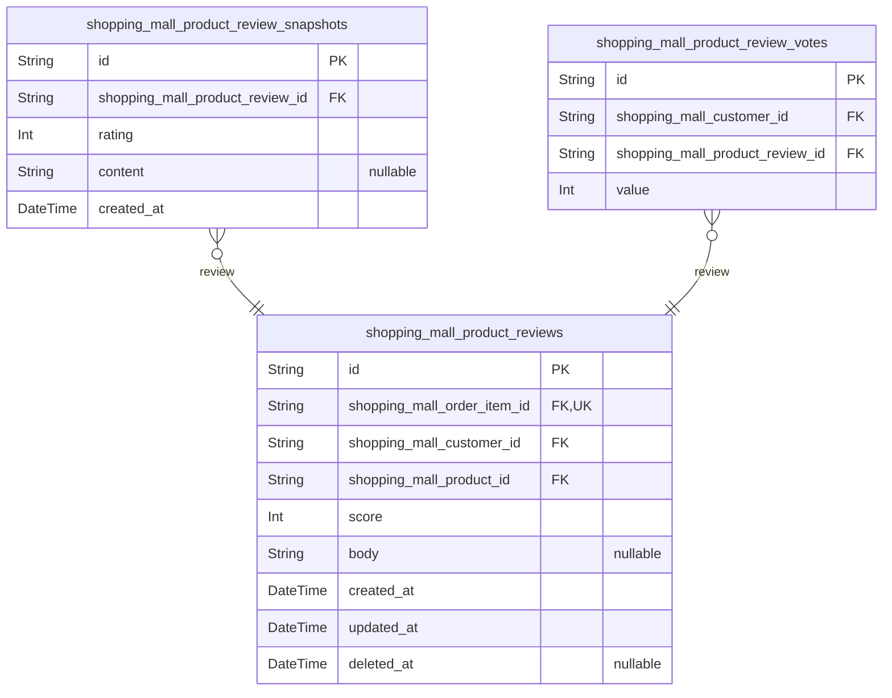

### `shopping_mall_product_reviews`

Customer product reviews with ratings for items they have purchased and
received.

This table stores reviews written by customers for products they have
actually purchased and received. Each review is tied to a specific order
item, ensuring that only legitimate purchasers can leave feedback. The
review includes both a numerical rating (1-5 stars) and optional textual
feedback, along with timestamps for creation and modification tracking.

Reviews can be associated with snapshots of the product information at
the time of purchase, preserving historical context even if the product
details change later. This supports accurate dispute resolution and
maintains the integrity of the feedback system.

The system prevents multiple reviews per product per customer, ensuring
that each customer can only leave one review for a given product they
purchased. This helps maintain the authenticity and fairness of the
review system.

Properties as follows:

- `id`: Primary Key.
- `shopping_mall_order_item_id`
  > The order item that was purchased and is being reviewed. {@link
  > shopping_mall_order_items.id}
- `shopping_mall_customer_id`: The customer who wrote the review. [shopping_mall_customers.id](#shopping_mall_customers)
- `shopping_mall_product_id`: The product that was reviewed. [shopping_mall_products.id](#shopping_mall_products)
- `score`
  > The star rating given by the customer, from 1 to 5 stars. This represents
  > the customer's overall satisfaction with the purchased product.
- `body`
  > Optional text content of the review, where customers can provide detailed
  > feedback about their experience with the product.
- `created_at`: Timestamp when the review was initially created.
- `updated_at`: Timestamp when the review was last updated or modified.
- `deleted_at`
  > Timestamp when the review was soft deleted, if applicable. Allows for
  > recovery of reviews while maintaining data integrity.

### `shopping_mall_product_review_snapshots`

Historical snapshots of product review content for audit trail and legal
compliance.

This table captures immutable point-in-time records of product reviews,
preserving their state even after deletions or modifications. Each
snapshot is created whenever a review is edited or deleted, ensuring a
complete history for dispute resolution and compliance purposes. The
snapshots maintain the exact content and rating that customers originally
submitted, providing an accurate historical record.

This entity is essential for maintaining data integrity in the review
system as it prevents data loss and provides an audit trail for all
review modifications. It supports both business requirements for customer
trust and legal requirements for data preservation.

Properties as follows:

- `id`: Primary Key.
- `shopping_mall_product_review_id`
  > Reference to the original review that this snapshot represents. {@link
  > shopping_mall_product_reviews.id}.
- `rating`
  > Numerical rating given in the review (1 to 5 stars). This captures the
  > exact rating at the time of the snapshot.
- `content`
  > Text content of the review at the time of the snapshot. This preserves
  > the customer's exact words and feedback.
- `created_at`
  > Timestamp when this snapshot was created. This ensures chronological
  > tracking of review history.

### `shopping_mall_product_review_votes`

Customer voting on product review helpfulness to support quality metrics
and sorting.

This table tracks individual customer votes on whether they found a product
review helpful. Each vote is associated with both a specific customer and
review, allowing the system to calculate overall helpfulness scores and
prevent duplicate voting. The vote value indicates the customer's sentiment
(1 for helpful, -1 for not helpful), enabling the platform to rank reviews
by their perceived value to other customers.

The table supports the core reputation management system by:
1. Enabling collaborative filtering of review quality
2. Providing data for review sorting algorithms
3. Preventing vote manipulation through unique constraints
4. Maintaining audit trails of user engagement

This entity is a fundamental component of the review ecosystem, working in
conjunction with product reviews and their snapshots to create a
comprehensive
feedback mechanism that enhances the customer shopping experience through
community-driven quality assessment.

Properties as follows:

- `id`: Primary Key.
- `shopping_mall_customer_id`: Customer who cast the vote. [shopping_mall_customers.id](#shopping_mall_customers).
- `shopping_mall_product_review_id`: Review being voted on. [shopping_mall_product_reviews.id](#shopping_mall_product_reviews).
- `value`: Vote value indicating helpfulness (1 = helpful, -1 = not helpful).

## Seller

```mermaid
erDiagram
"shopping_mall_seller_dashboards" {
  String id PK
  String shopping_mall_seller_id FK,UK
  Int product_count
  Int order_item_count
  Int pending_cancellation_count
  Int pending_refund_count
  DateTime created_at
  DateTime updated_at
}
"shopping_mall_seller_product_metrics" {
  String id PK
  String shopping_mall_seller_id FK
  String shopping_mall_product_id FK
  Int total_orders
  Int total_quantity_sold
  Float total_revenue
  Float average_rating "nullable"
  Int review_count
  Int wishlist_additions
  Int current_stock
  DateTime last_updated
}
"shopping_mall_seller_analytics" {
  String id PK
  String shopping_mall_seller_id FK
  DateTime report_date
  Int total_orders
  Float total_revenue
  Float average_order_value
  Int total_products_sold
  Float conversion_rate
  Int new_customers
  DateTime created_at
}
"shopping_mall_seller_order_items" {
  String id PK
  String order_item_id FK,UK
  String seller_id FK
  String product_id FK
  DateTime created_at
}
"shopping_mall_seller_cancellation_requests" {
  String id PK
  String shopping_mall_order_item_id FK,UK
  String shopping_mall_customer_id FK
  String status
  String customer_reason
  String seller_response "nullable"
  DateTime created_at
  DateTime updated_at
  DateTime resolved_at "nullable"
}
"shopping_mall_seller_refund_requests" {
  String id PK
  String shopping_mall_refund_request_id FK,UK
  DateTime created_at
  DateTime updated_at
  DateTime deleted_at "nullable"
}
"shopping_mall_seller_inventory_alerts" {
  String id PK
  String shopping_mall_seller_id FK
  String shopping_mall_product_variant_id FK
  Int current_stock
  Int minimum_threshold
  DateTime created_at
  DateTime updated_at
}
"shopping_mall_seller_wishlist_metrics" {
  String id PK
  String shopping_mall_product_variant_id FK,UK
  Int total_additions
  Int current_count
  Int popularity_ranking
  DateTime created_at
  DateTime updated_at
}
```

### `shopping_mall_seller_dashboards`

Main entity storing seller dashboard analytics and performance metrics data

This table contains aggregated metrics and analytics data that powers the
seller
dashboard. It tracks key performance indicators, sales metrics, and business
intelligence data that helps sellers understand their shop performance.

The entity maintains real-time metrics that are updated as new orders,
sales,
and customer interactions occur. It provides the data foundation for the
seller
dashboard interface.

Properties as follows:

- `id`: Primary Key
- `shopping_mall_seller_id`
  > Reference to the seller this dashboard belongs to. {@link
  > shopping_mall_sellers.id}
- `product_count`
  > Total number of products currently listed by the seller
  >
  > This metric reflects the active product catalog size, excluding deleted or
  > archived products. Updated in real-time as sellers add or remove products.
- `order_item_count`
  > Total number of order items associated with the seller's products
  >
  > Represents the cumulative volume of sales items, tracking every individual
  > product variant sold. This includes items in all statuses (paid, shipped,
  > delivered, etc.) and provides insight into sales volume trends.
- `pending_cancellation_count`
  > Number of pending cancellation requests requiring seller response
  >
  > Tracks active cancellation requests that need seller attention. This
  > metric
  > helps sellers prioritize customer service tasks and monitor potential
  > dispute
  > volumes.
- `pending_refund_count`
  > Number of pending refund requests requiring seller response
  >
  > Tracks active refund requests that need seller attention. This metric
  > helps
  > sellers manage customer service workload and monitor potential financial
  > impacts.
- `created_at`
  > Timestamp when this dashboard record was first created
  >
  > Marks the initialization of the seller's dashboard analytics.
- `updated_at`
  > Timestamp when this dashboard record was last updated
  >
  > Reflects the most recent update to any of the dashboard metrics.

### `shopping_mall_seller_product_metrics`

Seller performance metrics tracking table storing key business indicators
for individual products. This table enables sellers to monitor their
product performance, identify top-selling items, and make data-driven
decisions about inventory and pricing strategies.

Properties as follows:

- `id`: Primary Key.
- `shopping_mall_seller_id`
  > The seller whose products are being tracked. {@link
  > shopping_mall_sellers.id}
- `shopping_mall_product_id`
  > The product being tracked for performance metrics. {@link
  > shopping_mall_products.id}
- `total_orders`
  > Total number of orders containing this product from this seller. Used to
  > identify best-selling products and track sales volume trends.
- `total_quantity_sold`
  > Total quantity sold of this product from this seller. Helps understand
  > sales volume and restocking needs.
- `total_revenue`
  > Total revenue generated by this product for this seller. Critical for
  > understanding profitability and setting pricing strategies.
- `average_rating`
  > Average rating of this product based on customer reviews. Important for
  > understanding product quality perception and identifying improvement
  > areas.
- `review_count`
  > Total number of reviews received for this product. Indicates product
  > popularity and customer engagement levels.
- `wishlist_additions`
  > Total number of times this product has been added to customer wishlists.
  > Useful for identifying popular items and potential future sales.
- `current_stock`
  > Current stock level for this product. Monitored to prevent stockouts and
  > manage inventory efficiently.
- `last_updated`
  > Timestamp when this metric record was last updated. Enables tracking of
  > metric changes over time.

### `shopping_mall_seller_analytics`

Historical analytics data for seller performance trends and metrics
tracking.

This table stores daily aggregated performance metrics for sellers on the
platform,
providing insights into sales trends, customer acquisition, and overall
business
performance. The data is used for dashboard analytics, performance
benchmarking,
and business intelligence reporting.

Each record represents a seller's performance snapshot for a specific date,
capturing key business indicators that help evaluate seller success and
platform
engagement. This data supports seller dashboard analytics and administrative
performance monitoring.

Properties as follows:

- `id`: Unique identifier for this analytics record
- `shopping_mall_seller_id`: Seller this analytics record belongs to. [shopping_mall_sellers.id](#shopping_mall_sellers)
- `report_date`: The date for which these analytics were calculated
- `total_orders`: Total number of orders for this seller on the report date
- `total_revenue`: Total revenue generated by this seller on the report date
- `average_order_value`: Average order value for this seller on the report date
- `total_products_sold`: Total number of products sold by this seller on the report date
- `conversion_rate`: Conversion rate percentage for this seller on the report date
- `new_customers`
  > Number of new customers who made their first purchase from this seller on
  > the report date
- `created_at`: Timestamp when this analytics record was created

### `shopping_mall_seller_order_items`

Order items associated with sellers' products for dashboard management.

This table provides sellers with visibility into all order items for
their products,
enabling them to track sales performance, fulfillment status, and
customer demand.
It serves as the primary data source for the seller dashboard analytics
and metrics
tracking features. The table maintains links to core order and product
information
while preserving seller-specific context for business intelligence purposes.

Unlike order items in the Orders component which focus on transaction
processing,
this table is optimized for seller analytics and performance monitoring.
It includes
references to both the original order item and product information,
allowing sellers
to access complete context for their sales activities. The table supports
filtering
by various criteria including order status, date ranges, and product
categories.

Properties as follows:

- `id`: Primary Key.
- `order_item_id`
  > The order item this seller order item references. {@link
  > shopping_mall_order_items.id}
- `seller_id`
  > The seller who owns this order item record. {@link
  > shopping_mall_sellers.id}
- `product_id`
  > The product associated with this order item. {@link
  > shopping_mall_products.id}
- `created_at`
  > Timestamp when this seller order item record was created for tracking
  > purposes.

### `shopping_mall_seller_cancellation_requests`

Seller cancellation requests requiring response.

This table tracks all cancellation requests initiated by customers for
order items
with 'paid' status that require seller attention. Each record represents
a pending
action item for sellers to review and respond to cancellation requests.

The table maintains links to the original order item and customer
information
while storing the request details separately to preserve audit history. This
separation ensures that even if original records are modified, the
cancellation
request context remains intact for dispute resolution.

Sellers can filter these records by various criteria including request date,
customer information, product details, and current status to efficiently
manage
their response workflow.

Properties as follows:

- `id`: Unique identifier for the cancellation request record.
- `shopping_mall_order_item_id`
  > The order item associated with this cancellation request. {@link
  > shopping_mall_order_items.id}
- `shopping_mall_customer_id`
  > The customer who initiated this cancellation request. {@link
  > shopping_mall_customers.id}
- `status`
  > Current processing status of the cancellation request.
  >
  > Valid values:
  > - 'pending': Awaiting seller response
  > - 'approved': Seller has approved the cancellation
  > - 'rejected': Seller has rejected the cancellation request
- `customer_reason`
  > Reason provided by the customer for requesting this cancellation.
  >
  > This text field captures the customer's explanation for why they wish to
  > cancel their order, which helps sellers understand the context when
  > making their approval decision.
- `seller_response`
  > Seller's response to the cancellation request.
  >
  > This field stores the seller's justification for either approving or
  > rejecting the cancellation request, which becomes part of the audit
  > trail for potential dispute resolution.
- `created_at`
  > Timestamp when this cancellation request was created.
  >
  > This represents when the customer submitted their cancellation request,
  > which is important for tracking response times and service level
  > agreements.
- `updated_at`
  > Timestamp when the seller last updated this request.
  >
  > This field tracks when the seller took action on the request, whether
  > approving, rejecting, or simply reviewing the request.
- `resolved_at`
  > Timestamp when this cancellation request was resolved.
  >
  > Set when the seller either approves or rejects the request, marking
  > the completion of this workflow item.

### `shopping_mall_seller_refund_requests`

Main entity for tracking refund requests that require seller response
within the seller dashboard.

This table serves as the primary entity for tracking refund requests that
require seller response within the seller dashboard. It helps sellers
monitor and manage refund requests initiated by customers for delivered
items. Each record represents a pending refund request that requires
seller approval or rejection.

The system creates a record in this table when a customer submits a
refund request for an order item with "delivered" status. The seller can
then review the request and either approve or reject it through the
seller dashboard. When a seller responds to a refund request, the system
creates a snapshot of the request state for audit trail purposes.

This entity plays a crucial role in seller dashboard analytics, providing
metrics on pending refund requests and overall refund processing times.
It contributes to seller performance analytics by tracking
approval/rejection rates and response times.

Properties as follows:

- `id`: Primary Key.
- `shopping_mall_refund_request_id`
  > Reference to the main refund request record. {@link
  > shopping_mall_refund_requests.id}
- `created_at`: Timestamp when the seller refund request record was created.
- `updated_at`: Timestamp when the seller refund request record was last updated.
- `deleted_at`
  > Timestamp when the seller refund request record was deleted, if
  > applicable.

### `shopping_mall_seller_inventory_alerts`

Inventory monitoring alerts for seller products that track low stock
conditions and trigger notifications.

This table stores alerts generated when product variants fall below their
defined minimum stock thresholds. Each alert is associated with a
specific seller and product variant, allowing sellers to proactively
manage their inventory levels. The alerts include the current stock
level, the minimum threshold that was breached, and timestamps for when
the alert was generated and last updated.

Alerts in this table represent active low stock conditions that require
seller attention. When stock is replenished above the threshold, the
alert should be automatically resolved by the system. This table enables
sellers to maintain optimal inventory levels and avoid stockouts that
could impact sales.

Properties as follows:

- `id`: Primary Key.
- `shopping_mall_seller_id`: Seller who owns this inventory alert. [shopping_mall_sellers.id](#shopping_mall_sellers)
- `shopping_mall_product_variant_id`
  > Product variant that triggered this low stock alert. {@link
  > shopping_mall_product_variants.id}
- `current_stock`
  > Current stock level of the product variant when the alert was triggered.
  > This value should be below the minimum threshold.
- `minimum_threshold`
  > Minimum stock threshold that was breached to trigger this alert. When
  > current stock falls below this value, an alert is generated.
- `created_at`: Timestamp when this alert was first generated.
- `updated_at`
  > Timestamp when this alert was last updated. This may occur when stock
  > levels change but remain below the threshold.

### `shopping_mall_seller_wishlist_metrics`

Wishlist tracking metrics for monitoring product popularity and customer
interest. This table records wishlist additions and removals to help
sellers understand which products are generating the most interest from
potential customers. The metrics include total wishlist additions,
current wishlist count, and popularity ranking to support inventory and
marketing decisions.

Properties as follows:

- `id`: Primary Key.
- `shopping_mall_product_variant_id`
  > The product variant that is being tracked for wishlist metrics. {@link
  > shopping_mall_product_variants.id}
- `total_additions`
  > The total number of times this product variant has been added to customer
  > wishlists since tracking began. This provides insight into long-term
  > customer interest and product discovery.
- `current_count`
  > The current number of customers who have this product variant in their
  > wishlist. This represents active interest and potential future sales.
- `popularity_ranking`
  > A calculated ranking score based on wishlist activity to help sellers
  > identify their most popular products. Lower numbers indicate higher
  > popularity.
- `created_at`: Timestamp when this wishlist metric record was first created.
- `updated_at`: Timestamp when this wishlist metric record was last updated.

## Admin

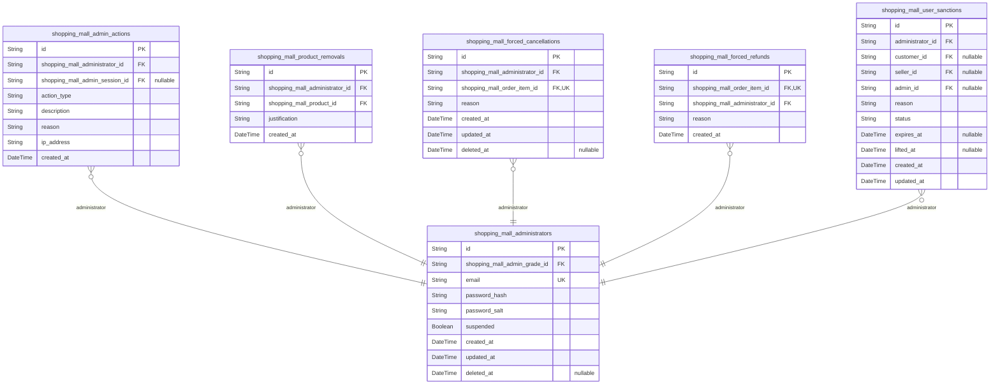

### `shopping_mall_administrators`

Administrator accounts with authentication credentials and permission
levels for platform management.

This table stores core administrator account information including
authentication credentials
(password hash and password salt for secure authentication) and account
status (suspension flag).
Each administrator has a unique email address for login and
identification purposes.

The table supports different permission levels through relationships with
the admin grades table,
enabling fine-grained access control across the platform's administrative
functions.
Administrators can be suspended, temporarily preventing them from
accessing the system.

This entity serves as the foundation for the administrative access
control system,
providing secure authentication and authorization mechanisms for platform
governance.

Properties as follows:

- `id`: Primary Key.
- `shopping_mall_admin_grade_id`
  > Grade level that determines administrator's permission scope and
  > capabilities. [shopping_mall_admin_grades.id](#shopping_mall_admin_grades)
- `email`
  > Unique email address used for administrator authentication and
  > communication. Must be unique across all administrators.
- `password_hash`
  > Cryptographically secured password hash generated using industry-standard
  > hashing algorithm. Used for authentication verification.
- `password_salt`
  > Random string used as salt in password hashing process to prevent rainbow
  > table attacks and ensure unique hashes.
- `suspended`
  > Flag indicating whether the administrator account is currently suspended
  > and unable to access the system. When true, the administrator cannot log
  > in or perform any actions.
- `created_at`
  > Timestamp when the administrator account was initially created in the
  > system.
- `updated_at`: Timestamp when the administrator account was last modified or updated.
- `deleted_at`
  > Timestamp when the administrator account was logically deleted (soft
  > delete). If null, the account is active.

### `shopping_mall_admin_actions`

Audit trail records of administrative actions performed on the platform.

This table maintains a comprehensive log of all administrative activities
for compliance, security monitoring, and accountability purposes. Each
record captures who performed an action, when it occurred, what was
changed, and the reason for the action.

The audit trail supports:
- Regulatory compliance requirements
- Security incident investigations
- Dispute resolution for administrative decisions
- Operational analytics for platform management

All actions are immutable once recorded to ensure audit integrity.

Properties as follows:

- `id`: Primary Key.
- `shopping_mall_administrator_id`
  > The administrator who performed the action. {@link
  > shopping_mall_administrators.id}.
- `shopping_mall_admin_session_id`
  > The administrator's session when the action was performed, if applicable.
  > [shopping_mall_admin_sessions.id](#shopping_mall_admin_sessions).
- `action_type`
  > The type of administrative action performed. Valid values include
  > 'user_ban', 'user_unban', 'seller_approve', 'seller_reject',
  > 'product_remove', 'order_cancel', 'order_refund'.
- `description`
  > Detailed description of what was changed or affected by the
  > administrative action.
- `reason`
  > The reason or justification provided by the administrator for performing
  > this action.
- `ip_address`: IP address of the administrator when the action was performed.
- `created_at`: Timestamp when the administrative action was performed.

### `shopping_mall_product_removals`

Records of product removal actions taken by administrators for policy
violations.

This table tracks all instances where administrators have removed
products from the platform due to policy violations or other regulatory
requirements. Each removal is documented with a detailed justification
and timestamped for audit trail purposes.

The table serves as a critical compliance mechanism to ensure proper
oversight of product management and to maintain a record of
administrative decisions. It provides transparency in the event of
disputes or legal inquiries regarding product removals.

Each record maintains immutable evidence of:
- Which administrator performed the removal
- What product was removed
- The business justification for the removal
- When the removal occurred

Properties as follows:

- `id`: Primary Key.
- `shopping_mall_administrator_id`
  > Administrator who performed the product removal. {@link
  > shopping_mall_administrators.id}
- `shopping_mall_product_id`
  > Product that was removed from the platform. {@link
  > shopping_mall_products.id}
- `justification`
  > Business reason provided by the administrator for removing the product.
  > Must explain the policy violation or regulatory requirement that
  > necessitated the removal.
- `created_at`: Timestamp when the product was removed from the platform.

### `shopping_mall_forced_cancellations`

Administrative forced order cancellation records initiated by platform
administrators.

This table maintains an immutable record of all forced cancellation
actions performed by administrators on customer order items. Each record
captures the administrator who initiated the cancellation, the specific
order item that was cancelled, and the justification for the
administrative action.

The system creates these records when an administrator determines that an
order item needs to be cancelled despite normal customer-seller
processing workflows. Common scenarios include policy violations,
suspected fraud, or customer service escalations where normal
cancellation processes have failed.

Every forced cancellation is fully audited with detailed reasoning to
maintain compliance with regulatory requirements and provide transparency
for dispute resolution. The cancellation action results in immediate
order item status updates and triggers automated inventory restoration
processes for the affected items.

Properties as follows:

- `id`: Primary Key.
- `shopping_mall_administrator_id`
  > Administrator who initiated the forced cancellation action. {@link
  > shopping_mall_administrators.id}.
- `shopping_mall_order_item_id`
  > Specific order item that was forcibly cancelled by administrative action.
  > [shopping_mall_order_items.id](#shopping_mall_order_items).
- `reason`
  > Detailed justification for the administrative forced cancellation.
  > Contains explanations of policy violations, fraud indicators, or
  > exceptional circumstances that necessitated administrator intervention.
- `created_at`
  > Timestamp when the forced cancellation action was initiated by the
  > administrator.
- `updated_at`: Timestamp when the forced cancellation record was last modified.
- `deleted_at`
  > Timestamp when the forced cancellation record was marked as deleted (soft
  > deletion).

### `shopping_mall_forced_refunds`

Refund records representing administrator-forced refunds on customer
order items. Each record captures the reason for the forced refund and
maintains links to the relevant order item and administrator who
initiated the action.

Properties as follows:

- `id`: Primary Key.
- `shopping_mall_order_item_id`
  > The order item that was forcibly refunded. {@link
  > shopping_mall_order_items.id}
- `shopping_mall_administrator_id`
  > The administrator who initiated the forced refund. {@link
  > shopping_mall_administrators.id}
- `reason`
  > Reason provided by the administrator for initiating the forced refund.
  > This text explains the business justification for the administrative
  > override.
- `created_at`: Timestamp when the forced refund was initiated by the administrator.

### `shopping_mall_user_sanctions`

Records of user account suspension and banning actions taken by
administrators with comprehensive reason tracking and status management.

This table captures all administrative sanctions imposed on user accounts
(customers, sellers, or administrators) for policy violations or
misconduct. Each record represents a specific enforcement action with
detailed justification and timeframe.

Sanctions can be applied to any user type through a unified interface,
with the specific user relationship captured through foreign key
constraints. The system maintains immutable records of all enforcement
actions to support dispute resolution and audit compliance.

Administrators can track the current status of sanctions (active, lifted,
expired) and review historical actions. The table supports compliance
requirements by preserving all sanction activity with complete context.

Properties as follows:

- `id`: Primary Key.
- `administrator_id`
  > Administrator who imposed this sanction. {@link
  > shopping_mall_administrators.id}.
- `customer_id`
  > Customer being sanctioned (if applicable). {@link
  > shopping_mall_customers.id}.
- `seller_id`: Seller being sanctioned (if applicable). [shopping_mall_sellers.id](#shopping_mall_sellers).
- `admin_id`
  > Administrator being sanctioned (if applicable). {@link
  > shopping_mall_admins.id}.
- `reason`
  > Detailed textual explanation of why this sanction was imposed. Must
  > clearly articulate the policy violation or misconduct that justified this
  > enforcement action.
- `status`
  > Current enforcement status of this sanction. Valid values: 'active'
  > (currently enforced), 'lifted' (administrator removed the sanction),
  > 'expired' (sanction period completed).
- `expires_at`
  > Scheduled expiration time for temporary sanctions. If NULL, the sanction
  > is indefinite until manually lifted by an administrator.
- `lifted_at`
  > Timestamp when this sanction was manually lifted by an administrator.
  > Only populated when a sanction's status changes from 'active' to
  > 'lifted'.
- `created_at`: UTC timestamp when this sanction record was created.
- `updated_at`: UTC timestamp when this sanction record was last modified.

## Snapshots

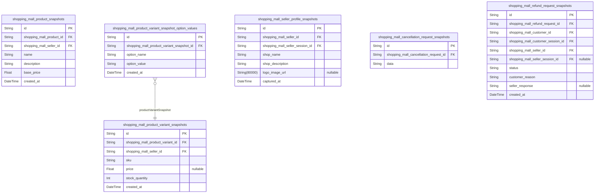

### `shopping_mall_product_snapshots`

Immutable records capturing the state of products before any modification
for audit and dispute resolution purposes.

This table maintains a complete history of all product modifications by
storing
the entire product state before each change. Each snapshot includes all core
product attributes, maintaining an exact copy of the product as it existed
at that moment in time for legal compliance and dispute resolution.

Snapshots are created automatically whenever a product is modified, ensuring
complete audit trail coverage. This enables reconstruction of any previous
product state and provides evidence for legal or business disputes.

All snapshots are retained indefinitely to satisfy legal and regulatory
requirements. They preserve business-critical information even after
products
are deleted, ensuring historical data availability for compliance purposes.

Properties as follows:

- `id`: Primary Key.
- `shopping_mall_product_id`
  > Reference to the product being snapshotted. {@link
  > shopping_mall_products.id}
- `shopping_mall_seller_id`
  > Reference to the seller who owned the product at time of snapshot. {@link
  > shopping_mall_sellers.id}
- `name`: Exact copy of the product name at time of snapshot.
- `description`: Exact copy of the product description at time of snapshot.
- `base_price`: Exact copy of the product's base price at time of snapshot.
- `created_at`
  > Timestamp when this snapshot was created, representing when the change
  > occurred.

### `shopping_mall_product_variant_snapshots`

Immutable records capturing the state of product variants (SKUs) before
any modification for inventory and pricing audit purposes.

This table maintains a comprehensive history of all product variant
changes, preserving the exact state of each variant at the time of
modification. It serves as a critical audit trail for inventory
management, pricing disputes, and financial compliance. Each snapshot is
created automatically whenever a product variant is modified, ensuring
complete traceability of all changes.

The snapshots include all essential variant attributes including SKU,
pricing information, stock levels, and option values. This enables
accurate reconstruction of historical states for dispute resolution and
compliance audits.

Properties as follows:

- `id`: Primary Key.
- `shopping_mall_product_variant_id`
  > The product variant that this snapshot represents. {@link
  > shopping_mall_product_variants.id}
- `shopping_mall_seller_id`
  > The seller who owned this product variant at the time of the snapshot.
  > [shopping_mall_sellers.id](#shopping_mall_sellers)
- `sku`
  > The unique SKU code that identifies this specific product variant. This
  > was the exact SKU used at the time of the snapshot.
- `price`
  > The price of this variant at the time of the snapshot. This value could
  > be the base product price or a variant-specific override price.
- `stock_quantity`
  > The stock quantity for this variant at the time of the snapshot. Records
  > the exact inventory level when this snapshot was created.
- `created_at`
  > Timestamp when this snapshot was created, indicating when the product
  > variant was modified.

### `shopping_mall_product_variant_snapshot_option_values`

Option values associated with a product variant snapshot, representing
the specific attributes (e.g., color, size) that define this variant at a
point in time.

This child table decomposes the potentially repeating groups of option
values that characterize a product variant. Each record represents one
option value (such as 'color: red' or 'size: large') that was part of the
variant configuration when the snapshot was taken. This structure ensures
First Normal Form compliance by eliminating repeating groups in the main
snapshot table.

The option values are preserved exactly as they existed when the snapshot
was created, enabling accurate historical reconstruction of variant
specifications.

Properties as follows:

- `id`: Primary Key.
- `shopping_mall_product_variant_snapshot_id`
  > The product variant snapshot that this option value belongs to. {@link
  > shopping_mall_product_variant_snapshots.id}
- `option_name`
  > The name of the option (e.g., 'color', 'size', 'material'). Represents
  > the attribute category.
- `option_value`
  > The value of the option (e.g., 'red', 'large', 'cotton'). Represents the
  > specific attribute selection.
- `created_at`
  > Timestamp when this option value record was created as part of the
  > snapshot.

### `shopping_mall_seller_profile_snapshots`

Immutable records capturing the state of seller profiles before any
modification for shop identity audit and verification purposes.

This table maintains a comprehensive history of all changes to seller
profiles, preserving the exact state of shop information at various
points in time. Each record represents a snapshot of the seller profile
immediately before a modification occurred, enabling complete audit
trails for dispute resolution, compliance verification, and historical
analysis.

The snapshots include all essential shop identity information as it
existed at the time of capture, along with metadata about when and by
whom the change was initiated. This immutable record system ensures that
even after profile modifications or account deletions, the historical
data remains accessible for business and legal purposes.

Properties as follows:

- `id`: Primary Key.
- `shopping_mall_seller_id`
  > The seller whose profile state is being captured in this snapshot. {@link
  > shopping_mall_sellers.id}
- `shopping_mall_seller_session_id`
  > The specific session through which the profile modification was
  > initiated. [shopping_mall_seller_sessions.id](#shopping_mall_seller_sessions)
- `shop_name`
  > The shop name as it existed at the time of this snapshot. This preserved
  > value allows for historical tracking of brand identity changes, which is
  > essential for customer recognition, dispute resolution, and maintaining
  > marketplace integrity.
- `shop_description`
  > The complete shop description at the time of this snapshot. This
  > preserved text enables understanding of how sellers presented their brand
  > story or value proposition over time, which can be crucial for customer
  > service and policy enforcement.
- `logo_image_url`
  > URL or path reference to the shop logo image as it appeared at the time
  > of this snapshot. Preserving this information helps maintain visual brand
  > continuity in historical records and provides evidence of brand
  > representation during specific time periods.
- `captured_at`
  > Timestamp when this snapshot was created, marking the exact moment before
  > the profile modification occurred. This immutable timestamp is critical
  > for chronological audit trails and establishing the sequence of profile
  > changes over time.

### `shopping_mall_cancellation_request_snapshots`

Immutable records capturing the state of cancellation requests and their
processing history for customer service audit and dispute resolution.

Properties as follows:

- `id`: Primary Key.
- `shopping_mall_cancellation_request_id`
  > Reference to the cancellation request this snapshot belongs to. {@link
  > shopping_mall_cancellation_requests.id}
- `data`
  > JSON blob containing the complete state of the cancellation request at
  > the time this snapshot was taken.

### `shopping_mall_refund_request_snapshots`

Immutable records capturing the state of refund requests and their
processing history for financial audit and dispute resolution.

This table maintains a comprehensive audit trail of all refund request
modifications, preserving the exact state at each point in time. Each
snapshot represents a point-in-time record that cannot be altered,
supporting legal compliance and dispute resolution processes. These
records are essential for maintaining financial accountability and
providing evidence in customer disputes.

Snapshots are created automatically whenever a refund request undergoes
any state change, ensuring complete traceability of the request
lifecycle. This includes initial submission, seller responses,
approval/rejection decisions, and final resolution. The table stores all
relevant contextual information to enable full reconstruction of events.

Properties as follows:

- `id`: Primary Key.
- `shopping_mall_refund_request_id`
  > Reference to the specific refund request being snapshotted. {@link
  > shopping_mall_refund_requests.id}
- `shopping_mall_customer_id`
  > Reference to the customer who initiated this refund request. {@link
  > shopping_mall_customers.id}
- `shopping_mall_customer_session_id`
  > Reference to the customer's session at the time of refund request. {@link
  > shopping_mall_customer_sessions.id}
- `shopping_mall_seller_id`
  > Reference to the seller associated with this refund request. {@link
  > shopping_mall_sellers.id}
- `shopping_mall_seller_session_id`
  > Reference to the seller's session associated with this refund request.
  > [shopping_mall_seller_sessions.id](#shopping_mall_seller_sessions)
- `status`
  > The current status of the refund request at the time of this snapshot.
  > Valid values include: 'REQUESTED', 'APPROVED', 'REJECTED'.
- `customer_reason`
  > The customer's reason for requesting the refund, as provided at the time
  > of this snapshot.
- `seller_response`
  > The seller's response to the refund request, if provided at the time of
  > this snapshot.
- `created_at`
  > The timestamp when this snapshot was created, capturing the exact moment
  > of the state change.
