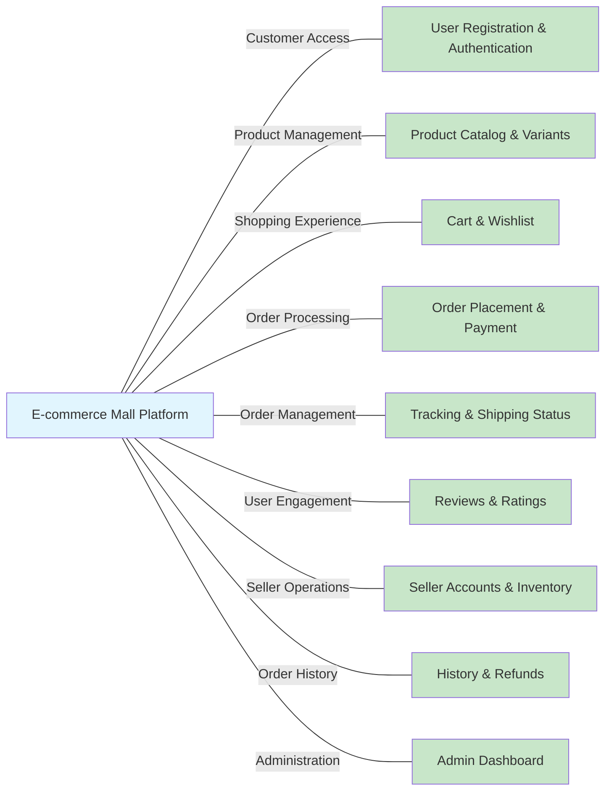

# E-commerce Shopping Mall Platform Requirements Analysis

## Business Model and Value Proposition

The e-commerce shopping mall platform exists to address the growing demand for comprehensive online marketplace solutions that connect multiple sellers with customers in a single, unified shopping experience. Today's consumers expect diverse product selections, competitive pricing, and streamlined purchasing processes, while sellers require accessible platforms to showcase their products without the overhead of building individual storefronts. This platform bridges that gap by providing a scalable, multi-vendor marketplace that benefits both consumers and merchants.

### Revenue Strategy

The platform employs a multi-faceted revenue model designed to generate sustainable income from various touchpoints:

1. **Commission Fees**: The primary revenue stream comes from transaction fees ranging from 5-15% on each sale, depending on product category and seller tier. This percentage-based model aligns incentives with sellers, as higher sales volume benefits both parties.

2. **Subscription Fees**: Monthly subscription plans for sellers ranging from $29 to $199 per month based on features and selling limits. Higher-tier plans include premium placement, advanced analytics, and promotional tools.

3. **Featured Placement**: Pay-per-click advertising and promoted product listings allowing sellers to boost visibility for $0.10-$2.00 per click, with recommended products appearing prominently in search results and category pages.

4. **Value-Added Services**: Additional fee-based services including premium customer support ($49/month), advanced analytics dashboards ($29/month), and fulfillment services with percentage-based markup on shipping costs.

5. **Partnership Revenue**: Integration fees with payment processors, shipping providers, and third-party logistics companies, typically 1-3% of transaction volume processed through these partnerships.

## User Actor Requirements

### Customer (Registered User)

THE customer SHALL be a registered user of the platform with capabilities to browse products, search for items, manage a shopping cart and wishlist, place orders, track shipments, submit reviews, view order history, and request cancellations or refunds.

THE customer SHALL be able to create and manage multiple shipping addresses associated with their account.

THE customer SHALL be able to update their personal profile information including contact details and password.

### Seller (Vendor)

THE seller SHALL be an authorized vendor account with the ability to manage their own product catalog, define product variants, manage inventory levels, view and update order status, access sales reports, respond to customer reviews, and update their business profile.

THE seller SHALL be able to create new product listings with complete details including categories, descriptions, pricing, images, and variants.

THE seller SHALL be able to manage inventory levels for each product variant.

### Admin (System Administrator)

THE admin SHALL have full system access to manage all platform functions including user account management, product category administration, order oversight, payment method configuration, system reporting, promotional campaign management, and platform configuration.

THE admin SHALL be able to moderate user reviews and handle policy violations.

## Product Catalog and Search Requirements

### Category Management

WHEN a customer navigates the site, THE system SHALL display a hierarchical category structure organized by product types to help users find relevant products efficiently.

THE system SHALL support unlimited nesting levels for categories to accommodate complex product hierarchies.

THE system SHALL display a maximum of 10 top-level categories in the main navigation menu.

WHEN an admin creates a new category, THE system SHALL store the category with attributes including unique identifier, name, description, parent category reference, slug for URL construction, display order, and active status.

### Product Search and Filtering

WHEN a customer enters search terms, THE system SHALL search across product titles, descriptions, tags, brands, SKUs, and categories.

THE system SHALL implement full-text search capabilities with relevance scoring to prioritize matches.

WHEN a customer views a category or search results, THE system SHALL provide filter options including price range, brand selection, product rating, availability status, features, colors, and sizes.

THE system SHALL allow customers to sort products by relevance, price (low to high), price (high to low), newest arrivals, customer rating, and best sellers.

## Product Variant and Inventory Management Requirements

### SKU Management

WHEN a seller creates a new product, THE system SHALL generate a unique SKU identifier for each distinct product variant.

THE system SHALL ensure that each SKU identifier is globally unique within the platform.

THE system SHALL generate SKU identifiers using alphanumeric characters between 6 and 32 characters in length.

### Variant Attributes

THE system SHALL support color variations for products with predefined color names.

THE system SHALL support standard size classifications (XS, S, M, L, XL, XXL) and numeric sizing for products like shoes.

THE system SHALL support material variant specifications and allow sellers to define custom variant attributes.

### Inventory Tracking

WHEN a product variant is created, THE system SHALL initialize stock levels to zero by default.

THE system SHALL require sellers to specify initial stock quantities for each SKU.

WHEN inventory is added, THE system SHALL update stock levels in real-time.

WHEN a product is purchased, THE system SHALL immediately decrement the corresponding SKU stock level.

THE system SHALL maintain real-time inventory counts with 100% accuracy.

## Shopping Experience Requirements

### Shopping Cart Functionality

WHEN a customer adds a product to their cart, THE system SHALL create or update the cart item with the specified quantity.

THE system SHALL preserve cart contents for authenticated customers across sessions for a period of 30 days.

WHEN a customer updates the quantity of an item in their cart, THE system SHALL recalculate the total cart value and update inventory availability indicators.

THE system SHALL display the following information for each cart item: Product name and image, selected variants, unit price, total price for the item, and available quantity in stock.

THE system SHALL display cart summary information including subtotal, applicable taxes, shipping costs, applied discounts, and order total.

### Wishlist Management

WHEN a customer adds a product to their wishlist, THE system SHALL save the product reference along with selected variants.

THE system SHALL allow customers to create multiple wishlists with privacy settings.

THE system SHALL allow customers to add items from their wishlist directly to their shopping cart.

THE system SHALL notify customers when wishlist items go on sale or become unavailable.

## Order Processing and Payment Requirements

### Order Creation Process

WHEN a customer initiates checkout from their shopping cart, THE system SHALL create a new order with a unique order identifier in format ORD-YYYYMMDD-NNNN.

THE system SHALL validate that all items in the shopping cart exist and are available for purchase before order creation.

THE system SHALL calculate the total order amount including product prices, taxes, shipping costs, and applicable discounts.

### Payment Integration

THE system SHALL support payment methods including credit/debit cards, digital wallets (PayPal, Apple Pay, Google Pay), and bank transfers.

THE system SHALL integrate with a payment gateway provider that supports secure payment processing and PCI compliance.

THE system SHALL NOT store sensitive payment information such as credit card numbers or CVV codes.

IF payment is successfully authorized, THEN THE system SHALL mark order status as "confirmed", send order confirmation email, reserve inventory, and generate shipping label.

IF payment is declined, THEN THE system SHALL mark order status as "payment_failed", notify customer, and allow retry with different method.

## Order Tracking and Shipping Requirements

### Shipment Tracking

WHEN a customer places an order, THE system SHALL generate a unique tracking identifier for the shipment.

THE system SHALL provide real-time tracking information for all active orders.

THE system SHALL display tracking information in a chronological timeline format with timestamp, location, and description for each event.

WHEN a tracking event occurs, THE system SHALL update the tracking status within 30 minutes of the event.

### Status Updates

WHEN an order is confirmed, THE system SHALL set the initial status to "Processing".

WHEN an order is shipped, THE system SHALL update the status to "Shipped" and generate tracking information.

THE system SHALL automatically update order status based on tracking events from carriers.

WHEN a package is delivered successfully, THE system SHALL update the status to "Delivered".

## User Review and Rating System Requirements

### Review Submission

WHEN a customer purchases a product, THE system SHALL allow that customer to submit one review per product variant they have purchased.

THE system SHALL require customers to provide a star rating between 1 and 5 when submitting a review.

THE system SHALL allow customers to include written review text with minimum length of 10 characters and maximum length of 2000 characters.

THE system SHALL allow customers to upload up to 5 photos with each review.

### Rating System

THE system SHALL calculate product ratings based on average of all submitted star ratings for that product.

THE system SHALL display average product rating with both numerical value and visual star representation.

THE system SHALL show total number of reviews next to the average rating.

THE system SHALL update product ratings in real-time when new reviews are submitted.

### Review Moderation

THE system SHALL automatically flag reviews containing profanity or inappropriate language for moderation review.

THE system SHALL prevent submission of reviews with more than 5 identical consecutive characters.

THE system SHALL provide admin users with a moderation dashboard to review flagged content.

THE system SHALL allow admins to approve, reject, or request revision of flagged reviews.

## Seller Management System Requirements

### Seller Registration

WHEN a user submits a seller registration request with business information, THE system SHALL validate the provided information and create a pending seller account for approval.

THE system SHALL require administrator approval for all new seller accounts before they can list products.

THE system SHALL collect information during seller registration including business legal name, registration number, contact information, business address, tax ID, bank account information, and intended product categories.

### Product Management

WHEN a seller creates a new product listing, THE system SHALL require information including title, description, category assignment, base price, variants, images, inventory quantities, and shipping dimensions.

THE system SHALL allow sellers to define multiple variants for their products based on attributes such as color, size, material, and style.

THE system SHALL enable sellers to set different prices and inventory levels for each product variant.

THE system SHALL support product statuses that sellers can manage: Active, Draft, and Archived.

### Sales Reporting

THE system SHALL provide sellers with a sales dashboard showing revenue summaries, order volume statistics, top selling products, and sales trends.

THE system SHALL allow sellers to view detailed information about orders containing their products.

THE system SHALL provide sellers with monthly financial summaries including total sales revenue, platform fees, and net earnings.

## Order History and Cancellation/Refund Requirements

### Order History Display

WHEN a customer navigates to their account dashboard, THE system SHALL display a chronological list of their past orders with basic information including order number, date, total amount, and current status.

WHEN a customer selects a specific order from their history, THE system SHALL present detailed order information including items, addresses, shipping method, tax information, and payment method.

THE system SHALL allow customers to filter their order history by date range and status.

### Cancellation Request Process

WHEN a customer requests to cancel an order, THE system SHALL only permit cancellation if the order status is "Pending" or "Confirmed" and shipping has not yet been initiated.

WHEN a customer submits a cancellation request for an eligible order, THE system SHALL change the order status to "Cancellation Requested", send confirmation email, and suspend further processing.

THE system SHALL allow administrators to either approve or deny cancellation requests.

IF the administrator approves the cancellation, THEN THE system SHALL change the order status to "Cancelled", initiate the refund process, send confirmation to the customer, and adjust inventory levels.

### Refund Processing

THE system SHALL process refunds for cancelled orders, returned items that pass quality inspection, damaged items, and cases where the wrong item was shipped.

WHEN processing a refund, THE system SHALL determine the refund amount based on original product pricing, applied discounts, shipping costs, and taxes paid.

THE system SHALL issue refunds using the original payment method whenever possible.

WHEN a refund is approved, THE system SHALL notify the customer via email with confirmation and estimated timeframe for refund to appear in their account.

## Admin Dashboard and System Management Requirements

### Order Management

WHEN an administrator accesses the dashboard, THE system SHALL display a summary of recent orders including total orders in the last 24 hours, pending orders, orders with shipping issues, and revenue generated.

THE system SHALL allow administrators to search and filter orders by ID, customer, date range, status, payment status, shipping carrier, and product.

THE system SHALL allow administrators to update order status, add tracking numbers, send status notifications, cancel orders, and add notes to order history.

### Product Administration

THE system SHALL allow administrators to view, search, and filter all products in the catalog.

THE system SHALL allow administrators to create and edit product information, modify pricing, manage inventory, adjust SEO settings, and deactivate/reactivate products.

THE system SHALL support bulk operations including price updates, inventory adjustments, status changes, and product deletions.

### User Management

THE system SHALL provide a comprehensive user directory that allows administrators to view, search, and filter users by account status.

THE system SHALL allow administrators to activate/deactivate user accounts, reset passwords, update contact information, and suspend accounts for policy violations.

THE system SHALL provide specific tools for managing seller accounts including approval/rejection of applications, performance monitoring, and account suspension/termination.

### System Monitoring

THE system SHALL display real-time system health indicators including server uptime, database performance, API response times, active sessions, and error rates.

THE system SHALL maintain detailed logs of administrative actions, user account modifications, product changes, order status modifications, and security events.

THE system SHALL allow administrators to configure site-wide settings, manage payment gateways, update shipping options, configure tax settings, and manage promotional discounts.

## Security and Compliance Requirements

### Authentication and Authorization

WHEN a guest user initiates account registration, THE system SHALL collect email address, password, and basic profile information.

WHEN a user submits registration information, THE system SHALL validate that the email address is properly formatted and not already registered.

WHEN a user successfully registers, THE system SHALL send a verification email to the provided address.

THE system SHALL use JSON Web Tokens (JWT) for authentication and authorization with 30-minute access tokens and 30-day refresh tokens.

THE system SHALL store JWT tokens in httpOnly cookies with secure flags for enhanced security.

### Data Protection

THE system SHALL maintain 99.9% uptime for catalog browsing and search functionality.

THE system SHALL encrypt all sensitive session data both in transit and at rest.

THE system SHALL implement rate limiting on authentication attempts to prevent brute force attacks.

THE system SHALL log all authentication events including successful logins, failed attempts, and logout events.

## Performance and Scalability Requirements

WHEN a customer navigates to any product listing page, THE system SHALL load and display content within 1.5 seconds under normal conditions.

WHEN filtering or sorting is applied, THE system SHALL update the product listing within 500 milliseconds.

THE system SHALL process payments and confirm orders within 5 seconds under normal conditions.

THE system SHALL support peak order processing volume of 1000 orders per hour.

THE system SHALL maintain 99.9% uptime for order processing functionality.

THE system SHALL support at least 10,000 concurrent users with no degradation in shopping experience performance.

## Integration and Future Considerations

THE product catalog system SHALL integrate with the product variants module to display available options and pricing variations.

THE system SHALL connect to the user reviews module to display average ratings and review counts.

THE system SHALL interface with the search infrastructure to provide updated index data when products or categories are modified.

WHERE the platform supports multiple warehouses, THE system SHALL track inventory separately for each location.

THE system SHALL be architected to support multilingual product information when expanding to international markets.



```mermaid
graph LR
  A["Customer Browses Products"] 
  B["View Product Detail"]
  C["Select Variants"]
  D{"Add to Cart or Wishlist?"}
  E["Add to Cart"]
  F["Add to Wishlist"]
  G["View Cart"]
  H["Proceed to Checkout"]
  I["View Wishlist"]
  J["Move Item to Cart"]
  
  A -- "Browse"  B
  B -- "Select"  C
  C -- "Configure"  D
  D -- "Cart"  E
  D -- "Wishlist"  F
  E -- "Continue"  G
  G -- "Checkout"  H
  F -- "Save"  I
  I -- "Later Purchase"  J
  J -- "Add"  G
```