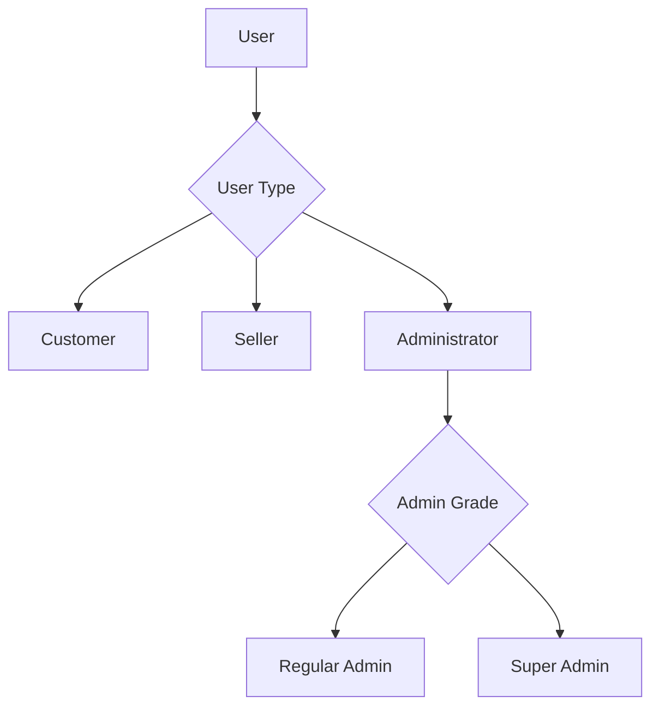
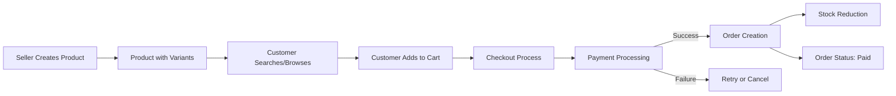
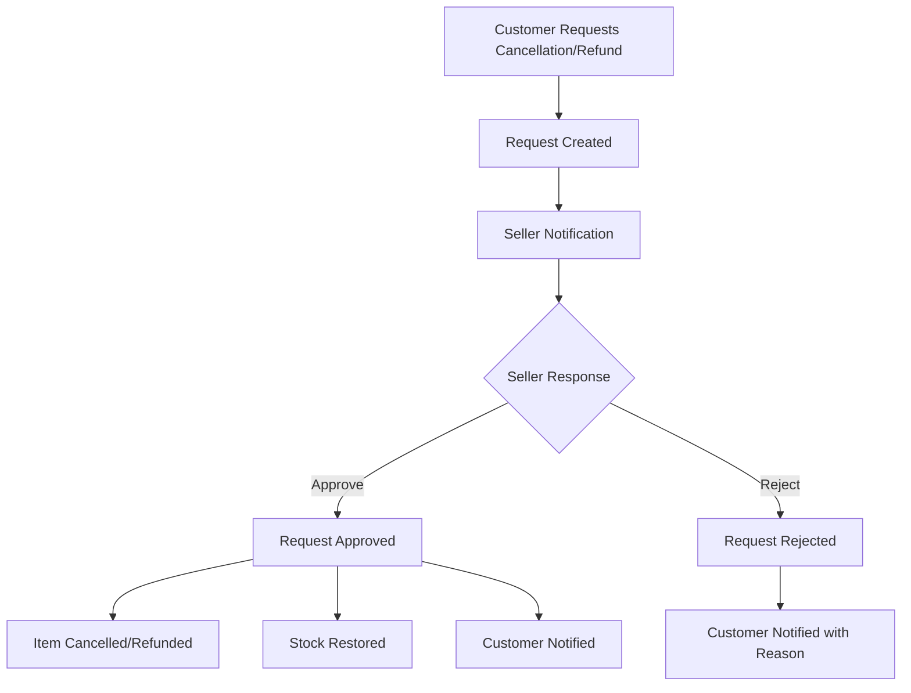
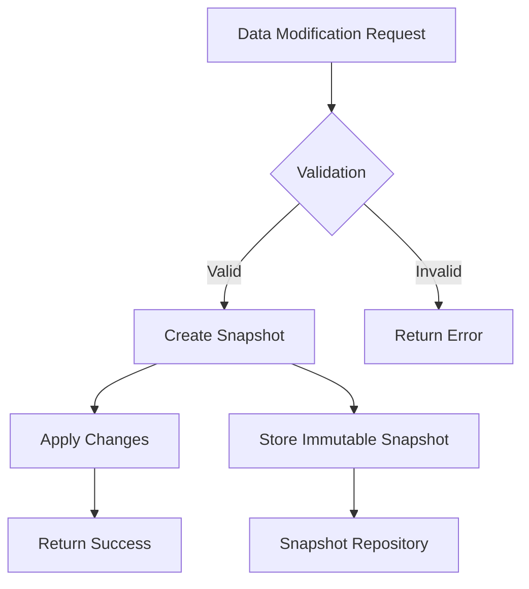

# E-Commerce Shopping Mall Platform Requirements Specification

## 1. Introduction and Overview

### 1.1 Purpose
The purpose of this document is to provide a comprehensive specification for the E-Commerce Shopping Mall Platform. This platform is a multi-vendor marketplace that connects customers with sellers in a secure, regulated environment. The system requires registration for all users and implements a robust snapshot system to maintain data integrity for legal and dispute resolution purposes.

### 1.2 Scope
This requirements specification covers all aspects of the platform including user management, product management, order processing, inventory management, payment processing, shipping and tracking, cancellation and refund processes, review systems, seller dashboards, administrative functions, and data snapshot mechanisms.

### 1.3 Definitions, Acronyms, and Abbreviations
- **SKU**: Stock Keeping Unit - A unique identifier for product variants
- **Snapshot**: An immutable record of data state at a specific point in time
- **EARS**: Evidence, Attribute, Response, Statement - A format for writing requirements
- **JWT**: JSON Web Token - A standard for creating tokens that assert claims
- **GMV**: Gross Merchandise Value - The total value of goods sold through the platform

### 1.4 References
- IEEE Std 830-1998: IEEE Recommended Practice for Software Requirements Specifications
- OWASP Application Security Verification Standard 4.0
- PCI DSS v3.2.1: Payment Card Industry Data Security Standard

### 1.5 Overview of the Document
This document is organized into twelve main sections, each covering a specific aspect of the platform functionality. Each section includes detailed requirements written in EARS format where applicable, along with supporting information about workflows, constraints, and business rules.

## 2. Overall Description

### 2.1 Product Perspective
The E-Commerce Shopping Mall Platform is a web-based application that serves three primary user types:
1. **Customers**: Registered users who browse, purchase, and review products
2. **Sellers**: Registered merchants who create products, manage inventory, and process orders
3. **Administrators**: Platform managers who oversee operations and enforce policies

The platform integrates with external payment gateways, shipping carriers, and potentially third-party review systems. Data snapshots are maintained for legal compliance and dispute resolution.

### 2.2 Product Functions

#### 2.2.1 User Management
- Customer registration, authentication, and account management
- Seller registration, approval workflow, and account management
- Administrative user management and role-based access control

#### 2.2.2 Product Management
- Product creation, editing, and deletion with snapshot preservation
- Category and subcategory organization
- Product search and filtering capabilities

#### 2.2.3 Shopping and Order Management
- Wishlist functionality
- Shopping cart operations
- Checkout process with payment integration
- Order creation and status management

#### 2.2.4 Inventory Management
- Product variant (SKU) management
- Stock level tracking and inventory history
- Automatic stock adjustments for orders and returns

#### 2.2.5 Payment Processing
- Integration with external payment gateways
- Secure transaction processing
- Order fulfillment upon payment confirmation

#### 2.2.6 Shipping and Tracking
- Seller shipment creation and tracking information management
- Customer delivery confirmation
- Automatic delivery handling after shipment

#### 2.2.7 Cancellation and Refund Management
- Customer cancellation request submission
- Seller approval/rejection of cancellation requests
- Customer refund request submission and processing

#### 2.2.8 Review and Rating System
- Customer product review submission
- Review editing and deletion capabilities
- Product rating calculation and display

#### 2.2.9 Seller Dashboard
- Shop performance metrics and analytics
- Order management interface
- Cancellation and refund request handling

#### 2.2.10 Administrative Functions
- Seller registration approval
- Category and product oversight
- User account management
- Platform-wide order monitoring and intervention

#### 2.2.11 Data Snapshots
- Immutable record creation for all data modifications
- Audit trail maintenance for compliance and dispute resolution
- Snapshot accessibility for authorized users

### 2.3 User Characteristics

#### 2.3.1 Customer
- Must be registered to access any platform features
- Seeks to browse, purchase, and review products
- Manages personal information, addresses, and orders

#### 2.3.2 Seller
- Must be registered and approved by administrators
- Creates and manages product listings
- Processes orders, manages inventory, and handles customer requests

#### 2.3.3 Administrator
- Manages platform operations
- Approves sellers and oversees product listings
- Handles disputes and enforces policies

### 2.4 Constraints
- All users must register to access platform features
- Immutable data snapshots must be created for all modifications
- Payment processing must integrate with external gateways
- Multi-vendor orders require separate shipping by each seller
- Cancellation and refund requests must follow specific workflows

### 2.5 Assumptions and Dependencies
- Reliable internet connectivity for all users
- Availability of external payment gateway services
- Integration with shipping carrier tracking systems
- Compliance with applicable data privacy regulations (GDPR, CCPA)

## 3. Specific Requirements

### 3.1 External Interface Requirements

#### 3.1.1 User Interfaces
The platform will provide web-based interfaces for all user types:
- Customer portal with product browsing, cart management, and order tracking
- Seller dashboard with inventory management, order processing, and analytics
- Administrative interface for platform oversight and user management

#### 3.1.2 Hardware Interfaces
The system will operate on standard web browsers and does not require specific hardware interfaces.

#### 3.1.3 Software Interfaces
- Payment gateway API integration (e.g., Stripe, PayPal)
- Shipping carrier tracking API integration (e.g., UPS, FedEx)
- Email service integration for notifications
- Database management system interface

#### 3.1.4 Communication Interfaces
- HTTPS for secure web communication
- RESTful APIs for integration with external services
- WebSocket connections for real-time notifications

### 3.2 Functional Requirements

#### 3.2.1 User Registration and Authentication

##### 3.2.1.1 Customer Registration
WHEN a guest attempts to register as a customer, THE system SHALL require an email address and password.

WHEN a customer submits registration information, THE system SHALL validate the email format and password strength.

WHEN a customer registration is successful, THE system SHALL create an account with default status and send a verification email.

##### 3.2.1.2 Customer Authentication
WHEN a customer attempts to log in, THE system SHALL authenticate using the provided email and password.

WHEN a customer successfully authenticates, THE system SHALL generate JWT tokens for session management.

WHEN a customer requests a password change, THE system SHALL validate the current password before allowing changes.

WHEN a customer requests account deletion, THE system SHALL:
- Preserve order history for legal and seller purposes
- Preserve reviews but display them as authored by "deleted user"
- Remove personal profile information
- Revoke authentication capabilities

##### 3.2.1.3 Seller Registration
WHEN a user attempts to register as a seller, THE system SHALL require email, password, shop name, and shop description.

WHEN a seller submits registration information, THE system SHALL validate all required fields.

WHEN a seller registration is submitted, THE system SHALL set the approval status to "pending".

##### 3.2.1.4 Seller Authentication and Approval
WHEN a seller attempts to log in, THE system SHALL authenticate using the provided email and password.

WHEN a seller logs in with pending approval status, THE system SHALL restrict access to selling functions.

WHEN an administrator approves a seller, THE system SHALL update the seller's status to "approved".

WHEN an administrator rejects a seller, THE system SHALL update the seller's status to "rejected" and provide a reason.

WHEN a rejected seller submits a new registration, THE system SHALL treat it as a fresh application.

##### 3.2.1.5 Seller Account Management
WHEN a seller requests account deletion, THE system SHALL verify that:
- No items have "paid" or "shipped" status
- No cancellation or refund requests are pending

WHEN a seller account deletion criteria are met, THE system SHALL:
- Remove products from active listings
- Preserve order history and snapshots
- Preserve shop name in past orders
- Revoke authentication capabilities

##### 3.2.1.6 Administrator Authentication
WHEN an administrator attempts to log in, THE system SHALL authenticate with appropriate credentials.

WHEN a user requests administrator privileges, THE system SHALL store the request with justification.

WHEN a super administrator approves an administrator request, THE system SHALL grant regular administrator privileges.

#### 3.2.2 Product and Category Management

##### 3.2.2.1 Product Creation
WHEN a seller creates a product, THE system SHALL require:
- Name (1-255 characters)
- Description (1-5000 characters)
- Category selection
- Base price (positive decimal)

WHEN a seller successfully creates a product, THE system SHALL associate it with the creating seller.

##### 3.2.2.2 Product Modification
WHEN a seller edits a product, THE system SHALL create a snapshot of the previous state.

WHEN a seller deletes a product, THE system SHALL:
- Verify no pending orders exist for any variant
- Verify no pending cancellation or refund requests exist
- Remove the product from listings
- Delete all variants and inventory records
- Preserve snapshots for audit purposes

##### 3.2.2.3 Product Images
WHEN a seller uploads images to a product, THE system SHALL:
- Accept JPG, PNG, and GIF formats
- Limit file size to 5MB per image
- Allow image reordering
- Generate thumbnails

WHEN a seller deletes a product image, THE system SHALL remove that image from the product listing.

##### 3.2.2.4 Product Variants (SKU)
WHEN a seller creates a product variant, THE system SHALL require:
- SKU code (unique identifier)
- Option values (e.g., color: "Red", size: "Large")
- Price (optional override of base price)
- Stock quantity (defaults to 0)

WHEN a seller edits a variant, THE system SHALL create a snapshot of the previous state.

WHEN a seller deletes a variant, THE system SHALL verify that:
- No items have "paid" or "shipped" status
- No cancellation or refund requests are pending

WHEN a product has no variants, THE system SHALL display it as "unavailable" for purchase.

##### 3.2.2.5 Category Management
WHEN an administrator creates a category, THE system SHALL require a name (1-100 characters) and description (1-1000 characters).

WHEN an administrator creates a subcategory, THE system SHALL limit nesting to one level only.

WHEN an administrator deletes a category, THE system SHALL reclassify all products in that category as "uncategorized".

WHEN a customer views categories, THE system SHALL display all top-level categories and their subcategories.

##### 3.2.2.6 Product Search and Filtering
WHEN a customer searches for products, THE system SHALL return results from all sellers.

WHEN a customer filters search results, THE system SHALL support filtering by:
- Category
- Price range
- In-stock status

WHEN a customer sorts search results, THE system SHALL support sorting by:
- Newest first
- Price (low to high)
- Price (high to low)

#### 3.2.3 Shopping and Order Management

##### 3.2.3.1 Wishlist Management
WHEN a customer adds a product to their wishlist, THE system SHALL associate that product with the customer.

WHEN a seller deletes a product, THE system SHALL automatically remove it from all wishlists.

##### 3.2.3.2 Shopping Cart Operations
WHEN a customer adds a variant to their cart, THE system SHALL:
- Verify stock availability
- Combine quantities for duplicate variants
- Store the variant with specified quantity

WHEN a customer modifies cart item quantity, THE system SHALL validate against available stock.

WHEN a customer removes an item from their cart, THE system SHALL remove that item immediately.

##### 3.2.3.3 Checkout Process
WHEN a customer proceeds to checkout, THE system SHALL:
- Verify all items are available
- Display order summary
- Allow selection of shipping address

WHEN a customer confirms an order, THE system SHALL process payment through an external gateway.

WHEN payment succeeds, THE system SHALL:
- Create order record
- Generate order items with "paid" status
- Create snapshots of products, variants, and seller profiles
- Decrease stock quantities
- Remove items from cart

WHEN payment fails, THE system SHALL preserve the cart and notify the customer.

#### 3.2.4 Inventory Management

##### 3.2.4.1 Inventory Tracking
WHEN inventory is modified, THE system SHALL create inventory history records with:
- Quantity change (positive or negative)
- Reason for change
- Timestamp

WHEN calculating current stock, THE system SHALL sum all inventory history records.

##### 3.2.4.2 Inventory Adjustments
WHEN a seller adds inventory, THE system SHALL create a positive inventory record with reason.

WHEN a seller subtracts inventory, THE system SHALL create a negative inventory record with reason.

WHEN an order is placed, THE system SHALL automatically create negative inventory records.

WHEN an order is cancelled or refunded, THE system SHALL automatically create positive inventory records.

##### 3.2.4.3 Out of Stock Handling
WHEN a variant's stock reaches zero, THE system SHALL mark it as "out of stock".

WHEN a customer attempts to add an out-of-stock variant to cart, THE system SHALL reject the request.

#### 3.2.5 Payment Processing

##### 3.2.5.1 Payment Integration
WHEN processing a payment, THE system SHALL integrate with external payment gateways.

WHEN a payment is submitted, THE system SHALL include total amount, billing information, and return URLs.

##### 3.2.5.2 Payment Security
WHEN transmitting payment information, THE system SHALL use encrypted connections (HTTPS/TLS).

THE system SHALL NOT store sensitive payment card data.

##### 3.2.5.3 Payment Outcomes
WHEN a payment succeeds, THE system SHALL complete order creation and associated processes.

WHEN a payment fails, THE system SHALL preserve cart contents and provide failure notification.

#### 3.2.6 Shipping and Tracking

##### 3.2.6.1 Shipment Creation
WHEN a seller creates a shipment, THE system SHALL:
- Verify all items belong to the same seller
- Accept carrier name and tracking number
- Update item statuses to "shipped"

##### 3.2.6.2 Delivery Confirmation
WHEN a customer confirms delivery, THE system SHALL update all items in that shipment to "delivered".

WHEN 14 days pass since shipping without customer confirmation, THE system SHALL automatically mark items as "delivered".

#### 3.2.7 Cancellation and Refund Management

##### 3.2.7.1 Cancellation Requests
WHEN a customer submits a cancellation request, THE system SHALL:
- Verify item status is "paid"
- Create request record with reason
- Create snapshot of request
- Update item status to "cancellation requested"
- Notify the seller

WHEN a seller approves a cancellation, THE system SHALL:
- Update request status to "approved"
- Create snapshot of approval
- Update item status to "cancelled"
- Process refund
- Restore stock
- Notify customer

WHEN a seller rejects a cancellation, THE system SHALL:
- Require rejection reason
- Update request status to "rejected"
- Create snapshot of rejection
- Update item status to "paid"
- Notify customer with reason

##### 3.2.7.2 Refund Requests
WHEN a customer submits a refund request, THE system SHALL:
- Verify item status is "delivered"
- Verify request is within 7 days of delivery
- Create request record with reason
- Create snapshot of request
- Update item status to "refund requested"
- Notify the seller

WHEN a seller approves a refund, THE system SHALL:
- Update request status to "approved"
- Create snapshot of approval
- Update item status to "refunded"
- Process refund
- Restore stock
- Notify customer

WHEN a seller rejects a refund, THE system SHALL:
- Require rejection reason
- Update request status to "rejected"
- Create snapshot of rejection
- Update item status to "delivered"
- Notify customer with reason

#### 3.2.8 Review and Rating System

##### 3.2.8.1 Review Creation
WHEN a customer submits a review, THE system SHALL:
- Verify customer purchased the product
- Verify item status is "delivered"
- Verify no existing review for this product/order combination
- Validate rating is between 1-5 stars

WHEN a review is successfully submitted, THE system SHALL:
- Create review record
- Update product's average rating
- Update product's review count

##### 3.2.8.2 Review Management
WHEN a customer edits a review, THE system SHALL:
- Create snapshot of previous review state
- Update review with new content
- Update product's average rating

WHEN a customer deletes a review, THE system SHALL:
- Mark review as deleted
- Display as from "deleted user"
- Preserve snapshots
- Update product's average rating

WHEN a customer account is deleted, THE system SHALL preserve all reviews but display them as from "deleted user".

#### 3.2.9 Seller Dashboard

##### 3.2.9.1 Dashboard Metrics
WHEN a seller accesses the dashboard, THE system SHALL display:
- Total number of products
- Total number of order items
- Number of pending cancellation requests
- Number of pending refund requests

##### 3.2.9.2 Order Management
WHEN a seller views order items, THE system SHALL allow filtering by status.

WHEN a seller views an order item detail, THE system SHALL display:
- Product and variant snapshot
- Shipping address
- Order date and number
- Quantity and price
- Status with history
- Shipment tracking information
- Related requests

#### 3.2.10 Administrative Functions

##### 3.2.10.1 Seller Management
WHEN an administrator reviews seller registrations, THE system SHALL display pending applications.

WHEN an administrator approves a seller, THE system SHALL enable selling capabilities.

WHEN an administrator rejects a seller, THE system SHALL require a rejection reason.

WHEN an administrator suspends a seller, THE system SHALL:
- Hide products from listings
- Prevent new product creation
- Allow processing of existing orders

##### 3.2.10.2 Category Management
WHEN an administrator manages categories, THE system SHALL allow:
- Creation of new categories and subcategories
- Editing of category names and descriptions
- Deletion of categories

##### 3.2.10.3 Platform Oversight
WHEN an administrator views products, THE system SHALL display all platform products.

WHEN an administrator deletes a product, THE system SHALL remove it for policy violations.

WHEN an administrator views orders, THE system SHALL display all platform orders.

WHEN an administrator forces cancellation, THE system SHALL process refund and restore stock.

##### 3.2.10.4 User Management
WHEN an administrator manages users, THE system SHALL allow:
- Viewing of all customer accounts
- Banning and unbanning customers
- Viewing of all seller accounts
- Banning and unbanning sellers

#### 3.2.11 Data Snapshots

##### 3.2.11.1 Snapshot Creation
WHEN editable data is modified, THE system SHALL create snapshots of the previous state.

WHEN snapshots are created, THE system SHALL record:
- Timestamp of change
- What was changed
- Values before and after

##### 3.2.11.2 Snapshot Content
THE system SHALL create snapshots for modifications to:
- Products and variants
- Seller profiles
- Order items
- Reviews
- Cancellation and refund requests

##### 3.2.11.3 Snapshot Access
WHEN authorized users access snapshots, THE system SHALL provide:
- Data owners with access to their snapshots
- Administrators with access to any snapshots
- Relevant parties for dispute resolution

### 3.3 Non-Functional Requirements

#### 3.3.1 Performance Requirements
WHEN processing user requests, THE system SHALL respond within 2 seconds under normal load.

WHEN generating dashboard metrics, THE system SHALL complete within 10 seconds.

WHEN handling payment processing, THE system SHALL maintain uptime of 99.9%.

#### 3.3.2 Security Requirements
WHEN storing passwords, THE system SHALL use industry-standard hashing algorithms.

WHEN transmitting data, THE system SHALL encrypt all communications with TLS.

THE system SHALL implement rate limiting to prevent brute force attacks.

THE system SHALL comply with PCI DSS for payment data handling.

#### 3.3.3 Reliability Requirements
THE system SHALL maintain 99.9% uptime excluding scheduled maintenance.

WHEN system failures occur, THE system SHALL automatically recover critical transactions.

THE system SHALL maintain data backups in geographically distributed locations.

#### 3.3.4 Usability Requirements
THE system SHALL provide intuitive interfaces for all user types.

WHEN users encounter errors, THE system SHALL display clear, actionable error messages.

THE system SHALL support major web browsers including Chrome, Firefox, Safari, and Edge.

#### 3.3.5 Compliance Requirements
THE system SHALL comply with GDPR for data privacy in European jurisdictions.

THE system SHALL comply with CCPA for data privacy in California.

THE system SHALL maintain audit trails for 7 years for legal compliance.

### 3.4 Business Rules

#### 3.4.1 Registration and Authentication Business Rules
1. All platform access requires user registration
2. Email addresses must be unique across all user types
3. Passwords must meet strength requirements
4. Seller accounts require administrative approval before selling
5. Accounts with pending obligations cannot be deleted

#### 3.4.2 Product and Order Business Rules
1. Products must have at least one variant to be purchasable
2. Product modifications create immutable snapshots
3. Orders can contain items from multiple sellers
4. Sellers ship separately for their items
5. Stock is automatically adjusted for orders and returns

#### 3.4.3 Cancellation and Refund Business Rules
1. Cancellations only allowed for "paid" items
2. Refunds only allowed for "delivered" items within 7 days
3. Seller response required for all requests
4. Unresponded requests auto-approved after 7 days
5. Stock restored upon approval of cancellations or refunds

#### 3.4.4 Administrative Business Rules
1. Only administrators can create/modify categories
2. Super administrators can manage other administrators
3. Suspended sellers cannot create or modify products
4. Deleted categories reclassify products as "uncategorized"
5. All administrative actions are logged for audit purposes

### 3.5 Quality Attributes

#### 3.5.1 Scalability
THE system SHALL support horizontal scaling to accommodate growing user base.

THE system SHALL handle traffic spikes during promotional events.

#### 3.5.2 Maintainability
THE system SHALL follow modular architecture principles.

THE system SHALL provide comprehensive logging for troubleshooting.

#### 3.5.3 Portability
THE system SHALL be deployable across multiple cloud environments.

### 3.6 Design Constraints

#### 3.6.1 Technical Constraints
1. Backend must be built with TypeScript and NestJS
2. Database must use Prisma ORM
3. Frontend framework choice is unrestricted
4. Mobile responsiveness is required

#### 3.6.2 Business Constraints
1. All data modifications must create snapshots
2. Payment processing must use external gateways
3. Multi-vendor orders require separate shipping
4. Legal compliance requires 7-year data retention

### 3.7 Interfaces

#### 3.7.1 API Endpoints
The system will provide RESTful APIs for all core functionalities:
- User management endpoints (registration, authentication, profile)
- Product management endpoints (CRUD operations, search, filtering)
- Order management endpoints (cart, checkout, order tracking)
- Inventory management endpoints (stock levels, adjustments)
- Review management endpoints (creation, modification)
- Administrative endpoints (user management, oversight)

#### 3.7.2 Data Formats
- JSON for API request and response bodies
- ISO 8601 format for timestamps
- Standard email format for email addresses
- UUIDs for entity identifiers

### 3.8 Other Requirements

#### 3.8.1 Documentation
THE system SHALL provide API documentation for developers.

THE system SHALL provide user guides for each actor type.

#### 3.8.2 Testing
THE system SHALL include automated testing for critical functionality.

THE system SHALL undergo security testing before production deployment.

#### 3.8.3 Deployment
THE system SHALL support containerized deployment (Docker).

THE system SHALL provide health check endpoints for monitoring.

## 4. Supporting Information

### 4.1 Glossary
- **Customer**: A registered user who purchases products
- **Seller**: A registered merchant who sells products
- **Administrator**: A user with privileged access to manage the platform
- **Product**: An item available for purchase with associated metadata
- **Variant**: A specific version of a product (SKU) with unique attributes
- **Order**: A customer's purchase transaction
- **Order Item**: A specific product variant within an order
- **Shipment**: A package containing one or more order items from a single seller
- **Snapshot**: An immutable record of data at a specific point in time

### 4.2 Analysis Models

#### 4.2.1 User Relationship Model

#### 4.2.2 Product and Order Flow

#### 4.2.3 Cancellation and Refund Process

#### 4.2.4 Data Snapshot Flow

### 4.3 Priority Definitions

1. **Critical**: Requirements essential for core platform functionality
2. **High**: Important features that significantly enhance user experience
3. **Medium**: Useful features that improve platform capabilities
4. **Low**: Optional features that provide additional value

### 4.4 Assumptions
1. Users have access to modern web browsers
2. Payment gateways maintain 99.9% uptime
3. Shipping carriers provide reliable tracking APIs
4. Legal compliance regulations remain stable
5. Network infrastructure supports the platform requirements

### 4.5 Dependencies
1. External payment gateway services
2. Shipping carrier tracking systems
3. Cloud infrastructure for hosting
4. Email service providers for notifications
5. Domain registration and SSL certificate providers