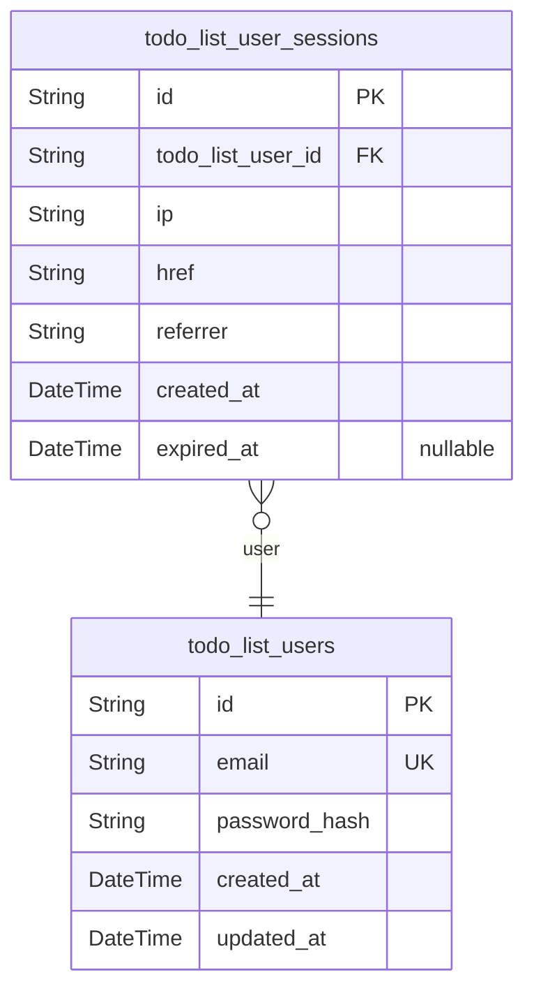
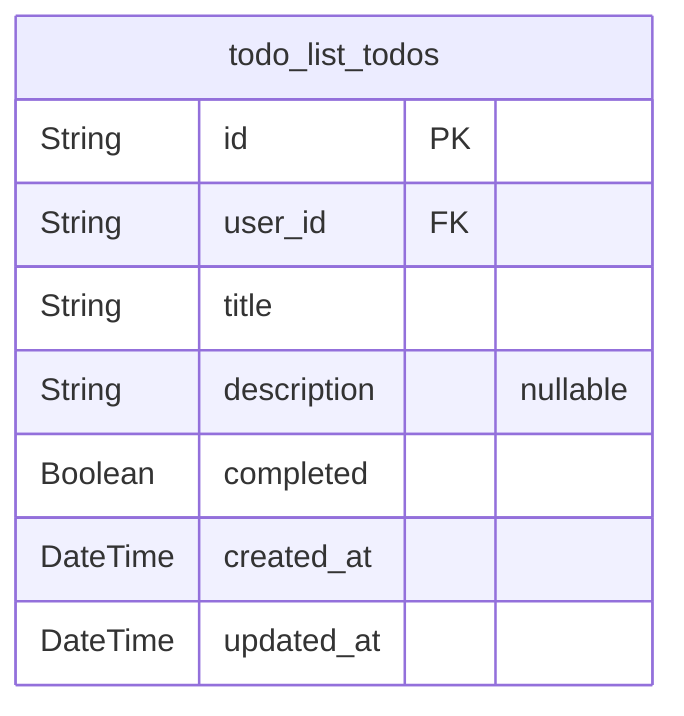

# Prisma Markdown

> Generated by [`prisma-markdown`](https://github.com/samchon/prisma-markdown)

- [Actors](#actors)
- [Todos](#todos)

## Actors

### `todo_list_users`

Registered user accounts for the Todo List application.

Represents individual users who may register, authenticate, and securely
manage their own todo items. Each user is uniquely identified by a
system-generated UUID and a distinct email address. Users are the
exclusive owners of all todo items they create, with no concept of
delegation or impersonation. Passwords are securely hashed to prevent
credential exposure. There is no support for multiple user roles,
administrative access, or cross-user operations—each user is fully
isolated. Email addresses must be unique among all users. All
authentication and access permissions in the system are managed
exclusively through this table.

This model forms the root for all ownership, authentication, and
permission structures in the system.

Properties as follows:

- `id`: Primary Key.
- `email`
  > Unique email address used for authentication and identification. Must be
  > unique among all users and verified before granting access. Used as the
  > primary login credential.
- `password_hash`
  > Securely hashed password for authentication. Plaintext passwords are
  > never stored. Only the cryptographically hashed value is persisted for
  > verification.
- `created_at`
  > Timestamp recording when the user account was created. Set automatically
  > at registration.
- `updated_at`
  > Timestamp of the most recent update to the user's account details. Used
  > for audit and concurrency control.

### `todo_list_user_sessions`

Authentication sessions for tracking user login events and access history.

Enables secure management of each user's authentication sessions, storing
the association between sessions and their owning users. Each session
includes metadata on client IP, accessed URL, referring URL, and temporal
fields that mark login and expiry time. Used for audit logging,
concurrent session control, and security analytics. Session records are
referenced during JWT or token validation and for enforcing
single/multiple session policies as required.

All session records are linked to their respective users for full
auditability. Sessions are subsidiary to users and hold no independent
business identity apart from their owning account.

Properties as follows:

- `id`: Primary Key.
- `todo_list_user_id`
  > Reference to the authenticated user who owns this session. {@link
  > todo_list_users.id}.
- `ip`: IP address from which the session was initiated. Captured at login.
- `href`
  > URL of the page or client context where the session was started. Used for
  > logging session entry point.
- `referrer`
  > URL that referred the user to the login/session creation page. For audit
  > and analytics.
- `created_at`: Timestamp marking when the session was established.
- `expired_at`
  > Timestamp marking when the session became inactive or expired. Nullable
  > to allow for active sessions.

## Todos

### `todo_list_todos`

Represents a single todo item owned and managed by an authenticated user.

Each row stores a unique, user-owned task with a required, non-empty
title (up to 255 characters), an optional description (up to 1000
characters), and a boolean indicating completion. Timestamps for creation
and last update track lifecycle changes; no soft deletion or history is
recorded, as per business requirements.

Every todo must belong to an existing user in the system, enforced via a
mandatory foreign key (user_id) reference to the identity component. Only
the owning user can access, update, or delete this row. All fields follow
strict normalization and privacy guarantees—no other business entities,
roles, or polymorphic ownership structures exist. This model represents
the entirety of domain-scope CRUD operations for the MVP.

Properties as follows:

- `id`: Primary Key.
- `user_id`
  > The owner of this todo. References the primary key of the authenticated
  > user. [todo_list_users.id](#todo_list_users).
- `title`
  > The title of the todo item. Required and limited to 255 characters. Must
  > not be blank.
- `description`
  > Optional description for the todo item. Limited to 1000 characters if
  > provided.
- `completed`: Completion status of the todo. True when marked complete, false otherwise.
- `created_at`
  > Timestamp of todo creation (set automatically when the todo is first
  > created).
- `updated_at`: Timestamp of last modification of the todo (updated on each change).
