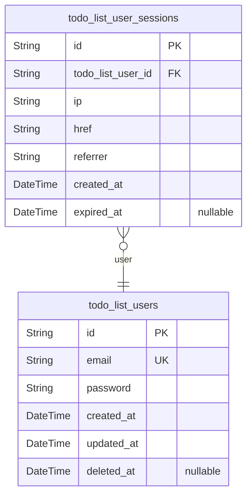
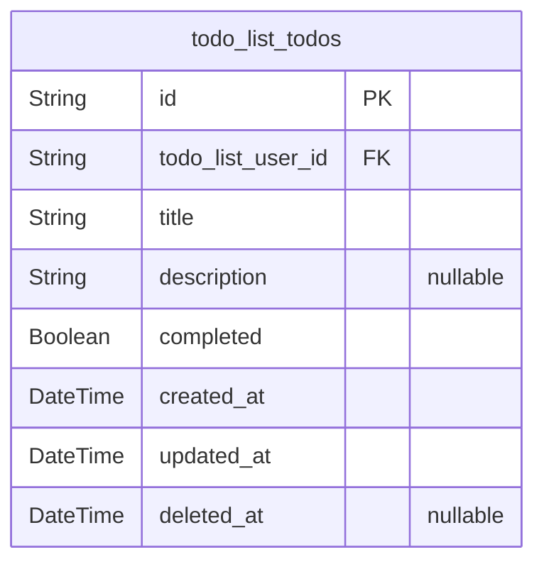

# Prisma Markdown

> Generated by [`prisma-markdown`](https://github.com/samchon/prisma-markdown)

- [Actors](#actors)
- [Todos](#todos)

## Actors

### `todo_list_users`

Authenticated users of the Todo List application.

This table stores the core identity information for users who can
authenticate and manage their todo items. Each user is identified by a
unique email address and has a securely hashed password for
authentication. The system supports standard member privileges for all
users, with no differentiation between user types.

Users must register with a valid email and strong password before they
can access the todo management features. Passwords are stored as securely
hashed values using industry-standard algorithms, never in plain text.

The user's account status is maintained through the deleted_at field,
allowing for soft deletion and account recovery if needed. All timestamps
track important lifecycle events including account creation and last
update times.

Properties as follows:

- `id`: Primary Key.
- `email`
  > Unique email address used for user authentication. Must be a valid email
  > format and is case-insensitive for login purposes.
- `password`
  > Securely hashed password for user authentication. Stored using bcrypt or
  > equivalent industry-standard hashing algorithm with appropriate salt and
  > minimum 12 rounds.
- `created_at`: Timestamp when the user account was created.
- `updated_at`: Timestamp when the user account was last modified.
- `deleted_at`
  > Timestamp when the user account was soft deleted. NULL indicates an
  > active account.

### `todo_list_user_sessions`

Authentication sessions for Todo List users.

This table tracks active user sessions to maintain authentication state
across requests. Each session is associated with exactly one user and
contains connection context information for security auditing purposes.

Sessions are created when a user successfully authenticates and are used
to validate subsequent requests without requiring re-authentication. The
session records include IP address, connection URL, and referrer
information to help with security monitoring and fraud detection.

Sessions can be explicitly expired by setting the expired_at field,
allowing for forced logout capabilities. The temporal fields track when
sessions were created and when they ended, providing an audit trail of
user access patterns.

Properties as follows:

- `id`: Primary Key.
- `todo_list_user_id`: The user associated with this session. [todo_list_users.id](#todo_list_users).
- `ip`: IP address from which the session was initiated.
- `href`: Connection URL when the session was created.
- `referrer`: Referrer URL that led to the session creation.
- `created_at`: Timestamp when the session was created.
- `expired_at`
  > Timestamp when the session was explicitly expired. NULL indicates an
  > active session.

## Todos

### `todo_list_todos`

Todo items created by authenticated users.

This table stores individual task items that users create to track their
personal activities and responsibilities. Each todo item is associated
with exactly one user who owns and manages it. The table maintains both
the current state of the task and timestamps for audit purposes.

Todos can be in either a pending or completed state, which is tracked in
the completed field. Users can update task details including the title
and completion status at any time. The system automatically maintains
creation and modification timestamps.

The relationship to users is strictly enforced with a foreign key
constraint ensuring data integrity. Each todo item can only belong to one
user, and users can have multiple todo items.

For performance optimization, the table includes appropriate indexes to
support common query patterns such as retrieving a user's todo items and
filtering by completion status. Soft deletion is supported through the
deleted_at field to maintain audit trails while allowing content
management.

Properties as follows:

- `id`: Primary Key.
- `todo_list_user_id`: The user who owns this todo item. [todo_list_users.id](#todo_list_users).
- `title`
  > The descriptive text of the task to be completed. This field contains the
  > main content of the todo item that describes what needs to be done.
  > Maximum length is 255 characters to ensure concise task descriptions.
- `description`
  > Optional detailed description providing additional context or information
  > about the task. This field allows users to add more comprehensive
  > information beyond the title. Maximum length is 1000 characters.
- `completed`
  > Status indicator showing whether the task has been completed. True
  > indicates the task is completed, false indicates it is still pending.
  > This field supports the core functionality of the todo application.
- `created_at`
  > Timestamp when the todo item was initially created. This field provides
  > an audit trail of when tasks were added to the system and supports
  > ordering of tasks by creation time.
- `updated_at`
  > Timestamp when the todo item was last modified. This field automatically
  > updates whenever any changes are made to the task, providing an audit
  > trail of modifications.
- `deleted_at`
  > Timestamp when the todo item was soft deleted. NULL indicates an active
  > item. This field is essential for content recovery and maintaining audit
  > trails without permanently removing data.
