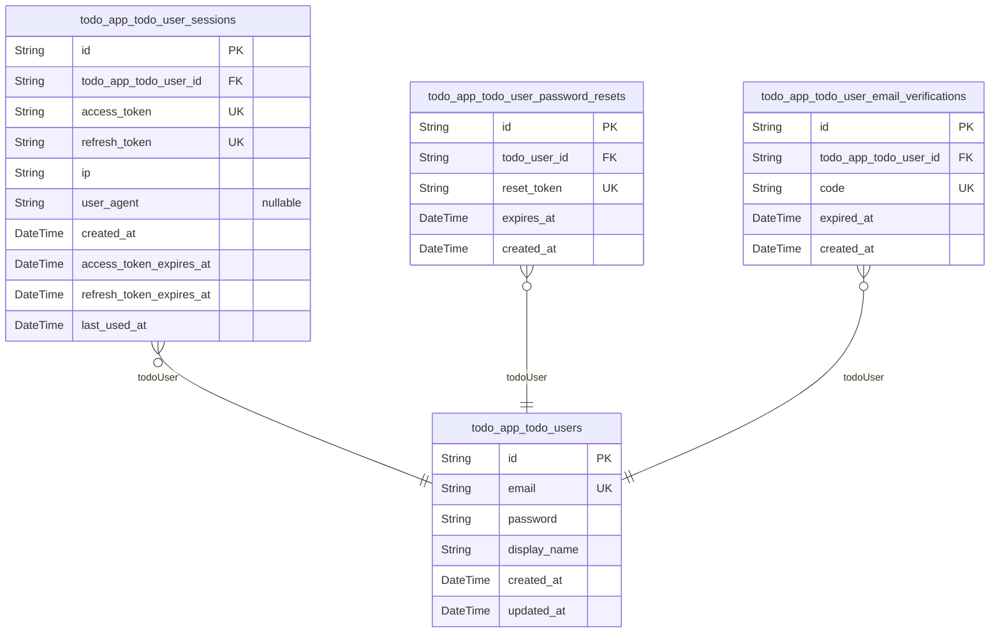
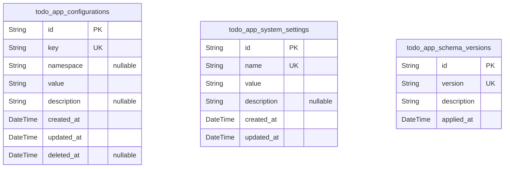
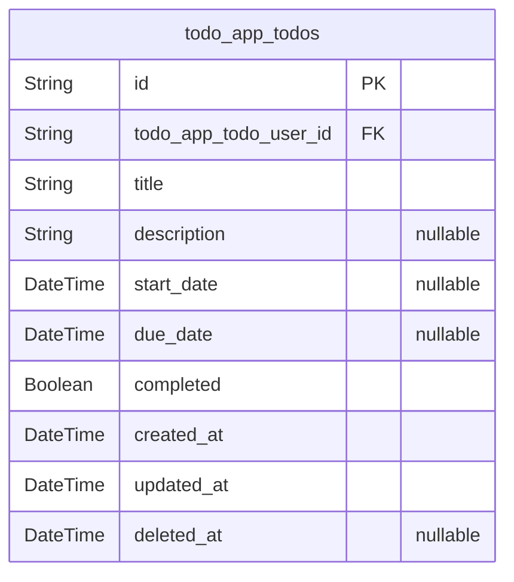
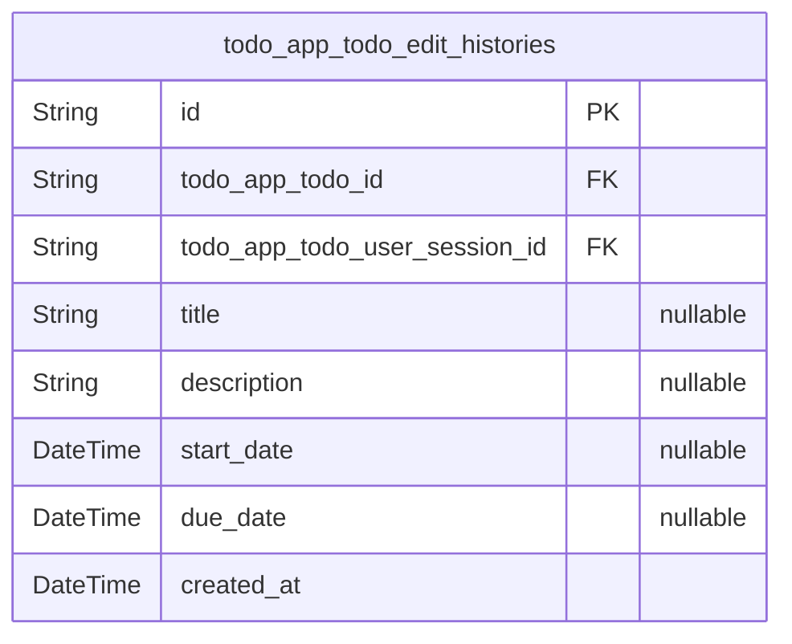
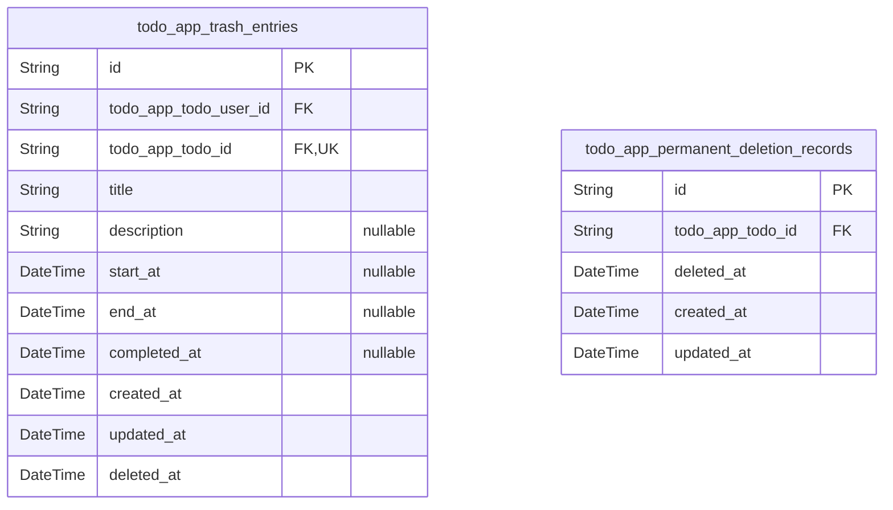

# Prisma Markdown

> Generated by [`prisma-markdown`](https://github.com/samchon/prisma-markdown)

- [Actors](#actors)
- [Systematic](#systematic)
- [Todos](#todos)
- [History](#history)
- [Trash](#trash)

## Actors

### `todo_app_todo_users`

todo app actors table.

This table stores core information about users who can authenticate and
use the todo application. It contains credential information for
authentication as well as profile data that is visible to the user. All
todos and related data in the system belong to a specific user from this
table.

The table implements email-based authentication with password hashing for
security. Each user has a unique email address that serves as their login
identifier. Profile information includes a display name that can be
updated by the user.

Users in this table can create, view, edit, and delete their own todos.
They have full control over their data including the ability to
permanently delete their account, which removes all associated todos,
history, and other personal data from the system.

Properties as follows:

- `id`: Primary Key.
- `email`
  > User's email address used for authentication and communication. Must be
  > unique across all users in the system.
- `password`: Hashed password for user authentication. Uses bcrypt hashing for security.
- `display_name`
  > User's display name that appears in the application interface. Can be
  > updated by the user as needed.
- `created_at`: Timestamp when the user account was initially created.
- `updated_at`: Timestamp when the user account was last updated.

### `todo_app_todo_user_sessions`

JWT session tokens for user authentication with access and refresh token
support for todo users.

This table manages authentication sessions for todo app users, storing
both access and refresh tokens
with their expiration times. It maintains client connection metadata and
tracks session usage for
security auditing. Each session is tied to a specific user and supports
token refresh workflows.

The table implements secure session management with automatic expiration
and last usage tracking.
It enforces uniqueness constraints on both access and refresh tokens to
prevent conflicts. Sessions
are linked to users through the todo_app_todo_user_id foreign key with a
one-to-many relationship,
enabling users to have multiple concurrent sessions.

Properties as follows:

- `id`: Primary Key
- `todo_app_todo_user_id`: todo_app_todo_users.id
- `access_token`: Access token for authentication
- `refresh_token`: Refresh token for obtaining new access tokens
- `ip`: IP address of the client when the session was created
- `user_agent`: User agent string of the client when the session was created
- `created_at`: Timestamp when the session was created
- `access_token_expires_at`: Timestamp when the access token expires
- `refresh_token_expires_at`: Timestamp when the refresh token expires
- `last_used_at`: Timestamp when the session was last used

### `todo_app_todo_user_password_resets`

Password reset tokens with expiration for secure user password recovery
workflow in the todo application.

This table manages the password reset process for todo users, storing
unique tokens that are emailed to users when they request a password
reset. Each token has an expiration time after which it becomes invalid.
The table links to the main user account for verification during the
reset process.

The tokens are designed to be single-use - once a password reset is
completed using a token, that token is removed from this table. Expired
tokens are also regularly cleaned up to maintain table performance.

When users successfully reset their password, the related entries in this
table are automatically deleted as part of the password reset completion
process.

Properties as follows:

- `id`: Primary Key.
- `todo_user_id`
  > Reference to the todo user who requested the password reset. Links to the
  > main user account that the reset token is valid for. {@link
  > todo_app_todo_users.id}
- `reset_token`
  > Cryptographically secure random token string sent to the user's email
  > address. Used to authenticate the password reset request. Should be
  > sufficiently long and random to prevent guessing attacks.
- `expires_at`
  > Timestamp when the password reset token expires. After this time, the
  > token becomes invalid and cannot be used for password reset. Typically
  > set to a short duration (e.g., 1 hour) from creation time.
- `created_at`
  > When this password reset record was created. Used for tracking token age
  > and debugging purposes.

### `todo_app_todo_user_email_verifications`

Email verification tokens for user registration confirmation in the todo
application.

This table stores email verification tokens generated when a new user
registers. Each token is associated with a specific user and has an
expiration time. Once a user clicks the verification link containing this
token, their email is confirmed and they can fully access the
application. The token is then invalidated.

Tokens are automatically cleaned up after expiration to maintain database
performance. The system ensures tokens are cryptographically secure and
single-use to prevent security vulnerabilities.

Properties as follows:

- `id`: Primary Key.
- `todo_app_todo_user_id`
  > The todo user associated with this email verification token. {@link
  > todo_app_todo_users.id}
- `code`
  > Cryptographically secure token value used for email verification. This is
  > a unique, random string that is emailed to the user as part of a
  > verification link.
- `expired_at`
  > Expiration timestamp for the email verification token. After this time,
  > the token becomes invalid and the user must request a new verification
  > email.
- `created_at`: Timestamp when the email verification token was created.

## Systematic

### `todo_app_configurations`

Application configuration settings that control global behavior and
feature flags for the todo application.

This table stores system-wide configuration values that can be used to
enable or disable features,
set application limits, define operational parameters, and control other
global behaviors.
The configuration uses a key-value structure where each key represents a
specific setting
and the value contains the configuration data in JSON format.

Configurations are identified by unique keys and can be scoped to
specific namespaces
for better organization. The system maintains version history for
configuration changes
and includes temporal fields for audit trails.

Properties as follows:

- `id`: Primary Key.
- `key`
  > Unique key identifying the configuration setting. Must follow naming
  > conventions with lowercase letters, numbers, and underscores only.
  > Examples: 'feature_enable_edit_history', 'limit_max_todos_per_user',
  > 'auth_password_min_length'.
- `namespace`
  > Namespace for organizing configurations. Allows grouping related settings
  > together. Examples: 'auth', 'todo', 'system', 'limits'.
- `value`
  > JSON-formatted configuration value. Can store simple values like strings
  > and numbers, or complex objects and arrays as needed for the specific
  > configuration setting.
- `description`
  > Description of what this configuration setting does and how it should be
  > used. Provides context for system administrators managing configurations.
- `created_at`
  > Timestamp when this configuration entry was created. Used for audit
  > trails and tracking when settings were introduced.
- `updated_at`
  > Timestamp when this configuration entry was last updated. Used for audit
  > trails and tracking when settings were modified.
- `deleted_at`
  > Timestamp when this configuration entry was deleted (soft delete). Allows
  > configuration entries to be archived without permanent removal.

### `todo_app_system_settings`

todo_app_system_settings

This table stores key-value pairs of system configuration settings,
including feature flags, operational parameters, and behavioral
configurations that control the overall application functionality. Each
setting is uniquely identified by its name and contains serialized value
data along with descriptive metadata.

Settings are versioned through the todo_app_system_setting_histories
table to maintain an audit trail of all changes.

Use this table to store configuration parameters that affect the entire
application, such as:
- Feature enablement flags
- Performance tuning parameters
- Integration endpoint configurations
- Business rule thresholds
- Operational mode settings

Properties as follows:

- `id`: Primary Key.
- `name`
  > Unique name identifier for the setting, used as the lookup key for
  > configuration values.
- `value`
  > Serialized value of the setting, stored as a string representation of the
  > actual data type.
- `description`
  > Human-readable description explaining the purpose and usage of this
  > system setting.
- `created_at`: Timestamp when the setting was initially created in the system.
- `updated_at`: Timestamp when the setting was last modified.

### `todo_app_schema_versions`

Tracking table for database schema versions and migration history in the
todo application.

This table maintains a chronological record of all schema changes applied
to the application database. Each entry represents a specific version of
the database schema, allowing for reliable migration management and
rollback capabilities when needed.

The version tracking system ensures that database changes are applied
consistently across different environments (development, staging,
production) and provides audit trails for schema evolution. It supports
automated migration workflows by recording which migrations have been
applied and when.

Each version entry includes metadata about the migration such as version
identifier, description, and timestamps for when the migration was
applied. The system prevents duplicate migrations by enforcing unique
version identifiers.

Properties as follows:

- `id`: Primary Key.
- `version`
  > Primary human-readable identifier for this schema version. Typically
  > follows semantic versioning patterns (e.g., v1.0.0) or migration naming
  > conventions (e.g., 20241201153000_initial_setup).
- `description`
  > Brief description of what changes this schema version introduces.
  > Explains the purpose and impact of the migration for operational
  > understanding.
- `applied_at`
  > Timestamp when this schema version was applied to the database. Used for
  > migration ordering and audit trail purposes.

## Todos

### `todo_app_todos`

Main todo items created by users in the todo application, containing all
core metadata including title, description, and temporal fields for task
management.

This table represents the primary business entity for the todo
application where users store their task items. Each todo is owned by a
specific user who is authenticated through the todo_app_todo_users
relationship.

Key aspects of this table include:

- Complete ownership tracking through foreign key relationships to user
accounts
- Soft deletion support for the trash system
- Full temporal tracking with created_at, updated_at, and deleted_at
timestamps
- Status tracking with completed boolean field
- Proper indexing strategy for common query patterns

The table is designed to support all user operations including:

- Viewing personal todo lists with pagination
- Creating new todos with optional metadata
- Updating todos with full edit history tracking (handled by History
component)
- Soft deleting todos which moves them to trash (handled by Trash component)
- Filtering and sorting todos by various criteria
- Permanent relationship with user owners for privacy enforcement

Properties as follows:

- `id`: Primary Key.
- `todo_app_todo_user_id`: Owner of this todo item. [todo_app_todo_users.id](#todo_app_todo_users).
- `title`
  > Concise summary of what needs to be done. This is the primary identifier
  > users see in their todo lists.
- `description`
  > Detailed explanation or additional context for the todo item. May contain
  > formatting or extended information.
- `start_date`
  > When the user plans to start working on this todo. Used for sorting and
  > filtering todos by start date.
- `due_date`
  > Deadline by which this todo should be completed. Critical for sorting,
  > filtering, and priority management.
- `completed`
  > Whether this todo has been marked as complete by the user. This is the
  > primary status indicator for filtering.
- `created_at`
  > When this todo was originally created by the user. Used for chronological
  > sorting and filtering.
- `updated_at`
  > When this todo was last modified by the user. Used for sorting by recent
  > activity.
- `deleted_at`
  > When this todo was moved to trash (soft delete). Null means active todo,
  > non-null means in trash.

## History

### `todo_app_todo_edit_histories`

Records all edit history entries for todos, capturing detailed
information about every change made to a todo including which fields were
modified and when.

Each history entry represents a single edit event on a todo item and
captures the changes to specific fields (title, description, start date,
due date). This table provides a complete audit trail of all
modifications made to todos over time, which is essential for tracking
changes, recovering previous versions, and understanding how todos
evolve.

History entries are immutable once created and are associated with both
the todo being modified and the user session that performed the edit. The
system only creates entries when actual changes occur - if a user submits
an edit request without making any actual changes to field values, no
history entry is created.

Properties as follows:

- `id`: Primary Key.
- `todo_app_todo_id`: Reference to the todo item that was edited. [todo_app_todos.id](#todo_app_todos)
- `todo_app_todo_user_session_id`
  > Reference to the user session that performed this edit. {@link
  > todo_app_todo_user_sessions.id}
- `title`
  > The updated title of the todo item. Only present if the title was changed
  > in this edit.
- `description`
  > The updated description of the todo item. Only present if the description
  > was changed in this edit.
- `start_date`
  > The updated start date of the todo item. Only present if the start date
  > was changed in this edit.
- `due_date`
  > The updated due date of the todo item. Only present if the due date was
  > changed in this edit.
- `created_at`
  > Timestamp when this edit history entry was created. This represents the
  > exact moment when the edit occurred.

## Trash

### `todo_app_trash_entries`

Records all soft-deleted todos, preserving complete todo data and
metadata at the time of deletion for potential restoration or permanent
removal.

This table captures all information about todos when they are moved to
the trash. It maintains the exact state of the todo at deletion time,
including all fields like title, description, dates, and completion
status. This enables full restoration of deleted todos while keeping them
separate from active todos.

Key relationships:
- Belongs to a user who created the original todo
- Maintains reference to original todo data for restoration
- Contains all metadata needed to reconstruct the original todo if restored

This table supports the trash system functionality by:
1. Storing complete todo data when soft deleted
2. Providing data for trash listing views
3. Enabling full restoration of deleted todos
4. Supporting permanent deletion workflows

Properties as follows:

- `id`: Primary Key.
- `todo_app_todo_user_id`: The user who created this todo. [todo_app_todo_users.id](#todo_app_todo_users)
- `todo_app_todo_id`: The original todo that was moved to trash. [todo_app_todos.id](#todo_app_todos)
- `title`
  > The title of the todo at the time it was moved to trash. Preserves the
  > original title for potential restoration.
- `description`
  > The description of the todo at the time it was moved to trash. Preserves
  > the original description for potential restoration.
- `start_at`
  > The start date of the todo at the time it was moved to trash. Preserves
  > the original start date for potential restoration.
- `end_at`
  > The due date of the todo at the time it was moved to trash. Preserves the
  > original due date for potential restoration.
- `completed_at`
  > Whether the todo was marked complete at the time it was moved to trash.
  > Preserves the original completion status for potential restoration.
- `created_at`
  > When the todo was originally created, preserved from the original todo
  > for accurate historical tracking.
- `updated_at`
  > When the todo was last updated before being moved to trash, preserved
  > from the original todo for accurate historical tracking.
- `deleted_at`
  > When the todo was moved to trash. This timestamp enables sorting of trash
  > entries by deletion time and supports time-based trash management
  > operations.

### `todo_app_permanent_deletion_records`

Records of todos that have been permanently deleted from the trash system.

This table tracks all todos that have been permanently removed from the
system by users. When a user chooses to permanently delete a todo from
their trash, a record is created in this table containing a reference to
the original todo and the timestamp of deletion. This provides an audit
trail of all permanent deletions for compliance and recovery purposes.

The table is append-only with no updates or deletions allowed after
creation. This ensures a complete and immutable history of all permanent
deletions.

Key relationships:
- References the original todo through the todo_app_todos.id foreign key
- Provides a complete log of user-initiated permanent deletions

Properties as follows:

- `id`: Primary Key.
- `todo_app_todo_id`
  > Reference to the original todo that was permanently deleted. {@link
  > todo_app_todos.id}
- `deleted_at`: The timestamp when the todo was permanently deleted by the user.
- `created_at`: The timestamp when this permanent deletion record was created.
- `updated_at`: The timestamp of the last update to this record.
