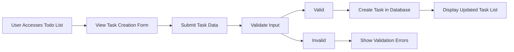
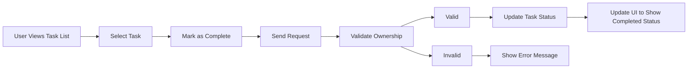
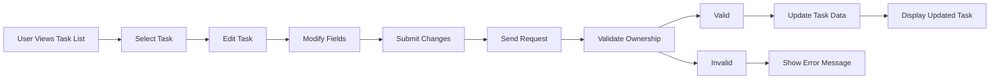
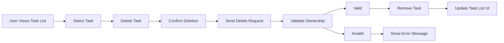

# Todo List Application - Requirements Analysis Report

## 1. Project Overview

### Core Purpose
THE Todo List application SHALL provide authenticated users with a simple digital platform for creating, managing, and tracking personal task items with minimal complexity.

### Service Scope
THE Todo List application SHALL focus exclusively on individual task management for authenticated users, without project management, team collaboration, or advanced organizational features.

### Key Characteristics
- Single-user focused task management
- Minimal feature set to reduce complexity
- Instant synchronization of task status changes
- Simple and intuitive user experience
- Secure authentication for personal data protection

## 2. User Actors

### Primary User Actor
- **Name**: User
- **Type**: Authenticated Member
- **Description**: An authenticated individual who can create, view, update, and delete their own todo items. Has standard access to personal todo management features.

### Authentication Requirements
THE user registration system SHALL allow new users to create accounts with email and password credentials.
THE system SHALL validate email format during registration.
THE system SHALL enforce password strength requirements (minimum 8 characters with alphanumeric characters).

THE system SHALL authenticate users using email and password credentials.
THE system SHALL provide secure session management after successful login.
THE system SHALL display appropriate error messages for invalid login attempts.

### Authorization Model
THE authorization model SHALL restrict users to managing only their own todo items.
THE system SHALL deny access to other users' todo data.
THE system SHALL provide appropriate error handling when access to unauthorized resources is attempted.

## 3. Functional Requirements

### Task Creation
WHEN a user submits a new task, THE system SHALL validate that the task title is not empty and SHALL create a new task with the following properties:
- Title: Required string (1-255 characters)
- Description: Optional string (0-1000 characters)
- Completion Status: Default to "pending"
- Creation Timestamp: System-generated timestamp at creation time

WHEN a user attempts to create a task with an empty title, THE system SHALL reject the request and return an appropriate error message.

### Task Viewing
THE system SHALL display a user's todo items in a list format, ordered by creation date with newest items appearing first.

THE system SHALL allow users to view all their tasks regardless of completion status.

### Task Modification
WHEN a user updates an existing task, THE system SHALL validate that the user is the owner of the task and SHALL update the task with the provided information:
- Title: Required string (1-255 characters)
- Description: Optional string (0-1000 characters)
- Last Modified Timestamp: System-generated timestamp at update time

WHEN a user attempts to modify a task they do not own, THE system SHALL deny access and return an appropriate error message.

### Task Deletion
WHEN a user deletes a task, THE system SHALL validate that the user is the owner of the task and SHALL permanently remove the task from the system.

WHEN a user attempts to delete a task they do not own, THE system SHALL deny access and return an appropriate error message.

### Task Status Management
THE system SHALL maintain a binary completion status for each task with values "pending" or "completed".

WHEN a user marks a task as completed, THE system SHALL validate that the user is the owner of the task and SHALL update the task status to "completed" with a completion timestamp.

WHEN a user marks a completed task as pending, THE system SHALL validate that the user is the owner of the task and SHALL update the task status to "pending" and clear the completion timestamp.

THE system SHALL allow users to filter their tasks by completion status:
- View all tasks
- View only pending tasks
- View only completed tasks

## 4. Business Process Flows

### Task Creation Flow

### Task Completion Flow

### Task Modification Flow

### Task Deletion Flow

## 5. User Permissions Matrix

| Feature | Description | User |
|---------|-------------|------|
| Create Tasks | Ability to add new todo items to their list | ✅ |
| View Tasks | Ability to see their todo items | ✅ |
| Edit Tasks | Ability to modify their existing todo items | ✅ |
| Delete Tasks | Ability to remove their todo items | ✅ |
| Mark Complete | Ability to change task status to completed | ✅ |
| Mark Pending | Ability to change task status back to pending | ✅ |

## 6. System Constraints

### Data Constraints
- Maximum title length: 255 characters
- Maximum description length: 1000 characters
- Tasks are associated with a single user
- Tasks have a binary completion status (pending/completed)

### Technical Constraints
- All operations must be performed through authenticated sessions
- No batch operations are required in this minimal implementation
- No task sharing or collaboration features are required
- No deadline or scheduling features are required

## 7. Feature Prioritization

### Essential Features (Must Have)
1. Create tasks with title and optional description
2. View list of personal tasks
3. Mark tasks as completed
4. Mark tasks as pending
5. Edit task details
6. Delete tasks
7. User authentication and authorization

### Future Enhancements (Not in Scope)
1. Task categorization or tagging
2. Due dates or scheduling
3. Task prioritization
4. Task sharing or collaboration
5. Rich text descriptions
6. Task reminders or notifications

This requirements analysis report provides a complete specification for a minimal Todo list application with essential features. All requirements are written in EARS format for clarity and testability, ensuring that developers can implement the system according to these specifications.