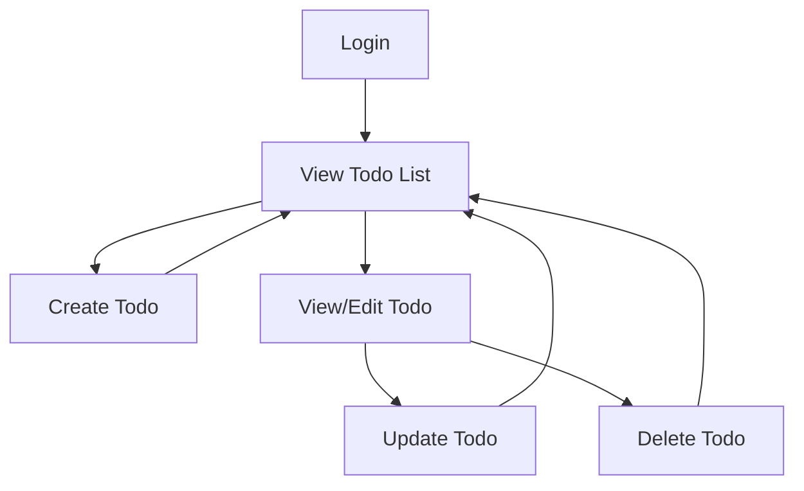

# Todo List Application Requirements Analysis

## 1. Service Purpose and Vision
The Todo List application provides users with a simple and efficient way to manage their personal tasks. The foundational principle of this application is minimalism: the system delivers only the core capabilities required to create, view, update, and delete todo items. The objective is to offer a distraction-free experience focusing solely on personal task management, without extra features such as labels, reminders, collaboration, or complex user roles. The app is intended for individual users who want a fast, reliable way to track and organize their own todos.

---

## 2. User Actors and Roles
- **User**: A registered individual who can perform actions only on their own todos. No administrative, guest, or external roles are provided in this minimal implementation.

---

## 3. Functional Requirements (EARS Format)

- WHEN a user is authenticated, THE system SHALL allow the user to create a new todo item specifying at least a title and optionally a description.

- WHEN a user is authenticated, THE system SHALL allow the user to view a list of all their own todo items, including status (complete/incomplete), creation date, and description.

- WHEN a user is authenticated, THE system SHALL allow the user to update any existing todo item that they own, including setting the title, description, and completion status.

- WHEN a user is authenticated, THE system SHALL allow the user to delete any of their own todo items.

- WHEN a user attempts to access a todo that does not exist or is not owned by the user, THE system SHALL return a permission error that does not leak existence or content of other users’ todos.

- WHEN a user sends a malformed request (e.g., missing required fields), THE system SHALL respond with a clear, actionable validation error message.

---

## 4. Authentication and Permissions

- **Authentication**: Users must register an account with a unique identifier (username or email and password). Successful registration creates a new user account. 
- **Login and Logout**: Users log in to access their todos. Active sessions must be established and securely managed. Logout ends the session.
- **Access Control**: Each user can only access, modify, or delete todos that they created. There is no functionality for users to view or act on others’ todos. Unauthorized access attempts must result in a standard error response without revealing details about other users.

---

## 5. Non-functional Requirements

- **Performance**: The application SHALL return a response for all core operations (create, read, update, delete) within two seconds under typical conditions.
- **Reliability**: The application SHALL maintain at least 99% uptime under normal operation.
- **Security**: All authentication operations SHALL use secure session/token mechanisms. User passwords SHALL be securely hashed and never stored in plain text.
- **Privacy**: User data SHALL never be shared or exposed to other users.

---

## 6. Error Scenarios

- **Invalid Credentials**: WHEN a user enters incorrect login credentials, THE system SHALL present an error message indicating authentication failure without specifying which part was incorrect.
- **Resource Not Found**: WHEN a user attempts to access a todo by an invalid or non-existent identifier, THE system SHALL respond with a not-found error message.
- **Permission Denied**: WHEN a user tries to access or modify another user’s todo item, THE system SHALL respond with a standard denial message.
- **Validation Error**: WHEN required fields are missing or input is invalid, THE system SHALL describe the issue and the field(s) affected in the error response.
- **Session Expired**: WHEN a user’s session is expired or invalid, THE system SHALL require the user to re-authenticate.

---

## 7. Business Rules and Constraints

- Each todo item SHALL have at minimum a non-empty title owned by a single user.
- Each user SHALL only be able to register one account per unique identifier (username/email).
- Todo descriptions are optional and limited to 500 characters.
- Only two valid todo states exist: complete, or incomplete. No partial or other statuses are supported.
- Duplicate todo titles are permitted per user.
- Todos are always private to the user; sharing is not supported.

---

## 8. Out-of-Scope Features

The following common Todo application features are explicitly out of scope and SHALL NOT be implemented in this minimal version:
- Task sharing or collaboration between users
- Task categorization/tagging/labeling
- Reminders, scheduling, or recurring tasks
- Attachments or file uploads
- Multi-role support (e.g., admin, observer)
- Any web, mobile, or user interface specification (scope is backend only)
- Third-party integrations or API webhooks
- Data import/export

---

## 9. Minimal User Flow Diagram

---

## 10. Implementation Considerations

This requirements definition is intended to be exhaustive for the purposes of building a production-ready backend for a minimal Todo List application. Any business or backend logic not covered in the above sections is considered out of scope and must not be developed until specifically required and documented in a future requirements version.