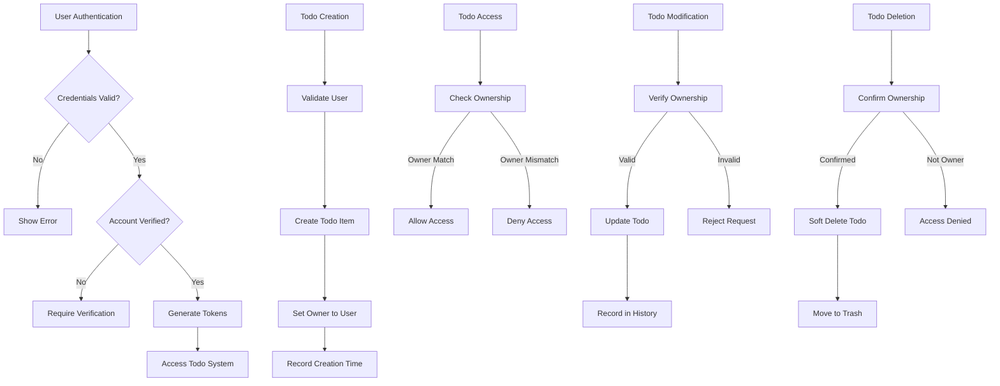

# TodoApp Requirements Specification

## 1. Introduction

THE TodoApp SHALL provide a private, multi-user todo list management system where each user maintains complete data isolation from other users. The system SHALL support comprehensive todo management features including creation, viewing, editing, completion tracking, soft deletion with trash recovery, and detailed edit history.

### 1.1 Purpose

THE TodoApp SHALL enable authenticated users to manage personal todo lists with full privacy controls, ensuring that each user's data remains completely inaccessible to other users. The system SHALL provide robust organizational capabilities through filtering, sorting, and pagination features.

### 1.2 Scope

THE TodoApp SHALL include these core functional areas:

1. User Account Management (registration, authentication, profile management, account deletion)
2. Todo Management (create, read, update, delete operations)
3. Todo Completion Tracking (mark complete/incomplete)
4. Todo Edit History (track all changes with timestamps)
5. Soft Delete with Trash System (recoverable deletion)
6. Todo Organization (filtering, sorting, pagination)
7. Privacy Controls (strict user data isolation)

### 1.3 Definitions

| Term | Definition |
|------|------------|
| Todo | A user-created task item with title, optional description, optional dates, and completion status |
| Edit History | A chronological record of all changes made to a todo item |
| Trash | A special view showing deleted todos that can be restored or permanently removed |
| Soft Delete | Marking a todo as deleted without actually removing it from the system |
| Complete | A todo status indicating the task has been finished |
| Incomplete | A todo status indicating the task has not been finished |

## 2. User Account Management

### 2.1 User Registration Process

WHEN a user provides valid registration information, THE system SHALL create a new user account with the following requirements:

1. THE system SHALL collect email address and password during registration
2. THE system SHALL validate that the email address is not already in use
3. THE system SHALL enforce password complexity requirements
4. THE system SHALL create a new user profile with default settings
5. THE system SHALL return appropriate success or error responses

### 2.2 User Authentication Process

WHEN a user submits login credentials, THE system SHALL authenticate the user and establish a session with the following steps:

1. THE system SHALL validate the email and password combination
2. THE system SHALL verify the account is active and verified
3. THE system SHALL generate authentication tokens
4. THE system SHALL return tokens to the client
5. THE system SHALL log the login event for security monitoring

### 2.3 Profile Management

THE system SHALL provide users with profile management capabilities including:

- Viewing their own profile information
- Editing their display name
- Changing their password with current password validation
- Deleting their account with data purge confirmation

### 2.4 Account Deletion

WHEN a user requests account deletion, THE system SHALL:

1. Validate the user's identity with current password
2. Permanently delete all user todos including those in trash
3. Permanently delete all todo edit histories
4. Remove all user profile information
5. Invalidate all active sessions
6. Log the account deletion event

## 3. Todo Management

### 3.1 Todo Creation

WHEN a user creates a new todo, THE system SHALL:

1. Create a todo with title (required), description (optional), start date (optional), and due date (optional)
2. Set initial completion status to incomplete
3. Record creation timestamp
4. Associate the todo with the authenticated user

### 3.2 Todo Viewing

WHEN a user requests their todo list, THE system SHALL:

1. Return only todos belonging to the authenticated user
2. Paginate results with configurable page size
3. For each todo, display: title, completion status, start date (if set), due date (if set), and creation date
4. Support filtering by completion status
5. Support sorting by creation date, start date, and due date

WHEN a user requests a specific todo, THE system SHALL:

1. Verify the todo belongs to the authenticated user
2. Return complete todo details including full description
3. Return associated edit history (if requested)

### 3.3 Todo Updating

WHEN a user updates a todo, THE system SHALL:

1. Verify the todo belongs to the authenticated user
2. Update only the provided fields
3. Record the update in the todo's edit history
4. Update the todo's last modified timestamp

### 3.4 Todo Completion

WHEN a user toggles a todo's completion status, THE system SHALL:

1. Verify the todo belongs to the authenticated user
2. Toggle between complete and incomplete states
3. Record the status change in the todo's edit history
4. Update the todo's last modified timestamp

### 3.5 Todo Deletion (Soft Delete)

WHEN a user deletes a todo, THE system SHALL:

1. Verify the todo belongs to the authenticated user
2. Mark the todo as deleted (soft delete)
3. Remove the todo from normal todo list views
4. Retain the todo in the system for trash recovery
5. Retain the todo's edit history

## 4. Edit History

### 4.1 History Tracking

WHEN any modification is made to a todo, THE system SHALL:

1. Create a new history entry with timestamp
2. Record what fields were changed and their new values
3. Associate the history entry with the todo
4. Maintain chronological ordering of history entries

### 4.2 History Viewing

WHEN a user requests a todo's edit history, THE system SHALL:

1. Verify the todo belongs to the authenticated user
2. Return all history entries for the todo
3. Sort entries from most recent to oldest
4. Include complete change details for each entry

## 5. Trash System

### 5.1 Trash Viewing

WHEN a user requests their trash list, THE system SHALL:

1. Return only deleted todos belonging to the authenticated user
2. Paginate results with configurable page size
3. Display same information as normal todo list view

### 5.2 Todo Restoration

WHEN a user restores a todo from trash, THE system SHALL:

1. Verify the todo belongs to the authenticated user
2. Mark the todo as not deleted
3. Return the todo to normal todo list views
4. Retain the todo's edit history

### 5.3 Permanent Deletion

WHEN a user permanently deletes a todo from trash, THE system SHALL:

1. Verify the todo belongs to the authenticated user
2. Permanently remove the todo from the system
3. Permanently remove all associated edit history entries
4. Log the permanent deletion event

## 6. Todo Organization

### 6.1 Filtering

THE system SHALL provide these filtering options for todo lists:

1. All todos (both complete and incomplete)
2. Only complete todos
3. Only incomplete todos

### 6.2 Sorting

THE system SHALL provide these sorting options for todo lists:

1. Creation date (newest first or oldest first)
2. Start date (earliest first or latest first)
3. Due date (earliest first or latest first)

WHEN sorting by start date, THEN todos without a start date SHALL appear at the end.

WHEN sorting by due date, THEN todos without a due date SHALL appear at the end.

### 6.3 Pagination

THE system SHALL implement pagination for both todo lists and trash lists with:

1. Configurable page size (within system limits)
2. Page number navigation
3. Total item count reporting
4. First/Last page navigation

## 7. Privacy and Security

### 7.1 Data Isolation

THE system SHALL enforce strict data isolation with these requirements:

1. Users can ONLY access their own todos
2. Users can ONLY access their own todo edit histories
3. Users can ONLY access their own deleted todos
4. No user can view, access, or share another user's todos
5. System queries SHALL include user identity filters

### 7.2 Authentication Requirements

THE system SHALL implement robust authentication with:

1. Email/password registration and login
2. Password complexity enforcement
3. Session management with token-based authentication
4. Account verification via email
5. Failed login attempt limiting

> *Developer Note: This document defines **business requirements only**. All technical implementations (architecture, APIs, database design, etc.) are at the discretion of the development team.*