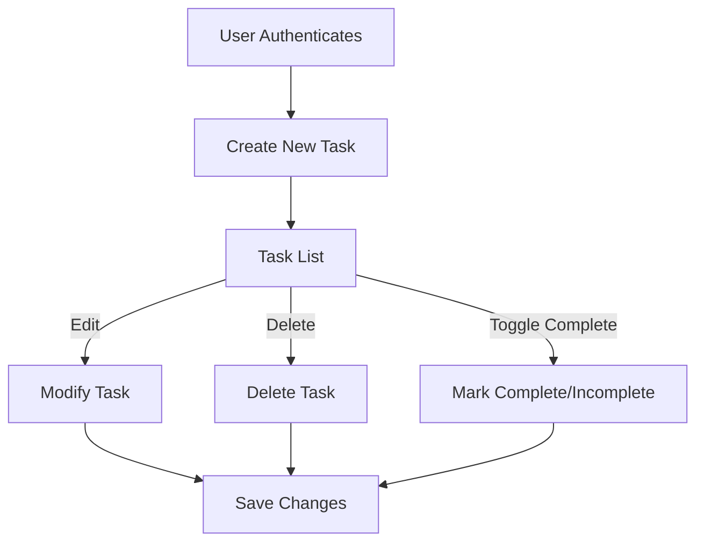
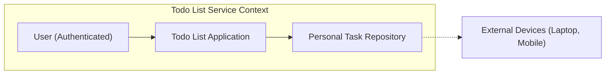

# Todo List Application - Requirements Analysis

## 1. Purpose and Scope

The Todo List Application delivers a minimal, production-grade solution for individual users to manage their daily tasks. The feature scope is strictly limited to the core functions of personal task management. The system upholds strong data privacy, exclusive ownership, reliability, and accessibility across widely-used devices.

## 2. Actors

### User
- An individual who registers for an account, authenticates, and manages their own todo items.
- Has exclusive access to the tasks they create. Cannot view or manipulate tasks of others under any circumstance.

## 3. Functional Requirements (EARS Format)

- THE system SHALL allow users to register for an account using a unique identifier (e.g., email or secure social login).
- WHEN a user is authenticated, THE system SHALL allow the user to create new todo tasks with minimal required properties (e.g., title, optional description, completion status).
- WHEN a user views their task list, THE system SHALL return only tasks that belong to that authenticated user and in no event expose tasks belonging to other users.
- WHEN a user updates or deletes a task, THE system SHALL require that user to be authenticated and verified as the owner of the task before applying modifications.
- IF a user attempts to access, update, or delete a task not owned by them, THEN THE system SHALL deny the operation and return a clear error message within 2 seconds.
- THE system SHALL always associate each task with exactly one and only one user (the owner) for all CRUD operations.
- THE system SHALL support marking tasks as complete or incomplete, and allow users to modify this status.
- THE system SHALL preserve task data integrity and prohibit all operations that would cause data loss without explicit user action.

## 4. Non-Functional Requirements (EARS Format)

- THE system SHALL deliver CRUD operations (create, read, update, delete) with an average response time under 1 second in normal conditions.
- WHEN a user submits a request, THE system SHALL ensure operation reliability with 99.9% uptime for the core todo management functionality.
- THE system SHALL preserve user data with industry-standard encryption at rest and in transit.
- THE system SHALL provide a simple, distraction-free interface suitable for both mobile and desktop access.
- WHEN an internal system error occurs, THE system SHALL return a clear, friendly error message with actionable next steps to the user within 2 seconds.
- THE system SHALL utilize secure authentication (see below).

## 5. Workflows and Business Rules

### Task Creation
- WHEN a user creates a new task, THE system SHALL require a non-empty title.
- The description is optional and can be left blank or updated later.
- Every new task SHALL default to 'incomplete' status.
- The creation timestamp SHALL be automatically assigned.

### Task Listing and Filtering
- WHEN a user requests to list tasks, THE system SHALL display only their own tasks, sorted by creation date, status, or optionally filtered by completion.

### Task Updating
- WHEN a user edits a task, THE system SHALL validate that the task exists and the user is the owner.

### Task Completion
- Users SHALL be able to toggle the completion status. 
- WHEN a task is marked complete, THE system SHALL record the timestamp when the completion was performed.

### Task Deletion
- WHEN a user deletes a task, THE action SHALL be irreversible and remove all data related to that task from the user's accessible tasks, while preserving data isolation to prevent impact on other users.

### Boundary and Validation Rules
- Tasks SHALL reject creation or update if the title is blank or exceeds 255 characters.
- Description field SHALL accept up to 1000 characters.
- The system SHALL reject all attempts to create, read, update, or delete tasks without valid authentication.

### Example Workflows (Mermaid)

## 6. Authentication and Permissions

- THE system SHALL allow users to securely register and authenticate via password or secure identity provider.
- WHEN authenticated, THE user SHALL receive a secure session token (e.g., JWT) for subsequent requests.
- THE system SHALL validate all user actions via this token for every API operation.
- THE system SHALL never allow a user to view or operate on tasks belonging to another user.
- THE system SHALL expire user tokens after 24 hours or on password/credential change.

### Permission Matrix

| Operation       | Authenticated User | Unauthenticated User |
|-----------------|:-----------------:|:-------------------:|
| Register        |         N/A       |         YES         |
| Authenticate    |         N/A       |         YES         |
| Create Task     |        YES        |         NO          |
| Read Tasks      |        YES        |         NO          |
| Update Task     |        YES        |         NO          |
| Delete Task     |        YES        |         NO          |
| Change Status   |        YES        |         NO          |

## 7. Exception and Error Handling

- WHEN a user action violates validation (e.g., missing title, unauthorized), THE system SHALL return an error describing the exact issue (e.g., "Title required.", "Invalid token.")
- IF a user attempts any unauthorized operation, THE system SHALL return a 403 Forbidden error.
- IF a system error occurs, THEN THE system SHALL log the error with identifiable context and provide the user with friendly message and next steps.
- THE system SHALL NOT leak any internal error details or stack traces to end users.

## 8. Alignment with Success Metrics

- All requirements above are designed to maximize user engagement, retention, usability, and satisfaction strictly for solo productivity.
- Simplicity ensures high-frequency use and low friction.
- Privacy and reliability are prioritized to build trust and encourage continued use.

## 9. System Context Diagram (Mermaid)

## 10. Reference to Upstream Business Vision

All requirements defined here comply with and directly implement the business context, goals, and principles established in the "Service Overview: Todo List Application" document:

- The todo list only offers the minimum set of task management features (personal CRUD, status toggle), maximizing usability.
- User privacy and content ownership are foundational: no cross-user data exposure, full data control.
- Simplicity, reliability, and measurable performance are prioritized.
- User engagement, retention, and satisfaction are measured and drive quality and design decisions.
