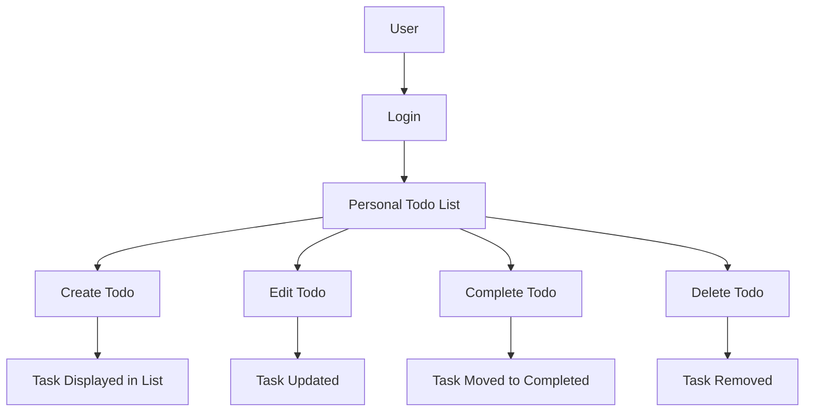

# Todo List Application – Requirements and Analysis

## 1. Introduction

Managing daily personal and professional responsibilities presents a challenge for users who lack a single, reliable tool. Fragmented solutions—stickies, memory, spreadsheets—cause loss of key tasks, missed deadlines, and increased stress, especially for non-programmers seeking simplicity. The Todo List Application addresses these pain points by providing the essential functions required to reliably track, update, and complete daily tasks without the complexity or bloat of sophisticated productivity apps.

## 2. Problem Statement

Users need a persistent, centralized tool to reliably track and manage their daily todos. Without it, they experience missed tasks, cognitive overload, lack of transparency on progress, and low task accountability. Existing products are either too generic or excessively complex—adding overhead that discourages adoption. When a user relies on informal tracking, the lack of automation, notifications, or historical records shall result in incomplete or forgotten tasks. The Todo List Application is purpose-built for these users: accessible, frictionless, and strictly minimal in scope.

## 3. User Persona & Audience

- Users with non-technical backgrounds who want simple, reliable tracking of daily tasks
- Individuals overwhelmed by feature-rich alternatives
- Users managing personal, work, or mixed to-do items
- Anyone seeking basic privacy, clear ownership of their data, and minimal onboarding

## 4. Actors & Permissions

**Actor:**
- "User": A single authenticated person managing only their own todo list

**Permission Matrix:**
| Action           | User |
|------------------|------|
| Create Task      | Yes  |
| Read Task        | Yes  |
| Update Task      | Yes  |
| Delete Task      | Yes  |
| See Others' Todos| No   |

WHEN a user is not authenticated, THE system SHALL prevent access to any todo list or modification operations.
WHEN a user attempts to modify another user's task, THE system SHALL prevent the action and show a permission error.

## 5. Core Business Requirements

### 5.1 Task CRUD (Minimum Viable Features)
- WHEN a user creates a new todo, THE system SHALL immediately add it to the user's list and show it in the main view.
- WHEN a user marks a todo as complete, THE system SHALL move or clearly indicate the completed task in the UI and update the user's record of finished tasks.
- WHEN a user edits their todo, THE system SHALL apply and show the updated item instantly.
- WHEN a user deletes a todo, THE system SHALL remove the item from their list only, without affecting any other item.
- WHEN a user tries to modify or see another user's todos, THE system SHALL block the request and provide a clear error message.

### 5.2 User Authentication & Privacy
- WHEN a user accesses the service, THE system SHALL require login (email/password or social identity, depending on future extension) before showing any list data or operations.
- THE system SHALL ensure that all todos are private and accessible only to the authenticated owner.
- WHEN a user logs out, THE system SHALL remove the in-memory session so todo data is no longer visible.
- WHEN a user fails authentication, THE system SHALL present a clear cause of failure (wrong password, unregistered email, etc.)

### 5.3 Error Handling
- WHEN a user attempts any action (create, update, delete, view) and something fails, THE system SHALL display a user-friendly error and not perform any unintended changes.
- IF a user tries to use any feature not supported (e.g., workspaces, teams), THEN THE system SHALL explain that only core todo functionality is available.

### 5.4 Simplicity Guarantee
- THE system SHALL not include features beyond simple todo CRUD, authentication, privacy, and account-based separation.
- WHEN a user requests advanced or unrelated features, THE system SHALL communicate that the application is intentionally minimal.

## 6. Non-functional Requirements
- WHEN a user adds or modifies a todo, THE response time SHALL be less than 2 seconds.
- THE system SHALL be available 99.9% of the time for single-user access.
- THE system SHALL respect all standard privacy laws; no personal data is shared or displayed to others.
- THE system SHALL be accessible from modern desktop and mobile browsers using current web standards.
- THE design SHALL prominently use clear contrast and readable font sizes for accessibility.

## 7. User Scenarios / Workflows
### Scenario 1: Add a Task
- WHEN a user logs in and enters a new task in the input box, THE system SHALL add the new task to the user's main view and confirm success.

### Scenario 2: Complete a Task
- WHEN a user marks a task as done, THE system SHALL immediately mark the item as complete and show visual confirmation.

### Scenario 3: Edit a Task
- WHEN a user clicks to edit a todo, modifies the content, and saves, THE system SHALL update the item and return to the normal list view.

### Scenario 4: Delete a Task
- WHEN a user deletes a todo, THE system SHALL permanently remove it from their account, hiding it from all lists.

### Scenario 5: Unauthorized Access Prevention
- WHEN a user tries to access another user’s todos, the system SHALL block this attempt and deliver an error message.

### Scenario 6: Error Edge Cases
- WHEN a network or server issue prevents saving, THE system SHALL not lose user input and SHALL ask the user to retry.

## 8. Success Criteria
- All features are fully usable through an intuitive, minimal user interface with no need for training.
- No possibility for users to interact with other users’ data; absolute privacy enforced.
- No advanced/non-core features present; 100% adherence to minimal todo specification.
- All requirements met in real user testing within target response times.

## 9. Risks and Constraints
- Only basic CRUD for todos is in scope; any feature creep (labels, nesting, reminders) is to be postponed to future planning.
- The system is for individual use only—no team, sharing, or collaborative functions are permitted.
- The application is strictly web-based; no support for offline or device-native features in the first release.
- Users must always log in to access any content or function.

## 10. Visual Summary

# END