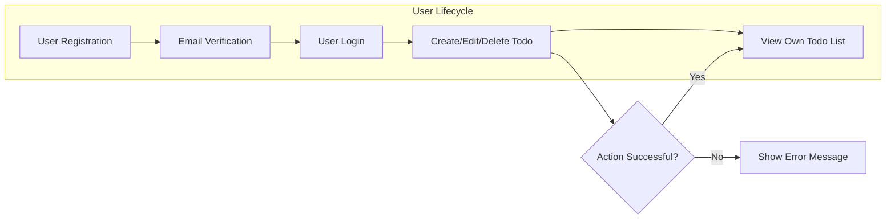

# Todo List - Requirements Analysis

## Introduction & Goals
The Todo List application enables users to efficiently manage personal tasks with minimal complexity. The overarching goal is to create a distraction-free, reliable, and intuitive experience for individuals seeking a straightforward solution for their daily or work-related task management. The system targets ease of use, privacy, and swift feedback on user actions as the primary differentiators.

## User Actors & Roles
- **User**: A person who registers, authenticates, and manages their own todo items and account.
- No administrative roles or shared resources; each user manages only their own data. All features and requirements are scoped exclusively to personal task management.

## Core Functional Requirements
- WHEN a new user registers, THE system SHALL verify credentials and create a workspace solely for that user’s todos.
- WHEN a registered user logs in, THE system SHALL restrict access exclusively to that user's todo data.
- WHEN an authenticated user creates, edits, completes, or deletes a todo, THE system SHALL persist the data change and provide UI feedback within 2 seconds.
- IF a user attempts to access or modify another user’s todos, THE system SHALL deny the action and show a clear error message.
- WHEN a network or operational error occurs during any operation, THE system SHALL retry the operation once before notifying the user of a failure.
- THE service SHALL provide full CRUD (Create, Read, Update, Delete) operations for individual todos.
- WHEN a todo is marked as completed, THE system SHALL visually acknowledge the completion to enhance user satisfaction.
- Each todo item SHALL include at minimum a title (required), completion status (boolean), and creation/update timestamps.
- THE system SHALL allow each user to maintain an independent list of todos, with no shared editing or viewing capability.
- No tags, priorities, recurring tasks, deadlines, or reminders are included in this minimal scope.

## Business Model Overview
The core offering is a free, single-user todo list service. The value proposition centers on minimalism and privacy, with all features accessible to any registered user. Revenue is not an initial focus, but the following may be considered for future sustainability:
- Core functionality is always free to use for all users.
- WHEN optional premium features (such as recurring tasks, exports, reminders) exist in future iterations, THE system SHALL restrict access to only those who actively subscribe or upgrade.
- No advertising, data sharing, or integration with third-party services occurs in the initial product stage.
- All feature and product changes SHALL prioritize disruption-free user experience.

## User Operational Workflows

WHEN a user completes registration and email verification, THE system SHALL authenticate the user and grant access only to their workspace. All CRUD operations are performed within the context of the logged-in user's account.

IF an operation fails due to connectivity, data issues, or permissions, THE system SHALL provide the user with a clear error message in under 2 seconds, along with suggested next steps if recoverable.

## Non-Functional Requirements
- WHEN user traffic is low, THE system SHALL use minimal cloud infrastructure to optimize operational costs.
- AS user numbers rise, THE system SHALL automatically scale backend resources to maintain reliable response times.
- WHEN user data is modified, THE system SHALL ensure durability and consistency (no lost updates or cross-user data leaks).
- THE backend SHALL respond to user operations within 2 seconds under normal load.
- THE system SHALL implement industry-standard security practices, including hashing passwords and HTTPS-only traffic for authentication and CRUD operations.
- Privacy is paramount: All user todo data SHALL remain accessible only to the authenticated owner. No external integrations or data exports are enabled for minimal scope.

## Error Handling & Data Reliability
- THE system SHALL display specific, actionable error messages when network problems or internal failures prevent todo operations.
- THE system SHALL retry failed operations once before reporting an error.
- WHEN unrecoverable errors occur, THE system SHALL log the event and support user self-help by linking to a FAQ or help section.
- WHEN an unauthorized CRUD attempt is made, THE user SHALL receive a denial message, and no operation or data leak occurs.
- WHEN a successful operation is performed, THE updated todo list SHALL be displayed immediately for verified feedback.

## Permission Model & Data Privacy
- All todos and user data SHALL be owned by the authenticating user only.
- WHEN a user is authenticated, THE system SHALL only allow access to that user's own data. No cross-user access is possible or permitted.
- IF a user attempts to access another user's todos, THE system SHALL prevent the action and log a security event.
- Only authenticated users may create, update, or delete todos; guests cannot access any feature.
- All session management SHALL use secure, time-bound tokens. Expired or invalid sessions SHALL redirect users to login with a clear prompt.
- No personal or behavioral data is shared with third parties.

## Conclusion
The Todo List application delivers essential task management through a minimal set of highly-focused, rigorously-defined requirements. All features, workflows, and operational qualities are prescribed to support stable, secure, and efficient task management for individual users. This specification is complete and production-ready for backend implementation.