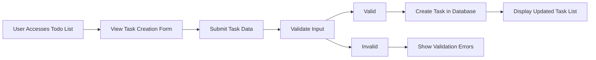
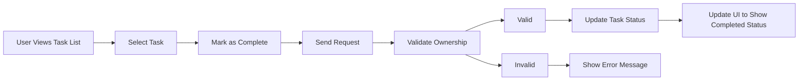
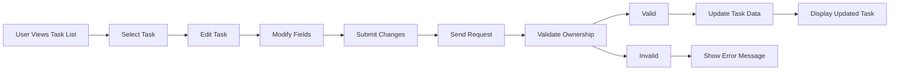
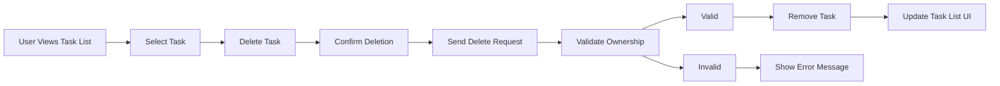

# Functional Requirements for Todo List Application

## 1. Core Todo Features

### 1.1 Task Creation and Management
THE Todo application SHALL allow users to create, view, update, and delete their personal todo items. Each task SHALL contain a title, optional description, creation timestamp, and completion status.

### 1.2 User Authentication
THE Todo application SHALL require users to authenticate before accessing todo management features. Non-authenticated users SHALL NOT be able to create, view, or modify any todo items.

### 1.3 Data Isolation
THE Todo application SHALL ensure that each user can ONLY access and modify their own todo items. Users SHALL NOT be able to view or modify todo items belonging to other users.

## 2. Task Management Requirements

### 2.1 Task Creation
WHEN a user submits a new task, THE system SHALL validate that the task title is not empty and SHALL create a new task with the following properties:
- Title: Required string (1-255 characters)
- Description: Optional string (0-1000 characters)
- Completion Status: Default to "pending"
- Creation Timestamp: System-generated timestamp at creation time

WHEN a user attempts to create a task with an empty title, THE system SHALL reject the request and return an appropriate error message.

### 2.2 Task Viewing
THE system SHALL display a user's todo items in a list format, ordered by creation date with newest items appearing first.

THE system SHALL allow users to view all their tasks regardless of completion status.

### 2.3 Task Modification
WHEN a user updates an existing task, THE system SHALL validate that the user is the owner of the task and SHALL update the task with the provided information:
- Title: Required string (1-255 characters)
- Description: Optional string (0-1000 characters)
- Last Modified Timestamp: System-generated timestamp at update time

WHEN a user attempts to modify a task they do not own, THE system SHALL deny access and return an appropriate error message.

### 2.4 Task Deletion
WHEN a user deletes a task, THE system SHALL validate that the user is the owner of the task and SHALL permanently remove the task from the system.

WHEN a user attempts to delete a task they do not own, THE system SHALL deny access and return an appropriate error message.

## 3. Task Status Management

### 3.1 Completion Status
THE system SHALL maintain a binary completion status for each task with values "pending" or "completed".

### 3.2 Marking Tasks as Complete
WHEN a user marks a task as completed, THE system SHALL validate that the user is the owner of the task and SHALL update the task status to "completed" with a completion timestamp.

WHEN a user attempts to mark a task as completed that they do not own, THE system SHALL deny access and return an appropriate error message.

### 3.3 Marking Tasks as Pending
WHEN a user marks a completed task as pending, THE system SHALL validate that the user is the owner of the task and SHALL update the task status to "pending" and clear the completion timestamp.

WHEN a user attempts to mark a task as pending that they do not own, THE system SHALL deny access and return an appropriate error message.

### 3.4 Status Filtering
THE system SHALL allow users to filter their tasks by completion status:
- View all tasks
- View only pending tasks
- View only completed tasks

## 4. Task Organization

### 4.1 Task Listing
THE system SHALL display tasks in a paginated list with a default page size of 20 tasks per page.

THE system SHALL order tasks by creation timestamp with newest tasks appearing first.

### 4.2 Task Search
THE system SHALL allow users to search for tasks by title or description using simple text matching.

### 4.3 Task Count
THE system SHALL display counts of total tasks, pending tasks, and completed tasks to the user.

## 5. Error Handling

### 5.1 Invalid Task Operations
IF a user attempts to perform an operation on a non-existent task, THEN THE system SHALL return an appropriate error message indicating the task was not found.

### 5.2 Data Validation Errors
IF a user submits invalid data for task creation or modification, THEN THE system SHALL return specific error messages indicating which fields are invalid and why.

### 5.3 Authentication Errors
IF a non-authenticated user attempts to access todo management features, THEN THE system SHALL redirect them to the authentication flow.

## 6. Performance Requirements

### 6.1 Response Time
THE system SHALL respond to all task management operations within 2 seconds under normal operating conditions.

### 6.2 Task Loading
THE system SHALL display a user's tasks within 3 seconds of authentication completion.

## 7. Data Integrity

### 7.1 Task Persistence
THE system SHALL persist all task data in a reliable storage system to prevent data loss.

### 7.2 Concurrency Handling
THE system SHALL handle concurrent modifications to the same task gracefully, preventing data corruption.

## 8. User Experience Requirements

### 8.1 Task Creation Experience
THE system SHALL provide a simple form for creating new tasks with title and description fields.

### 8.2 Task Management Experience
THE system SHALL provide clear visual indicators for task status (pending vs completed).

THE system SHALL provide intuitive controls for marking tasks as complete or pending.

THE system SHALL provide a clear delete function for removing tasks.

### 8.3 Feedback Mechanisms
THE system SHALL provide immediate feedback when users perform task operations (create, update, delete, status change).

## Business Process Flows

### Task Creation Flow

### Task Completion Flow

### Task Modification Flow

### Task Deletion Flow

## User Permissions Matrix

| Feature | Description | User |
|---------|-------------|------|
| Create Tasks | Ability to add new todo items to their list | ✅ |
| View Tasks | Ability to see their todo items | ✅ |
| Edit Tasks | Ability to modify their existing todo items | ✅ |
| Delete Tasks | Ability to remove their todo items | ✅ |
| Mark Complete | Ability to change task status to completed | ✅ |
| Mark Pending | Ability to change task status back to pending | ✅ |

## System Constraints

### Data Constraints
- Maximum title length: 255 characters
- Maximum description length: 1000 characters
- Tasks are associated with a single user
- Tasks have a binary completion status (pending/completed)

### Technical Constraints
- All operations must be performed through authenticated sessions
- No batch operations are required in this minimal implementation
- No task sharing or collaboration features are required
- No deadline or scheduling features are required

## Feature Prioritization

### Essential Features (Must Have)
1. Create tasks with title and optional description
2. View list of personal tasks
3. Mark tasks as completed
4. Mark tasks as pending
5. Edit task details
6. Delete tasks
7. User authentication and authorization

### Future Enhancements (Not in Scope)
1. Task categorization or tagging
2. Due dates or scheduling
3. Task prioritization
4. Task sharing or collaboration
5. Rich text descriptions
6. Task reminders or notifications

This functional requirements document provides a complete specification for a minimal Todo list application with essential features. All requirements are written in EARS format for clarity and testability, ensuring that developers can implement the system according to these specifications.