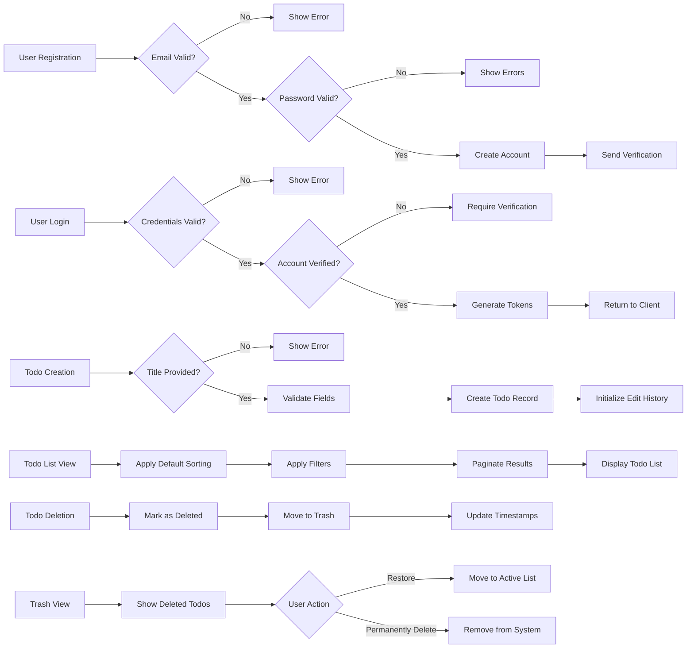

# Multi-User Todo Application Requirements

## 1. User Account Management

### 1.1 Account Registration

WHEN a new user provides valid registration information, THE TodoApp SHALL create a new user account with the following requirements:

1. THE system SHALL collect email address and password during registration
2. THE system SHALL validate that the email address is not already in use
3. THE system SHALL enforce password complexity requirements
4. THE system SHALL create a new user profile with default settings
5. THE system SHALL return appropriate success or error responses

### 1.2 Email Validation

WHEN a user submits an email address during registration, THE system SHALL:

- Validate the email format conforms to standard email structure
- Check that no existing account uses the same email address
- Send a verification email to confirm ownership of the address
- Create the account in a pending state until email verification is complete

### 1.3 Password Requirements

THE system SHALL enforce the following password policies during registration:

- Minimum 8 characters in length
- Include at least one uppercase letter
- Include at least one lowercase letter
- Include at least one numeric digit
- Include at least one special character
- Not contain the user's email address
- Not be a common dictionary word

### 1.4 Account Authentication

WHEN a user submits login credentials, THE system SHALL authenticate the user and establish a session with the following steps:

1. THE system SHALL validate the email and password combination
2. THE system SHALL verify the account is active and verified
3. THE system SHALL generate authentication tokens
4. THE system SHALL return tokens to the client
5. THE system SHALL log the login event for security monitoring

### 1.5 Session Management

WHILE a user is actively using the TodoApp, THE system SHALL:

- Validate session tokens on each authenticated request
- Automatically extend session expiration with continued use
- Track last activity timestamp for each session
- Allow multiple concurrent sessions from different devices
- Provide session management capabilities in user settings

### 1.6 Password Management

WHEN a user requests to change their password, THE system SHALL:

- Validate current password before allowing change
- Enforce all password complexity requirements
- Encrypt and securely store the new password
- Invalidate all existing sessions
- Send notification of password change to user's email
- Prevent reuse of recent passwords

### 1.7 Account Deletion

WHEN a user requests to delete their account, THE system SHALL:

1. Mark the account as scheduled for deletion
2. Begin background deletion of all user-generated content including todos and edit histories
3. Remove authentication credentials
4. Remove profile information
5. Complete all deletion processes within 30 days

## 2. User Profile Management

### 2.1 Profile Information

THE todoUser profile SHALL consist of the following information:

- Email address (provided during registration, used for authentication)
- Display name (user-editable, for personal identification)
- Account creation timestamp
- Last profile update timestamp

### 2.2 Display Name Management

WHEN a todoUser navigates to their profile management interface, THE system SHALL display their current display name. WHEN a todoUser submits a new display name through the profile editing interface, THE system SHALL validate and update the display name.

THE system SHALL enforce the following display name requirements:

- Minimum length of 1 character
- Maximum length of 50 characters
- Allow alphanumeric characters, spaces, and common punctuation
- Prohibit offensive or inappropriate content (system-defined)

### 2.3 Profile Privacy

THE system SHALL ensure that todoUser profile information is completely private. WHILE any todoUser is viewing the application, THE system SHALL NOT display profile information of other todoUser actors. WHERE a todoUser's display name is referenced in the system (e.g., in edit history), THE system SHALL only display that information within the context of the todoUser's own data.

## 3. Todo Operations

### 3.1 Todo Creation

WHEN a todoUser accesses the todo creation interface, THE system SHALL display a form with the following fields:
- Title (required text field)
- Description (optional text field)
- Start date (optional date field)
- Due date (optional date field)

WHEN a todoUser submits a new todo with a title, THE system SHALL create a new todo record with:
- Title set to the provided value
- Description set to the provided value or empty if not provided
- Start date set to the provided value or null if not provided
- Due date set to the provided value or null if not provided
- Completion status set to incomplete by default
- Creation timestamp set to current system time
- Owner set to the authenticated todoUser
- Edit history initialized as empty

### 3.2 Todo Field Validation

THE system SHALL validate todo fields according to the following rules:
- Title SHALL be a non-empty string with maximum length of 255 characters
- Description SHALL be a string with maximum length of 1000 characters
- Start date SHALL be a valid date or null
- Due date SHALL be a valid date or null
- Due date SHALL not be earlier than start date if both are provided

### 3.3 Todo List Viewing

WHEN a todoUser accesses their todo list, THE system SHALL display a paginated list of their todos sorted by creation date (newest first) by default.

THE system SHALL display the following information for each todo in the list:
- Title
- Completion status (complete/incomplete)
- Start date (if set)
- Due date (if set)
- Creation date

WHEN a todoUser navigates to a specific page in the todo list, THE system SHALL display the appropriate subset of todos based on the pagination settings.

### 3.4 Single Todo Viewing

WHEN a todoUser views a single todo, THE system SHALL display all todo details including:
- Title
- Description (full text)
- Start date (if set)
- Due date (if set)
- Creation date
- Last modified date
- Completion status
- Owner information (current user only)

### 3.5 Todo Update Process

WHEN a todoUser edits a todo, THE system SHALL allow modification of:
- Title
- Description
- Start date
- Due date

WHEN a todoUser submits changes to a todo, THE system SHALL:
1. Validate the updated fields according to the validation rules
2. Update the todo with the new values
3. Record the update in the todo's edit history
4. Update the last modified timestamp

### 3.6 Todo Completion Toggle

WHEN a todoUser toggles the completion status of a todo, THE system SHALL:
1. Switch the completion status between complete and incomplete
2. Record the status change in the todo's edit history
3. Update the last modified timestamp

### 3.7 Todo Deletion (Soft Delete)

WHEN a todoUser deletes a todo, THE system SHALL perform a soft delete by:
1. Marking the todo as deleted (moving to trash)
2. Setting a deletion timestamp
3. Removing the todo from the normal todo list view
4. Preserving all todo data including edit history

## 4. Edit History Management

### 4.1 History Recording

WHEN a todoUser modifies any field of a todo, THE system SHALL create a new entry in the todo's edit history containing:
- Timestamp of the edit
- User who made the edit (always the owner)
- Changes made to each field (title, description, start date, due date)

THE edit history SHALL record only the fields that were actually changed in each edit operation.

### 4.2 History Viewing

WHEN a todoUser views the edit history of a todo, THE system SHALL display:
- All historical changes sorted from most recent to oldest
- Timestamp of each edit
- What each field was changed to (if changed)
- User who made each edit (always the current user for their own todos)

### 4.3 History Retention

THE system SHALL retain edit history entries for the entire lifetime of their associated todo. Edit history entries SHALL persist as long as their associated todo exists in the system.

WHEN a todo is moved to the trash, THE system SHALL retain all edit history entries associated with that todo. These entries SHALL remain accessible if the todo is restored from the trash.

IF a todo is permanently deleted, THEN THE system SHALL immediately delete all associated edit history entries.

## 5. Trash System Management

### 5.1 Trash Viewing

THE trash system SHALL provide a dedicated trash view for todoUser actors to access their deleted todos.

THE trash view SHALL display todos in a paginated list similar to the regular todo list.

WHEN a todoUser accesses the trash view, THE system SHALL display only todos that belong to that specific user and are currently in the trash.

Each todo in the trash list SHALL display:
- Todo title
- Original creation date
- Date the todo was moved to trash
- Original completion status at time of deletion

### 5.2 Restoring from Trash

WHEN a todoUser selects to restore a todo from the trash, THE system SHALL move the todo back to the user's regular todo list with all original data intact.

WHEN a todo is restored from the trash, THE system SHALL preserve all historical data including:
- All original todo fields (title, description, dates, etc.)
- Completion status at the time of restoration
- Complete edit history
- Trash entry timestamp

### 5.3 Permanent Deletion

THE trash system SHALL allow todoUser actors to permanently delete todos from the trash.

WHEN a todoUser permanently deletes a todo from the trash, THE system SHALL:
- Remove the todo and all associated data from the system
- Delete all edit history entries associated with that todo
- Ensure no trace of the todo remains in the database
- Return a success confirmation to the user

## 6. Todo Filtering and Sorting

### 6.1 Filtering Options

THE system SHALL provide the following filtering options for todo lists:
- All todos (no filter)
- Only complete todos
- Only incomplete todos

WHEN a todoUser applies a filter, THE system SHALL update the todo list to show only todos matching the filter criteria.

### 6.2 Sorting Options

THE system SHALL provide the following sorting options:
- Creation date (newest first or oldest first)
- Start date (earliest first or latest first)
- Due date (earliest first or latest first)

WHEN sorting by start date or due date, todos without these dates SHALL appear at the end of the list.

THE default sort order SHALL be creation date newest first.

## 7. Data Privacy and Security

### 7.1 Data Isolation

THE system SHALL implement strict data isolation ensuring that:
- Todos created by one todoUser are completely inaccessible to other todoUser actors
- Profile information of one todoUser is completely private to that user
- Edit history of todos is only accessible to the todoUser who created those todos
- Deleted todos and their associated data remain inaccessible to other users

### 7.2 User Data Ownership

THE todoUser SHALL retain complete ownership of all data created within their account including:
- Todo items and their associated metadata
- Todo edit histories
- Profile information
- Account settings

### 7.3 Account Data Deletion

WHEN a todoUser account deletion process completes, THE system SHALL ensure that all data associated with a deleted account is permanently removed including:
- All todos in active and trash states
- All todo edit history records
- All profile information
- All account settings
- All authentication records
- All session information

IF the system retains any anonymized data for analytical purposes, THE system SHALL ensure that no personally identifiable information remains associated with such data.

