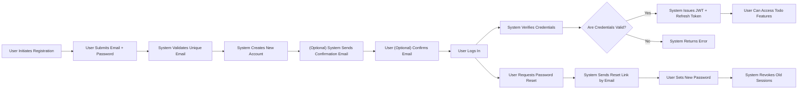

# User Actors and Permissions – Todo List Application

## User Actor Definitions

| Actor Name | Description                                                                           |
|------------|---------------------------------------------------------------------------------------|
| user       | A registered user who can securely manage their account and only their own todo items. |

**Responsibilities:**
- SHALL register, log in, log out, and manage their authentication credentials.
- SHALL manage, view, create, update, and delete only their own todo items.
- SHALL maintain the security of their session and abide by password and authentication rules.

**Limitations:**
- SHALL NOT view, alter, nor delete data belonging to any other user.
- SHALL NOT access features not explicitly permitted (no administrative actor or functions in MVP).
- SHALL NOT perform any protected operation unless authenticated with valid credentials.

**Business Requirement (EARS format):**
- WHEN a user is registered and authenticated, THE system SHALL allow full CRUD access to only their own todo items.
- IF a user is not authenticated, THEN THE system SHALL deny access to all todo features.
- IF a user attempts to access/moderate another user's data, THEN THE system SHALL return a permission error without revealing resource details.

## Authentication Flows

### Registration and Login
- Users SHALL register using a unique, validated email and a strong password.
- WHEN valid credentials are provided, THE system SHALL authenticate and initialize a session for the user.
- THE system SHALL issue an access token and refresh token per token policy (see below).
- WHEN login fails, THE system SHALL NOT disclose whether it was the email or password that was incorrect.
- WHEN login attempts exceed permitted rate, THE system SHALL temporarily lock out the account or require retry after delay.

### Password Management
- WHEN a user forgets their password, THE system SHALL provide a secure reset mechanism via verified email address.
- WHEN a user changes their password, THE system SHALL immediately revoke all outstanding tokens.

### Session Flow
- WHEN the user logs out, THE system SHALL invalidate all session and refresh tokens immediately, preventing further use.

### Authentication and Session Flow Diagram

## Permission Matrix

| Feature / Action                        | user |
|:---------------------------------------- |:-----:|
| Register and authenticate (login)        |  ✅   |
| Logout                                  |  ✅   |
| Create, view, update, or delete own todos|  ✅   |
| Manage other users' todos or settings    |  ❌   |
| Access admin or management features      |  ❌   |
| Reset or change password                 |  ✅   |

**EARS Requirements:**
- WHEN a user is authenticated, THE system SHALL permit creation, viewing, editing, and deleting of their own todo items.
- IF a user is NOT authenticated, THEN THE system SHALL DENY all access to todo resources, responding with HTTP 401 and appropriate error codes.
- IF a user attempts to read or manipulate another user's todo item, THEN THE system SHALL deny the operation and return an HTTP 403 with error code (FORBIDDEN_OWNERSHIP).
- WHEN a user logs out, THE system SHALL promptly invalidate all issued tokens to prevent reuse.

## Session and Token Management

- THE system SHALL use JWT (JSON Web Token) for stateless authentication.
- THE system SHALL issue an access token (valid 15–30 min) for all authorized requests.
- THE system SHALL issue a refresh token (valid 7–30 days) to permit session renewal without new login.
- THE JWT payload SHALL include userId, role ("user"), and a permissions array specific to the actor.
- THE system SHALL sign JWT tokens with secure algorithms and managed secrets.
- Tokens SHALL NOT contain any sensitive data such as passwords.
- THE system SHALL enforce token expiry and require re-authentication or refresh on expiry.
- WHEN a user changes password, THE system SHALL invalidate all outstanding refresh tokens for the user immediately.

## Business Rules
- Each account SHALL have a unique, verified email address; duplicate emails are prohibited.
- THE system SHALL enforce strong password requirements and provide guidance at registration.
- WHEN authenticated, THE system SHALL restrict all todo CRUD operations to the items owned by the authenticated user.

## Error and Exception Handling

- IF a non-authenticated user accesses any protected resource, THEN THE system SHALL respond with HTTP 401 and error code AUTH_REQUIRED.
- IF a user attempts any action on resources they do not own, THEN THE system SHALL respond with HTTP 403 and error code FORBIDDEN_OWNERSHIP and SHALL NOT reveal whether the resource exists or not.
- WHEN credentials are invalid, THE system SHALL return a generic error to avoid leaking account existence information.
- IF any token is invalid, expired, or revoked, THEN THE system SHALL require the user to re-authenticate.
- WHEN a user attempts to register with an already used email, THE system SHALL return a clear error indicating that account creation failed.

## Performance and Experience
- WHEN authenticating, THE system SHALL respond to valid credential requests within 2 seconds.
- THE system SHALL complete all authenticated todo operations (CRUD) within 2 seconds in typical use cases.
- WHEN authentication or authorization fails, THE system SHALL return an error code and user-facing message within 2 seconds.

## Additional Considerations

- Actor and permission coverage here reflects the minimal viable requirements for a Todo list product.
- Any future actor or permission expansion SHALL require extension and update of these matrices and authentication flows.
