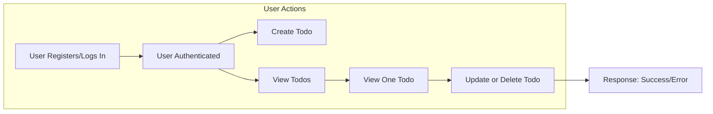

# Todo List Application – Requirements Analysis

## Introduction
The Todo List application enables individual users to manage personal tasks efficiently and securely. Targeted at non-technical audiences seeking simplicity, its purpose is to provide the essential digital experience for creating, reviewing, updating, and deleting daily to-dos anywhere, anytime, without distraction or administrative overhead. The overarching project objectives are to maximize user productivity, guarantee user privacy, and keep technology overhead minimal. The application delivers these goals by enforcing strict data ownership, clear user authentication, and robust error handling throughout all core experiences.

## Todo CRUD Requirements

### Create Todo
- WHEN a user submits a request to create a todo, THE system SHALL require the user to be authenticated.
- WHEN a user creates a todo, THE system SHALL require a non-empty title.
- WHEN a valid optional description is provided, THE system SHALL save it.
- WHEN a todo is created, THE system SHALL timestamp and associate it only with the creator's account.
- IF the title field is missing or empty, THEN THE system SHALL reject the request and return error: "A title is required."
- IF authentication is missing or invalid, THEN THE system SHALL reject the request and return error: "Authentication required."
- WHEN a todo is created, THE system SHALL set its status to "incomplete".

### Read/List Todos
- WHEN a user requests a todo list, THE system SHALL require authentication and show only that user’s todos, sorted newest first.
- WHERE search/filter parameters exist, THE system SHALL honor and apply them.
- WHERE a user requests a specific todo by id, THE system SHALL return it only if owned by the requester.
- IF a user requests a todo not owned by them, THEN THE system SHALL return error: "Access denied."
- EACH todo object SHALL include: id, title, status, description (if present), creation timestamp, and last updated timestamp.

### Update Todo
- WHEN a user updates a todo, THE system SHALL require authentication and ownership.
- WHEN updating, THE system SHALL require at least one changed field.
- IF a user attempts an update to a todo not theirs, THEN THE system SHALL return error: "Access denied."
- IF the new title is empty, THEN THE system SHALL reject the update and return error: "A title is required."
- WHEN successfully updated, THE system SHALL update the last updated timestamp (UTC).
- WHEN updating status, THE system SHALL accept only: "incomplete" or "complete".

### Delete Todo
- WHEN a user requests deletion, THE system SHALL require authentication and ownership.
- IF todo is not found or not owned, THEN THE system SHALL return error: "Not found or unauthorized."
- WHEN deleted, THE system SHALL remove the todo but may log for audit compliance (optional).

## User Management

### User Registration
- WHEN a new user registers, THE system SHALL require a valid email and password.
- WHEN registering, THE system SHALL ensure the email isn’t already registered.
- IF email is duplicated, THEN THE system SHALL reject the request and return error: "Email already used."
- WHEN registering, THE system SHALL store email and securely-hashed password.

### Authentication & Session Handling
- WHEN credentials are valid, THE system SHALL authenticate and issue a JWT token.
- WHEN a user logs out, THE system SHALL invalidate the current token.
- IF an expired/invalid token is used, THEN THE system SHALL return error: "Invalid session. Please sign in again."

### Permissions and Access Control
- THE user actor (registered user) SHALL perform CRUD only on their own todos.
- IF access/mutation of non-owned data is attempted, THEN THE system SHALL return error: "Access denied."

## Data Ownership and Access Control

- THE system SHALL segregate user data; no user may access another’s data under any circumstance.
- ON EVERY todo operation (create/read/update/delete), THE system SHALL verify ownership matches the authenticated user.
- IF ownership check fails, THE system SHALL reject request with authorization error.

| Actor | Create Todo | Read Own Todos | Update Own Todos | Delete Own Todos |
|-------|-------------|---------------|------------------|------------------|
| User  |     X       |      X        |        X         |        X         |
| User (others')|     -       |      -        |        -         |        -         |

## Operational Constraints

- THE system SHALL validate all input fields for proper type/length: title ≤ 255 char, description ≤ 2000 char.
- THE system SHALL reject single field > 4KB or total request > 10KB.
- ALL valid requests SHALL receive a response in ≤2 seconds under normal load.
- THE system SHALL return clear, actionable error messages, e.g. “Authentication required”, “Title is missing”, “Todo not found”.

## User Interaction & Workflows

### Main Workflow Diagram

## Business Logic and Validation

- THE "status" field SHALL be either "incomplete" or "complete".
- THE system SHALL trim whitespace from text fields on create/update.
- THE system SHALL NOT expose todo title uniqueness globally (optional business rule; user-specific uniqueness allowed).
- THE system SHALL allow (future) account deletion/restoration (beyond MVP, not implemented at this stage).

## Error Handling & Performance

- IF operation fails (missing/invalid fields, unauthorized, etc.), THEN THE system SHALL return error specifying the issue.
- THE system SHALL NEVER leak info about existence of others’ todos.
- IF unhandled system error occurs, THEN THE system SHALL return generic error, never exposing internals.
- UBIQUITOUS: THE system SHALL provide user-facing errors and handle all scenarios gracefully.

## Appendix: EARS Requirements Type Table

| EARS Type         | Example Requirement                                                                         |
|-------------------|--------------------------------------------------------------------------------------------|
| Ubiquitous        | THE system SHALL validate all input data for type and length.                              |
| Event-driven      | WHEN a user creates a todo, THE system SHALL set its status to 'incomplete'.               |
| State-driven      | WHILE the user is authenticated, THE system SHALL allow access to their todo list.         |
| Unwanted Behavior | IF authentication fails, THEN THE system SHALL reject the request and return an error.     |
| Optional          | WHERE search filters are provided, THE system SHALL apply them to the todo list returned.  |