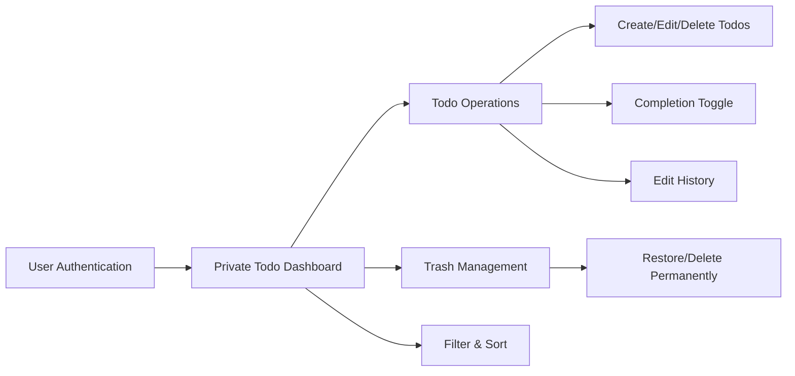

# Multi-User Todo Application Requirements Specification

## 1. Overview

THE todoApp system SHALL provide a secure, multi-user todo management application where each user maintains completely private todo lists with no visibility into other users' data.

## 2. User Account Management

### 2.1 User Registration

WHEN a new user provides valid registration information, THE system SHALL create a new todoUser account with secure authentication credentials.

THE system SHALL collect the following information during registration:
- Email address (required, validated format)
- Password (required, meeting security requirements)

THE system SHALL validate that:
- Email address is not already in use by another account
- Password meets complexity requirements (min 8 characters with uppercase, lowercase, number, and special character)

IF registration information is invalid, THEN THE system SHALL return specific error messages for each validation failure without revealing which emails exist in the system.

### 2.2 User Authentication

WHEN a user provides valid email and password credentials, THE system SHALL authenticate the user and establish a secure session with time-limited tokens.

THE system SHALL implement token-based authentication with:
- Access tokens for immediate authentication (30-minute expiration)
- Refresh tokens for extending sessions (30-day expiration)
- Secure storage and transmission of tokens

IF authentication fails, THEN THE system SHALL return a generic authentication error without indicating whether the email or password was incorrect to prevent account enumeration attacks.

### 2.3 Password Management

WHEN an authenticated todoUser requests to change their password, THE system SHALL validate the current password and update the authentication credentials if the new password meets all requirements.

THE system SHALL enforce password policies including:
- Minimum 8 characters
- Contains at least one uppercase letter
- Contains at least one lowercase letter
- Contains at least one numeric digit
- Contains at least one special character
- Not contain user's email or common dictionary words

THE system SHALL invalidate all active sessions when a password is changed to enhance security.

### 2.4 Account Deletion

WHEN an authenticated todoUser requests to delete their account, THE system SHALL require explicit confirmation of the permanent nature of this action.

THE system SHALL clearly inform the todoUser that account deletion will permanently remove:
- All todo items created by the todoUser
- All todo edit histories
- All data in the todoUser's trash
- All profile information
- All account settings and preferences

WHEN a todoUser confirms account deletion, THE system SHALL immediately begin the deletion process:
1. Mark the account as scheduled for deletion
2. Begin background deletion of all user-generated content
3. Remove authentication credentials
4. Remove profile information
5. Complete all deletion processes within 30 days

THE system SHALL ensure that all data associated with a deleted account is permanently removed including:
- All todos in active and trash states
- All todo edit history records
- All profile information
- All account settings
- All authentication records
- All session information

## 3. User Profile Management

### 3.1 Profile Information

THE todoUser profile SHALL consist of:
- Email address (provided during registration, used for authentication)
- Display name (user-editable, for personal identification)

WHEN a todoUser navigates to their profile management interface, THE system SHALL display their current display name.

### 3.2 Display Name Management

WHEN a todoUser submits a new display name through the profile editing interface, THE system SHALL validate and update the display name.

THE system SHALL enforce the following display name requirements:
- Minimum length of 1 character
- Maximum length of 50 characters
- Allow alphanumeric characters, spaces, and common punctuation
- Prohibit offensive or inappropriate content

IF a todoUser attempts to save a display name that violates system policies, THEN THE system SHALL reject the update and provide an appropriate error message.

### 3.3 Profile Privacy

THE system SHALL ensure that todoUser profile information is completely private and inaccessible to other todoUser actors.

## 4. Todo Creation and Management

### 4.1 Todo Creation

WHEN a todoUser accesses the todo creation interface, THE system SHALL display a form with the following fields:
- Title (required text field)
- Description (optional text field)
- Start date (optional date field)
- Due date (optional date field)

WHEN a todoUser submits a new todo with a title, THE system SHALL create a new todo record with:
- Title set to the provided value
- Description set to the provided value or empty if not provided
- Start date set to the provided value or null if not provided
- Due date set to the provided value or null if not provided
- Completion status set to incomplete by default
- Creation timestamp set to current system time
- Owner set to the authenticated todoUser
- Edit history initialized as empty

IF a todoUser attempts to create a todo without providing a title, THEN THE system SHALL reject the creation request and display an error message indicating that title is required.

### 4.2 Todo Field Validation

THE system SHALL validate todo fields according to the following rules:
- Title SHALL be a non-empty string with maximum length of 255 characters
- Description SHALL be a string with maximum length of 1000 characters
- Start date SHALL be a valid date or null
- Due date SHALL be a valid date or null
- Due date SHALL not be earlier than start date if both are provided

### 4.3 Todo Viewing

WHEN a todoUser accesses their todo list, THE system SHALL display a paginated list of their todos sorted by creation date (newest first) by default.

THE system SHALL display the following information for each todo in the list:
- Title
- Completion status (complete/incomplete)
- Start date (if set)
- Due date (if set)
- Creation date

WHEN a todoUser navigates to a specific page in the todo list, THE system SHALL display the appropriate subset of todos based on the pagination settings.

THE default pagination SHALL display 20 todos per page.

WHEN a todoUser views a single todo, THE system SHALL display all todo details including:
- Title
- Description (full text)
- Start date (if set)
- Due date (if set)
- Creation date
- Last modified date
- Completion status
- Owner information (current user only)

IF a todoUser attempts to view a todo they do not own, THE system SHALL deny access and return an appropriate error response.

### 4.4 Todo Completion Toggle

WHEN a todoUser toggles the completion status of a todo, THE system SHALL:
1. Switch the completion status between complete and incomplete
2. Record the status change in the todo's edit history
3. Update the last modified timestamp

THE completion status toggle SHALL be instantaneous and provide immediate visual feedback to the user.

### 4.5 Todo Editing

WHEN a todoUser edits a todo, THE system SHALL allow modification of:
- Title
- Description
- Start date
- Due date

WHEN a todoUser submits changes to a todo, THE system SHALL:
1. Validate the updated fields according to the validation rules
2. Update the todo with the new values
3. Record the update in the todo's edit history
4. Update the last modified timestamp

IF a todoUser attempts to update a todo they do not own, THEN THE system SHALL deny the update request and return an appropriate error response.

### 4.6 Edit History

WHEN a todoUser modifies any field of a todo, THE system SHALL create a new entry in the todo's edit history containing:
- Timestamp of the edit
- User who made the edit (always the owner)
- Changes made to each field (title, description, start date, due date)

THE edit history SHALL record only the fields that were actually changed in each edit operation.

WHEN a todoUser views the edit history of a todo, THE system SHALL display:
- All historical changes sorted from most recent to oldest
- Timestamp of each edit
- What each field was changed to (if changed)
- User who made each edit (always the current user for their own todos)

THE system SHALL preserve edit history for all todos until the todo is permanently deleted.

## 5. Todo Deletion

### 5.1 Soft Deletion

WHEN a todoUser deletes a todo, THE system SHALL perform a soft delete by:
1. Marking the todo as deleted (moving to trash)
2. Setting a deletion timestamp
3. Removing the todo from the normal todo list view
4. Preserving all todo data including edit history

WHEN a todoUser attempts to delete a todo they do not own, THEN THE system SHALL deny the deletion request and return an appropriate error response.

### 5.2 Trash System

THE system SHALL provide a dedicated trash view for todoUser actors to access their deleted todos.

WHEN a todoUser accesses the trash view, THE system SHALL display only todos that belong to that specific user and are currently in the trash.

THE trash view SHALL display todos in a paginated list similar to the regular todo list.

THE trash system SHALL allow todoUser actors to either restore deleted todos or permanently delete them.

WHEN a todoUser selects to restore a todo from the trash, THE system SHALL move the todo back to the user's regular todo list with all original data intact.

WHEN a todoUser permanently deletes a todo from the trash, THE system SHALL:
- Remove the todo and all associated data from the system
- Delete all edit history entries associated with that todo
- Ensure no trace of the todo remains in the database
- Return a success confirmation to the user

## 6. Todo Filtering and Sorting

### 6.1 Filtering Options

THE system SHALL provide the following filtering options for todo lists:
- All todos (no filter)
- Only complete todos
- Only incomplete todos

WHEN a todoUser applies a filter, THE system SHALL update the todo list to show only todos matching the filter criteria.

### 6.2 Sorting Options

THE system SHALL provide the following sorting options:
- Creation date (newest first or oldest first)
- Start date (earliest first or latest first)
- Due date (earliest first or latest first)

WHEN sorting by start date or due date, todos without these dates SHALL appear at the end of the list.

THE default sort order SHALL be creation date newest first.

## 7. Data Privacy and Security

### 7.1 Data Isolation

THE system SHALL ensure that each todoUser's data is completely isolated from all other todoUser actors with no capability for cross-user data access or sharing.

THE system SHALL validate ownership on all todo operations to ensure users can only access data they own.

THE system SHALL implement data isolation at all levels including:
- Database query level
- API endpoint level
- User interface level

### 7.2 Data Protection

THE system SHALL ensure that when a todoUser deletes their account, all associated data is permanently removed from the system.

THE system SHALL securely hash all password credentials using industry-standard algorithms.

THE system SHALL prevent users from viewing account information or todo data of other users through any means including direct URL manipulation.

## 8. Business Rules

### 8.1 Account Management Rules

- Users can only register with unique email addresses
- Users must verify email addresses during registration
- Users can change their password after validating current password
- Account deletion is permanent and irreversible
- Display names must not violate community guidelines

### 8.2 Todo Management Rules

- Todos can only be accessed by their creator
- New todos are incomplete by default
- Todos can be soft deleted and restored
- Permanent deletion removes all data including edit history
- Editing a todo creates a history entry
- Sorting respects null date values appropriately
- Pagination improves performance for large todo lists

### 8.3 System-wide Rules

- All operations require authentication
- All error responses should be user-friendly
- System should respond to operations within 2 seconds
- No cross-user data access is permitted under any circumstances
- Data must be retained only for as long as the user maintains an account

## 9. Performance Requirements

### 9.1 Response Times

THE system SHALL process all todo operations within 2 seconds under normal load conditions.

THE system SHALL support pagination for todo lists to improve response times with large datasets.

### 9.2 Data Retention

THE system SHALL retain user data only for as long as the user maintains an active account.

WHEN a user deletes their account, THE system SHALL permanently remove all associated data within 30 days.

## 10. System Constraints

### 10.1 Technical Constraints

- All user data must be encrypted in transit using TLS/SSL
- Passwords must be securely hashed using industry standards
- Tokens must be securely stored and transmitted
- Edit history must be preserved for non-permanently-deleted todos
- System must implement proper input validation and sanitization

### 10.2 Business Constraints

- No functionality for sharing todos between users
- No public viewing of any todo data
- Complete data isolation between user accounts
- User-controlled data deletion
- No administrator access to user todo data