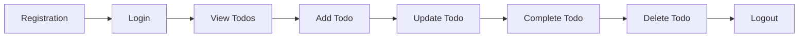
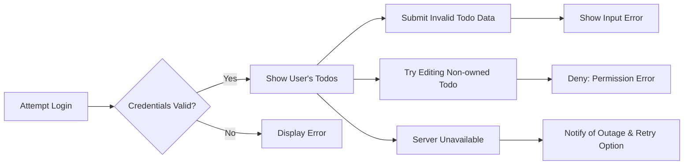

# Todo List Application Requirements (User-Centric Minimal Functionality)

## Persona Overview

### User
The only actor in this system is the authenticated user. Each user represents an individual who wants to track and manage their personal tasks with privacy, reliability, and instant feedback. Each account is self-owned, with exclusive access to its todos and personal information. 

- **Motivations:**
  - Manage daily and recurring tasks efficiently
  - Avoid missing important items or deadlines
  - Privately organize personal and work-related commitments
- **Behaviors:**
  - Registers, authenticates, and recovers an account with only email and password
  - Manages a unique todo list (create, update, complete, delete)
  - Expects immediate update/feedback for every action
- **Expectations:**
  - Simplicity, speed, and robustness
  - Complete privacy; only the owner can see, modify, or delete their own data
  - Rapid, reliable error feedback for all edge cases

## Functional Requirements (EARS Format)

### Registration and Onboarding
- WHEN a user submits valid registration data, THE system SHALL create a new, unique account associated with the given email and password.
- IF registration fails (e.g., email in use or weak password), THEN THE system SHALL return a clear, specific error message within 2 seconds.
- WHEN registration succeeds, THE system SHALL log the user in by establishing an authenticated session.

### Authentication and Authorization
- WHEN a user submits correct credentials, THE system SHALL authenticate the user and grant access to their personal todos only.
- IF credentials are invalid or unregistered, THEN THE system SHALL reject authentication and provide a relevant error (never disclosing if the account exists).
- WHERE a session expires, THE system SHALL require re-login before allowing any access to todos or account details.

### Todo CRUD Operations
- WHEN an authenticated user requests to view their todos, THE system SHALL return only todos owned by the user, sorted by creation or due date.
- WHERE a user's todo list is empty, THE system SHALL notify with an encouragement to add new todos.
- WHEN a user adds a valid todo (must include text, may include due date), THE system SHALL persist the new todo, linking it exclusively to the user.
- IF a user submits incomplete or invalid data when adding/updating a todo, THEN THE system SHALL block the action and enumerate all input errors.
- WHEN a user edits a todo item they own, THE system SHALL update only that item and return the modified details instantly.
- IF a user attempts to edit, complete, or delete a todo not owned by them (or nonexistent), THEN THE system SHALL refuse with a permission or not found error.
- WHEN a user marks their todo as complete, THE system SHALL update the status immediately and reflect this in list views.
- WHEN a user deletes a todo, THE system SHALL permanently remove the item with no residual access by any party.

### Password Recovery and Session Management
- WHEN a user requests a password reset, THE system SHALL email a secure reset link to the registered address, but never leak whether the email exists.
- WHEN a user logs out, THE system SHALL immediately invalidate the session.
- WHERE a user logs in from another device or browser, THE system SHALL synchronize all data instantly.

### Error Handling and Feedback
- IF any server, network, or unexpected error occurs, THEN THE system SHALL provide an explanatory message within 2 seconds and log details for support (while never leaking internal info to end users).
- WHEN data cannot be saved due to loss of connectivity, THE system SHALL clearly inform the user and allow retry after recovery.

### Data Ownership, Security, and Privacy
- THE system SHALL guarantee that each user's todos and account data are only accessible to that user—never shared or visible to others in any way.
- THE system SHALL enforce strict authentication before any operation.
- THE system SHALL use secure password hashing/storing; never in plaintext.
- THE system SHALL follow privacy best practices: not exposing emails in error responses, anonymizing logs, and preventing user enumeration.

### Minimal Feature Scope
- THE system SHALL include only those features strictly necessary for managing a personal todo list (registration, authentication, adding, updating, marking as complete, deleting, and viewing todos, password reset, and session management).
- THE system SHALL exclude collaboration, sharing, advanced notification/scheduling, or any social or billing functionalities.

## End-to-End User Flow: Happy Path

## Error and Edge Case Flow

## Permission and Privacy Matrix

| Actor | Can Read | Can Create | Can Update | Can Delete |
|-------|----------|------------|------------|------------|
| User  | Own only | Own only   | Own only   | Own only   |

- No cross-user data access at any time.
- All actions require authentication and occur strictly within the user's own data context.

## Glossary
- **Todo**: User-created task (text required, due date optional, completed/incomplete status), always owned by a single user.
- **User**: Authenticated individual with exclusive access to their own todos and account.

## Further Reading
- For extended error handling, see the full [Exception Handling and Errors](./09-exception-handling-and-errors.md)
- For backend logic, consult [Functional Requirements](./05-functional-requirements.md)
- For technical authentication/security references, review [User Actors and Permissions](./04-user-actors-and-permissions.md)
