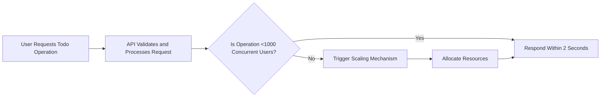
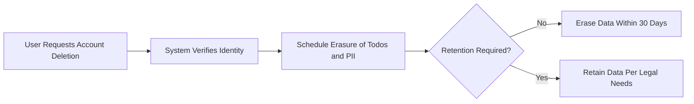

# Non-Functional Requirements for Todo List Application

## Performance Expectations

WHEN a user interacts with Todo functionalities (create, modify, view, delete todos or manage account), THE system SHALL provide an API response within 1 second under normal operation (up to 100 concurrent users). WHEN system load increases to up to 1,000 concurrent users, THE system SHALL maintain API response times under 2 seconds for all core actions. THE system SHALL deliver 99.95% uptime monthly, with no more than 21.6 minutes of downtime. WHEN maintenance is scheduled, THE system SHALL alert users at least 48 hours in advance via email or dashboard messages. WHEN batch operations are performed (e.g., batch deletion of up to 100 todos), THE system SHALL complete all requests within 3 seconds. WHEN users renew sessions or reauthenticate, THE system SHALL validate and complete the session process in under 1 second.

## Security Standards

### Authentication & Authorization
WHEN a user attempts to access or modify Todo functionality, THE system SHALL require authentication using a strong password during registration and login. JWT tokens SHALL be used for all authenticated API access, managed securely; token handling complies with enterprise best practices. WHEN an unauthenticated or unauthorized API request is made, THE system SHALL deny access and return a clear, actionable error. WHERE a user tries to access or modify another user's todos, THE system SHALL block the action and alert the user to insufficient permissions. ALL failed login, registration, and permission-related events SHALL be logged for security monitoring.

### Data Security
THE system SHALL transmit all sensitive data—including passwords, tokens, and personal details—exclusively over secure encrypted channels (TLS 1.2+). Passwords SHALL be hashed and salted using robust algorithms (bcrypt or similar). THE system SHALL NEVER log passwords, tokens, or private credentials in plain text under any circumstances. WHERE repeated failed authentication occurs, THE system SHALL throttle requests using rate limiting and implement account lockout protocols to prevent brute force attacks.

### Vulnerability Management
THE system SHALL be routinely scanned for known vulnerabilities; critical security patches SHALL be applied within 72 hours of release. WHEN a critical security event is detected, THE system SHALL immediately initiate incident response protocols, alert security staff, and log all related actions for auditing.

## Data Privacy

WHEN users register or use Todo services, THE system SHALL collect and retain only the minimal PII necessary (such as email and password). PII SHALL NEVER be shared with third parties without the user's explicit consent. WHEN a user requests account deletion, THE system SHALL permanently erase all associated PII and todo records within 30 days, except where retention is required by law. THE system SHALL enable users to view, export, or download their own todo data and PII upon request within 7 days. WHERE data must be retained for legal compliance, THE system SHALL provide disclosure during registration and within the privacy policy.

## Compliance and Trustworthiness

WHEN the Todo list system operates in regions with data privacy or security laws (e.g., GDPR), THE system SHALL comply with all relevant regulations. ALL user consents for privacy acceptance SHALL be tracked with auditable records. IF a privacy or security breach occurs, THE system SHALL notify affected users within 72 hours. Periodic reviews of compliance status and user communication channels for breach notification SHALL be maintained.

## Scalability and Availability

THE system SHALL scale horizontally to support up to 10,000 concurrent users while maintaining performance standards. WHEN system demand exceeds the current capacity, THE system SHALL provision additional resources automatically via cloud or container orchestration. All critical backend services SHALL be redundant; IF a critical component fails, THE system SHALL fail over to backup services and notify system administrators within 1 minute. Scheduled and unscheduled downtimes SHALL be managed with real-time user communication and post-event summaries.

## Maintainability and Operability

WHEN backend changes or upgrades occur, THE system SHALL maintain operational availability through blue-green deployment, canary releasing, or similar strategies, ensuring near-zero downtime. ALL API responses SHALL include clear, actionable error codes (as specified in Exception Handling guidelines). Complete, time-stamped logs for all sensitive operations—authentication, todo management, data access, errors—SHALL be maintained and auditable for a minimum retention period. Regular maintenance windows SHALL be announced 48 hours in advance.

## Monitoring and Auditability

THE system SHALL provide real-time performance monitoring, error tracking, uptime dashboards, and security event reporting. Security staff or authorized personnel SHALL have access to comprehensive audit trails for authentication, critical business actions (e.g., account/todo deletion, batch actions), and data exports. Audit logs SHALL be retained securely for no less than 90 days at all times. System SHALL trigger alerts for abnormal error rates, performance degradation, or security incidents immediately upon detection.

## Disaster Recovery and Backup

THE system SHALL perform daily full data backups and hourly incremental backups for operational data. WHEN a critical failure occurs, THE system SHALL support restoration from the last backup within 2 hours. Regularly scheduled tests of disaster recovery protocols SHALL verify that data loss (RPO) is at most 1 hour and normal service (RTO) is resumed within 2 hours. WHEN any user or todo data is lost, THE system SHALL communicate relevant incident details to all impacted users within 24 hours and ensure recovery or compensation steps are underway.

## Summary of Business Impact

IF these non-functional requirements are not met, THEN user trust, business continuity, and legal compliance are at severe risk. THE above requirements are essential to ensure user satisfaction, retention, service reliability, data integrity, and competitive market positioning. Constant adherence is necessary for reputation and business success.