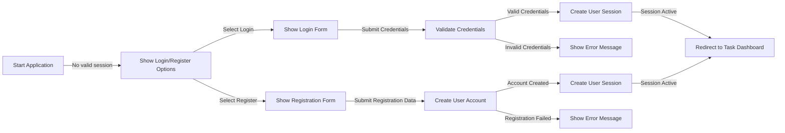
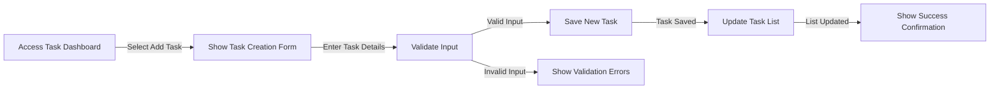
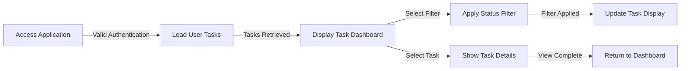
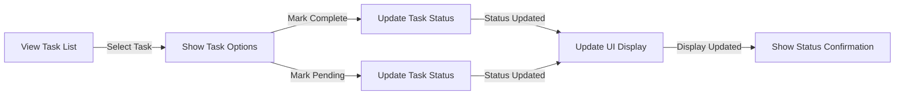
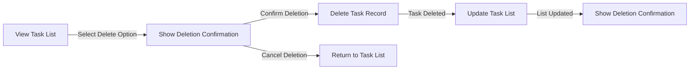

# Todo List Application - User Flow Documentation

## Table of Contents
1. [Overview](#overview)
2. [User Authentication Flow](#user-authentication-flow)
3. [Task Creation Flow](#task-creation-flow)
4. [Task Management Flow](#task-management-flow)
5. [Task Completion Flow](#task-completion-flow)
6. [Task Deletion Flow](#task-deletion-flow)
7. [Developer Note](#developer-note)

## Overview

This document defines the user flows for the Todo List application. It describes the step-by-step processes that users will follow to accomplish tasks within the application, including authentication, task creation, management, completion, and deletion. These flows are designed to be simple and intuitive, focusing on the essential functionality required for a minimal Todo list application.

The user flows outlined in this document are intended to guide backend developers in implementing the appropriate APIs, services, and business logic to support these user interactions. Each flow represents a complete user journey from start to finish, detailing all necessary steps, decision points, and system responses.

## User Authentication Flow

The authentication flow defines how users gain access to the Todo List application and maintain their sessions. Since all functionality requires user authentication, this is the first flow users will experience.

**WHEN** a user accesses the Todo List application without a valid session, THE system SHALL present options to either login or register.

**WHEN** a user selects the login option, THE system SHALL display a login form requiring email and password.

**WHEN** a user submits valid login credentials, THE system SHALL authenticate the user and create a session with a valid JWT token containing the user identifier and role.

**WHEN** a user submits invalid login credentials, THE system SHALL display an appropriate error message without revealing whether the email or password was incorrect.

**WHEN** a user selects the registration option, THE system SHALL display a registration form requiring email, password, and password confirmation.

**WHEN** a user submits valid registration data, THE system SHALL create a new user account with standard member privileges.

**WHEN** a user submits invalid registration data, THE system SHALL display specific validation error messages for each failed validation.

**WHEN** a user successfully logs in or registers, THE system SHALL redirect them to their personal task dashboard.

## Task Creation Flow

The task creation flow describes how users add new tasks to their Todo list. This is one of the core functions of the application and must be straightforward and reliable.

**WHEN** a user accesses their task dashboard, THE system SHALL display an option to add a new task.

**WHEN** a user selects to add a new task, THE system SHALL present a task creation form with fields for task description and optional due date.

**WHEN** a user submits a new task with valid information, THE system SHALL save the task with a pending completion status and associate it with the authenticated user.

**WHEN** a user submits a task with invalid information, THE system SHALL display appropriate validation error messages indicating which fields failed validation.

**WHEN** a task is successfully created, THE system SHALL add it to the user's task list in the appropriate position based on the application's sorting rules.

**WHEN** a task with a due date is created, THE system SHALL store the due date in ISO 8601 format for consistent processing.

## Task Management Flow

The task management flow covers how users view and navigate their existing tasks. This includes loading tasks, filtering by status, and basic navigation between different views.

**WHEN** an authenticated user accesses their task dashboard, THE system SHALL retrieve all tasks associated with that user from storage.

**WHEN** tasks are retrieved for a user, THE system SHALL display them organized by creation date with newest tasks first.

**WHEN** a user selects a filtering option, THE system SHALL update the displayed task list to show only tasks matching the selected filter criteria.

**WHEN** a user selects a specific task from their list, THE system SHALL display detailed information about that task.

**WHEN** a user navigates away from task details, THE system SHALL return them to their task dashboard with their previous view state preserved.

**WHEN** multiple tasks exist, THE system SHALL paginate the task list with a maximum of 20 tasks per page to ensure optimal performance.

## Task Completion Flow

The task completion flow describes how users mark tasks as complete or pending. This is a core interaction pattern in a Todo application and must be intuitive.

**WHEN** a user views their task list, THE system SHALL display each task with its current completion status clearly indicated.

**WHEN** a user selects to mark a pending task as complete, THE system SHALL update the task's status to completed and record the completion timestamp.

**WHEN** a user selects to mark a completed task as pending, THE system SHALL update the task's status to pending and clear any completion timestamp.

**WHEN** a task's status is changed, THE system SHALL immediately reflect this change in the user interface without requiring a page refresh.

**WHEN** a user completes a task, THE system SHALL visually distinguish completed tasks from pending tasks in the task list.

**WHEN** a user filters their task list by completion status, THE system SHALL show only tasks matching the selected status (pending, completed, or all).

## Task Deletion Flow

The task deletion flow outlines how users remove tasks from their Todo list. This flow includes confirmation steps to prevent accidental deletion.

**WHEN** a user selects the delete option for a task, THE system SHALL present a confirmation dialog to prevent accidental deletion.

**WHEN** a user confirms deletion of a task, THE system SHALL permanently remove the task record from storage.

**WHEN** a user cancels deletion of a task, THE system SHALL return them to their task list without making any changes.

**WHEN** a task is deleted, THE system SHALL immediately update the task list display to remove the deleted task.

**WHEN** a task is successfully deleted, THE system SHALL show a confirmation message to the user.

**WHEN** a user attempts to delete a task with invalid permissions, THE system SHALL deny the deletion request and show an appropriate error message.

## Developer Note

This document defines business requirements and user flows only. All technical implementation decisions, including API design, database structure, and frontend implementation, are at the discretion of the development team. The flows described should guide the overall structure of the application, but developers are encouraged to implement them using appropriate patterns and technologies for the chosen stack.