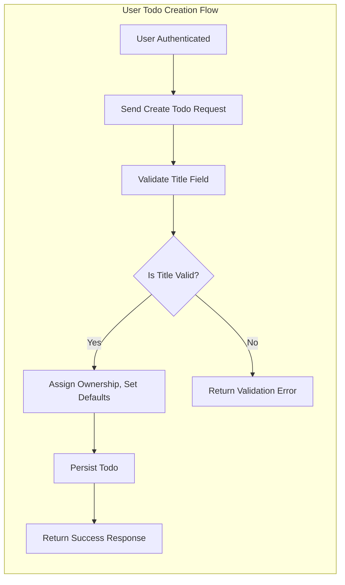

# Business Rules and Validation Logic for Todo List

## Todo Validation Logic

### General Todo Rules
- WHEN a user is authenticated, THE system SHALL allow the user to create, view, update, and delete their own todo items.
- WHEN a todo item is created, THE system SHALL strictly associate it with the user who created it, and SHALL prevent any user from modifying or viewing todos owned by others.
- WHILE a todo exists, THE system SHALL verify all properties comply with required business constraints at all times to maintain data integrity.

### Todo Field Requirements (EARS)
- THE todo item SHALL require a title that is not empty and does not exceed 255 characters in length.
- IF a user tries to provide a title that is empty or longer than 255 characters, THEN THE system SHALL reject the request and provide a clear validation error message.
- THE todo item SHALL allow an optional description with a limit of 1,000 characters; IF a user input exceeds this, THEN THE system SHALL truncate or reject the extra input and notify the user.
- THE todo item SHALL include an optional completion status (boolean: completed/not completed), which by default SHALL be set to 'not completed' when created.
- THE todo item SHALL allow an optional due date. WHEN a due date is provided, THE system SHALL require it to be formatted as an ISO 8601 date string and represent a point in the future. IF the date is invalid or already past, THEN THE system SHALL reject the input with a validation error.
- THE system SHALL automatically generate a universally unique identifier (UUID) for every todo item upon creation.
- THE system SHALL automatically record both the creation and update timestamps (createdAt, updatedAt) for each todo item, updating them appropriately on every change.

### Ownership, Permissions, and Data Integrity
- WHEN a user attempts to access, update, or delete a todo item, THE system SHALL verify that the todo is owned by the requesting user. IF the user does not own the item, THEN THE system SHALL deny access and return a clear error message.
- THE system SHALL require todo items to be created one at a time (no bulk creation in a single request is allowed), to help maintain integrity and prevent abuse.
- WHEN a modification is made to a todo (update or delete), THE system SHALL perform the operation atomically to prevent data races or transaction inconsistencies.
- IF a user attempts to assign a todo item to another user's account or modify ownership, THEN THE system SHALL reject the request and return a permission error.
- IF a user tries to update or delete a todo item that does not exist, THE system SHALL respond with an error indicating the item was not found.

## User Registration Rules

- WHEN a new user wants to register, THE system SHALL request a unique, valid email address and a password containing at least 8 characters.
- IF the email address is already in use, THEN THE system SHALL reject registration and specify that the email is already registered.
- THE system SHALL require password entry and confirmation to match. IF they do not match, THEN THE system SHALL reject registration with an error explaining the mismatch.
- THE system SHALL securely hash all passwords before storing them, using current industry best practices (e.g., bcrypt, Argon2), and SHALL never include passwords in any outbound response or logs.
- WHEN the user attempts to authenticate, THE system SHALL verify credentials and establish a session using JWT (JSON Web Token)-based authentication for all protected actions pertaining to todos.
- WHEN a user logs out or their session expires, THE system SHALL invalidate the session and deny subsequent authenticated operations until re-authentication.

## Error Handling

- WHEN a user submits data that fails validation (such as missing or invalid required fields, exceeding character limits, or formatting errors), THE system SHALL return a structured, user-friendly error response that explains the precise cause and, where possible, suggests how to fix it.
- WHEN a user attempts to perform an operation without sufficient permission (such as accessing or modifying another user's todo), THE system SHALL respond with a clear permission error and SHALL not leak any information about the existence of the item.
- WHEN a user attempts to interact with the service without being authenticated, THE system SHALL return an authentication error and provide instructions to sign in.
- IF an unexpected internal error occurs, THEN THE system SHALL provide a generic error message and ensure that no sensitive system information or stack traces are included in the response. Internal details SHALL be logged securely for diagnostics.
- All error messages returned to users SHALL be actionable, indicating what went wrong and, if appropriate, the steps required to resolve the issue.

---

## Summary Table: Major Business Rules

| Area | Rule (EARS) |
|------|-------------|
| Todo Title | THE todo item SHALL require a non-empty title of max 255 chars. |
| Todo Description | THE todo item SHALL allow optional description up to 1000 chars. |
| Todo Due Date | IF due date is provided, THE system SHALL ensure it is a valid future ISO 8601 date. |
| Status | THE todo item SHALL default to 'not completed' status at creation. |
| Ownership | WHEN CRUD on todos, THE system SHALL allow access only to item owner. |
| Registration | THE user SHALL register with unique email and password >= 8 chars. |
| Auth Required | THE system SHALL require auth for all todo operations. |
| Error Handling | IF validation or access errors, THEN THE system SHALL return clear reasoned errors. |