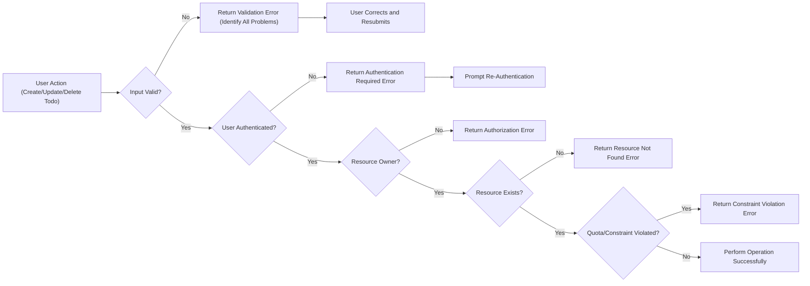

# Todo List Application: Comprehensive Requirements Analysis

## 1. Application Overview
The Todo List application enables users to manage their personal and work tasks efficiently with minimal effort. Its design prioritizes simplicity, reliability, and user empowerment. The service supports secure task CRUD operations, personalized task management, and robust error handling to maintain user trust and operational transparency under all circumstances.

## 2. User Actors & Roles
- **User**: Individual with the ability to register, authenticate, and manage their personal todo items.

## 3. User Stories & Scenarios
### Typical Usage Scenarios
- WHEN a user wants to keep track of their daily tasks and responsibilities, THE system SHALL allow the creation, viewing, updating, and deletion of todo items in their private todo list.
- WHEN a user opens the application, THE system SHALL present all current todos, clearly indicating their status (active/completed).
- WHEN a user marks a task as completed or re-opens a completed task, THE system SHALL update the status and reflect this immediately in the displayed list.
- WHEN a user needs to edit or reorganize a todo, THE system SHALL enable in-place editing and optionally allow sorting or prioritization using a minimal user interface.

### Edge Cases
- WHEN a user attempts to interact with a todo item that was deleted or modified from another device or session, THE system SHALL display the current accurate status (not found, changed), and enable recovery if possible.
- WHEN multiple users are permitted in the future, access SHALL remain isolated at all times (each user sees only their own todos).

## 4. Functional Requirements
- WHEN a user creates a todo item, THE system SHALL require a title and optionally allow a description, due date, and priority.
- WHEN a user requests to update a todo item, THE system SHALL validate user ownership and update only if the item exists and belongs to the requesting user.
- WHEN a user deletes a todo item, THE system SHALL remove it if ownership is confirmed or inform the user if not found or deleted already.
- WHEN a user marks a todo completed, THE system SHALL update its state without deletion.
- WHEN a user attempts to create a below-minimum or empty todo, THE system SHALL reject the entry and prompt for the required content.
- WHEN a user attempts to create multiple todos with identical titles while active, THE system SHALL reject duplicates and request a distinguishing change.

## 5. Non-Functional Requirements
- THE system SHALL support a maximum response time of 2 seconds for all operations under normal load.
- THE system SHALL preserve user inputs during temporary failures and allow resubmission with minimal friction.
- THE system SHALL store user data securely and maintain compliance with privacy best practices. All data in transit SHALL be encrypted.

## 6. Business Rules & Validation
- WHEN creating or updating a todo, THE title SHALL be required, non-empty, trimmed, and between 1 and 100 characters.
- WHEN a description is provided, IT SHALL be a maximum of 1000 characters.
- WHEN a due date is provided, THE system SHALL validate it conforms to ISO8601 date format, and disallow past dates unless explicitly permitted.
- WHEN a priority field is exposed, THE system SHALL only allow published, fixed priority values (e.g., 'low', 'normal', 'high').
- WHEN a user provides invalid input (missing required fields, exceeding limits, or using invalid characters), THE system SHALL reject with field-specific error feedback.
- WHEN duplicate titles are not allowed, enforcement SHALL be case-insensitive and ignore leading/trailing spaces.

## 7. Exception & Error Handling
_All requirements are defined using EARS format and are strictly aligned with user perspective._

- WHEN an unauthenticated user attempts to access any protected endpoint, THE system SHALL refuse access and inform the user that login is required.
- WHEN a user attempts to act upon another user's todo, THE system SHALL reject the request and clarify unauthorized access.
- WHEN invalid input is submitted, THE system SHALL reject the request, specify all invalid fields, and offer actionable instructions for correction.
- WHEN a user interacts with a non-existent or already-deleted todo, THE system SHALL inform them of its non-availability and suggest possible recovery if feasible.
- WHEN creating or updating items violates system-level constraints (quota, duplication, invalid data), THE system SHALL specify the cause and suggest alternatives.
- WHEN experiencing heavy load or planned outages, THE system SHALL explain the delay and recommend retry timelines, never exposing backend technical details.
- WHEN a session expires or becomes invalid, THE system SHALL deny actions and prompt re-authentication, preserving unsaved data where possible.
- WHEN multiple errors occur in a single operation, THE system SHALL present all problems at once, with concise actionable copy.
- WHEN technical failure or maintenance prevents operation, THE system SHALL provide standard user-friendly messaging and guidance.
- All error messages SHALL be delivered within 2 seconds of user action.

### Error and Exception Handling Flow

## 8. Authentication & Authorization
- WHEN a user registers or logs in, THE system SHALL establish a session via secure credential exchange and token issuance.
- THE system SHALL store user authentication using strong, industry-approved hashing/encryption.
- WHEN a token expires or is revoked, THE system SHALL require re-authentication and notify the user immediately.
- All authenticated operations SHALL check token validity, user identity, and action permission before proceeding.
- No user SHALL view, modify, or delete another user's todo items under any circumstance.
- WHEN users have multiple active sessions (e.g., different devices), actions SHALL remain isolated and secure in each session.

## 9. Edge Cases & Limitations
- WHEN user input triggers application rate limits or quota enforcement, THE system SHALL reject repeated requests and inform the user about waiting periods.
- WHEN simultaneous modifications occur (from another session or device), THE system SHALL handle concurrency gracefully by reporting current status and avoiding accidental data loss.
- WHEN backend operations encounter environmental failures (disconnected storage, data loss), THE system SHALL inform the user that data may not be current and advise recovery options.

## 10. Summary & Success Criteria
A Todo List application is considered successfully delivered when:
- Users can securely authenticate and manage personal todos with minimal friction.
- All CRUD operations respect clear business rules, validation constraints, and user privacy.
- Error handling is comprehensive, user-centric, and compliant with the listed scenarios, delivering feedback within 2 seconds.
- No user is able to affect another's data.
- The system gracefully manages expected and edge-case failure scenarios, empowering users to recover independently wherever feasible.

_This specification ensures that backend implementation will provide a robust, minimal, user-focused Todo List service._
