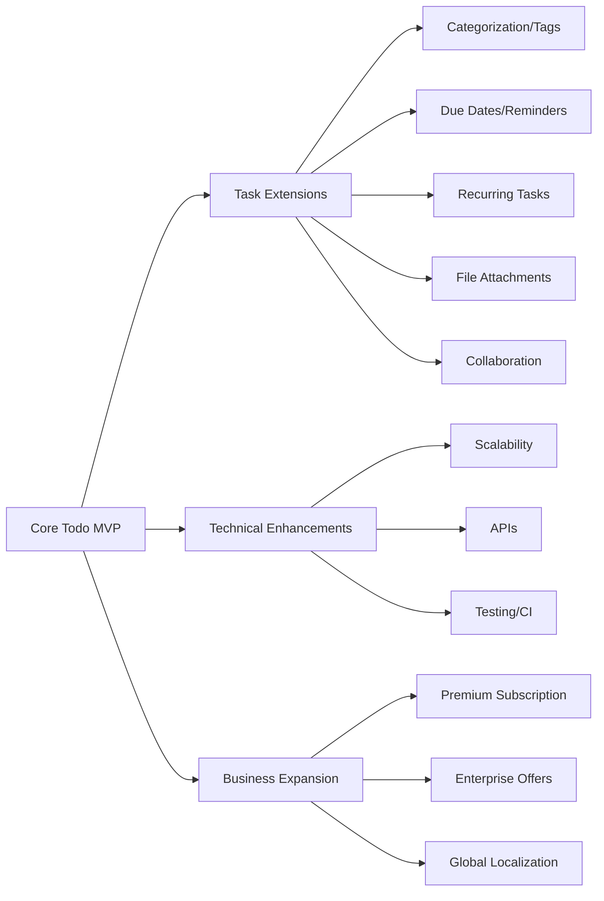

# Future Considerations and Growth Roadmap for Todo List Application

## Introduction
The Todo List application establishes a strong foundation for minimal, focused task management. This section details future strategic directions, potential feature enhancements, and long-term business opportunities designed to sustain user engagement and support the evolving needs of users and stakeholders. The intention is to ensure lasting relevance, competitive differentiation, and a clear pathway for gradual platform growth aligned with business goals.

## Potential Feature Extensions
The following feature extensions represent logical next steps beyond the minimum viable product (MVP). Each feature is described in user-centered, scenario-driven language with measurable and actionable requirements:

### 1. Task Categorization and Tagging
- WHEN users need to organize their tasks, THE system SHALL enable grouping of todo items by user-defined categories and tags.
- WHEN a user creates or edits a todo item, THE system SHALL allow assigning one or more tags to it.
- IF a user searches or filters by category or tag, THEN THE system SHALL display only the matching todo items.

### 2. Due Dates and Reminders
- WHEN users add or update a todo item, THE system SHALL support specifying a due date and optional reminders.
- IF a due date arrives and the task is still incomplete, THEN THE system SHALL send a notification using the supported communication channel.

### 3. Recurring and Repeatable Tasks
- WHEN a user creates a todo item, THE system SHALL offer an option to make the task recurring on a selectable schedule (such as daily, weekly, monthly, or custom intervals).
- WHEN a recurring task is completed, THE system SHALL automatically generate the next occurrence of the recurring task as per the recurrence pattern.

### 4. Collaboration and Shared Lists
- WHEN users want to collaborate, THE system SHALL allow sharing of todo lists with others, supporting permissions to view, edit, or complete tasks as authorized.
- IF a shared list is updated, THEN THE system SHALL notify all relevant members according to their notification preferences.

### 5. File Attachments
- WHEN users create or edit a todo, THE system SHALL enable uploading files (images, documents, etc.) attached to that task.
- WHEN reviewing a todo with attachments, THE system SHALL provide access for users to download or preview those files.

### 6. Task Prioritization and Sorting
- WHEN users manage tasks, THE system SHALL enable assigning a priority (e.g., low, medium, high, critical) to each todo item.
- WHEN viewing their to-dos, THE system SHALL provide options to sort or filter items by priority.

### 7. Calendar and Service Integration
- WHEN users wish to coordinate tasks with other tools, THE system SHALL enable integration with external calendar services (e.g., Google Calendar, Outlook) for synchronizing due dates and reminders.
- WHEN a todo’s due date changes, THE system SHALL synchronize updates with enabled external services if integration is active.

### 8. Analytics and Progress Tracking
- WHEN users want insight into their productivity, THE system SHALL display completion rates, streaks, and other engagement metrics to encourage progress.

### 9. Accessibility Enhancements
- WHEN users with disabilities interact with the platform, THE system SHALL meet accessibility standards, supporting screen readers, keyboard navigation, and visual adjustments.

### 10. Mobile Application
- WHEN users access the platform via mobile, THE system SHALL provide offline capabilities, synchronization, and timely notifications.

## Technical Improvements
Over time, the platform requires technical refinement to ensure high reliability, performance, and scalability, supporting both growth and operational excellence through:

### 1. Scalability and Performance
- WHEN user counts and data volumes increase, THE system SHALL maintain a maximum response latency of 2 seconds for all major user actions under normal load.
- WHEN required by load, THE system SHALL support horizontal scaling and dynamic resource allocation.

### 2. Security and Privacy
- WHEN handling sensitive information, THE system SHALL utilize industry-standard encryption (at rest and in transit).
- WHEN users request deletion of their data, THE system SHALL ensure complete, irreversible removal within 24 hours.

### 3. API Expansion
- WHEN third-party integration is necessary, THE system SHALL provide a public API with clear documentation, authentication, and appropriate rate limiting for developers.

### 4. Automated Testing and CI/CD
- WHEN backend changes are made, THE system SHALL enforce automated testing and continuous integration to maintain product quality and reduce the risk of downtime.

### 5. Error Recovery and Monitoring
- WHEN errors, outages, or anomalies occur, THE system SHALL log them and promptly notify technical staff for timely investigation and remediation.

## Business Growth Opportunities
Long-term sustainability requires careful business planning aligned with market demand. The following growth opportunities can drive revenue and expand the application’s reach:

### 1. Premium Subscription Model
- WHEN advanced features (such as file attachments, integrations, or analytics) are available, THE system SHALL offer them under a premium subscription, while keeping basic features free.
- THE platform SHALL present transparent comparisons between free and paid plans to users.

### 2. Team and Enterprise Offerings
- WHEN organizations require centralized management, THE system SHALL provide business plans with admin dashboards, analytics, and consolidated billing.

### 3. Strategic Partnerships and Integrations
- WHEN productivity or calendar apps are integrated, THE business SHALL pursue partnerships to enhance user acquisition, offering smooth cross-app workflows.

### 4. Localization and Internationalization
- WHEN the user base includes international customers, THE system SHALL support multiple languages, time zones, and region-specific formats.

### 5. Marketing, Referrals, and Growth
- WHEN analyzing and optimizing marketing channels such as SEO, advertising, and referrals, THE business SHALL employ data-driven strategies to maximize user acquisition.
- WHEN users refer friends, THE platform SHALL reward both the referrer and the new user with incentives (such as extended trials or credits).

## Visual Growth Roadmap

## Conclusion
This roadmap provides a clear, actionable framework for the ongoing evolution of the Todo List application. Each outlined feature, technical improvement, and business growth strategy is grounded in specific, measurable requirements, facilitating predictable and user-focused development. Ongoing refinement should leverage user feedback, technology trends, and business analysis to ensure value creation for all stakeholders.