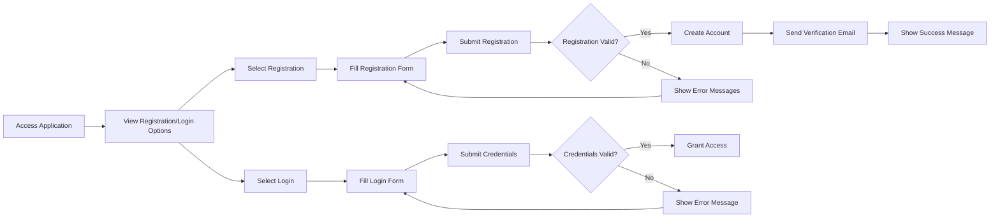
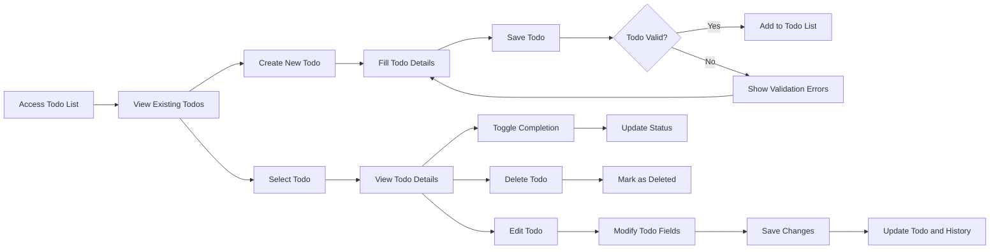
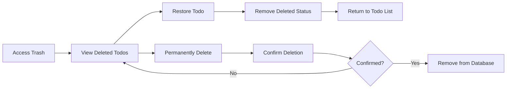

# Todo Application Requirements Analysis Report

## 1. Business Overview

### 1.1 Purpose
The Todo Application is a privacy-focused task management system that allows individual users to create, organize, and track their personal tasks in a secure environment. Each user's data is completely isolated from other users, ensuring complete privacy for all todo items.

### 1.2 Key Features
- User account management with registration, login, and profile customization
- Comprehensive todo creation with title, description, and optional date tracking
- Full edit history tracking for all todo modifications
- Soft delete functionality with trash management
- Advanced filtering and sorting capabilities
- Strict data privacy with no cross-user data access

### 1.3 Business Value
This application addresses the need for individuals to have a private, secure, and feature-rich task management solution. In an era where data privacy is increasingly important, the application provides users with complete control over their personal task data while offering robust functionality to enhance productivity.

## 2. Functional Requirements

### 2.1 User Account Management

#### 2.1.1 User Registration
WHEN a guest accesses the application, THE system SHALL provide a registration form with email and password fields.

WHEN a user submits valid registration information, THE system SHALL create a new user account and send a verification email.

IF a user attempts to register with an email that already exists, THEN THE system SHALL display an error message indicating the email is already in use.

#### 2.1.2 User Login
WHEN a user provides valid email and password credentials, THE system SHALL authenticate the user and establish a session.

IF a user provides invalid credentials, THEN THE system SHALL display an appropriate error message and log the failed attempt.

#### 2.1.3 Password Management
WHEN an authenticated user requests to change their password, THE system SHALL require the current password and a new password.

WHEN an authenticated user submits a valid password change request, THE system SHALL update the user's password and invalidate all existing sessions except the current one.

#### 2.1.4 Account Deletion
WHEN an authenticated user requests to delete their account, THE system SHALL prompt for confirmation of this irreversible action.

WHEN an authenticated user confirms account deletion, THE system SHALL permanently remove all user data including todos, profile information, and edit history.

### 2.2 User Profile Management

#### 2.2.1 Profile Creation
WHEN a user successfully registers, THE system SHALL create a default profile with the user's email as the display name.

#### 2.2.2 Profile Modification
WHEN an authenticated user updates their display name, THE system SHALL save the new display name and confirm the update.

THE system SHALL prevent users from viewing profiles of other users.

### 2.3 Todo Creation and Management

#### 2.3.1 Todo Creation
WHEN an authenticated user creates a new todo with a title, THE system SHALL save the todo with the following attributes:
- Title (required)
- Description (optional)
- Start date (optional)
- Due date (optional)
- Creation date (automatically set)
- Completion status (automatically set to incomplete)

IF a user attempts to create a todo without a title, THEN THE system SHALL reject the creation request and indicate that the title is required.

#### 2.3.2 Todo Viewing
WHEN an authenticated user accesses their todo list, THE system SHALL display only their own todos with pagination.

WHEN an authenticated user views their todo list, THE system SHALL display for each todo:
- Title
- Completion status
- Start date (if set)
- Due date (if set)
- Creation date

WHEN an authenticated user selects a specific todo, THE system SHALL display all todo details including full description.

#### 2.3.3 Todo Completion Status
WHEN an authenticated user marks a todo as complete, THE system SHALL update the completion status and record the completion date.

WHEN an authenticated user marks a completed todo as incomplete, THE system SHALL update the completion status and clear the completion date.

#### 2.3.4 Todo Editing
WHEN an authenticated user modifies any attribute of their todo (title, description, start date, or due date), THE system SHALL save the changes and create a new entry in the todo's edit history.

### 2.4 Edit History Tracking

#### 2.4.1 History Creation
WHEN an authenticated user edits any attribute of their todo, THE system SHALL create a new history entry containing:
- Timestamp of the edit
- Previous and new values for each modified field (title, description, start date, due date)

#### 2.4.2 History Viewing
WHEN an authenticated user accesses the edit history for their todo, THE system SHALL display all history entries sorted from most recent to oldest.

### 2.5 Todo Deletion and Trash Management

#### 2.5.1 Soft Deletion
WHEN an authenticated user deletes their todo, THE system SHALL mark the todo as deleted without removing it from the database.

WHEN an authenticated user views their regular todo list, THE system SHALL not display deleted todos.

#### 2.5.2 Trash Management
WHEN an authenticated user accesses the trash view, THE system SHALL display all their deleted todos with pagination.

WHEN an authenticated user restores a todo from trash, THE system SHALL remove the deleted status and return the todo to the regular todo list.

WHEN an authenticated user permanently deletes a todo from trash, THE system SHALL remove the todo and all associated edit history from the database.

### 2.6 Filtering and Sorting

#### 2.6.1 Todo Filtering
WHEN an authenticated user applies a completion status filter, THE system SHALL display only todos matching the selected filter:
- All todos (complete and incomplete)
- Only complete todos
- Only incomplete todos

#### 2.6.2 Todo Sorting
WHEN an authenticated user sorts their todo list by creation date, THE system SHALL order todos with newest first or oldest first based on user selection.

WHEN an authenticated user sorts their todo list by start date, THE system SHALL order todos with earliest first or latest first based on user selection, placing todos without start dates at the end.

WHEN an authenticated user sorts their todo list by due date, THE system SHALL order todos with earliest first or latest first based on user selection, placing todos without due dates at the end.

## 3. Non-Functional Requirements

### 3.1 Privacy and Security

THE system SHALL ensure that each user can only access their own todos, profile, and edit history.

THE system SHALL not provide any mechanism for users to access, view, or share another user's data.

THE system SHALL encrypt user passwords using industry-standard hashing algorithms.

### 3.2 Data Integrity

THE system SHALL maintain a complete history of all todo modifications for as long as the todo exists.

THE system SHALL permanently remove all user data upon account deletion.

### 3.3 Performance

WHEN a user accesses their todo list, THE system SHALL load and display the first page of results within 2 seconds.

WHEN a user performs a filtering or sorting operation, THE system SHALL update the todo list within 1 second.

### 3.4 Data Retention

THE system SHALL retain user todos and associated edit history for the duration of the user's account.

WHEN a user permanently deletes a todo, THE system SHALL remove all associated data immediately.

WHEN a user deletes their account, THE system SHALL remove all user data within 24 hours.

## 4. User Workflows

### 4.1 User Registration and Login Workflow

### 4.2 Todo Creation and Management Workflow

### 4.3 Trash Management Workflow

## 5. Business Rules

### 5.1 User Account Rules

THE system SHALL require a unique email address for each user account.

THE system SHALL enforce strong password requirements during registration and password changes.

THE system SHALL automatically log out users after a period of inactivity.

### 5.2 Todo Management Rules

THE system SHALL set all newly created todos to an incomplete status by default.

THE system SHALL preserve all todo edit history for the lifetime of the the todo.

THE system SHALL only allow users to manage todos they created.

### 5.3 Data Privacy Rules

THE system SHALL not expose any user data to other users under any circumstances.

THE system SHALL not include user data in any analytics or reporting features without explicit consent.

THE system SHALL implement role-based access controls to ensure users can only access their own data.

## 6. Error Handling

### 6.1 Authentication Errors

IF a user attempts to register with invalid information, THEN THE system SHALL display specific error messages for each invalid field.

IF a user attempts to log in with invalid credentials, THEN THE system SHALL display a generic error message without specifying which part was incorrect.

### 6.2 Todo Management Errors

IF a user attempts to create a todo without a title, THEN THE system SHALL prevent creation and highlight the required field.

IF a user attempts to access a todo they do not own, THEN THE system SHALL return a not found error.

IF the system encounters an internal error while processing a todo operation, THEN THE system SHALL log the error and display a user-friendly message.

## 7. Success Metrics

THE system SHALL be considered successful if it meets the following criteria:
- User account creation success rate exceeds 99%
- Todo operations complete within specified time limits 95% of the time
- No security breaches occur during the first year of operation
- User satisfaction ratings exceed 4.5/5.0 in post-registration surveys
- System uptime exceeds 99.5% monthly

## 8. Testing Scenarios

### 8.1 Account Management Scenarios

1. User successfully registers with valid information
2. User fails to register with duplicate email
3. User successfully logs in with valid credentials
4. User fails to log in with invalid credentials
5. User successfully changes password
6. User successfully deletes account and all associated data

### 8.2 Todo Management Scenarios

1. User creates todo with all fields populated
2. User creates todo with only required fields
3. User views todo list with pagination
4. User filters todos by completion status
5. User sorts todos by different criteria
6. User edits todo and verifies history is recorded
7. User toggles todo completion status
8. User deletes todo and verifies it moves to trash

### 8.3 Trash Management Scenarios

1. User views trash and sees deleted todos
2. User restores todo from trash
3. User permanently deletes todo from trash
4. User verifies permanent deletion removes all associated data

### 8.4 Privacy Scenarios

1. User cannot access another user's todos
2. User cannot view another user's profile
3. Deleted user data is completely removed from system

## 9. Acceptance Criteria

### 9.1 Functional Acceptance Criteria

- Users can register, login, and manage their accounts
- Users can create, view, edit, and delete todos
- All todo operations are logged in edit history
- Filtering and sorting work according to specifications
- Trash functionality enables restore and permanent deletion
- Data privacy is strictly enforced between users

### 9.2 Performance Acceptance Criteria

- Page load times meet specified requirements
- Filtering and sorting operations complete within time limits
- System handles concurrent users without degradation

### 9.3 Security Acceptance Criteria

- User data isolation is verified through testing
- Password encryption meets security standards
- Account deletion completely removes all user data

## 10. Future Considerations

WHERE the application gains significant user adoption, THE system SHALL support:
- Category or tagging systems for todos
- Recurring todo functionality
- Collaboration features with invited users
- Data export capabilities
- Mobile application integration