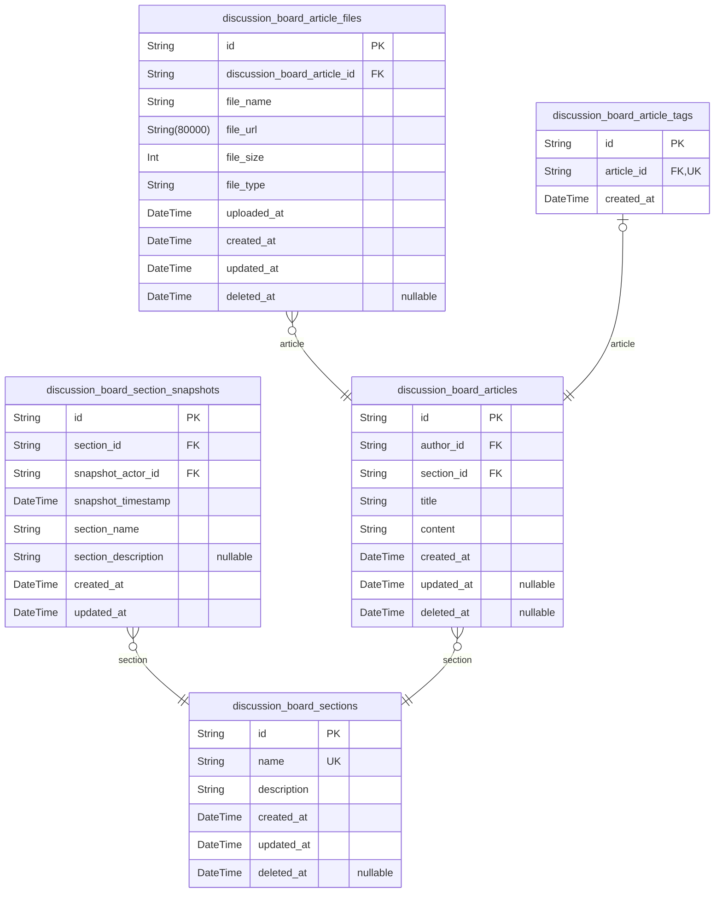
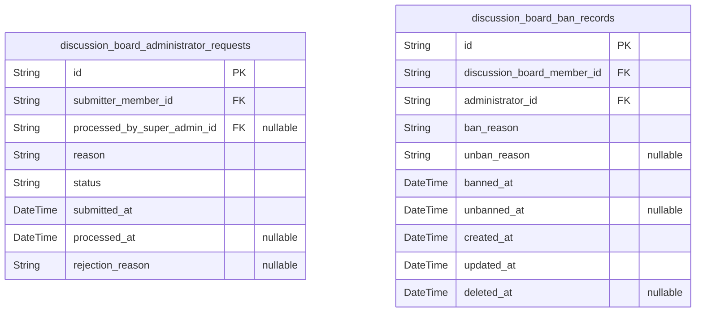

# Prisma Markdown

> Generated by [`prisma-markdown`](https://github.com/samchon/prisma-markdown)

- [Actors](#actors)
- [Sections](#sections)
- [Administrative](#administrative)

## Actors

```mermaid
erDiagram
"discussion_board_guests" {
  String id PK
  String session_token UK
  DateTime created_at
  DateTime updated_at
  DateTime deleted_at "nullable"
}
"discussion_board_guest_sessions" {
  String id PK
  String guest_id FK
  String ip
  String href
  String referrer
  DateTime created_at
  DateTime expired_at
}
"discussion_board_members" {
  String id PK
  String email UK
  String password_hash
  String display_name UK
  String bio "nullable"
  String role
  Boolean is_banned
  String ban_reason "nullable"
  DateTime created_at
  DateTime updated_at
  DateTime deleted_at "nullable"
}
"discussion_board_member_sessions" {
  String id PK
  String discussion_board_member_id FK
  String access_token
  String refresh_token
  String ip
  String referrer "nullable"
  String user_agent "nullable"
  DateTime created_at
  DateTime expired_at
  DateTime invalidated_at "nullable"
}
"discussion_board_member_password_resets" {
  String id PK
  String discussion_board_member_id FK
  String token UK
  DateTime expires_at
  DateTime used_at "nullable"
  String ip
  String href
  String referrer
  DateTime created_at
  DateTime updated_at
  DateTime deleted_at "nullable"
}
"discussion_board_admins" {
  String id PK
  String email UK
  String password_hash
  String display_name UK
  String bio "nullable"
  Boolean is_banned
  String ban_reason "nullable"
  String role
  DateTime created_at
  DateTime updated_at
  DateTime deleted_at "nullable"
}
"discussion_board_admin_sessions" {
  String id PK
  String discussion_board_admin_id FK
  String ip
  String href
  String referrer "nullable"
  String access_token
  String refresh_token UK
  DateTime created_at
  DateTime updated_at
  DateTime expired_at
}
"discussion_board_admin_password_resets" {
  String id PK
  String admin_id FK
  String token UK
  DateTime expires_at
  DateTime used_at "nullable"
  DateTime created_at
  DateTime updated_at
}
"discussion_board_super_admins" {
  String id PK
  String email UK
  String password_hash
  String display_name "nullable"
  String bio "nullable"
  DateTime created_at
  DateTime updated_at
  DateTime deleted_at "nullable"
}
"discussion_board_super_admin_sessions" {
  String id PK
  String discussion_board_super_admin_id FK
  String access_token
  String refresh_token
  String ip
  String href
  String referrer
  DateTime created_at
  DateTime expired_at
}
"discussion_board_super_admin_password_resets" {
  String id PK
  String super_admin_id FK
  String token UK
  DateTime expires_at
  DateTime created_at
  DateTime updated_at
  DateTime deleted_at "nullable"
}
"discussion_board_guest_sessions" }o--|| "discussion_board_guests" : guest
"discussion_board_member_sessions" }o--|| "discussion_board_members" : member
"discussion_board_member_password_resets" }o--|| "discussion_board_members" : member
"discussion_board_admin_sessions" }o--|| "discussion_board_admins" : admin
"discussion_board_admin_password_resets" }o--|| "discussion_board_admins" : admin
"discussion_board_super_admin_sessions" }o--|| "discussion_board_super_admins" : superAdmin
"discussion_board_super_admin_password_resets" }o--|| "discussion_board_super_admins" : superAdmin
```

### `discussion_board_guests`

Guest actor table for unauthenticated users identified by session tokens.
This table represents guest users who interact with the system without
formal authentication credentials, tracked through session tokens for
continuity while maintaining the actor pattern consistent with other user
types in the system.

Properties as follows:

- `id`: Primary Key.
- `session_token`
  > Unique session token for guest identification. Used to track guest users
  > across requests without authentication.
- `created_at`: Timestamp when the guest account was created.
- `updated_at`: Timestamp when the guest account was last updated.
- `deleted_at`
  > Timestamp when the guest account was soft-deleted. Nullable, as guests
  > are not typically deleted.

### `discussion_board_guest_sessions`

Temporary session tokens for guest access without authentication
credentials.

This table stores session records for guest (unauthenticated) users who
access the discussion board without logging in. Guest sessions allow
tracking of anonymous user activity while maintaining security through
session tokens.

## Purpose:
- Track anonymous user sessions and activity
- Maintain session state without requiring authentication
- Support time-limited guest access to the platform

## Key Relationships:
- Belongs to guest users via `guest_id`
- Each guest can have multiple sessions over time
- Sessions are temporary and expire after a period of inactivity

## Security Considerations:
- Sessions expire after a predetermined time
- IP and referrer information is logged for security auditing
- No sensitive user data is stored beyond session metadata

Properties as follows:

- `id`: Primary Key.
- `guest_id`: Guest user's [discussion_board_guests.id](#discussion_board_guests).
- `ip`: IP address of the guest user when the session was created.
- `href`: Current page URL the guest was accessing when the session started.
- `referrer`: Referrer URL showing how the guest arrived at the site.
- `created_at`: Timestamp when the session was created.
- `expired_at`: Timestamp when the session expires and becomes invalid.

### `discussion_board_members`

Member actor table storing authentication credentials and profile
information for registered users who can create articles, comments, and
request administrator privileges.

Properties as follows:

- `id`: Primary Key. Member's unique identifier.
- `email`: Unique email address for login. Required field.
- `password_hash`: Securely hashed password for authentication.
- `display_name`: User's display name (1-100 characters). Required field.
- `bio`: User's biography text. Optional field.
- `role`: User's role: guest, member, admin, or superAdmin. Required field.
- `is_banned`: Whether the member account is currently banned.
- `ban_reason`: Reason for banning the member account.
- `created_at`: Timestamp when the member account was created.
- `updated_at`: Timestamp when the member account was last updated.
- `deleted_at`: Timestamp when the member account was soft-deleted. Null if active.

### `discussion_board_member_sessions`

JWT session tokens for member authentication with access and refresh
token support.

This table tracks active login sessions for member users, storing JWT
tokens and session metadata.
Sessions are created when members log in and invalidated when they log
out or change their password.

Sessions expire after 30 days of inactivity.

Relationships:
- Belongs to: discussion_board_members (member)
- Session management: Handles login/logout and password change invalidation

Properties as follows:

- `id`: Primary Key.
- `discussion_board_member_id`: Belonged member's [discussion_board_members.id](#discussion_board_members).
- `access_token`
  > JWT access token for authentication. Short-lived token (15 minutes) used
  > for API requests.
- `refresh_token`
  > JWT refresh token for session continuation. Long-lived token (30 days)
  > used to obtain new access tokens.
- `ip`: IP address of the client when the session was created.
- `referrer`: Referrer header value when the session was created.
- `user_agent`: User agent string from the client browser.
- `created_at`
  > Timestamp when the session was created. Also serves as last activity
  > timestamp.
- `expired_at`
  > Timestamp when the session expires (30 days from created_at). Session
  > becomes invalid after this time.
- `invalidated_at`
  > Timestamp when the session was explicitly invalidated (logout or password
  > change). Null if session is still valid.

### `discussion_board_member_password_resets`

Password reset tokens for member account recovery with expiration. Tracks
reset requests, validates tokens, and records when resets are completed.
Provides security audit trail for password change operations.

## Business Purpose
- Enables secure password recovery for member accounts
- Validates reset tokens with expiration checking
- Records when password resets are completed
- Maintains audit trail for security compliance

## Key Relationships
- Belongs to discussion_board_members (member account)
- One member can have multiple password resets over time
- Used for recovery workflows, not日常 authentication

Properties as follows:

- `id`: Primary Key.
- `discussion_board_member_id`: Member's [discussion_board_members.id](#discussion_board_members) being reset.
- `token`
  > Unique password reset token for authentication. Used to verify password
  > reset requests securely.
- `expires_at`
  > Expiration time for the password reset token. Tokens must be used before
  > this time to be valid.
- `used_at`
  > Timestamp when the password was successfully reset using this token. Null
  > until reset is completed.
- `ip`: IP address where the password reset request was initiated.
- `href`: Full URL where the password reset request originated.
- `referrer`: Referrer header from the password reset request.
- `created_at`: When the password reset request was created.
- `updated_at`: When the password reset record was last updated.
- `deleted_at`: Soft delete timestamp for password reset records.

### `discussion_board_admins`

Admin actor table with email/password authentication credentials and
administrative privileges. Admins can create/edit/delete sections, delete
any articles/comments, ban/unban users, and manage administrator
requests.

Properties as follows:

- `id`: Primary Key.
- `email`: Unique admin email address used for authentication.
- `password_hash`: Hashed password for secure authentication.
- `display_name`: Admin's display name for content attribution (1-100 characters).
- `bio`: Optional biography text for admin profile.
- `is_banned`: Whether this admin account is currently banned.
- `ban_reason`: Reason for admin ban, recorded when is_banned is true.
- `role`
  > Admin role enum: 'admin' for regular administrator, 'super_admin' for
  > super administrator with elevated privileges.
- `created_at`: Timestamp when admin account was created.
- `updated_at`: Timestamp when admin account was last updated.
- `deleted_at`: Optional timestamp for soft deletion when admin account is removed.

### `discussion_board_admin_sessions`

JWT session tokens for admin authentication with access and refresh token
support.

This table tracks active admin sessions with security-relevant metadata
including IP address, requested URL, and referrer information. Each
session is associated with an admin user and contains both access and
refresh tokens for JWT-based authentication. The session expires after 30
days from last activity, with access tokens valid for 15 minutes and
refresh tokens valid for 30 days.

Properties as follows:

- `id`: Primary Key.
- `discussion_board_admin_id`: Belonged admin's @{link discussion_board_admins.id}.
- `ip`: Client IP address at login time.
- `href`: Requested URL at login time.
- `referrer`: HTTP referrer header at login time.
- `access_token`: JWT access token for authentication (15 minutes expiration).
- `refresh_token`: JWT refresh token for token refresh (30 days expiration).
- `created_at`: Session creation timestamp.
- `updated_at`: Session last update timestamp.
- `expired_at`: Session expiration timestamp (30 days from creation).

### `discussion_board_admin_password_resets`

Password reset tokens for admin account recovery with expiration. This
table stores one-time use tokens that allow administrators to reset their
passwords when they forget them. Each token is valid for a limited time
and can only be used once.

Properties as follows:

- `id`: Primary Key.
- `admin_id`: Admin's [discussion_board_admins.id](#discussion_board_admins).
- `token`: Unique password reset token.
- `expires_at`: Token expiration timestamp.
- `used_at`: Timestamp when token was used (null if unused).
- `created_at`: Token creation timestamp.
- `updated_at`: Last update timestamp.

### `discussion_board_super_admins`

Super admin actor table with email/password authentication credentials
and full administrative privileges. Stores super administrator account
information, authentication credentials, and profile data. Super admins
have full administrative capabilities including managing other
administrators, sections, and user bans.

Properties as follows:

- `id`: Primary Key.
- `email`: Super admin's email address for authentication.
- `password_hash`: Hashed password for authentication.
- `display_name`: Super admin's display name for UI presentation.
- `bio`: Super admin's biography or description.
- `created_at`: Creation timestamp.
- `updated_at`: Last update timestamp.
- `deleted_at`: Soft delete timestamp. Nullable means not deleted.

### `discussion_board_super_admin_sessions`

JWT session tokens for super admin authentication with access and refresh
token support

This table stores authentication sessions for super administrators. Each
session
represents a logged-in state with JWT access and refresh tokens. The table
includes security context information (IP address, referrer, page) for audit
trail purposes and proper session expiration tracking.

Properties as follows:

- `id`: Primary Key.
- `discussion_board_super_admin_id`
  > References the super admin user whose session this represents. {@link
  > discussion_board_super_admins.id}.
- `access_token`: JWT access token for API authentication.
- `refresh_token`: JWT refresh token for session extension.
- `ip`: IP address from which the session was initiated.
- `href`: The page URL where the user landed after authentication.
- `referrer`: The referring page that directed the user to the application.
- `created_at`: Timestamp when the session was created.
- `expired_at`: Timestamp when the session expires and becomes invalid.

### `discussion_board_super_admin_password_resets`

Password reset tokens for super admin account recovery with expiration.

This table stores secure password reset tokens for super administrators
who need to recover their account access. Each token is tied to a
specific super admin and has a defined expiration time for security
purposes.

## Usage
- Super administrators can request password resets when they forget their
credentials
- Tokens are generated with cryptographically secure random values
- Tokens expire after a defined period (typically 1 hour)
- Once used, tokens are invalidated to prevent reuse

## Security Considerations
- Tokens should be single-use and invalidated immediately after
successful password reset
- Token generation should use cryptographically secure random values
- Expired tokens should be automatically cleaned up
- Multiple concurrent reset requests may be allowed but old tokens should
be invalidated

Properties as follows:

- `id`: Primary Key.
- `super_admin_id`
  > Super admin account requesting password reset. {@link
  > discussion_board_super_admins.id}.
- `token`: Secure password reset token generated for authentication.
- `expires_at`: Token expiration timestamp. Tokens are valid until this time.
- `created_at`: When this password reset record was created.
- `updated_at`: When this password reset record was last updated.
- `deleted_at`: When this password reset record was deleted (soft delete). Null if active.

## Sections

### `discussion_board_sections`

Main sections table storing topic categories with name, description, and
creation metadata.

Properties as follows:

- `id`: Primary Key.
- `name`: Section name used for categorizing articles.
- `description`: Detailed description of the section's purpose and content focus.
- `created_at`: Timestamp when the section was created.
- `updated_at`: Timestamp when the section was last updated.
- `deleted_at`: Timestamp when the section was soft-deleted.

### `discussion_board_section_snapshots`

Point-in-time snapshots for audit trail of section changes. Captures
historical states of sections including name, description, and metadata
at the time of modification. Enables tracking of who made changes and
when, supporting compliance and rollback capabilities.

Properties as follows:

- `id`: Primary Key.
- `section_id`
  > Reference to the original section that was snapshotted. {@link
  > discussion_board_sections.id}.
- `snapshot_actor_id`
  > Reference to the administrator who triggered this snapshot
  > (created/edited section).
- `snapshot_timestamp`
  > Timestamp when this snapshot was captured (point-in-time state of
  > section).
- `section_name`
  > Name of the section at the time of snapshot (denormalized for historical
  > record).
- `section_description`
  > Description of the section at the time of snapshot (denormalized for
  > historical record).
- `created_at`: Timestamp when the original section was created.
- `updated_at`: Timestamp when the original section was last updated.

### `discussion_board_articles`

Main articles table storing topic discussions with title, content, author
reference, section assignment, and timestamps for creation tracking.

Properties as follows:

- `id`: Primary Key.
- `author_id`
  > The author of the article. [discussion_board_members.id](#discussion_board_members) or {@link
  > discussion_board_admins.id} or [discussion_board_super_admins.id](#discussion_board_super_admins)
  > or [discussion_board_guests.id](#discussion_board_guests).
- `section_id`: The section this article belongs to. [discussion_board_sections.id](#discussion_board_sections).
- `title`: The article title. Maximum 500 characters. Required field.
- `content`
  > The article content in text format. No maximum length but must not be
  > empty.
- `created_at`
  > UTC timestamp when the article was first created. Immutable after
  > creation.
- `updated_at`: UTC timestamp when the article was last modified. Updated on each edit.
- `deleted_at`
  > UTC timestamp when the article was soft-deleted. Null if article is
  > active.

### `discussion_board_article_files`

File attachments for articles with metadata. Each record represents a
single file uploaded to an article, storing the filename, URL, size,
type, and upload timestamp. File attachments are managed exclusively
through their parent articles and never created independently by users.

Properties as follows:

- `id`: Primary Key.
- `discussion_board_article_id`: Referenced article's [discussion_board_articles.id](#discussion_board_articles).
- `file_name`: Original filename as uploaded by the user.
- `file_url`: URL where the file is stored for download access.
- `file_size`: Size of the file in bytes.
- `file_type`: MIME type of the file (e.g., image/jpeg, application/pdf).
- `uploaded_at`: Timestamp when the file was uploaded.
- `created_at`: Creation timestamp.
- `updated_at`: Last update timestamp.
- `deleted_at`: Deletion timestamp for soft delete support.

### `discussion_board_article_tags`

Junction table for many-to-many relationship between articles and tags.
This table records when tags are assigned to articles, enabling content
classification and tag-based discovery. Each record links exactly one
article to exactly one tag and includes a timestamp of when the
association was created.

Properties as follows:

- `id`: Primary Key.
- `article_id`
  > Reference to the article being tagged. {@link
  > discussion_board_articles.id}.
- `created_at`: When this tag was assigned to the article.

## Administrative

### `discussion_board_administrator_requests`

User applications for elevated administrator privileges with status
tracking.

This table stores administrator privilege requests submitted by members
who want to become administrators.
Each request includes a reason text explaining the user's qualification
and motivation.

Key characteristics:
- Only members (regular users) can submit administrator requests
- Requests follow a status workflow: pending → approved or rejected
- Super administrators can approve requests to grant administrator
privileges
- Self-protection prevents users from approving their own requests
- A user can have only one active (pending) request at a time
- All requests are visible to super administrators for review

Relationships:
- Belongs to discussion_board_members (the requesting user)
- Optionally processed by discussion_board_super_admins (the approving
super admin)

Properties as follows:

- `id`: Primary Key.
- `submitter_member_id`
  > User who submitted the administrator request. {@link
  > discussion_board_members.id}.
- `processed_by_super_admin_id`
  > Super administrator who processed the request (approval or rejection).
  > [discussion_board_super_admins.id](#discussion_board_super_admins).
- `reason`
  > User's explanation for why they should become administrator. Must be
  > non-empty.
- `status`
  > Current status of the administrator request (pending, approved, or
  > rejected).
- `submitted_at`: Timestamp when the administrator request was submitted. Always required.
- `processed_at`
  > Timestamp when the request was processed (approved or rejected). Nullable
  > if pending.
- `rejection_reason`
  > Reason provided by super administrator when rejecting the request.
  > Nullable for pending or approved requests.

### `discussion_board_ban_records`

User banning actions with reason, timestamp, and status tracking. Records
when users are banned by administrators, including ban duration and
reasons. Banned users cannot log in but their existing content remains
visible. This is a primary table with full CRUD operations for
administrative workflows.

Properties as follows:

- `id`: Primary Key.
- `discussion_board_member_id`: The user being banned. [discussion_board_members.id](#discussion_board_members).
- `administrator_id`
  > The administrator who created this ban record. {@link
  > discussion_board_admins.id}.
- `ban_reason`
  > Reason for the user ban. Required field with detailed explanation from
  > the administrator.
- `unban_reason`
  > Reason for unban when user is unbanned. Optional field explaining why the
  > ban was lifted.
- `banned_at`
  > Timestamp when the ban was created. Required field indicating when the
  > user was banned.
- `unbanned_at`
  > Timestamp when the user was unbanned. Optional field indicating when the
  > ban was lifted.
- `created_at`
  > Record creation timestamp. Standard field for tracking when this record
  > was first created.
- `updated_at`
  > Record last update timestamp. Standard field for tracking when this
  > record was last modified.
- `deleted_at`
  > Soft delete timestamp. Nullable field indicating when this record was
  > soft deleted, if ever.
