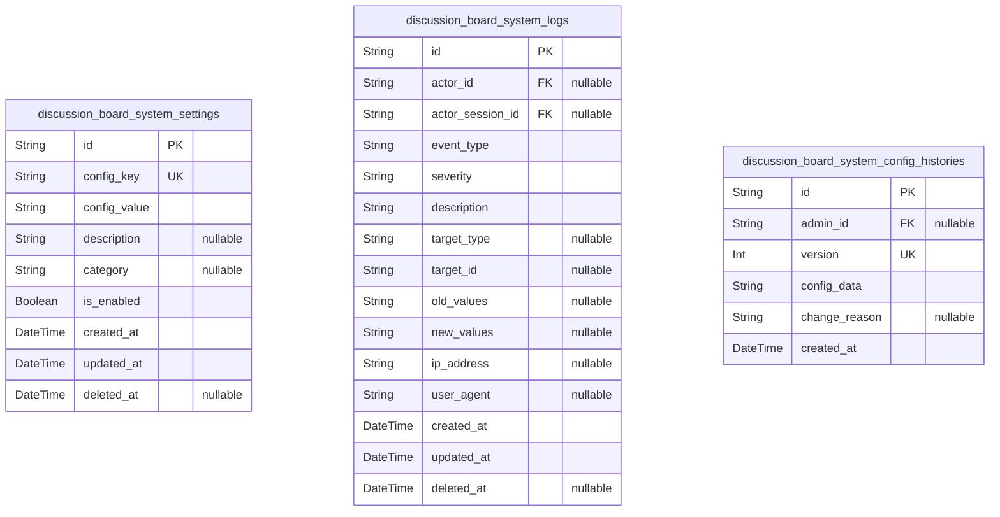
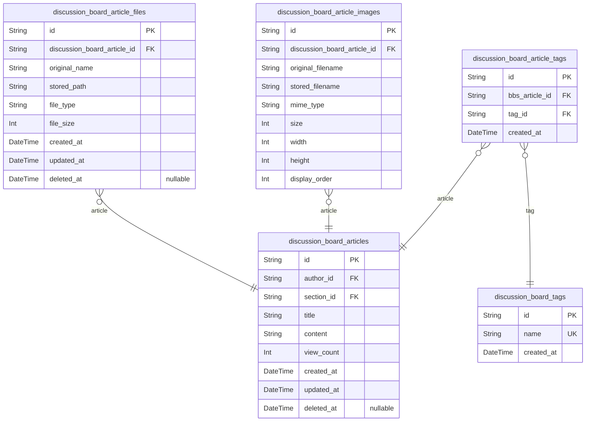
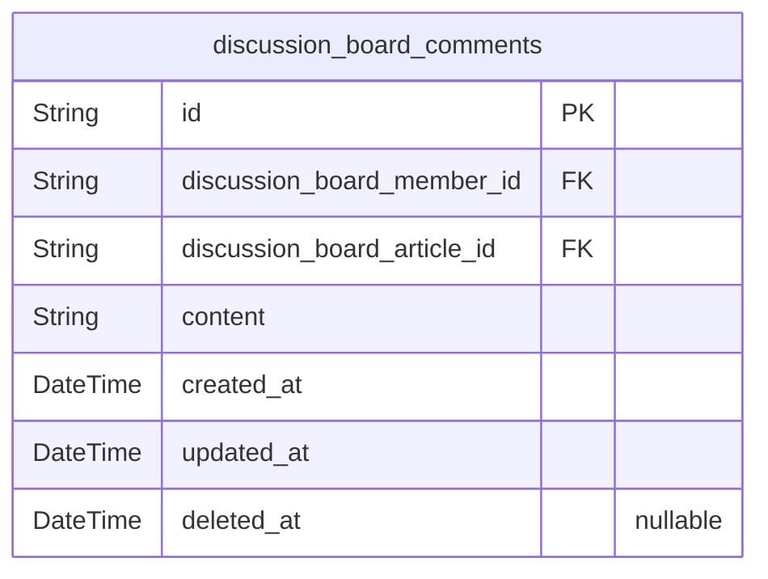
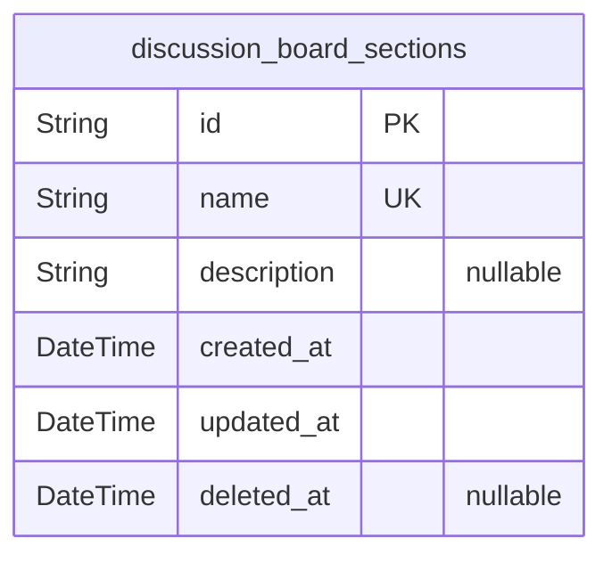
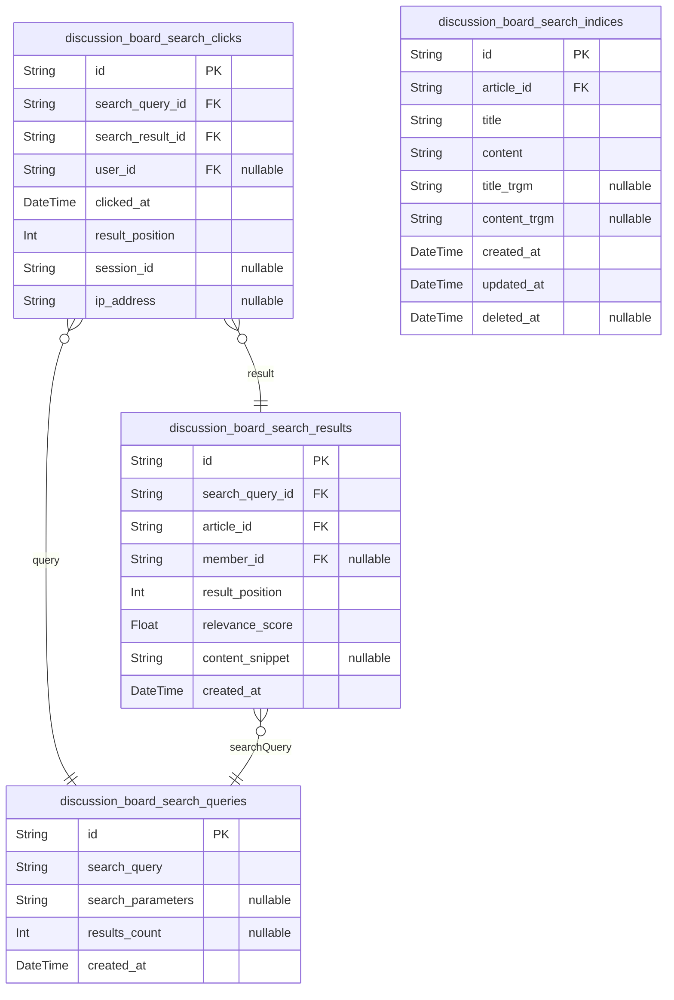
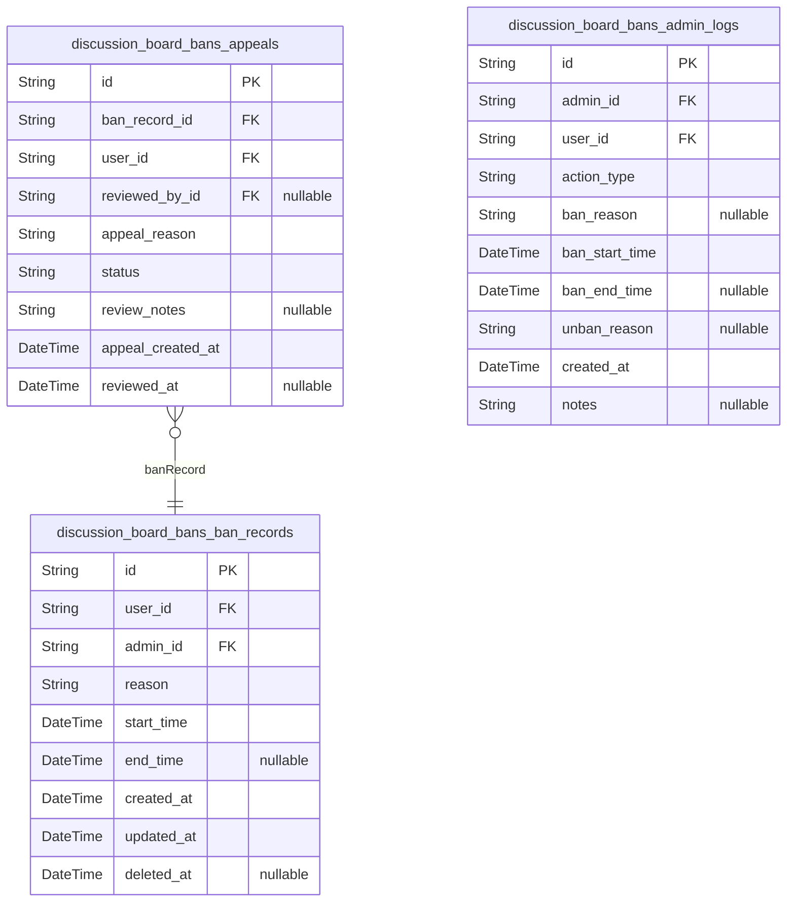
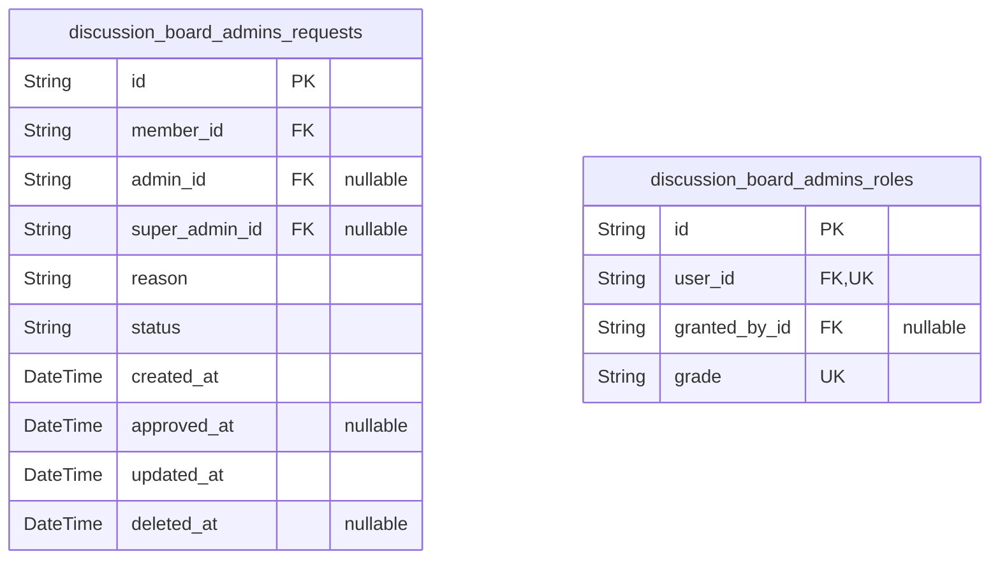

# Prisma Markdown

> Generated by [`prisma-markdown`](https://github.com/samchon/prisma-markdown)

- [Actors](#actors)
- [Systematic](#systematic)
- [Articles](#articles)
- [Comments](#comments)
- [Sections](#sections)
- [Searches](#searches)
- [Bans](#bans)
- [Admins](#admins)

## Actors

```mermaid
erDiagram
"discussion_board_members" {
  String id PK
  String email UK
  String password_hash
  String display_name
  String bio "nullable"
  DateTime created_at
  DateTime updated_at
  DateTime deleted_at "nullable"
}
"discussion_board_member_sessions" {
  String id PK
  String discussion_board_member_id FK
  DateTime created_at
  DateTime expired_at
  DateTime last_activity_at
  Boolean is_valid
  String user_agent "nullable"
  String metadata "nullable"
  String ip
  String referrer "nullable"
  String href "nullable"
}
"discussion_board_member_password_resets" {
  String id PK
  String member_id FK
  String token UK
  DateTime created_at
  DateTime expires_at
  DateTime used_at "nullable"
}
"discussion_board_member_email_verifications" {
  String id PK
  String member_id FK,UK
  String token UK
  DateTime expires_at
  DateTime verified_at "nullable"
  String ip
  String user_agent "nullable"
  DateTime created_at
  DateTime updated_at
  DateTime deleted_at "nullable"
}
"discussion_board_admins" {
  String id PK
  String member_id FK,UK
  String admin_role_id FK,UK
  String display_name
  String email UK
  String password_hash
  String bio "nullable"
  String status
  DateTime assigned_at
}
"discussion_board_admin_sessions" {
  String id PK
  String discussion_board_admin_id FK
  String ip
  String href
  String referrer "nullable"
  DateTime created_at
  DateTime expired_at
}
"discussion_board_admin_password_resets" {
  String id PK
  String admin_id FK
  String token UK
  DateTime expires_at
  DateTime used_at "nullable"
  String ip "nullable"
  String user_agent "nullable"
  DateTime created_at
  DateTime updated_at
  DateTime deleted_at "nullable"
}
"discussion_board_admin_email_verifications" {
  String id PK
  String admin_id FK
  String token UK
  DateTime expires_at
  DateTime verified_at "nullable"
  DateTime created_at
  DateTime updated_at
  DateTime deleted_at "nullable"
}
"discussion_board_super_admins" {
  String id PK
  String email UK
  String password_hash
  String display_name
  String bio "nullable"
  DateTime created_at
  DateTime updated_at
  DateTime deleted_at "nullable"
}
"discussion_board_super_admin_sessions" {
  String id PK
  String discussion_board_super_admin_id FK
  String token UK
  DateTime expires_at
  String ip
  String user_agent "nullable"
  DateTime created_at
  DateTime updated_at
  DateTime deleted_at "nullable"
}
"discussion_board_super_admin_password_resets" {
  String id PK
  String super_admin_id FK
  String token UK
  DateTime expires_at
  DateTime used_at "nullable"
  String ip
  String(80000) href
  String(80000) referrer "nullable"
  DateTime created_at
  DateTime updated_at
  DateTime deleted_at "nullable"
}
"discussion_board_super_admin_email_verifications" {
  String id PK
  String discussion_board_super_admin_id FK,UK
  String verification_token UK
  DateTime expires_at
  DateTime verified_at "nullable"
  String status
  String ip_address
  String user_agent "nullable"
  DateTime created_at
  DateTime updated_at
  DateTime deleted_at "nullable"
}
"discussion_board_guests" {
  String id PK
  String session_id UK
  DateTime first_seen_at
  DateTime last_seen_at "nullable"
  Int view_count
}
"discussion_board_guest_sessions" {
  String id PK
  String guest_id FK
  String ip
  String href
  String referrer "nullable"
  DateTime created_at
  DateTime expired_at
}
"discussion_board_member_sessions" }o--|| "discussion_board_members" : member
"discussion_board_member_password_resets" }o--|| "discussion_board_members" : member
"discussion_board_member_email_verifications" |o--|| "discussion_board_members" : member
"discussion_board_admins" |o--|| "discussion_board_members" : member
"discussion_board_admin_sessions" }o--|| "discussion_board_admins" : admin
"discussion_board_admin_password_resets" }o--|| "discussion_board_admins" : admin
"discussion_board_admin_email_verifications" }o--|| "discussion_board_admins" : admin
"discussion_board_super_admin_sessions" }o--|| "discussion_board_super_admins" : superAdmin
"discussion_board_super_admin_password_resets" }o--|| "discussion_board_super_admins" : superAdmin
"discussion_board_super_admin_email_verifications" |o--|| "discussion_board_super_admins" : superAdmin
"discussion_board_guest_sessions" }o--|| "discussion_board_guests" : guest
```

### `discussion_board_members`

Member accounts with email/password credentials for authentication. This
table serves as the primary identity record for regular members who can
create articles, write comments, and participate in discussions. Members
have standard permissions for content creation and interaction.

Properties as follows:

- `id`: Primary Key.
- `email`: Unique email address for login and communication.
- `password_hash`
  > Hashed password for authentication using industry-standard cryptographic
  > hashing.
- `display_name`: Display name shown to other users in the discussion board.
- `bio`: User's biography or profile description text.
- `created_at`: Timestamp when the member account was created.
- `updated_at`: Timestamp when the member account was last updated.
- `deleted_at`
  > Timestamp when the member account was deleted (soft delete). Null if
  > active.

### `discussion_board_member_sessions`

Member JWT session tokens for authentication tracking with connection
context and temporal audit data

Properties as follows:

- `id`: Primary Key
- `discussion_board_member_id`: Member account reference for session association
- `created_at`: Creation timestamp for audit trail
- `expired_at`: Expiration timestamp for session lifecycle
- `last_activity_at`: Last activity timestamp for session timeout tracking
- `is_valid`: Session validity status
- `user_agent`: User agent string for device identification
- `metadata`: Session metadata for debugging and monitoring
- `ip`: IP address for security audit and geolocation
- `referrer`: Referrer URL for traffic source tracking
- `href`: Current page URL being accessed

### `discussion_board_member_password_resets`

Password reset tokens for member account recovery. Stores temporary
tokens that members can use to reset their passwords when they forget
their current password. Each token is associated with a specific member
and has a limited validity period.

The system generates a unique token when a member requests password reset
and sends it to their registered email address. When the member clicks
the reset link with the token, the system validates it and allows
password change. After successful password reset, the token is marked as
used to prevent reuse.

This table follows the member authentication pattern and maintains
referential integrity with the discussion_board_members table through
foreign key relationship.

Properties as follows:

- `id`: Primary Key.
- `member_id`: Member's [discussion_board_members.id](#discussion_board_members) requesting password reset.
- `token`: Unique password reset token sent to member's email.
- `created_at`: Timestamp when password reset token was generated.
- `expires_at`: Timestamp when password reset token expires and becomes invalid.
- `used_at`
  > Timestamp when password reset token was successfully used (null until
  > used).

### `discussion_board_member_email_verifications`

Email verification tokens for member email confirmation. Stores
verification tokens sent to members during registration to confirm their
email addresses. Each member can have at most one active verification
token at a time. Tokens expire after 24 hours and are marked as verified
when the member clicks the verification link.

Properties as follows:

- `id`: Primary Key.
- `member_id`: Member's [discussion_board_members.id](#discussion_board_members) for email verification.
- `token`
  > Unique verification token for email confirmation. Randomly generated UUID
  > token sent to user's email address.
- `expires_at`
  > Timestamp when the verification token expires (always 24 hours after
  > creation).
- `verified_at`
  > Timestamp when the email was successfully verified. Null until
  > verification completes.
- `ip`
  > IP address where the verification request was made. Used for security
  > auditing.
- `user_agent`
  > User agent string from the browser where verification was requested. Used
  > for security auditing.
- `created_at`: Created At.
- `updated_at`: Updated At.
- `deleted_at`: Deleted At.

### `discussion_board_admins`

Administrator accounts with elevated privileges for content moderation
including permission management and access control

Properties as follows:

- `id`: Primary Key.
- `member_id`: Reference to the member who submitted the admin request
- `admin_role_id`: Admin's role and permissions
- `display_name`: Admin's display name
- `email`: Admin's contact email for notifications
- `password_hash`: Admin's password hash for authentication
- `bio`: Admin's bio/profile description
- `status`: Admin's status (active/inactive)
- `assigned_at`: Timestamp of admin role assignment

### `discussion_board_admin_sessions`

JWT session tokens for admin authentication. Stores connection context
and temporal data for security auditing of admin user login sessions.

Properties as follows:

- `id`: Primary Key.
- `discussion_board_admin_id`: Admin user's [discussion_board_admins.id](#discussion_board_admins).
- `ip`: IP address of the client when the session was created.
- `href`: The URL where the session was initiated.
- `referrer`: The referrer URL that led to this session.
- `created_at`: Timestamp when the session was created.
- `expired_at`: Timestamp when the session expires and becomes invalid.

### `discussion_board_admin_password_resets`

Password reset tokens for admin account recovery. Stores unique tokens
that admins can use to reset their passwords when forgotten. Each reset
request generates a unique token with expiration time and tracks usage
for security purposes.

This table supports the admin password recovery workflow by storing:
- Unique reset tokens for authentication
- Token expiration to limit validity period
- Usage tracking to prevent token reuse
- Request metadata for security auditing

Relationships:
- Parent: [discussion_board_admins](#discussion_board_admins) - admin who requested reset
- Child: [discussion_board_admin_sessions](#discussion_board_admin_sessions) - admin sessions (via
admin_id)

Security considerations:
- Tokens are single-use (deleted after use)
- Tokens expire after reasonable time period
- Request metadata helps detect suspicious activity

Properties as follows:

- `id`: Primary Key.
- `admin_id`
  > Admin account's [discussion_board_admins.id](#discussion_board_admins) requesting password
  > reset.
- `token`
  > Unique password reset token. Generated cryptographically secure random
  > value. Used to authenticate password reset requests. Single-use token
  > that's invalidated after password change.
- `expires_at`
  > Token expiration datetime. After this time, the reset token becomes
  > invalid and cannot be used. Standard expiry period: 1 hour from creation.
- `used_at`
  > Datetime when this reset token was successfully used. Null until token is
  > consumed for password change. Used for tracking and security auditing.
- `ip`
  > IP address from which password reset was requested. Captured for security
  > auditing and fraud detection purposes.
- `user_agent`
  > User agent string from the device requesting password reset. Combined
  > with IP for enhanced security tracking.
- `created_at`: Token creation timestamp.
- `updated_at`: Last update timestamp.
- `deleted_at`
  > Soft delete timestamp. When token is used or expired, it's soft-deleted
  > for audit trail preservation while keeping database clean.

### `discussion_board_admin_email_verifications`

Email verification tokens for admin account confirmation. Stores
temporary tokens sent to admin email addresses for verification during
registration or email change processes.

This table supports the admin authentication workflow by providing secure
token-based email verification. Each admin can have multiple verification
records over time, representing different verification attempts for their
email address.

Properties as follows:

- `id`: Primary Key.
- `admin_id`
  > Admin user's [discussion_board_admins.id](#discussion_board_admins). References the admin
  > account requiring email verification.
- `token`: Unique verification token sent to admin email address.
- `expires_at`: When the verification token expires and becomes invalid.
- `verified_at`
  > When the email address was successfully verified. Null if not yet
  > verified.
- `created_at`: When this verification record was created.
- `updated_at`: When this verification record was last updated.
- `deleted_at`: Soft delete timestamp for audit trail preservation.

### `discussion_board_super_admins`

Super admin accounts with complete system access and administrative
capabilities. This table represents the highest level of administrative
privilege in the discussion board system, providing full access to all
platform features including user management, content moderation, and
system configuration. Super admins can manage all other admin types
including promoting regular admins to super admin status and demoting
other super admins to regular admin status.

Properties as follows:

- `id`: Primary Key.
- `email`: Unique email address for authentication and communication.
- `password_hash`: Secure hashed password for authentication.
- `display_name`: User's display name shown in the interface.
- `bio`: Optional biography or profile description.
- `created_at`: Timestamp when the super admin account was created.
- `updated_at`: Timestamp when the super admin account was last updated.
- `deleted_at`: Optional timestamp for soft deletion of the account.

### `discussion_board_super_admin_sessions`

JWT session tokens for super admin authentication

Properties as follows:

- `id`: Primary Key.
- `discussion_board_super_admin_id`
  > Super admin user who owns this session. {@link
  > discussion_board_super_admins.id}.
- `token`: JWT token string for authentication.
- `expires_at`: Token expiration timestamp in ISO 8601 format.
- `ip`: User's last known IP address for security auditing.
- `user_agent`: User agent string from the browser/device.
- `created_at`: Timestamp when session was created.
- `updated_at`: Timestamp when session was last used/refreshed.
- `deleted_at`: Optional timestamp for session deletion (soft delete).

### `discussion_board_super_admin_password_resets`

Password reset tokens for super admin account recovery. This table tracks
password reset requests with unique tokens, expiration times, and usage
status to ensure secure account recovery workflows.

Contains records of password reset attempts with:
- Unique reset token for verification
- Expiration timestamp for security
- Timestamp of when token was used (nullable for unused tokens)
- Audit trail with IP address and request URL
- Reference to the super admin who requested the reset

Properties as follows:

- `id`: Primary Key.
- `super_admin_id`
  > Super admin's [discussion_board_super_admins.id](#discussion_board_super_admins) who requested the
  > password reset.
- `token`
  > Unique password reset token for verification. This is a secure, random
  > token sent to the user for password recovery.
- `expires_at`
  > Expiration timestamp for the password reset token. Tokens older than this
  > time are invalid.
- `used_at`
  > Timestamp when the password reset token was used. Null if the token has
  > not been used yet.
- `ip`
  > IP address from which the password reset request was made. Used for audit
  > trail and security monitoring.
- `href`
  > URL path from which the password reset was requested. Used for audit
  > trail.
- `referrer`
  > Referrer URL that led to the password reset request page. Used for
  > security analytics.
- `created_at`: When this password reset record was created.
- `updated_at`: When this password reset record was last updated.
- `deleted_at`: Soft delete timestamp for audit trail preservation.

### `discussion_board_super_admin_email_verifications`

Email verification tokens for super admin account confirmation. Stores
verification tokens, expiration timestamps, and verification status for
the email verification workflow. This is a supporting entity that is
always managed through parent super admin accounts.

Properties as follows:

- `id`: Primary Key.
- `discussion_board_super_admin_id`
  > Super admin account's [discussion_board_super_admins.id](#discussion_board_super_admins).
  > References the super admin account requiring email verification.
- `verification_token`
  > Unique verification token generated for email confirmation. Used in
  > verification links sent to super admin email addresses.
- `expires_at`
  > Timestamp when the verification token expires. Verification links become
  > invalid after this time.
- `verified_at`
  > Timestamp when the email was successfully verified. Null until
  > verification completes.
- `status`
  > Current verification status: pending (waiting for verification),
  > completed (successfully verified), or expired (token expired without
  > verification).
- `ip_address`
  > IP address of the device requesting verification. Used for security
  > auditing and fraud detection.
- `user_agent`
  > User agent string of the browser/device requesting verification. Used for
  > security auditing and device identification.
- `created_at`
  > Timestamp when this verification record was created. Standard temporal
  > field for all business entities.
- `updated_at`
  > Timestamp when this verification record was last updated. Standard
  > temporal field for all business entities.
- `deleted_at`
  > Optional timestamp for soft deletion. Null when record is active,
  > timestamp when record is logically deleted.

### `discussion_board_guests`

Guest accounts with minimal identification for temporary access without
requiring authentication or registration.

Properties as follows:

- `id`: Primary Key.
- `session_id`: Temporary identifier for tracking guest activities across sessions.
- `first_seen_at`: Timestamp when the guest first accessed the system.
- `last_seen_at`: Timestamp when the guest last accessed the system.
- `view_count`: Count of page views or content accesses by this guest.

### `discussion_board_guest_sessions`

Temporary session tokens for guest access without credentials. Stores
connection metadata and temporal information for guest user sessions.

Properties as follows:

- `id`: Primary Key.
- `guest_id`: Guest user's [discussion_board_guests.id](#discussion_board_guests).
- `ip`: Guest user's IP address at session creation.
- `href`: Page URL where session was initiated.
- `referrer`: Referrer URL that brought guest to the site.
- `created_at`: Session creation timestamp.
- `expired_at`: Session expiration timestamp.

## Systematic

### `discussion_board_system_settings`

System configuration parameters and settings for the discussion board
platform. Stores key-value pairs for system-wide configuration including
platform behavior, feature flags, and operational parameters.

Properties as follows:

- `id`: Primary Key.
- `config_key`: Unique configuration key identifier.
- `config_value`: Configuration value as string representation.
- `description`: Detailed description of what this configuration parameter controls.
- `category`
  > Configuration category for organization (e.g., 'general', 'features',
  > 'security', 'performance').
- `is_enabled`: Whether this configuration is currently active.
- `created_at`: When this configuration was created.
- `updated_at`: When this configuration was last updated.
- `deleted_at`: Soft delete timestamp for configuration history preservation.

### `discussion_board_system_logs`

System audit logs for tracking configuration changes and system events

This table records all significant system events including configuration
changes, administrative actions, and important system activities. Each
log entry captures the event type, severity level, the actor responsible,
affected targets, and before/after values for audit trail purposes.

Properties as follows:

- `id`: Primary Key.
- `actor_id`
  > Actor who performed the action. Reference to actor table based on
  > actor_type. [discussion_board_members.id](#discussion_board_members) when actor_type is
  > 'member', [discussion_board_admins.id](#discussion_board_admins) when actor_type is 'admin',
  > [discussion_board_super_admins.id](#discussion_board_super_admins) when actor_type is 'superAdmin',
  > [discussion_board_guests.id](#discussion_board_guests) when actor_type is 'guest'.
- `actor_session_id`
  > Session context when the action was performed. Reference to session table
  > based on actor_type. [discussion_board_member_sessions.id](#discussion_board_member_sessions) when
  > actor_type is 'member', [discussion_board_admin_sessions.id](#discussion_board_admin_sessions) when
  > actor_type is 'admin', [discussion_board_super_admin_sessions.id](#discussion_board_super_admin_sessions)
  > when actor_type is 'superAdmin', {@link
  > discussion_board_guest_sessions.id} when actor_type is 'guest'.
- `event_type`
  > Type of system event (e.g., 'CONFIG_UPDATE', 'ADMIN_PROMOTION',
  > 'BAN_CREATED', 'DATA_EXPORT'). Standardized event codes for
  > categorization.
- `severity`
  > Severity level of the event: 'low', 'medium', 'high', 'critical'.
  > Determines priority and notification requirements.
- `description`
  > Detailed human-readable description of the system event including context
  > and specific details.
- `target_type`
  > Type of target entity affected by the event (e.g., 'article', 'comment',
  > 'section', 'user', 'configuration'). Used for routing and filtering.
- `target_id`
  > ID of the target entity affected by the event. References the appropriate
  > table based on target_type. Nullable for system-wide events.
- `old_values`
  > JSON string containing the previous state of the target entity before the
  > event. Used for audit trail and rollback capabilities.
- `new_values`
  > JSON string containing the new state of the target entity after the
  > event. Used for audit trail and change tracking.
- `ip_address`: IP address of the client where the action originated.
- `user_agent`: User agent string from the client browser or application.
- `created_at`: Timestamp when the system log entry was created.
- `updated_at`: Timestamp when the system log entry was last updated.
- `deleted_at`
  > Timestamp for soft deletion of the log entry. Nullable - null means not
  > deleted.

### `discussion_board_system_config_histories`

System configuration history for rollback and audit purposes. Tracks
historical versions of system configuration with version numbers,
configuration data, admin references, and change timestamps for full
audit trail and rollback capability.

Properties as follows:

- `id`: Primary Key.
- `admin_id`
  > Administrator who made the configuration change. {@link
  > discussion_board_admins.id}.
- `version`: Configuration version number for ordering and identification.
- `config_data`: JSON data containing the complete configuration at this point in time.
- `change_reason`: Description of why this configuration change was made.
- `created_at`: When this configuration snapshot was recorded.

## Articles

### `discussion_board_articles`

Main article entity containing title, content, author reference, and
section association. Articles represent the core content of the
discussion board and serve as the primary subject for user discussions,
comments, and interactions. Each article belongs to a specific section
and is authored by a registered user.

This table stores the essential article information including the title,
content body, author reference, and section association. Related data
such as file attachments, image attachments, and tags are stored in
separate tables (discussion_board_article_files,
discussion_board_article_images, discussion_board_tags,
discussion_board_article_tags) to maintain proper normalization.

The soft delete pattern (deleted_at) is implemented to support content
management while preserving historical data for audit purposes.

Properties as follows:

- `id`: Primary Key.
- `author_id`: Author's [discussion_board_members.id](#discussion_board_members).
- `section_id`
  > Section's [discussion_board_sections.id](#discussion_board_sections) where this article is
  > published.
- `title`: Article title (required, 1-200 characters).
- `content`: Article content body (required, text content).
- `view_count`: Number of times this article has been viewed.
- `created_at`: Creation timestamp.
- `updated_at`: Last update timestamp.
- `deleted_at`: Deletion timestamp for soft delete pattern. Null if not deleted.

### `discussion_board_article_files`

File attachments for articles with metadata about uploaded files.

This table stores all file attachments associated with articles on the
discussion board. Each article can have multiple file attachments which
are stored with their metadata including original filename, storage path,
and file type information.

Key characteristics:
- Files are always accessed through their parent article
- Supports various file types with size tracking
- Implements soft delete pattern for audit trail
- Foreign key relationship to discussion_board_articles table

Properties as follows:

- `id`: Primary Key.
- `discussion_board_article_id`
  > Reference to the parent article that this file belongs to. {@link
  > discussion_board_articles.id}.
- `original_name`: Original filename as uploaded by the user.
- `stored_path`: File storage path or URL where the file is physically stored.
- `file_type`: MIME type of the file (e.g., 'application/pdf', 'image/png').
- `file_size`: Size of the file in bytes.
- `created_at`: Timestamp when the file attachment was created.
- `updated_at`: Timestamp when the file attachment was last updated.
- `deleted_at`: Timestamp when the file was soft deleted (nullable means not deleted).

### `discussion_board_article_images`

Image attachments for articles with metadata about uploaded images

Properties as follows:

- `id`: Primary Key.
- `discussion_board_article_id`: Belonged article's {\link discussion_board_articles.id}
- `original_filename`: Original filename of the uploaded image
- `stored_filename`: Stored filename in the file system
- `mime_type`: Image MIME type (e.g., image/jpeg, image/png)
- `size`: File size in bytes
- `width`: Image width in pixels
- `height`: Image height in pixels
- `display_order`: Display order among multiple images

### `discussion_board_tags`

Tag entity for content categorization system. Tags enable users to
categorize and filter articles by topics of interest. Each tag has a
unique name that can be associated with multiple articles through the
discussion_board_article_tags junction table.

Properties as follows:

- `id`: Primary Key.
- `name`: Tag name for content categorization. Must be unique across all tags.
- `created_at`: Timestamp when the tag was created.

### `discussion_board_article_tags`

Junction table connecting articles with their associated tags
(many-to-many relationship). This table enables efficient querying of
which tags belong to which articles and vice versa.

Properties as follows:

- `id`: Primary Key.
- `bbs_article_id`
  > Reference to the article this tag belongs to. {@link
  > discussion_board_articles.id}.
- `tag_id`
  > Reference to the tag assigned to the article. {@link
  > discussion_board_tags.id}.
- `created_at`: Timestamp when this article-tag relationship was created.

## Comments

### `discussion_board_comments`

User comments on articles with single-level structure. Each comment
belongs to a specific article and author, with timestamps for creation,
updates, and soft deletion. Comments support editing and deletion by
authors or administrators.

Key relationships:
- Belongs to a discussion_board_articles (article)
- Belongs to a discussion_board_members (author)
- Soft deleted comments retain their record with deleted_at timestamp

Note: Single-level comment structure (no nested replies) as specified in
requirements.

Properties as follows:

- `id`: Primary Key.
- `discussion_board_member_id`
  > Author's [discussion_board_members.id](#discussion_board_members). The user who created this
  > comment.
- `discussion_board_article_id`
  > Parent article's [discussion_board_articles.id](#discussion_board_articles). The article this
  > comment belongs to.
- `content`: Comment content text.
- `created_at`: Creation timestamp. When this comment was created.
- `updated_at`: Last update timestamp. When this comment was last modified.
- `deleted_at`
  > Soft delete timestamp. Nullable means not deleted; populated with
  > timestamp when deleted.

## Sections

### `discussion_board_sections`

Discussion board sections for content categorization with name,
description, and timestamps.

Properties as follows:

- `id`: Primary Key.
- `name`: Unique section name for content categorization.
- `description`: Detailed description of the section's purpose and topics.
- `created_at`: Timestamp when the section was created.
- `updated_at`: Timestamp when the section was last updated.
- `deleted_at`: Optional timestamp for soft deletion tracking.

## Searches

### `discussion_board_search_queries`

Stores search queries for analytics and popular search tracking. Tracks
all search queries performed by users and guests to analyze search
patterns and popular search terms for improving search functionality and
user experience.

Properties as follows:

- `id`: Primary Key.
- `search_query`: The search query text entered by the user.
- `search_parameters`
  > JSON string containing additional search parameters (filters, search
  > type, etc.) for detailed analytics.
- `results_count`
  > Number of search results returned for this query, used for analytics on
  > search effectiveness.
- `created_at`: Timestamp when the search query was recorded.

### `discussion_board_search_clicks`

Tracks search result clicks for relevance ranking

Properties as follows:

- `id`: Primary Key.
- `search_query_id`: Reference to the search query that generated this click
- `search_result_id`: Reference to the search result that was clicked
- `user_id`: Reference to the user who performed the click (nullable for guest users)
- `clicked_at`: Timestamp when the search result was clicked
- `result_position`: Position of the result in search results (for relevance ranking)
- `session_id`: Session identifier for tracking user behavior patterns
- `ip_address`: IP address of the user who clicked (for analytics)

### `discussion_board_search_results`

Search result records for tracking search analytics and relevance scoring
with user click tracking and result positioning.

Properties as follows:

- `id`: Primary Key.
- `search_query_id`
  > Reference to the search query that generated this result. {@link
  > discussion_board_search_queries.id}.
- `article_id`
  > Reference to the article that was found in search results. {@link
  > discussion_board_articles.id}.
- `member_id`
  > Reference to the user who clicked on this search result. {@link
  > discussion_board_members.id}.
- `result_position`: Position of this result in the search results list (1-based index).
- `relevance_score`: Relevance score calculated by search algorithm (0.0 to 1.0).
- `content_snippet`: Snippet of article content showing search term context.
- `created_at`: Timestamp when search result was generated.

### `discussion_board_search_indices`

Search index table for article titles and content enabling efficient全文
search functionality. This table stores indexed text data with references
to source articles, supporting fast search queries across the discussion
board. The index includes both title and content text with trigram-based
fuzzy search support for better result accuracy.

Properties as follows:

- `id`: Primary Key.
- `article_id`
  > Reference to the source article being indexed. {@link
  > discussion_board_articles.id}.
- `title`: Indexed title text for fast title search operations.
- `content`: Indexed content text for full-text search operations.
- `title_trgm`: Trigram representation of title for fuzzy text matching.
- `content_trgm`: Trigram representation of content for fuzzy text matching.
- `created_at`: Timestamp when this search index was created.
- `updated_at`: Timestamp when this search index was last updated.
- `deleted_at`: Timestamp when this search index was soft-deleted. Null means not deleted.

## Bans

### `discussion_board_bans_ban_records`

Ban records with details about user bans including start/end times,
reasons, and administrative information.

Properties as follows:

- `id`: Primary Key.
- `user_id`: Target user's [discussion_board_members.id](#discussion_board_members).
- `admin_id`: Administrating user's [discussion_board_admins.id](#discussion_board_admins).
- `reason`: Reason text explaining why the user was banned.
- `start_time`: Timestamp when the ban starts (typically the time of ban creation).
- `end_time`: Timestamp when the ban ends (null for permanent bans).
- `created_at`: Timestamp when the ban record was created.
- `updated_at`: Timestamp when the ban record was last updated.
- `deleted_at`: Timestamp when the ban record was deleted (soft delete for audit trail).

### `discussion_board_bans_appeals`

User appeals against ban decisions with status tracking and
administrative review. This table stores appeal records submitted by
banned users requesting review of their ban decision, along with
administrative processing information including approval/rejection
decisions and review notes.

Properties as follows:

- `id`: Primary Key.
- `ban_record_id`: Referenced ban record's [discussion_board_bans_ban_records.id](#discussion_board_bans_ban_records).
- `user_id`
  > Referenced user who submitted the appeal's {@link
  > discussion_board_members.id}.
- `reviewed_by_id`
  > Referenced administrator who reviewed the appeal's {@link
  > discussion_board_admins.id}.
- `appeal_reason`: User's explanation and justification for the appeal.
- `status`: Current status of the appeal (pending/approved/rejected).
- `review_notes`: Administrator's review notes and reasoning for the decision.
- `appeal_created_at`: Timestamp when the appeal was submitted.
- `reviewed_at`: Timestamp when the appeal was reviewed and decided.

### `discussion_board_bans_admin_logs`

Audit logs for all ban-related administrative actions including creation,
modification, and unban events

Properties as follows:

- `id`: Primary Key.
- `admin_id`
  > Administrator who performed the ban action {@link
  > discussion_board_admins.id}
- `user_id`: User who was banned/unbanned [discussion_board_members.id](#discussion_board_members)
- `action_type`: Type of administrative action performed (ban_create, ban_edit, ban_unban)
- `ban_reason`: Ban reason provided by administrator (null for unban actions)
- `ban_start_time`: Start time of the ban period
- `ban_end_time`: End time of the ban period (null for permanent bans)
- `unban_reason`: Unban reason provided by administrator (null for ban actions)
- `created_at`: Timestamp when this log entry was created
- `notes`: Optional notes or additional context about the administrative action

## Admins

### `discussion_board_admins_requests`

Administrator requests submitted by users seeking admin privileges,
including reason text and status tracking.

Properties as follows:

- `id`: Primary Key.
- `member_id`
  > User who submitted the administrator request. {@link
  > discussion_board_members.id}.
- `admin_id`: Admin who processed the request. [discussion_board_admins.id](#discussion_board_admins).
- `super_admin_id`
  > Super admin who processed the request. {@link
  > discussion_board_super_admins.id}.
- `reason`: Text explanation provided by the user for their administrator request.
- `status`: Current status of the request (pending/approved/rejected).
- `created_at`: Timestamp when the administrator request was submitted.
- `approved_at`: Timestamp when the request was processed (approved or rejected).
- `updated_at`: Timestamp of the last update to the request record.
- `deleted_at`: Timestamp for soft deletion of the request record.

### `discussion_board_admins_roles`

Admin role assignment with user references for regular admins and super
admins

Properties as follows:

- `id`: Primary Key.
- `user_id`
  > The user who holds the admin role. [discussion_board_members.id](#discussion_board_members),
  > [discussion_board_admins.id](#discussion_board_admins), or {@link
  > discussion_board_super_admins.id}.
- `granted_by_id`
  > The admin who granted this role (for promotion/demotion tracking). {@link
  > discussion_board_super_admins.id}.
- `grade`: The admin grade: 'regular' or 'super'.
