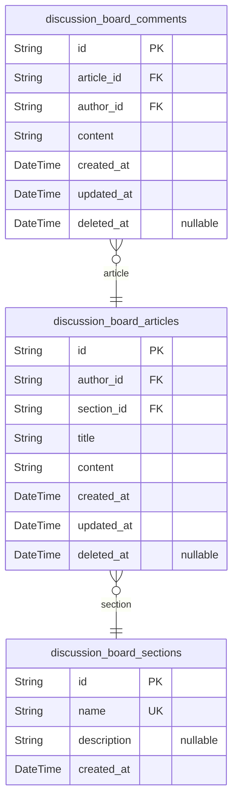
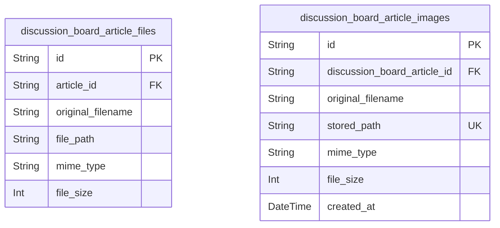
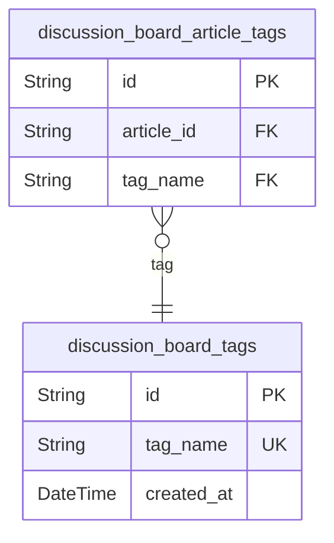

# Prisma Markdown

> Generated by [`prisma-markdown`](https://github.com/samchon/prisma-markdown)

- [Systematic](#systematic)
- [Content](#content)
- [Attachments](#attachments)
- [Tags](#tags)

## Systematic

```mermaid
erDiagram
"discussion_board_guest_sessions" {
  String id PK
  String guest_id FK,UK
  String device_fingerprint UK
  String ip
  String href
  String referrer
  DateTime created_at
  DateTime updated_at
  DateTime deleted_at "nullable"
}
"discussion_board_guests" {
  String id PK
  String ip_address
  String device_fingerprint UK
  DateTime created_at
  DateTime updated_at
}
"discussion_board_admins" {
  String id PK
  String promoted_by_id FK "nullable"
  String display_name
  String email UK
  String password_hash
  Boolean is_super_admin
  Boolean is_active
  DateTime created_at
  DateTime updated_at
  DateTime deleted_at "nullable"
}
"discussion_board_super_admins" {
  String id PK
  String email UK
  String password_hash
  Boolean is_super_admin
  Boolean can_promote_super_admins
  DateTime created_at
  DateTime updated_at
  DateTime deleted_at "nullable"
}
"discussion_board_member_password_resets" {
  String id PK
  String discussion_board_member_id FK
  String token UK
  DateTime expires_at
  DateTime created_at
  String created_by
  DateTime updated_at
  String updated_by
}
"discussion_board_member_email_verifications" {
  String id PK
  String member_id FK,UK
  String token_hash UK
  DateTime expires_at
  DateTime created_at
  DateTime used_at "nullable"
}
"discussion_board_member_sessions" {
  String id PK
  String discussion_board_member_id FK
  String access_token UK
  DateTime expired_at
  DateTime created_at
  DateTime updated_at
  DateTime last_active_at
  String ip
  String headers
  String refresh_token UK
  DateTime token_issued_at
  Int token_version
  DateTime refresh_token_issued_at
}
"discussion_board_members" {
  String id PK
  String email UK
  String password_hash
  String display_name
  String bio "nullable"
  Boolean is_active
  Boolean is_admin
  Boolean is_super_admin
  DateTime created_at
  DateTime updated_at
}
"discussion_board_admin_sessions" {
  String id PK
  String discussion_board_admin_id FK
  String access_token
  String refresh_token
  DateTime created_at
  DateTime expired_at
  DateTime updated_at
  String ip
  String(80000) href
  String(80000) referrer "nullable"
  String user_agent "nullable"
}
"discussion_board_super_admin_sessions" {
  String id PK
  String super_admin_id FK
  String access_token
  String refresh_token UK
  String ip
  String user_agent "nullable"
  String referrer "nullable"
  Boolean active
  DateTime created_at
  DateTime expired_at
  DateTime updated_at
}
"discussion_board_admin_password_resets" {
  String id PK
  String admin_id FK
  String token UK
  DateTime expires_at
  DateTime created_at
  DateTime updated_at
  DateTime deleted_at "nullable"
}
"discussion_board_admin_email_verifications" {
  String id PK
  String admin_id FK,UK
  String token UK
  DateTime expires_at
  DateTime verified_at "nullable"
  DateTime created_at
  DateTime updated_at
}
"discussion_board_super_admin_password_resets" {
  String id PK
  String super_admin_id FK
  String created_by FK
  String reset_token UK
  DateTime token_expires_at
  DateTime created_at
  DateTime used_at "nullable"
}
"discussion_board_super_admin_email_verifications" {
  String id PK
  String super_admin_id FK
  String token UK
  DateTime expires_at
  DateTime verified_at "nullable"
  String ip_address "nullable"
  String user_agent "nullable"
  DateTime created_at
  DateTime updated_at
}
"discussion_board_guest_sessions" |o--|| "discussion_board_guests" : guest
"discussion_board_admins" }o--o| "discussion_board_super_admins" : promotedBy
"discussion_board_member_password_resets" }o--|| "discussion_board_members" : member
"discussion_board_member_email_verifications" |o--|| "discussion_board_members" : member
"discussion_board_member_sessions" }o--|| "discussion_board_members" : member
"discussion_board_admin_sessions" }o--|| "discussion_board_admins" : admin
"discussion_board_super_admin_sessions" }o--|| "discussion_board_super_admins" : superAdmin
"discussion_board_admin_password_resets" }o--|| "discussion_board_admins" : admin
"discussion_board_admin_email_verifications" |o--|| "discussion_board_admins" : admin
"discussion_board_super_admin_password_resets" }o--|| "discussion_board_super_admins" : superAdmin
"discussion_board_super_admin_password_resets" }o--|| "discussion_board_super_admins" : createdBy
"discussion_board_super_admin_email_verifications" }o--|| "discussion_board_super_admins" : superAdmin
```

### `discussion_board_guest_sessions`

Table for temporary guest sessions identified by device fingerprint.
Tracks connection context including IP address, href, and referrer for
analytics and security purposes. Each guest user can have at most one
active session at a time, enforced by unique constraint on guest_id
field. Supports soft delete for session history preservation.

Properties as follows:

- `id`: Primary Key.
- `guest_id`
  > Belonged guest's [discussion_board_guests.id](#discussion_board_guests). Reference to the
  > guest user who owns this session.
- `device_fingerprint`
  > Device fingerprint for guest identification. Unique identifier for the
  > guest's device.
- `ip`: IP address of the guest during session initialization.
- `href`: Current page URL (href) when session was created.
- `referrer`: Referrer URL that led the guest to the site.
- `created_at`: Timestamp when session was created.
- `updated_at`: Timestamp when session was last updated.
- `deleted_at`: Timestamp when session was soft-deleted (nullable if still active).

### `discussion_board_guests`

Table for guest user identification and tracking without authentication
credentials. This table stores information about users who browse the
discussion board without logging in, using device fingerprinting and IP
tracking to identify unique guests. Each guest has a unique identifier
and tracking metadata.

Properties as follows:

- `id`: Primary Key. Unique identifier for each guest user session.
- `ip_address`
  > IP address of the guest user. Used for tracking and security purposes.
  > Always stored as string for IPv4/IPv6 compatibility.
- `device_fingerprint`
  > Unique device identifier for tracking guest sessions. Generated from
  > browser characteristics to identify returning guests without requiring
  > authentication.
- `created_at`
  > Timestamp when this guest session was created. Automatically set when
  > guest first visits the system.
- `updated_at`
  > Timestamp when this guest session was last updated. Updated on each new
  > interaction from the same guest.

### `discussion_board_admins`

Administrator accounts with elevated system management privileges. Each
administrator has email/password authentication and can be promoted to
super administrator status. Administrators can manage sections, delete
any content, and ban users.

Properties as follows:

- `id`: Primary Key.
- `promoted_by_id`
  > Super administrator who promoted this admin. {@link
  > discussion_board_super_admins.id}.
- `display_name`: Administrator's display name for public identification.
- `email`: Administrator's email address for login and notifications.
- `password_hash`: Hashed password using bcrypt algorithm.
- `is_super_admin`
  > Administrator status flag - false for regular admins, true for super
  > admins.
- `is_active`: Whether the administrator account is currently active.
- `created_at`: Timestamp when the administrator record was created.
- `updated_at`: Timestamp when the administrator record was last updated.
- `deleted_at`
  > Timestamp when the administrator record was soft deleted (nullable if not
  > deleted).

### `discussion_board_super_admins`

Super administrator accounts with full system management capabilities
including promoting/demoting other administrators and accessing all
system logs.

Properties as follows:

- `id`: Primary Key.
- `email`: Unique email address for authentication.
- `password_hash`: Bcrypt hash of user password (cost factor 12).
- `is_super_admin`: Super administrator flag - true for this table, false for regular admins.
- `can_promote_super_admins`
  > Permission to promote other users to super administrator - only true for
  > super admins.
- `created_at`: Creation timestamp.
- `updated_at`: Last update timestamp.
- `deleted_at`: Soft delete timestamp for cascading deletion support.

### `discussion_board_member_password_resets`

Password reset tokens with expiration for member accounts. This table
tracks all password reset requests made by members, storing the unique
reset token and its expiration time. When a member requests a password
reset, a record is created with a generated token. The member receives
this token (typically via email) and uses it to verify their identity
when setting a new password. Tokens expire after a set time period
(typically 1 hour) for security. After successful password reset, the
token record should be deleted or marked as used.

This is a session table that exclusively supports the
discussion_board_members actor table for password reset authentication
flows.

Properties as follows:

- `id`: Primary Key.
- `discussion_board_member_id`: Member who requested password reset. [discussion_board_members.id](#discussion_board_members).
- `token`
  > Unique password reset token generated for the member. This token is sent
  > to the member (typically via email) and must be provided when setting a
  > new password. Tokens are single-use and expire after a set time period
  > (typically 1 hour) for security.
- `expires_at`
  > Expiration timestamp for the password reset token. Tokens expire after a
  > set time period (typically 1 hour from creation) to prevent token reuse
  > and enhance security. After this time, the member must request a new
  > password reset.
- `created_at`: Record creation timestamp.
- `created_by`: User or system that created this record.
- `updated_at`: Record last update timestamp.
- `updated_by`: User or system that last updated this record.

### `discussion_board_member_email_verifications`

Email verification tokens for member account validation with expiration
tracking.

Properties as follows:

- `id`: Primary Key.
- `member_id`
  > Reference to the member account that needs email verification. {@link
  > discussion_board_members.id}.
- `token_hash`: Verification token hash for security (never store plain token).
- `expires_at`: Expiration timestamp for the verification token.
- `created_at`: Timestamp when the token was created (automatically set).
- `used_at`: Timestamp when the token was used or expired (nullable until used).

### `discussion_board_member_sessions`

Session tokens with access and refresh support for authentication sessions

Properties as follows:

- `id`: Primary Key.
- `discussion_board_member_id`
  > Member account that owns this session. {@link
  > discussion_board_members.id}.
- `access_token`: Session token for API authentication requests.
- `expired_at`: Timestamp when session expires and token becomes invalid.
- `created_at`: Timestamp when session was created.
- `updated_at`: Timestamp when session was last updated.
- `last_active_at`: Member's last active timestamp.
- `ip`: IP address when session was created.
- `headers`: HTTP headers when session was created.
- `refresh_token`: Session refresh token for token renewal.
- `token_issued_at`: Token issued timestamp for expiration calculation.
- `token_version`: Token version for revocation management.
- `refresh_token_issued_at`: Refresh token issued timestamp.

### `discussion_board_members`

Registered member accounts with email/password authentication
credentials. Members can create articles, write comments, and participate
in discussions. When deleted, all their content (articles and comments)
is also deleted via CASCADE.

Properties as follows:

- `id`: Primary Key.
- `email`: Unique email address for login and communication.
- `password_hash`: bcrypt hash of user password (cost factor 12).
- `display_name`: Display name shown on articles and comments (max 100 characters).
- `bio`: Optional biographical text (max 500 characters).
- `is_active`: Whether the account is active. Banned users have this set to false.
- `is_admin`: Whether the user has administrator privileges.
- `is_super_admin`
  > Whether the user has super administrator privileges (cannot be demoted by
  > regular admins).
- `created_at`: Account creation timestamp.
- `updated_at`: Last update timestamp.

### `discussion_board_admin_sessions`

Session table for administrator accounts with secure authentication.
Stores access and refresh tokens with IP address tracking for security
auditing. Sessions are tied to administrator accounts and include
temporal tracking for login sessions.

Properties as follows:

- `id`: Primary Key.
- `discussion_board_admin_id`: Belongs to the administrator [discussion_board_admins.id](#discussion_board_admins).
- `access_token`: Access token for the session.
- `refresh_token`: Refresh token for the session.
- `created_at`: Session creation timestamp.
- `expired_at`: Session expiration timestamp.
- `updated_at`: Session last activity timestamp.
- `ip`: Session origin IP address for security auditing.
- `href`: Session origin URL (href) for security auditing.
- `referrer`: Session referrer URL for security auditing.
- `user_agent`: User agent string for the session.

### `discussion_board_super_admin_sessions`

Session tracking table for super administrator authentication sessions.
Stores access and refresh tokens with session metadata for audit and
security purposes. This table maintains an append-only history of all
super administrator login events and is referenced by the
discussion_board_super_admins table for active session management.

Properties as follows:

- `id`: Primary Key.
- `super_admin_id`: Super administrator's [discussion_board_super_admins.id](#discussion_board_super_admins).
- `access_token`: JWT access token for API authentication.
- `refresh_token`: JWT refresh token for session extension.
- `ip`: IP address of the client session.
- `user_agent`: User agent string from client device.
- `referrer`: HTTP referrer header from login request.
- `active`: Whether this session is currently active.
- `created_at`: When the session was created.
- `expired_at`: When the session expires.
- `updated_at`: When the session was last updated.

### `discussion_board_admin_password_resets`

Password reset tokens for administrator accounts. Stores temporary tokens
that allow administrators to reset their passwords when forgotten. These
tokens are single-use and expire after a certain period for security.

Properties as follows:

- `id`: Primary Key.
- `admin_id`
  > Administrator whose password is being reset. {@link
  > discussion_board_admins.id}.
- `token`: Unique password reset token generated for the administrator.
- `expires_at`: Timestamp when the password reset token expires.
- `created_at`: When this password reset record was created.
- `updated_at`: When this password reset record was last updated.
- `deleted_at`: Optional timestamp for soft deletion.

### `discussion_board_admin_email_verifications`

Email verification tokens for administrator account confirmation. Stores
temporary verification tokens sent to admin email addresses during
registration or email change processes.

This table is a subsidiary entity that supports the authentication
workflow by managing email verification tokens for
discussion_board_admins. Each administrator can have at most one active
verification token at a time.

@see discussion_board_admins - Admin accounts that require email
verification
@see discussion_board_admin_password_resets - Similar pattern for
password reset tokens

Properties as follows:

- `id`: Primary Key.
- `admin_id`
  > Administrator account that owns this email verification. {@link
  > discussion_board_admins.id}.
- `token`: Unique verification token sent to admin email address.
- `expires_at`: Token expiration timestamp. Tokens are typically valid for 24-48 hours.
- `verified_at`
  > Timestamp when the verification token was successfully used. NULL if not
  > yet verified.
- `created_at`: Record creation timestamp.
- `updated_at`: Record last update timestamp.

### `discussion_board_super_admin_password_resets`

Password reset tokens for super administrator accounts with expiration
support. Stores temporary reset tokens that expire after a certain time,
allowing administrators to securely reset their passwords. Each reset
request is linked to the super administrator account and records when the
reset was initiated.

Properties as follows:

- `id`: Primary Key.
- `super_admin_id`
  > Super administrator account requesting password reset. {@link
  > discussion_board_super_admins.id}.
- `created_by`
  > Administrator who initiated the password reset request. {@link
  > discussion_board_super_admins.id}.
- `reset_token`: Unique password reset token generated for authentication.
- `token_expires_at`: Timestamp when the reset token expires and becomes invalid.
- `created_at`: Timestamp when the password reset request was created.
- `used_at`
  > Timestamp when the password reset was successfully used (nullable until
  > used).

### `discussion_board_super_admin_email_verifications`

Email verification tokens for super administrator account activation and
verification. Stores temporary tokens with expiration for email ownership
verification during registration or email change processes.

Properties as follows:

- `id`: Primary key for the email verification record.
- `super_admin_id`
  > Super administrator account requiring email verification. {@link
  > discussion_board_super_admins.id}.
- `token`: Unique verification token (UUID or random string) sent to user email.
- `expires_at`: Expiration timestamp for the verification token.
- `verified_at`: Timestamp when email was successfully verified (null until verification).
- `ip_address`: IP address from which verification request was made.
- `user_agent`: User agent string from verification request device.
- `created_at`: Timestamp when email verification record was created.
- `updated_at`: Timestamp when email verification record was last updated.

## Content

### `discussion_board_sections`

Content sections for organizing articles. Sections provide categorical
organization for articles, enabling users to browse and filter content by
topic areas. Each section can have a name, description, and is managed by
administrators.

Key relationships:
- One-to-many with discussion_board_articles (articles belong to sections)
- Managed by administrators through the Systematic component
- No soft delete - sections are reorganized, not deleted

Properties as follows:

- `id`: Primary Key. UUID identifier for the section.
- `name`: Section name. Must be unique and descriptive. Used in navigation and URLs.
- `description`
  > Section description providing context about the section's purpose and
  > content focus.
- `created_at`: Timestamp when the section was created.

### `discussion_board_articles`

Primary articles created by users for discussion topics in economic and
political domains. Articles belong to specific sections and can have
multiple attachments, tags, and comments. They support soft deletion for
audit trail purposes.

Properties as follows:

- `id`: Primary Key.
- `author_id`: Author's [discussion_board_members.id](#discussion_board_members).
- `section_id`: Section's [discussion_board_sections.id](#discussion_board_sections).
- `title`: Article title (required, 1-200 characters).
- `content`: Article content (required, text with no length limit).
- `created_at`: Creation timestamp.
- `updated_at`: Last update timestamp.
- `deleted_at`: Soft delete timestamp (nullable if not deleted).

### `discussion_board_comments`

Comments on articles for user discussion and engagement.

Each comment is associated with exactly one article and one author (member).
Comments support soft deletion with deleted_at timestamp. When an article
or user is deleted, all associated comments are automatically removed
(CASCADE). Comments are sorted chronologically (oldest first) when
displayed on article pages.

Relationships:
- Belongs to: article [discussion_board_articles.id](#discussion_board_articles)
- Belongs to: author [discussion_board_members.id](#discussion_board_members)
- Has many: none (this is the leaf table in the hierarchy)

Index strategy: Plain indexes on article_id, author_id, and created_at
for efficient querying and chronological sorting.

Properties as follows:

- `id`: Primary Key.
- `article_id`
  > Target article's [discussion_board_articles.id](#discussion_board_articles). The comment
  > belongs to this article. Cascade delete ensures all comments are removed
  > when an article is deleted.
- `author_id`
  > Author member's [discussion_board_members.id](#discussion_board_members). The comment was
  > created by this user. Cascade delete ensures all user comments are
  > removed when an account is deleted.
- `content`
  > The text content of the comment. Required field containing the user's
  > discussion response.
- `created_at`
  > Timestamp when the comment was originally created. Used for chronological
  > sorting (oldest first).
- `updated_at`
  > Timestamp when the comment was last modified. Automatically updated on
  > any content change.
- `deleted_at`
  > Timestamp when the comment was soft-deleted. Null indicates active
  > comment. Used for audit trail while hiding content from users.

## Attachments

### `discussion_board_article_files`

Stores metadata for document files attached to articles including
original filename, stored path, MIME type, and size.

Properties as follows:

- `id`: Primary Key.
- `article_id`: Belonged article's [discussion_board_articles.id](#discussion_board_articles).
- `original_filename`: Original filename when uploaded.
- `file_path`: Stored file path or URL in object storage.
- `mime_type`: MIME type of the file (e.g., application/pdf, text/plain).
- `file_size`: Size of the file in bytes.

### `discussion_board_article_images`

Image metadata storage for articles, tracking original filename, stored
path, and MIME type for each attached image.

Properties as follows:

- `id`: Primary Key.
- `discussion_board_article_id`
  > Reference to the article that contains this image. {@link
  > discussion_board_articles.id}.
- `original_filename`: Original filename when uploaded by the user.
- `stored_path`: Stored file path or URL in the file storage system.
- `mime_type`: MIME type of the image file (e.g., image/jpeg, image/png).
- `file_size`: File size in bytes for storage tracking and quota management.
- `created_at`: Date and time when the image was uploaded.

## Tags

### `discussion_board_tags`

Stores unique tag names for content categorization. Tags enable users to
categorize and discover articles through tag-based search and filtering.
Each tag represents a single category that can be applied to multiple
articles through the article_tags junction table.

Properties as follows:

- `id`: Primary Key.
- `tag_name`
  > Unique tag name for content categorization. Used in tag-based search and
  > filtering.
- `created_at`: Timestamp when the tag was created.

### `discussion_board_article_tags`

Junction table establishing many-to-many relationship between articles
and tags. Each record links a specific article to one tag, enabling
articles to have multiple tags and tags to be applied to multiple
articles. The composite primary key on article_id and tag_name ensures
each article-tag combination is unique.

Properties as follows:

- `id`
  > Primary Key. Auto-generated unique identifier for each article-tag
  > relationship record.
- `article_id`
  > Reference to the article being tagged. {@link
  > discussion_board_articles.id}.
- `tag_name`
  > Reference to the tag applied to the article. {@link
  > discussion_board_tags.id}.
