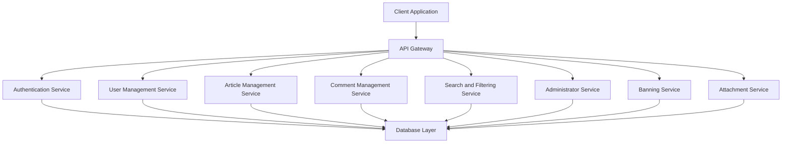

# Economic/Political Discussion Board - Requirements Specification

## Document Overview

This document provides comprehensive requirements for an Economic/Political Discussion Board application. The system enables users to discuss economic and political topics through articles, comments, and community management features.

---

## 1. Service Architecture Overview

### 1.1 Core Components

The discussion board system consists of the following primary components:
- User Account Management System
- Article and Content Management System
- Section Organization System
- Comment and Discussion System
- Search and Filtering System
- Administrator Management System
- User Banning System
- File and Image Attachment System

### 1.2 System Architecture Diagram



### 1.3 Actor System Overview

The system supports three distinct actor types with varying permission levels:

| Actor Type | Authentication Required | Default Permissions |
|------------|------------------------|---------------------|
| Guest | No | View articles, browse sections, search content |
| Member | Yes | All guest permissions, create/edit own content |
| Administrator | Yes | All member permissions, manage system operations |
| Super Administrator | Yes | All administrator permissions, system configuration |

---

## 2. Functional Requirements

### 2.1 User Account Management Requirements

#### 2.1.1 User Registration

**Business Rule:** Users must provide valid email and password to create an account.

**Required Fields:**
- Email address (unique, validated format)
- Password (minimum 8 characters with complexity requirements)

**Validation Rules:**
- Email must be unique across all users
- Email format must match standard email patterns
- Password must meet complexity requirements (minimum length, mixed case, numbers, special characters)
- Password confirmation must match the original password

**Error Scenarios:**
- Email already registered → Return error message "Email is already registered"
- Invalid email format → Return error message "Invalid email format"
- Password too short → Return error message "Password must be at least 8 characters"
- Password mismatch → Return error message "Passwords do not match"

**Business Process Flow:**
1. User submits registration form with email and password
2. System validates email format and complexity requirements
3. System checks for existing email in database
4. If validation passes, system creates new user account
5. System returns success response with user confirmation
6. User can immediately log in with new credentials

#### 2.1.2 User Login

**Business Rule:** Authenticated users can access protected system features.

**Required Fields:**
- Email address
- Password

**Authentication Process:**
1. User submits login credentials (email and password)
2. System validates email exists in database
3. System verifies password matches stored hash
4. If authentication succeeds, system generates JWT token
5. System returns JWT token with user information
6. Token includes expiration time (typically 24 hours)

**Error Scenarios:**
- Email not found → Return error message "Email or password is incorrect"
- Invalid password → Return error message "Email or password is incorrect"
- Account banned → Return error message "Your account has been banned"

#### 2.1.3 Password Management

**Password Change Process:**
1. User submits current password and new password
2. System validates current password matches stored hash
3. System validates new password meets complexity requirements
4. System updates password hash in database
5. System invalidates all existing JWT tokens for security
6. System returns success confirmation

**Password Reset Process (for lost passwords):**
1. User requests password reset with registered email
2. System generates time-limited reset token (typically 1 hour)
3. System sends reset link with token to user email
4. User clicks link and submits new password with token
5. System validates token is valid and not expired
6. System updates password and invalidates old tokens
7. System returns success confirmation

**Error Scenarios:**
- Invalid current password → Return error message "Current password is incorrect"
- New password doesn't meet requirements → Return error message "Password doesn't meet complexity requirements"
- Reset token expired → Return error message "Reset token has expired"
- Invalid reset token → Return error message "Invalid reset token"

#### 2.1.4 Account Deletion

**Business Rule:** Users can permanently delete their accounts with all associated data.

**Deletion Process:**
1. User initiates account deletion request
2. System verifies user is authenticated
3. System prompts for password confirmation (security measure)
4. System validates user credentials
5. System begins cascading data deletion:
   - Delete all articles created by user
   - Delete all comments created by user
   - Delete all attachments uploaded by user
   - Delete user profile information
   - Remove user from database
6. System invalidates all user sessions and JWT tokens
7. System returns success confirmation

**Data Deletion Scope:**
- User account record
- All user articles (with all metadata)
- All user comments (with all metadata)
- All user uploads (files and images)
- User profile information
- User preferences and settings

**Error Scenarios:**
- Invalid password confirmation → Return error message "Password confirmation is incorrect"
- Authentication expired → Return error message "Please log in again"
- Database deletion failure → Return error message "Account deletion failed. Please try again."

### 2.2 User Profile Requirements

#### 2.2.1 Profile Data Structure

**Required Profile Fields:**
- Display name (string, 1-50 characters)
- Bio text (string, optional, up to 500 characters)

**Optional Profile Fields:**
- Profile picture URL (external image URL or null)
- Member since date (automatically set on registration)
- Total articles count
- Total comments count

**Display Rules:**
- Display name shown in all user activity indicators
- Bio shown on profile page and article/comment footers
- Member since date shown in user activity summaries
- Article and comment counts shown on profile page

#### 2.2.2 Profile Editing

**Edit Process:**
1. User accesses profile editing interface
2. System displays current profile information
3. User modifies display name and/or bio
4. User submits changes
5. System validates input (name length, bio length)
6. System updates profile information in database
7. System returns success confirmation with updated profile

**Validation Rules:**
- Display name: 1-50 characters, alphanumeric and special characters allowed
- Bio text: 0-500 characters
- Profile picture URL: valid HTTP/HTTPS URL format (if provided)

**Error Scenarios:**
- Display name too short → Return error message "Display name must be at least 1 character"
- Display name too long → Return error message "Display name must be less than 50 characters"
- Bio too long → Return error message "Bio must be less than 500 characters"
- Invalid profile picture URL → Return error message "Invalid image URL format"

#### 2.2.3 Profile Viewing

**View Process:**
1. User navigates to another user's profile
2. System retrieves target user profile information
3. System fetches user's articles ( paginated)
4. System fetches user's comments ( paginated)
5. System renders profile page with all information

**Profile Page Content:**
- Display name
- Bio text
- Member since date
- Total articles count
- Total comments count
- List of articles (with title, date, section)
- List of comments (with article title, comment date)

**Article and Comment Pagination:**
- Default page size: 10 items per page
- Maximum page size: 50 items per page
- Response includes total count and pagination metadata

### 2.3 Section Management Requirements

#### 2.3.1 Section Data Structure

**Required Section Fields:**
- Name (string, 1-100 characters, unique)
- Description (string, 0-1000 characters)

**Optional Section Fields:**
- Section icon (external image URL or null)
- Order priority (integer for display ordering)
- Creation timestamp (automatically set)
- Last updated timestamp (automatically updated)

**Display Rules:**
- Sections shown in navigation menu in priority order
- Section name displayed as menu item
- Section description shown on section pages
- Section icon shown next to section name (if provided)

#### 2.3.2 Section Creation

**Permission:** Super administrators and administrators only

**Creation Process:**
1. Authorized user accesses section creation interface
2. System displays section creation form
3. User fills in section name and description
4. User optionally uploads section icon
5. User sets section priority order
6. User submits section creation request
7. System validates name uniqueness
8. System validates all required fields
9. System creates section in database
10. System returns success response with new section details

**Validation Rules:**
- Section name: 1-100 characters, unique across all sections
- Description: 0-1000 characters
- Section icon: valid HTTP/HTTPS URL format (if provided)
- Priority order: positive integer

**Error Scenarios:**
- Name already exists → Return error message "Section name already exists"
- Name too short → Return error message "Section name must be at least 1 character"
- Name too long → Return error message "Section name must be less than 100 characters"
- Description too long → Return error message "Description must be less than 1000 characters"
- Invalid icon URL → Return error message "Invalid image URL format"
- Not authorized → Return error message "You are not authorized to create sections"

#### 2.3.3 Section Editing

**Permission:** Super administrators and administrators only

**Edit Process:**
1. Authorized user accesses section editing interface
2. System loads current section information
3. User modifies section details (name, description, icon, priority)
4. User submits changes
5. System validates name uniqueness (if changed)
6. System validates all required fields
7. System updates section in database
8. System returns success response with updated section details

**Allowed Editable Fields:**
- Section name (must remain unique)
- Section description
- Section icon URL
- Section priority order

**Error Scenarios:**
- Name already exists (different section) → Return error message "Section name already exists"
- Name too short → Return error message "Section name must be at least 1 character"
- Name too long → Return error message "Section name must be less than 100 characters"
- Description too long → Return error message "Description must be less than 1000 characters"
- Invalid icon URL → Return error message "Invalid image URL format"
- Not authorized → Return error message "You are not authorized to edit sections"

#### 2.3.4 Section Deletion

**Permission:** Super administrators and administrators only

**Deletion Process:**
1. Authorized user selects section for deletion
2. System displays warning about cascading effects
3. System lists articles in the section
4. User confirms deletion
5. System moves articles to "Uncategorized" section or deletes them
6. System deletes section from database
7. System returns success confirmation

**Data Handling Options:**
- Option 1: Move articles to "General" or "Uncategorized" section
- Option 2: Delete articles associated with the section
- Default behavior: Move articles to designated fallback section

**Error Scenarios:**
- Section not found → Return error message "Section not found"
- Not authorized → Return error message "You are not authorized to delete sections"
- Database deletion failure → Return error message "Section deletion failed. Please try again."

#### 2.3.5 Section Listing and Browsing

**Section Listing Process:**
1. User accesses section listing page
2. System retrieves all sections from database
3. System sorts sections by priority order
4. System returns section list with basic information

**Section List Content:**
- Section name
- Section description
- Article count in section
- Section icon URL (if provided)

**Section Browsing Process:**
1. User selects specific section to browse
2. System loads section details
3. System retrieves articles in section ( paginated)
4. System returns section information and article list

**Article Listing in Section:**
- Articles sorted by posting time (newest first by default)
- Pagination enabled (10-50 items per page)
- Shows article title, author, tags, comment count, posting time

### 2.4 Article Management Requirements

#### 2.4.1 Article Data Structure

**Required Article Fields:**
- Title (string, 1-200 characters)
- Content (text, required, no length limit specified)
- Section ID (reference to section, required)

**Optional Article Fields:**
- Author ID (reference to user, automatically set)
- Tags (array of strings, optional)
- Created timestamp (automatically set)
- Last updated timestamp (automatically updated)
- Attachment references (array of attachment IDs)

**Article Content Requirements:**
- Rich text or markdown format supported
- HTML sanitization for security
- Support for code blocks and formatting
- Maximum content size: no explicit limit, but server-side processing limits apply

#### 2.4.2 Article Creation

**Permission:** Members and administrators only

**Creation Process:**
1. User accesses article creation interface
2. System loads available sections list
3. User selects section for article
4. User enters article title and content
5. User optionally adds tags (comma-separated list)
6. User optionally uploads attachments (files and images)
7. User submits article creation request
8. System validates required fields
9. System saves article to database
10. System processes and stores attachments
11. System returns success response with article details

**Validation Rules:**
- Title: 1-200 characters
- Content: minimum 1 character
- Section: must be valid section ID from available sections
- Tags: maximum 10 tags, each 1-50 characters
- Attachments: maximum file size per file, total storage limits

**Error Scenarios:**
- Title too short → Return error message "Title must be at least 1 character"
- Title too long → Return error message "Title must be less than 200 characters"
- Content too short → Return error message "Content must be at least 1 character"
- Invalid section → Return error message "Selected section is not valid"
- Too many tags → Return error message "Maximum 10 tags allowed"
- Tag too long → Return error message "Each tag must be less than 50 characters"
- File too large → Return error message "File size exceeds maximum limit"
- Storage limit exceeded → Return error message "Storage limit exceeded"

#### 2.4.3 Article Editing

**Permission:** Article author or administrators/super administrators only

**Edit Process:**
1. User accesses article editing interface
2. System loads current article information
3. User modifies article content (title, content, tags)
4. User optionally adds new attachments
5. User optionally removes existing attachments
6. User submits changes
7. System validates required fields
8. System updates article in database
9. System processes new attachments
10. System returns success response with updated article details

**Editable Fields:**
- Article title
- Article content
- Tags (can add, remove, or modify)
- Attachments (can add new ones)

**Attachment Management During Edit:**
- Users can add new attachments
- Users can remove existing attachments
- System handles file replacement or deletion
- Previous attachments remain unless explicitly removed

**Error Scenarios:**
- Title too short → Return error message "Title must be at least 1 character"
- Title too long → Return error message "Title must be less than 200 characters"
- Content too short → Return error message "Content must be at least 1 character"
- Invalid section → Return error message "Selected section is not valid"
- Too many tags → Return error message "Maximum 10 tags allowed"
- Tag too long → Return error message "Each tag must be less than 50 characters"
- File too large → Return error message "File size exceeds maximum limit"
- Not authorized → Return error message "You are not authorized to edit this article"

#### 2.4.4 Article Deletion

**Permission:** Article author or administrators/super administrators only

**Deletion Process:**
1. User accesses article or article list
2. User selects article for deletion
3. System displays confirmation prompt
4. User confirms deletion
5. System verifies user authorization
6. System deletes article from database
7. System deletes all associated attachments
8. System deletes all comments associated with article
9. System returns success confirmation

**Cascading Deletion Scope:**
- Article record and metadata
- All article attachments
- All comments on article
- Article view count and statistics

**Error Scenarios:**
- Article not found → Return error message "Article not found"
- Not authorized → Return error message "You are not authorized to delete this article"
- Database deletion failure → Return error message "Article deletion failed. Please try again."

#### 2.4.5 Article Viewing

**Article View Process:**
1. User selects article to view
2. System retrieves article details from database
3. System retrieves author profile information
4. System retrieves all attachments for article
5. System retrieves all tags for article
6. System increments view counter (optional)
7. System renders article page with complete information

**Article Page Content:**
- Article title
- Author information (display name, profile link)
- Section information
- Article content (formatted)
- Created timestamp
- Last updated timestamp (if different)
- Tags (clickable links)
- Attachment list (downloadable links)
- Comment section

**Attachment Display:**
- Files shown as downloadable links with file icon
- Images shown as inline preview (if supported)
- File size and format shown for each attachment
- Clickable download links

#### 2.4.6 Article List Display

**Article List Process:**
1. User accesses section or global article list
2. System retrieves articles from database
3. System applies filters (if specified)
4. System applies sorting (if specified)
5. System paginates results
6. System returns article list with summary information

**Article List Content:**
- Article title (clickable link to full article)
- Author display name (clickable profile link)
- Tags (if any)
- Comment count
- Time posted (relative time or timestamp)
- Section name (if displayed in global list)

**Sorting Options:**
- Newest first (default, most recent articles first)
- Oldest first (least recent articles first)

**Filtering Options:**
- Filter by section (single or multiple)
- Filter by author
- Filter by tags
- Filter by date range

**Pagination Settings:**
- Default page size: 10 articles per page
- Maximum page size: 50 articles per page
- Response includes total count, current page, total pages

**Error Scenarios:**
- Invalid section ID → Return error message "Invalid section ID"
- Invalid sort parameter → Return error message "Invalid sort parameter"
- Pagination out of range → Return error message "Page number out of range"

### 2.5 Comment System Requirements

#### 2.5.1 Comment Data Structure

**Required Comment Fields:**
- Content (text, required, minimum 1 character)
- Article ID (reference to article, required)
- Author ID (reference to user, automatically set)

**Optional Comment Fields:**
- Created timestamp (automatically set)
- Last updated timestamp (automatically updated)
- Deleted flag (soft delete flag)

**Content Requirements:**
- Plain text or minimal markdown supported
- HTML sanitization for security
- No nested comments (single-level only)
- Maximum content length: 5000 characters (default)

#### 2.5.2 Comment Creation

**Permission:** Members and administrators only

**Creation Process:**
1. User views article page
2. System displays comment input area
3. User enters comment content
4. User submits comment
5. System validates content (minimum length, maximum length)
6. System saves comment to database
7. System updates article comment count
8. System returns success response with comment details

**Validation Rules:**
- Content: minimum 1 character, maximum 5000 characters
- Article ID: must be valid existing article ID
- No duplicate comments from same user on same article

**Error Scenarios:**
- Content too short → Return error message "Comment content must be at least 1 character"
- Content too long → Return error message "Comment content must be less than 5000 characters"
- Article not found → Return error message "Article not found"
- Duplicate comment → Return error message "Comment already exists for this article"
- Not authorized (guest) → Return error message "You must be logged in to comment"

#### 2.5.3 Comment Editing

**Permission:** Comment author or administrators/super administrators only

**Edit Process:**
1. User accesses comment edit interface
2. System loads current comment content
3. User modifies comment content
4. User submits changes
5. System validates content (minimum/maximum length)
6. System updates comment in database
7. System returns success response with updated comment details

**Editable Content:**
- Comment text content only
- Cannot change article association
- Cannot change author information

**Validation Rules:**
- Content: minimum 1 character, maximum 5000 characters
- Cannot change article ID or author ID

**Error Scenarios:**
- Content too short → Return error message "Comment content must be at least 1 character"
- Content too long → Return error message "Comment content must be less than 5000 characters"
- Comment not found → Return error message "Comment not found"
- Not authorized → Return error message "You are not authorized to edit this comment"

#### 2.5.4 Comment Deletion

**Permission:** Comment author or administrators/super administrators only

**Deletion Process:**
1. User accesses comment or article page
2. User selects comment for deletion
3. System displays confirmation prompt
4. User confirms deletion
5. System verifies user authorization
6. System marks comment as deleted (soft delete)
7. System updates article comment count
8. System returns success confirmation

**Soft Delete Behavior:**
- Comment remains in database
- Deleted flag set to true
- Comment content hidden from display
- Comment count updated
-Administrators can view deleted comments (optional feature)

**Error Scenarios:**
- Comment not found → Return error message "Comment not found"
- Not authorized → Return error message "You are not authorized to delete this comment"
- Database update failure → Return error message "Comment deletion failed. Please try again."

#### 2.5.5 Comment Display and Sorting

**Comment Display Process:**
1. User views article page
2. System retrieves comments for article from database
3. System filters deleted comments (unless viewing as admin)
4. System sorts comments by creation time (oldest first)
5. System renders comment list with user information

**Comment Display Content:**
- Comment author (display name, profile link)
- Comment content (formatted, sanitized)
- Created timestamp (relative time or timestamp)
- Edit and delete controls (if user authorized)
- Author information and avatar

**Sorting Requirements:**
- Default: Oldest first (ascending by creation time)
- Alternative: Newest first (descending by creation time, optional)
- Consistent sorting within page view

**Pagination (if many comments):**
- Default page size: 20 comments per page
- Maximum page size: 100 comments per page
- Response includes total count and pagination metadata

**Error Scenarios:**
- Article not found → Return error message "Article not found"
- Database retrieval failure → Return error message "Failed to retrieve comments. Please try again."

### 2.6 Search and Filtering Requirements

#### 2.6.1 Search Functionality

**Search Input:**
- Search query text (string, minimum 2 characters)
- Optional filters (tags, section, author)

**Search Capabilities:**
- Search article titles
- Search article content
- Full-text search support
- Case-insensitive matching
- Partial word matching

**Search Process:**
1. User enters search query in search interface
2. System parses and processes search query
3. System executes search against article data
4. System applies filters (if specified)
5. System sorts results (if specified)
6. System paginates results
7. System returns search results

**Search Results Display:**
- Article title (clickable link)
- Article snippet (highlighted matching text)
- Author name
- Section name
- Match score (optional)
- Time posted

**Search Validation:**
- Minimum query length: 2 characters
- Maximum query length: 100 characters
- Special characters handled appropriately
- SQL injection prevention (parameterized queries)

**Error Scenarios:**
- Query too short → Return error message "Search query must be at least 2 characters"
- Query too long → Return error message "Search query must be less than 100 characters"
- Search service unavailable → Return error message "Search service temporarily unavailable"
- Database query error → Return error message "Search failed. Please try again."

#### 2.6.2 Tag Filtering

**Tag Filter Input:**
- Array of tag strings
- Optional "all tags" vs "any tag" mode

**Tag Filter Process:**
1. User selects tags for filtering
2. System retrieves articles matching tag criteria
3. System combines with other filters (search, section, author)
4. System applies pagination and sorting
5. System returns filtered results

**Tag Matching Behavior:**
- Exact tag matching (case-insensitive)
- Tag names stored normalized (lowercase, trimmed)
- Multiple tags combined with AND/OR logic

**Tag Display:**
- All available tags shown in tag cloud or filter list
- Tag count shown next to each tag
- Clickable tag links for filtering
- Tag usage statistics (optional)

**Error Scenarios:**
- Invalid tag format → Return error message "Invalid tag format"
- Tag too long → Return error message "Tag must be less than 50 characters"
- Database query error → Return error message "Filtering failed. Please try again."

#### 2.6.3 Result Pagination

**Pagination Parameters:**
- Page number (integer, default 1)
- Page size (integer, default 10, maximum 50)
- Sort order (string: "newest", "oldest")

**Pagination Response:**
- Current page results
- Total count of matching results
- Total number of pages
- Previous/next page links
- Current pagination metadata

**Pagination Validation:**
- Page number: minimum 1
- Page size: minimum 1, maximum 50
- Page number validation against total count

**Error Scenarios:**
- Invalid page number → Return error message "Invalid page number"
- Invalid page size → Return error message "Invalid page size"
- Page out of range → Return error message "Page out of range"

### 2.7 Administrator System Requirements

#### 2.7.1 Administrator Role System

**Administrator Grades:**
- Regular Administrator
- Super Administrator

**Administrator Privileges:**
- Can perform all member actions (articles, comments, sections)
- Can manage sections (create, edit, delete)
- Can delete any article
- Can delete any comment
- Can view user profiles and activity
- Can manage user banning (ban, unban, view banned list)

**Super Administrator Privileges:**
- All regular administrator privileges
- Can promote regular administrators to super administrators
- Can demote other super administrators to regular administrators
- Cannot demote themselves
- Can access all system logs and statistics

**Permission Hierarchy:**
```
Guest < Member < Administrator < Super Administrator
```

#### 2.7.2 Administrator Request Process

**Request Submission:**
1. Any user can submit administrator request
2. System displays request form
3. User fills request with reason text
4. User submits request
5. System validates request
6. System saves request to pending queue
7. System notifies super administrators

**Request Validation:**
- Reason text: minimum 10 characters
- Reason text: maximum 2000 characters
- One pending request per user at a time

**Error Scenarios:**
- Reason too short → Return error message "Reason must be at least 10 characters"
- Reason too long → Return error message "Reason must be less than 2000 characters"
- Already has pending request → Return error message "You already have a pending request"

#### 2.7.3 Administrator Request Management

**Request Review Process:**
1. Super administrators access pending requests page
2. System displays list of all pending requests
3. Each request shows: user, reason, submission time
4. Super admin reviews request details
5. Super admin chooses approval or rejection
6. System processes decision and updates user role

**Request List Content:**
- Request ID
- User display name and profile link
- Reason text
- Submission timestamp
- Action buttons (approve, reject)

**Decision Processing:**
- Approval: Update user role to regular administrator
- Rejection: Keep user role unchanged, mark request as rejected
- notification to user about decision

**Error Scenarios:**
- Request not found → Return error message "Request not found"
- Not authorized → Return error message "You are not authorized to manage administrator requests"
- Database update failure → Return error message "Request processing failed. Please try again."

#### 2.7.4 Administrator Role Management

**Promotion Process (Regular to Super):**
1. Super administrator accesses user management interface
2. System displays user list with administrator roles
3. Super admin selects regular administrator for promotion
4. System displays promotion confirmation
5. Super admin confirms promotion
6. System updates user role to super administrator
7. System returns success confirmation

**Demotion Process (Super to Regular):**
1. Super administrator accesses user management interface
2. System displays user list with administrator roles
3. Super admin selects super administrator for demotion
4. System displays demotion warning and confirmation
5. Super admin confirms demotion
6. System updates user role to regular administrator
7. System returns success confirmation

**Self-Promotion Protection:**
- Super administrators cannot demote themselves
- Attempting self-demotion returns error
- System prevents creation of zero super administrators
- Minimum one super administrator required at all times

**Error Scenarios:**
- User not found → Return error message "User not found"
- User not administrator → Return error message "User is not an administrator"
- Attempting self-demotion → Return error message "Cannot demote yourself"
- Would result in zero super administrators → Return error message "At least one super administrator required"
- Not authorized → Return error message "You are not authorized to manage administrator roles"

#### 2.7.5 Administrator Capabilities Summary

**Administrator Actions:**
| Action | Regular Admin | Super Admin |
|--------|---------------|-------------|
| View articles | ✅ | ✅ |
| Edit own articles | ✅ | ✅ |
| Delete any article | ✅ | ✅ |
| View comments | ✅ | ✅ |
| Delete any comment | ✅ | ✅ |
| Create sections | ❌ | ✅ |
| Edit sections | ❌ | ✅ |
| Delete sections | ❌ | ✅ |
| Ban users | ✅ | ✅ |
| Unban users | ✅ | ✅ |
| View banned users | ✅ | ✅ |
| Promote admins | ❌ | ✅ |
| Demote admins | ❌ | ✅ |
| Access system logs | ❌ | ✅ |
| Manage settings | ❌ | ✅ |

### 2.8 Banning System Requirements

#### 2.8.1 Ban Process

**Ban Initiation:**
- Regular administrators and super administrators can ban users
- Accessible through user management interface

**Ban Request Process:**
1. Administrator accesses user profile or user list
2. System displays ban action option for target user
3. System prompts for ban reason (required text field)
4. Administrator enters ban reason (minimum 10 characters)
5. Administrator confirms ban action
6. System validates ban reason
7. System updates user status to banned
8. System records ban reason and administrator information
9. System invalidates all user sessions and JWT tokens
10. System returns success confirmation

**Ban Reason Requirements:**
- Minimum length: 10 characters
- Maximum length: 1000 characters
- Must not be empty or whitespace-only
- Appropriate language required (no profanity)

**Error Scenarios:**
- Reason too short → Return error message "Ban reason must be at least 10 characters"
- Reason too long → Return error message "Ban reason must be less than 1000 characters"
- Reason invalid → Return error message "Ban reason contains invalid content"
- User not found → Return error message "User not found"
- Already banned → Return error message "User is already banned"
- Not authorized → Return error message "You are not authorized to ban users"

#### 2.8.2 Ban Effects

**User Session Effects:**
- All active sessions immediately terminated
- All JWT tokens immediately invalidated
- User cannot establish new sessions

**Content Visibility Effects:**
- Banned user's articles remain visible to other users
- Banned user's comments remain visible to other users
- Content is attributed to "Banned User" or similar indicator
- Original user ID hidden from public display

**Profile and Activity Effects:**
- Banned user cannot log in to the system
- Banned user cannot create new accounts with same email
- Banned user cannot view or interact with content
- Banned user's profile inaccessible

**Administrative Effects:**
- Administrator can view all banned users in list
- Administrator can view ban reason for each user
- Administrator can view ban history for each user
- Ban timestamps recorded for audit purposes

#### 2.8.3 Unban Process

**Unban Request Process:**
1. Administrator accesses banned users list
2. System displays ban details for target user
3. System displays unban action option
4. Administrator reviews ban reason and history
5. Administrator confirms unban action
6. System updates user status to active
7. System clears ban information from user record
8. System returns success confirmation

**Unban Considerations:**
- Content created by user remains visible
- User can immediately log in after unban
- All previous content remains accessible
- Ban history retained in system logs (optional)

**Error Scenarios:**
- User not found → Return error message "User not found"
- User not banned → Return error message "User is not banned"
- Not authorized → Return error message "You are not authorized to unban users"
- Database update failure → Return error message "Unban failed. Please try again."

#### 2.8.4 Banned Users Management

**Banned Users List Display:**
1. Administrator accesses banned users management interface
2. System retrieves all banned users from database
3. System displays list with pagination
4. Each entry shows: user profile, ban reason, ban timestamp, action buttons

**List Content:**
- User display name and profile link (or "Banned User")
- Ban reason text
- Ban timestamp
- Unban action button
- View user content option (if applicable)

**Search and Filtering:**
- Search by user display name
- Filter by ban date range
- Filter by ban reason keywords
- Sort by ban timestamp (newest/oldest first)

**Pagination Settings:**
- Default page size: 20 users per page
- Maximum page size: 100 users per page
- Response includes total count and pagination metadata

**Error Scenarios:**
- Database query error → Return error message "Failed to retrieve banned users. Please try again."
- Not authorized → Return error message "You are not authorized to view banned users"

### 2.9 Attachment Management Requirements

#### 2.9.1 Attachment Types

**Supported File Types:**
- Images: JPEG, PNG, GIF, WebP (for inline display)
- Documents: PDF, DOC, DOCX, XLS, XLSX, PPT, PPTX
- Archives: ZIP, RAR, 7Z, TAR, GZ
- Text: TXT, MD, CSV
- Code: JS, TS, PY, JAVA, C, CPP, H, HPP

**File Size Limits:**
- Individual file: Maximum 50MB
- Total per article: Maximum 200MB
- Storage quota per user: Maximum 1GB

**MIME Type Validation:**
- Server-side MIME type verification required
- File extension and content-type matching required
- Binary signature verification for security

#### 2.9.2 Attachment Upload Process

**Upload Interface:**
- Available in article creation/editing forms
- Drag-and-drop or browse file selection
- Multiple file selection supported
- Real-time upload progress display

**Upload Process:**
1. User selects file(s) for upload
2. System validates file type and size
3. System calculates checksum for integrity
4. System uploads file to storage server
5. System saves attachment metadata to database
6. System generates attachment reference ID
7. System associates attachment with article (if applicable)
8. System returns upload success with reference ID

**Upload Validation:**
- File size: Maximum 50MB per file
- File type: Supported MIME types only
- File name: Safe characters only (alphanumeric, underscore, hyphen)
- Storage quota: User must have available space

**Error Scenarios:**
- File too large → Return error message "File size exceeds maximum limit"
- Invalid file type → Return error message "File type not supported"
- Invalid file name → Return error message "File name contains invalid characters"
- Storage quota exceeded → Return error message "Storage quota exceeded"
- Upload failed → Return error message "File upload failed. Please try again."

#### 2.9.3 Attachment Download/View Process

**Download Interface:**
- Available on article page for attached files
- Direct download links for all attachments
- Inline image preview for image files
- Document viewer for supported document types

**Download Process:**
1. User clicks attachment download link
2. System retrieves attachment metadata from database
3. System verifies user authorization
4. System retrieves file from storage server
5. System streams file to user with appropriate headers
6. System records download statistics (optional)

**View Process:**
- Image files: Display inline in article view
- Text files: Display in modal or inline viewer
- PDF files: Display in PDF viewer
- Other files: Download prompt

**Error Scenarios:**
- Attachment not found → Return error message "Attachment not found"
- File not available → Return error message "File temporarily unavailable"
- Authorization failed → Return error message "You are not authorized to access this attachment"
- Download failed → Return error message "Download failed. Please try again."

#### 2.9.4 Attachment Management

**Attachment Listing:**
- Display attached files on article page
- Show file name, size, type, upload time
- Download links for each attachment
- Delete buttons for authorized users

**Attachment Deletion:**
- Article author or administrators can delete attachments
- Delete removes file from storage
- Delete removes metadata from database
- Affects only the attachment, not article content

**Attachment Editing:**
- File name can be edited (if supported by storage)
- Description can be added to attachment
- Tags can be associated with attachment

**Storage Management:**
- Automatic cleanup of orphaned attachments
- Periodic cleanup of unused files
- Storage quota enforcement
- Storage monitoring and alerts

---

## 3. Security Requirements

### 3.1 Authentication Security

**Password Requirements:**
- Minimum length: 8 characters
- Must include uppercase and lowercase letters
- Must include at least one number
- Must include at least one special character
- Passwords stored using bcrypt hashing (cost factor 12)

**Session Management:**
- JWT tokens with 24-hour expiration
- Refresh tokens for extended sessions
- Session rotation on password change
- Token revocation on account deletion

**Brute Force Protection:**
- Maximum 5 failed login attempts per 15 minutes
- Account lockout after 10 failed attempts
- CAPTCHA required after 3 failed attempts

### 3.2 Input Validation

**Server-Side Validation:**
- All user inputs validated on server
- SQL injection prevention with parameterized queries
- XSS prevention with HTML sanitization
- Size limits enforced for all text fields

**Input Sanitization:**
- HTML content sanitized before storage
- Script tags removed or escaped
- Event handlers stripped from HTML elements
- URLs validated and sanitized

### 3.3 Access Control

**Role-Based Access Control:**
- All API endpoints check user roles
- Permission matrix implemented for all resources
-Administrator actions logged for audit
- Implicit authorization checks

**Authorization Enforcement:**
- User ownership verification for own-content actions
- Administrator privilege verification for admin actions
- Section permission checks for section-related actions

---

## 4. Performance Requirements

### 4.1 Response Time Requirements

**API Response Time Targets:**
- Authentication endpoints: < 500ms
- Article listing: < 1000ms
- Article detail: < 2000ms
- Search queries: < 3000ms
- Admin operations: < 1500ms

**Pagination Performance:**
- Large datasets handled with cursor-based pagination
- Infinite scroll support for article lists
- Efficient database queries with proper indexing

### 4.2 Scalability Requirements

**Horizontal Scaling:**
- Stateless API services for load balancing
- Database connection pooling
- Caching layer for frequently accessed data
- CDN for static assets and attachments

**Storage Scaling:**
- Cloud storage integration (S3-compatible)
- Automatic file distribution
- Redundant storage for durability

---

## 5. Error Handling Requirements

### 5.1 Error Response Format

**Standard Error Response:**
```json
{
  "error": {
    "code": "ERROR_CODE",
    "message": "Human-readable error message",
    "details": "Additional technical details (optional)"
  }
}
```

**HTTP Status Codes:**
- 400: Bad request (validation errors)
- 401: Unauthorized (authentication required)
- 403: Forbidden (insufficient permissions)
- 404: Not found (resource doesn't exist)
- 409: Conflict (duplicate resource)
- 429: Too many requests (rate limiting)
- 500: Internal server error

### 5.2 Error Logging

**Server-Side Logging:**
- All errors logged with stack trace
- Error patterns monitored for system health
- Security-related errors flagged for review

**User-Friendly Messages:**
- Technical details hidden from users
- Clear, actionable error messages provided
- Guidance on next steps given when possible

---

## 6. Internationalization Requirements

### 6.1 Language Support

**Supported Languages:**
- Default: English (en-US)
- Additional languages: To be determined

**Localization Strategy:**
- All user-facing text externalized
- Date/time formats localized
- Number formats localized
- Right-to-left support (if needed)

---

## 7. Compliance Requirements

### 7.1 Data Protection

**GDPR Compliance:**
- User data deletion upon request
- Data portability support
- Cookie consent management
- Privacy policy implementation

**Privacy Requirements:**
- Clear privacy policy
- User consent for data collection
- Data retention policies
- Third-party service compliance

### 7.2 Content Moderation

**Prohibited Content:**
- Illegal or harmful content
- Hate speech or discrimination
- Spam or misleading information
- Personal information disclosure

**Moderation Tools:**
- Administrator deletion capabilities
- User reporting system
- Content flagging mechanism
- Automatic detection tools (optional)

---

## 8. Future Enhancement Opportunities

### 8.1 Planned Features

**Community Features:**
- User reputation system
- Badges and achievements
- Following users and topics
- Private messaging between users

**Content Features:**
- Rich text editor integration
- Markdown support and preview
- Code syntax highlighting
- Image galleries and slideshows

**Administrative Features:**
- Advanced analytics dashboard
- Content moderation queue
- Automated spam detection
- Role-based permissions refinement

### 8.2 Technical Improvements

**Performance Enhancements:**
- Real-time updates with WebSockets
- Progressive web app capabilities
- Offline support with service workers
- Advanced caching strategies

**Security Enhancements:**
- Two-factor authentication
- CAPTCHA integration
- Advanced rate limiting
- Security audit logging

---

## 9. Appendices

### 9.1 Glossary

**Key Terms:**
- Article: A discussion post created by a user
- Comment: A response to an article
- Section: A category for organizing articles
- Administrator: User with elevated system permissions
- Banned User: User who has been restricted from system access
- Attachment: Files or images associated with articles

### 9.2 References

**Related Documentation:**
- API Specification (separate document)
- Database Schema (separate document)
- Security Guidelines (separate document)
- Deployment Guide (separate document)

### 9.3 Version History

**Document Versions:**
- v1.0 (Initial): Complete requirements specification
- Future versions: As enhancements are added

---

> **Developer Note:** This document defines business requirements only. All technical implementations (architecture, APIs, database design, etc.) are at the discretion of the development team.