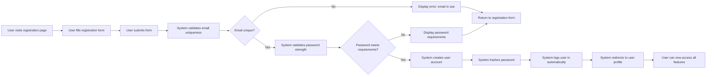
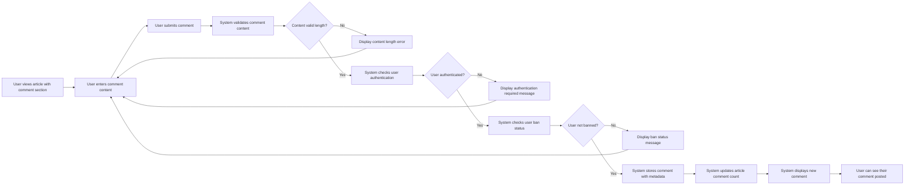
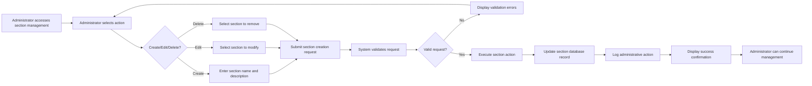

# Economic/Political Discussion Board Requirements Specification

## Introduction

This document provides comprehensive business requirements for the Economic/Political Discussion Board system. The board serves as a platform for users to engage in discussions about economic topics, political issues, and current events in a structured, organized environment with robust moderation capabilities.

The system is designed to support:
- User account management with profile customization
- Article creation and management with file attachments
- Comment system for article discussions
- Section-based content organization
- Administrator and super administrator capabilities
- User banning and moderation tools
- Search and filtering functionality

This requirements specification ensures all stakeholders have a clear understanding of the system's intended functionality, enabling the development team to build a robust, scalable, and user-friendly platform.

## Functional Requirements

### User Account Management

#### Registration and Authentication

WHEN a user visits the registration page, THE system SHALL provide a form requiring email address and password fields.

WHEN a user submits valid registration information, THE system SHALL create a new user account and store the email address and hashed password.

WHEN registration is successful, THE system SHALL automatically log the user in and redirect them to their profile page.

WHEN the email address is already registered, THE system SHALL return an error message indicating the email is already in use.

WHEN password strength requirements are not met, THE system SHALL provide specific guidance on password requirements before registration can proceed.

WHEN a user submits login credentials, THE system SHALL validate the email address and password.

WHEN credentials are valid, THE system SHALL authenticate the user and create a secure session.

WHEN credentials are invalid, THE system SHALL return an appropriate error message and log the failed attempt for security monitoring.

WHEN a user account is banned, THE system SHALL deny login access and display a message explaining the account status.

WHEN a user requests password change, THE system SHALL require verification of their current password before accepting a new password.

WHEN a user successfully changes their password, THE system SHALL immediately invalidate all existing sessions and require re-authentication on all devices.

WHEN a user forgets their password, THE system SHALL allow password reset through email verification.

WHEN password reset is requested, THE system SHALL send a time-limited reset link to the user's registered email address.

WHEN a user deletes their account, THE system SHALL remove all personal data including articles, comments, and profile information.

WHEN a user initiates account deletion, THE system SHALL require confirmation of this irreversible action.

WHEN account deletion is confirmed, THE system SHALL permanently remove the user account and all associated content.

WHEN account deletion completes, THE system SHALL log the user out of all active sessions.

#### Profile Management

WHEN a user creates their profile, THE system SHALL allow them to set a display name and write a bio text.

WHEN a user updates their profile information, THE system SHALL validate the input and update their display name and bio.

WHEN a user views their own profile, THE system SHALL display their display name, bio, list of articles, and list of comments.

WHEN a user views another user's profile, THE system SHALL display the same information but without editing capabilities.

WHEN a user views any profile, THE system SHALL display the current display name and bio information.

WHEN a user views a profile page, THE system SHALL display all articles created by that user.

WHEN a user views a profile page, THE system SHALL display all comments posted by that user.

WHEN the user has no articles or comments, THE system SHALL display an appropriate message indicating no content exists.

### Article Management

#### Article Creation

WHEN a user creates a new article, THE system SHALL require a title, content, and section selection.

WHEN a user submits article creation, THE system SHALL validate that all required fields are provided.

WHEN article creation is successful, THE system SHALL store the article with metadata including creation timestamp and author information.

WHEN a user attaches files to an article, THE system SHALL allow multiple file attachments up to a reasonable size limit.

WHEN a user attaches images to an article, THE system SHALL allow multiple image attachments with appropriate format restrictions.

WHEN a user adds tags to an article, THE system SHALL accept multiple free-text tags and store them as metadata.

WHEN article creation fails validation, THE system SHALL display specific error messages for each invalid field.

#### Article Editing

WHEN a user edits their own article, THE system SHALL allow modification of title, content, attachments, and tags.

WHEN article editing is saved, THE system SHALL update the modified timestamp and maintain edit history if required.

WHEN a user attempts to edit an article they do not own, THE system SHALL deny access and return an appropriate error.

WHEN attachments are added during editing, THE system SHALL validate new file types and sizes against system limits.

WHEN attachments are removed during editing, THE system SHALL properly delete the associated files from storage.

#### Article Deletion

WHEN a user deletes their own article, THE system SHALL remove the article and all associated content including comments.

WHEN an article is deleted, THE system SHALL also delete any attached files and images from storage.

WHEN article deletion is successful, THE system SHALL return the user to the article listing for the section.

WHEN an administrator deletes any article, THE system SHALL record the deletion reason for audit purposes.

#### Article List Display

WHEN a user views a section, THE system SHALL display a paginated list of articles in that section.

WHEN displaying article lists, THE system SHALL show title, author name, tags, comment count, and posting time.

WHEN a user navigates to the next page of results, THE system SHALL load the subsequent set of articles.

WHEN article lists are loaded, THE system SHALL provide sorting options for newest first and oldest first.

WHEN no articles exist in a section, THE system SHALL display an appropriate message and section navigation.

#### Article View

WHEN a user views an article, THE system SHALL display the complete title, content, author information, and posting time.

WHEN viewing an article, THE system SHALL display all attached files with download links and metadata.

WHEN viewing an article, THE system SHALL display all attached images with appropriate preview functionality.

WHEN viewing an article, THE system SHALL display all associated tags as clickable filter elements.

WHEN a user clicks a file download link, THE system SHALL initiate the file download with appropriate headers.

WHEN a user clicks a file download link, THE system SHALL verify the user has permission to access the file.

WHEN viewing an article, THE system SHALL increment and display the view count if such tracking is implemented.

### Comment System

#### Comment Creation

WHEN a user writes a comment on an article, THE system SHALL require content input.

WHEN a comment is submitted, THE system SHALL validate that the content meets minimum and maximum length requirements.

WHEN comment creation is successful, THE system SHALL store the comment with timestamp and author information.

WHEN a user submits a comment, THE system SHALL validate they have not been banned from commenting.

WHEN comment creation fails validation, THE system SHALL provide specific error messages about what needs correction.

#### Comment Display

WHEN an article is viewed, THE system SHALL display all comments on that article.

WHEN comments are displayed, THE system SHALL show author name, content, and posting time.

WHEN comments are displayed, THE system SHALL sort them with oldest comments first and newest comments last.

WHEN an article has no comments, THE system SHALL display an appropriate message inviting users to add the first comment.

#### Comment Editing

WHEN a user edits their own comment, THE system SHALL allow modification of the content.

WHEN comment editing is saved, THE system SHALL update the modified timestamp.

WHEN a user attempts to edit another user's comment, THE system SHALL deny access and return an appropriate error.

WHEN a user attempts to edit a comment after a reasonable time period has passed, THE system SHALL prevent editing.

#### Comment Deletion

WHEN a user deletes their own comment, THE system SHALL remove the comment immediately.

WHEN an administrator deletes any comment, THE system SHALL record the deletion reason for audit purposes.

WHEN a comment is deleted, THE system SHALL update the article's comment count to reflect the change.

### Search and Filtering

#### Article Search

WHEN a user searches articles by title, THE system SHALL return articles where the title contains the search terms.

WHEN a user searches articles by content, THE system SHALL return articles where the content contains the search terms.

WHEN search results are returned, THE system SHALL display paginated results with relevant article information.

WHEN no search results are found, THE system SHALL display an appropriate message and suggest alternative search terms.

#### Tag Filtering

WHEN a user filters articles by tags, THE system SHALL return only articles matching the specified tags.

WHEN tag filtering is combined with keyword search, THE system SHALL apply both filters simultaneously.

WHEN a user clicks on a tag in article details, THE system SHALL navigate to a filtered view showing all articles with that tag.

#### Search Interface

WHEN a user submits search queries, THE system SHALL handle them asynchronously for immediate feedback.

WHEN search results load, THE system SHALL display result counts and maintain sorting options.

WHEN search parameters change, THE system SHALL refresh results appropriately without requiring page reload.

### Section Management

#### Section Display

WHEN a user visits the discussion board, THE system SHALL display a list of all available sections.

WHEN sections are displayed, THE system SHALL show the name and description of each section.

WHEN a user clicks on a section, THE system SHALL navigate to that section's article listing.

WHEN no sections exist, THE system SHALL display a message indicating sections need to be created.

#### Section Creation

WHEN an administrator creates a new section, THE system SHALL require a unique name and description.

WHEN section creation is successful, THE system SHALL make the new section immediately available for article creation.

WHEN a section name already exists, THE system SHALL return an error preventing duplicate section creation.

WHEN section creation fails validation, THE system SHALL provide specific error messages for required fields.

#### Section Editing

WHEN an administrator edits a section, THE system SHALL allow modification of name and description.

WHEN section editing is saved, THE system SHALL update the section information immediately.

WHEN a section name change would create a duplicate, THE system SHALL prevent the change and show an error.

#### Section Deletion

WHEN an administrator deletes a section, THE system SHALL require confirmation of this action.

WHEN a section is deleted, THE system SHALL either archive existing articles or move them to another section.

WHEN section deletion is complete, THE system SHALL update all references to remove the deleted section.

#### Section Permissions

WHEN a non-administrator attempts to create, edit, or delete a section, THE system SHALL deny access and return an appropriate error.

WHEN an administrator accesses section management, THE system SHALL provide appropriate creation, editing, and deletion interfaces.

### Administrator System

#### Administrator Request Process

##### Request Submission

WHEN any user wants to become an administrator, THE system SHALL provide a form to submit an administrator request.

WHEN submitting a request, THE system SHALL require the user to provide a reason text explaining their request.

WHEN a request is submitted, THE system SHALL store it in a pending state for review.

##### Request Review

WHEN a super administrator views pending requests, THE system SHALL display a list of all pending administrator requests.

WHEN a request is displayed, THE system SHALL show the requesting user's information and the reason text.

##### Request Approval/Rejection

WHEN a super administrator approves a request, THE system SHALL grant regular administrator privileges to the user.

WHEN a super administrator rejects a request, THE system SHALL store the decision and notify the user.

WHEN a request is processed, THE system SHALL update the user's role in the system.

#### Administrator Hierarchy

##### Administrator Grades

THE system SHALL support two administrator grades: regular administrator and super administrator.

THE system SHALL maintain role hierarchy where super administrators have additional privileges beyond regular administrators.

##### Permission Assignment

WHEN a super administrator is created, THE system SHALL grant all administrator capabilities plus promotion privileges.

WHEN a regular administrator is created, THE system SHALL grant standard administrator capabilities without promotion privileges.

#### Administrator Capabilities

##### Content Management

Administrators can create, edit, and delete sections as specified in section management requirements.

WHEN an administrator deletes any article, THE system SHALL record the deletion reason for audit purposes.

WHEN an administrator deletes any comment, THE system SHALL record the deletion reason for audit purposes.

##### User Management

WHEN an administrator bans a user, THE system SHALL require a reason to be recorded with the ban.

WHEN an administrator unbans a user, THE system SHALL restore their access to all platform features.

WHEN an administrator views the banned users list, THE system SHALL display all banned users with ban reasons and dates.

##### Administrative Access

Administrators can write articles, comments, and use all regular user features.

Administrators can view all content on the platform regardless of ownership.

Administrators can access audit logs for their administrative actions.

#### Super Administrator Privileges

##### Role Promotion

WHEN a super administrator promotes a regular administrator to super administrator, THE system SHALL update the user's role.

WHEN a super administrator demotes another super administrator to regular administrator, THE system SHALL update the user's role.

WHEN a super administrator attempts to demote themselves, THE system SHALL deny the action and show an appropriate error.

##### Role Verification

THE system SHALL verify super administrator privileges before allowing role changes to other super administrators.

WHEN role changes are made, THE system SHALL log the action for audit purposes including the acting administrator and timestamp.

### Banning System

#### Ban Creation

WHEN an administrator bans a user, THE system SHALL require a reason to be recorded with the ban.

WHEN a user is banned, THE system SHALL immediately terminate all active sessions for that user.

WHEN a ban is created, THE system SHALL record the admin who created it, the reason, and the timestamp.

#### Ban Effects

WHEN a banned user attempts to log in, THE system SHALL deny access and display a message explaining the account status.

WHEN a banned user attempts to create content, THE system SHALL deny access and return an appropriate error.

WHEN a banned user attempts to access their profile, THE system SHALL deny access and show an appropriate message.

#### Content Visibility

WHEN banned users' articles are displayed, THE system SHALL keep them visible and accessible to other users.

WHEN banned users' comments are displayed, THE system SHALL keep them visible and accessible to other users.

WHEN viewing content from banned users, THE system SHALL indicate the user is banned without revealing the reason to other users.

#### Ban Management

WHEN an administrator views banned users, THE system SHALL display all banned users with ban information.

WHEN viewing banned users, THE system SHALL show the ban reason, date, and the administrator who created the ban.

WHEN an administrator unbans a user, THE system SHALL restore all their platform access.

WHEN an administrator unbans a user, THE system SHALL clear the ban status and remove from banned users list.

## Business Process Workflows

### User Registration Workflow

### Article Creation Workflow

```mermaid
graph LR
  A["User selects section to post article"] --> B["User accesses article creation form"]
  B --> C["User enters article title"]
  C --> D["User enters article content"]
  D --> E["User selects section for article"]
  E --> F["User attaches files/images (optional)"]
  F --> G["User adds tags (optional)"]
  G --> H["User submits article"]
  H --> I["System validates required fields"]
  I --> J{"All fields valid?"}
  J -->|No| K["Display validation errors"]
  J -->|Yes| L["System stores article with metadata"]
  L --> M["System saves attachments (if any)"]
  M --> N["System associates tags with article"]
  N --> O["System increments section article count"]
  O --> P["System redirects to article view"]
  K --> B
```

### Comment Submission Workflow

### Section Management Workflow

### Administrator Request Process

```mermaid
graph LR
  A["Regular user decides to become administrator"] --> B["User submits administrator request"]
  B --> C["User provides personal statement"]
  C --> D["User provides qualifications"]
  D --> E["User submits request for review"]
  E --> F["System stores request as pending"]
  F --> G["Super administrator reviews pending requests"]
  G --> H["Super administrator evaluates request"]
  H --> I{"Approve or Reject?"}
  I -->|Approve| J["System grants administrator privileges"]
  I -->|Reject| K["System denies request and notifies user"]
  J --> L["User receives administrator access"]
  K --> M["User can reapply after waiting period"]
  L --> N["User can now perform administrative actions"]
  M --> O["User receives notification of decision"]
```

### Banning Workflow

```mermaid
graph LR
  A["Administrator identifies policy violation"] --> B["Administrator accesses user profile"]
  B --> C["Administrator selects ban option"]
  C --> D["Administrator enters ban duration"]
  D --> E["Administrator enters ban reason"]
  E --> F["Administrator confirms ban action"]
  F --> G["System validates administrative permissions"]
  G --> H{"Permissions valid?"}
  H -->|No| I["Display permission error"]
  H -->|Yes| J["System creates ban record"]
  J --> K["System records administrator identifier"]
  K --> L["System stores ban reason and timestamp"]
  L --> M["System terminates active user sessions"]
  M --> N["System prevents new user logins"]
  N --> O["System preserves user content visibility"]
  O --> P["System displays ban notification to user"]
  I --> B
  P --> Q["Ban is effective immediately"]
```

## Authentication System

### User Session Management

WHEN a user logs in, THE system SHALL create a secure session token.

WHEN a user logs out, THE system SHALL invalidate their session token.

WHEN a session expires, THE system SHALL redirect the user to the login page.

WHEN a password is changed, THE system SHALL invalidate all existing sessions.

WHEN an administrator bans a user, THE system SHALL immediately terminate all active sessions.

### Password Security

WHEN a user creates an account, THE system SHALL require a strong password meeting security criteria.

WHEN passwords are stored, THE system SHALL use industry-standard cryptographic hashing.

WHEN a user requests a password reset, THE system SHALL send a time-limited token to their email.

WHEN a password reset token expires, THE system SHALL invalidate the token and require a new request.

### Session Security

WHEN session tokens are transmitted, THE system SHALL use secure HTTPS encryption.

WHEN a user's IP address changes significantly during a session, THE system SHALL require re-authentication.

WHEN suspicious activity is detected, THE system SHALL implement additional security measures.

## Business Rules and Validation

### Content Validation Rules

THE system SHALL validate that article titles are between 1 and 200 characters.

THE system SHALL validate that article content meets minimum length requirements.

THE system SHALL validate that comment content meets length requirements.

THE system SHALL limit the number of tags per article to prevent abuse.

### File Attachment Rules

THE system SHALL restrict file types to prevent malicious uploads.

THE system SHALL limit individual file sizes to prevent storage abuse.

THE system SHALL limit total storage usage per article to maintain system stability.

### Rate Limiting Rules

THE system SHALL implement rate limiting to prevent spam and abuse.

WHEN rate limits are exceeded, THE system SHALL temporarily block further actions from the offending user.

## Performance Requirements

### Response Time Expectations

THE system SHALL respond to user actions within reasonable timeframes appropriate for web applications.

WHEN loading article lists, THE system SHALL display initial results within 3 seconds for typical user conditions.

WHEN searching articles, THE system SHALL return results within 2 seconds for standard queries.

WHEN submitting content, THE system SHALL provide immediate feedback on successful submissions.

### Scalability Requirements

THE system SHALL be designed to handle growth in users and content without requiring architecture changes.

WHEN traffic increases, THE system SHALL maintain performance through appropriate caching and optimization.

WHEN data storage needs grow, THE system SHALL support horizontal scaling of storage resources.

## Security Requirements

### Authentication Security

WHEN users submit passwords, THE system SHALL transmit them securely using HTTPS encryption.

WHEN passwords are stored, THE system SHALL hash them using industry-standard cryptographic algorithms.

WHEN sensitive administrative actions occur, THE system SHALL log the action for security auditing.

WHEN user sessions expire, THE system SHALL securely invalidate session tokens to prevent unauthorized access.

### Authorization Security

WHEN a user attempts to access restricted content, THE system SHALL verify appropriate permissions.

WHEN administrative actions occur, THE system SHALL log the action for audit purposes.

WHEN a user attempts to delete content they do not own, THE system SHALL deny the request.

### Data Protection

WHEN user data is transmitted, THE system SHALL use encryption to protect sensitive information.

WHEN data is stored, THE system SHALL implement appropriate security measures.

WHEN user accounts are deleted, THE system SHALL ensure complete removal of all associated data.

## Business Model

### Platform Purpose

The Economic/Political Discussion Board serves as a platform for users to engage in informed discussions about economic topics, political issues, and current events. The platform aims to foster constructive dialogue, share diverse perspectives, and create a repository of informed discussions on important societal topics.

### Revenue Model

The platform operates as a free service supported by:
- Advertising revenue from relevant business and financial services
- Premium subscription options for enhanced features
- Potential partnership opportunities with educational institutions and research organizations

### User Value Proposition

Users gain access to:
- A moderated platform for informed discussions
- Expert perspectives from other users in the community
- Organized content through sections and tagging
- Tools to manage their participation and reputation
- Reliable, trustworthy information sources

### Community Standards

The platform maintains strict community standards to ensure:
- Respectful discourse and constructive debate
- Accuracy and verifiability of information shared
- Protection of user privacy and data security
- Fair treatment of all participants regardless of background
- Transparent moderation practices and appeals processes

## Administrator Capabilities Matrix

| Capability | Regular Admin | Super Admin | All Users | Guests |
|------------|---------------|-------------|-----------|--------|
| Create articles | ✅ | ✅ | ✅ | ❌ |
| Write comments | ✅ | ✅ | ✅ | ❌ |
| Create sections | ❌ | ✅ | ❌ | ❌ |
| Delete sections | ❌ | ✅ | ❌ | ❌ |
| Edit sections | ❌ | ✅ | ❌ | ❌ |
| Delete articles | ✅ | ✅ | ❌ | ❌ |
| Delete comments | ✅ | ✅ | ❌ | ❌ |
| Ban users | ✅ | ✅ | ❌ | ❌ |
| Unban users | ✅ | ✅ | ❌ | ❌ |
| View banned users | ✅ | ✅ | ❌ | ❌ |
| Approve admin requests | ❌ | ✅ | ❌ | ❌ |
| Promote admins | ❌ | ✅ | ❌ | ❌ |
| Demote admins | ❌ | ✅ | ❌ | ❌ |
| View all content | ❌ | ✅ | ❌ | ❌ |

## User Experience Considerations

### Accessibility Requirements

THE system SHALL follow web accessibility guidelines to ensure use by people with disabilities.

WHEN content is displayed, THE system SHALL use semantic HTML and proper heading structures.

WHEN interactive elements are provided, THE system SHALL ensure they are keyboard navigable.

### Internationalization

THE system SHALL support multiple languages for interface elements.

THE system SHALL handle date and time display according to user preferences.

THE system SHALL support various character sets and encoding for international users.

### Mobile Responsiveness

THE system SHALL provide a responsive design that works on desktop and mobile devices.

THE system SHALL optimize content display for various screen sizes.

THE system SHALL ensure touch interactions work properly on mobile devices.

## Future Enhancement Considerations

### Potential Additional Features

- Rich text editing for articles and comments
- Email notifications for replies and mentions
- Social media integration for content sharing
- Mobile application support
- Advanced analytics and reporting
- Content moderation workflow tools
- User reputation and engagement scoring
- Peer-to-peer messaging between users
- Bookmarking and saving favorite articles
- Article rating and comment voting systems

These features are not part of the initial implementation requirements but are considered for future development based on user needs and business growth.

## Conclusion

This requirements specification provides a comprehensive foundation for the Economic/Political Discussion Board system. The requirements cover all essential functionality including user management, content creation, moderation capabilities, and administrative controls.

The system is designed to be:
- User-friendly with intuitive navigation
- Secure with robust authentication and authorization
- Scalable to support growing user bases
- Maintainable with clean architecture and documentation
- Extensible for future feature additions

All requirements have been specified in clear, unambiguous language to enable effective implementation by the development team. The business requirements focus on what the system should do without specifying how it should be implemented, allowing technical teams the flexibility to choose appropriate solutions and architectures.