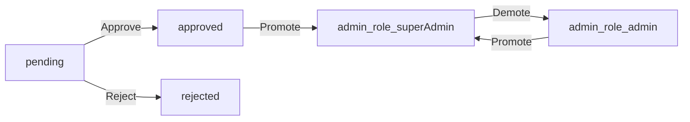
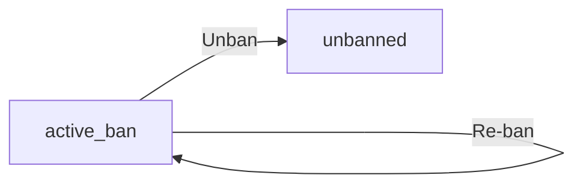

**discussionBoard — Business concepts, relationships, and states from user perspective**

Business concepts, relationships, and states from user perspective

# Domain Concepts

Describe what each concept means to users and why it exists.

## User Concept

A User represents an individual participant in the discussion board who can register, log in, and engage with content. Users create accounts using a unique email and secure password, then access the platform by authenticating with these credentials. Once registered, users can create and manage their profile with a display name and bio. They can write articles, post comments, attach files and images, and tag content. Users can edit their own articles and comments, delete them, and change their password. When a user deletes their account, all associated content is also removed. Users can be banned by administrators, which prevents login but preserves existing content visibility.

### User Registration

WHEN a user registers for the discussion board, THE system SHALL:
1. Require a unique email address
2. Require a password
3. Require a display name (1-100 characters)
4. Set the user role to "member"
5. Create an initial empty profile

WHILE a user completes registration, THE system SHALL:
- Store the email and password securely
- Store the display name as part of the user profile
- Initialize the user with no articles or comments

THE system SHALL reject registration when:
- The email address is already associated with another account
- The display name is empty or exceeds 100 characters
- The password fails security requirements (defined in [04-business-rules.md])

### Account Authentication

WHEN a user attempts to log in, THE system SHALL:
1. Require the user's email address
2. Require the user's password
3. Verify the credentials against stored values
4. Establish an authenticated session upon successful verification

THE system SHALL reject login when:
- The email address is not registered
- The provided password does not match the stored password
- The user account has been banned (see [BanRecord Concept])

WHEN a user logs out, THE system SHALL terminate their authenticated session.

### Profile Management

WHEN a user updates their profile, THE system SHALL:
1. Allow editing of the display name (1-100 characters)
2. Allow editing of the bio text
3. Save changes to the user's profile

WHEN a user views another user's profile, THE system SHALL:
1. Display the display name and bio
2. Display a list of all articles written by that user
3. Display a list of all comments written by that user

THE system SHALL display "No bio provided" when a user has not set a bio.

### Content Creation

WHEN a user creates an article, THE system SHALL:
1. Require a title (1-500 characters)
2. Require content text
3. Require selection of one section
4. Associate the article with the creating user
5. Record the creation timestamp

WHEN a user writes a comment, THE system SHALL:
1. Require content text
2. Associate the comment with a specific article
3. Associate the comment with the writing user
4. Record the creation timestamp

THE system SHALL allow users to attach files and images when creating articles (see [FileAttachment Concept]).
THE system SHALL allow users to add multiple tags to articles when creating them (see [Tag Concept]).

## Section Concept

A Section organizes the discussion board into topic categories such as Politics, Economy, and Current Affairs. Sections help users navigate and find content relevant to their interests by grouping related articles together. Each section has a unique name and descriptive text explaining its purpose. Users can browse all sections and view articles within any section. Only administrators can create, edit, or delete sections to maintain structure and consistency. Users cannot create their own sections but can select from available ones when posting articles.

### Section Organization

THE system SHALL organize the discussion board into topic categories called sections.
WHEN a section is displayed, THE system SHALL show the section name and description.
WHEN users view the section list, THE system SHALL display all available sections.
WHILE viewing a section, THE system SHALL show only articles belonging to that section.

### Topic Categories

THE system SHALL provide topic categories such as Politics, Economy, and Current Affairs.
WHEN users create an article, THE system SHALL require selecting one section from available topic categories.
WHEN a user browses articles, THE system SHALL group them by their assigned section.

### Content Grouping

WHEN articles are posted in the same section, THE system SHALL group them together for collective viewing.
WHEN users navigate to a section, THE system SHALL display only articles belonging to that section.
WHEN a section is selected, THE system SHALL filter articles to show only those assigned to that section.

### Section Navigation

WHEN users browse the board, THE system SHALL provide navigation to all available sections.
WHEN a user views a section, THE system SHALL provide navigation links to other sections.
WHEN a user navigates between sections, THE system SHALL retain their current sorting preference.

### Section Listing

WHEN the section list is displayed, THE system SHALL show the name and description of each section.
WHEN users view the section list, THE system SHALL display sections in alphabetical order by name.
WHEN a user selects a section, THE system SHALL navigate to that section's article list.

### Section Management

### Section Creation (Admin Only)

WHEN a regular administrator creates a section, THE system SHALL require a name and description.
WHEN a super administrator creates a section, THE system SHALL require a name and description.

### Section Modification (Admin Only)

WHEN a regular administrator edits a section, THE system SHALL allow updating the name and description.
WHEN a super administrator edits a section, THE system SHALL allow updating the name and description.
WHEN a section is edited, THE system SHALL preserve existing articles assigned to that section.

### Section Deletion (Admin Only)

WHEN a regular administrator deletes a section, THE system SHALL require confirmation before deletion.
WHEN a super administrator deletes a section, THE system SHALL require confirmation before deletion.
WHEN a section is deleted, THE system SHALL move all articles in that section to a default section or mark them as unassigned.

### Section Availability

WHEN a user attempts to create an article, THE system SHALL show only active sections.
WHEN a section is deleted, THE system SHALL prevent new articles from being created in that section.
WHEN a user navigates to a deleted section URL, THE system SHALL redirect to the default section.

### Article Categorization by Section

### Section Assignment for Articles

WHEN a user creates an article, THE system SHALL require selecting exactly one section.
WHEN a user edits an article, THE system SHALL allow changing the assigned section.
WHEN an article is moved to a different section, THE system SHALL update its section association.

### Section-Based Filtering

WHEN a user selects a section to view, THE system SHALL show only articles assigned to that section.
WHEN a user searches articles, THE system SHALL include results from all sections unless filtered.
WHEN filtering by section, THE system SHALL exclude articles from other sections.

### Section Consistency

WHEN a user views an article, THE system SHALL display the section name where the article is categorized.
WHEN displaying the article list, THE system SHALL include the section name for each article.
WHEN articles appear in search results, THE system SHALL indicate which section each article belongs to.

## Article Concept

An Article represents a original discussion post created by a user within a specific section. Users write articles to share thoughts, analyses, or questions about economic and political topics. Each article requires a title and content, and must be associated with exactly one section. Users can attach multiple files and images to enrich their articles, and apply multiple tags for discoverability. Article authors can edit their own content, including title, body, attachments, and tags. They can also delete their articles entirely. Articles serve as the primary content vehicles for discussion and are the focus of comment threads.

### Article Creation

WHEN a user creates an article, THE system SHALL:
1. Require a title of 1-500 characters
2. Require content text
3. Require selection of exactly one section
4. Associate the article with the creating user as author
5. Record the creation timestamp

IF the title is missing or exceeds 500 characters, THE system SHALL reject the request.
IF the content is missing, THE system SHALL reject the request.
IF no section is selected or the section does not exist, THE system SHALL reject the request.

### Content Authoring

WHEN a user author article content, THE system SHALL:
1. Allow free-form text input in the content field
2. Support rich text or plain text depending on platform capabilities
3. Allow the author to preview the content before publishing

WHILE an article is in draft state, THE system SHALL allow the author to continue editing the content.

THE system SHALL store the article content exactly as entered, preserving line breaks and formatting characters.

### Section Assignment

WHEN a user creates or edits an article, THE system SHALL:
1. Require assignment to exactly one section
2. Validate that the selected section exists and is active
3. Prevent assignment to sections the user does not have access to

WHEN an article is displayed in a section, THE system SHALL:
1. Show the section name alongside the article
2. Include the article in the section's article list

IF a user attempts to assign an article to a non-existent section, THE system SHALL reject the request.

### File Attachment

WHEN a user attaches a file to an article, THE system SHALL:
1. Accept multiple file attachments per article
2. Record the file name, file URL, file size, file type, and upload timestamp
3. Allow file attachment during article creation or subsequent edits
4. Permit the user to remove previously attached files

WHEN a user views an article, THE system SHALL:
1. Display a list of attached files with their names
2. Provide download capability for each attached file

IF a file exceeds the system's size limit, THE system SHALL reject the upload.

### Image Attachment

WHEN a user attaches an image to an article, THE system SHALL:
1. Accept multiple image attachments per article
2. Record the image file name, URL, size, type (MIME), and upload timestamp
3. Allow image attachment during article creation or subsequent edits
4. Permit the user to remove previously attached images

WHEN a user views an article, THE system SHALL:
1. Display the attached images inline with the content where placed
2. Allow direct download of each image

IF an image file exceeds the system's size limit, THE system SHALL reject the upload.

### Tag Management

WHEN a user creates or edits an article, THE system SHALL:
1. Allow multiple free-text tags to be added
2. Validate each tag is 1-50 characters
3. Support adding tags during initial creation or subsequent edits
4. Permit removal of existing tags

WHEN an article is displayed, THE system SHALL:
1. Show all associated tags
2. Enable tag-based filtering and search

IF any tag exceeds 50 characters or is empty, THE system SHALL reject the update.

### Article Editing

WHEN the author of an article edits their article, THE system SHALL:
1. Allow updating the title, content, section, attachments, and tags
2. Record the update timestamp
3. Allow partial updates (edit only some fields)
4. Preserve attachments not explicitly removed during edit

WHEN a user attempts to edit an article they do not own, THE system SHALL reject the request.

WHEN an article is edited, THE system SHALL:
1. Maintain the original creation timestamp
2. Update the modification timestamp to the current time
3. Store all previous versions for audit purposes if versioning is enabled.

### Article Deletion

WHEN the author of an article deletes their article, THE system SHALL:
1. Permanently remove the article and all associated data
2. Include all attached files and images in the deletion
3. Remove all associated tags and tag relationships
4. Record the deletion timestamp for audit purposes

WHEN an administrator deletes an article, THE system SHALL:
1. Permanently remove the article and all associated data
2. Maintain the same cleanup behavior as author deletion

THE system SHALL NOT allow recovery of deleted articles after deletion is confirmed.

## Comment Concept

A Comment represents a user's response to an article, enabling discussion around the article's content. Comments are single-level messages—users cannot reply to other comments directly. Users can write comments on any article they can view, and must provide content for each comment. Comments appear in chronological order with the oldest responses first. Comment authors can edit or delete their own comments, but cannot modify comments by others. Each comment shows who wrote it, when it was posted, and any subsequent edits. Comments facilitate threaded discussion while maintaining simplicity through single-level interaction.

### Comment Writing

### Comment Writing

WHEN a user writes a comment on an article, THE system SHALL:
1. Require content for the comment
2. Associate the comment with the user writing it
3. Associate the comment with the target article
4. Record the creation timestamp

WHERE a user has permission to view an article, THE system SHALL allow that user to write a comment on it.

WHILE a user is writing a comment, THE system SHALL allow them to edit the content before submitting.

IF the comment content is empty when submitted, THE system SHALL reject the request.

### Article Discussion

### Article Discussion

WHEN a user views an article, THE system SHALL show:
1. All comments on that article
2. The total number of comments
3. The ability to add a new comment if the user has permission

WHEN a user adds a comment to an article, THE system SHALL update the comment count visible in article lists.

WHEN a user views the list of comments on an article, THE system SHALL display:
1. Each comment's author
2. Each comment's content
3. Each comment's creation timestamp
4. Any edit timestamp if the comment was modified

### Comment Editing

### Comment Editing

WHEN a user edits their own comment, THE system SHALL:
1. Allow changes to the comment content
2. Update the edit timestamp
3. Maintain the original author and article association

WHILE a comment is being edited, THE system SHALL display an indication that the comment has been modified.

WHEN a user attempts to edit a comment they do not own, THE system SHALL reject the request.

### Comment Deletion

### Comment Deletion

WHEN a user deletes their own comment, THE system SHALL:
1. Remove the comment from display
2. Update the associated article's comment count
3. Maintain a record of the deletion for audit purposes

WHEN a user attempts to delete a comment they do not own, THE system SHALL reject the request.

WHEN an administrator deletes any comment, THE system SHALL:
1. Remove the comment from display
2. Update the associated article's comment count
3. Record the administrator who performed the deletion

### Comment Visibility

### Comment Visibility

THE system SHALL display a comment to any user who can view the associated article.

WHILE a user is viewing an article, THE system SHALL show all comments on that article regardless of the comment author's role.

WHEN a user is banned, THE system SHALL still display their existing comments on articles.

THE system SHALL NOT display comments that have been deleted by the author or by an administrator.

### Reply Functionality

### Reply Functionality

Comment functionality is intentionally single-level:

WHEN a user views a comment, THE system SHALL NOT provide options to reply to that comment directly.

WHEN a user wants to respond to a comment, THE system SHALL direct them to write a new comment on the original article.

THE system SHALL NOT support nested or threaded comment structures.

WHEN a user views the list of comments on an article, THE system SHALL display all comments as independent top-level entries.

### Comment Chronological Order

### Comment Chronological Order

WHEN a user views comments on an article, THE system SHALL display them sorted by creation timestamp in ascending order (oldest first).

WHEN a new comment is added to an article, THE system SHALL append it to the end of the chronological list.

WHEN a user edits a comment, THE system SHALL preserve its original position in the chronological list.

WHEN an administrator views comments on an article, THE system SHALL display them in the same chronological order as regular users.

THE system SHALL NOT provide sorting options for comment order beyond chronological (oldest first).

## FileAttachment Concept

A FileAttachment represents a file that users upload and associate with articles to support or supplement their content. Users can attach multiple files to a single article, such as documents, spreadsheets, or other relevant materials. When attaching files, users provide the original filename, and the system records the file's location and size. File attachments appear alongside the article content and are available for other users to download. Users can include files when creating or editing articles, and attachments remain associated with the article even when it's viewed in section lists or search results.

### File Attachment Creation

WHEN a user attaches a file to an article, THE system SHALL:
1. Accept the original filename provided by the user
2. Record the file size in bytes
3. Store the file type (MIME type)
4. Generate and store the file URL for retrieval
5. Associate the file with the article being created or edited

WHILE a user is editing an article, THE system SHALL allow:
1. Adding new file attachments
2. Removing existing file attachments
3. Maintaining existing file attachments unchanged

THE system SHALL record the exact time when each file is uploaded and associated with an article.

### Document Upload

WHEN a user uploads a document as part of article creation or editing, THE system SHALL:
1. Accept standard document formats including PDF, Word, Excel, and PowerPoint files
2. Validate that uploaded files do not exceed the maximum file size limit of 10MB per file
3. Ensure the total number of attachments per article does not exceed five
4. Preserve the original filename while generating a secure internal storage path

IF a user attempts to upload a file exceeding the size limit, THE system SHALL reject the upload with an error.

IF a user attempts to attach more than five files to a single article, THE system SHALL reject the additional attachments.

### Article Support Material

WHEN a user views an article, THE system SHALL:
1. Display all attached files below the article content
2. Show the original filename for each attachment
3. Provide visual indicators that files are available for download

WHEN a user adds supporting documentation to an article, THE system SHALL:
1. Link the files to that specific article only
2. Maintain the association between files and articles even when articles are moved between sections
3. Display attachment count on article list views

THE system SHALL ensure that file attachments complement the article content and remain accessible whenever the article is viewed.

### File Download

WHEN a user accesses an article with file attachments, THE system SHALL:
1. Provide download links for each attached file
2. Preserve the original filename when initiating downloads
3. Serve files with appropriate content-type headers

WHEN a user initiates a file download, THE system SHALL:
1. Authenticate the user's access rights to the article
2. Verify the article has not been deleted
3. Retrieve and serve the file from storage

THE system SHALL allow users to download attached images and documents for offline reference.

### Multiple Attachments

WHEN a user attaches multiple files to a single article, THE system SHALL:
1. Process each file independently while maintaining their association
2. Store each file with unique identifiers to prevent naming conflicts
3. Display attachments in the order they were added

THE system SHALL allow users to:
1. Attach up to five files to a single article
2. Mix different file types (documents, spreadsheets, images) in one article
3. View the total attachment count on article listings

IF an article exceeds the maximum of five attachments, THE system SHALL reject additional attachment requests until existing attachments are removed.

### Attachment Management

WHEN a user edits an article, THE system SHALL:
1. Allow adding new file attachments alongside existing ones
2. Permit removing specific file attachments without affecting others
3. Maintain attachment integrity during article updates

WHEN a user deletes an article, THE system SHALL:
1. Remove all associated file attachments from public access
2. Mark attachments for eventual deletion from storage
3. Maintain referential integrity by preventing orphaned attachments

WHILE a user views attachment details, THE system SHALL:
1. Show the original filename, file size, and upload time
2. Display the file type indicator
3. Provide direct download functionality for each attachment

### File Metadata

WHEN a file is attached to an article, THE system SHALL record and maintain:
1. Original filename provided by the user
2. File size in bytes
3. File type (MIME type) as determined during upload
4. Generated file URL for secure access
5. Exact timestamp of upload and attachment

THE system SHALL use file metadata to:
1. Display relevant information to users when viewing attachments
2. Validate file types during upload processing
3. Track storage usage per user and per article
4. Ensure proper file retrieval during download operations

WHEN an article is viewed, THE system SHALL display key file metadata to users:
1. Original filename for clear identification
2. File size for download planning
3. Upload timestamp to indicate recency

## Tag Concept

A Tag represents a free-text label that users apply to articles for classification and searchability. Tags are user-defined keywords that help categorize content beyond the article's section. Users can apply multiple tags to each article, enabling richer discovery and filtering. Tags are typically short, relevant terms related to the article's topic. Administrators don't manage tags—they exist purely as user-applied labels. When users search or filter articles by tags, the system matches against these user-defined terms. Tags enhance content discoverability and personal organization of the discussion board.

### Tag Definition and Properties

A Tag represents a user-defined keyword or label that classifies an article by topic, theme, or subject matter. Tags enable users to categorize content beyond the article's assigned section.

THE system SHALL allow each tag to have a name field containing 1-50 characters.
WHEN a user creates or edits an article, THE system SHALL allow them to add tags using free-text input.
WHEN a tag is created, THE system SHALL store it as a new entry if it does not already exist.
THE system SHALL NOT require approval or moderation for tag creation.

A tag's name is user-defined and can include any text that helps classify the article's content.

### Article-Tag Relationship

Each article can be associated with multiple tags through the ArticleTag relationship. This creates a many-to-many linkage between articles and tags.

WHEN a user creates an article with tags, THE system SHALL create ArticleTag records linking those tags to the article.
WHEN a user edits an article's tags, THE system SHALL update the ArticleTag records accordingly.
WHEN a user removes all tags from an article, THE system SHALL delete all associated ArticleTag records.

An article can have zero or more tags associated with it. Tags do not exist independently without being linked to at least one article through the ArticleTag relationship.

### Multi-Tag Support

Users can apply multiple tags to a single article to capture its diverse topics and themes.

WHEN a user creates an article, THE system SHALL allow them to specify multiple tags separated by commas or spaces.
WHEN a user edits an article, THE system SHALL allow them to add additional tags while retaining existing ones.
WHEN a user removes a tag from an article, THE system SHALL delete only that specific tag's ArticleTag record, leaving other tag associations intact.

THE system SHALL support at least one tag per article as a minimum requirement.

### Content Tagging Process

Tagging is the process of associating keywords with articles to improve discoverability and organization.

WHEN a user writes an article, THE system SHALL provide a field for entering tags as free-text input.
WHEN a user submits tags, THE system SHALL parse the input to create individual tag entries.
WHEN tag parsing occurs, THE system SHALL trim whitespace and normalize tag entries.

Tagging is performed solely by the article's author during creation or editing. No other users can directly modify the tags on an article.

### Tag-Based Search

Users can search for articles using tags to find content related to specific topics of interest.

WHEN a user searches for articles by tag, THE system SHALL return articles that have the matching tag associated.
WHEN a user enters multiple search tags, THE system SHALL return articles that match at least one of the specified tags.
WHEN a tag search yields results, THE system SHALL display paginated results showing article titles, authors, and tag lists.

Tag search functionality enables users to discover articles on specific economic or political topics they are interested in.

### Tag-Based Filtering

Users can filter articles by tag to narrow down content based on specific topics or themes.

WHEN a user filters articles by tag, THE system SHALL show only articles that have the specified tag.
WHEN a user applies multiple filter tags, THE system SHALL show articles that match any of the selected tags.
WHEN no articles match the selected tags, THE system SHALL display an empty state with appropriate messaging.

Tag filtering allows users to focus on specific areas of interest within the discussion board, complementing section-based navigation.

### Tag Display and Visibility

Tags are displayed to users as part of article listings and individual article views to show classification information.

WHEN an article is displayed in a list view, THE system SHALL show its associated tags beneath the title.
WHEN an article is displayed individually, THE system SHALL show all its tags in a dedicated tags section.
WHEN a user views another user's profile, THE system SHALL show tags that appear on their articles.

Each tag displayed to users shall be presented as a clickable or selectable element for search and filtering purposes.

### Tag Persistence and Retention

Tag data persists as long as the associated article exists and follows the article's lifecycle rules.

WHEN an article is deleted, THE system SHALL remove all associated Tag and ArticleTag records.
WHEN an article is archived or hidden, THE system SHALL retain all Tag and ArticleTag records.
WHEN a user account is deleted, THE system SHALL remove all Tag and ArticleTag records associated with their articles.

Tags cannot exist independently without at least one ArticleTag association to an article.

### Error Conditions for Tagging

The system handles various error conditions related to tag creation and management.

IF a user attempts to create a tag with more than 50 characters, THE system SHALL reject the input and display an appropriate error message.
IF a user attempts to create a tag with no content or only whitespace, THE system SHALL reject the input.
IF a user attempts to add a tag that already exists, THE system SHALL reuse the existing tag rather than creating a duplicate.
IF a user attempts to modify tags on an article they do not own, THE system SHALL reject the request.

## ArticleTag Concept

An ArticleTag represents the relationship between an article and a tag that users have applied to it. It's the mechanism that connects articles with their user-defined tags. When a user adds tags to an article during creation or editing, the system creates ArticleTag entries linking the two. Each association records when the tag was applied and maintains the relationship until the tag is removed. ArticleTag enables efficient querying of which tags belong to which articles. Users don't interact directly with ArticleTag—it operates behind the scenes to support tag-based features.

### Tag-Article Relationship

An ArticleTag represents the relationship between an article and a tag that users have applied to it. This relationship enables users to classify content and enables search systems to connect related articles.

WHEN a user adds a tag to an article, THE system SHALL create an ArticleTag record linking them.
WHEN a user removes a tag from an article, THE system SHALL delete the corresponding ArticleTag record.
THE system SHALL maintain each ArticleTag record until explicitly removed.
ArticleTag records only exist when both the associated article and tag are valid.
ArticleTag records do not have independent existence—they are purely relational.
ArticleTag relationships are immutable after creation—their only change is deletion.

### Tag Association

A tag association connects an article with a user-defined tag, forming the foundational relationship for content classification.

WHEN a user creates or edits an article with tags, THE system SHALL create tag associations for each provided tag.
WHEN a user removes tags from an article, THE system SHALL delete those tag associations.
THE system SHALL ensure an article cannot have duplicate associations with the same tag.
Each tag association links exactly one article to exactly one tag.
Tag associations cannot exist without both a valid article and a valid tag.
Article authors may associate any number of tags with their articles.
Each tag association records when the association was established.

### Tag Linking

Tag linking enables users to discover related articles through shared tags, functioning as a content routing mechanism.

WHEN a user applies tags to an article, THE system SHALL link the article to those tags for future discovery.
WHEN a user searches by tag, THE system SHALL return all articles linked through ArticleTag records.
WHEN a user removes tags from an article, THE system SHALL unlink the article from those tags.
THE system SHALL maintain bidirectional linking—each article points to its tags, and each tag points to its articles.
Tag linking operates automatically—the system creates and removes links without user intervention beyond adding/removing tags.
ArticleTag links persist until explicitly removed by tag removal.
ArticleTag links are the sole mechanism for establishing relationships between articles and tags.

### Content Classification Linkage

Content classification linkage enables users to categorize articles by topics of interest, making discussion boards more navigable.

WHEN a user adds tags to an article, THE system SHALL establish classification linkages enabling topic-based organization.
WHEN users browse by tag, THE system SHALL display all articles with classification linkages through that tag.
THE system SHALL allow articles to have multiple classification linkages simultaneously.
Article classification linkages are self-service—authors control their own classification.
Each classification linkage represents one topic dimension for the article.
Users can reclassify articles by removing old tags and adding new ones.
Article classification linkages are visible through tag displays and search results.

### Tag Temporal Record

A tag temporal record captures when each tag was applied to an article, enabling chronological tracking of content classification.

WHEN a user adds a tag to an article, THE system SHALL record the timestamp of that association.
THE system SHALL maintain the original timestamp when a tag was applied, even if the article is later edited.
WHEN viewing tag history, THE system SHALL show when each tag was first applied.
Tag temporal records persist regardless of article edits or updates.
Tag temporal records are created at the moment of association and never modified.
Tag temporal records enable chronological sorting of article classification.
Tag temporal records are read-only after creation.

### Multi-Tag Relationship

A multi-tag relationship allows articles to be classified by multiple tags simultaneously, enabling rich content categorization.

WHEN a user applies multiple tags to an article, THE system SHALL create separate ArticleTag records for each tag.
THE system SHALL allow articles to have any number of tag relationships.
WHEN a user removes one tag, THE system SHALL preserve other tag relationships on the same article.
Each multi-tag relationship operates independently—one relationship's deletion doesn't affect others.
ArticleTag records for multi-tag relationships are created atomically during tagging.
The system SHALL support displaying all tags on an article as a group.
Multi-tag relationships enable complex content organization and advanced search filtering.

## AdministratorRequest Concept

An AdministratorRequest represents a formal application from a user seeking administrative privileges on the discussion board. Any registered user can submit such a request, providing a written reason explaining why they should become an administrator. Requests start in a pending state and remain visible only to super administrators until processed. Super administrators review pending requests and can either approve or reject them. Once approved, the user gains regular administrator capabilities. Rejected requests are archived and don't trigger reapplication until user initiative. This system allows for democratic privilege escalation within a structured approval process.

### Administrator Application Process

WHEN a user submits an administrator application, THE system SHALL:
1. Require the user to provide a reason text explaining why they should become an administrator
2. Set the application status to "pending"
3. Record the submission timestamp
4. Associate the application with the submitting user

WHERE an application is pending, THE system SHALL:
- Display it only to super administrators in the pending requests list
- Prevent the applicant from viewing or editing the application

### Privilege Escalation Workflow

WHEN a super administrator approves an administrator application, THE system SHALL:
1. Update the applicant's role from "member" to "admin"
2. Update the application status to "approved"
3. Record the approval timestamp
4. Clear any pending status

WHILE an application remains pending, THE system SHALL:
- Prevent the user from accessing administrative capabilities
- Maintain the user's current role without changes

### Request Submission Requirements

WHEN a user submits an administrator request, THE system SHALL:
1. Require non-empty reason text
2. Validate that the user is currently a member (not already an admin)
3. Reject the submission if the user already has an active pending request

IF the user already has a pending administrator request, THE system SHALL reject the new submission with an error message.

### Super Administrator Approval Action

WHEN a super administrator approves an administrator request, THE system SHALL:
1. Change the requesting user's role to "admin"
2. Mark the request as approved with timestamp
3. Allow the newly approved admin to access administrative capabilities immediately

WHERE a request is approved, THE system SHALL:
- Prevent re-submission by the same user until role demotion occurs
- Record the approval timestamp and super administrator identifier

### Administrator Onboarding Pathway

WHEN an administrator application is approved, THE system SHALL:
1. Immediately grant the user "admin" role privileges
2. Allow the user to access administrator-only operations
3. Maintain all previous user capabilities (article posting, commenting, etc.)

WHERE a user becomes an administrator, THE system SHALL:
- Display their new role in their profile
- Include their administrator status in permission checks

### Administrator Rejection Process

WHEN a super administrator rejects an administrator request, THE system SHALL:
1. Mark the request status as "rejected"
2. Record the rejection timestamp
3. Allow optional rejection reason to be recorded
4. Maintain the user's current role unchanged

IF an application is rejected, THE system SHALL:
- Permit the user to submit a new request at any time
- Archive the rejected request for historical tracking

### Request Tracking and History

THE system SHALL maintain a complete history of all administrator requests with:
1. Request identifier
2. Applicant information
3. Submission timestamp
4. Current status (pending/approved/rejected)
5. Processing timestamps and actor information
6. Reason text and optional rejection reason

WHERE a user views their own request history, THE system SHALL:
- Display all past administrator requests they submitted
- Show current status for each request

## BanRecord Concept

A BanRecord represents an administrative action that prohibits a user from logging into the discussion board. When administrators ban a user, they must provide a reason for the action, which is stored in the ban record. Banned users immediately lose the ability to log in, but any content they created—articles and comments—remains visible to other users. Ban records include when the ban occurred and whether it has been lifted. Administrators can unban users, which records the unbanning timestamp and clears the active ban. Users can view a list of banned users, including the recorded reasons for their ban, providing transparency to the administrative process.

### User Banning

WHEN an administrator bans a user, THE system SHALL:
1. Record the ban in a new BanRecord
2. Prevent the banned user from logging in
3. Preserve all articles and comments created by the banned user
4. Display the ban status on the user's profile

WHEN a user attempts to log in, THE system SHALL:
1. Check for any active ban records
2. Reject the login attempt if an active ban exists
3. Display the ban reason to the user if the account is banned

WHILE a user is banned, THE system SHALL:
1. Allow the banned user's articles to remain publicly visible
2. Allow the banned user's comments to remain publicly visible
3. Prevent the banned user from creating new articles or comments
4. Prevent the banned user from editing existing content

### Ban Administration

WHEN a regular administrator creates a BanRecord, THE system SHALL:
1. Require a ban reason to be provided
2. Record the administrator who created the BanRecord
3. Record the timestamp of the ban
4. Apply the ban immediately

WHEN a super administrator creates a BanRecord, THE system SHALL:
1. Have the same capabilities as a regular administrator for banning
2. Maintain a log of all ban actions for audit purposes

THE system SHALL NOT allow administrators to ban other administrators with higher or equal privilege level.

THE system SHALL NOT allow a user to ban themselves.

### Ban Reason Recording

WHEN a BanRecord is created, THE system SHALL:
1. Store the ban reason as required text
2. Store the ban reason in a format viewable by the banned user
3. Store the ban reason in a format viewable by other administrators

WHEN a user views their own ban status, THE system SHALL:
1. Display the recorded ban reason

WHEN an administrator views a banned user's profile, THE system SHALL:
1. Display the ban reason alongside the ban status

WHEN an administrator views the list of banned users, THE system SHALL:
1. Show each user's display name and the ban reason

### Banned User List

WHEN an administrator accesses the banned users list, THE system SHALL:
1. Display all users with active BanRecords
2. Show each user's display name, ban reason, ban timestamp, and ban administrator
3. Indicate whether the ban is permanent or has a scheduled end time

WHEN a user views another user's profile, THE system SHALL:
1. Display ban status if the profile user is currently banned
2. Display the ban reason if the viewing user is an administrator
3. Display "User banned" without details if the viewing user is not an administrator

THE system SHALL maintain a separate list view specifically for banned users accessible only to administrators.

### Ban Duration

THE system SHALL support both permanent and temporary bans.

WHEN a permanent BanRecord is created, THE system SHALL:
1. Record no unban timestamp
2. Continue the ban indefinitely until manually lifted by an administrator

WHEN a temporary BanRecord is created, THE system SHALL:
1. Record the intended end time of the ban
2. Automatically lift the ban at the designated time
3. Record the automatic unban timestamp

### Ban Lifting

WHEN an administrator lifts a ban, THE system SHALL:
1. Record the unban timestamp
2. Record who performed the unban action
3. Allow an optional unban reason to be recorded
4. Remove the active ban status from the user

WHEN an administrator lifts a ban, THE system SHALL:
1. Restore the user's ability to log in
2. Allow the user to participate normally in the discussion board
3. Keep the BanRecord in the system for audit purposes

WHEN a temporary ban expires automatically, THE system SHALL:
1. Record the unban timestamp
2. Remove the active ban status from the user
3. Restore the user's ability to log in and participate

### Content Preservation During Ban

WHEN a user is banned, THE system SHALL:
1. Preserve all articles created by that user
2. Preserve all comments created by that user
3. Maintain the visibility of all articles and comments

WHILE a user is banned, THE system SHALL:
1. Display the banned user's articles with their original author information
2. Display the banned user's comments with their original author information
3. Allow other users to view and interact with the preserved content

THE system SHALL NOT delete or archive articles or comments when a user is banned.

THE system SHALL NOT hide or anonymize content when a user is banned.

# Domain Relationships

Describe how concepts relate to each other from a business perspective.

## Conceptual Relationships

Describe how concepts relate to each other in business terms.

### User and Content Ownership

WHEN a user creates an article, THE system SHALL associate the article with the user as its author.

WHEN a user creates a comment, THE system SHALL associate the comment with the user as its author.

WHEN a user creates a file attachment, THE system SHALL associate the file attachment with the article it belongs to.

WHEN a user creates a tag association for an article, THE system SHALL record the user who created the association.

WHEN a user creates an administrator request, THE system SHALL associate the request with the user as its submitter.

WHEN a user is banned, THE system SHALL create a ban record associated with the user.

WHEN a user writes an article or comment, THE system SHALL link the content to the user's account.

An author can edit or delete only their own articles and comments.

A user can view all articles and comments they have authored.

An author's profile displays all articles and comments they have written.

### Section and Article Relationship

WHEN an article is created, THE system SHALL require the article to belong to exactly one section.

WHEN a section is deleted, THE system SHALL NOT delete articles in that section.

WHEN an article is moved from one section to another, THE system SHALL update the section association.

Each article is exclusively associated with one section.

A section contains zero or more articles.

When viewing a section, THE system SHALL display all articles belonging to that section.

When an article is displayed, THE system SHALL show which section it belongs to.

### Article and Comment Relationship

WHEN a comment is created, THE system SHALL require the comment to belong to exactly one article.

WHEN an article is deleted, THE system SHALL NOT delete comments on that article.

WHEN viewing an article, THE system SHALL display all comments associated with that article.

An article can have zero or more comments.

Comments are exclusively associated with one article each.

### Article and File/Tag Associations

WHEN a file attachment is created for an article, THE system SHALL associate the file with the article.

WHEN a tag is attached to an article, THE system SHALL create an ArticleTag association.

An article can have zero or more file attachments.

An article can have zero or more tags through ArticleTag associations.

A file attachment belongs exclusively to one article.

An ArticleTag association links one article to one tag.

### Administrator Request and User Relationships

WHEN a user submits an administrator request, THE system SHALL record which user submitted it.

WHEN a super administrator processes an administrator request, THE system SHALL record which super administrator processed it.

A user can submit multiple administrator requests.

A super administrator can process multiple administrator requests.

Each administrator request belongs to exactly one user as its submitter.

### Ban Record and User Relationship

WHEN a user is banned, THE system SHALL record which administrator created the ban record.

A user can be subject to zero or more ban records over time.

An administrator can create multiple ban records for different users.

Each ban record belongs to exactly one user as the banned user.

## Lifecycle and Retention

Describe business rules for concept lifecycle and data retention from a user perspective.

### User Account Lifecycle

WHEN a user registers, THE system SHALL create an active account.

WHEN a user deletes their account, THE system SHALL:
1. Deactivate the account immediately
2. Remove all articles created by the user
3. Remove all comments created by the user
4. Remove all file attachments associated with the user's articles
5. Remove all tag associations created by the user
6. Retain ban records for audit purposes

WHEN an administrator bans a user, THE system SHALL:
1. Set the account status to banned
2. Prevent the user from logging in
3. Preserve all existing articles and comments (they remain visible)
4. Record the ban reason with a timestamp

WHILE a user account is banned, THE system SHALL:
1. Reject any login attempt
2. Allow viewing of existing content (articles and comments)
3. Prevent new content creation
4. Allow administrators to unban the user

WHEN an administrator unbans a user, THE system SHALL:
1. Restore the account to active status
2. Re-enable login capability
3. Re-enable content creation privileges
4. Record the unban reason and timestamp

THE system SHALL NOT automatically delete banned user accounts.

IF a banned user attempts to create new content, THE system SHALL reject the request.

### Article Lifecycle and Deletion

WHEN a user creates an article, THE system SHALL set its initial state to active.

WHEN a user edits an article, THE system SHALL update the modified timestamp.

WHEN a user deletes their own article, THE system SHALL:
1. Set the article status to deleted
2. Retain the article record for audit purposes
3. Remove the article from public listings
4. Preserve associated comments (marked as orphaned)
5. Preserve all file attachments and tags
6. Update the article's title to "[Deleted]"

WHEN an administrator deletes an article, THE system SHALL:
1. Set the article status to deleted
2. Retain the article record for audit purposes
3. Remove the article from public listings
4. Preserve associated comments (marked as orphaned)
5. Preserve all file attachments and tags
6. Record the administrator who performed the deletion

WHILE an article is marked as deleted, THE system SHALL:
1. Exclude it from article lists
2. Allow administrators to view it with special indication
3. Preserve all associated data (comments, attachments, tags)

WHEN an article reaches its retention period, THE system SHALL:
1. Permanently delete the article record
2. Permanently delete all associated file attachments
3. Permanently delete all associated tags
4. Release the article ID for potential reuse

THE system SHALL retain deleted articles for 90 days before permanent deletion.

### Comment Lifecycle and Deletion

WHEN a user writes a comment, THE system SHALL set its initial state to active.

WHEN a user edits a comment, THE system SHALL update the modified timestamp.

WHEN a user deletes their own comment, THE system SHALL:
1. Set the comment status to deleted
2. Retain the comment record for audit purposes
3. Remove the comment from display on the article page
4. Preserve the comment content with a deletion indicator
5. Preserve the original timestamp and author information

WHEN an administrator deletes a comment, THE system SHALL:
1. Set the comment status to deleted
2. Retain the comment record for audit purposes
3. Remove the comment from display on the article page
4. Preserve the comment content with a deletion indicator
5. Record the administrator who performed the deletion

WHILE a comment is marked as deleted, THE system SHALL:
1. Exclude it from comment lists
2. Allow administrators to view it with special indication
3. Preserve all associated data

WHEN a comment reaches its retention period, THE system SHALL:
1. Permanently delete the comment record
2. Release the comment ID for potential reuse

THE system SHALL retain deleted comments for 90 days before permanent deletion.

### File Attachment Retention Policy

WHEN a user uploads a file attachment, THE system SHALL store it permanently unless:
1. The associated article is permanently deleted
2. The user's account is permanently deleted

WHEN an article is marked as deleted, THE system SHALL:
1. Preserve all file attachments associated with the article
2. Retain the attachment records for 90 days
3. Block access to download links for file attachments

WHEN an article reaches its retention period and is permanently deleted, THE system SHALL:
1. Permanently delete all associated file attachments
2. Delete all attachment records
3. Release the attachment IDs for potential reuse

WHEN a user account is permanently deleted, THE system SHALL:
1. Permanently delete all file attachments uploaded by the user
2. Delete all attachment records
3. Release the attachment IDs for potential reuse

WHEN an article is restored (recovery allowed only for recently deleted articles), THE system SHALL:
1. Restore access to all file attachments
2. Reactivate download links
3. Preserve original file metadata

THE system SHALL NOT automatically archive file attachments.

### Tag Preservation Policy

WHEN a user creates an article with tags, THE system SHALL associate the tags with the article.

WHEN an article is marked as deleted, THE system SHALL:
1. Preserve all tag associations for audit purposes
2. Hide the associations from public view
3. Retain the associations for 90 days

WHEN an article is permanently deleted, THE system SHALL:
1. Remove all tag associations for the article
2. Preserve the tag records if they are still used by other articles
3. Delete tag records only if unused by any remaining articles

WHEN a tag reaches its retention period, THE system SHALL:
1. Permanently delete the tag record
2. Release the tag ID for potential reuse

WHEN the tag is no longer associated with any articles, THE system SHALL:
1. Mark the tag for deletion
2. Retain the tag record for 30 days
3. Permanently delete the tag record after retention period

THE system SHALL preserve tag associations during the article's retention period.

### Administrator Request Retention and Recovery

WHEN a user submits an administrator request, THE system SHALL set its status to pending.

WHEN a super administrator processes a request, THE system SHALL:
1. Update the request status to approved or rejected
2. Record the processing timestamp
3. Store the rejection reason if applicable
4. Grant or deny administrator privileges accordingly

WHEN a request is approved, THE system SHALL:
1. Update the user's role to administrator
2. Set the request status to approved
3. Retain the request record indefinitely for audit purposes

WHEN a request is rejected, THE system SHALL:
1. Retain the request record for 1 year
2. Store the rejection reason
3. Notify the user of the decision

WHEN an administrator request reaches its retention period, THE system SHALL:
1. Permanently delete the request record
2. Release the request ID for potential reuse

WHILE a request is pending, THE system SHALL:
1. Allow super administrators to view the request
2. Allow super administrators to approve or reject the request
3. Prevent the requesting user from viewing their pending request status

THE system SHALL retain approved administrator requests indefinitely.

THE system SHALL retain rejected administrator requests for 1 year.

### Ban Record Lifecycle and Recovery

WHEN a user is banned, THE system SHALL create a ban record with the reason and timestamp.

WHEN a user is unbanned, THE system SHALL:
1. Update the ban record with the unban timestamp
2. Update the ban record with the unban reason
3. Set the ban record status to active/unbanned

WHEN a ban record reaches its retention period, THE system SHALL:
1. Permanently delete the ban record
2. Release the ban record ID for potential reuse

THE system SHALL retain ban records indefinitely for audit purposes.

WHEN an administrator views the list of banned users, THE system SHALL:
1. Include all active bans
2. Include the ban reason for each banned user
3. Allow filtering by ban date range

THE system SHALL NOT allow users to request removal of ban records.

# Enums and State Machines

Enum type definitions and state transitions.

## Enum Definitions

Define all enum types with their allowed values and descriptions.

### User Role Enum

### User Role Enum

THE system SHALL support the following user role values:
- `guest`: Users who have not authenticated
- `member`: Authenticated users with standard permissions
- `admin`: Users with elevated permissions to manage content and users
- `superAdmin`: Users with the highest level of permissions including role management

WHEN a user's role changes, THE system SHALL update the role to one of these defined values only.

IF a role value is specified that is not in this enumeration, THE system SHALL reject the request.

### User Role Assignment Rules

WHEN a user registers, THE system SHALL assign the role `member`.

WHEN a user creates an administrator request, THE system SHALL maintain the current role until the request is processed.

WHEN a super administrator approves an administrator request, THE system SHALL update the role to `admin`.

WHEN a super administrator promotes an admin to super admin, THE system SHALL update the role to `superAdmin`.

WHEN a super administrator demotes a super admin to regular admin, THE system SHALL update the role to `admin`.

### Article Sorting Enum

### Article Sorting Enum

THE system SHALL support the following article sorting options:
- `newest`: Sort articles by creation date in descending order (most recent first)
- `oldest`: Sort articles by creation date in ascending order (oldest first)

WHEN a user sorts articles, THE system SHALL accept only these two enumeration values.

IF a sorting value outside this enumeration is provided, THE system SHALL reject the request.

### Default Sorting Behavior

WHEN no sorting preference is specified, THE system SHALL use `newest` as the default sort order.

### Administrator Request Status Enum

### Administrator Request Status Enum

THE system SHALL support the following administrator request status values:
- `pending`: The request has been submitted but not yet processed
- `approved`: The request has been reviewed and approved by a super administrator
- `rejected`: The request has been reviewed and rejected by a super administrator

WHEN a user submits an administrator request, THE system SHALL set the status to `pending`.

WHEN a super administrator processes a request, THE system SHALL update the status to either `approved` or `rejected`.

WHEN a request status is updated, THE system SHALL record the processing timestamp and optionally a rejection reason (if status is `rejected`).

IF a status value is specified that is not in this enumeration, THE system SHALL reject the request.

### Ban Record Status Enum

### Ban Record Status Enum

THE system SHALL support the following ban record status values:
- `active`: The user is currently banned
- `inactive`: The user's ban has been lifted (unbanned)

WHEN an administrator bans a user, THE system SHALL create a ban record with status `active`.

WHEN an administrator unbans a user, THE system SHALL update the ban record status to `inactive`.

WHEN a ban record has status `inactive`, THE system SHALL allow the user to log in again.

IF a ban record status is specified that is not in this enumeration, THE system SHALL reject the request.

## State Transitions

Define valid state transition paths for stateful concepts.

### Administrator Request State Machine

### Administrator Request Status Transitions

WHEN a user submits an administrator request, THE system SHALL set the status to "pending".
WHEN a super administrator reviews and approves a pending administrator request, THE system SHALL change the status to "approved".
WHEN a super administrator reviews and rejects a pending administrator request, THE system SHALL change the status to "rejected".
WHEN a request is approved or rejected, THE system SHALL record the processing timestamp.
IF a super administrator rejects a request, THE system SHALL require a rejection reason.

### Administrator Role Transitions

WHEN an administrator request is approved, THE system SHALL change the user's role to "admin".
WHEN a super administrator promotes an admin to super admin, THE system SHALL change the user's role to "superAdmin".
WHEN a super administrator demotes a super admin to regular admin, THE system SHALL change the user's role to "admin".
WHEN a super administrator attempts to demote themselves, THE system SHALL reject the request.

### State Transition Diagram

### User Ban State Machine

### User Ban Status Transitions

WHEN an administrator bans a user, THE system SHALL create a ban record with status "active".
WHEN an administrator unbans a user, THE system SHALL set the unbannedAt timestamp on the ban record.
WHEN a ban record is created, THE system SHALL record the ban reason and banned timestamp.
WHEN a user is unbanned, THE system MAY record an unban reason.
WHEN a user has an active ban record, THE system SHALL prevent the user from logging in.

### Banned User Behavior Rules

WHILE a user is banned, THE system SHALL:
1. Prevent login attempts
2. Allow existing articles and comments to remain visible
3. Continue to display ban reason to administrators

### State Transition Diagram

### Article and Comment Lifecycle

### Article Creation State

WHEN a user creates an article, THE system SHALL:
1. Set the createdAt timestamp to the current time
2. Set the updatedAt timestamp to the current time
3. Associate the article with the creating user and selected section
4. Store the title, content, and any attached files or tags

### Article Update State

WHEN a user edits their own article, THE system SHALL:
1. Update the updatedAt timestamp to the current time
2. Allow modification of title, content, attachments, and tags
3. Preserve the original createdAt timestamp
4. Maintain the association with the original section and author

### Article Deletion State

WHEN a user or administrator deletes an article, THE system SHALL:
1. Remove the article from active display
2. Retain the record for auditing purposes
3. Not affect the associated section or tags

### Comment Creation State

WHEN a user writes a comment on an article, THE system SHALL:
1. Set the createdAt timestamp to the current time
2. Set the updatedAt timestamp to the current time
3. Associate the comment with the user and article
4. Store the comment content

### Comment Update State

WHEN a user edits their own comment, THE system SHALL:
1. Update the updatedAt timestamp to the current time
2. Allow modification of comment content
3. Preserve the original createdAt timestamp
4. Maintain the association with the original user and article

### Comment Deletion State

WHEN a user or administrator deletes a comment, THE system SHALL:
1. Remove the comment from active display
2. Retain the record for auditing purposes
3. Maintain the association with the original user and article

### File and Image Attachment Workflow

### File Attachment Process

WHEN a user attaches a file to an article, THE system SHALL:
1. Store the file with metadata (fileName, fileUrl, fileSize, fileType)
2. Record the uploadedAt timestamp
3. Associate the attachment with the article
4. Allow multiple attachments per article

### Image Attachment Process

WHEN a user attaches an image to an article, THE system SHALL:
1. Store the image with metadata (fileName, fileUrl, fileSize, fileType)
2. Record the uploadedAt timestamp
3. Associate the attachment with the article
4. Allow multiple image attachments per article

### Attachment Download Workflow

WHEN a user requests to download an attached file or image, THE system SHALL:
1. Verify the user has permission to view the article
2. Serve the file from the stored location
3. Display appropriate error if the file is unavailable

### Attachment Management Rules

IF a user deletes an article, THE system SHALL:
1. Remove all associated file attachments
2. Maintain referential integrity with the attachment records

IF an administrator deletes an article, THE system SHALL:
1. Remove all associated file attachments
2. Maintain referential integrity with the attachment records