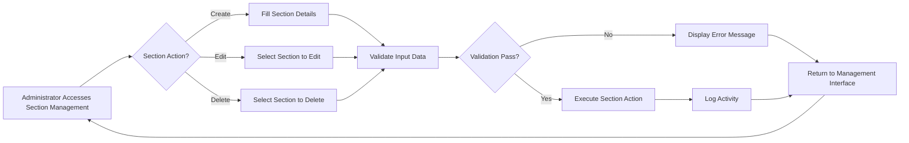
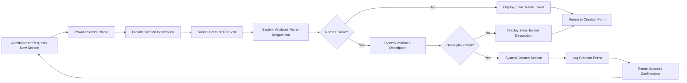
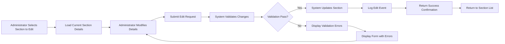
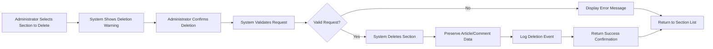

# Section Management Requirements

## Business Requirements Overview

### Why Section Management Exists
The discussion board requires a robust section management system to organize content by topics and categories. Sections serve as the primary organizational structure that enables users to navigate and focus on specific economic and political topics of interest. This system ensures content remains well-organized, discoverable, and relevant to user interests.

### Business Objectives
- Provide users with intuitive content categorization
- Enable administrators to maintain organized discussion areas
- Support flexible topic management without technical barriers
- Ensure consistent user experience across all discussion topics
- Allow for scalable addition of new discussion sections

### Success Metrics
- Number of active sections
- Section usage statistics (articles per section)
- Administrator activity in section management
- User satisfaction with content organization

## User Actors and Permissions

### Super Administrators
- CAN create, edit, and delete sections
- CAN view all sections and their content
- CAN assign section management responsibilities
- HIGHEST authority for all section-related actions

### Regular Administrators  
- CAN create, edit, and delete sections
- CAN view all sections and their content
- HAVE full section management capabilities
- DO NOT have super administrator privileges

### Members
- CANNOT create, edit, or delete sections
- CAN view sections and their articles
- CAN only interact with content within existing sections

### Guests
- CANNOT create, edit, or delete sections
- CAN view sections and their articles
- CAN browse content anonymously

## Section Fundamentals

### Section Definition
A section is a category or topic area within the discussion board where articles are organized and displayed. Each section has a unique name and descriptive text to help users understand its purpose.

### Section Attributes
- **Name**: A unique, human-readable title for the section
- **Description**: A detailed explanation of the section's purpose and scope
- **Status**: Active or inactive state for the section
- **Creation Timestamp**: When the section was created
- **Last Updated**: When the section was last modified

## Functional Requirements

### Section Creation Requirements

#### Creating a New Section
WHEN an administrator submits a request to create a new section, THE system SHALL validate the request and create the section if all requirements are met.

**Section Creation Input Requirements:**
- **Name**: Required field, must be unique, must not be empty
- **Description**: Required field, must not be empty

**Section Creation Validation Rules:**
- Section name must be unique across all sections
- Section name must not exceed 100 characters
- Section description must not exceed 1000 characters
- Section name must contain only valid characters (alphanumeric, spaces, and basic punctuation)
- Section must have at least one section creator with administrator privileges

**Section Creation Process:**
1. Administrator accesses the section creation interface
2. Administrator fills in the section name and description
3. System validates the input data
4. If validation passes, system creates the section
5. System returns success confirmation to the administrator
6. System logs the section creation event

**Section Creation Error Handling:**
- IF section name is empty, THEN THE system SHALL display "Section name is required"
- IF section name exceeds 100 characters, THEN THE system SHALL display "Section name must be 100 characters or less"
- IF section description exceeds 1000 characters, THEN THE system SHALL display "Description must be 1000 characters or less"
- IF section name already exists, THEN THE system SHALL display "A section with this name already exists"
- IF non-administrator attempts to create a section, THEN THE system SHALL deny access and display "Only administrators can create sections"
- IF validation fails for any other reason, THEN THE system SHALL display appropriate error message

### Section Editing Requirements

#### Editing Section Details
WHEN an administrator submits a request to edit an existing section, THE system SHALL validate the changes and update the section if all requirements are met.

**Section Edit Input Requirements:**
- **Name**: Optional field, if provided must be unique, must not be empty
- **Description**: Optional field, if provided must not be empty
- **Section ID**: Required field to identify which section to edit

**Section Edit Validation Rules:**
- If name is provided, it must be unique across all sections (excluding current section)
- Section name must not exceed 100 characters
- Section description must not exceed 1000 characters
- Section name must contain only valid characters (alphanumeric, spaces, and basic punctuation)

**Section Edit Process:**
1. Administrator accesses the section edit interface
2. Administrator selects the section to edit
3. Administrator modifies the section name and/or description
4. System validates the input data
5. If validation passes, system updates the section
6. System returns success confirmation to the administrator
7. System logs the section edit event

**Section Edit Error Handling:**
- IF section ID is invalid or nonexistent, THEN THE system SHALL display "Section not found"
- IF section name is empty when provided, THEN THE system SHALL display "Section name cannot be empty"
- IF section name exceeds 100 characters, THEN THE system SHALL display "Section name must be 100 characters or less"
- IF section description exceeds 1000 characters, THEN THE system SHALL display "Description must be 1000 characters or less"
- IF section name already exists (for another section), THEN THE system SHALL display "A section with this name already exists"
- IF non-administrator attempts to edit a section, THEN THE system SHALL deny access and display "Only administrators can edit sections"
- IF validation fails for any other reason, THEN THE system SHALL display appropriate error message

### Section Deletion Requirements

#### Deleting a Section
WHEN an administrator submits a request to delete a section, THE system SHALL validate the deletion and remove the section if all requirements are met.

**Section Deletion Process:**
1. Administrator accesses the section deletion interface
2. Administrator selects the section to delete
3. System displays warning about articles and comments in the section
4. Administrator confirms deletion
5. System validates the deletion request
6. If validation passes, system deletes the section
7. System returns success confirmation to the administrator
8. System logs the section deletion event

**Section Deletion Behavior:**
- Section deletion does NOT automatically delete articles and comments in that section
- Articles and comments in deleted sections remain visible and accessible
- Deleted section name is preserved in article metadata for historical reference
- Users can still view articles from deleted sections through search and history

**Section Deletion Error Handling:**
- IF section ID is invalid or nonexistent, THEN THE system SHALL display "Section not found"
- IF non-administrator attempts to delete a section, THEN THE system SHALL deny access and display "Only administrators can delete sections"
- IF system fails to delete section for any technical reason, THEN THE system SHALL display "Failed to delete section. Please try again."

### Section Display Requirements

#### Viewing All Sections
WHEN a user accesses the section listing page, THE system SHALL display all active sections with their basic information.

**Section Listing Content:**
- Section name
- Section description
- Number of articles in the section
- Number of comments in the section
- Last activity timestamp
- Status indicator (active/inactive)

**Section Listing Sorting:**
- Default sort: newest sections first
- Optional sort: alphabetically by section name

**Section Listing Pagination:**
- Items per page: 20 sections
- Navigation: Previous/Next buttons
- Page indicator showing current position

**Section Listing Error Handling:**
- IF no sections exist, THEN THE system SHALL display "No sections available"
- IF system fails to load sections, THEN THE system SHALL display "Failed to load sections. Please try again."

#### Viewing Section Details
WHEN a user accesses a specific section page, THE system SHALL display detailed information about that section.

**Section Details Content:**
- Section name
- Section description
- Complete list of articles in the section
- Number of articles and comments
- Creation and update timestamps
- Administrator information

**Section Details Article Display:**
- Article title
- Article author
- Article tags
- Number of comments
- Article creation timestamp
- Pagination controls

**Section Details Error Handling:**
- IF section ID is invalid or nonexistent, THEN THE system SHALL display "Section not found"
- IF section is inactive, THEN THE system SHALL display appropriate message about inactive status
- IF system fails to load section details, THEN THE system SHALL display "Failed to load section details. Please try again."

### Section Access Requirements

#### Access Control for Section Operations
IF a user attempts to create, edit, or delete a section, THEN THE system SHALL verify the user has administrator privileges.

**Administrator Verification Process:**
1. User attempts section management action
2. System checks user authentication status
3. System verifies user has admin or super admin role
4. IF authentication fails, THEN THE system SHALL redirect to login
5. IF authorization fails, THEN THE system SHALL deny access with appropriate message

**Guest and Member Access:**
- Guests and members CAN view all sections
- Guests and members CANNOT create sections
- Guests and members CANNOT edit sections
- Guests and members CANNOT delete sections
- Guests and members CAN browse articles within sections

## Business Workflows

### Section Management Workflow

### Section Creation Workflow

### Section Editing Workflow

### Section Deletion Workflow

## Business Rules

### Section Naming Rules
- Section names must be unique across the entire discussion board
- Section names must be between 1 and 100 characters
- Section names must contain only alphanumeric characters, spaces, and basic punctuation
- Section names should clearly describe the section's topic or purpose
- Section names should avoid generic terms that could cause confusion

### Section Description Rules
- Section descriptions must be between 1 and 1000 characters
- Section descriptions should clearly explain the section's purpose
- Section descriptions should guide users on what content belongs in the section
- Section descriptions should avoid technical jargon and be user-friendly

### Section Status Rules
- Sections can be active (visible to users) or inactive (hidden from users)
- Inactive sections do not appear in section listings
- Articles in inactive sections remain accessible through direct links and search
- Super administrators can set section status
- Regular administrators can set section status for sections they manage

### Section Relationship Rules
- Articles must belong to exactly one section
- Comments are associated with articles, not directly with sections
- Sections can contain any number of articles
- Articles can be moved between sections by administrators
- When articles are moved, their associated data (tags, comments) moves with them

## Error Handling Requirements

### Common Error Scenarios

#### Invalid Section Data
IF section data contains invalid characters, THEN THE system SHALL reject the data and display appropriate error messages.

**Invalid Data Examples:**
- Section name contains prohibited characters
- Section description exceeds character limits
- Section name is empty when required
- Section data format is malformed

#### Unauthorized Access Attempts
IF a non-administrator attempts section management actions, THEN THE system SHALL deny access and log the attempt.

**Unauthorized Actions:**
- Creating sections without admin privileges
- Editing sections without admin privileges
- Deleting sections without admin privileges
- Accessing section management interface without authorization

#### System Failure Handling
IF section management operations fail due to system issues, THEN THE system SHALL provide clear error messages and recovery options.

**Failure Scenarios:**
- Database connection issues
- Timeout during section operations
- Concurrent modification conflicts
- Permission validation failures

## Performance Requirements

### Response Time Expectations
- Section creation: Complete within 2 seconds under normal load
- Section editing: Complete within 2 seconds under normal load
- Section deletion: Complete within 3 seconds under normal load
- Section listing: Display initial results within 1 second
- Section details: Display page within 2 seconds

### Scalability Requirements
- System must support up to 1000 active sections
- Section listing must remain performant with 1000+ sections
- Section management interface must handle concurrent administrators
- Database queries for section operations must be optimized

## Security Requirements

### Authentication Requirements
- All section management operations require user authentication
- Administrators must be logged in before accessing section management
- Session tokens must be validated for all section operations

### Authorization Requirements
- Only users with admin or super admin roles can create, edit, or delete sections
- Regular administrators can manage all section operations
- Super administrators have unlimited section management capabilities
- Section management operations must be logged for audit purposes

### Data Protection Requirements
- Section names and descriptions must be sanitized to prevent XSS attacks
- Section metadata must be protected from unauthorized modification
- Section deletion must preserve referential integrity with articles and comments
- Audit logs for section operations must be securely stored

## Compliance Requirements

### Audit Trail Requirements
- All section creation events must be logged with timestamp and user information
- All section edit events must be logged with timestamp, user information, and changes made
- All section deletion events must be logged with timestamp and user information
- Section management interface access must be logged for security purposes

### Data Retention Requirements
- Section names and descriptions must be retained for historical reference
- Deleted sections must have their metadata preserved for audit purposes
- Article metadata must preserve section references even after section deletion
- Audit logs must be retained for minimum 1 year

## Future Enhancement Considerations

### Planned Features
- Section hierarchies (parent-child relationships)
- Section permissions (different access levels per section)
- Section analytics and statistics
- Automated section assignment based on content
- Section migration tools for content reorganization
- Section templates for consistent section creation
- Section moderation tools for managing section content
- Section approval workflows for new section requests

### Possible Enhancements
- User-submitted section creation requests
- Community voting on section proposals
- Automated section recommendations based on user interests
- Multi-language support for section names and descriptions
- Section migration history and versioning
- Section comparison tools for content analysis
- Section collaboration features for administrative teams
