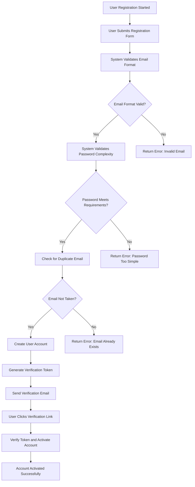
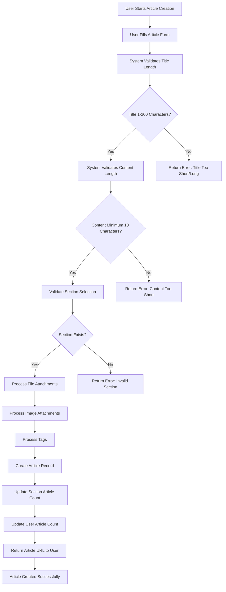
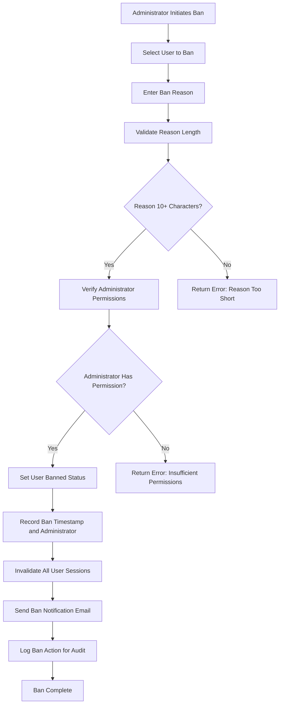

# Economic/Political Discussion Board - Requirements Specification

## Overview

This document provides comprehensive requirements specification for the Economic/Political Discussion Board system. The platform enables users to engage in discussions about economic and political topics through articles, comments, and interactive features.

The system supports multiple user roles including regular members, administrators, and super administrators, with comprehensive security, content management, and moderation capabilities.

### Key Features

- **User Management**: Email-based authentication with password security and account management
- **Content Creation**: Articles with file attachments, images, and tagging capabilities
- **Discussion Forum**: Single-level comment system with pagination and sorting
- **Organization**: Section-based content organization with administrative control
- **Search & Filtering**: Advanced search functionality with tag-based filtering
- **Administrative Tools**: Comprehensive moderation capabilities including banning and user management
- **Security**: Multi-layered security implementation with audit logging and compliance

### Success Metrics

- **Content Volume**: 10,000+ active articles and 50,000+ comments monthly
- **User Engagement**: 30% active user rate with average 3 sessions per user weekly
- **System Performance**: <2 second response time for article listing and <500ms for individual articles
- **Moderation Efficiency**: <1 hour response time for administrator actions
- **System Availability**: 99.9% uptime with comprehensive backup and recovery

## Functional Requirements

### User Account Management

#### Authentication Workflow

**WHEN a user creates an account, THE system SHALL require the following information:**
- **Email Address**: Valid email format required, unique across all accounts
- **Password**: Minimum 8 characters, including uppercase, lowercase, numeric, and special characters
- **Creation Timestamp**: System records exact date and time of account creation

**THE user creation process SHALL follow these steps:**
1. User submits registration form with email and password
2. System validates email format and password complexity
3. System checks for duplicate email address
4. System creates user account with email-verified status set to false
5. System sends verification email to the registered address
6. User clicks verification link in email
7. System updates email-verified status to true and enables account

**WHEN a user attempts to log in, THE system SHALL require:**
- Email address for identification
- Password for authentication
- Account must be active and not banned
- Password must be correctly validated against stored credentials

**WHILE a user is logged in, THE system SHALL:**
- Maintain a secure session token
- Store user preferences and profile information
- Provide access to user-specific features
- Track user activity for audit purposes
- Enable secure password changes and account management

**WHEN a user deletes their account, THE system SHALL:**
- Permanently remove the user record from the database
- Delete all articles created by the user
- Delete all comments created by the user
- Remove all profile information and preferences
- Maintain audit log entry for the deletion
- Invalidate all active sessions for the user

#### Password Management

**WHEN a user changes their password, THE system SHALL:**
- Require current password for verification
- Enforce new password complexity requirements
- Validate that new password differs from current password
- Update password hash in secure storage
- Invalidate all active sessions for security
- Send notification email to registered address

**IF password change fails due to incorrect current password, THE system SHALL:**
- Return clear error message indicating password mismatch
- Increment failed attempt counter
- Lock account after 5 consecutive failures for 15 minutes
- Log security incident for audit purposes

**WHEN password recovery is requested, THE system SHALL:**
- Send time-limited recovery link to registered email address
- Generate unique recovery token with 1-hour expiration
- Allow password reset within recovery window
- Invalidate recovery token after use or expiration
- Send confirmation email after successful password reset

#### Account Status Management

**WHEN a user account is created, THE system SHALL set initial status to:**
- Active: true
- Email Verified: false
- Banned: false
- Administrator: false
- Super Administrator: false

**WHEN email verification is completed, THE system SHALL:**
- Update email verified status to true
- Enable full account functionality
- Update last verification timestamp

**WHEN an administrator bans a user, THE system SHALL:**
- Set banned status to true
- Record ban reason and timestamp
- Record administrator who issued the ban
- Invalidate all active sessions
- Notify user of ban via email
- Maintain ban record for audit purposes

**WHEN an administrator unbans a user, THE system SHALL:**
- Set banned status to false
- Record unban reason and timestamp
- Record administrator who issued the unban
- Restore full account functionality
- Update ban history record

### User Profile Management

#### Profile Information Structure

**EACH user profile SHALL contain:**
- **Display Name**: User-chosen name for public identification (maximum 50 characters)
- **Bio**: Personal biography text (maximum 500 characters)
- **Registration Date**: Timestamp of account creation
- **Last Active**: Timestamp of most recent activity
- **Profile Views**: Count of profile views (updated on view)
- **Article Count**: Number of articles written by user
- **Comment Count**: Number of comments written by user

**WHEN a user updates their profile, THE system SHALL:**
- Allow display name modification (max 50 characters)
- Allow bio text modification (max 500 characters)
- Validate input length constraints
- Update last modified timestamp
- Maintain profile version history for audit
- Return updated profile information

#### Profile Display Requirements

**WHEN a user views their own profile, THE system SHALL display:**
- Complete profile information
- All authored articles
- All written comments
- Edit capability for profile fields
- Account settings and preferences

**WHEN a user views another user's profile, THE system SHALL display:**
- Display name and bio
- Registration date and last active timestamp
- Total article count
- Total comment count
- Profile view count
- Any connection status (if applicable)

#### Profile Content Display

**WHEN displaying a user's articles, THE system SHALL show:**
- Title of each article
- Section classification
- Publication timestamp
- Comment count
- Tags associated with article
- Article status (published/unpublished)

**WHEN displaying a user's comments, THE system SHALL show:**
- Article title for each comment
- Comment content (truncated for list view)
- Comment timestamp
- Comment status (active/deleted)
- Any administrative actions taken

### Section Management

#### Section Structure and Organization

**EACH section SHALL contain:**
- **Name**: Unique identifier for the section (maximum 100 characters)
- **Description**: Detailed section description (maximum 500 characters)
- **Created By**: Administrator who created the section
- **Created At**: Timestamp of section creation
- **Last Updated**: Timestamp of most recent modification
- **Article Count**: Number of articles in the section

**WHEN an administrator creates a section, THE system SHALL:**
- Validate section name uniqueness
- Enforce name length constraints (1-100 characters)
- Validate description content
- Record creation timestamp and administrator
- Initialize article count to zero
- Update section listing cache

**WHEN an administrator edits a section, THE system SHALL:**
- Allow name modification (must remain unique)
- Allow description modification
- Validate all input constraints
- Update last updated timestamp
- Update section listing cache
- Maintain edit history for audit

**WHEN an administrator deletes a section, THE system SHALL:**
- Verify section has no articles (or confirm forced deletion)
- Remove section record from database
- Update article section references (or delete articles)
- Update section listing cache
- Log deletion with administrator reference
- Maintain deletion audit trail

#### Section Display and Navigation

**WHEN users view the section listing, THE system SHALL:**
- Display all available sections
- Show section name and description
- Show article count per section
- Enable section selection for browsing
- Support alphabetical or custom ordering
- Provide search capability for sections

**WHEN users browse a specific section, THE system SHALL:**
- Display all articles in that section
- Show paginated results (default 20 articles per page)
- Enable sorting by newest first or oldest first
- Show article metadata (title, author, tags, comments, timestamp)
- Maintain section context in navigation

**WHEN a section is deleted or becomes unavailable, THE system SHALL:**
- Handle gracefully in article listings
- Maintain article integrity where possible
- Update article-to-section mappings
- Log section change events
- Notify affected users of changes

### Article Management

#### Article Creation Requirements

**WHEN a user creates an article, THE system SHALL require:**
- **Title**: Non-empty string (1-200 characters)
- **Content**: Non-empty text content (minimum 10 characters)
- **Section**: Valid section ID from available sections

**WHEN a user creates an article, THE system SHALL accept optional:**
- **Files**: Multiple file attachments (max 10 files, 50MB each)
- **Images**: Multiple image attachments (max 10 images, 20MB each)
- **Tags**: Multiple free-text tags (max 10 tags, 50 characters each)

**THE article creation process SHALL follow these steps:**
1. User submits article form with required fields
2. System validates title length and content requirements
3. System validates section ID references valid section
4. System processes file and image uploads
5. System processes tag input and normalizes tags
6. System creates article record with all metadata
7. System generates article URL and update section counts
8. System updates user article count and cache

**WHEN article creation succeeds, THE system SHALL:**
- Return article ID and URL for immediate access
- Update section article count
- Update author article count
- Cache article listing for performance
- Log article creation for audit purposes

#### Article Content and Metadata

**EACH article SHALL contain:**
- **ID**: Unique identifier for the article
- **Title**: Article title as provided by author
- **Content**: Full article content in markdown format
- **Section ID**: Reference to parent section
- **Author ID**: Reference to creating user
- **Creation Timestamp**: When article was first published
- **Last Modified Timestamp**: When article was last updated
- **View Count**: Number of times article has been viewed
- **Comment Count**: Number of comments on article

**WHEN files are attached to an article, THE system SHALL:**
- Store files with secure naming convention
- Record file metadata (name, size, type, upload timestamp)
- Associate files with article ID
- Enable file download functionality
- Maintain file integrity and access control

**WHEN images are attached to an article, THE system SHALL:**
- Store images in optimized format
- Generate image thumbnails for preview
- Record image metadata (name, size, dimensions, upload timestamp)
- Enable image display in article view
- Maintain image preview and download functionality

**WHEN tags are applied to an article, THE system SHALL:**
- Normalize tags to lowercase
- Remove duplicate tags
- Store tag associations with article
- Enable tag-based search and filtering
- Maintain tag cloud statistics

#### Article Editing Capabilities

**WHEN an article author edits their article, THE system SHALL allow:**
- Title modification (1-200 characters)
- Content modification (minimum 10 characters)
- File attachment updates (add/remove)
- Image attachment updates (add/remove)
- Tag modification (add/remove)
- Section change (if author permissions allow)

**WHEN article editing is performed, THE system SHALL:**
- Validate all input constraints
- Update last modified timestamp
- Process any file or image changes
- Update tag associations
- Update section counts if section changed
- Maintain edit history for audit
- Update cache with new content

**WHEN an administrator edits any article, THE system SHALL:**
- Have full editing capabilities regardless of authorship
- Log administrative action for audit purposes
- Override author-specific restrictions if needed
- Update administrative metadata
- Maintain comprehensive audit trail

#### Article Deletion Process

**WHEN an article author deletes their article, THE system SHALL:**
- Verify authorship ownership
- Permanently remove article record
- Delete all attached files and images
- Remove all associated comments
- Update section article count
- Update author article count
- Clear cache entries
- Log deletion for audit purposes

**WHEN an administrator deletes any article, THE system SHALL:**
- Have full deletion capability regardless of authorship
- Record administrator reference and timestamp
- Maintain comprehensive audit trail
- Notify affected users of deletion
- Update all related counts and caches

### Article List and Display

#### Article Listing Requirements

**WHEN users view article listing in a section, THE system SHALL:**
- Display articles in paginated format
- Show 20 articles per page by default
- Allow page size configuration (10, 20, 50, 100)
- Show pagination controls (previous/next, page numbers)
- Display article metadata in consistent format

**EACH article listing entry SHALL show:**
- **Title**: Article title (truncated if necessary)
- **Author**: Display name of article author
- **Tags**: Associated tags for the article
- **Comment Count**: Number of comments on article
- **Time Posted**: Publication timestamp (relative format)

**WHEN articles are sorted by newest first, THE system SHALL:**
- Order by creation timestamp descending
- Show most recent articles first
- Maintain consistent ordering across pages
- Handle timestamp ties with secondary sort by ID

**WHEN articles are sorted by oldest first, THE system SHALL:**
- Order by creation timestamp ascending
- Show oldest articles first
- Maintain consistent ordering across pages
- Handle timestamp ties with secondary sort by ID

#### Article List Performance

**THE article listing query SHALL:**
- Return results in <2 seconds for 100 articles
- Cache frequently accessed section listings
- Use efficient database queries with proper indexing
- Handle high-concurrency access patterns
- Scale to support 1000+ concurrent users

**WHEN article counts change, THE system SHALL:**
- Update cache entries immediately
- Recalculate pagination information
- Maintain consistency across all listing views
- Handle edge cases (empty pages, last page transitions)

### Article Viewing and Content Display

#### Article Page Requirements

**WHEN a user views an article, THE system SHALL display:**
- **Title**: Full article title
- **Author**: Author display name with link to profile
- **Content**: Complete article content with formatting
- **Tags**: All associated tags
- **Section**: Section name with link to section
- **Timestamps**: Creation and last modified times
- **Metadata**: View count and comment count
- **File Attachments**: Download links for all files
- **Image Attachments**: Inline display with download options

**WHEN article content includes images, THE system SHALL:**
- Display images inline at appropriate size
- Enable image click for full-size view
- Provide download option for each image
- Handle missing or broken images gracefully
- Cache images for performance

**WHEN article content includes files, THE system SHALL:**
- Display file links with download capability
- Show file metadata (name, size, type)
- Enable direct file download
- Maintain file access control
- Log file download events for audit

#### Article Engagement Metrics

**WHEN an article is viewed, THE system SHALL:**
- Increment view count
- Log view event with timestamp
- Update cache with new view count
- Track unique vs total views
- Maintain view history for analytics

**WHEN a user views their own article, THE system SHALL:**
- Show edit and delete options
- Display administrative tools
- Show analytics for the article
- Provide content statistics

### Comment System

#### Comment Creation Process

**WHEN a user writes a comment on an article, THE system SHALL require:**
- Valid article ID for comment attachment
- Comment content text (minimum 1 character, maximum 5000 characters)
- Active user session with proper authentication
- Article must be published and not deleted

**WHEN comment creation is processed, THE system SHALL:**
- Validate comment content constraints
- Record author reference and timestamp
- Link comment to specific article
- Increment article comment count
- Update cache with new comment
- Log comment creation for audit

**WHEN comment creation succeeds, THE system SHALL:**
- Return comment ID for reference
- Include comment content in display
- Update article comment count
- Notify article author (if configured)
- Maintain comment hierarchy

#### Comment Display Requirements

**WHEN users view comments on an article, THE system SHALL:**
- Display all comments for the article
- Order comments by oldest first (creation timestamp ascending)
- Show comment author display name
- Show comment content
- Show comment timestamp
- Show comment status (active/deleted)

**EACH comment display entry SHALL include:**
- **Author**: Display name with user profile link
- **Content**: Comment text content
- **Timestamp**: Creation time in relative format
- **Action Links**: Edit and delete for author
- **Admin Tools**: Delete and moderation options for administrators
- **Status Indicator**: Visual indicator for comment status

**WHEN comment content is too long, THE system SHALL:**
- Truncate display to reasonable length (200 characters)
- Provide expand option for full content
- Show truncation indicator
- Maintain original content in database

#### Comment Editing and Deletion

**WHEN a comment author edits their comment, THE system SHALL:**
- Verify authorship ownership
- Validate content length constraints
- Update last modified timestamp
- Maintain edit history
- Update cache with new content
- Log edit action for audit

**WHEN a comment author deletes their comment, THE system SHALL:**
- Verify authorship ownership
- Permanently remove comment record
- Decrement article comment count
- Update cache with reduced count
- Log deletion for audit purposes

**WHEN an administrator deletes any comment, THE system SHALL:**
- Have full deletion capability regardless of authorship
- Record administrator reference and timestamp
- Maintain comprehensive audit trail
- Update article comment count
- Update cache and listings

#### Comment System Performance

**THE comment display query SHALL:**
- Return results in <1 second for 100 comments
- Cache frequently accessed comment threads
- Use efficient database queries with proper indexing
- Handle high-concurrency access patterns
- Scale to support 1000+ concurrent users

### Search and Filtering

#### Search Functionality

**WHEN users search articles, THE system SHALL support:**
- **Title Search**: Search article titles for matching text
- **Content Search**: Search article content for matching text
- **Combined Search**: Search both title and content fields

**WHEN search query is processed, THE system SHALL:**
- Match exact phrases and partial words
- Handle case-insensitive searching
- Support special characters and unicode
- Return relevant results in order of relevance
- Handle empty or invalid queries gracefully

**WHEN search results are displayed, THE system SHALL:**
- Show paginated results (20 per page default)
- Display article title, author, section, timestamp
- Show matching highlight in results
- Provide search query context
- Enable refinement of search criteria

#### Tag Filtering Capabilities

**WHEN users filter articles by tags, THE system SHALL:**
- Match articles with specified tags
- Support multiple tag filtering (AND/OR logic)
- Handle tag normalization and case insensitivity
- Update result count in real-time
- Provide tag suggestions during input

**WHEN tag search is performed, THE system SHALL:**
- Normalize user input tags to lowercase
- Match against existing tag vocabulary
- Suggest similar tags when match is weak
- Maintain tag frequency statistics
- Support auto-completion of tag input

#### Combined Search and Filter

**WHEN users combine search and tag filtering, THE system SHALL:**
- Apply search criteria first (title/content matching)
- Apply tag filters to search results
- Support multiple tag conditions
- Return intersection of search and filter results
- Maintain performance with combined queries

**WHEN no results are found, THE system SHALL:**
- Display user-friendly message
- Suggest alternative search terms
- Provide relevant section browsing options
- Show popular articles and tags
- Enable broadening of search criteria

### Administrator System

#### Administrator Request Process

**WHEN a user submits an administrator request, THE system SHALL:**
- Require user authentication and active status
- Collect request reason text (minimum 50 characters)
- Validate request content requirements
- Create pending request record
- Notify super administrators of new request
- Log request for audit purposes

**WHEN a super administrator reviews requests, THE system SHALL:**
- Display all pending administrator requests
- Show user information and request reason
- Enable approval or rejection decisions
- Record decision timestamp and administrator
- Update user role based on decision
- Notify requesting user of outcome

**WHEN an administrator request is approved, THE system SHALL:**
- Update user role to administrator
- Grant appropriate permissions
- Update administrator count statistics
- Notify requesting user of approval
- Log administrator promotion for audit

**WHEN an administrator request is rejected, THE system SHALL:**
- Maintain user role as regular member
- Notify requesting user of rejection reason
- Maintain request record for future reference
- Log rejection for audit purposes

#### Administrator Roles and Permissions

**EACH administrator SHALL have:**
- Regular administrator or super administrator grade
- Appropriate permission level for their role
- Administrative audit trail
- Administrator-specific capabilities

**WHEN administrator permissions are checked, THE system SHALL:**
- Verify administrator status and grade
- Match permissions against required capabilities
- Grant or deny access based on permission matrix
- Log permission check for audit purposes

#### Super Administrator Capabilities

**SUPER administrators SHALL have additional capabilities:**
- Promote regular administrators to super administrator
- Demote super administrators to regular administrator (except themselves)
- View all administrator activity logs
- Override all administrative restrictions
- Manage system configuration settings

**WHEN super administrator demotion is attempted, THE system SHALL:**
- Verify demoter is super administrator
- Prevent self-demotion (super admin cannot demote themselves)
- Log demotion action with full audit trail
- Update target user role and permissions
- Notify affected users of role changes

#### Administrator Activity Logging

**THE system SHALL log all administrator activities:**
- Section creation, modification, deletion
- Article deletion and modification
- Comment deletion and modification
- User banning and unbanning
- Administrator role changes
- Permission modifications
- System configuration changes

**WHEN administrator activity is logged, THE system SHALL record:**
- Administrator ID and username
- Timestamp of action
- Action type and description
- Affected resources
- Reason or context of action
- Success/failure status

### Banning System

#### Ban Creation Process

**WHEN an administrator bans a user, THE system SHALL:**
- Require valid user ID for ban
- Require ban reason text (minimum 10 characters)
- Validate administrator permissions
- Set user banned status to true
- Record ban reason and timestamp
- Record administrator who issued ban
- Invalidate all active user sessions
- Notify user of ban via email
- Log ban action for audit purposes

**WHEN ban creation is processed, THE system SHALL:**
- Update user account status
- Remove user from all online user lists
- Invalidate active sessions immediately
- Update cache with banned status
- Update user activity display

#### Banned User Restrictions

**WHEN a banned user attempts to log in, THE system SHALL:**
- Reject login attempt immediately
- Return clear error message about ban status
- Record failed login attempt for security
- Maintain ban information for future reference
- Notify administrator of login attempt

**WHILE a user is banned, THE system SHALL:**
- Prevent login and authentication
- Maintain existing articles and comments visibility
- Preserve user data and content
- Maintain ban record and audit trail
- Allow unban process when appropriate

**WHEN banned user content is displayed, THE system SHALL:**
- Show article and comment content if not deleted
- Mark content with banned user indicator
- Maintain content integrity and availability
- Preserve comment and article counts

#### Ban Management and Transparency

**WHEN administrators view banned users, THE system SHALL:**
- Display all banned users with search capability
- Show ban reason for each user
- Show ban timestamp and administrator
- Enable unban functionality
- Allow ban reason editing
- Maintain ban history for audit

**WHEN a ban reason is requested, THE system SHALL:**
- Display ban reason to authorized administrators
- Maintain ban reason in audit log
- Allow reason updates with proper authorization
- Preserve original ban information

**WHEN a user is unbanned, THE system SHALL:**
- Set banned status to false
- Record unban reason and timestamp
- Record administrator who issued unban
- Restore full account functionality
- Update ban history record
- Notify user of unban status

### Non-Functional Requirements

#### Performance Requirements

**THE system SHALL meet the following performance benchmarks:**
- Article listing load time: <2 seconds for 1000 articles
- Individual article load time: <500ms
- Comment listing load time: <1 second for 100 comments
- Search response time: <1 second for 10000 articles
- Administrator action response time: <3 seconds
- User authentication time: <500ms
- Page load time: <3 seconds for all pages

**WHEN system load increases, THE system SHALL:**
- Scale horizontally to handle additional users
- Maintain consistent response times
- Prioritize critical user actions
- Gracefully degrade non-critical features
- Monitor and report performance metrics

#### Security Requirements

**THE system SHALL implement:**
- Password complexity requirements (minimum 8 characters, mixed case, numbers, special characters)
- Session token encryption and rotation
- SQL injection prevention through parameterized queries
- XSS attack prevention through content sanitization
- CSRF protection for all state-changing operations
- Rate limiting for API endpoints
- Input validation for all user-submitted data
- Secure file upload handling
- Audit logging for all security-relevant events

**WHEN security events occur, THE system SHALL:**
- Log security events with full context
- Alert administrators of suspicious activity
- Block malicious requests automatically
- Maintain forensic data for investigation
- Follow incident response procedures

#### Availability Requirements

**THE system SHALL provide:**
- 99.9% uptime for core functionality
- Backup and recovery capabilities
- Disaster recovery procedures
- Monitoring and alerting systems
- Health check endpoints for load balancers
- Graceful degradation of non-critical features

**WHEN system maintenance is required, THE system SHALL:**
- Schedule maintenance during low-traffic periods
- Notify users of maintenance windows
- Provide status updates during maintenance
- Restore service with minimal disruption
- Verify system integrity after maintenance

#### Scalability Requirements

**THE system SHALL support:**
- 100,000+ concurrent users
- 1,000,000+ articles
- 5,000,000+ comments
- 1000+ section entries
- 100+ administrator accounts
- High-concurrency access patterns

**WHEN system growth occurs, THE system SHALL:**
- Scale database connections horizontally
- Implement caching strategies
- Optimize query performance
- Distribute load across multiple servers
- Maintain data integrity during scaling

#### Usability Requirements

**THE system SHALL provide:**
- Intuitive user interface
- Consistent navigation patterns
- Clear error messages
- Responsive design for mobile devices
- Accessibility features for users with disabilities
- Multilingual support for core interface elements

**WHEN users encounter errors, THE system SHALL:**
- Display user-friendly error messages
- Provide guidance for resolution
- Log errors for debugging
- Maintain user session where possible
- Offer recovery options for failed operations

### Business Requirements

#### Platform Business Model

**THE discussion board platform follows a community-driven model where:**
- Users create and share content freely within community guidelines
- Administrators maintain platform quality and safety
- The community self-regulates through moderation and reporting
- Content ownership remains with original authors
- Platform provides infrastructure and moderation tools

**WHEN users contribute content, THE system SHALL:**
- Maintain clear attribution to original authors
- Preserve content integrity and context
- Enable content discovery through tagging and categorization
- Support content reuse within community guidelines
- Protect author rights while enabling community engagement

#### Community Governance

**THE platform follows community governance principles where:**
- Administrators enforce community standards
- Users can report inappropriate content
- Appeal processes exist for moderation decisions
- Transparent communication of rules and guidelines
- Regular review of moderation practices

**WHEN content violations occur, THE system SHALL:**
- Enable reporting by any user
- Provide administrative review of reported content
- Allow user appeals of moderation decisions
- Maintain transparency of moderation actions
- Update guidelines based on community feedback

#### Data Ownership and Rights

**WHEN users create content, THE system SHALL:**
- Maintain clear attribution to original creators
- Provide options for content licensing
- Enable content removal upon account deletion
- Preserve content history for audit purposes
- Support content portability when requested

**WHEN users delete their accounts, THE system SHALL:**
- Remove all personally identifiable information
- Maintain anonymous content where appropriate
- Preserve audit trail for compliance
- Update content attribution records
- Complete data removal within 30 days

### Technical Architecture Requirements

#### System Integration Requirements

**THE system SHALL integrate with:**
- Email service for notifications and account verification
- File storage service for attachments and images
- Search engine for article and content search
- Analytics platform for usage tracking
- Monitoring and alerting systems
- Backup and disaster recovery services

**WHEN integrations fail, THE system SHALL:**
- Maintain operational status for core functionality
- Queue failed operations for retry
- Log integration failures for debugging
- Provide fallback mechanisms where possible
- Notify administrators of critical failures

#### Development and Deployment Requirements

**THE system SHALL support:**
- Continuous integration and deployment
- Automated testing pipelines
- Configuration management
- Environment-specific settings
- Version control integration
- Rollback capabilities for deployments

**WHEN deployments occur, THE system SHALL:**
- Validate deployment integrity
- Update documentation and release notes
- Test new functionality in staging environment
- Minimize service disruption during deployment
- Verify post-deployment system health

## User Actors

### Guest Users

**Guest users are unauthenticated visitors to the platform who can:**
- Browse all public content including articles and comments
- Search articles by title, content, and tags
- View section listings and article previews
- Access public user profiles
- Read discussion content without registration

**Guest users cannot:**
- Create accounts or register
- Write articles or comments
- Edit or delete any content
- View or manage user profiles beyond public information
- Access administrative features
- Upload files or images
- View private or sensitive information

**Guest user requirements:**
- All content must be accessible without authentication
- Search functionality must work without login
- Section browsing must be available to all users
- Public profile viewing must work for all users
- Performance optimization for guest browsing

### Member Users

**Member users are authenticated platform participants who can:**
- Perform all guest user capabilities
- Create articles in any section
- Attach files and images to articles
- Apply tags to articles
- Edit and delete their own articles
- Write comments on articles
- Edit and delete their own comments
- Update their profile information
- View their own user profile
- Search and filter articles
- Access their account security settings

**Member users cannot:**
- Create or manage sections
- Delete or edit other users' content
- Ban or manage other users
- Access administrative features
- Promote other users to administrator
- View non-public system information

**Member user requirements:**
- Authentication system must be secure and reliable
- Article and comment creation must be intuitive
- Profile management must be accessible
- Content editing must maintain version history
- Search and filtering must be fast and accurate

### Administrator Users

**Administrator users are platform moderators who can:**
- Perform all member user capabilities
- Create, edit, and delete sections
- Delete any articles regardless of authorship
- Delete any comments regardless of authorship
- Ban and unban users with recorded reasons
- View banned user list and ban reasons
- Promote users to administrator status
- View system statistics and analytics
- Access administrative dashboard

**Administrator users cannot:**
- Promote other administrators to super administrator
- Demote super administrators (except themselves)
- Access super administrator-only features
- View system configuration settings
- Manage other super administrators

**Administrator user requirements:**
- Administrative interface must be efficient and comprehensive
- Moderation tools must be fast and reliable
- Audit logging must be thorough and tamper-proof
- User management must be straightforward
- Permission verification must be instant

### Super Administrator Users

**Super administrator users are platform owners who can:**
- Perform all administrator user capabilities
- Promote administrators to super administrator
- Demote other super administrators (except themselves)
- Access all system configuration settings
- Manage all administrator accounts
- View comprehensive system analytics
- Configure platform-wide settings
- Access all administrative functions
- Override any administrative restrictions

**Super administrator user requirements:**
- Super administrator tools must be comprehensive and powerful
- Configuration options must be extensive and flexible
- User management must have highest priority
- System monitoring must be thorough
- Permission management must be comprehensive

## Authentication and Authorization

### Authentication System

**WHEN a user creates an account, THE system SHALL:**
- Validate email format and uniqueness
- Enforce password complexity requirements
- Store password using secure hashing algorithm
- Generate email verification token
- Send verification email with secure token
- Create user record with active status

**WHEN a user attempts to log in, THE system SHALL:**
- Verify email and password credentials
- Check account active and email verified status
- Check user not banned status
- Generate secure session token
- Record login event in audit log
- Update last login timestamp

**WHEN a user changes their password, THE system SHALL:**
- Verify current password
- Enforce new password complexity
- Update password hash in secure storage
- Invalidate all other active sessions
- Send confirmation email
- Log password change event

**WHEN a user logs out, THE system SHALL:**
- Invalidate session token immediately
- Remove session from active session store
- Update last logout timestamp
- Clear authentication cookies
- Log logout event for audit

### Authorization System

**WHEN a user attempts to access protected resources, THE system SHALL:**
- Verify valid authentication session
- Check user role and permissions
- Compare against required permissions
- Grant or deny access accordingly
- Log authorization decision
- Return appropriate error messages

**For article management resources:**
- **Guest users**: SHALL only view articles and search content
- **Member users**: SHALL create, view, edit, delete their own articles
- **Admin users**: SHALL create, view, edit, delete any articles
- **Super admin users**: SHALL create, view, edit, delete any articles

**For comment management resources:**
- **Guest users**: SHALL only view comments
- **Member users**: SHALL create, view, edit, delete their own comments
- **Admin users**: SHALL create, view, edit, delete any comments
- **Super admin users**: SHALL create, view, edit, delete any comments

**For user management resources:**
- **Guest users**: SHALL NOT access any user management resources
- **Member users**: SHALL only access their own user profile
- **Admin users**: SHALL view and manage all users (ban, unban, permissions)
- **Super admin users**: SHALL view and manage all users including admin promotion/demotion

**For section management resources:**
- **Guest users**: SHALL only view section listings
- **Member users**: SHALL NOT access section management resources
- **Admin users**: SHALL create, view, edit, delete sections
- **Super admin users**: SHALL create, view, edit, delete sections

**For administrative operations resources:**
- **Guest users**: SHALL NOT access any administrative operations
- **Member users**: SHALL NOT access any administrative operations
- **Admin users**: SHALL access administrative operations as defined by permissions
- **Super admin users**: SHALL access all administrative operations including admin management

### Session Management

**WHEN a user successfully authenticates, THE system SHALL:**
- Generate secure session token with 30-minute expiration
- Store session in secure session store
- Associate session with user account and role
- Implement session rotation for security
- Maintain active session registry

**WHILE a user has an active session, THE system SHALL:**
- Validate session token on each request
- Refresh session token periodically
- Track session activity timestamp
- Support concurrent sessions per user
- Handle session expiration gracefully

**WHEN a user changes their password, THE system SHALL:**
- Invalidate all other active sessions
- Require re-authentication for other sessions
- Update session security timestamp
- Log security event for audit
- Update session management system

**WHEN session tokens are detected as compromised, THE system SHALL:**
- Invalidate compromised sessions immediately
- Alert security administrators
- Require user to re-authenticate
- Implement additional security measures
- Maintain forensic data for investigation

## Security and Compliance

### Data Protection Requirements

**WHEN sensitive data is transmitted, THE system SHALL:**
- Use TLS 1.3 encryption for all communications
- Encrypt session tokens and authentication credentials
- Validate SSL certificates for external integrations
- Implement certificate pinning for critical services
- Log encryption status for audit purposes

**WHEN sensitive data is stored, THE system SHALL:**
- Encrypt passwords using bcrypt with cost factor 12
- Encrypt personal information in database
- Implement column-level encryption for sensitive fields
- Manage encryption keys securely with rotation
- Audit encryption access and modifications

**WHEN data is backed up, THE system SHALL:**
- Encrypt backup data at rest
- Store backups in secure, geographically distributed locations
- Implement automated backup scheduling
- Test backup restoration procedures regularly
- Maintain backup retention policy compliance

### Audit Logging Requirements

**WHEN security-relevant events occur, THE system SHALL log:**
- Timestamp of event
- User identifier (or "anonymous" for unauthenticated events)
- IP address of requesting client
- Event type and description
- Success/failure status
- Relevant metadata and context

**Specific events to log:**
- Authentication events (login, logout, password change)
- Authorization events (permission denied, privilege escalation)
- Content modification events (article, comment creation, editing, deletion)
- Administrative actions (section management, user banning)
- System configuration changes
- Data export and bulk operations

**WHEN audit logs are accessed, THE system SHALL:**
- Enforce administrative access controls
- Log all audit log access attempts
- Maintain log integrity with write-once storage
- Implement log retention policies
- Support forensic analysis requirements

### Compliance Requirements

**THE system SHALL comply with:**
- General Data Protection Regulation (GDPR) for EU users
- California Consumer Privacy Act (CCPA) for California residents
- Industry-standard security and privacy practices
- Legal requirements for data preservation and production

**WHEN user data requests are received, THE system SHALL:**
- Provide data export in structured format within 30 days
- Allow data correction within 24 hours
- Implement data deletion within 7 days
- Notify third parties of data updates where required
- Maintain compliance documentation

**WHEN legal requests are received, THE system SHALL:**
- Validate legal request authenticity
- Consult appropriate legal counsel
- Preserve relevant data for potential litigation
- Respond within required legal timeframe
- Maintain request documentation and chain of custody

## Performance Requirements

### Response Time Requirements

**WHEN users access the platform, THE system SHALL provide:**
- Article listing page: <2 seconds for 1000 articles
- Individual article page: <500ms with caching
- Comment listing: <1 second for 100 comments
- Search results: <1 second for 10000 articles
- Authentication requests: <500ms
- Administrative actions: <3 seconds
- File uploads: <10 seconds for 50MB files
- Image uploads: <5 seconds for 20MB images

**WHEN system load increases, THE system SHALL:**
- Maintain target response times through horizontal scaling
- Prioritize critical user-facing operations
- Implement graceful degradation for non-critical features
- Monitor and report performance metrics
- Alert administrators of performance degradation

### Concurrency Requirements

**THE system SHALL support:**
- 100,000+ concurrent users
- 1,000+ concurrent article views
- 500+ concurrent article creation attempts
- 2000+ concurrent search queries
- 500+ concurrent administrative actions
- 100+ concurrent file uploads

**WHEN concurrency peaks occur, THE system SHALL:**
- Scale database connections horizontally
- Implement connection pooling and caching
- Prioritize critical user operations
- Queue non-critical background tasks
- Maintain system stability under load

### Scalability Requirements

**THE system SHALL scale to support:**
- 1,000,000+ articles
- 5,000,000+ comments
- 100,000+ user accounts
- 1,000+ sections
- 100+ administrator accounts
- 10,000+ daily active users

**WHEN scaling is required, THE system SHALL:**
- Implement horizontal scaling for web servers
- Scale database connections and queries
- Distribute cache across multiple nodes
- Implement content delivery networks
- Optimize query performance and indexing

## Monitoring and Maintenance

### System Monitoring Requirements

**THE system SHALL monitor:**
- Server CPU and memory utilization
- Database connection pool status
- API response times and error rates
- User authentication success/failure rates
- Content creation and modification rates
- Administrative action frequency
- File storage utilization
- Network traffic patterns

**WHEN monitoring thresholds are exceeded, THE system SHALL:**
- Alert administrators via configured notification channels
- Log detailed diagnostic information
- Implement automatic remediation where possible
- Scale resources dynamically
- Maintain service continuity

### Maintenance Requirements

**REGULAR maintenance tasks SHALL include:**
- Database backup and verification
- Log rotation and archival
- Cache cleanup and optimization
- Security patch updates
- Performance tuning
- Audit log review
- Data retention policy enforcement

**WHEN maintenance is required, THE system SHALL:**
- Schedule maintenance during low-traffic periods
- Notify users of maintenance windows
- Provide status updates during maintenance
- Verify system integrity after maintenance
- Document maintenance activities and results

## Appendix A: Data Model Overview

### Core Entities

**Users:**
- User ID (primary key)
- Email address (unique)
- Password hash
- Display name
- Bio text
- Account status (active/inactive/banned)
- Email verified status
- Role (member/admin/super_admin)
- Creation timestamp
- Last login timestamp

**Articles:**
- Article ID (primary key)
- Title
- Content
- Author ID (foreign key)
- Section ID (foreign key)
- View count
- Comment count
- Creation timestamp
- Last modified timestamp

**Comments:**
- Comment ID (primary key)
- Article ID (foreign key)
- Author ID (foreign key)
- Content
- Creation timestamp
- Last modified timestamp

**Sections:**
- Section ID (primary key)
- Name (unique)
- Description
- Created by (foreign key)
- Created timestamp
- Last updated timestamp
- Article count

**Files:**
- File ID (primary key)
- Article ID (foreign key)
- File name
- File path
- File size
- File type
- Upload timestamp

**Tags:**
- Tag ID (primary key)
- Name
- Article ID (foreign key)

**Bans:**
- Ban ID (primary key)
- User ID (foreign key)
- Administrator ID (foreign key)
- Reason
- Timestamp

## Appendix B: Business Process Diagrams

### User Registration Process

### Article Creation Process

### User Banning Process

## Appendix C: Permission Matrix Summary

### Article Management Permissions

| Action | Guest | Member | Admin | Super Admin |
|--------|-------|--------|-------|-------------|
| View Articles | ✅ | ✅ | ✅ | ✅ |
| Create Articles | ❌ | ✅ | ✅ | ✅ |
| Edit Own Articles | ❌ | ✅ | ✅ | ✅ |
| Edit Any Articles | ❌ | ❌ | ✅ | ✅ |
| Delete Own Articles | ❌ | ✅ | ✅ | ✅ |
| Delete Any Articles | ❌ | ❌ | ✅ | ✅ |

### Comment Management Permissions

| Action | Guest | Member | Admin | Super Admin |
|--------|-------|--------|-------|-------------|
| View Comments | ✅ | ✅ | ✅ | ✅ |
| Write Comments | ❌ | ✅ | ✅ | ✅ |
| Edit Own Comments | ❌ | ✅ | ✅ | ✅ |
| Edit Any Comments | ❌ | ❌ | ✅ | ✅ |
| Delete Own Comments | ❌ | ✅ | ✅ | ✅ |
| Delete Any Comments | ❌ | ❌ | ✅ | ✅ |

### User Management Permissions

| Action | Guest | Member | Admin | Super Admin |
|--------|-------|--------|-------|-------------|
| View Own Profile | ❌ | ✅ | ✅ | ✅ |
| Edit Own Profile | ❌ | ✅ | ✅ | ✅ |
| View Any Profile | ❌ | ❌ | ✅ | ✅ |
| Manage User Status | ❌ | ❌ | ✅ | ✅ |
| Promote Admins | ❌ | ❌ | ❌ | ✅ |
| Demote Admins | ❌ | ❌ | ❌ | ✅ |

### Section Management Permissions

| Action | Guest | Member | Admin | Super Admin |
|--------|-------|--------|-------|-------------|
| View Sections | ✅ | ✅ | ✅ | ✅ |
| Create Sections | ❌ | ❌ | ✅ | ✅ |
| Edit Sections | ❌ | ❌ | ✅ | ✅ |
| Delete Sections | ❌ | ❌ | ✅ | ✅ |

### Administrative Permissions

| Action | Guest | Member | Admin | Super Admin |
|--------|-------|--------|-------|-------------|
| View Administrative Features | ❌ | ❌ | ✅ | ✅ |
| Access Admin Dashboard | ❌ | ❌ | ✅ | ✅ |
| System Configuration | ❌ | ❌ | ❌ | ✅ |
| Manage All Admins | ❌ | ❌ | ❌ | ✅ |

## Conclusion

This requirements specification provides comprehensive coverage of all functional, non-functional, and business requirements for the Economic/Political Discussion Board system. The system supports multiple user roles with appropriate permission levels, comprehensive content management capabilities, robust security features, and high-performance requirements.

All requirements are designed to support a scalable, secure, and user-friendly platform for economic and political discussions. The implementation should follow the detailed specifications provided in this document to ensure successful delivery of the complete system functionality.

The system will be developed using TypeScript, NestJS, and Prisma ORM following enterprise-grade best practices and industry standards for backend development. All requirements are structured to enable efficient development, thorough testing, and smooth deployment processes.