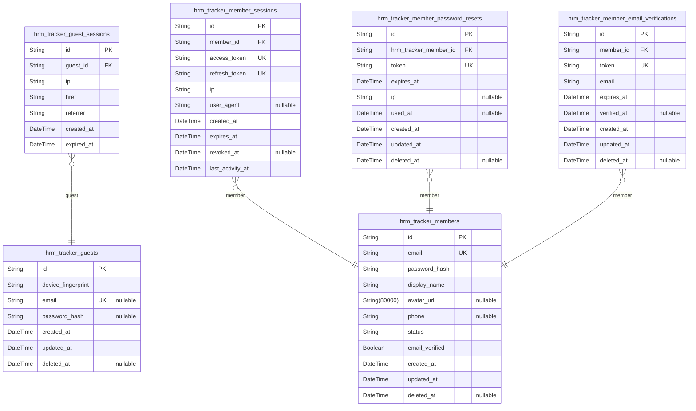
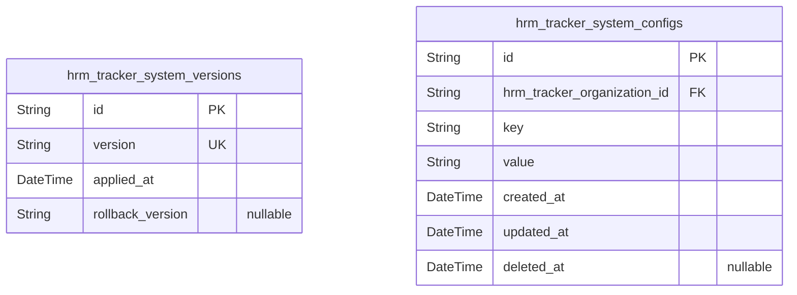
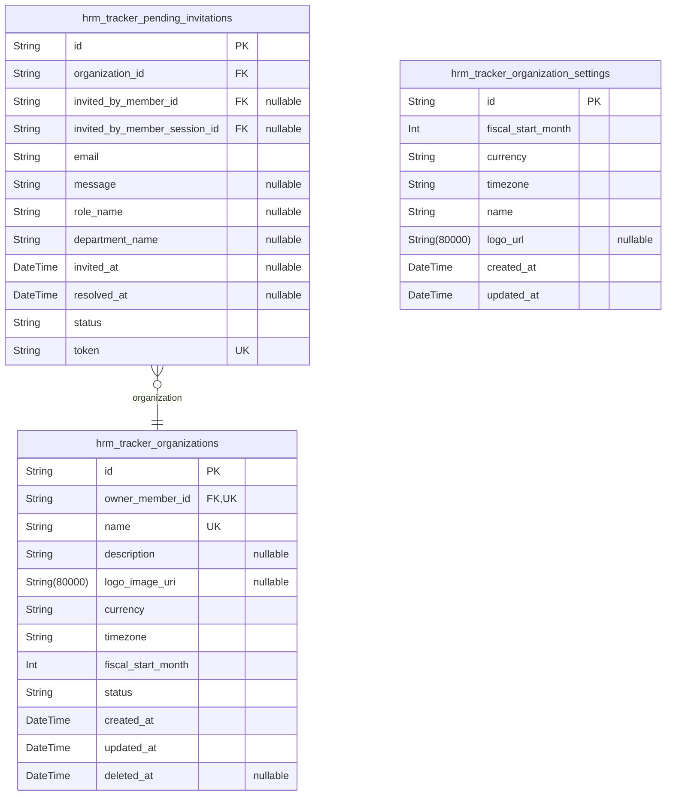
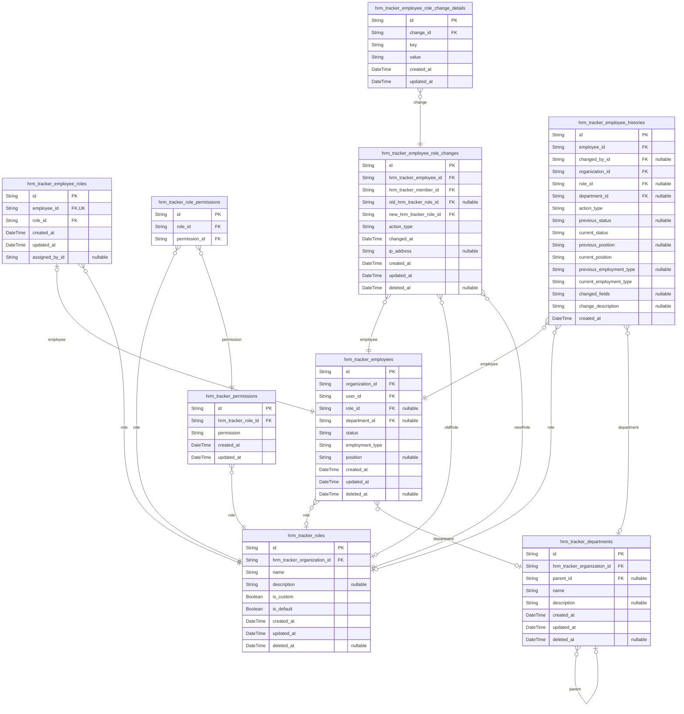
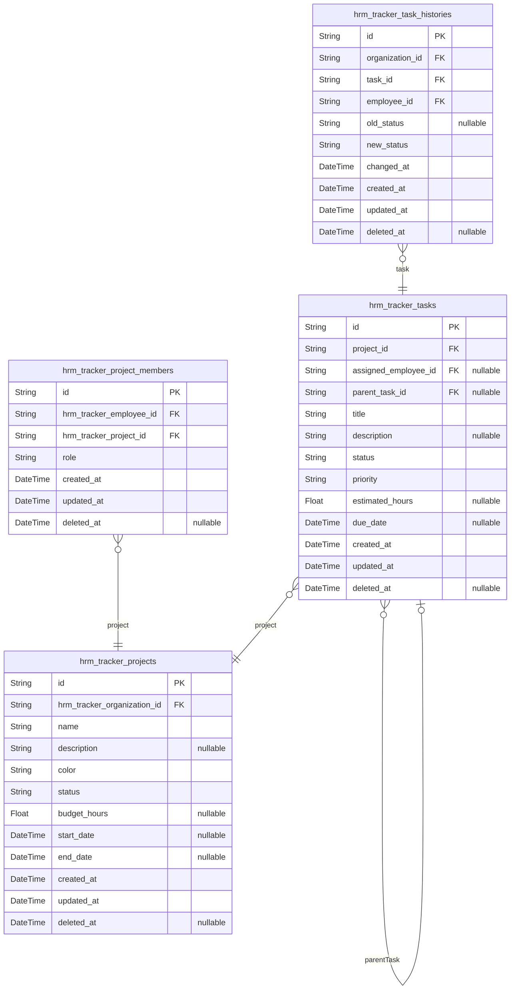
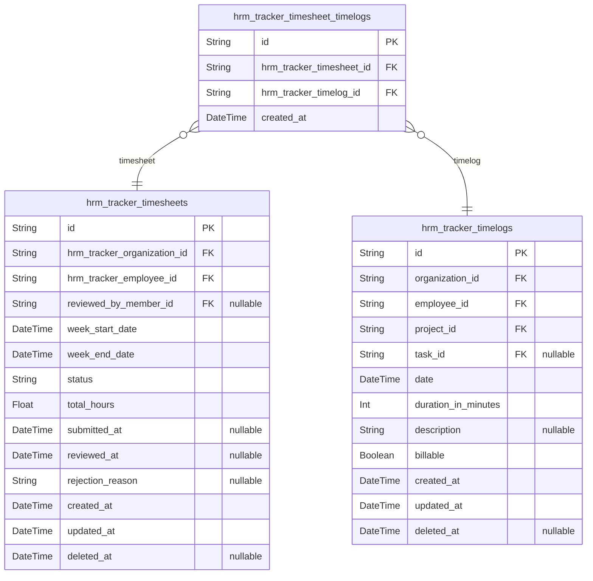
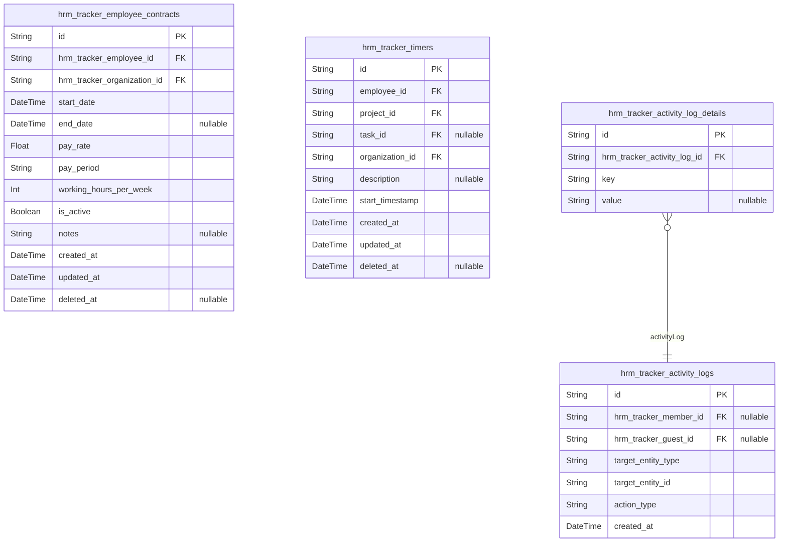

# Prisma Markdown

> Generated by [`prisma-markdown`](https://github.com/samchon/prisma-markdown)

- [Actors](#actors)
- [Systematic](#systematic)
- [Organization](#organization)
- [Employee](#employee)
- [Project](#project)
- [TimeTracking](#timetracking)
- [Supporting](#supporting)

## Actors

### `hrm_tracker_guests`

Guest identification records with device-based fingerprinting.

Guests are unauthenticated users who can access the system before signing
up. They are identified by device fingerprint and have no organization
context or role. When guests sign up and join an organization, they
become members.

Properties as follows:

- `id`: Primary Key.
- `device_fingerprint`: Unique device identifier for guest identification.
- `email`: Email address for authentication (set during signup).
- `password_hash`: Encrypted password for authentication.
- `created_at`: Timestamp when the guest record was created.
- `updated_at`: Timestamp when the guest record was last updated.
- `deleted_at`: Timestamp when the guest account was deleted (soft delete).

### `hrm_tracker_guest_sessions`

Temporary session tokens for guest access without authentication.

This table records guest session events with connection metadata. Guest
sessions are used for anonymous access patterns and do not require
email/password authentication.

Properties as follows:

- `id`: Primary Key.
- `guest_id`: Guest user's [hrm_tracker_guests.id](#hrm_tracker_guests).
- `ip`: Client IP address at session start.
- `href`: Current page URL when session started.
- `referrer`: Referrer URL when session started.
- `created_at`: Session start timestamp.
- `expired_at`: Session expiration timestamp. Non-null by default for security.

### `hrm_tracker_members`

Member accounts with email/password authentication, profile information,
and status. Members can belong to multiple organizations through employee
records. Supports soft deletion for audit trail preservation. Each member
has one global profile shared across all organizations they belong to.

Properties as follows:

- `id`: Primary Key. Unique identifier for the member account.
- `email`: Unique email address for authentication and communication.
- `password_hash`: BCrypt hashed password for secure authentication.
- `display_name`: Global display name visible across all organizations.
- `avatar_url`: URL to member's avatar image. Global profile shared across organizations.
- `phone`: Contact phone number for the member.
- `status`
  > Account status: 'active' (can use system), 'deactivated' (disabled by
  > admin/system).
- `email_verified`: Whether the email address has been verified by the member.
- `created_at`: Timestamp when the member account was created.
- `updated_at`: Timestamp when the member account was last updated.
- `deleted_at`: Soft delete timestamp. NULL for active accounts.

### `hrm_tracker_member_sessions`

JWT session tokens with access and refresh capabilities for member
authentication. Stores active sessions with token information and
connection metadata for security auditing.

Properties as follows:

- `id`: Primary Key.
- `member_id`: Member who owns this session. [hrm_tracker_members.id](#hrm_tracker_members).
- `access_token`: Access token for API authentication.
- `refresh_token`: Refresh token for session renewal.
- `ip`: IP address of the client when session was created.
- `user_agent`: User agent string from client browser/device.
- `created_at`: When this session was created.
- `expires_at`: When this session will expire.
- `revoked_at`: When this session was revoked (nullable if not revoked).
- `last_activity_at`: Last activity timestamp for session validity check.

### `hrm_tracker_member_password_resets`

Password reset tokens with expiration for member account recovery.
Records are created when members request password reset, used to verify
identity, and automatically expire after the specified time.

Properties as follows:

- `id`: Primary Key.
- `hrm_tracker_member_id`
  > The member account requesting password reset. {@link
  > hrm_tracker_members.id}.
- `token`: Unique password reset token.
- `expires_at`: When this password reset token expires.
- `ip`: IP address where the password reset request was made.
- `used_at`: When this password reset token was used.
- `created_at`: When this password reset token was created.
- `updated_at`: When this password reset token was last updated.
- `deleted_at`: When this password reset token was soft-deleted.

### `hrm_tracker_member_email_verifications`

Email verification tokens for confirming member email addresses during
registration.

This table stores temporary verification tokens that are sent to users
during registration
to verify their email address ownership. The tokens expire after a
certain period and
must be verified before the member account becomes fully active.

Properties as follows:

- `id`: Primary Key.
- `member_id`: Member account that this email verification belongs to.
- `token`: Unique verification token sent to user's email address.
- `email`
  > Email address being verified (for reference when member record may
  > change).
- `expires_at`: Timestamp when this verification token expires.
- `verified_at`: Timestamp when email was successfully verified. NULL until verified.
- `created_at`: Record creation timestamp.
- `updated_at`: Record last update timestamp.
- `deleted_at`: Soft delete timestamp. NULL if active record.

## Systematic

### `hrm_tracker_system_versions`

Tracks applied database schema versions for migration tracking and
validation.

This table records each applied schema migration with its version
identifier and application timestamp. Used by all domains for migration
validation and rollback tracking.

Key aspects:
- Version identifier for each applied schema
- Timestamp of when the migration was applied
- Optional rollback tracking for historical reference

Properties as follows:

- `id`: Primary Key.
- `version`: Unique version identifier for the applied schema migration.
- `applied_at`: Timestamp when this schema version was applied to the database.
- `rollback_version`: Optional reference to the previous schema version for rollback tracking.

### `hrm_tracker_system_configs`

Global system configuration settings for each organization. Stores
key-value pairs for organization-specific configuration options including
fiscal start month, currency, timezone, and other organizational
preferences.

Properties as follows:

- `id`: Primary Key.
- `hrm_tracker_organization_id`: Target organization's id.
- `key`: Configuration key name (unique per organization).
- `value`: Configuration value stored as string for flexibility.
- `created_at`: Record creation timestamp.
- `updated_at`: Record last update timestamp.
- `deleted_at`: Soft delete timestamp.

## Organization

### `hrm_tracker_organizations`

Main organization entity with settings, ownership, and multi-tenancy
context. Each organization is owned by exactly one member and can have
multiple employees, projects, departments, and contracts.

Properties as follows:

- `id`: Primary Key.
- `owner_member_id`: Organization owner member's [hrm_tracker_members.id](#hrm_tracker_members).
- `name`: Organization name.
- `description`: Organization description.
- `logo_image_uri`: Logo image URL/URI.
- `currency`: Organization currency code (e.g., USD, EUR, KRW).
- `timezone`: Organization timezone (e.g., Asia/Seoul, America/New_York).
- `fiscal_start_month`: Fiscal year start month (1-12).
- `status`: Organization status (active, archived, deleted).
- `created_at`: Record creation timestamp.
- `updated_at`: Record last update timestamp.
- `deleted_at`: Record deletion timestamp for soft delete.

### `hrm_tracker_pending_invitations`

Pending invitations for employee onboarding before user signup. Each
invitation is associated with an organization and an email address.

Properties as follows:

- `id`: Primary Key.
- `organization_id`: Target organization that sent the invitation.
- `invited_by_member_id`: Member who sent the invitation.
- `invited_by_member_session_id`: Session context when the invitation was sent.
- `email`
  > Email address of the invited person. Must be unique within the
  > organization.
- `message`: Optional message included in the invitation email.
- `role_name`: Role name to assign to the invited employee (e.g., 'Manager', 'Employee').
- `department_name`: Department name to assign to the invited employee (optional).
- `invited_at`: Timestamp when the invitation was sent.
- `resolved_at`
  > Timestamp when the invitation was resolved (user signed up and became
  > employee).
- `status`
  > Invitation status: 'pending', 'accepted', 'expired', or 'cancelled'.
  > Default is 'pending'.
- `token`
  > Unique token for invitation link. Used for verification when user signs
  > up.

### `hrm_tracker_organization_settings`

Organization configuration settings including fiscal start month,
currency, timezone, and other organizational preferences.

Properties as follows:

- `id`: Primary Key.
- `fiscal_start_month`
  > Fiscal year start month (1-12). Required for financial reporting and
  > budgeting.
- `currency`: Organization's currency code (ISO 4217). Examples: USD, EUR, KRW.
- `timezone`
  > Organization's timezone (IANA timezone name). Examples: Asia/Seoul,
  > America/New_York.
- `name`: Display name of the organization for this settings context.
- `logo_url`: URL to the organization's logo image.
- `created_at`: Record creation timestamp.
- `updated_at`: Record last update timestamp.

## Employee

### `hrm_tracker_employees`

Employee records linked to users within an organization. Each employee
belongs to exactly one organization and can be assigned a role for
permission management.

Properties as follows:

- `id`: Primary Key. Unique identifier for the employee record.
- `organization_id`: Organization's id. Employee belongs to exactly one organization.
- `user_id`: Member's id. Employee record links to the user account.
- `role_id`: Role's id. Current assigned role for this employee in the organization.
- `department_id`
  > Department's id. Optional department归属. Set to NULL when department is
  > deleted.
- `status`
  > Employee status. Values: 'active', 'deactivated'. Deactivated employees
  > cannot log time or submit timesheets.
- `employment_type`
  > Employment type classification. Values: 'full-time', 'part-time',
  > 'contractor', 'intern'.
- `position`: Employee's position or title within the organization.
- `created_at`
  > Record creation timestamp. Automatically set when employee record is
  > created.
- `updated_at`: Record last update timestamp. Automatically updated on every change.
- `deleted_at`
  > Soft delete timestamp. NULL for active employees, set when employee is
  > deactivated.

### `hrm_tracker_roles`

Roles defined per organization assigned to employees. Each role belongs
to exactly one organization and can be assigned to multiple employees.
Roles can be built-in (Owner, Manager, Employee) or custom, with custom
roles supporting detailed permission sets through the
hrm_tracker_role_permissions junction table.

Organization-scoped: Roles are isolated to their parent organization and
cannot be shared across organizations.

Deletion constraint: Custom roles (is_custom = true) can only be deleted
if no employees are currently assigned to them.

Properties as follows:

- `id`: Primary Key.
- `hrm_tracker_organization_id`: Organization that owns this role. [hrm_tracker_organizations.id](#hrm_tracker_organizations).
- `name`
  > Unique role name within the organization (e.g., Owner, Manager, Employee,
  > or custom name). Required for both built-in and custom roles.
- `description`: Optional description explaining the role's purpose and responsibilities.
- `is_custom`
  > Whether this is a custom role created by the organization (true) or a
  > built-in role (false). Built-in roles (Owner, Manager, Employee) cannot
  > be deleted.
- `is_default`
  > Whether this role is automatically assigned to newly invited employees.
  > Organizations can set one default role.
- `created_at`: Timestamp when this role was created.
- `updated_at`: Timestamp when this role was last updated.
- `deleted_at`
  > Soft delete timestamp for archival purposes. Roles are never
  > hard-deleted; deleted_at indicates retirement.

### `hrm_tracker_permissions`

Assigns permissions to roles within the organization.

This table defines which permissions are granted to each role. Each role
can have multiple permissions, and each permission can be assigned to
multiple roles (many-to-many relationship).

**Permission Values:**

- org:manage: Full organization management access
- employee:manage: Manage employees (invite, deactivate, view all)
- employee:view: View employee information
- project:manage: Manage projects, tasks, and project members
- project:view: View project information
- time:manage: Manage own timelogs and timers
- time:approve: Approve/reject timesheets
- time:view_all: View all timelogs across the organization
- report:view: Access organization reports

**Relationships:**

- Belongs to exactly one role (hrm_tracker_roles)
- One role can have many permissions

**Data Integrity:**

- Composite unique constraint on role_id and permission_name
- Foreign key to hrm_tracker_roles with CASCADE delete
- Permission names are validated at application level

**Usage:**

- Assigned to roles during role creation/editing
- Checked during authorization to grant/deny access
- Inherited by all employees with that role

**Example:**

- Manager role might have: project:manage, time:approve, report:view
- Employee role might have: project:view, time:manage, time:view_all

Properties as follows:

- `id`: Primary Key. Unique identifier for the permission assignment record.
- `hrm_tracker_role_id`
  > Belonged role's [hrm_tracker_roles.id](#hrm_tracker_roles). The role to which this
  > permission is assigned.
- `permission`
  > Permission code following org:entity:action format.
  >
  > Allowed values:
  >
  > - org:manage: Full organization management access
  > - employee:manage: Manage employees (invite, deactivate, view all)
  > - employee:view: View employee information
  > - project:manage: Manage projects, tasks, and project members
  > - project:view: View project information
  > - time:manage: Manage own timelogs and timers
  > - time:approve: Approve/reject timesheets
  > - time:view_all: View all timelogs across the organization
  > - report:view: Access organization reports
  >
  > **Format**: `{resource}:{action}`
  >
  > **Examples**:
  > - org:manage
  > - employee:manage
  > - project:manage
  > - time:approve
- `created_at`: Timestamp when this permission was assigned to the role.
- `updated_at`: Timestamp when this permission assignment was last modified.

### `hrm_tracker_departments`

Departments with optional parent-child hierarchy within an organization.
Departments represent organizational units that group employees. Each
department belongs to exactly one organization and may have a parent
department for creating a one-level hierarchical structure. This is a
subsidiary table — managed through the organization context, not directly
accessible via independent CRUD endpoints.

Properties as follows:

- `id`: Primary Key.
- `hrm_tracker_organization_id`: Belonged organization's [hrm_tracker_organizations.id](#hrm_tracker_organizations).
- `parent_id`
  > Parent department's [hrm_tracker_departments.id](#hrm_tracker_departments) for hierarchical
  > structure (optional).
- `name`: Department name.
- `description`: Department description.
- `created_at`: Record creation timestamp.
- `updated_at`: Record last update timestamp.
- `deleted_at`: Soft delete timestamp.

### `hrm_tracker_employee_roles`

Mapping of employees to roles in organizations (role assignments). This
junction table enables many-to-many relationships between employees and
roles while enforcing business rules through database constraints. Each
employee can have exactly one current role per organization, tracked with
timestamps for audit purposes.

Properties as follows:

- `id`: Primary Key.
- `employee_id`
  > Reference to the employee being assigned a role. {@link
  > hrm_tracker_employees.id}.
- `role_id`
  > Reference to the role assigned to the employee. {@link
  > hrm_tracker_roles.id}.
- `created_at`: Timestamp when this role assignment was created.
- `updated_at`: Timestamp when this role assignment was last updated.
- `assigned_by_id`
  > Reference to the user who assigned this role to the employee (for audit
  > trail). [hrm_tracker_members.id](#hrm_tracker_members).

### `hrm_tracker_role_permissions`

Mapping table linking roles to permissions for access control. Each row
assigns one permission to one role, enabling fine-grained authorization.
Both role_id and permission_id form a composite unique constraint to
prevent duplicate mappings.

Properties as follows:

- `id`: Primary Key.
- `role_id`: Target role's [hrm_tracker_roles.id](#hrm_tracker_roles).
- `permission_id`: Target permission's [hrm_tracker_permissions.id](#hrm_tracker_permissions).

### `hrm_tracker_employee_role_changes`

Audit trail recording when employee roles and permissions were changed,
who made the change, and what changed.

Properties as follows:

- `id`: Primary Key.
- `hrm_tracker_employee_id`: The employee whose role/permissions changed.
- `hrm_tracker_member_id`: The member (actor) who made this change.
- `old_hrm_tracker_role_id`: The role before the change (nullable if new employee or first role).
- `new_hrm_tracker_role_id`: The role after the change.
- `action_type`
  > Type of action performed (e.g., 'role_assigned', 'role_changed',
  > 'role_removed', 'permissions_updated').
- `changed_at`: Timestamp when the role/permission change occurred.
- `ip_address`: IP address of the actor at the time of change.
- `created_at`: Record creation timestamp.
- `updated_at`: Record last update timestamp.
- `deleted_at`: Soft delete timestamp (nullable for active records).

### `hrm_tracker_employee_histories`

Historical employee records for audit and point-in-time reporting. This
table captures snapshots of employee data at the time of significant
changes, providing an immutable audit trail of employee record
modifications including role assignments, status changes, and permission
updates. Each record represents the employee state immediately after a
change was made, enabling reconstruction of employee history and
compliance auditing.

Properties as follows:

- `id`: Primary Key.
- `employee_id`
  > Reference to the employee record that was changed. {@link
  > hrm_tracker_employees.id}.
- `changed_by_id`
  > Reference to the member who made the change. {@link
  > hrm_tracker_members.id}.
- `organization_id`
  > Reference to the organization context for data isolation. {@link
  > hrm_tracker_organizations.id}.
- `role_id`
  > Reference to the role assigned at the time of change. {@link
  > hrm_tracker_roles.id}. Nullable when no role assigned.
- `department_id`
  > Reference to the department at the time of change. {@link
  > hrm_tracker_departments.id}. Nullable when department not assigned.
- `action_type`
  > Type of action that triggered this history record (role_assigned,
  > role_changed, status_changed, employee_added, employee_deactivated,
  > etc.).
- `previous_status`: Previous employee status before the change (active, deactivated).
- `current_status`: Current employee status after the change (active, deactivated).
- `previous_position`
  > Previous position/title before the change. Null when position was not set
  > previously.
- `current_position`: Current position/title after the change.
- `previous_employment_type`
  > Previous employment type before the change (full-time, part-time,
  > contractor, intern).
- `current_employment_type`: Current employment type after the change.
- `changed_fields`: Comma-separated list of fields that were changed in this record.
- `change_description`: Human-readable description of the change made.
- `created_at`
  > Timestamp when this historical record was created (when the change
  > occurred).

### `hrm_tracker_employee_role_change_details`

Key-value pairs for JSON details of role changes (e.g., 'old_role',
'new_role', 'changed_by'). Enables atomic storage and querying of
structured audit data while preserving 1NF compliance.

This table stores structured audit details for employee role changes as
separate rows instead of JSON strings, supporting efficient querying of
specific audit attributes like old_role, new_role, and changed_by. Each
entry is associated with a parent audit record in
hrm_tracker_employee_role_changes.

Properties as follows:

- `id`: Primary Key.
- `change_id`
  > Parent role change audit record's {@link
  > hrm_tracker_employee_role_changes.id}.
- `key`
  > Key name of the audit detail (e.g., 'old_role', 'new_role', 'changed_by',
  > 'department_change').
- `value`
  > Value of the audit detail as a string representation (e.g., 'Manager',
  > 'Employee', 'user_id').
- `created_at`: When this audit detail was recorded.
- `updated_at`: When this audit detail was last updated.

## Project

### `hrm_tracker_projects`

Projects owned by organizations with name, color, status, budget, and
dates. Projects serve as containers for tasks and project members.
Organization-scoped for multi-tenancy with soft delete support.
Archived/completed projects preserve existing timelogs.

Properties as follows:

- `id`: Primary Key. UUID identifier for the project record.
- `hrm_tracker_organization_id`
  > Organization's [hrm_tracker_organizations.id](#hrm_tracker_organizations). Project belongs to
  > this organization for multi-tenancy isolation.
- `name`: Project name (required). Max 255 characters.
- `description`
  > Project description (optional). Can contain detailed project information
  > in markdown format.
- `color`: Color code for UI visualization (required). Hex format (e.g., '#FF5733').
- `status`: Project status (required). Values: 'active', 'archived', 'completed'.
- `budget_hours`
  > Total budgeted hours for the project (optional). Used for budget tracking
  > and variance analysis.
- `start_date`: Project start date (optional). When the project is scheduled to begin.
- `end_date`
  > Project end date (optional). When the project is scheduled to be
  > completed.
- `created_at`: Creation timestamp.
- `updated_at`: Last update timestamp.
- `deleted_at`: Soft delete timestamp. Null if not deleted.

### `hrm_tracker_project_members`

Assigns employees to projects with role (member or project-lead) and
timestamps.

Properties as follows:

- `id`: Primary Key.
- `hrm_tracker_employee_id`: Referenced employee. [hrm_tracker_employees.id](#hrm_tracker_employees).
- `hrm_tracker_project_id`: Referenced project. [hrm_tracker_projects.id](#hrm_tracker_projects).
- `role`: Role assigned to the employee in this project (member or project-lead).
- `created_at`: Creation timestamp.
- `updated_at`: Last update timestamp.
- `deleted_at`: Soft delete timestamp (nullable for active records).

### `hrm_tracker_tasks`

Tasks belonging to projects with status, priority, assignment, and
optional parent task. Tasks are created by project leads or users with
project:manage permission and can be assigned to project members. Status
changes are tracked in hrm_tracker_task_histories. Subtasks are supported
with one level of nesting through the parent task relationship.

Properties as follows:

- `id`: Primary Key.
- `project_id`: Project this task belongs to. [hrm_tracker_projects.id](#hrm_tracker_projects).
- `assigned_employee_id`
  > Employee assigned to this task (must be project member). {@link
  > hrm_tracker_employees.id}.
- `parent_task_id`
  > Parent task for subtasks (one level nesting only). {@link
  > hrm_tracker_tasks.id}.
- `title`: Task title (required).
- `description`: Task description with details.
- `status`: Task status: open, in-progress, completed, or closed.
- `priority`: Task priority: low, medium, high, or urgent.
- `estimated_hours`: Estimated hours to complete this task.
- `due_date`: Task due date.
- `created_at`: Creation timestamp.
- `updated_at`: Last update timestamp.
- `deleted_at`: Soft delete timestamp (nullable means not deleted).

### `hrm_tracker_task_histories`

Records status change history for tasks with timestamp, actor, and
old/new status. Used for audit trails and tracking task evolution over
time. Each entry captures who made the status change, when it was made,
and what the status changed from and to.

Properties as follows:

- `id`: Primary Key.
- `organization_id`
  > Organization context for multi-tenancy isolation. {@link
  > hrm_tracker_organizations.id}.
- `task_id`: Task whose status changed. [hrm_tracker_tasks.id](#hrm_tracker_tasks).
- `employee_id`
  > Employee who made the status change (actor). {@link
  > hrm_tracker_employees.id}.
- `old_status`: Previous task status before change (open, in-progress, completed, closed).
- `new_status`: New task status after change (open, in-progress, completed, closed).
- `changed_at`: Timestamp when the status change occurred.
- `created_at`: Record creation timestamp.
- `updated_at`: Record last update timestamp.
- `deleted_at`: Soft delete timestamp (nullable means not deleted).

## TimeTracking

### `hrm_tracker_timelogs`

Time entries recorded by employees for work performed on projects/tasks.
Each timelog captures the date, duration, and optional task associated
with work performed, organized within an organization context for
multi-tenancy isolation. Timelogs are created by employees for
themselves, linked to projects they're assigned to, and optionally to
specific tasks within those projects. The billable flag indicates whether
the time should be considered for billing purposes.

Properties as follows:

- `id`: Primary Key.
- `organization_id`
  > Organization reference for multi-tenancy isolation. {@link
  > hrm_tracker_organizations.id}.
- `employee_id`: Employee who created this timelog. [hrm_tracker_employees.id](#hrm_tracker_employees).
- `project_id`: Project reference (required). [hrm_tracker_projects.id](#hrm_tracker_projects).
- `task_id`
  > Task reference (optional, must belong to selected project). {@link
  > hrm_tracker_tasks.id}.
- `date`: Date of the timelog entry.
- `duration_in_minutes`: Duration of work in minutes.
- `description`: Optional description of work performed.
- `billable`: Whether this timelog is billable (default true).
- `created_at`: Creation timestamp.
- `updated_at`: Last update timestamp.
- `deleted_at`: Soft delete timestamp for audit trail.

### `hrm_tracker_timesheets`

Timesheet records that aggregate timelogs per employee per week for
payroll and billing. Each timesheet represents a calendar week
(Monday-Sunday) and tracks approval workflow status (draft, submitted,
approved, rejected). Timesheets serve as the formal record for time
tracking, with approved timesheets locking their timelogs to prevent
modification.

Timesheets reference:
- Organization for multi-tenancy isolation
- Employee as the owner who created the timelogs
- Member who reviewed/approved the timesheet

All timesheet operations (create, edit, submit, approve, reject) follow
strict business rules including employee-only creation and timelog
locking on approval.

Properties as follows:

- `id`: Primary Key. Unique identifier for each timesheet record.
- `hrm_tracker_organization_id`
  > Timesheet's organization for multi-tenancy isolation. {@link
  > hrm_tracker_organizations.id}.
- `hrm_tracker_employee_id`
  > Employee who owns this timesheet and created the timelogs. {@link
  > hrm_tracker_employees.id}.
- `reviewed_by_member_id`
  > Member who reviewed/approved/rejected this timesheet. {@link
  > hrm_tracker_members.id}. Nullable until timesheet is processed.
- `week_start_date`: Start date of the week this timesheet covers (always Monday).
- `week_end_date`: End date of the week this timesheet covers (always Sunday).
- `status`
  > Timesheet status: draft (creating), submitted (submitted for approval),
  > approved (approved by manager), rejected (rejected by manager).
- `total_hours`: Calculated total hours across all timelogs in this timesheet.
- `submitted_at`: Timestamp when employee submitted this timesheet for approval.
- `reviewed_at`: Timestamp when manager reviewed/approved/rejected this timesheet.
- `rejection_reason`
  > Reason provided by manager when rejecting the timesheet. Empty when
  > timesheet is approved or in draft/submitted status.
- `created_at`: Timestamp when this timesheet record was created.
- `updated_at`: Timestamp when this timesheet record was last updated.
- `deleted_at`: Soft deletion timestamp. Nullable until timesheet is deleted.

### `hrm_tracker_timesheet_timelogs`

Junction table linking timesheets and timelogs for flexible aggregation.

This table enables timesheets to include multiple timelogs while supporting
approval workflows where timelogs can be referenced across different states.
All data is organization-scoped for multi-tenancy isolation.

Properties as follows:

- `id`: Primary Key.
- `hrm_tracker_timesheet_id`: Reference to the timesheet. @{link hrm_tracker_timesheets.id}.
- `hrm_tracker_timelog_id`: Reference to the timelog. @{link hrm_tracker_timelogs.id}.
- `created_at`: When this timelog was added to the timesheet.

## Supporting

### `hrm_tracker_employee_contracts`

Historical employee contracts with one active at a time per employee.
Each contract records pay rate, pay period, and working hours for an
employee during a specific time period. Only one contract can be active
(is_active = true) per employee at any given time. Past contracts are
immutable and preserved for auditing and reporting purposes.

Properties as follows:

- `id`: Primary Key.
- `hrm_tracker_employee_id`
  > Belonged employee's [hrm_tracker_employees.id](#hrm_tracker_employees). Reference to the
  > employee who owns this contract history.
- `hrm_tracker_organization_id`
  > Belonged organization's [hrm_tracker_organizations.id](#hrm_tracker_organizations).
  > Organization context for multi-tenancy data isolation.
- `start_date`
  > Contract start date (required). The date when this contract becomes
  > effective.
- `end_date`
  > Contract end date (optional). null indicates the contract is still active
  > or has no defined end.
- `pay_rate`: Employee pay rate (required). The monetary amount paid per pay period.
- `pay_period`
  > Pay period type (required). Defines whether pay is calculated hourly,
  > daily, weekly, or monthly.
- `working_hours_per_week`
  > Standard working hours per week (required). Number of hours expected per
  > week for this contract.
- `is_active`
  > Whether this contract is currently active (required). Only one contract
  > can be active per employee at a time.
- `notes`: Additional notes or comments about the contract (optional).
- `created_at`: Creation timestamp.
- `updated_at`: Last update timestamp.
- `deleted_at`: Soft delete timestamp (nullable if not deleted).

### `hrm_tracker_activity_logs`

Activity log records significant system actions for audit trail purposes.
Each entry captures who performed the action (actor), what action was
performed, which entity was affected (target), when it happened, and
additional details. Supports actions like employee management
(invited/deactivated/reactivated), contract changes, project lifecycle
events (created/archived/completed/deleted), task status changes,
timesheet workflow actions (submitted/approved/rejected), and role
assignments. This table serves as the system's audit trail to track all
significant business events for compliance and debugging.

Properties as follows:

- `id`: Primary Key.
- `hrm_tracker_member_id`: Actor (member) who performed this action. [hrm_tracker_members.id](#hrm_tracker_members).
- `hrm_tracker_guest_id`: Actor (guest) who performed this action. [hrm_tracker_guests.id](#hrm_tracker_guests).
- `target_entity_type`
  > Type of entity that was affected by this action (e.g., 'employee',
  > 'contract', 'project', 'task', 'timesheet', 'role', 'pending_invitation',
  > 'organization').
- `target_entity_id`: ID of the entity that was affected by this action.
- `action_type`
  > Type of action that was performed (e.g., 'employee_invited',
  > 'employee_deactivated', 'employee_reactivated', 'contract_created',
  > 'contract_edited', 'project_created', 'project_archived',
  > 'project_completed', 'project_deleted', 'task_status_changed',
  > 'timesheet_submitted', 'timesheet_approved', 'timesheet_rejected',
  > 'role_assigned', 'role_changed').
- `created_at`: Timestamp when this activity log entry was created.

### `hrm_tracker_timers`

Active timer entry for employees tracking time in real-time. Each
employee can have at most one active timer at any given time. The timer
records the project (required) and optional task being worked on, along
with description and start timestamp. When stopped, a timelog is created
from this timer state. Organization-scoped for multi-tenancy isolation.

**Key constraints**:
- One active timer per employee (@@unique([employee_id, deleted_at]))
- Project reference is mandatory
- Task reference is optional but must belong to the selected project
- Timer state is ephemeral and automatically converted to timelog on stop

Properties as follows:

- `id`: Primary Key.
- `employee_id`: Employee who owns this timer. [hrm_tracker_employees.id](#hrm_tracker_employees).
- `project_id`: Project being tracked (required). [hrm_tracker_projects.id](#hrm_tracker_projects).
- `task_id`
  > Optional task being tracked (must belong to selected project). {@link
  > hrm_tracker_tasks.id}.
- `organization_id`
  > Organization context for multi-tenancy isolation. {@link
  > hrm_tracker_organizations.id}.
- `description`: Optional description of the work being tracked.
- `start_timestamp`: When the timer was started (ISO 8601 datetime).
- `created_at`: Record creation timestamp.
- `updated_at`: Record last update timestamp.
- `deleted_at`: Soft delete timestamp (null = active, non-null = deleted).

### `hrm_tracker_activity_log_details`

Key-value pairs extracted from JSON details field for proper 1NF
compliance. Stores structured audit details as separate rows instead of
JSON strings.

Properties as follows:

- `id`: Primary Key.
- `hrm_tracker_activity_log_id`: Parent activity log's [hrm_tracker_activity_logs.id](#hrm_tracker_activity_logs).
- `key`: Key name for the detail (e.g., 'old_status', 'new_status', 'changed_by').
- `value`: Value for the detail.
