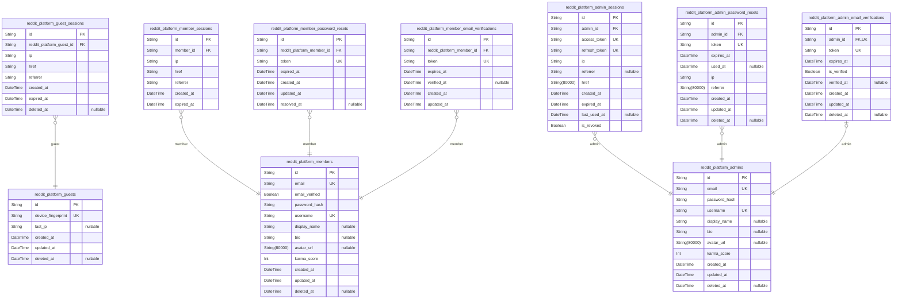
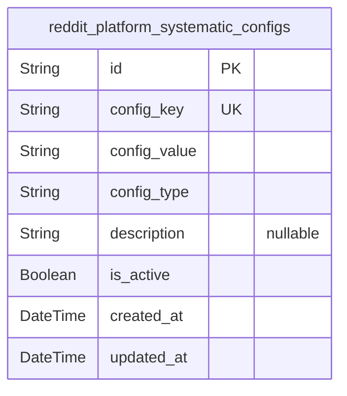
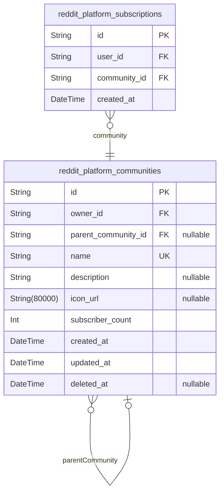
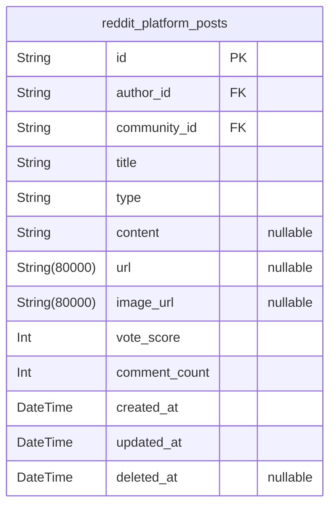
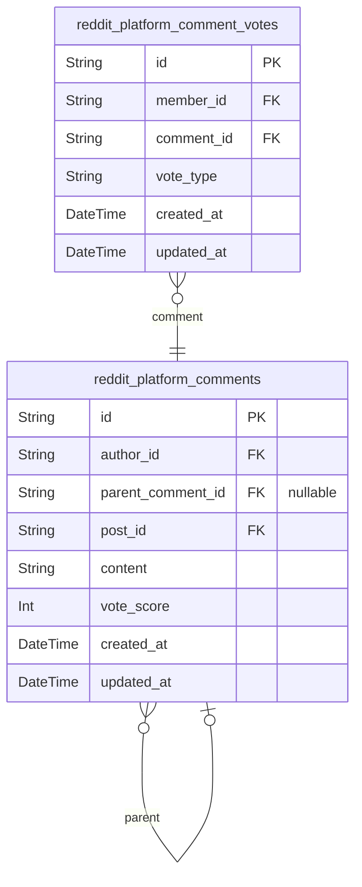
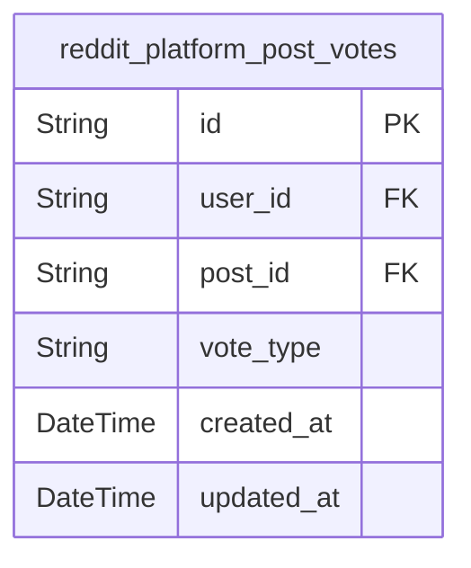
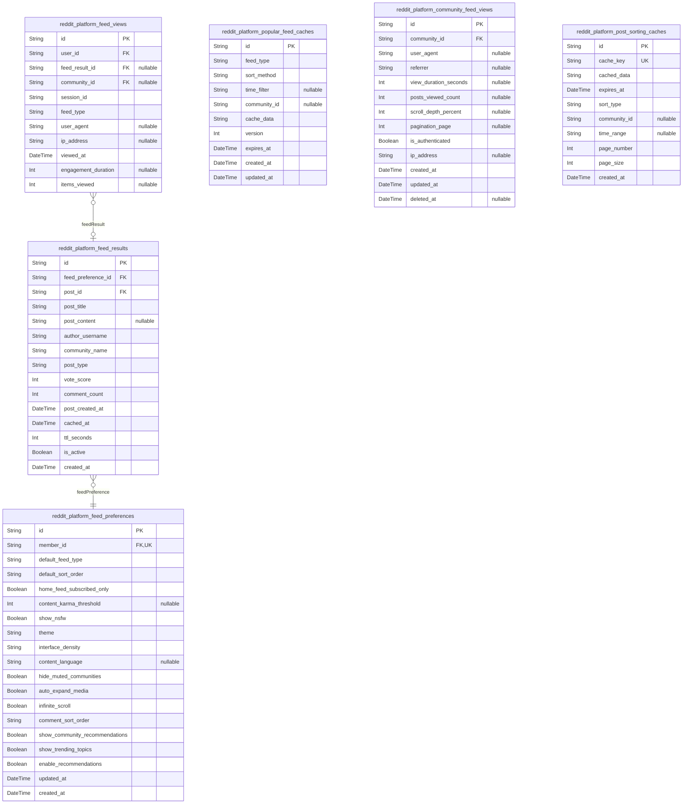
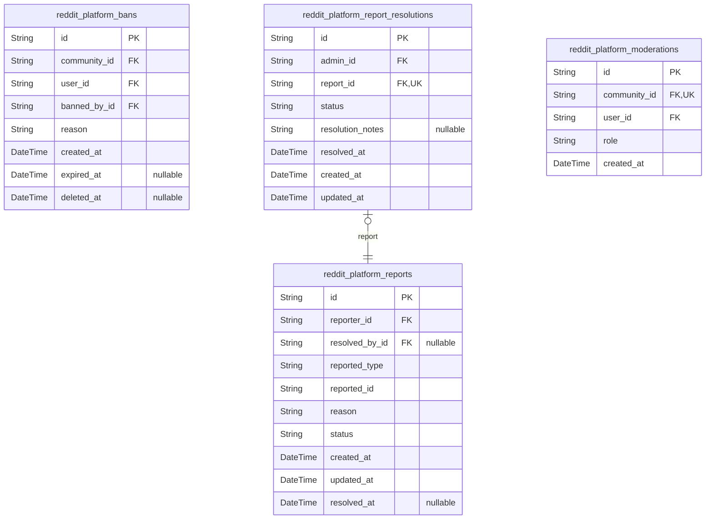
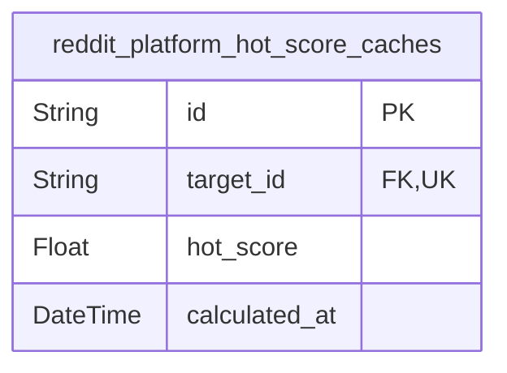

# Prisma Markdown

> Generated by [`prisma-markdown`](https://github.com/samchon/prisma-markdown)

- [Actors](#actors)
- [Systematic](#systematic)
- [Communities](#communities)
- [Posts](#posts)
- [Comments](#comments)
- [Voting](#voting)
- [Feeds](#feeds)
- [Moderation](#moderation)
- [default](#default)

## Actors

### `reddit_platform_guests`

Temporary guest accounts identified by device fingerprint. Used for
anonymous users before registration to maintain session continuity and
track activity across the platform.

Properties as follows:

- `id`: Primary Key.
- `device_fingerprint`: Unique device fingerprint hash for identifying returning guests
- `last_ip`: Last known IP address of the guest
- `created_at`: When this guest session was created
- `updated_at`: When this guest session was last active
- `deleted_at`: When this guest account was soft-deleted (if applicable)

### `reddit_platform_guest_sessions`

Temporary session tokens for guest access. Records connection metadata
including IP address, referrer information, and session timing for
security auditing and analytics purposes.

Properties as follows:

- `id`: Primary Key.
- `reddit_platform_guest_id`: Belonged guest's [reddit_platform_guests.id](#reddit_platform_guests).
- `ip`: IP address of the guest session.
- `href`: Page href where session was initiated.
- `referrer`: Referrer URL of the guest session.
- `created_at`: Session creation timestamp.
- `expired_at`: Session expiration timestamp.
- `deleted_at`: Soft delete timestamp for session records.

### `reddit_platform_members`

Registered member accounts with email/password credentials. Serves as the
primary identity record for standard users who can create posts,
comments, vote on content, and subscribe to communities. Each member has
a unique email and username combination for authentication and profile
identification.

Key characteristics:
- Authentication credentials stored as password_hash with bcrypt
- Email verification required before full functionality
- Karma score calculated from post and comment voting activity
- Soft deletion preserves data for audit trails while hiding from active
views

Properties as follows:

- `id`: Primary Key.
- `email`
  > Email address for authentication. Must be unique across all member
  > accounts.
- `email_verified`
  > Whether the email address has been verified through the email
  > verification flow.
- `password_hash`: Bcrypt-hashed password for authentication security.
- `username`
  > Unique username for profile identification and @ mentions. Follows
  > community naming rules.
- `display_name`: Optional display name shown on posts and comments instead of username.
- `bio`: Optional user biography displayed on profile.
- `avatar_url`: URL to user's profile avatar image.
- `karma_score`: Total karma calculated from upvotes and downvotes on posts and comments.
- `created_at`: Account creation timestamp.
- `updated_at`: Last profile or credential update timestamp.
- `deleted_at`: Soft deletion timestamp when user deletes account (null if active).

### `reddit_platform_member_sessions`

JWT session tokens with access and refresh support for member actors.
This is an append-only audit trail of member login events, storing
connection metadata (IP, URL, referrer) for security monitoring and
forensics. Each member can have multiple sessions, but a session always
belongs to exactly one member.

@{link reddit_platform_members} - Member account that owns this session
@{link reddit_platform_member_password_resets} - Password reset tokens
for member accounts
@{link reddit_platform_member_email_verifications} - Email verification
tokens for registration confirmation

Properties as follows:

- `id`: Primary Key.
- `member_id`: Member account's @{link reddit_platform_members.id}.
- `ip`: IP address of the client that initiated this session.
- `href`: URL path of the page that initiated this session.
- `referrer`: Referrer header value from the client request.
- `created_at`: Timestamp when this session was created. Append-only audit trail.
- `expired_at`: Timestamp when this session expires. Enforced for security.

### `reddit_platform_member_password_resets`

Password reset tokens for member account recovery workflows. Stores
secure tokens with expiration times and tracks which member requested the
reset.

Properties as follows:

- `id`: Primary Key.
- `reddit_platform_member_id`
  > Referenced member account requesting password reset. {@link
  > reddit_platform_members.id}.
- `token`
  > Secure randomly generated reset token. Used in password reset URLs and
  > validated before allowing password change.
- `expired_at`
  > Token expiration timestamp. Password reset attempts after this time are
  > rejected.
- `created_at`: Timestamp when the password reset token was created.
- `updated_at`: Timestamp when the password reset token was used or expired.
- `resolved_at`
  > Optional timestamp indicating when the member actually changed their
  > password using this token.

### `reddit_platform_member_email_verifications`

Email verification tokens for member registration confirmation. Each
member can have multiple verification tokens (one per registration
attempt), allowing the system to track verification history and support
resends. Tokens are single-use and automatically deleted after successful
verification.

Properties as follows:

- `id`: Primary Key.
- `reddit_platform_member_id`
  > Member account that owns this email verification token. {@link
  > reddit_platform_members.id}.
- `token`
  > Unique verification token sent to user's email address. Generated as
  > cryptographically secure random string.
- `expires_at`
  > Expiration timestamp for this verification token. Tokens are valid for 24
  > hours from creation.
- `verified_at`
  > Timestamp when this token was successfully used for email verification.
  > Null until verification occurs.
- `created_at`: Timestamp when this verification token was created.
- `updated_at`: Timestamp when this verification token was last updated.

### `reddit_platform_admins`

Admin accounts with elevated platform-wide privileges for community
oversight and content management. Each admin has authentication
credentials, profile information including display_name and avatar, and
karma tracking for community engagement metrics. This table serves as the
primary identity record for administrative users, with separate session
management in `reddit_platform_admin_sessions` and credential management
through password reset and email verification workflows.

Properties as follows:

- `id`: Primary Key.
- `email`: Unique email address for authentication.
- `password_hash`: BCrypt hashed password for authentication.
- `username`: Unique username for profile display.
- `display_name`: Display name for community visibility.
- `bio`: Admin biography and description.
- `avatar_url`: Avatar image URL for admin profile.
- `karma_score`: Admin's karma score for community engagement.
- `created_at`: Creation timestamp.
- `updated_at`: Last update timestamp.
- `deleted_at`: Soft delete timestamp.

### `reddit_platform_admin_sessions`

JWT session tokens with access and refresh support for administrators.
Stores active sessions with authentication context including IP,
referrer, and session tokens for security auditing and session
management.

Properties as follows:

- `id`: Primary Key.
- `admin_id`
  > Administrator user who owns this session. {@link
  > reddit_platform_admins.id}.
- `access_token`
  > JWT access token for API authentication. Short-lived token (typically
  > 15-60 minutes) used for authorizing API requests.
- `refresh_token`
  > JWT refresh token for obtaining new access tokens. Long-lived token
  > (typically 7-30 days) used to refresh authentication without requiring
  > re-login.
- `ip`
  > IP address of the client when this session was created. Used for security
  > auditing and detecting suspicious login patterns.
- `referrer`
  > HTTP referrer header from the initial request. Tracks where the user came
  > from when establishing the session.
- `href`
  > Full URL path and query parameters of the initial request. Captures the
  > complete navigation context when session was established.
- `created_at`
  > Timestamp when the session was created. Used for session age tracking and
  > audit trails.
- `expired_at`
  > Timestamp when the session will expire. Used to automatically invalidate
  > sessions after their validity period.
- `last_used_at`
  > Timestamp when the session was last used. Updated on each authenticated
  > request to support session activity tracking.
- `is_revoked`
  > Whether this session has been revoked before its natural expiration. Set
  > to true when users log out or administrators invalidate sessions.

### `reddit_platform_admin_password_resets`

Password reset tokens for admin accounts with expiration tracking. Each
reset request creates a new record that becomes invalid after use or
expiration. This table tracks the complete password reset workflow for
admin authentication security.

**Key Relationships:**
- Belongs to exactly one admin via `reddit_platform_admins.id`
- Each admin can have multiple password reset requests over time
- Soft delete pattern via `deleted_at` for audit trail

**Business Rules:**
- Token must be unique and single-use
- Reset request expires after 1 hour by default
- Used resets are marked by setting `used_at` timestamp
- Connection context (IP, referrer) recorded for security auditing

Properties as follows:

- `id`: Primary Key.
- `admin_id`
  > Admin account requesting password reset. {@link
  > reddit_platform_admins.id}.
- `token`
  > Unique password reset token hash for security. Used for verification
  > during password reset process.
- `expires_at`: Timestamp when this password reset token expires and becomes invalid.
- `used_at`
  > Timestamp when this password reset was successfully used. Null until
  > reset completed.
- `ip`
  > IP address from which password reset was requested. Stored for security
  > auditing.
- `referrer`
  > Referrer URL from which password reset was requested. Helps identify
  > source of reset request.
- `created_at`: When this password reset record was created.
- `updated_at`: Last time this password reset record was updated.
- `deleted_at`: Soft delete timestamp for audit trail preservation.

### `reddit_platform_admin_email_verifications`

Email verification tokens for admin registration. Stores verification
tokens sent to admins during registration process with expiration
tracking and success confirmation.

Properties as follows:

- `id`: Primary Key.
- `admin_id`
  > Admin's [reddit_platform_admins.id](#reddit_platform_admins). Required for email
  > verification association.
- `token`
  > Unique verification token hash sent to admin email. SHA-256 hash of
  > original token.
- `expires_at`: Token expiration timestamp. After this time, the token is invalid.
- `is_verified`
  > Whether the email address has been successfully verified. Set to true
  > when token is used successfully.
- `verified_at`
  > Timestamp when email was successfully verified. Null until verification
  > occurs.
- `created_at`: Creation timestamp. Automatically set when verification record is created.
- `updated_at`: Last update timestamp. Automatically updated on any change.
- `deleted_at`: Soft delete timestamp. Null when active, set when record is soft-deleted.

## Systematic

### `reddit_platform_systematic_configs`

System configuration settings and platform-wide parameters for the
Reddit-like community platform. Stores key-value pairs with type
information for dynamic configuration management.

Properties as follows:

- `id`: Primary Key.
- `config_key`: Unique configuration key identifier (e.g., 'site_name', 'max_post_size')
- `config_value`
  > Configuration value stored as string (parsed by application based on
  > config_type)
- `config_type`: Data type of the configuration value (string, int, double, boolean, json)
- `description`: Description of what this configuration parameter controls
- `is_active`: Whether this configuration is currently active
- `created_at`: When this configuration was created
- `updated_at`: When this configuration was last updated

## Communities

### `reddit_platform_communities`

Community entity for organizing users and content. Each community has a
unique name, description, icon, owner (member), and tracks subscriber
count.

Properties as follows:

- `id`: Primary Key.
- `owner_id`: Community owner's [reddit_platform_members.id](#reddit_platform_members).
- `parent_community_id`
  > Reference to community [reddit_platform_communities.id](#reddit_platform_communities) for
  > self-referential hierarchy support.
- `name`: Unique community identifier in lowercase without spaces.
- `description`: Community description and purpose.
- `icon_url`: URL to community icon/image.
- `subscriber_count`: Current number of subscribers.
- `created_at`: Creation timestamp.
- `updated_at`: Last update timestamp.
- `deleted_at`: Optional deletion timestamp for soft delete.

### `reddit_platform_subscriptions`

User subscriptions to communities for feed personalization

Properties as follows:

- `id`: Primary Key.
- `user_id`
  > User who subscribed to the community. [reddit_platform_members.id](#reddit_platform_members)
  > or [reddit_platform_guests.id](#reddit_platform_guests).
- `community_id`
  > Community that the user subscribed to. {@link
  > reddit_platform_communities.id}.
- `created_at`: Timestamp when the subscription was created.

## Posts

### `reddit_platform_posts`

Main post content entity supporting text, link, and image post types.
Stores title, content, and type-specific fields (url for link posts,
image_url for image posts). Includes vote_score and comment_count
denormalized fields for performance optimization. Supports soft deletion
via deleted_at for moderation workflows.

Properties as follows:

- `id`: Primary Key.
- `author_id`: Author user's [reddit_platform_members.id](#reddit_platform_members).
- `community_id`: Parent community's [reddit_platform_communities.id](#reddit_platform_communities).
- `title`: Post title (required).
- `type`: Post type: TEXT, LINK, or IMAGE.
- `content`: Text content for text posts (nullable for link/image posts).
- `url`: URL for link posts (nullable for text/image posts).
- `image_url`: Image URL for image posts (nullable for text/link posts).
- `vote_score`: Calculated vote score (upvotes - downvotes).
- `comment_count`: Number of comments on this post.
- `created_at`: Post creation timestamp.
- `updated_at`: Last update timestamp.
- `deleted_at`: Soft delete timestamp (null = active).

## Comments

### `reddit_platform_comments`

Main comment entity supporting threaded conversations with vote tracking
and temporal data.

Properties as follows:

- `id`: Primary Key.
- `author_id`: Author of this comment. [reddit_platform_members.id](#reddit_platform_members).
- `parent_comment_id`: Parent comment if this is a reply. [reddit_platform_comments.id](#reddit_platform_comments).
- `post_id`: Post this comment belongs to. [reddit_platform_posts.id](#reddit_platform_posts).
- `content`: Content of the comment.
- `vote_score`: Current vote score (upvotes minus downvotes).
- `created_at`: Timestamp when this comment was created.
- `updated_at`: Timestamp when this comment was last updated.

### `reddit_platform_comment_votes`

User votes on comments with upvote/downvote tracking. Each user can cast
exactly one vote per comment, which can be an upvote, downvote, or none
(vote revocation). Vote type is stored directly to enable quick score
calculations without aggregating votes.

Properties as follows:

- `id`: Primary Key.
- `member_id`: User who cast the vote. [reddit_platform_members.id](#reddit_platform_members).
- `comment_id`: Comment that was voted on. [reddit_platform_comments.id](#reddit_platform_comments).
- `vote_type`
  > Vote type cast by the user - upvote, downvote, or none (vote revocation).
  > This directly stores the vote type to enable quick score calculations
  > without aggregating votes.
- `created_at`: Timestamp when the vote was created.
- `updated_at`: Timestamp when the vote was last updated (e.g., when vote was changed).

## Voting

### `reddit_platform_post_votes`

Stores user votes on posts with upvote/downvote tracking and timestamp
information. Each user can vote once per post, with vote types including
upvote, downvote, or no vote (neutral). This table captures the voting
behavior for posts in the Reddit-like community platform.

Properties as follows:

- `id`: Primary Key.
- `user_id`: User who cast the vote. [reddit_platform_members.id](#reddit_platform_members).
- `post_id`: Post that was voted on. [reddit_platform_posts.id](#reddit_platform_posts).
- `vote_type`
  > Type of vote cast by the user. Values: UPVOTE (positive vote), DOWNVOTE
  > (negative vote), NONE (neutral/no vote).
- `created_at`: Timestamp when the vote was created.
- `updated_at`: Timestamp when the vote was last updated.

## Feeds

### `reddit_platform_feed_results`

Cached feed results for personalized feeds with user subscription
context. This table stores pre-computed feed results to improve
performance when serving personalized feeds to users. Each record
represents a cached feed entry that can be quickly retrieved without
re-computing the feed algorithm.

Properties as follows:

- `id`: Primary Key.
- `feed_preference_id`
  > Reference to the user's feed preference that generated this result.
  > [reddit_platform_feed_preferences.id](#reddit_platform_feed_preferences).
- `post_id`
  > Reference to the cached post content for this feed result. {@link
  > reddit_platform_posts.id}.
- `post_title`: Cached post title for quick retrieval in feed listings.
- `post_content`
  > Cached post content/body for feed display. For link posts, this may
  > contain the URL preview text.
- `author_username`: Cached post author's username for display in feed.
- `community_name`: Cached community name for this post to avoid joins during feed rendering.
- `post_type`: Post type: TEXT, LINK, or IMAGE for appropriate feed rendering.
- `vote_score`: Post's current vote score at cache time for sorting.
- `comment_count`: Post's comment count at cache time for feed display.
- `post_created_at`: Cached timestamp when the post was created.
- `cached_at`: Timestamp when this feed result was generated and cached.
- `ttl_seconds`: Time-to-live indicator for this cache entry to manage expiration.
- `is_active`: Whether this cached result is currently active and can be served to users.
- `created_at`: Creation timestamp

### `reddit_platform_feed_views`

Tracks feed view events for analytics and personalization. Records when
users view feeds to analyze engagement patterns and optimize content
delivery.

Properties as follows:

- `id`: Primary Key.
- `user_id`
  > User who viewed the feed. [reddit_platform_members.id](#reddit_platform_members) for
  > authenticated users or [reddit_platform_guests.id](#reddit_platform_guests) for guest
  > sessions.
- `feed_result_id`
  > Feed type that was viewed. [reddit_platform_feed_results.id](#reddit_platform_feed_results) for
  > cached feed results.
- `community_id`
  > Community context when viewing community feeds. {@link
  > reddit_platform_communities.id}.
- `session_id`: Session identifier for tracking user sessions across multiple views.
- `feed_type`: Type of feed being viewed (home, popular, community, search).
- `user_agent`: Device and browser information from the user agent string.
- `ip_address`: IP address of the user for geolocation and abuse detection.
- `viewed_at`: Timestamp when the feed view was recorded.
- `engagement_duration`: Duration in seconds that the user engaged with the feed.
- `items_viewed`: Number of items scrolled or viewed in this feed session.

### `reddit_platform_feed_preferences`

User-specific feed preferences and configuration

Properties as follows:

- `id`: Primary Key.
- `member_id`
  > User who configured these feed preferences. {@link
  > reddit_platform_members.id}
- `default_feed_type`: Default feed type (HOME, POPULAR, COMMUNITY)
- `default_sort_order`: Sort order for posts (TOP, NEW, HOT, RISING)
- `home_feed_subscribed_only`: Show content from subscribed communities only (for home feed)
- `content_karma_threshold`: Minimum karma threshold for content display
- `show_nsfw`: Show NSFW content flag
- `theme`: Theme preference (light, dark, system)
- `interface_density`: Interface density setting
- `content_language`: Language preference for content
- `hide_muted_communities`: Hide content from muted communities
- `auto_expand_media`: Automatically expand media content
- `infinite_scroll`: Enable infinite scroll
- `comment_sort_order`: Sort comments by (TOP, NEW, OLD, CONVERSACTION)
- `show_community_recommendations`: Show community recommendations
- `show_trending_topics`: Show trending topics sidebar
- `enable_recommendations`: Enable personalized recommendations
- `updated_at`: Last updated timestamp
- `created_at`: Creation timestamp

### `reddit_platform_popular_feed_caches`

Cached popular feed content for rapid delivery. Stores pre-computed feed
results to enable fast popular feed access across the entire platform.
Contains cached post listings with vote scores, author info, and
community context for immediate delivery without real-time computation.

Properties as follows:

- `id`: Primary Key.
- `feed_type`: Type of feed cached (e.g., 'popular', 'home', 'community')
- `sort_method`: Sorting algorithm used (e.g., 'hot', 'new', 'top', 'controversial')
- `time_filter`: Time range filter for top sorting (e.g., 'today', 'week', 'month', 'all')
- `community_id`: Community identifier for community feeds, null for platform-wide feeds
- `cache_data`
  > JSON string containing cached feed results (post IDs, vote scores,
  > metadata)
- `version`: Cache version number for invalidation when feed parameters change
- `expires_at`: Cache expiration timestamp for automatic invalidation
- `created_at`: When this cache entry was created
- `updated_at`: When this cache entry was last updated

### `reddit_platform_community_feed_views`

Tracking of community-specific feed access patterns for analytics and
personalization. Records each time a user (authenticated or guest) views
a community feed, capturing context about their session, pagination
behavior, and engagement signals.

Properties as follows:

- `id`: Primary Key.
- `community_id`: Referenced community's [reddit_platform_communities.id](#reddit_platform_communities).
- `user_agent`: User agent string from the requesting client for device/browser detection.
- `referrer`: HTTP referrer header indicating how user arrived at the feed.
- `view_duration_seconds`: Calculated duration of the feed view session in seconds.
- `posts_viewed_count`: Number of posts the user viewed during this feed session.
- `scroll_depth_percent`: Percentage of feed scrolled by user (0-100).
- `pagination_page`: Pagination page number viewed (1-indexed).
- `is_authenticated`: Whether the user was authenticated during this view.
- `ip_address`: Client IP address for geographical and security analysis.
- `created_at`: Timestamp when the feed view occurred.
- `updated_at`: Timestamp of the last update to this view record.
- `deleted_at`: Soft delete timestamp for data retention compliance.

### `reddit_platform_post_sorting_caches`

Cache table for post sorting results to improve feed generation speed.
Stores pre-computed post lists for various sorting criteria (hot, top,
new, etc.) with configurable expiration to balance performance and data
freshness.

Properties as follows:

- `id`: Primary Key.
- `cache_key`: Unique cache key identifier (e.g., 'hot:community:abc123:page:1').
- `cached_data`: JSON-encoded array of post IDs and metadata for the cached results.
- `expires_at`: Timestamp when this cache entry should be invalidated.
- `sort_type`: Type of sorting applied (hot, top, new,Controversial, etc.).
- `community_id`: Optional community identifier for community-specific feeds.
- `time_range`: Time range filter for sorting (hour, day, week, month, year, all_time).
- `page_number`: Page number for pagination support in cached results.
- `page_size`: Number of items cached per page.
- `created_at`: Timestamp when this cache entry was created.

## Moderation

### `reddit_platform_bans`

User ban records for communities. Stores ban relationships between users
and communities, including the moderator who imposed the ban, the ban
reason, and ban duration with expiration.

Properties as follows:

- `id`: Primary Key.
- `community_id`
  > The community from which the user is banned. {@link
  > reddit_platform_communities.id}.
- `user_id`
  > The user who is banned from the community. {@link
  > reddit_platform_members.id}.
- `banned_by_id`: The moderator who imposed this ban. [reddit_platform_admins.id](#reddit_platform_admins).
- `reason`
  > The reason for the ban. Human-readable explanation provided by the
  > moderator.
- `created_at`: Timestamp when the ban was created.
- `expired_at`: Timestamp when the ban expires. Nullable for permanent bans.
- `deleted_at`: Timestamp for soft delete. Null when ban is active.

### `reddit_platform_reports`

Content reports submitted by users for posts or comments, tracking the
reporting process from submission through resolution. Stores reporter
information, reported content reference, report reason, current status
(pending/approved/dismissed), and resolution metadata including who
resolved it and when. Supports both post and comment reporting through a
polymorphic approach with reported_type and reported_id fields.

Properties as follows:

- `id`: Primary Key.
- `reporter_id`: The user who submitted the report. [reddit_platform_members.id](#reddit_platform_members).
- `resolved_by_id`: The moderator who resolved this report. [reddit_platform_admins.id](#reddit_platform_admins).
- `reported_type`
  > The type of content being reported (POST or COMMENT). Must be one of the
  > defined enum values.
- `reported_id`
  > The ID of the reported post or comment. References either
  > reddit_platform_posts.id or reddit_platform_comments.id depending on
  > reported_type.
- `reason`
  > The reason or description provided by the reporter for submitting this
  > report. Contains the user's explanation of why the content was reported.
- `status`
  > Current status of the report. Defaults to PENDING. Can be APPROVED
  > (content removed) or DISMISSED (no action needed).
- `created_at`: Timestamp when the report was created.
- `updated_at`: Timestamp when the report was last updated.
- `resolved_at`
  > Timestamp when the report was resolved. Nullable - only set when status
  > is APPROVED or DISMISSED.

### `reddit_platform_report_resolutions`

Moderator resolution actions for user reports with status tracking and
audit trail

Properties as follows:

- `id`: Primary Key.
- `admin_id`: Moderator who resolved the report [reddit_platform_admins.id](#reddit_platform_admins)
- `report_id`: Report that was resolved [reddit_platform_reports.id](#reddit_platform_reports)
- `status`: Resolution status: RESOLVED, DISMISSED
- `resolution_notes`: Resolution notes provided by the moderator
- `resolved_at`: Timestamp when report was resolved
- `created_at`: Timestamp when the resolution record was created
- `updated_at`: Timestamp when the resolution record was last updated

### `reddit_platform_moderations`

Community moderation assignments linking users to communities with role
hierarchy. Stores which users serve as moderators or owners for each
community, enabling the platform's governance system. Owner role is
unique per community while multiple moderators can be assigned.

Properties as follows:

- `id`: Primary Key.
- `community_id`: Community being moderated. [reddit_platform_communities.id](#reddit_platform_communities).
- `user_id`: Moderator or owner user. [reddit_platform_members.id](#reddit_platform_members).
- `role`
  > Moderator role level (OWNER or MODERATOR). OWNER can perform all
  > moderator actions plus manage other moderators.
- `created_at`: Timestamp when this moderation assignment was created.

## default

### `reddit_platform_hot_score_caches`

Cache for hot score calculations to optimize feed sorting. Stores
pre-computed hot score values for posts and communities to enable rapid
feed generation. This is a materialized view that stores calculated
results rather than raw data.

Properties as follows:

- `id`: Primary Key.
- `target_id`
  > The post or community being cached. [reddit_platform_posts.id](#reddit_platform_posts) or
  > [reddit_platform_communities.id](#reddit_platform_communities).
- `hot_score`: The hot score value calculated using the Reddit hot score algorithm.
- `calculated_at`: Timestamp when this cache entry was calculated and last updated.
