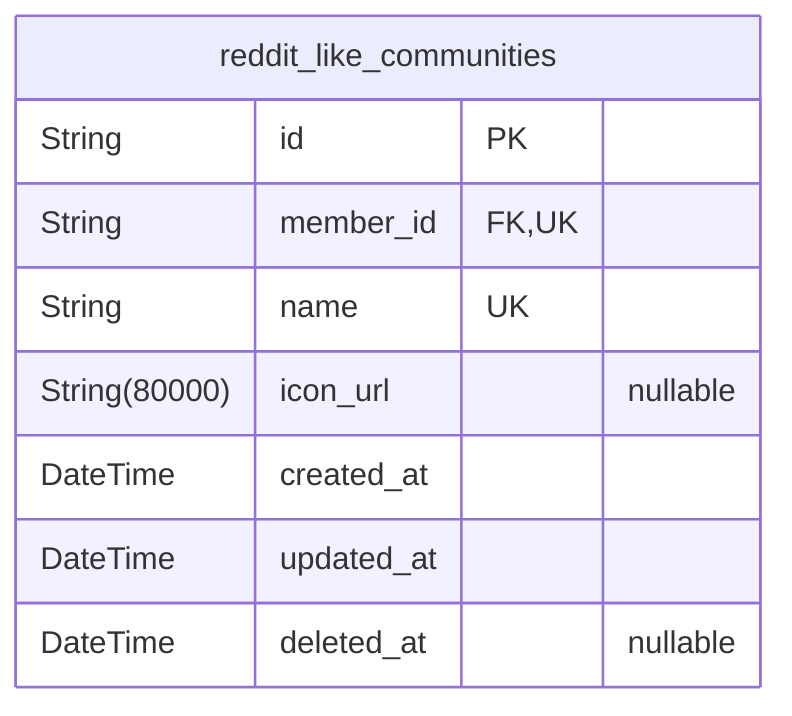
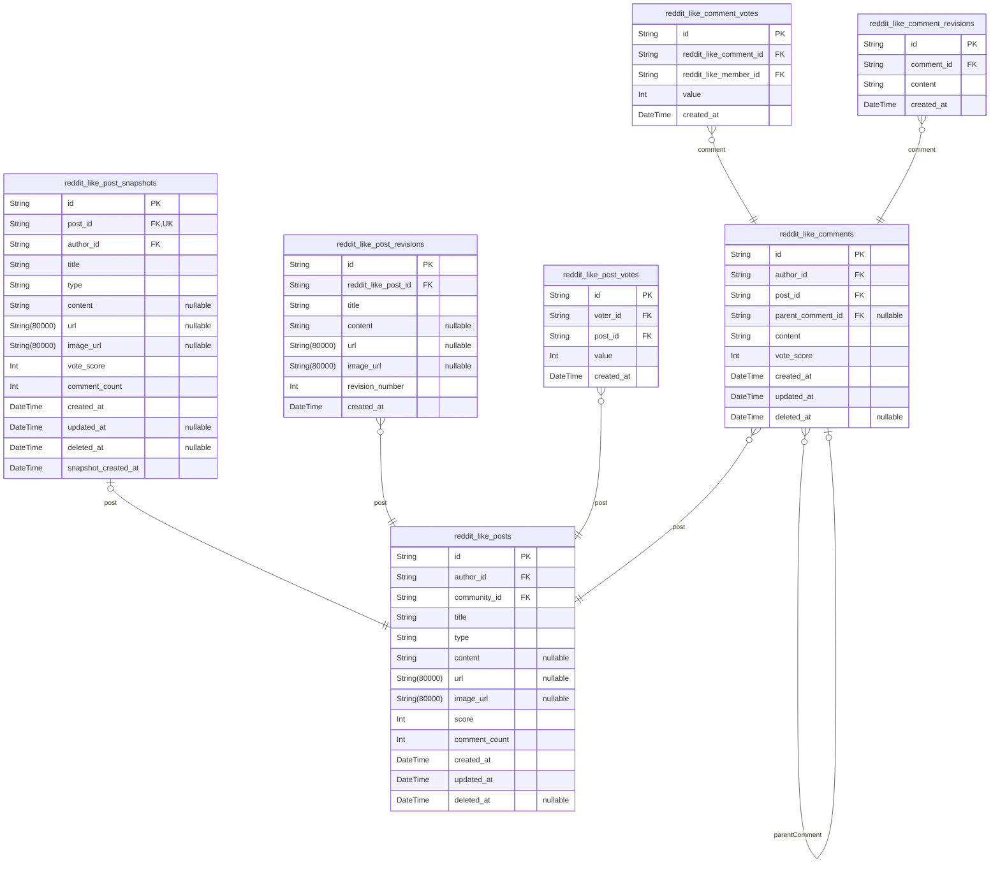
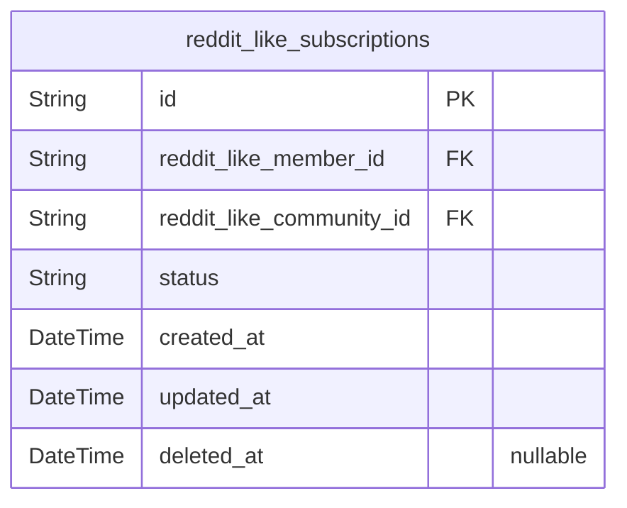
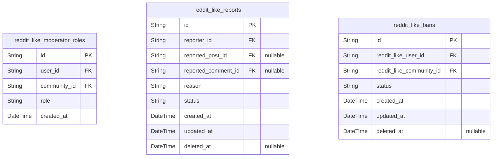
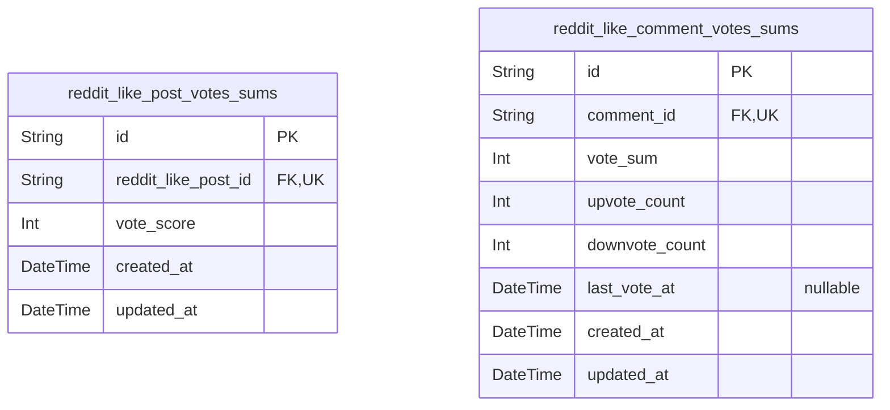

# Prisma Markdown

> Generated by [`prisma-markdown`](https://github.com/samchon/prisma-markdown)

- [Actors](#actors)
- [Communities](#communities)
- [Content](#content)
- [Subscriptions](#subscriptions)
- [Moderation](#moderation)
- [default](#default)

## Actors

```mermaid
erDiagram
"reddit_like_guests" {
  String id PK
  String device_id UK
  DateTime created_at
  DateTime updated_at
}
"reddit_like_guest_sessions" {
  String id PK
  String reddit_like_guest_id FK
  String ip
  String href
  String referrer "nullable"
  String user_agent "nullable"
  DateTime created_at
  DateTime expired_at
  DateTime updated_at
  DateTime deleted_at "nullable"
}
"reddit_like_members" {
  String id PK
  String email UK
  String username UK
  String password_hash
  String display_name
  String bio "nullable"
  String(80000) avatar_url "nullable"
  Int karma_score
  DateTime created_at
  DateTime updated_at
  DateTime deleted_at "nullable"
}
"reddit_like_member_sessions" {
  String id PK
  String member_id FK
  String access_token
  String refresh_token UK
  DateTime access_token_expires_at
  DateTime refresh_token_expires_at
  String ip
  String user_agent
  DateTime created_at
  DateTime updated_at
  DateTime expired_at "nullable"
  DateTime revoked_at "nullable"
}
"reddit_like_member_password_resets" {
  String id PK
  String member_id FK
  String reset_token UK
  DateTime expired_at
  DateTime created_at
  DateTime updated_at
  DateTime deleted_at "nullable"
}
"reddit_like_member_email_verifications" {
  String id PK
  String member_id FK,UK
  String email
  String token UK
  DateTime expires_at
  DateTime verified_at "nullable"
}
"reddit_like_moderators" {
  String id PK
  String email UK
  DateTime email_verified_at "nullable"
  String password_hash
  String username UK
  String display_name
  String bio "nullable"
  String(80000) avatar_url "nullable"
  Int karma_score
  DateTime created_at
  DateTime updated_at
  DateTime deleted_at "nullable"
}
"reddit_like_moderator_sessions" {
  String id PK
  String reddit_like_moderator_id FK
  String ip
  String(80000) href
  String(80000) referrer "nullable"
  DateTime created_at
  DateTime expired_at
}
"reddit_like_moderator_password_resets" {
  String id PK
  String moderator_id FK
  String token UK
  DateTime expires_at
  String ip "nullable"
  String user_agent "nullable"
  DateTime used_at "nullable"
  DateTime revoked_at "nullable"
  DateTime created_at
  DateTime updated_at
  DateTime deleted_at "nullable"
}
"reddit_like_moderator_email_verifications" {
  String id PK
  String moderator_id FK,UK
  String token_hash
  DateTime expires_at
  DateTime used_at "nullable"
  DateTime created_at
  DateTime updated_at
  DateTime deleted_at "nullable"
}
"reddit_like_admins" {
  String id PK
  String email UK
  String password_hash
  String username UK
  String display_name
  String bio "nullable"
  String(80000) avatar_url "nullable"
  Int karma_score
}
"reddit_like_admin_sessions" {
  String id PK
  String reddit_like_admin_id FK
  String ip
  String(80000) href
  String(80000) referrer "nullable"
  DateTime created_at
  DateTime expired_at
}
"reddit_like_admin_password_resets" {
  String id PK
  String admin_id FK
  String token_hash UK
  String token_salt
  DateTime expires_at
  DateTime used_at "nullable"
  DateTime created_at
  DateTime updated_at
  DateTime deleted_at "nullable"
}
"reddit_like_admin_email_verifications" {
  String id PK
  String reddit_like_admin_id FK
  String token UK
  DateTime expires_at
  DateTime verified_at "nullable"
  DateTime created_at
  DateTime updated_at
  DateTime deleted_at "nullable"
}
"reddit_like_guest_sessions" }o--|| "reddit_like_guests" : guest
"reddit_like_member_sessions" }o--|| "reddit_like_members" : member
"reddit_like_member_password_resets" }o--|| "reddit_like_members" : member
"reddit_like_member_email_verifications" |o--|| "reddit_like_members" : member
"reddit_like_moderator_sessions" }o--|| "reddit_like_moderators" : moderator
"reddit_like_moderator_password_resets" }o--|| "reddit_like_moderators" : moderator
"reddit_like_moderator_email_verifications" |o--|| "reddit_like_moderators" : emailVerification
"reddit_like_admin_sessions" }o--|| "reddit_like_admins" : admin
"reddit_like_admin_password_resets" }o--|| "reddit_like_admins" : admin
"reddit_like_admin_email_verifications" }o--|| "reddit_like_admins" : admin
```

### `reddit_like_guests`

Temporary guest accounts identified by device fingerprint for anonymous
browsing of public content. Guests can view communities, posts, and user
profiles but cannot interact with content (no voting, posting, or
commenting). This table serves as the identity record for unauthenticated
users who require temporary identification for abuse prevention and rate
limiting.

Guests differ from members in that they do not have email/password
authentication and their sessions are automatically expired without user
credentials. They represent the most basic level of user identification
in the system.

Properties as follows:

- `id`: Primary Key.
- `device_id`
  > Unique device fingerprint identifier for guest tracking. Used for abuse
  > prevention, rate limiting, and session management.
- `created_at`: Creation timestamp.
- `updated_at`: Last update timestamp.

### `reddit_like_guest_sessions`

Short-lived session tokens for guest authentication, tracking anonymous
browsing sessions with IP and metadata. Auto-expiring sessions for users
who browse content without logging in. Each session is tied to a specific
guest identifier and captures connection context for security auditing.

Properties as follows:

- `id`: Primary Key.
- `reddit_like_guest_id`: Reference to the guest account. [reddit_like_guests.id](#reddit_like_guests).
- `ip`: IP address at session creation time for security auditing.
- `href`: URL path accessed when session was created.
- `referrer`: Referrer URL that led to the site, if present.
- `user_agent`: Browser user agent string for device identification.
- `created_at`: Timestamp when the session was created.
- `expired_at`: Timestamp when the session expires and becomes invalid.
- `updated_at`: Timestamp when the session was last updated.
- `deleted_at`: Timestamp when the session was soft-deleted, if applicable.

### `reddit_like_members`

Registered user accounts with email/password authentication, profile
information, and karma tracking. Members can create posts, write
comments, vote on content, subscribe to communities, and manage their
account settings. The karma score is automatically calculated based on
votes received on their content. Account states include active (default),
suspended, and deleted (soft delete).

Properties as follows:

- `id`: Primary Key. Unique identifier for each member account.
- `email`
  > Member's email address, used for login and communication. Must be unique
  > across all member accounts.
- `username`
  > Member's unique username for display and identification. Cannot be
  > changed after registration.
- `password_hash`: Hashed password for authentication. Never stores plain text passwords.
- `display_name`: Display name shown on posts and comments. Can be changed by the member.
- `bio`: Member's self-description biography text.
- `avatar_url`: URL to the member's avatar image. Optional profile customization.
- `karma_score`
  > Member's reputation score calculated from votes on their content. Starts
  > at 0.
- `created_at`: Timestamp when the member account was created.
- `updated_at`: Timestamp when the member account was last updated.
- `deleted_at`: Soft delete timestamp. Null when account is active, set when deleted.

### `reddit_like_member_sessions`

JWT session tokens for member authentication. Tracks active sessions with
access and refresh tokens, including connection metadata (IP, user agent)
and expiration times. Sessions are automatically expired after 14 days
from last activity per session policy requirements.

Properties as follows:

- `id`: Primary Key.
- `member_id`: Member's [reddit_like_members.id](#reddit_like_members).
- `access_token`: JWT access token for API authentication.
- `refresh_token`: JWT refresh token for session extension.
- `access_token_expires_at`: Expiration timestamp for access token (2 hours validity).
- `refresh_token_expires_at`: Expiration timestamp for refresh token (14 days validity).
- `ip`: Client IP address at session creation.
- `user_agent`: Client browser user agent string.
- `created_at`: Session creation timestamp.
- `updated_at`: Last session update timestamp.
- `expired_at`: Session expiration timestamp (null if still active).
- `revoked_at`: Timestamp when session was manually revoked (soft delete).

### `reddit_like_member_password_resets`

Password reset tokens with expiration for secure member account recovery.

Tracks password reset requests for member accounts. Each record contains
a unique reset token and expiration time. Tokens are single-use and
expire after the designated time period, after which the member must
request a new reset token.

[reddit_like_members.id](#reddit_like_members) - Associated member account

Properties as follows:

- `id`: Primary Key.
- `member_id`: Member account's [reddit_like_members.id](#reddit_like_members).
- `reset_token`: Unique reset token value.
- `expired_at`: Token expiration datetime.
- `created_at`: Record creation timestamp.
- `updated_at`: Record last update timestamp.
- `deleted_at`: Soft delete timestamp.

### `reddit_like_member_email_verifications`

Email verification tokens for confirming new user email addresses. Stores
temporary tokens issued during registration to verify ownership of the
email address before the account becomes fully active.

Properties as follows:

- `id`: Primary Key.
- `member_id`: Target member's [reddit_like_members.id](#reddit_like_members).
- `email`: Email address being verified.
- `token`: Unique verification token string.
- `expires_at`: Token expiration timestamp.
- `verified_at`
  > When the email was successfully verified. Nullable until verification
  > occurs.

### `reddit_like_moderators`

Moderator actor accounts with elevated permissions for community content
management and user moderation. Unlike admin actors who have
platform-wide access, moderators are assigned to specific communities by
owners and have moderation capabilities only within those assigned
communities.

Properties as follows:

- `id`: Primary Key.
- `email`: Unique email address for authentication and communication.
- `email_verified_at`: Timestamp when email was verified, null until verification completed.
- `password_hash`: Secure hash of the moderator's password.
- `username`: Unique username for moderator profile and @ mentions.
- `display_name`: Display name shown in UI, can be different from username.
- `bio`: Optional biographical information about the moderator.
- `avatar_url`: Optional URL to moderator's avatar image.
- `karma_score`
  > Moderator's karma score, accumulated from upvotes on their posts and
  > comments.
- `created_at`: When the moderator account was created.
- `updated_at`: When the moderator account was last updated.
- `deleted_at`: Soft delete timestamp, null when active.

### `reddit_like_moderator_sessions`

JWT session tokens with access and refresh capabilities for moderator
authentication. Tracks login sessions with IP address, referrer
information, and session timing for security auditing.

This table records each successful authentication event for moderator
accounts, maintaining an append-only audit trail of login activity.
Sessions support both access token (short-lived) and refresh token
(long-lived) authentication flows.

[reddit_like_moderators.id](#reddit_like_moderators) - Moderator account that authenticated
[reddit_like_moderators.email](#reddit_like_moderators) - Email used for authentication

Properties as follows:

- `id`: Primary Key.
- `reddit_like_moderator_id`: Moderator account that authenticated. [reddit_like_moderators.id](#reddit_like_moderators).
- `ip`: IP address from which the session was created.
- `href`: The URL that was accessed when the session was created.
- `referrer`: The referrer URL that directed to the system when the session was created.
- `created_at`: Timestamp when the session was created.
- `expired_at`
  > Timestamp when the session expires. Sessions are automatically
  > invalidated after this time.

### `reddit_like_moderator_password_resets`

Password reset tokens with expiration for secure moderator account
recovery. This table stores temporary tokens that moderators can use to
reset their passwords when forgotten. Each token has a limited lifespan
and is invalidated after use or expiration.

Properties as follows:

- `id`: Primary Key. Unique identifier for each password reset request.
- `moderator_id`
  > Moderator's [reddit_like_moderators.id](#reddit_like_moderators). The moderator account that
  > requested this password reset.
- `token`
  > Unique password reset token. A secure random string used to identify the
  > password reset request.
- `expires_at`
  > Expiration timestamp for this password reset token. Tokens must be used
  > before this time or they become invalid.
- `ip`: IP address from which the password reset was requested.
- `user_agent`: User agent string from the device that requested the password reset.
- `used_at`
  > Timestamp when this token was successfully used for password reset. Null
  > if the token has not been used yet.
- `revoked_at`: Timestamp when this token was manually revoked. Null if not revoked.
- `created_at`: Creation timestamp. When this password reset request was created.
- `updated_at`: Last update timestamp. When this record was last modified.
- `deleted_at`
  > Soft delete timestamp. Null if not deleted, datetime if deleted for audit
  > trail.

### `reddit_like_moderator_email_verifications`

Email verification tokens for confirming moderator email addresses. Each
token is single-use with expiration and tracks verification status.

This table stores temporary verification codes that moderators receive
via email to confirm their email address during registration or when
changing their email. Tokens are hashed for security, have expiration
times, and are marked as used upon successful verification.

The table follows the same pattern as
`reddit_like_moderator_password_resets` but is specifically for email
confirmation rather than password recovery.

[reddit_like_moderators.id](#reddit_like_moderators) - moderator email verification records.

[reddit_like_moderator_sessions.id](#reddit_like_moderator_sessions) - moderator sessions that may
require verified email.

Properties as follows:

- `id`: Primary Key.
- `moderator_id`
  > Moderator's [reddit_like_moderators.id](#reddit_like_moderators). Email verification token
  > owner.
- `token_hash`
  > Hashed email verification token. Stored as SHA-256 hash for security.
  > One-time use token for email confirmation.
- `expires_at`
  > Token expiration timestamp. After this time, the verification token is no
  > longer valid and must be regenerated.
- `used_at`
  > Timestamp when the verification token was used. Null until the token is
  > successfully verified.
- `created_at`: Creation timestamp.
- `updated_at`: Last update timestamp.
- `deleted_at`
  > Soft delete timestamp. Marked when the verification record is invalidated
  > (used, expired, or manually deleted).

### `reddit_like_admins`

System administrator accounts with platform-wide access and management
capabilities.

Admins have unrestricted access to all communities and content across the
platform. They can manage user accounts, review reports from all
communities, and perform emergency moderation actions. Admin accounts
require full authentication capabilities including email verification and
password reset.

Properties as follows:

- `id`: Primary Key.
- `email`
  > Unique email address for authentication. {@link
  > reddit_like_admin_email_verifications.id}.
- `password_hash`: Securely hashed password for authentication.
- `username`: Unique username for platform identification.
- `display_name`: Display name shown on the profile and content.
- `bio`: Optional biography text for the admin profile.
- `avatar_url`: URL for the admin's avatar image.
- `karma_score`
  > Total karma score calculated from upvotes and downvotes on admin's
  > content.

### `reddit_like_admin_sessions`

Admin authentication session tokens with access and refresh capabilities.
Tracks login sessions for system administrators with platform-wide
access.

This table stores JWT session tokens for admin users, capturing
connection metadata including IP address, requested URL, and referrer
information for security auditing and session management.

Each admin can have multiple concurrent sessions, and expired sessions
are automatically removed based on the expired_at field.

Properties as follows:

- `id`: Primary Key.
- `reddit_like_admin_id`: Admin user's [reddit_like_admins.id](#reddit_like_admins).
- `ip`: IP address of the client device when the session was created.
- `href`: Requested URL/href at session creation time for audit trail.
- `referrer`: HTTP referrer header value for tracking traffic source.
- `created_at`: Session creation timestamp in UTC.
- `expired_at`: Session expiration timestamp in UTC. Sessions are invalid after this time.

### `reddit_like_admin_password_resets`

Password reset tokens for admin accounts with expiration. Used for secure
account recovery when admins forget their passwords. Each reset token is
valid for a single use and expires after a defined time window.

Properties as follows:

- `id`: Primary Key.
- `admin_id`
  > Admin account that requested the password reset. {@link
  > reddit_like_admins.id}.
- `token_hash`: Hashed password reset token. Stored as hashed string for security.
- `token_salt`: Salt used for hashing the reset token.
- `expires_at`
  > Expiration timestamp for the password reset token. Token is invalid after
  > this time.
- `used_at`: Timestamp when this reset token was used. NULL if not yet used.
- `created_at`: When this password reset record was created.
- `updated_at`: When this password reset record was last updated.
- `deleted_at`: Optional soft delete timestamp for audit trail retention.

### `reddit_like_admin_email_verifications`

Email verification tokens for confirming admin email addresses. When an
admin registers or changes their email, a verification token is generated
and sent to their email address. This table stores the token, expiration,
and verification status.

The verification process works as follows:
1. Admin registers or updates email
2. System creates a record with pending status and generates a unique token
3. Token is sent to admin's email address
4. Admin clicks verification link with token
5. System validates token and marks record as verified
6. Admin's email is confirmed as valid

This table follows the same pattern as member and moderator email
verification tables, ensuring consistency across actor types.

Properties as follows:

- `id`: Primary Key. UUID for the email verification record.
- `reddit_like_admin_id`: Admin user's [reddit_like_admins.id](#reddit_like_admins).
- `token`
  > Unique verification token. Generated as a cryptographically secure random
  > string.
- `expires_at`: Expiration time for the verification token.
- `verified_at`: When the email was verified. Null until verification completes.
- `created_at`: When this verification record was created.
- `updated_at`: When this verification record was last updated.
- `deleted_at`: Soft delete timestamp. Null if not deleted.

## Communities

### `reddit_like_communities`

Community entities with unique names, descriptions, and icons.
Communities serve as containers for posts and the subject of user
subscriptions. Each community has an owner (a member who created it) and
tracks subscriber counts. Communities enable content organization and
personalized feeds.

Properties as follows:

- `id`: Primary Key.
- `member_id`: Owner member's [reddit_like_members.id](#reddit_like_members).
- `name`
  > Unique community name in lowercase. Must be unique across all communities
  > and follow naming policy (letters, numbers, underscores only).
- `icon_url`: URL to community icon image.
- `created_at`: Creation timestamp.
- `updated_at`: Last update timestamp.
- `deleted_at`
  > Soft deletion timestamp for archiving communities without permanent
  > removal.

## Content

### `reddit_like_posts`

Main posts table storing text/link/image content created by users in
communities. Supports three content types via type enum with conditional
required fields. Posts belong to a community and are created by a member.
Supports soft deletion. Vote score and comment count are denormalized for
performance. Historical snapshots are stored in
reddit_like_post_snapshots. Content changes are tracked in
reddit_like_post_revisions.

Properties as follows:

- `id`: Primary Key.
- `author_id`
  > Post author's [reddit_like_members.id](#reddit_like_members). Member who created this
  > post.
- `community_id`
  > Target community's [reddit_like_communities.id](#reddit_like_communities). Post belongs to
  > this community. Member must be subscribed to community to create posts
  > here.
- `title`
  > Post title. Required field, cannot be empty or whitespace only. Trimming
  > applied before storage.
- `type`
  > Post content type. One of 'text', 'link', or 'image'. Determines which
  > content field is populated.
- `content`
  > Text content for text posts. Required when type is 'text'. Null for
  > link/image posts.
- `url`
  > URL for link posts. Required when type is 'link'. Must be valid URL
  > format. Null for text/image posts.
- `image_url`
  > Image URL for image posts. Required when type is 'image'. Null for
  > text/link posts.
- `score`
  > Post score calculated as upvotes minus downvotes. Initialized to 0 on
  > creation. Updated via postgres trigger on vote changes.
- `comment_count`
  > Total comment count including nested replies. Initialized to 0 on
  > creation. Updated via postgres trigger on comment creation/deletion.
- `created_at`: Creation timestamp. Automatically set on record creation.
- `updated_at`: Last update timestamp. Automatically updated on any field modification.
- `deleted_at`
  > Soft delete timestamp. When null, post is active. When set, post is
  > hidden from feeds but retained for audit.

### `reddit_like_post_snapshots`

Point-in-time snapshots of posts for audit trail, capturing state at
specific moments before edits or deletions. These immutable records
preserve the content, metadata, and authorship of posts exactly as they
existed at the time of snapshot, enabling historical analysis and
recovery from unintended changes. Each post can have at most one snapshot
that captures its final state before deletion or significant
modification.

Properties as follows:

- `id`: Primary Key.
- `post_id`: Referenced post's [reddit_like_posts.id](#reddit_like_posts) for audit trail.
- `author_id`: Author member's [reddit_like_members.id](#reddit_like_members) at time of snapshot.
- `title`: Post title at time of snapshot.
- `type`: Post type (text|link|image) at time of snapshot.
- `content`: Text content for text posts, null otherwise.
- `url`: URL for link posts, null otherwise.
- `image_url`: Image URL for image posts, null otherwise.
- `vote_score`: Vote score (upvotes - downvotes) at time of snapshot.
- `comment_count`: Comment count at time of snapshot.
- `created_at`: Post creation timestamp at time of snapshot.
- `updated_at`: Post last update timestamp, nullable if never updated.
- `deleted_at`: Post deletion timestamp, nullable if not deleted.
- `snapshot_created_at`: When this snapshot was captured for audit trail.

### `reddit_like_post_revisions`

History of content changes for posts, storing the actual text content at
each revision point for tracking edits and maintaining audit trail of
post content modifications over time.

Properties as follows:

- `id`: Primary Key.
- `reddit_like_post_id`: Reference to the post that was revised. [reddit_like_posts.id](#reddit_like_posts).
- `title`: The post title at this revision point.
- `content`: The post content text for text-type posts at this revision point.
- `url`: The post URL for link-type posts at this revision point.
- `image_url`: The post image URL for image-type posts at this revision point.
- `revision_number`: Sequential revision number for ordering changes chronologically.
- `created_at`: Timestamp when this revision was created.

### `reddit_like_post_votes`

Individual votes on posts (+1 for upvote, -1 for downvote), with
constraints to ensure one vote per user per post.

Properties as follows:

- `id`: Primary Key.
- `voter_id`: User who cast the vote. [reddit_like_members.id](#reddit_like_members).
- `post_id`: Post being voted on. [reddit_like_posts.id](#reddit_like_posts).
- `value`: Vote value (+1 for upvote, -1 for downvote). Must be exactly +1 or -1.
- `created_at`: Timestamp when the vote was cast. Non-null and immutable once set.

### `reddit_like_comments`

Threaded comments that can reply to posts or other comments, supporting
unlimited nesting depth with parent reference.

Properties as follows:

- `id`: Primary Key.
- `author_id`: User who created the comment. [reddit_like_members.id](#reddit_like_members).
- `post_id`: Post that this comment belongs to. [reddit_like_posts.id](#reddit_like_posts).
- `parent_comment_id`
  > Parent comment if this is a reply, null for top-level comments. {@link
  > reddit_like_comments.id}.
- `content`: Comment content text.
- `vote_score`: Total vote score (upvotes - downvotes).
- `created_at`: Creation timestamp.
- `updated_at`: Last update timestamp.
- `deleted_at`: Soft delete timestamp, null if not deleted.

### `reddit_like_comment_votes`

Individual votes on comments (+1 for upvote, -1 for downvote), with
constraints to ensure one vote per user per comment.

Properties as follows:

- `id`: Primary Key.
- `reddit_like_comment_id`: Reference to the comment being voted on. [reddit_like_comments.id](#reddit_like_comments).
- `reddit_like_member_id`: Reference to the member who cast the vote. [reddit_like_members.id](#reddit_like_members).
- `value`: Vote value: +1 for upvote, -1 for downvote.
- `created_at`: Timestamp when the vote was cast.

### `reddit_like_comment_revisions`

History of content changes for comments, storing the actual text content
at each revision point for tracking edits.

Each comment can have multiple revisions when edited. This table captures
the exact text content at the time of each edit, creating an audit trail
of comment modifications.

Use Cases:
- View revision history of a comment
- Compare different versions of a comment
- Restore previous versions of a comment
- Audit comment modifications for moderation

This is a subsidiary table - revisions are created automatically when
comments are edited, not directly managed by users.

Properties as follows:

- `id`: Primary Key.
- `comment_id`
  > Parent comment's [reddit_like_comments.id](#reddit_like_comments). Comment that this
  > revision belongs to.
- `content`: Comment text content at the time of this revision.
- `created_at`: When this revision was created (when the edit occurred).

## Subscriptions

### `reddit_like_subscriptions`

Tracks user-community subscription relationships. When a user subscribes
to a community, they gain permission to create posts in that community
and their home feed will show posts from that community. When
unsubscribed, they lose posting privileges and posts from that community
are filtered out of their home feed. The system tracks subscription
status (subscribed/unsubscribed) and maintains real-time subscriber
counts for each community.

Properties as follows:

- `id`: Primary Key.
- `reddit_like_member_id`: Member who subscribed to the community. [reddit_like_members.id](#reddit_like_members).
- `reddit_like_community_id`
  > Community that the member subscribed to. {@link
  > reddit_like_communities.id}.
- `status`
  > Subscription status. Can be "subscribed" or "unsubscribed". Default is
  > "subscribed" when creating a new subscription.
- `created_at`: Timestamp when the subscription was created.
- `updated_at`
  > Timestamp when the subscription was last updated (e.g., status change
  > from subscribed to unsubscribed).
- `deleted_at`: Timestamp when the subscription was soft-deleted. Null if not deleted.

## Moderation

### `reddit_like_moderator_roles`

Links users to communities with moderation roles (owner/moderator)

This table defines the relationship between users and communities for
moderation purposes. Each record represents a user's authority to
moderate a specific community with their assigned role type.

## Role Types
- `owner`: Highest authority role with full management permissions
including appointing/removing moderators
- `moderator`: Standard moderation permissions for content and user
management

## Business Rules
- Each community must have at least one owner
- Owners can appoint and remove moderators
- Moderators cannot remove owners or other moderators
- User deletion removes their associated moderator roles
- Community deletion removes all associated moderator roles

Properties as follows:

- `id`: Primary Key.
- `user_id`
  > The user who holds the moderation role. [reddit_like_members.id](#reddit_like_members),
  > [reddit_like_moderators.id](#reddit_like_moderators), or [reddit_like_admins.id](#reddit_like_admins).
- `community_id`
  > The community where the user has moderation authority. {@link
  > reddit_like_communities.id}.
- `role`
  > Moderation role type with permission levels. 'owner' has highest
  > authority including appointing/removing moderators. 'moderator' has
  > standard moderation permissions.
- `created_at`: When the moderation role was assigned.

### `reddit_like_reports`

Content reporting system allowing users to flag posts or comments for
moderator review. Reports track the reporter, the reported content (post
or comment), the reason for reporting, and the current status
(pending/approved/dismissed). Moderators can approve reports (which
removes the reported content) or dismiss them (which keeps the content
but closes the report). Each user can only report a specific piece of
content once.

Properties as follows:

- `id`: Primary Key.
- `reporter_id`: User who filed the report. [reddit_like_members.id](#reddit_like_members).
- `reported_post_id`
  > Post being reported. Null when reporting a comment. {@link
  > reddit_like_posts.id}.
- `reported_comment_id`
  > Comment being reported. Null when reporting a post. {@link
  > reddit_like_comments.id}.
- `reason`
  > Text description of why the content was reported. Required field for all
  > reports.
- `status`
  > Current status of the report. Initial value is 'pending', can be changed
  > to 'approved' (content deleted) or 'dismissed' (content kept).
- `created_at`: Timestamp when the report was created.
- `updated_at`: Timestamp when the report was last updated (e.g., status change).
- `deleted_at`: Timestamp for soft deletion. Null when report is active.

### `reddit_like_bans`

Tracks community bans with user, community, status, and timestamps

Properties as follows:

- `id`: Primary Key.
- `reddit_like_user_id`: The user who is banned. [reddit_like_members.id](#reddit_like_members).
- `reddit_like_community_id`
  > The community where the user is banned. {@link
  > reddit_like_communities.id}.
- `status`: The current status of the ban (active/inactive).
- `created_at`: When the ban was created.
- `updated_at`: When the ban was last updated.
- `deleted_at`: When the ban was soft-deleted (nullable if not deleted).

## default

### `reddit_like_post_votes_sums`

Aggregated vote scores for posts (sum of all votes), updated on each vote
change for fast score retrieval. This materialized view eliminates
expensive real-time aggregation queries by storing pre-computed vote
totals.

The vote score is calculated as (upvotes - downvotes) and automatically
updated whenever:
- A new vote is cast
- An existing vote is changed (e.g., upvote to downvote)
- A vote is removed

This table is maintained through triggers or application logic based on
changes to the `reddit_like_post_votes` table.

Properties as follows:

- `id`: Primary Key.
- `reddit_like_post_id`
  > Reference to the post whose votes are aggregated. {@link
  > reddit_like_posts.id}.
- `vote_score`
  > Sum of all votes (upvotes - downvotes). Updated automatically when votes
  > change.
- `created_at`: When this aggregated score was first calculated.
- `updated_at`: When this aggregated score was last updated.

### `reddit_like_comment_votes_sums`

Aggregated vote scores for comments (sum of all votes), updated on each
vote change for fast score retrieval. This is a materialized view pattern
that stores pre-computed vote sums to avoid expensive aggregate queries
on the reddit_like_comment_votes table.

Properties as follows:

- `id`: Primary Key.
- `comment_id`: Target comment's [reddit_like_comments.id](#reddit_like_comments).
- `vote_sum`: Sum of all votes on this comment (+1 for upvotes, -1 for downvotes).
- `upvote_count`: Count of upvotes (+1 votes) on this comment.
- `downvote_count`: Count of downvotes (-1 votes) on this comment.
- `last_vote_at`: Timestamp of the most recent vote on this comment.
- `created_at`: When this vote sum record was created.
- `updated_at`: When this vote sum record was last updated.
