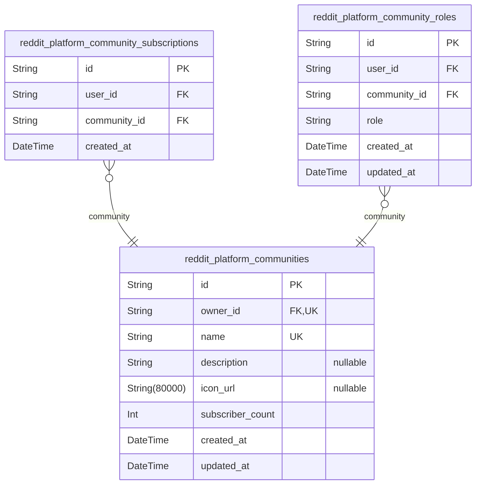
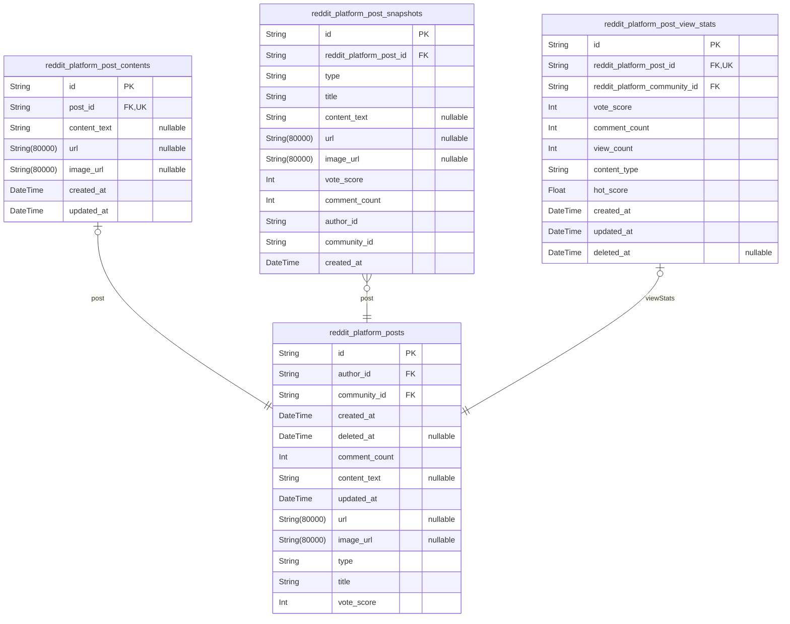
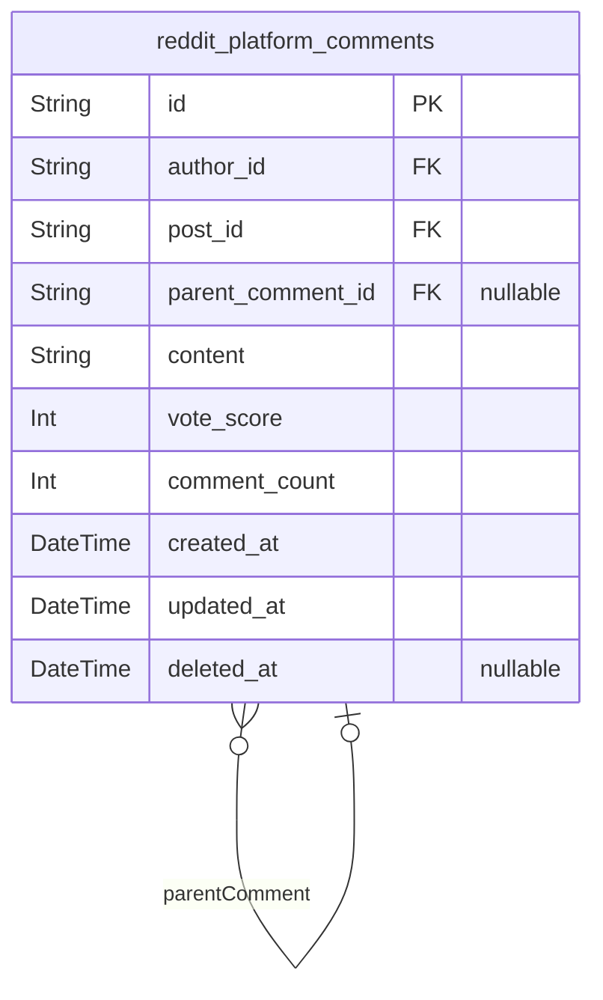
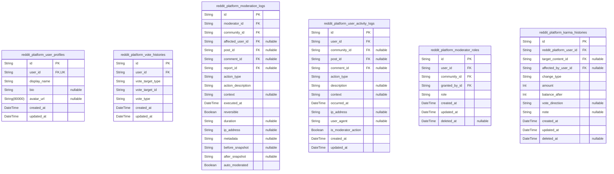
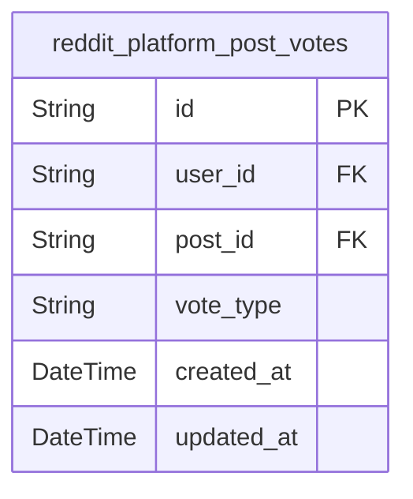
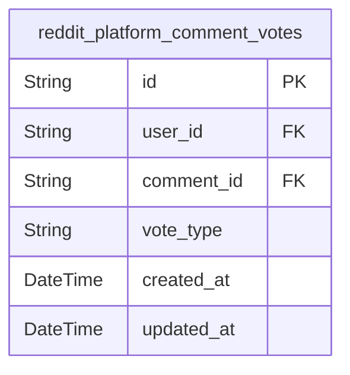
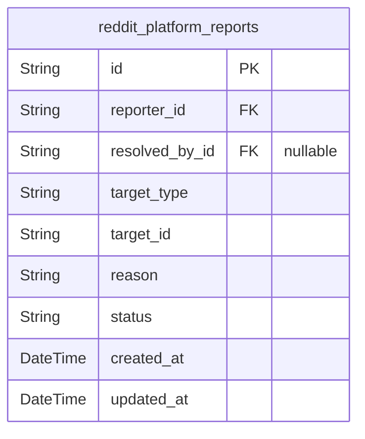
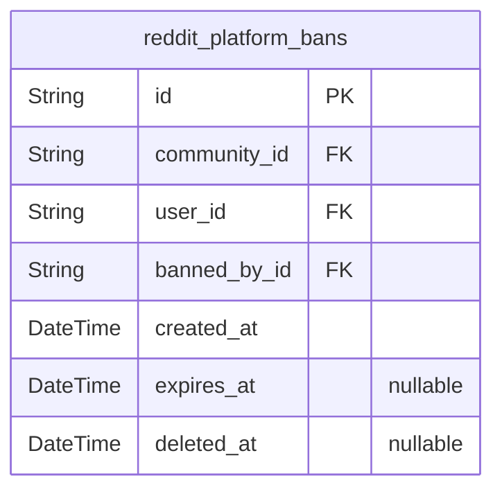

# Prisma Markdown

> Generated by [`prisma-markdown`](https://github.com/samchon/prisma-markdown)

- [Users](#users)
- [Communities](#communities)
- [Posts](#posts)
- [Comments](#comments)
- [Systematic](#systematic)
- [PostVotes](#postvotes)
- [CommentVotes](#commentvotes)
- [Reports](#reports)
- [Bans](#bans)

## Users

```mermaid
erDiagram
"reddit_platform_users" {
  String id PK
  String email UK
  String username UK
  String password_hash
  String display_name "nullable"
  String bio "nullable"
  String(80000) avatar_url "nullable"
  Int karma_score
  DateTime created_at
  DateTime updated_at
}
"reddit_platform_user_sessions" {
  String id PK
  String reddit_platform_user_id FK
  String access_token UK
  String refresh_token UK
  DateTime access_token_expires_at
  DateTime refresh_token_expires_at
  String ip "nullable"
  String user_agent "nullable"
  DateTime created_at
  DateTime expired_at
  DateTime last_activity_at
  Boolean is_active
}
"reddit_platform_user_password_resets" {
  String id PK
  String user_id FK
  String token UK
  DateTime expires_at
  DateTime created_at
}
"reddit_platform_user_email_verifications" {
  String id PK
  String reddit_platform_user_id FK,UK
  String token UK
  DateTime expired_at
  DateTime verified_at "nullable"
  DateTime created_at
  DateTime updated_at
}
"reddit_platform_moderators" {
  String id PK
  String user_id
  String display_name
  String bio "nullable"
  String(80000) avatar_url "nullable"
  Int karma_score
  String status
  DateTime created_at
  DateTime updated_at
  DateTime deleted_at "nullable"
}
"reddit_platform_moderator_sessions" {
  String id PK
  String reddit_platform_moderator_id FK
  String access_token
  String refresh_token
  DateTime expires_at
  DateTime refresh_expires_at
  String ip
  String(80000) href
  String(80000) referrer "nullable"
  String user_agent "nullable"
  DateTime created_at
  DateTime updated_at
}
"reddit_platform_moderator_password_resets" {
  String id PK
  String moderator_id FK
  String token UK
  DateTime expires_at
  DateTime used_at "nullable"
  DateTime created_at
  DateTime updated_at
  DateTime deleted_at "nullable"
}
"reddit_platform_moderator_email_verifications" {
  String id PK
  String reddit_platform_moderator_id FK
  String token UK
  DateTime expires_at
  DateTime used_at "nullable"
}
"reddit_platform_admins" {
  String id PK
  String email UK
  String password_hash
  String username UK
  String display_name "nullable"
  String bio "nullable"
  String(80000) avatar_url "nullable"
  Int karma_score
  DateTime created_at
  DateTime updated_at
  DateTime deleted_at "nullable"
  Boolean email_verified
}
"reddit_platform_admin_sessions" {
  String id PK
  String reddit_platform_admin_id FK
  String reddit_platform_user_id FK
  String access_token UK
  String refresh_token UK
  Int expires_at
  DateTime created_at
  DateTime updated_at
  DateTime expired_at
}
"reddit_platform_admin_password_resets" {
  String id PK
  String admin_id FK
  String token UK
  DateTime expires_at
  DateTime used_at "nullable"
  DateTime created_at
  DateTime updated_at
  DateTime deleted_at "nullable"
}
"reddit_platform_admin_email_verifications" {
  String id PK
  String admin_id FK
  String token UK
  String email
  DateTime expires_at
  DateTime verified_at "nullable"
  Boolean used
  DateTime created_at
  DateTime updated_at
}
"reddit_platform_user_sessions" }o--|| "reddit_platform_users" : user
"reddit_platform_user_password_resets" }o--|| "reddit_platform_users" : user
"reddit_platform_user_email_verifications" |o--|| "reddit_platform_users" : user
"reddit_platform_moderator_sessions" }o--|| "reddit_platform_moderators" : moderator
"reddit_platform_moderator_password_resets" }o--|| "reddit_platform_moderators" : moderator
"reddit_platform_moderator_email_verifications" }o--|| "reddit_platform_moderators" : moderator
"reddit_platform_admin_sessions" }o--|| "reddit_platform_admins" : admin
"reddit_platform_admin_sessions" }o--|| "reddit_platform_users" : user
"reddit_platform_admin_password_resets" }o--|| "reddit_platform_admins" : admin
"reddit_platform_admin_email_verifications" }o--|| "reddit_platform_admins" : admin
```

### `reddit_platform_users`

Main table for registered user accounts with email/password
authentication credentials, including profile fields and karma score.
This table serves as the primary identity record for standard application
users with authentication and session management capabilities.

Properties as follows:

- `id`: Primary Key.
- `email`: User's email address for authentication and communication.
- `username`: User's unique username for identification and display.
- `password_hash`: Secure hash of user's password for authentication.
- `display_name`: User's display name shown in interface.
- `bio`: User's bio/text description of themselves.
- `avatar_url`: URL to user's avatar image.
- `karma_score`: Current karma score for the user based on community engagement.
- `created_at`: Timestamp when the user account was created.
- `updated_at`: Timestamp when the user account was last updated.

### `reddit_platform_user_sessions`

JWT session tokens for user authentication with access and refresh token
support

Properties as follows:

- `id`: Primary Key.
- `reddit_platform_user_id`: User's [reddit_platform_users.id](#reddit_platform_users).
- `access_token`: JWT access token for API authentication.
- `refresh_token`: JWT refresh token for session renewal.
- `access_token_expires_at`: Access token expiration timestamp.
- `refresh_token_expires_at`: Refresh token expiration timestamp.
- `ip`: User's IP address at login time.
- `user_agent`: User agent string from the client.
- `created_at`: Session creation timestamp.
- `expired_at`: Session expiration timestamp for automatic logout.
- `last_activity_at`: Last activity timestamp for session refresh.
- `is_active`: Whether the session is active or invalidated.

### `reddit_platform_user_password_resets`

Password reset tokens with expiration for user password recovery
workflow. Stores temporary tokens issued when users request password
resets, with expiration timestamps and audit trail.

Properties as follows:

- `id`: Primary Key.
- `user_id`: User's [reddit_platform_users.id](#reddit_platform_users) requesting password reset.
- `token`: Unique password reset token for security verification.
- `expires_at`: Expiration timestamp for the password reset token.
- `created_at`: Timestamp when the password reset token was created.

### `reddit_platform_user_email_verifications`

Email verification tokens for user registration confirmation workflow.
Stores temporary tokens that users must provide to verify their email
address during account registration.

Properties as follows:

- `id`: Primary Key.
- `reddit_platform_user_id`: Referenced user's [reddit_platform_users.id](#reddit_platform_users).
- `token`: Unique verification token sent to user's email address.
- `expired_at`
  > Token expiration timestamp. After this time, the verification token
  > becomes invalid.
- `verified_at`
  > Timestamp when user successfully verified their email. Null until
  > verification occurs.
- `created_at`: Record creation timestamp.
- `updated_at`: Record update timestamp.

### `reddit_platform_moderators`

Moderator accounts with elevated privileges for community management,
including authentication credentials and profile information

Properties as follows:

- `id`: Primary Key.
- `user_id`: User's [reddit_platform_users.id](#reddit_platform_users).
- `display_name`: Moderator's display name for public identification
- `bio`: Biographical text describing the moderator
- `avatar_url`: Avatar image URL or identifier
- `karma_score`: Total karma score calculated from community contributions
- `status`: Account status indicating active, suspended, or deleted state
- `created_at`: Timestamp when the moderator account was created
- `updated_at`: Timestamp of the last profile or account update
- `deleted_at`: Timestamp of account deletion for soft delete functionality

### `reddit_platform_moderator_sessions`

JWT session tokens for moderator authentication with enhanced security

Properties as follows:

- `id`: Primary Key.
- `reddit_platform_moderator_id`: Belonged moderator's [reddit_platform_moderators.id](#reddit_platform_moderators)
- `access_token`: JWT access token for authentication
- `refresh_token`: JWT refresh token for session extension
- `expires_at`: Token expiration timestamp
- `refresh_expires_at`: Token refresh expiration timestamp
- `ip`: IP address of the client
- `href`: Full URL of the session request
- `referrer`: HTTP referrer header value
- `user_agent`: User agent string of the client
- `created_at`: Session creation timestamp
- `updated_at`: Last update timestamp

### `reddit_platform_moderator_password_resets`

Password reset tokens for moderator accounts. Tracks password recovery
requests with secure tokens and expiration management.

Properties as follows:

- `id`: Primary Key.
- `moderator_id`
  > Moderator account requesting password reset. {@link
  > reddit_platform_moderators.id}.
- `token`
  > Secure password reset token generated for authentication. Must be
  > cryptographically random and unique.
- `expires_at`
  > Token expiration timestamp. Password reset requests are invalid after
  > this time.
- `used_at`
  > Timestamp when this password reset token was successfully used. Null if
  > token has not been used or has expired.
- `created_at`: Record creation timestamp for audit trail.
- `updated_at`: Record last update timestamp for audit trail.
- `deleted_at`: Soft delete timestamp for audit trail. Nullable indicates active record.

### `reddit_platform_moderator_email_verifications`

Email verification tokens for moderator email confirmation. This
subsidiary entity supports the moderator authentication workflow by
storing temporary verification tokens with expiration and usage tracking.
Each token is valid for a limited time and can only be used once to
verify a moderator's email address.

Properties as follows:

- `id`: Primary Key.
- `reddit_platform_moderator_id`: Referenced moderator's [reddit_platform_moderators.id](#reddit_platform_moderators).
- `token`: Randomly generated unique token string for email verification.
- `expires_at`: Token expiration timestamp after which the token becomes invalid.
- `used_at`
  > Timestamp when the token was successfully used for email verification.
  > Nullable indicates unverified state.

### `reddit_platform_admins`

Main table for platform administrator accounts with full system access

Properties as follows:

- `id`: Primary Key.
- `email`: Unique email address for authentication and communication
- `password_hash`: Hashed password for secure authentication
- `username`: Unique username for display and identification
- `display_name`: Display name shown on the platform
- `bio`: Bio text describing the administrator
- `avatar_url`: URL to the administrator's avatar image
- `karma_score`: Administrator's karma score from platform contributions
- `created_at`: Record creation timestamp
- `updated_at`: Record last update timestamp
- `deleted_at`: Soft delete timestamp for record removal
- `email_verified`: Whether the administrator's email address has been verified

### `reddit_platform_admin_sessions`

JWT session tokens for administrator authentication with maximum security
controls

Properties as follows:

- `id`: Primary Key.
- `reddit_platform_admin_id`: Belonged administrator's [reddit_platform_admins.id](#reddit_platform_admins)
- `reddit_platform_user_id`
  > Belonged user's [reddit_platform_users.id](#reddit_platform_users) for unified session
  > management
- `access_token`: JWT access token for authentication
- `refresh_token`: JWT refresh token for session renewal
- `expires_at`: Token expiration time in Unix timestamp seconds
- `created_at`: Session creation timestamp
- `updated_at`: Session last activity timestamp
- `expired_at`: Session expiration timestamp

### `reddit_platform_admin_password_resets`

Password reset tokens with expiration for admin password recovery
workflow. This table stores temporary tokens that admins can use to reset
their passwords when they forget their current password. Each token is
associated with a specific admin and has a limited validity period.

Properties as follows:

- `id`: Primary Key.
- `admin_id`: Associated admin's [reddit_platform_admins.id](#reddit_platform_admins).
- `token`: Unique password reset token value.
- `expires_at`: Token expiration datetime.
- `used_at`: Datetime when the token was used for password reset.
- `created_at`: Record creation timestamp.
- `updated_at`: Record last update timestamp.
- `deleted_at`: Soft delete timestamp.

### `reddit_platform_admin_email_verifications`

Email verification tokens for administrator account confirmation. Stores
temporary tokens sent to admin email addresses during registration or
email change workflows. Used to verify ownership of email addresses
before account activation or email updates are completed.

Properties as follows:

- `id`: Primary Key.
- `admin_id`: Referenced admin's [reddit_platform_admins.id](#reddit_platform_admins).
- `token`: Unique verification token sent to admin email address.
- `email`: Email address being verified (for reference and logging purposes).
- `expires_at`: Token expiration timestamp. Tokens older than this are invalid.
- `verified_at`
  > Timestamp when the email was successfully verified. NULL until
  > verification completes.
- `used`: Flag indicating if this verification token has been used.
- `created_at`: Creation timestamp.
- `updated_at`: Last update timestamp.

## Communities

### `reddit_platform_communities`

Core community entity storing community configuration including name,
description, icon, owner reference, and subscriber count. Communities
form the organizational backbone where users gather around shared
interests.

Key relationships:
- Owner relationship through reddit_platform_users table
- Subscription management through reddit_platform_community_subscriptions
table
- Moderator assignments through reddit_platform_community_roles table

Important behavioral notes:
- Each community must have exactly one owner (defined during creation)
- Community name must be unique across the entire platform
- Subscriber count is tracked denormalized for performance but can be
calculated from subscriptions table

Properties as follows:

- `id`: Primary Key.
- `owner_id`
  > Owner user's [reddit_platform_users.id](#reddit_platform_users). The user who created this
  > community and has full administrative control.
- `name`
  > Unique community name used for identification and URL routing. Must be
  > unique across the entire platform.
- `description`
  > Community description text explaining its purpose and rules. Supports
  > markdown formatting.
- `icon_url`: URL to the community icon image for visual identification.
- `subscriber_count`
  > Current number of subscribers to this community. Denormalized for
  > performance but can be calculated from subscriptions table.
- `created_at`: Timestamp when this community was created. Not nullable for audit trail.
- `updated_at`
  > Timestamp when this community was last updated. Not nullable for audit
  > trail.

### `reddit_platform_community_subscriptions`

User subscription records linking users to communities they follow.
Records are automatically created when users subscribe to communities and
deleted when they unsubscribe. Used to track user engagement and enable
personalized feed filtering.

Properties as follows:

- `id`: Primary Key.
- `user_id`
  > Reference to the user who subscribed to the community. {@link
  > reddit_platform_users.id}.
- `community_id`
  > Reference to the community being subscribed to. {@link
  > reddit_platform_communities.id}.
- `created_at`: Timestamp when the subscription was created.

### `reddit_platform_community_roles`

Moderator role assignments linking users to communities with owner or
moderator privileges.

This table manages the relationship between users and communities,
defining their role (owner or moderator) and establishing the authority
structure within each community. Owners have full management rights
including adding/removing moderators, while moderators have limited
authority to manage content and users within their assigned community.

The role field uses an enum to restrict possible values to 'owner' and
'moderator', ensuring data integrity and preventing invalid role
assignments. Each user-community combination must be unique to prevent
duplicate role assignments.

Properties as follows:

- `id`: Primary Key.
- `user_id`
  > User who has been assigned a role in the community. {@link
  > reddit_platform_users.id}.
- `community_id`
  > Community where the user has been assigned a role. {@link
  > reddit_platform_communities.id}.
- `role`: Role type assigned to the user in this community (owner or moderator).
- `created_at`: Timestamp when the role assignment was created.
- `updated_at`: Timestamp when the role assignment was last updated.

## Posts

### `reddit_platform_posts`

Main post entity storing post metadata, author reference, community
reference, and engagement metrics. This table represents the core content
unit shared by users within communities. Each post belongs to exactly one
community and one author (user), and can be one of three types: text,
link, or image. The table tracks engagement metrics including vote score
and comment count for efficient feed generation and sorting algorithms.

Properties as follows:

- `id`: Primary Key.
- `author_id`: Author's [reddit_platform_users.id](#reddit_platform_users). The user who created this post.
- `community_id`
  > Community's [reddit_platform_communities.id](#reddit_platform_communities). The community where
  > this post is published.
- `created_at`: Timestamp when this post was created.
- `deleted_at`
  > Optional timestamp for soft delete. NULL means post is active, non-NULL
  > means post has been soft-deleted.
- `comment_count`
  > Total number of comments on this post. Updated when comments are added or
  > removed.
- `content_text`
  > Text content for text-type posts. Contains the main body content when
  > type is 'text'. Can be null for link or image posts.
- `updated_at`: Timestamp when this post was last updated.
- `url`
  > URL for link-type posts. Contains the external link when type is 'link'.
  > Can be null for text or image posts.
- `image_url`
  > Image URL for image-type posts. Contains the reference to uploaded image
  > when type is 'image'. Can be null for text or link posts.
- `type`
  > Post type classification. Must be one of: 'text' (text content), 'link'
  > (URL content), or 'image' (image content). Determines which content field
  > is populated.
- `title`: Post title. Required field that summarizes the post content.
- `vote_score`
  > Current vote score calculated as upvotes minus downvotes. Updated in
  > real-time as users vote.

### `reddit_platform_post_contents`

Post content storage separated by type (text content, URL, or image
reference) for performance optimization. Each post has exactly one
content record, with only one content type field populated based on the
post type (text_content for text posts, url for link posts, image_url for
image posts).

Properties as follows:

- `id`: Primary Key.
- `post_id`: Post this content belongs to. [reddit_platform_posts.id](#reddit_platform_posts).
- `content_text`
  > Text content for text posts. Contains the main body text for text-based
  > posts.
- `url`: URL for link posts. Contains the external URL for link-type posts.
- `image_url`
  > Image URL for image posts. Contains the uploaded image reference for
  > image posts.
- `created_at`: When this content record was created.
- `updated_at`: When this content record was last updated.

### `reddit_platform_post_snapshots`

Post snapshots for audit trail and historical tracking of post content
and metadata

Properties as follows:

- `id`: Primary Key.
- `reddit_platform_post_id`: Post reference for historical tracking. [reddit_platform_posts.id](#reddit_platform_posts).
- `type`: Post type at snapshot time (text, link, or image).
- `title`: Post title at snapshot time.
- `content_text`: Text content for text posts at snapshot time.
- `url`: URL for link posts at snapshot time.
- `image_url`: Image URL for image posts at snapshot time.
- `vote_score`: Vote score at snapshot time (upvotes minus downvotes).
- `comment_count`: Comment count at snapshot time.
- `author_id`: Author user ID at snapshot time for historical reference.
- `community_id`: Community ID at snapshot time for historical reference.
- `created_at`: Timestamp when this snapshot was created.

### `reddit_platform_post_view_stats`

Post view statistics for popular feed algorithms. Tracks
community-specific post engagement metrics including vote scores, comment
counts, and content type distribution to power the Hot/Top/Controversial
sorting algorithms.

Properties as follows:

- `id`: Primary Key.
- `reddit_platform_post_id`
  > Post that this view statistics record belongs to. {@link
  > reddit_platform_posts.id}.
- `reddit_platform_community_id`
  > Community where the post is published. {@link
  > reddit_platform_communities.id}.
- `vote_score`
  > Current total vote score calculated as upvotes minus downvotes. Updated
  > in real-time when users vote.
- `comment_count`
  > Total number of comments on this post. Updated in real-time when comments
  > are created or deleted.
- `view_count`
  > Total number of views for this post. Used for popularity scoring
  > algorithms.
- `content_type`
  > Type of content: 'text', 'link', or 'image'. Used for
  > content-type-specific sorting algorithms.
- `hot_score`
  > Time-weighted hot score for 'hot' sorting algorithm. Updated periodically
  > based on post recency and engagement.
- `created_at`
  > Timestamp when the post was created. Used for 'new' and time-filtered
  > 'top' sorting algorithms.
- `updated_at`
  > Timestamp of the last update to any engagement metric. Used for tracking
  > engagement trends.
- `deleted_at`
  > Timestamp when the post was marked as deleted. Nullable indicates active
  > posts.

## Comments

### `reddit_platform_comments`

User-generated comments on posts, supporting threaded discussions with
parent-child relationships. Each comment belongs to exactly one post and
one author (user). Comments can be replies to other comments (unlimited
threading depth) through the parent_comment_id field. Tracks vote scores
and comment counts for nested discussions.

Properties as follows:

- `id`: Primary Key.
- `author_id`: Author's [reddit_platform_users.id](#reddit_platform_users).
- `post_id`: Parent post's [reddit_platform_posts.id](#reddit_platform_posts).
- `parent_comment_id`
  > Parent comment's [reddit_platform_comments.id](#reddit_platform_comments) for threaded
  > discussions.
- `content`: Comment text content.
- `vote_score`: Current vote score (upvotes - downvotes).
- `comment_count`: Count of direct child comments in this thread.
- `created_at`: Creation timestamp.
- `updated_at`: Last update timestamp.
- `deleted_at`: Soft deletion timestamp (nullable for active comments).

## Systematic

### `reddit_platform_user_profiles`

User profile information including display name, bio, and avatar image
for community members

Properties as follows:

- `id`: Primary Key.
- `user_id`
  > Reference to the user account that owns this profile {@link
  > reddit_platform_users.id}
- `display_name`: User's display name shown publicly on the platform
- `bio`: User's self-written biography or profile description
- `avatar_url`: URL pointing to user's avatar image
- `created_at`: Timestamp when this profile record was created
- `updated_at`: Timestamp when this profile record was last updated

### `reddit_platform_vote_histories`

Archive of all vote state changes for analytics, reporting, and
historical tracking. This table captures every vote modification
including creation, updates (vote type changes), and removals (vote type
set to none). The vote_target_type field distinguishes between post votes
and comment votes, while vote_target_id references the appropriate target
table. This separate table from reddit_platform_post_votes and
reddit_platform_comment_votes ensures all vote changes are tracked in a
unified audit trail while maintaining normalized vote state tracking.

Properties as follows:

- `id`: Primary Key.
- `user_id`: The user who performed the vote action. [reddit_platform_users.id](#reddit_platform_users).
- `vote_target_type`
  > The type of content that was voted on. Valid values are 'post' for Reddit
  > posts and 'comment' for Reddit comments.
- `vote_target_id`
  > The ID of the post or comment that was voted on. References either
  > reddit_platform_posts.id or reddit_platform_comments.id depending on
  > vote_target_type.
- `vote_type`
  > The type of vote action performed. Valid values are 'upvote', 'downvote',
  > and 'none' (for vote removal).
- `created_at`: Timestamp when this vote history record was created.
- `updated_at`
  > Timestamp when this vote history record was last updated (when vote type
  > changed).

### `reddit_platform_moderation_logs`

Comprehensive log of all moderation actions performed by moderators and
administrators within the platform. Each record captures who performed
the action, what community it affected, what type of action was taken,
and the context surrounding the moderation decision.

Properties as follows:

- `id`: Primary Key.
- `moderator_id`: Moderator who performed the action. [reddit_platform_moderators.id](#reddit_platform_moderators).
- `community_id`
  > Community where action was performed. {@link
  > reddit_platform_communities.id}.
- `affected_user_id`
  > User affected by the action (banned user). {@link
  > reddit_platform_users.id}.
- `post_id`: Post that was moderated (if applicable). [reddit_platform_posts.id](#reddit_platform_posts).
- `comment_id`
  > Comment that was moderated (if applicable). {@link
  > reddit_platform_comments.id}.
- `report_id`
  > Report that was resolved by this action. {@link
  > reddit_platform_reports.id}.
- `action_type`
  > Type of moderation action performed. Examples: post_delete,
  > comment_delete, user_ban, user_unban, report_approve, report_dismiss,
  > role_add, role_remove.
- `action_description`: Detailed description of the moderation action and its justification.
- `context`
  > Context or reason for the action (e.g., community guidelines violation,
  > user report, policy enforcement).
- `executed_at`: Timestamp when the moderation action was executed.
- `reversible`: Indicates whether the action was reversible (true) or permanent (false).
- `duration`
  > Duration of the action if applicable (e.g., ban duration). Format: ISO
  > 8601 duration (e.g., PT1H for 1 hour, P7D for 7 days).
- `ip_address`
  > IP address of the user at the time of the moderation action (for security
  > auditing).
- `metadata`
  > Additional metadata about the action in JSON format (e.g., ban reason,
  > content preview, affected vote counts).
- `before_snapshot`
  > Before snapshot of affected entities for audit trail (e.g., user karma
  > before ban, post score before deletion).
- `after_snapshot`
  > After snapshot of affected entities for audit trail (e.g., user status
  > after ban, post deletion confirmation).
- `auto_moderated`
  > Automated flag indicating if this was an auto-moderation action (true) or
  > manual moderator action (false).

### `reddit_platform_user_activity_logs`

System-level activity logging for user actions on the platform, capturing
timestamps, action types, and associated entities for audit trails and
analytics.

Properties as follows:

- `id`: Primary Key.
- `user_id`: User who performed the activity. [reddit_platform_users.id](#reddit_platform_users).
- `community_id`
  > Target community if the activity involved a community. {@link
  > reddit_platform_communities.id}.
- `post_id`
  > Target post if the activity involved a post. {@link
  > reddit_platform_posts.id}.
- `comment_id`
  > Target comment if the activity involved a comment. {@link
  > reddit_platform_comments.id}.
- `action_type`
  > Type of activity performed by the user (e.g., 'post_created',
  > 'comment_posted', 'vote_cast', 'subscription_changed', 'banned',
  > 'report_submitted').
- `description`: Description of the activity for detailed audit trail.
- `context`: Additional context data in JSON format for flexible activity tracking.
- `occurred_at`: Timestamp of when the activity occurred.
- `ip_address`: IP address of the user when performing the activity.
- `user_agent`: User agent string for browser/device identification.
- `is_moderator_action`: Whether the activity was performed as a moderator action.
- `created_at`: Timestamp when the activity record was created.
- `updated_at`: Timestamp when the activity record was last updated.

### `reddit_platform_moderator_roles`

Moderator role assignments linking users to communities with owner or
moderator privileges. This table tracks which users have been granted
moderator authority within specific communities and what level of access
they have.

Properties as follows:

- `id`: Primary Key.
- `user_id`
  > The user who has been granted moderator privileges. {@link
  > reddit_platform_users.id}.
- `community_id`
  > The community where the user has been granted moderator privileges.
  > [reddit_platform_communities.id](#reddit_platform_communities).
- `granted_by_id`
  > The user who granted this moderator role (typically the community owner).
  > [reddit_platform_users.id](#reddit_platform_users).
- `role`
  > The type of moderator role. 'owner' for community owner, 'moderator' for
  > regular moderators.
- `created_at`: Timestamp when the moderator role was assigned.
- `updated_at`: Timestamp when the moderator role was last updated.
- `deleted_at`: Optional timestamp when the moderator role was revoked (soft delete).

### `reddit_platform_karma_histories`

Historical records of user karma score changes for analytics, reporting,
and karma history display.

Properties as follows:

- `id`: Primary Key.
- `reddit_platform_user_id`: User who earned or lost karma points. [reddit_platform_users.id](#reddit_platform_users).
- `target_content_id`
  > Post or comment that received the vote triggering this karma change. Can
  > be null if karma changed through other means. {@link
  > reddit_platform_posts.id} or [reddit_platform_comments.id](#reddit_platform_comments).
- `affected_by_user_id`
  > Moderator who performed an action causing karma change (e.g., vote
  > reversal due to moderation). Can be null for natural vote changes. {@link
  > reddit_platform_users.id}.
- `change_type`
  > Type of karma change: 'upvote' (user received upvote), 'downvote' (user
  > received downvote), 'vote_reversal' (vote changed from up to down or vice
  > versa), 'moderation_action' (moderator reversed vote).
- `amount`
  > Amount of karma change: positive for gains, negative for losses. For vote
  > reversals, this represents the net change (e.g., -2 for changing from
  > upvote to downvote).
- `balance_after`
  > Karma balance after this change. Used for point-in-time karma snapshots
  > and historical tracking.
- `vote_direction`
  > Direction of the vote that caused this karma change: 'up', 'down', or
  > null for non-vote karma changes like moderation actions.
- `note`
  > Optional note explaining the karma change reason (e.g., 'vote reversal by
  > moderator', 'content policy violation').
- `created_at`: Timestamp when this karma history record was created.
- `updated_at`: Timestamp when this karma history record was last updated.
- `deleted_at`: Optional timestamp when this karma history record was soft deleted.

## PostVotes

### `reddit_platform_post_votes`

Tracks individual user votes on posts including vote type
(upvote/downvote/none) and timestamps for audit trail

Properties as follows:

- `id`: Primary Key.
- `user_id`: User who cast the vote. [reddit_platform_users.id](#reddit_platform_users).
- `post_id`: Post being voted on. [reddit_platform_posts.id](#reddit_platform_posts).
- `vote_type`: Type of vote cast by the user
- `created_at`: When the vote was initially cast
- `updated_at`: When the vote was last updated (including removal)

## CommentVotes

### `reddit_platform_comment_votes`

Individual user votes on comments, tracking vote type
(upvote/downvote/none) and timestamps for audit trail. Each comment can
have multiple votes from different users, with each user able to vote
once per comment.

Properties as follows:

- `id`: Primary Key.
- `user_id`: User who cast the vote. [reddit_platform_users.id](#reddit_platform_users).
- `comment_id`: Comment being voted on. [reddit_platform_comments.id](#reddit_platform_comments).
- `vote_type`: Type of vote cast by the user (upvote/downvote/none).
- `created_at`: Timestamp when the vote was cast.
- `updated_at`: Timestamp when the vote was last updated.

## Reports

### `reddit_platform_reports`

User-submitted reports of content (posts or comments) with reason, status
tracking, and resolution information. This table captures all content
reporting activities on the platform, enabling moderators to review and
take appropriate actions (approve deletion or dismiss).

Properties as follows:

- `id`: Primary Key.
- `reporter_id`: User who submitted the report. [reddit_platform_users.id](#reddit_platform_users).
- `resolved_by_id`
  > Moderator or admin who resolved the report. {@link
  > reddit_platform_moderators.id} or [reddit_platform_admins.id](#reddit_platform_admins).
- `target_type`: Type of content being reported (post or comment).
- `target_id`: ID of the reported content (post or comment).
- `reason`: Reason provided by the reporter for submitting this report.
- `status`: Current status of the report (pending, approved, or dismissed).
- `created_at`: Timestamp when the report was created.
- `updated_at`: Timestamp when the report was last updated.

## Bans

### `reddit_platform_bans`

Community access restrictions with user references, ban reasons, and
temporal constraints for both temporary and permanent bans. Tracks which
users were banned from which communities, by which moderator, and when
the ban expires (null for permanent bans).

Properties as follows:

- `id`: Primary Key.
- `community_id`
  > Community where access is restricted. {@link
  > reddit_platform_communities.id}.
- `user_id`: User who is banned from the community. [reddit_platform_users.id](#reddit_platform_users).
- `banned_by_id`: User (moderator) who issued the ban. [reddit_platform_users.id](#reddit_platform_users).
- `created_at`: Timestamp when the ban was issued.
- `expires_at`: Timestamp when the ban expires (null for permanent bans).
- `deleted_at`: Timestamp for soft deletion tracking.
